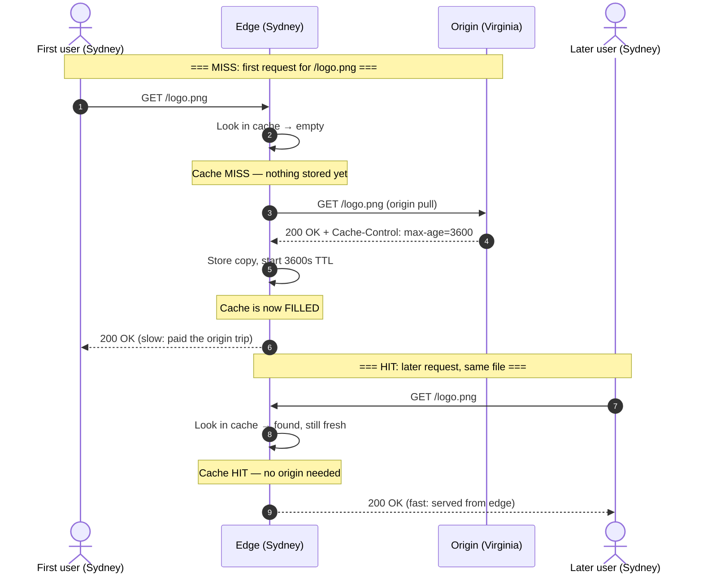

# Pull CDN — Junior

A **Content Delivery Network (CDN)** is a fleet of servers spread across the globe that keep copies of your content close to your users. A **pull CDN** is the most common flavour: it starts empty and *lazily* fetches content from your origin server the first time someone asks for it, then serves the cached copy to everyone else. This page builds the mental model from first principles: why a nearby copy is faster, how the "pull" happens, and what one request actually looks like — first as a miss, then as a hit.

## Table of Contents

1. [The problem: distance costs time](#1-the-problem-distance-costs-time)
2. [What a CDN is](#2-what-a-cdn-is)
3. [What "pull" means](#3-what-pull-means)
4. [A request walk-through: miss, then hit](#4-a-request-walk-through-miss-then-hit)
5. [How the edge knows what to cache and for how long](#5-how-the-edge-knows-what-to-cache-and-for-how-long)
6. [The first-request latency penalty](#6-the-first-request-latency-penalty)
7. [Pull vs push, at a glance](#7-pull-vs-push-at-a-glance)
8. [Key terms](#8-key-terms)

---

## 1. The problem: distance costs time

Your **origin** — the server that holds the authoritative copy of your files — lives in one place, say a data centre in Virginia. A user in Sydney is roughly 16,000 km away. Data cannot travel faster than light, and through fibre it moves slower still, so every round trip across the Pacific costs on the order of **200–300 ms** *before* the server has done any work. Load a page that needs a dozen images and scripts, and that tax is paid over and over.

The fix is simple to state: **don't make Sydney talk to Virginia**. Keep a copy of the file on a server *in* Sydney. A local round trip is a few milliseconds. That local server is called an **edge server** (or **PoP** — point of presence), and getting content onto edge servers near users is the entire job of a CDN.

## 2. What a CDN is

A CDN is a network of edge servers positioned in many cities worldwide, sitting *between* your users and your origin. When configured, users no longer connect to your origin directly — DNS routes them to the **nearest healthy edge**. That edge either already has the file (serve it instantly) or fetches it once and remembers it.

The payoff is threefold:

- **Lower latency** — content is served from a nearby edge, not a distant origin.
- **Less origin load** — the origin answers one request per file per edge, not one per user. If a million people request the same image, the origin may see it just a handful of times.
- **Resilience** — if the origin is briefly slow or down, edges can keep serving cached copies.

## 3. What "pull" means

There are two ways to get content onto the edges:

- **Push:** *you* upload files to the CDN ahead of time. The edge has the content before anyone asks.
- **Pull:** the edge starts *empty*. It fetches a file from your origin **the first time a user requests it**, caches the result, and serves that cached copy to everyone afterwards. This is "origin pull" — the edge pulls from origin on demand.

Pull is popular because it is almost zero-effort to run: you don't pre-upload anything or track what's stored where. You point the CDN at your origin, and the cache **fills itself** based on real traffic. Files nobody wants are never fetched; popular files end up cached at every edge that sees demand for them.

## 4. A request walk-through: miss, then hit

The whole model lives in two cases. The **first** request for a file at a given edge is a **cache miss** — the edge has nothing, so it must go to origin. **Every** request after that (until the copy expires) is a **cache hit** — served locally, no origin trip.



Read it as three phases. **Before:** the edge is empty. **During the miss:** the edge pulls from origin, stores the copy, and starts a countdown (the TTL). **After (hits):** requests are answered locally in milliseconds. The origin is touched exactly once per edge per file, no matter how many users follow.

## 5. How the edge knows what to cache and for how long

The origin tells the edge how to cache using the **`Cache-Control`** HTTP response header. The key piece for beginners is **`max-age`**, given in seconds — this is the **TTL** (time to live), the window during which the cached copy is considered **fresh** and can be served without re-checking origin.

```
Cache-Control: max-age=3600
```

This says: *"safe to reuse for one hour."* During that hour, every request is a hit served from the edge. When the hour is up, the copy is **stale**; the next request behaves like a miss again — the edge revalidates with (or re-fetches from) the origin, then restarts the clock.

| Header value | What the edge does |
| --- | --- |
| `Cache-Control: max-age=3600` | Cache for 1 hour; serve hits locally until then |
| `Cache-Control: max-age=31536000` | Cache for 1 year (typical for versioned static assets) |
| `Cache-Control: no-store` | Never cache; every request goes to origin |
| *(no header)* | The CDN applies a default TTL — don't rely on this; be explicit |

The lesson: **you** control caching from the origin. Long TTLs mean more hits and less origin load, but stale content lingers longer; short TTLs keep content fresh but cost more origin trips. Choosing that balance is a later topic — for now, know that the header is the steering wheel.

## 6. The first-request latency penalty

Pull's convenience has one honest cost: **the first user pays for everyone else.** On a cold cache, that first request doesn't just travel user → edge → user; it travels user → edge → *origin* → edge → user. For our Sydney user, that means eating the full transpacific round trip they were supposed to avoid — sometimes *slower* than having no CDN at all, because of the extra hop.

The important framing: this penalty is paid **once per file per edge**, then amortised across every subsequent visitor. If a file is requested a thousand times at an edge, one user is slow and 999 are fast. The busier and more popular the content, the more negligible the penalty becomes — which is exactly why pull CDNs shine for popular static assets and matter less for rarely-accessed ones (where every request risks being that unlucky first one).

## 7. Pull vs push, at a glance

| Aspect | Pull CDN | Push CDN |
| --- | --- | --- |
| Who fills the cache | Edge fetches on first request | You upload files ahead of time |
| Setup effort | Low — point CDN at origin | Higher — you manage uploads |
| First request | Slow (cache miss, origin pull) | Fast (already there) |
| Storage | Only what users actually request | Everything you push, wanted or not |
| Best for | Large libraries, popular assets, changing content | Small sets of known, must-be-warm files |

For most websites — images, CSS, JavaScript, fonts — the pull model is the sensible default: minimal operational overhead, self-populating cache, and a one-time penalty that popular traffic quickly washes out.

## 8. Key terms

| Term | Meaning |
| --- | --- |
| **Origin** | The authoritative server holding the real, up-to-date files |
| **Edge / PoP** | A CDN server near users that caches and serves copies |
| **Origin pull** | An edge fetching a file from origin on a cache miss |
| **Cache hit** | Request served from the edge's cache — fast, no origin trip |
| **Cache miss** | File not (yet) cached; edge must pull from origin |
| **Cache-fill** | Storing the pulled copy at the edge so later requests hit |
| **TTL / `max-age`** | How long a cached copy stays fresh before re-checking origin |
| **Fresh / stale** | Within TTL (reusable) / past TTL (must revalidate) |

**Sources:** [Cloudflare — What is a CDN?](https://www.cloudflare.com/learning/cdn/what-is-a-cdn/), [MDN — HTTP caching](https://developer.mozilla.org/en-US/docs/Web/HTTP/Caching), [RFC 9111 — HTTP Caching](https://www.rfc-editor.org/rfc/rfc9111).

*Next step:* [Pull CDN — Middle](middle.md)
