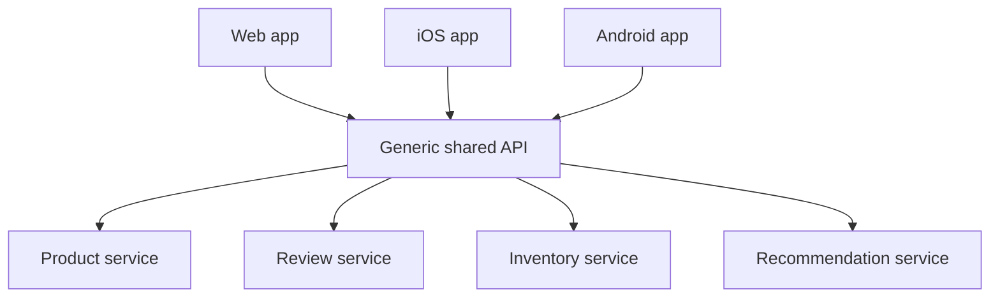
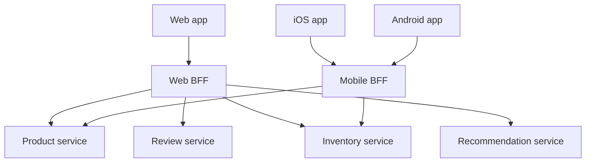

# Backends for Frontend — Junior

A **Backend for Frontend (BFF)** is a dedicated backend API built for one specific frontend — one BFF for the web app, another for iOS, another for Android. Each BFF calls the same downstream services but returns exactly the data that its frontend needs, in the shape that frontend wants. This page explains the problem BFF solves and the core idea, at a fundamentals level.

## Contents

1. [The problem: one generic API for every client](#1-the-problem-one-generic-api-for-every-client)
2. [The BFF idea](#2-the-bff-idea)
3. [Before vs after (diagram)](#3-before-vs-after-diagram)
4. [One BFF per client type](#4-one-bff-per-client-type)
5. [Shared generic API vs BFF](#5-shared-generic-api-vs-bff)
6. [BFF vs API gateway](#6-bff-vs-api-gateway)
7. [When you do and don't need a BFF](#7-when-you-do-and-dont-need-a-bff)
8. [Key terms](#8-key-terms)

---

## 1. The problem: one generic API for every client

Imagine a product with three frontends — a web app, an iOS app, and an Android app — all talking to the **same** general-purpose API. That API was designed to be neutral: it serves everyone, so it favors no one.

Different frontends have genuinely different needs:

- The **web** app has a large screen and a fast connection. It can show a rich product page with reviews, related items, and full descriptions.
- The **mobile** apps have small screens and slower, more expensive networks. A phone list view might need only a thumbnail, a title, and a price.

When one generic API serves all of them, three problems show up:

- **Over-fetching.** The mobile app asks for a product and receives the full web-sized payload — dozens of fields it will never render. Wasted bytes on a mobile network.
- **Many round trips (chattiness).** To build one screen, the client must call several endpoints — `/product`, then `/reviews`, then `/inventory`, then `/recommendations` — and stitch the results together. Each round trip adds latency, which hurts most on mobile.
- **Shaping logic in the client.** Because the API returns generic data, each frontend duplicates the same "combine and reshape" code. Fix a bug once, and you fix it three times.

The root cause: a single API cannot be optimal for clients with opposite constraints. Making it perfect for web makes it wrong for mobile, and vice versa.

## 2. The BFF idea

The BFF pattern (popularized by Sam Newman, samnewman.io, and Phil Calçado) is simple:

> Instead of every frontend calling one generic API, give **each frontend its own thin backend**. That backend calls the downstream services, aggregates and reshapes the results, and returns exactly what its frontend needs — nothing more, nothing less.

A BFF is:

- **Thin.** It contains no core business logic of its own. The real logic lives in the downstream services (product service, review service, inventory service). The BFF orchestrates and shapes.
- **Owned by the frontend team.** The team that builds the iOS app also owns the iOS BFF, so UI changes and their backend support ship together.
- **Tailored.** It exposes endpoints and payloads designed for one UI. The mobile BFF returns a compact list; the web BFF returns a rich page.

So the mobile app makes **one** call to its BFF ("give me the product screen"), and the BFF does the four downstream calls, merges the data, trims it to what a phone needs, and returns a single small response. The chattiness and over-fetching move off the slow mobile network and onto the fast, reliable network inside the data center.

## 3. Before vs after (diagram)

**Before** — every client hits one generic API and does its own shaping:

**After** — each client has its own BFF that aggregates the same services:

Notice two things in the "after" picture: the mobile BFF can skip services the mobile UI doesn't use (reviews, recommendations), and each frontend now talks to exactly one endpoint tailored to it.

## 4. One BFF per client type

The usual rule of thumb: **one BFF per frontend experience**, not one BFF per feature or per team-preference.

- Web and mobile have very different constraints, so they get separate BFFs.
- iOS and Android are often similar enough that they can share a single **mobile BFF** — the two apps have close to the same data needs. Split them only if their needs actually diverge.

The point is to align each BFF with a distinct kind of client. Their differing needs are what justify separate backends:

| Need | Web BFF | Mobile BFF |
|------|---------|------------|
| Payload size | Rich, many fields | Compact, minimal fields |
| Round trips per screen | Aggregate several services | Aggregate, but fewer — trim unused services |
| Images | Full-resolution URLs | Thumbnail / device-sized URLs |
| Extra sections (reviews, recommendations) | Included | Often omitted on small screens |
| Network assumption | Fast, cheap | Slower, metered, higher latency |

If web and mobile were forced to share one BFF, you would recreate the original generic-API problem — a backend that is a compromise for both instead of ideal for either.

## 5. Shared generic API vs BFF

| Aspect | Shared generic API | BFF |
|--------|-------------------|-----|
| Payload fit | Generic — clients over-fetch | Tailored — client gets exactly what it needs |
| Round trips per screen | Many (client stitches endpoints) | One (BFF aggregates server-side) |
| Shaping/aggregation logic | Duplicated in each client | Centralized in the BFF |
| Where chattiness happens | Over the client's network (often slow mobile) | Inside the data center (fast) |
| Coupling to a specific UI | Low, but at the cost of fit | Intentionally coupled to one UI |
| Number of backends to maintain | One | One per frontend |
| Team ownership | Shared/central team | Owned by the frontend team |

The trade-off is clear: a BFF fits the UI perfectly but costs you an extra backend to build and run for each frontend. That extra cost is worth it when clients have genuinely different needs; it is overhead when they don't.

## 6. BFF vs API gateway

A BFF is easy to confuse with an **API gateway**. They can sit in similar places, but they do different jobs.

- An **API gateway** is a single entry point that handles cross-cutting concerns for *all* traffic: routing, authentication, TLS termination, rate limiting, and basic request forwarding. It is generic and client-agnostic — it doesn't know or care which UI is calling.
- A **BFF** is client-specific. It knows the UI it serves and actively aggregates and reshapes downstream data for that UI. It contains logic about *what* one particular frontend needs.

| | API gateway | BFF |
|-|-------------|-----|
| Primary job | Routing + cross-cutting concerns | Aggregate + shape data for one UI |
| Client awareness | Generic (same for all clients) | Tailored to one frontend |
| Aggregates services? | Usually no (forwards requests) | Yes — that's the point |
| How many? | Typically one shared instance | One per frontend |

They also compose: a common setup has an API gateway at the edge handling auth and routing, sitting in front of several BFFs, each of which does the client-specific aggregation. The gateway handles the "for everyone" concerns; the BFF handles the "for this UI" concerns.

## 7. When you do and don't need a BFF

**Reach for a BFF when:**

- You have multiple frontends with clearly different data or performance needs (classic: web + mobile).
- Mobile clients suffer from over-fetching or too many round trips against a generic API.
- Frontend teams want to move fast and own the backend logic that supports their UI.

**You probably don't need one when:**

- You have a single frontend. A BFF for one client is just your API — no aggregation problem to solve.
- All your clients have nearly identical needs. The extra backend adds cost without buying you tailoring.
- Your team is small and the operational overhead of running an extra backend per frontend outweighs the benefit.

Start simple. Introduce a BFF when the pain of a shared generic API — over-fetching, chattiness, duplicated shaping — becomes real and measurable, not before.

## 8. Key terms

- **BFF (Backend for Frontend):** a thin backend dedicated to one frontend, aggregating and shaping downstream services for that specific UI.
- **Over-fetching:** receiving more data than the UI actually uses, wasting bandwidth.
- **Round trip / chattiness:** the number of separate requests a client must make to build one screen; more round trips means more latency.
- **Aggregation:** combining data from several downstream services into one response.
- **Downstream service:** a service the BFF calls to get data (product, reviews, inventory, etc.); the BFF holds no core business logic itself.
- **API gateway:** a generic, client-agnostic entry point for routing and cross-cutting concerns — distinct from a BFF, and often used alongside one.

---

*Next step:* [Backends for Frontend — Middle](middle.md)
