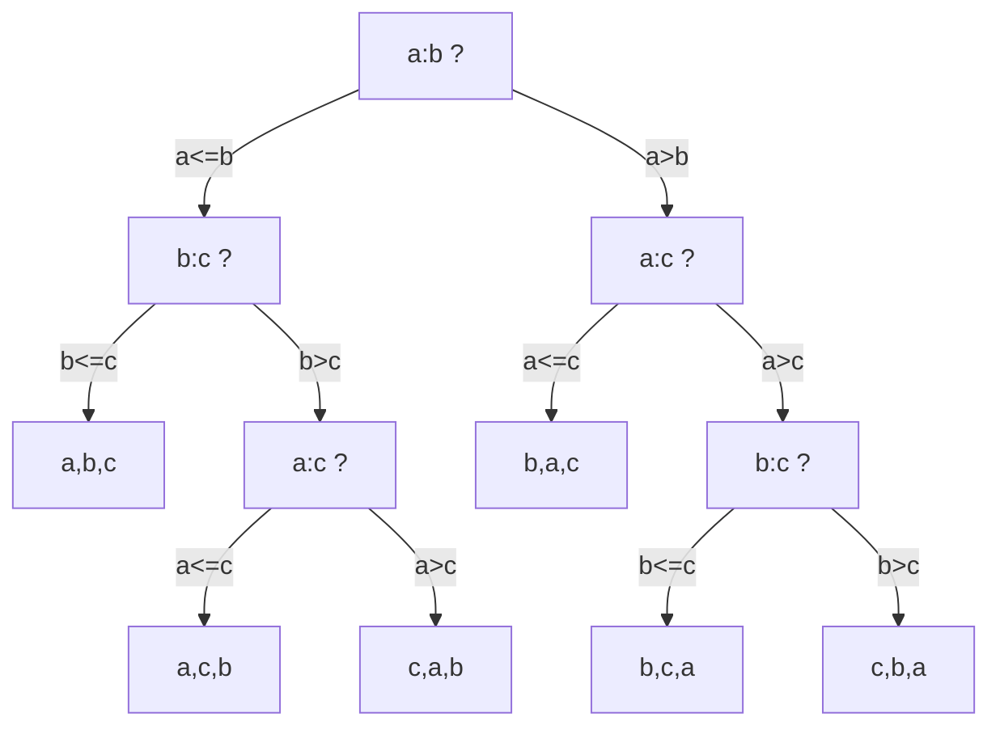
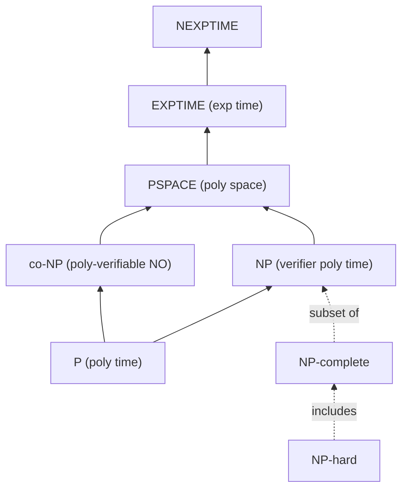

# Introduction to DSA — Mathematical Foundations of the Discipline

> **Audience:** Graduate students, research engineers, staff-level practitioners,
> and anyone who needs to read complexity-theoretic papers, prove bounds, or
> defend an algorithmic choice from first principles rather than folklore.
>
> **Posture:** This file treats "Introduction to Data Structures and Algorithms"
> not as a survey of structures (already covered in junior, middle, senior) but
> as a survey of the **mathematical scaffolding** underneath the entire field:
> machine models, asymptotic calculus, lower bounds, correctness proofs,
> amortized accounting, complexity classes, randomization, approximation,
> external memory, parallelism, and information theory.

---

## Table of Contents

1. [Formal Foundations — Machine Models](#1-formal-foundations--machine-models)
2. [Asymptotic Notation, Formally](#2-asymptotic-notation-formally)
3. [Lower Bounds and Decision Trees](#3-lower-bounds-and-decision-trees)
4. [Correctness via Loop Invariants](#4-correctness-via-loop-invariants)
5. [Amortized Analysis](#5-amortized-analysis)
6. [Complexity Classes — P, NP, NP-complete, co-NP, PSPACE](#6-complexity-classes)
7. [Randomized Algorithms — Las Vegas vs Monte Carlo](#7-randomized-algorithms)
8. [Approximation Algorithms](#8-approximation-algorithms)
9. [Cache-Oblivious and External-Memory Analysis](#9-cache-oblivious-and-external-memory-analysis)
10. [Parallel and Distributed Models](#10-parallel-and-distributed-models)
11. [Information-Theoretic and Entropy Bounds](#11-information-theoretic-and-entropy-bounds)
12. [Open Problems and Research Frontiers](#12-open-problems-and-research-frontiers)
13. [Comparison Table of Models](#13-comparison-table-of-models)
14. [Summary](#14-summary)

---

## 1. Formal Foundations — Machine Models

A complexity statement is meaningless without a machine model. The cost of a
primitive operation depends entirely on what hardware we pretend to compute on.
The field of DSA layers four canonical models, each capturing a different
abstraction boundary.

### 1.1 Turing Machine (TM)

The reference model of computability theory: a finite-state controller, one or
more tapes of unbounded length, a read/write head per tape, transitions over a
finite alphabet.

```text
TM = (Q, Sigma, Gamma, delta, q0, q_accept, q_reject)
  Q      = finite set of states
  Sigma  = input alphabet
  Gamma  = tape alphabet (Sigma subset of Gamma; includes blank)
  delta  : Q x Gamma -> Q x Gamma x {L, R}
  q0     = start state
```

- **Time complexity** = number of transitions before halting.
- **Space complexity** = number of tape cells visited.
- Multi-tape TMs are polynomially equivalent to single-tape (quadratic slowdown).
- The TM is the canonical model for defining P, NP, PSPACE, EXPTIME.

The TM is **too weak** for fine-grained DSA analysis because random access takes
linear time on a tape. We use it for class membership, not constants.

### 1.2 Random-Access Machine (RAM)

The model implicitly assumed in 99% of algorithm textbooks. The machine has:

```text
- A constant-size instruction set (load, store, add, compare, branch).
- A memory of cells indexed by integers; each cell holds a word.
- Each instruction is O(1).
- Word size w = Theta(log n) bits (so an index into n cells fits in a word).
```

Two sub-variants matter:

| Variant | Cost of arithmetic on a word |
|---|---|
| **Uniform-cost RAM** | O(1) regardless of word value |
| **Logarithmic-cost RAM** | O(log v) where v is the value being manipulated |

The uniform-cost RAM is the default. The word RAM (also called transdichotomous
model) additionally permits any operation a CPU can do on a word — multiplication,
shift, bit-count — in O(1).

### 1.3 Cell-Probe Model

A model used exclusively to prove **lower bounds for data structures**. Only memory
accesses are counted; CPU work is free.

```text
- Memory is divided into cells of w bits.
- A query is a sequence of cell probes; each probe can read or write one cell.
- Cost = number of probes. CPU computation is free.
- The data structure is a function from updates -> memory state and
  queries -> (probes, answer).
```

Because computation is free, any lower bound in the cell-probe model is also
a lower bound in the RAM, the EXTERNAL-memory model, and on any real CPU.
This makes cell-probe the **strongest** model for negative results. Patrascu's
2008 thesis is the standard reference; many tight bounds (e.g., partial sums,
union-find non-O(1)) are cell-probe results.

### 1.4 External-Memory (Disk Access) Model

Introduced by Aggarwal and Vitter (1988). Captures the I/O cost when the
working set does not fit in fast memory.

```text
- Internal (cache) memory of size M (in words).
- Unlimited external memory partitioned into blocks of size B.
- Each I/O moves one B-block between internal and external memory.
- Cost = number of I/Os. CPU work in internal memory is free.
```

Canonical bounds:

```text
Scan N elements:   Theta(N / B)
Sort N elements:   Theta((N / B) * log_{M/B}(N / B))
Search N (B-tree): Theta(log_B N)
```

A more refined model — the **ideal-cache model** — adds the assumption of
optimal replacement and full associativity, which is what cache-oblivious
algorithms target.

### 1.5 Why Four Models?

| Question | Correct model |
|---|---|
| Is the problem solvable at all? | Turing Machine |
| What is the time complexity on a typical CPU? | RAM (uniform-cost) |
| What is the lower bound for this data structure? | Cell-probe |
| Will my algorithm survive a disk-based workload? | External-memory |

A bound proven in a stronger model (cell-probe) implies bounds in weaker ones
(RAM, external-memory). A bound in a weaker model says nothing about stronger ones.

---

## 2. Asymptotic Notation, Formally

The informal "Big-O" of an undergraduate textbook collapses six distinct symbols
(O, Theta, Omega, o, omega, and the abuse `f = O(g)`) into one. We restore the
distinctions here.

### 2.1 Formal Definitions

Let `f, g : N -> R>=0` be functions on the positive integers.

```text
Big-O (upper bound, asymptotically):
  f(n) = O(g(n))   iff
    exists c > 0 and n0 in N such that for all n >= n0:
      f(n) <= c * g(n)

Big-Omega (lower bound, asymptotically):
  f(n) = Omega(g(n))   iff
    exists c > 0 and n0 in N such that for all n >= n0:
      f(n) >= c * g(n)

Big-Theta (tight bound):
  f(n) = Theta(g(n))   iff
    f(n) = O(g(n))   AND   f(n) = Omega(g(n))
  Equivalently: exists c1, c2 > 0 and n0 such that for all n >= n0:
      c1 * g(n) <= f(n) <= c2 * g(n)

little-o (strictly slower growth):
  f(n) = o(g(n))   iff
    for every c > 0, exists n0 such that for all n >= n0:
      f(n) < c * g(n)
  Equivalently: lim_{n->infinity} f(n) / g(n) = 0

little-omega (strictly faster growth):
  f(n) = omega(g(n))   iff
    for every c > 0, exists n0 such that for all n >= n0:
      f(n) > c * g(n)
  Equivalently: lim_{n->infinity} f(n) / g(n) = +infinity
```

The little-o definition is an **epsilon-style** statement quantified
universally over `c`; Big-O is existentially quantified. This is exactly the
distinction between "continuous" and "uniformly continuous" in analysis.

### 2.2 Algebraic Properties

```text
Reflexivity:    f = O(f),  f = Theta(f),  f = Omega(f)
Transitivity:   f = O(g) and g = O(h)  =>  f = O(h)
Symmetry:       f = Theta(g)  iff  g = Theta(f)
Asymmetry:      f = o(g)  =>  g != o(f)
Addition:       O(f) + O(g) = O(max(f, g))
Multiplication: O(f) * O(g) = O(f * g)
Constant fact:  O(c * f) = O(f)  for any constant c > 0
```

The notation `f = O(g)` is technically an **abuse** — it is a set-membership
statement, not equality. The pedantic form is `f in O(g)`. We follow tradition.

### 2.3 Worked Proof: `3n^2 + 2n + 1 = Theta(n^2)`

We prove both directions.

```text
Claim 1 (Upper):  3n^2 + 2n + 1 = O(n^2).

Goal: find c > 0 and n0 such that for all n >= n0:
      3n^2 + 2n + 1 <= c * n^2.

For all n >= 1:
      2n   <= 2n^2     (since n <= n^2)
      1    <= n^2      (since 1 <= n^2)

Therefore for all n >= 1:
      3n^2 + 2n + 1 <= 3n^2 + 2n^2 + n^2 = 6 * n^2.

Take c = 6 and n0 = 1.   QED.
```

```text
Claim 2 (Lower):  3n^2 + 2n + 1 = Omega(n^2).

Goal: find c > 0 and n0 such that for all n >= n0:
      3n^2 + 2n + 1 >= c * n^2.

Since 2n >= 0 and 1 >= 0 for all n >= 1:
      3n^2 + 2n + 1 >= 3 * n^2.

Take c = 3 and n0 = 1.   QED.
```

```text
Conclusion: by Claim 1 (c1 = 6) and Claim 2 (c2 = 3),
            3n^2 + 2n + 1 = Theta(n^2)   with n0 = 1.   QED.
```

The proof generalizes: every polynomial of degree `d` with positive leading
coefficient is `Theta(n^d)`. The leading term dominates; lower-order terms
and the leading coefficient are absorbed into the multiplicative constants.

### 2.4 Common Pitfalls

- `O(n^2)` is also `O(n^3)` (any upper bound that holds also holds for any
  larger function). Saying an algorithm "is" O(n^2) means **at most** n^2, not
  exactly n^2.
- `Theta` is what most programmers mean when they say "Big-O". Use `Theta` when
  you want to convey tightness.
- The constants suppressed by O can be enormous. The AKS sorting network is
  O(n log n) but with a constant in the hundreds; merge sort with constant ~2
  beats it for every realistic n.

---

## 3. Lower Bounds and Decision Trees

Upper bounds prove "we can do X". Lower bounds prove "no algorithm in this
model can do better than Y". The two together establish optimality.

### 3.1 The Comparison Model

In the **comparison model** the only inspection of input elements is the
binary comparison `a < b` (or `a <= b`, `a == b`). Arithmetic, hashing, and
indexing by value are forbidden. Sorting and searching algorithms that only
compare keys (merge sort, quicksort, heapsort, binary search) live in this
model.

### 3.2 Decision Tree for Sorting

An algorithm in the comparison model can be represented as a **binary decision
tree**:

- Each internal node is a comparison `a_i ? a_j`.
- Each leaf is labeled with a permutation of the input.
- The path from root to leaf represents the sequence of comparison outcomes
  that lead to that conclusion.



### 3.3 Theorem: Comparison Sorting Requires Omega(n log n) Comparisons

```text
Theorem: Any comparison-based sorting algorithm on n distinct elements
         performs Omega(n log n) comparisons in the worst case.

Proof:
  1. There are n! possible permutations of the input. The algorithm must
     distinguish among all of them (every permutation is a possible
     correct output).
  2. The decision tree has at least n! leaves (one per permutation).
  3. A binary tree of height h has at most 2^h leaves.
  4. Therefore h >= log_2(n!).
  5. By Stirling's approximation:
       log_2(n!) = log_2(sqrt(2*pi*n) * (n/e)^n) + O(1)
                 = n * log_2(n) - n * log_2(e) + (1/2) * log_2(n) + O(1)
                 = Theta(n log n).
  6. Worst-case running time >= worst-case path length = h = Omega(n log n).
  QED.
```

This is **tight**: merge sort and heapsort achieve O(n log n). Comparison
sorting is therefore Theta(n log n) — no clever trick within the comparison
model can break this barrier. Counting sort, radix sort, and bucket sort
escape the bound by leaving the comparison model entirely (they index by value).

### 3.4 Theorem: Search Requires Omega(log n) Comparisons

```text
Theorem: Any comparison-based search for a target in n sorted elements
         requires Omega(log n) comparisons in the worst case.

Proof sketch:
  - Decision tree has at least n+1 leaves: n positions where the target
    could be found, plus one "not found" leaf.
  - Tree height h satisfies h >= log_2(n+1) = Omega(log n).
  QED.
```

Binary search achieves O(log n), so the bound is tight. Hash tables beat
O(log n) only by leaving the comparison model (they index by hash value).

### 3.5 Adversary Arguments

A second technique for lower bounds. The "adversary" answers queries
consistently but always in a way that forces the algorithm to ask more
questions. For example, finding the maximum of `n` numbers requires `n - 1`
comparisons because the adversary can ensure that any element not yet
involved in a losing comparison could still be the maximum.

### 3.6 Cell-Probe Lower Bounds

The decision-tree argument generalizes to the cell-probe model. Patrascu and
Demaine showed that the partial-sum problem requires `Omega(log n / log log n)`
probes per operation. The proof uses an information-theoretic encoding argument:
if probes were too few, the algorithm could not have encoded enough information
about the input to answer queries correctly.

---

## 4. Correctness via Loop Invariants

Performance bounds are useless if the algorithm is wrong. Floyd-Hoare logic
gives us the tools to prove correctness mechanically.

### 4.1 The Hoare Triple

```text
{ P }  S  { Q }

reads:  if precondition P holds before executing statement S,
        then postcondition Q holds after S terminates.
```

For loops, we use the loop rule:

```text
{ I and B }  body  { I }            (the invariant is preserved)
-----------------------------------
{ I }  while B do body  { I and not B }
```

A **loop invariant** I is a predicate that:

1. Holds **before** the loop starts.
2. Is **preserved** by each iteration that satisfies the loop condition.
3. On exit, combined with `not B`, implies the postcondition.

To complete the proof we also show **termination**: a bound function `t` that
is well-founded (values in N) and strictly decreases each iteration.

### 4.2 Worked Example — Insertion Sort

```text
Algorithm INSERTION-SORT(A, n):
  1. for i = 1 to n - 1 do
  2.     key = A[i]
  3.     j = i - 1
  4.     while j >= 0 and A[j] > key do
  5.         A[j+1] = A[j]
  6.         j = j - 1
  7.     A[j+1] = key
```

**Precondition:** `A[0..n-1]` is an arbitrary array of `n` comparable elements.

**Postcondition:** `A[0..n-1]` is a permutation of the original array, and
`A[0] <= A[1] <= ... <= A[n-1]`.

### 4.3 Outer Loop Invariant

```text
Invariant I_outer:
  At the start of each iteration of the for loop indexed by i:
  (a) A[0..i-1] is a sorted permutation of the original A[0..i-1], and
  (b) A[i..n-1] is the original A[i..n-1] (untouched).
```

```text
Base case (i = 1):
  A[0..0] is a single element, trivially sorted; A[1..n-1] is the
  original unchanged suffix. I_outer holds.

Inductive step:
  Assume I_outer at the start of iteration i. We must show I_outer
  holds at the start of iteration i+1, i.e., A[0..i] is sorted and
  A[i+1..n-1] is unchanged.

  Inner loop body (lines 4-6) shifts elements of A[0..i-1] that are
  greater than key = A[i] one position right. Once the inner loop
  exits, line 7 places key in its correct position.

  The inner loop has its own invariant (I_inner below). After the
  inner loop and line 7, A[0..i] is a sorted permutation of the
  original A[0..i]. A[i+1..n-1] is never touched in iteration i
  (only A[j+1] for j < i is written). I_outer holds for i+1.
```

### 4.4 Inner Loop Invariant

```text
Invariant I_inner:
  At the start of each iteration of the while loop with current j:
  (a) A[0..j] union {A[j+2..i]} union {key} is a permutation of the
      original A[0..i].
  (b) A[j+2..i] is sorted.
  (c) Every element of A[j+2..i] is strictly greater than key.
```

```text
Base case (j = i-1):
  Position j+2 = i+1 > i, so A[j+2..i] is empty. (a) holds since
  A[0..i-1] is unchanged and key = A[i]. (b), (c) hold vacuously.

Inductive step:
  Assume I_inner at start of iteration with index j. The loop guard
  j >= 0 and A[j] > key is true, so we execute A[j+1] = A[j]; j--.

  After this, the new j' = j - 1. The element formerly at A[j]
  (call it x) was > key by the guard. Now A[j+1] = x, and A[j+2..i]
  was already sorted with all elements > key. Since x was originally
  immediately before A[j+1]'s old value (which is now at A[j+2]
  conceptually) and x > key... continuing the sort property, x is
  also > everything in A[j+2..i]'s original positions. Hence
  A[(j')+2..i] = A[j+1..i] is sorted, all > key. I_inner holds for j'.

Termination:
  Bound function t(j) = j + 1, which is non-negative and strictly
  decreases by 1 each iteration. The loop terminates when t = 0
  (j = -1) or when A[j] <= key.

Postcondition of inner loop combined with line 7:
  A[j+1] = key, A[0..j] is unchanged (all <= key by exit condition
  or because j = -1), A[j+2..i] is shifted right by one and all > key.
  Therefore A[0..i] is sorted.
```

### 4.5 Outer Loop Termination

```text
Bound function t_outer(i) = n - i, decreases by 1 each iteration,
bounded below by 0. After n - 1 iterations, the for loop exits.
```

### 4.6 Final Postcondition

On exit of the outer loop, `i = n`, so by I_outer (a), `A[0..n-1]` is a
sorted permutation of the original array. **QED.**

This level of rigor scales to any algorithm but is rarely written out in full
outside textbooks and formally-verified systems (CompCert, seL4, the Coq
standard library).

---

## 5. Amortized Analysis

Worst-case-per-operation analysis often overestimates the cost of a sequence
because expensive operations subsidize many cheap ones. Amortized analysis
charges each operation an "average" cost that, summed, upper-bounds the actual
total cost.

### 5.1 The Three Methods

| Method | Idea |
|---|---|
| **Aggregate** | Bound total cost T(n) of n operations directly, then divide. |
| **Accounting** | Charge each operation a fixed "amortized cost"; surplus stored as credits. |
| **Potential** | Define Phi : State -> R>=0; amortized cost = actual + Delta Phi. |

The three methods are mathematically equivalent — any bound provable in one is
provable in the others. The potential method generalizes best.

### 5.2 Aggregate Method — Dynamic Array Push (Full Derivation)

A dynamic array starts empty with capacity 1. On a push when `size = capacity`,
allocate a new array of `2 * capacity`, copy the `size` existing elements, and
insert. Otherwise, write to `data[size++]`.

```text
After n pushes, the array has resized at sizes 1, 2, 4, ..., 2^k
where 2^k <= n.

Cost of i-th push:
  c_i = i   if i - 1 is a power of 2 (resize triggered before push), plus
  c_i = 1   otherwise.

Total cost T(n) = n + sum_{j=0}^{floor(lg n)} 2^j
              = n + (2^{floor(lg n)+1} - 1)
              <= n + 2n
              = 3n.

Amortized cost per push = T(n) / n <= 3 = O(1).   QED.
```

### 5.3 Potential Method — Full Derivation for Dynamic Array Push

Define the **potential function**:

```text
Phi(D_i) = 2 * size_i - capacity_i
```

where `size_i` is the number of stored elements and `capacity_i` is the array
length after the `i`-th operation.

**Verify Phi >= 0:** The doubling policy guarantees `size >= capacity / 2` at
all times once the array has resized at least once (proven by induction:
just after a resize, `size = capacity / 2 + 1`, and `size` only grows until
the next resize). Therefore `2 * size - capacity >= 0`. Also `Phi(D_0) = 0`.

**Amortized cost** of the `i`-th push:

```text
a_i = c_i + Phi(D_i) - Phi(D_{i-1})
```

**Case A: no resize.** `c_i = 1`, `size_i = size_{i-1} + 1`,
`capacity_i = capacity_{i-1}`.

```text
a_i = 1 + (2 * (size_{i-1} + 1) - capacity_{i-1})
        - (2 * size_{i-1} - capacity_{i-1})
    = 1 + 2
    = 3
```

**Case B: resize.** Before the push, `size_{i-1} = capacity_{i-1} = m`. The
actual cost is `m + 1` (copy `m` elements, then write the new one). After
the resize and push, `size_i = m + 1` and `capacity_i = 2m`.

```text
Phi(D_{i-1}) = 2m - m = m
Phi(D_i)    = 2(m+1) - 2m = 2

a_i = (m + 1) + 2 - m
    = 3
```

In both cases `a_i = 3`. Summing over `n` operations:

```text
sum_{i=1}^n c_i = sum_{i=1}^n a_i - (Phi(D_n) - Phi(D_0))
              <= sum_{i=1}^n a_i
              = 3n.
```

The inequality uses `Phi(D_n) >= 0 = Phi(D_0)`. Therefore the amortized cost
per push is exactly **3 = O(1)**. **QED.**

### 5.4 Accounting Method — Same Result, Different Bookkeeping

Charge each push **3 credits**:

- 1 credit pays the immediate write.
- 1 credit is stored on the newly written element.
- 1 credit is stored on an "older" element that does not yet have a credit
  (specifically, on the element at index `size - capacity/2`).

When a resize from `m` to `2m` occurs, every one of the `m` elements has
exactly 1 credit, totaling `m` credits — enough to pay the `m` copy operations.
The credit invariant (non-negative balance) is preserved. **QED.**

### 5.5 Other Classical Amortized Results

| Operation | Amortized | Method |
|---|---|---|
| Dynamic array push | O(1) | Potential |
| Dynamic array push+pop with halving on 1/4 full | O(1) | Potential with Phi tracking distance from "ideal" load |
| Binary counter increment | O(1) | Aggregate |
| Splay tree access | O(log n) | Potential with sum of log(size) |
| Union-Find with path compression + union by rank | O(alpha(n)) | Potential with rank-based credits |
| Fibonacci heap decrease-key | O(1) | Potential with marked-node count |

The Fibonacci heap and union-find bounds are the deepest results in amortized
analysis and were both originally proven in the early 1980s by Tarjan and
collaborators.

---

## 6. Complexity Classes

### 6.1 The Hierarchy



### 6.2 Definitions

```text
P    = { L : L is decided by a deterministic TM in time n^O(1) }

NP   = { L : L is decided by a nondeterministic TM in time n^O(1) }
     = { L : there exists a polynomial-time verifier V such that
            x in L  iff  exists y, |y| = n^O(1), V(x, y) accepts }

co-NP = { L : the complement of L is in NP }

PSPACE = { L : L is decided by a deterministic TM in space n^O(1) }

EXPTIME = { L : L is decided by a deterministic TM in time 2^(n^O(1)) }
```

Known inclusions (all proper containment is open except where noted):

```text
P subset of NP subset of PSPACE subset of EXPTIME
P subset of co-NP subset of PSPACE
P != EXPTIME           (proven by the time hierarchy theorem)
P vs NP                (open)
NP vs co-NP            (open; NP = co-NP implies collapse of poly hierarchy)
NP vs PSPACE           (open)
```

### 6.3 NP-Completeness

A language `L` is **NP-hard** if every problem in NP reduces to `L` in
polynomial time. `L` is **NP-complete** if it is NP-hard and in NP.

```text
Definition: A polynomial-time many-one reduction f : L1 -> L2 is a
function computable in poly time such that
   x in L1  iff  f(x) in L2.
Written L1 <=_p L2.

If L is NP-complete and L in P, then P = NP.
```

### 6.4 Cook–Levin Theorem (Statement Only)

```text
Theorem (Cook 1971, Levin 1973):  SAT is NP-complete.

That is:
  (a) SAT in NP — a satisfying assignment is a polynomial-size witness
      verifiable in linear time.
  (b) For every L in NP, L <=_p SAT — given any NP machine M and input x,
      we construct in polynomial time a Boolean formula phi_{M,x} that is
      satisfiable iff M accepts x.
```

The proof encodes the tableau of a nondeterministic TM computation as Boolean
constraints — one variable per (cell, time, symbol), one clause per local
consistency condition. SAT is the seed from which most other NP-completeness
proofs grow via chains of reductions.

### 6.5 Why This Matters for Algorithm Selection

When you face a new problem, the first question is: **is it in P, or is it
NP-hard?**

- **In P** -> a polynomial algorithm exists; the question is how to find it.
- **NP-hard** -> stop looking for an exact polynomial algorithm. Instead:
  - Solve a special case in P.
  - Use a polynomial-time approximation algorithm (see Section 8).
  - Use a fixed-parameter tractable (FPT) algorithm if the relevant parameter
    is small.
  - Use a heuristic (SAT/ILP solver, simulated annealing) with no formal
    guarantee but reasonable practical performance.
  - Solve exactly only for small inputs via branch-and-bound.

This single discrimination — P or NP-hard — determines billions of dollars of
engineering decisions every year. Mistaking an NP-hard problem for a tractable
one leads to algorithms that work on test data and explode in production.

### 6.6 PSPACE and Beyond

```text
PSPACE-complete problems:
  - Quantified Boolean Formula (QBF / TQBF)
  - Generalized geography
  - Determining the winner of an n x n game of Go, Hex, Chess (with rules
    polynomial in n)
```

PSPACE captures problems with adversarial alternation. EXPTIME captures
problems requiring exponential time provably (chess on a real n x n board
endgame analysis is EXPTIME-complete).

### 6.7 Polynomial Hierarchy (Brief)

```text
Sigma_0^p = Pi_0^p = P
Sigma_{k+1}^p = NP^{Sigma_k^p}      (NP with oracle for Sigma_k^p)
Pi_{k+1}^p   = co-NP^{Sigma_k^p}

PH = union over k of Sigma_k^p.

Collapse theorem: if Sigma_k^p = Pi_k^p then PH collapses to level k.
```

The polynomial hierarchy is what would happen if you nested SAT-like problems
arbitrarily deep. PH is conjectured to be infinite; collapse would be a major
result with cryptographic consequences.

---

## 7. Randomized Algorithms

Randomized algorithms use a stream of random bits as input. Two flavors arise:

### 7.1 Las Vegas vs Monte Carlo

```text
Las Vegas:
  Always correct. Running time is a random variable.
  Bound the EXPECTED running time E[T(n)].

Monte Carlo:
  Always runs within a deterministic time bound.
  May produce a wrong answer with probability epsilon.
  Bound the ERROR probability Pr[wrong] <= epsilon.

Conversion:
  Monte Carlo -> Las Vegas: repeat until verified correct
                            (requires efficient verifier).
  Las Vegas   -> Monte Carlo: cut off at expected_time / epsilon.
```

| Algorithm | Type | Bound |
|---|---|---|
| Randomized quicksort | Las Vegas | E[T] = O(n log n) |
| Miller–Rabin primality | Monte Carlo | Pr[error] <= (1/4)^k |
| Karger's min-cut | Monte Carlo | Pr[correct] >= 1/n^2 (single run) |
| Universal hashing | Las Vegas | E[collisions] = O(1) |
| Bloom filter membership | Monte Carlo (one-sided) | Pr[false positive] <= eps |

### 7.2 Expected vs High-Probability Bounds

A bound `E[T(n)] = O(f(n))` says the average over the random coins is bounded.
A bound `Pr[T(n) > c * f(n)] < 1/n^k` (a **with-high-probability** or w.h.p.
bound) is much stronger — it says deviations are exponentially rare.

By Markov's inequality, `E[T] <= f(n)` implies `Pr[T >= 2 f(n)] <= 1/2`, which
is weak. A w.h.p. bound requires concentration inequalities.

### 7.3 Chernoff and Hoeffding Bounds (Statements)

```text
Chernoff (multiplicative form):
  Let X_1, ..., X_n be independent {0,1} random variables, X = sum X_i,
  mu = E[X]. For 0 < delta <= 1:
      Pr[X >= (1 + delta) mu] <= exp(-mu * delta^2 / 3)
      Pr[X <= (1 - delta) mu] <= exp(-mu * delta^2 / 2)

Hoeffding (additive form):
  Let X_1, ..., X_n be independent with X_i in [a_i, b_i], X = sum X_i.
  For t > 0:
      Pr[ |X - E[X]| >= t ] <= 2 * exp(-2 t^2 / sum (b_i - a_i)^2)
```

Both bounds say "the sum of many independent bounded random variables is
tightly concentrated around its mean". They are the workhorse tools for
turning expected-time bounds into w.h.p. bounds.

### 7.4 Worked Application: Randomized Quicksort

```text
Pivot chosen uniformly at random from the subarray.

Let X_{ij} = indicator that elements ranked i-th and j-th are compared.
A direct calculation gives:
    E[X_{ij}] = 2 / (j - i + 1)

Expected comparisons:
    E[comparisons] = sum_{i<j} E[X_{ij}]
                   = sum_{i<j} 2/(j - i + 1)
                   = 2 sum_{k=2}^n (n - k + 1) / k
                   = 2 n H_n - O(n)
                   = 2 n ln n + O(n)
                   = O(n log n).

A Chernoff-style argument upgrades this to:
    Pr[comparisons > c n log n] <= 1/n^2 for sufficiently large c.
```

### 7.5 Derandomization

Three standard techniques convert a randomized algorithm to a deterministic one:

| Technique | Idea |
|---|---|
| **Method of conditional expectations** | Greedily fix each random bit to maintain a low expected cost. |
| **Pairwise/k-wise independence** | Replace full independence with a small sample space, often polynomial size. |
| **Pseudorandom generators (PRGs)** | If P = BPP, every randomized algorithm has a deterministic poly-time simulation. PRGs exist conditionally on hardness assumptions. |

Derandomization is mostly of theoretical interest; in practice, randomized
algorithms with cryptographic-quality RNGs are accepted as "deterministic
enough".

---

## 8. Approximation Algorithms

When a problem is NP-hard, we cannot expect an exact polynomial algorithm. We
settle for a near-optimal answer in polynomial time.

### 8.1 Approximation Ratio

```text
For a minimization problem with optimal cost OPT(x) on input x and
an algorithm A producing cost A(x):

  Algorithm A is an alpha-approximation iff for all x:
      A(x) / OPT(x) <= alpha
  (alpha >= 1 for minimization).

For maximization:
  A(x) / OPT(x) >= 1/alpha   (alpha >= 1).
```

### 8.2 The Hierarchy

```text
PTAS  (Polynomial-Time Approximation Scheme):
  For every fixed eps > 0, runs in polynomial time and returns a
  (1 + eps)-approximation. Running time may be poly(n) but
  exponential in 1/eps.

FPTAS (Fully Polynomial-Time Approximation Scheme):
  PTAS where the running time is also polynomial in 1/eps.

APX:
  Class of problems with a constant-factor (alpha = O(1)) approximation.

Log-APX, Poly-APX:
  Problems with O(log n) or n^O(1) approximation ratios.

APX-hard:
  Problems for which any constant-factor approximation implies
  P = NP (or the inapproximability assumption fails).
```

### 8.3 Worked Example: 2-Approximation for Minimum Vertex Cover

```text
Problem: Given graph G = (V, E), find a minimum subset C of V such
         that every edge has at least one endpoint in C.

Algorithm GREEDY-MATCHING-COVER(G):
  1. C = empty set
  2. while there is an uncovered edge (u, v) do
  3.     C = C union {u, v}
  4.     remove all edges incident to u or v
  5. return C

Claim: GREEDY-MATCHING-COVER is a 2-approximation.

Proof:
  Let M be the set of edges chosen in step 2 across all iterations.
  These edges form a MATCHING (no two share an endpoint, by the
  removal in step 4).

  |C| = 2 * |M|.

  Any vertex cover must include at least one endpoint of every
  edge in M. Since edges in M are vertex-disjoint:
      OPT >= |M|.

  Therefore |C| = 2 * |M| <= 2 * OPT.   QED.
```

Despite decades of work, no better-than-2 approximation is known for vertex
cover, and Khot's Unique Games Conjecture implies 2 is optimal.

### 8.4 Inapproximability

The PCP theorem (Arora, Lund, Motwani, Sudan, Szegedy 1992) showed that
MAX-3SAT cannot be approximated within `7/8 + eps` unless P = NP. This was
a watershed result: it transferred the P-vs-NP distinction from "exact
solvability" to "even approximate solvability".

### 8.5 The Bigger Picture

| Problem | Best ratio | Hardness |
|---|---|---|
| Vertex cover | 2 | 2 - eps (under UGC) |
| Set cover | ln n | ln n - eps (under P != NP) |
| Max-3SAT | 7/8 | 7/8 + eps (under P != NP) |
| TSP (metric) | 3/2 (Christofides) | 1.0045 inapproximable |
| TSP (general) | None within any factor | Inapproximable |
| Knapsack | 1 + eps (FPTAS) | NP-hard but FPTAS exists |

---

## 9. Cache-Oblivious and External-Memory Analysis

### 9.1 The External-Memory Model (Recap)

Parameters: `N` (input size), `M` (cache size), `B` (block size), all measured
in words, with `M >= B`. Cost = I/Os; CPU work in cache is free.

Canonical bounds:

```text
Scan:               Theta(N / B)
Sort:               Theta((N / B) * log_{M/B}(N / B))      (Aggarwal-Vitter)
Permute:            Theta(min(N, (N/B) * log_{M/B}(N/B)))
Predecessor / Search (B-tree):  Theta(log_B N)
```

### 9.2 The Cache-Oblivious Model

Same as external-memory **except** the algorithm does not know `M` or `B`.
Replacement is assumed optimal (LRU is within constant factor by Sleator–Tarjan).
A cache-oblivious algorithm that is optimal in this model is automatically
optimal at every level of a multi-level memory hierarchy.

### 9.3 Van Emde Boas Layout

Given a complete binary tree of `N` nodes (height `h = log_2 N`):

```text
Recursive layout vEB(T):
  1. If T has one node, store it.
  2. Otherwise, split T at height h/2:
       top    = subtree of height h/2 containing the root
       bottoms = sqrt(N) subtrees of height h/2 hanging off top's leaves
  3. Store vEB(top) followed by vEB(bottom_1), vEB(bottom_2), ...
```

```text
Theorem: Searching a vEB-laid-out tree costs O(log_B N) I/Os, without
         knowing B.

Proof sketch: consider the level of recursion at which sub-trees have
size at most B. There are O(log_B N) such "boundary" levels along any
root-to-leaf path. Within each contiguous sub-tree of size <= B, the
search is free (one block load). Sub-trees at finer recursion are
free for the same reason. Total cost: O(log_B N).   QED.
```

The vEB layout matches the B-tree bound **without specialization** to a
particular B. The same memory image is optimal for L1, L2, L3, and disk
simultaneously.

### 9.4 Funnel Sort

Frigo, Leiserson, Prokop, Ramachandran (1999) gave a cache-oblivious sort
matching the Aggarwal-Vitter bound `O((N / B) log_{M/B}(N / B))`. The
recursive funnel structure interleaves merging stages of geometrically
increasing size.

### 9.5 Why Cache-Aware Algorithms Still Matter

Cache-oblivious algorithms are asymptotically optimal across all cache levels,
but constants matter. Cache-aware algorithms (e.g., classical B-trees with
B tuned to the disk block) often beat cache-oblivious algorithms in practice
on a single specific memory hierarchy. Modern databases tend to use cache-aware
designs; cache-oblivious algorithms are favored in research code and on
heterogeneous hardware.

---

## 10. Parallel and Distributed Models

### 10.1 PRAM (Parallel Random-Access Machine)

```text
PRAM model:
  - p processors, each like a RAM.
  - Shared memory accessible by any processor in O(1).
  - Synchronous execution.

Variants by concurrency policy:
  EREW  Exclusive Read, Exclusive Write
  CREW  Concurrent Read, Exclusive Write
  CRCW  Concurrent Read, Concurrent Write   (with arbitrary, common, or
                                             priority tie-breaking)
```

CRCW is strictly stronger than CREW which is strictly stronger than EREW, but
all three are polynomially equivalent in time when p = poly(n).

### 10.2 Work–Span Analysis

For a parallel algorithm:

```text
Work T_1   = total operations (cost on 1 processor)
Span T_inf = critical-path length (cost on infinite processors)

On p processors (Brent's theorem):
    T_p <= T_1/p + T_inf

Speedup    S_p = T_1 / T_p
Parallelism P  = T_1 / T_inf
```

A parallel algorithm is **work-efficient** if `T_1 = O(T_{seq})` where
`T_{seq}` is the best sequential bound. The goal is small span without
inflating work.

```text
Algorithm           Work T_1       Span T_inf
Reduce sum          O(n)           O(log n)
Prefix sum          O(n)           O(log n)
Merge sort          O(n log n)     O(log^3 n)  (parallel merge)
Quicksort           O(n log n) E   O(log^2 n) w.h.p.
Matrix multiply     O(n^3)         O(log n)    (Strassen variants different)
```

### 10.3 MapReduce / MPC Model

The Massively Parallel Computation (MPC) model formalizes MapReduce, Spark,
and Hadoop:

```text
- m machines, each with local memory s (typically s = n^alpha for alpha < 1).
- Total memory M = m * s = O(n^{1+epsilon}).
- Computation proceeds in synchronous rounds:
    Round = (local computation) + (all-to-all communication of <= s words)
- Cost measured in number of rounds.
```

Sorting in MPC takes `O(log_s n)` rounds. Connectivity is also `O(log_s n)`.
The frontier of MPC research is reducing the round complexity of graph problems
to constant or `O(log log n)`.

### 10.4 CAP Theorem in This Framework

The **CAP theorem** (Brewer 2000, formalized by Gilbert-Lynch 2002) states that
a distributed system cannot simultaneously provide all three of:

- **Consistency** — every read observes the most recent write.
- **Availability** — every request receives a non-error response.
- **Partition tolerance** — the system continues to operate during message loss.

```text
Theorem (Gilbert-Lynch 2002): In an asynchronous network model, no
protocol can implement an atomic register that is both available
and consistent under arbitrary network partitions.
```

In our framework, this is a **lower bound** in a model that has been extended
with crash/omission failures. The CAP theorem sits alongside other distributed
impossibilities — FLP (no deterministic consensus with even one crash failure
in asynchrony), Lower bounds for Byzantine agreement (need n > 3f), Lamport's
lower bound on rounds for distributed consensus.

---

## 11. Information-Theoretic and Entropy Bounds

Some lower bounds come not from machine models but from **how much information
the output must convey**.

### 11.1 Sorting from Entropy

The output of a comparison-based sort is one of `n!` permutations. Encoding the
chosen permutation requires `log_2(n!) = Theta(n log n)` bits. Each comparison
yields at most 1 bit of information (yes/no). Therefore the algorithm must
perform at least `log_2(n!) = Omega(n log n)` comparisons.

This is the same `Omega(n log n)` lower bound as Section 3, derived not from
decision-tree height but from **Shannon entropy of the output distribution**.
The two arguments are equivalent: the decision tree's leaves correspond to
possible outputs, and tree height equals the minimum encoding length.

### 11.2 Binary Search from Entropy

The output of "search in n elements" is one of `n + 1` answers (positions 0
through n-1, plus "not found"). Encoding this answer requires
`log_2(n + 1) = Omega(log n)` bits. Each comparison yields one bit. Thus
`Omega(log n)` comparisons are required.

### 11.3 Hash-Based vs Comparison-Based

Hash tables beat the `Omega(log n)` search lower bound because they receive
**more than one bit per probe**: a hash value can be `Theta(log n)` bits,
collapsing the search in a single probe. This is why hash tables sit outside
the comparison model and achieve `O(1)` expected lookup.

### 11.4 Yao's Minimax Principle

```text
For any randomized algorithm A and any input distribution D over inputs:
    max_x E_A[cost(A on x)] >= min_A E_{x ~ D}[cost(A on x)]
```

In English: the worst-case expected cost of any randomized algorithm is at
least the best expected cost on the worst input distribution. This is the
standard tool for proving randomized lower bounds.

### 11.5 Communication Complexity

Two parties Alice and Bob hold inputs `x` and `y`. They want to compute `f(x, y)`
by exchanging bits. Communication complexity `CC(f)` is the minimum number of
bits exchanged in the worst case. Connections to data structures:

- **Cell-probe lower bounds** often reduce to communication-complexity lower
  bounds on a related two-party problem.
- **Index** (`f(x, i) = x_i`) has `CC = log(n)` deterministic but `O(1)`
  randomized — a separation between models.
- **Set disjointness** has `CC = Omega(n)` randomized, a key tool for streaming
  lower bounds.

---

## 12. Open Problems and Research Frontiers

### 12.1 P vs NP

```text
P =? NP

Status: open since 1971. Most researchers conjecture P != NP.
Implications if P = NP:
  - Every problem with a poly-checkable solution has a poly-time algorithm.
  - Public-key cryptography breaks.
  - Most NP-complete problems trivially solvable.
Implications if P != NP:
  - Justifies inapproximability results that currently rely on this assumption.
  - Establishes fundamental computational asymmetry between finding and
    verifying.
```

The Clay Mathematics Institute offers $1M for a resolution. Major barriers
to proof:

- **Relativization** (Baker-Gill-Solovay 1975): some oracles separate P from
  NP, others collapse them. Any proof must use non-relativizing techniques.
- **Natural proofs** (Razborov-Rudich 1997): a natural proof of circuit lower
  bounds would yield a polynomial-time distinguisher against strong PRGs,
  contradicting cryptographic assumptions.
- **Algebraic barriers** (Aaronson-Wigderson 2008).

### 12.2 Unique Games Conjecture (UGC)

```text
Conjecture (Khot 2002): For every eps > 0, there exists k such that
distinguishing unique-games instances with value >= 1 - eps from
instances with value <= eps is NP-hard.
```

UGC implies optimal inapproximability for vertex cover, max-cut, and many
other problems. Its truth is one of the most active questions in complexity
theory; partial progress (the "2-to-2 games theorem", Khot-Minzer-Safra 2018)
suggests UGC is on the way to being proved.

### 12.3 NL vs L

```text
NL =? L

L  = deterministic log-space
NL = nondeterministic log-space

Savitch's theorem: NL subset of L^2 (deterministic poly-log space).
Immerman-Szelepcsenyi: NL = co-NL.
Open: does L = NL?
```

### 12.4 Other Active Areas

- **Fine-grained complexity:** assuming SETH (Strong Exponential Time
  Hypothesis), nearly-matching lower bounds for polynomial-time problems
  (Edit distance is `Omega(n^{2-o(1)})` under SETH).
- **Streaming and sublinear algorithms:** approximate solutions using
  `o(n)` memory with formal guarantees.
- **Quantum complexity:** BQP, the class solvable in polynomial time on a
  quantum computer, contains factoring (Shor) but its relationship to NP
  is unknown.
- **Differential privacy:** algorithmic guarantees on individual data
  exposure, increasingly intertwined with statistical learning theory.

---

## 13. Comparison Table of Models

| Model | What it captures | What it ignores | Use when |
|---|---|---|---|
| **Turing Machine** | Decidability, class membership (P, NP, ...) | Constants, cache, parallelism, I/O | Defining complexity classes; impossibility results |
| **RAM (uniform-cost)** | Wall-clock time on a single CPU | Cache, I/O, parallelism, large-integer arithmetic | Default algorithm analysis |
| **Word RAM** | RAM + word-level bit tricks (popcount, multiply) | Cache, I/O | Algorithms exploiting CPU instruction set |
| **Cell-probe** | Memory accesses (CPU free) | Concurrency, I/O blocks | Data-structure lower bounds |
| **External-memory (DAM)** | I/Os between cache and disk | Cache hierarchy beyond two levels | Algorithms operating on data > RAM |
| **Cache-oblivious** | I/Os without parameter knowledge | Replacement policy details | Portable algorithms across hierarchies |
| **PRAM (EREW/CREW/CRCW)** | Synchronous shared-memory parallelism | Network latency, asynchrony | Shared-memory parallel algorithm design |
| **MPC / MapReduce** | Round complexity in distributed memory | Synchronization cost, fault tolerance | Big-data systems analysis |
| **Streaming** | Space-limited single-pass computation | I/O, parallelism | Sublinear-space problems |
| **Communication complexity** | Bits exchanged between parties | Local CPU work | Lower bounds for distributed protocols, data structures |
| **BQP (quantum)** | Polynomial quantum time | Decoherence, NISQ noise | Quantum algorithm design |

A bound proven in a stronger model carries down to weaker ones; a bound in a
weaker model says nothing about stronger ones. The cell-probe model is the
strongest of the realistic models for data-structure lower bounds.

---

## 14. Summary

### 14.1 Key Results to Internalize

1. **Machine models are not interchangeable.** The TM defines what is
   computable, the RAM what is "polynomial", the cell-probe what is the
   absolute lower bound, the external-memory model what is feasible on
   real disks. Always state your model before stating a bound.

2. **Asymptotic notation is a calculus, not a guess.** Big-O, Big-Theta,
   Big-Omega, little-o, little-omega are each a quantifier-pattern over
   constants. Theta is what you want when you say "exactly this growth
   rate"; O is an upper bound only.

3. **Comparison-based sorting is Theta(n log n).** This is information-theoretic
   (entropy of permutations) and decision-tree-based; the two proofs converge.
   Anything faster (counting/radix sort) escapes the comparison model.

4. **Loop invariants give mechanizable correctness proofs.** Floyd-Hoare logic
   reduces correctness to (a) invariant initialization, (b) invariant
   maintenance, (c) postcondition implication, (d) well-founded termination.

5. **Amortized analysis is the right framing for resizing structures.** The
   potential method (Phi : State -> R>=0, amortized = actual + Delta Phi) is
   the most general; aggregate and accounting methods are special cases.

6. **Complexity classes give us decision boundaries.** P vs NP-hard is the
   single most important question to answer about a new problem. If NP-hard,
   the right responses are approximation, FPT, heuristics, or restricted
   special cases.

7. **Randomization buys speed at the cost of probabilistic guarantees.**
   Las Vegas: always correct, expected time. Monte Carlo: bounded time,
   bounded error. Chernoff / Hoeffding bounds convert expected results
   into w.h.p. results.

8. **Approximation algorithms have a rich hierarchy.** PTAS, FPTAS, APX,
   poly-APX, log-APX. PCP theorem and UGC place tight hardness ceilings
   on what is approximable.

9. **The memory hierarchy is part of the model.** External-memory and
   cache-oblivious algorithms achieve `Theta(N/B)` scan, `Theta(log_B N)`
   search, `Theta((N/B) log_{M/B}(N/B))` sort — bounds that classical
   RAM analysis cannot express.

10. **Parallel and distributed computing have their own complexity theories.**
    PRAM (work, span), MPC (rounds), and the CAP / FLP impossibilities for
    distributed consensus all live alongside classical sequential analysis.

11. **Some lower bounds come from information, not computation.** Output
    entropy alone implies `Omega(n log n)` for sorting and `Omega(log n)`
    for search. Yao's minimax extends this to randomized algorithms.

12. **The field is open.** P vs NP, NL vs L, the Unique Games Conjecture,
    and dozens of fine-grained-complexity questions are alive. Reading
    contemporary STOC / FOCS / SODA proceedings is the only way to track
    the frontier.

### 14.2 Reading the Field

A researcher or staff-level engineer should be able to:

- State the time and space complexity of an algorithm in the correct model.
- Write a loop-invariant correctness proof for a non-trivial loop.
- Apply the potential method to a new amortized analysis.
- Identify when a problem is NP-hard and pick the appropriate response.
- Read a paper that claims a `Theta((N/B) log_{M/B}(N/B))` bound and know
  what model is implied.
- Distinguish "expected" from "with high probability" and use Chernoff.

These are the load-bearing skills that turn an engineer into someone who can
**design new algorithms**, not just apply existing ones.

### 14.3 Further Reading

- Cormen, Leiserson, Rivest, Stein. *Introduction to Algorithms* (4th ed.),
  Chapters on amortized analysis, randomized algorithms, and NP-completeness.
- Arora, Barak. *Computational Complexity: A Modern Approach.* Cambridge
  University Press, 2009. The canonical modern complexity-theory text.
- Sipser. *Introduction to the Theory of Computation* (3rd ed.). Cengage, 2012.
  Standard formal-foundations reference.
- Motwani, Raghavan. *Randomized Algorithms.* Cambridge, 1995. Chernoff,
  Hoeffding, Yao, and the standard probabilistic toolbox.
- Vazirani. *Approximation Algorithms.* Springer, 2001. Classical reference
  for the approximation hierarchy.
- Williamson, Shmoys. *The Design of Approximation Algorithms.* Cambridge,
  2011. Modern complement to Vazirani.
- Frigo, Leiserson, Prokop, Ramachandran. "Cache-Oblivious Algorithms."
  FOCS 1999. The original cache-oblivious paper.
- Aggarwal, Vitter. "The Input/Output Complexity of Sorting and Related
  Problems." *Communications of the ACM*, 1988.
- Patrascu. "Lower Bound Techniques for Data Structures." PhD thesis, MIT, 2008.
- Karchmer. *Communication Complexity: A New Approach to Circuit Depth.* MIT
  Press, 1989.
- Goldreich. *Computational Complexity: A Conceptual Perspective.* Cambridge,
  2008.

---

*This document is the theoretical backbone of the entire Data Structures and
Algorithms roadmap. The junior, middle, and senior files teach how to use
data structures; this file teaches the language in which their bounds are
stated and proved.*
