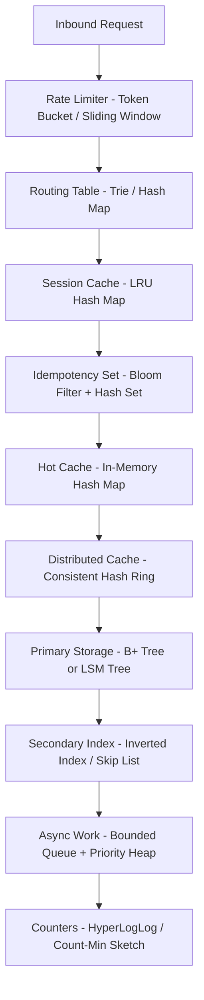
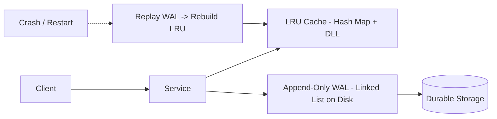
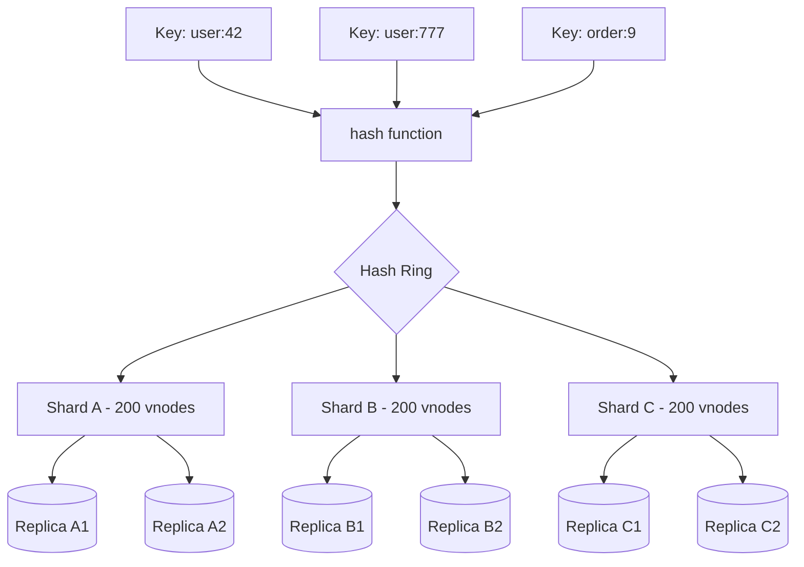
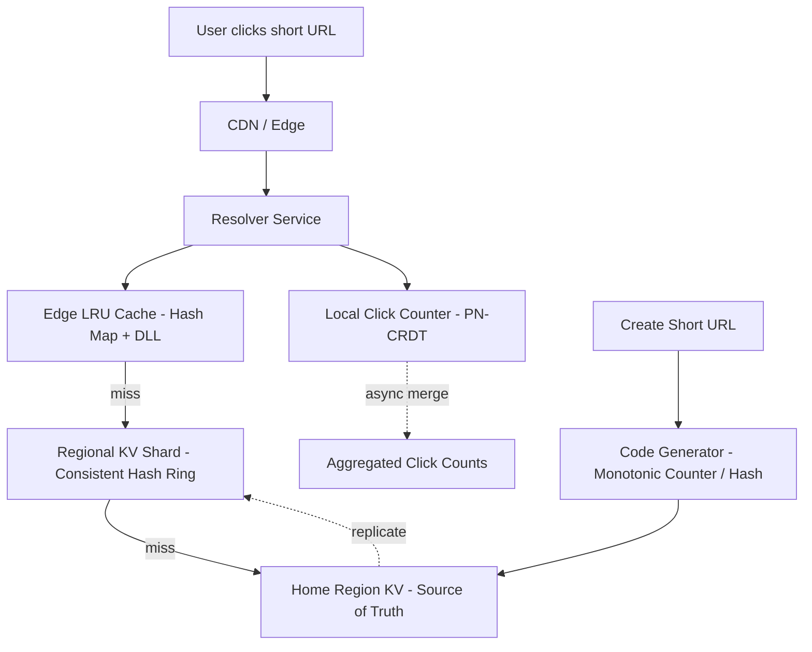
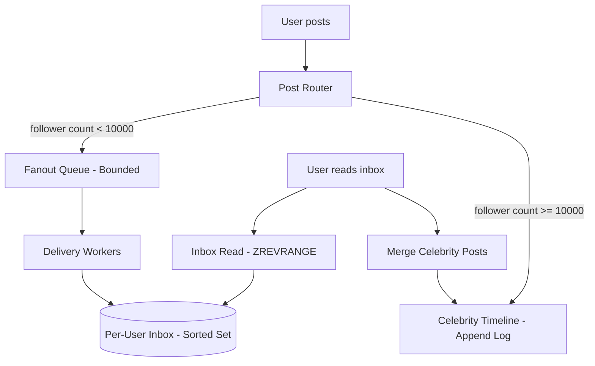

# Introduction to Data Structures and Algorithms — Senior Level

## Table of Contents

1. [Introduction](#introduction)
2. [DSA at the System Boundary](#dsa-at-the-system-boundary)
3. [System Design with DSA](#system-design-with-dsa)
4. [Distributed Data Structures](#distributed-data-structures)
5. [Latency, Memory, and Cache Budgets](#latency-memory-and-cache-budgets)
6. [Concurrency in DSA](#concurrency-in-dsa)
7. [Code Examples](#code-examples)
8. [Observability for Data Structures](#observability-for-data-structures)
9. [Failure Modes and Mitigations](#failure-modes-and-mitigations)
10. [When DSA Choices Shape Architecture](#when-dsa-choices-shape-architecture)
11. [Senior-Level Anti-Patterns](#senior-level-anti-patterns)
12. [Summary](#summary)
13. [Further Reading](#further-reading)

---

## Introduction

> Focus: "How do data structure and algorithm choices propagate through the architecture of a production system?"

At the junior level, DSA is a vocabulary: array, map, queue, BFS, binary search. At the middle level, DSA is a decision framework: read the access pattern, pick the structure, justify the trade-off, and compose primitives into hybrids. At the senior level, DSA stops being a per-function concern and becomes an architectural force. The data structure you place in the hot path is not just a class in a file — it is a contract with every operator, every replica, every region, every alerting rule, and every postmortem your service will ever produce.

A senior engineer designs systems around DSA invariants. They reason about p999 latency budgets the way a junior reasons about Big-O. They know that a hash table's expected O(1) is a lie under adversarial input, that a queue with unbounded capacity is a memory leak with a different name, and that a "cache" is just a data structure with an eviction policy and an SLO. They know which structures degrade gracefully and which fail catastrophically. They know that a bad asymptotic choice at the wrong layer can wake an on-call engineer at 3 a.m. because the database CPU is pinned at 100% — and the actual root cause is an O(n) operation hiding inside an O(1) name.

This file builds on the junior and middle materials. It assumes you already know:

- How to read an access pattern and pick a structure (middle).
- How to compose primitives — LRU = hash map plus doubly linked list, top-K = hash map plus heap, online median = two heaps.
- How to read a Big-O table and where the hidden constants lie.

The senior view adds: distribution, concurrency, memory layout, failure modes, observability, and the architectural ripple effect that follows every DSA decision.

---

## DSA at the System Boundary

Senior work is mostly about the boundaries between systems: between threads, between processes, between services, between regions, between users and the database. DSA shows up at every boundary in three forms:

### 1. As the wire shape

What goes across the boundary determines what structure you can use. A list of events on a message queue is a sequence — readers will scan it. A primary key in a request is a key — writers will hash it. A user identifier in a URL is the shard key — and once you choose it, you have implicitly committed to a partitioning scheme for the lifetime of the data.

### 2. As the storage shape

Disk layout, page size, B+ tree fan-out, LSM level multiplier, SSTable block size. The data structure on disk is a long-term commitment because changing it is a migration, not a refactor. A "schema change" is usually a data structure change with downtime attached.

### 3. As the in-memory state

The structures inside one process — the LRU, the rate limiter buckets, the priority queue of work items, the connection pool. These are the easiest to change but the most likely to be wrong, because under load they grow, contend, and evict in ways that pass code review and fail production.

A useful mental model is the **DSA Stack** for a request:



Every layer is a data structure decision. Every layer has its own SLO, its own failure mode, and its own observability surface. The senior engineer designs the stack so the failure of any one layer degrades the system gracefully into the layer below — never sideways into an unrelated subsystem.

---

## System Design with DSA

### Pattern 1: LRU plus Write-Ahead Log for Durable Caches

A pure in-memory LRU loses everything on crash. A pure on-disk LRU is too slow. The standard senior solution composes them: an in-memory hash-map-plus-doubly-linked-list LRU absorbs reads, while every mutation is also appended to a write-ahead log on durable storage. On recovery, replay the log into a fresh LRU. The LRU is the access path; the WAL is the source of truth.



Trade-offs: write latency is now bounded by the WAL fsync, not the LRU. Throughput is bounded by sequential disk write speed, which is excellent on SSDs but a real ceiling on spinning disks. Recovery time is linear in the WAL length, so you also need periodic snapshots — a checkpoint of the LRU that lets you truncate the WAL to the last snapshot.

### Pattern 2: Consistent Hash Ring for Sharded State

When state outgrows one node, the question is not "should we shard" but "what is the shard key, and how do we handle resharding without dropping traffic?" A consistent hash ring with virtual nodes is the standard answer. Each key hashes to a point on a circle; each shard owns an arc. Adding a shard reassigns ~1/N of keys; removing one reassigns the same.



The architectural ripple: once you commit to a shard key, every cross-shard query becomes a scatter-gather, every transaction across shards needs two-phase commit or saga compensation, and every hot key becomes a hot shard. Senior engineers pick shard keys to make the access pattern almost entirely intra-shard — if a query needs data from many shards, that is a sign the shard key is wrong, not that the system needs a better query planner.

### Pattern 3: Write-Behind (Write-Back) Cache

The cache accepts writes synchronously, acknowledges to the client, and flushes to durable storage asynchronously. This dramatically reduces write latency but introduces a window of data loss on crash. It is appropriate when the data is regenerable (e.g., session state) or when the cache itself is replicated (e.g., Redis Sentinel).

### Pattern 4: CQRS with Specialized Views

Command Query Responsibility Segregation splits the system into a write side optimized for ingest and a read side optimized for queries. The write side is often an append-only log. The read side is a family of materialized views, each backed by the data structure that fits its query: a hash map for point lookups, a sorted set for leaderboards, an inverted index for search, a HyperLogLog for cardinality. Each view can be rebuilt by replaying the log.

### Pattern 5: Bloom Filter as Negative Cache

When a lookup miss is expensive — e.g., querying disk on every miss of an in-memory cache — a Bloom filter sits in front of the cache to answer "definitely not present, do not bother." This is how LevelDB and RocksDB avoid disk I/O for non-existent keys. The trade is a small false-positive rate (you sometimes look up keys that are not there) for the elimination of all true negatives.

### Pattern 6: Count-Min Sketch and HyperLogLog for Sublinear Telemetry

You cannot afford to keep every distinct user identifier ever seen — that is unbounded growth. You can afford a 12 KB HyperLogLog that estimates distinct count with ~1% error. You cannot afford to keep every URL hit count — but you can keep a Count-Min Sketch that approximates the top-K with bounded memory. These are not curiosities; they are how production analytics systems run at scale.

### Pattern Selection Cheat Sheet

| If your problem looks like... | Use this composition |
|-------------------------------|---------------------|
| "Cache reads of frequently accessed keys" | LRU (hash map + DLL) + TTL + write-around |
| "Cache reads, survive restart" | LRU + WAL + periodic snapshot |
| "Spread keys across nodes, minimize churn on scale" | Consistent hash ring with virtual nodes |
| "Recent activity in last N seconds" | Ring buffer / sliding window |
| "Top-K most frequent items in a stream" | Count-Min Sketch + min-heap |
| "Did we already process this event?" | Bloom filter (negative cache) + hash set (truth) |
| "Approximate distinct count, huge volume" | HyperLogLog per dimension |
| "Range queries on time" | B+ tree or skip list keyed by timestamp |
| "Write-heavy with occasional range scans" | LSM tree (memtable + SSTables) |
| "Multi-region writes with eventual convergence" | CRDT (G-Counter, OR-Set, LWW-Register) |
| "Coordinate exactly-once work" | Distributed log + idempotency key set |
| "Rate limit per user" | Token bucket / leaky bucket per key |

---

## Distributed Data Structures

The single-node Big-O table evaporates the moment data crosses a network. Distributed structures trade strong consistency for availability, durability for latency, or coordination overhead for convergence guarantees. Senior engineers know not just what each structure does but which CAP corner it occupies and which consistency model it offers.

| Structure | Consistency Model | Coordination | Primary Use | Failure Mode |
|-----------|-------------------|--------------|-------------|--------------|
| **Distributed hash table (DHT)** | Eventual or strong (per design) | Gossip or consensus | Key routing in P2P, Cassandra ring | Hot partition, ring imbalance |
| **Consistent hash ring** | Routing only (no replication semantic) | Membership service | Sharded caches, load balancing | Stale view of ring -> requests to wrong node |
| **CRDT (G-Counter, OR-Set, LWW)** | Strong eventual | None at write time | Multi-region collaborative state | Anomalies under tombstone GC, metadata growth |
| **Bloom filter (replicated)** | Per-replica | None | Negative cache across nodes | False positive rate drift as set grows |
| **HyperLogLog (mergeable)** | Per-replica, mergeable | None | Distinct counts across shards | ~1% error inherent; sensitive to hash quality |
| **LSM tree (per node)** | Single-node strong | Local | Write-heavy KV store (RocksDB, Cassandra) | Write/read/space amplification, compaction stalls |
| **B+ tree (per node)** | Single-node strong | Local | Read-heavy OLTP indexes | Random I/O, page splits, fragmentation |
| **Gossip-replicated counter** | Eventual | Gossip protocol | Cluster metrics, membership | Convergence delay; bounded staleness only |
| **Distributed skip list (CockroachDB)** | MVCC + Raft | Per-range consensus | Range-partitioned KV with SQL | Lease transfer hiccups, raft snapshot pressure |
| **Raft log / Paxos log** | Strong (linearizable) | Quorum write | Metadata, leader election, configuration | Leader failover latency, write unavailability when no quorum |
| **Merkle tree** | N/A (verification) | None | Anti-entropy in Dynamo-style stores | Tree depth -> repair cost |
| **Vector clock / version vector** | Causal | Per-key | Detecting concurrent updates | Metadata grows with writer count |

### Distributed Coordination Primitives

Underneath these structures sit two universal primitives:

- **Consensus (Raft, Paxos, ZAB):** a replicated log with linearizable writes. Used for leader election, configuration, locks, and metadata. Throughput is bounded by quorum round-trip latency, so you do not put hot user data here.
- **Anti-entropy and gossip:** background reconciliation of replicas that drifted. Used by Dynamo, Cassandra, Consul. Trades immediate consistency for availability under partitions.

A senior reflex when designing distributed state: **separate the data plane from the control plane**. The control plane (membership, config, sharding map) is small, low-volume, and goes through consensus. The data plane (user state) is high-volume and goes through eventually consistent or per-shard-strong structures. Never put user data behind a single Raft group; never put config behind gossip.

### CRDT Family Quick Reference

| CRDT | Type | Property |
|------|------|----------|
| G-Counter | State-based | Only increment, merge by per-actor max |
| PN-Counter | State-based | Two G-Counters: positive and negative |
| G-Set | State-based | Only add; merge by union |
| 2P-Set | State-based | Add + remove (tombstones), no re-add |
| OR-Set | State-based | Observed-Remove: add wins on concurrent add/remove |
| LWW-Register | State-based | Last writer wins, requires synchronized clocks (caveat: clock skew) |
| MV-Register | State-based | Returns all concurrent values for the app to resolve |
| RGA / Yjs / Automerge | Sequence | Collaborative text editing |

The CRDT cost is metadata: tombstones for removes, version vectors per element, dot stores. CRDT-heavy systems must run periodic GC of causal metadata or they degrade over months. This is rarely visible on day one and always visible on day 365.

---

## Latency, Memory, and Cache Budgets

A senior engineer reasons in budgets, not asymptotics. The Big-O is the asymptote; the budget is the contract.

### Latency Budget Reasoning

A user-facing request has an end-to-end SLO — say, p99 of 300 ms. That budget is split across hops: DNS, TLS, load balancer, edge, service, cache, database, downstream calls. Each hop gets a slice. Inside one service, the slice is split across the data structures the request touches.

| Hop | Typical p99 budget |
|-----|---------------------|
| TLS handshake (reused) | 1-3 ms |
| Load balancer | 1-2 ms |
| Service entry to first cache touch | 1-5 ms |
| In-memory hash lookup | < 0.1 ms |
| Local disk read (NVMe) | 0.1-0.5 ms |
| Same-region cache (Redis) | 0.5-2 ms |
| Same-region database (point read) | 1-5 ms |
| Cross-AZ network round-trip | 1-2 ms |
| Cross-region round-trip | 30-150 ms (geography-dependent) |

The architectural constraint follows directly: at p99 = 300 ms with a 100 ms cross-region round-trip, you get at most two synchronous cross-region calls before you have spent your whole budget. So the data structure plan is shaped by the latency budget: if your write path must replicate across regions for durability, that replication is asynchronous, and you commit to a CRDT or LWW resolution scheme — not to synchronous Raft across regions.

### Why p999 Matters

p50 and p99 are routine; **p999 is the failure mode**. A garbage collector pause, a long lock wait, a hash collision storm, a cache miss followed by a database miss — these show up at p999 long before they show up in averages. Senior engineers track p999 because that is where rare events congregate, and rare events are what wake on-call engineers when traffic spikes.

The relationship is not linear. A hash table with an average lookup of 100 ns can have a p999 of 100 ms if rehashing happens to land in the path of a single request. A linked list whose tail you keep cached has an average traversal of one cache line and a p999 of an L3-to-DRAM miss, which is 100x slower. Asymptotic analysis hides this. Tail-latency analysis surfaces it.

### Memory Budget Reasoning

A 64 GB machine running a JVM gives you maybe 48 GB of usable heap after the OS and overhead. A 24-thread service competing for that heap means each cache, each queue, each in-flight request structure must fit inside a slice. Senior engineers do back-of-envelope arithmetic before writing code:

- 1 million entries in a Java HashMap<Long, String> with average 16-character values: ~120 MB (huge overhead from Entry objects, Long boxing, String headers).
- 1 million entries in a Go `map[int64]string` with same values: ~50 MB.
- 1 million entries in a HyperLogLog: 12 KB total, regardless of distinct count.
- 1 million elements in a Bloom filter with 1% FPR: ~1.2 MB.
- 1 million elements in a Bloom filter with 0.001% FPR: ~3.6 MB.

The HyperLogLog and the Bloom filter are not magic; they are the price you pay for losing exactness. The senior reflex is to ask, "Do I need an exact answer?" before reaching for the exact data structure.

### Cache Locality at Scale

CPU caches are the unsung Big-O multiplier. The same algorithm with the same asymptotic cost runs 10-100x faster if the data is laid out for the cache. Three rules:

1. **Sequential beats random.** A scan over an array beats a scan over a linked list every time, even when both are O(n), because the array prefetcher predicts the next cache line.
2. **Hot data should fit in L2.** If your inner loop touches more than ~256 KB of distinct memory per iteration, you are paying L3 or DRAM latency on every access. Structure-of-arrays (SoA) instead of array-of-structures (AoS) often fixes this.
3. **Pointer chasing is poison.** A doubly linked list with allocated-anywhere nodes is the worst case for the cache. An intrusive linked list embedded in a slab allocator is much better. If you can replace a linked list with a ring buffer, do it.

### NUMA Awareness

On multi-socket servers, memory is not uniformly accessible. Memory allocated on socket A is much slower to read from a thread pinned to socket B. For data structures whose performance matters:

- Pin thread pools to NUMA nodes.
- Use per-node allocators (e.g., jemalloc with NUMA awareness, Linux `mbind`).
- Replicate read-mostly structures per NUMA node rather than sharing one and paying cross-socket cache coherency traffic.
- Avoid shared atomic counters in hot paths; use per-CPU or per-thread counters and aggregate on read (`LongAdder` in Java, sharded counters in Go).

NUMA effects rarely matter for small services. They matter enormously for high-throughput services running on the largest machines you can buy.

---

## Concurrency in DSA

The moment more than one thread touches a data structure, the structure becomes a synchronization primitive. The Big-O cost stays the same on paper. The wall-clock cost depends on how often threads contend.

### Three Concurrency Strategies

| Strategy | When to use | Cost model |
|----------|------------|-----------|
| **Coarse lock** | Low contention, simple correctness | One mutex; latency = sum of critical sections |
| **Fine-grained / striped lock** | High contention, partitionable state | N mutexes; latency = max per stripe |
| **Lock-free (CAS-based)** | Very high throughput, simple operations | Atomic CAS; cost dominated by contention/retry |
| **Wait-free** | Hard real-time, fairness guaranteed | Hardest to design; usually limited operations |
| **CRDT / immutable / log-structured** | Distributed, partition-tolerant | No coordination; price is metadata and convergence delay |

### When Each Wins

- **Coarse lock (one `sync.Mutex` or `synchronized`):** wins for low contention. A counter that gets incremented 1k/sec by a single thread is just a `var x int64` behind a mutex. Spending a week on a lock-free queue here is engineering vanity.
- **Striped lock:** the workhorse for hot caches and metrics maps. `ConcurrentHashMap` in Java uses 16-64 stripes by default. Go's standard library `sync.Map` is even more aggressive, using read-mostly atomic snapshots. Pick the number of stripes to be at least 2-4x the thread count.
- **Lock-free:** wins under sustained high contention where lock-holders block thousands of waiters. Lock-free queues (Michael-Scott, LMAX Disruptor) and lock-free stacks are battle-tested. Hand-rolling lock-free trees, however, is almost always a mistake — the ABA problem and memory reclamation (hazard pointers, epoch-based reclamation) are subtle, and the gains rarely justify the bugs.
- **CRDT:** wins when there is no shared memory at all — replicas across regions, offline clients. The metaphor flips: you stop preventing concurrent updates and start designing for them.

### The Real Cost of a Lock

A single uncontended mutex acquire-release is ~20 ns. A contended mutex with one waiter sleeping in the kernel is ~5-10 microseconds. Under heavy contention with many waiters, latency degrades to milliseconds and throughput collapses (the convoy effect). The fix is almost always to reduce critical section size — never hold a lock across I/O, never hold a lock while computing — or to shard.

### Read-Write Locks: Often a Trap

A `RWMutex` looks like an obvious win for read-heavy workloads, but it has hidden costs:

- The fast path (write lock) is slower than a plain mutex because reads must be counted.
- Reader starvation or writer starvation, depending on policy.
- Cache-line bouncing on the reader counter.

Benchmark before assuming. For very read-heavy data, often a copy-on-write atomic pointer ("publish a new snapshot") is faster than a `RWMutex`.

### Memory Reclamation in Lock-Free Structures

In a lock-free linked list, when does it become safe to free a removed node? Another thread might still be reading it. The answer is one of: hazard pointers, epoch-based reclamation (used in `crossbeam` for Rust, similar in Go's `runtime` for some structures), or RCU (read-copy-update) in the Linux kernel. This problem alone is why lock-free structures are best consumed as libraries, not written from scratch in application code.

---

## Code Examples

Three production-grade concurrent patterns, in Go, Java, then Python. Each is ~30-60 lines of real, runnable code, picked for senior-level relevance: a sharded thread-safe bounded LRU, a single-flight (request coalescing) deduplicator, and a probabilistic cache-stampede protection (XFetch).

### Example 1: Sharded Thread-Safe Bounded LRU Cache

#### Go

```go
package main

import (
	"container/list"
	"fmt"
	"hash/fnv"
	"sync"
)

type shard struct {
	mu       sync.Mutex
	capacity int
	order    *list.List
	index    map[string]*list.Element
}

type entry struct {
	key   string
	value any
}

func newShard(cap int) *shard {
	return &shard{capacity: cap, order: list.New(), index: make(map[string]*list.Element)}
}

func (s *shard) get(k string) (any, bool) {
	s.mu.Lock()
	defer s.mu.Unlock()
	if el, ok := s.index[k]; ok {
		s.order.MoveToFront(el)
		return el.Value.(*entry).value, true
	}
	return nil, false
}

func (s *shard) put(k string, v any) {
	s.mu.Lock()
	defer s.mu.Unlock()
	if el, ok := s.index[k]; ok {
		s.order.MoveToFront(el)
		el.Value.(*entry).value = v
		return
	}
	if s.order.Len() >= s.capacity {
		victim := s.order.Back()
		s.order.Remove(victim)
		delete(s.index, victim.Value.(*entry).key)
	}
	el := s.order.PushFront(&entry{k, v})
	s.index[k] = el
}

type ShardedLRU struct {
	shards []*shard
	mask   uint32
}

func NewShardedLRU(totalCap, numShards int) *ShardedLRU {
	per := totalCap / numShards
	shards := make([]*shard, numShards)
	for i := range shards {
		shards[i] = newShard(per)
	}
	return &ShardedLRU{shards: shards, mask: uint32(numShards - 1)}
}

func (c *ShardedLRU) shardFor(k string) *shard {
	h := fnv.New32a()
	h.Write([]byte(k))
	return c.shards[h.Sum32()&c.mask]
}

func (c *ShardedLRU) Get(k string) (any, bool) { return c.shardFor(k).get(k) }
func (c *ShardedLRU) Put(k string, v any)      { c.shardFor(k).put(k, v) }

func main() {
	c := NewShardedLRU(1024, 16) // power-of-two shard count -> mask works
	c.Put("user:42", "Alice")
	v, ok := c.Get("user:42")
	fmt.Println(v, ok)
}
```

#### Java

```java
import java.util.*;
import java.util.concurrent.locks.ReentrantLock;

public class ShardedLRU<K, V> {

    private static final class Shard<K, V> extends LinkedHashMap<K, V> {
        private final int capacity;
        private final ReentrantLock lock = new ReentrantLock();

        Shard(int capacity) {
            super(16, 0.75f, true); // access-order
            this.capacity = capacity;
        }

        @Override
        protected boolean removeEldestEntry(Map.Entry<K, V> eldest) {
            return size() > capacity;
        }

        V getLocked(K k) {
            lock.lock();
            try { return get(k); } finally { lock.unlock(); }
        }

        void putLocked(K k, V v) {
            lock.lock();
            try { put(k, v); } finally { lock.unlock(); }
        }
    }

    private final Shard<K, V>[] shards;
    private final int mask;

    @SuppressWarnings("unchecked")
    public ShardedLRU(int totalCapacity, int numShards) {
        if (Integer.bitCount(numShards) != 1) {
            throw new IllegalArgumentException("numShards must be power of two");
        }
        this.shards = new Shard[numShards];
        int per = totalCapacity / numShards;
        for (int i = 0; i < numShards; i++) shards[i] = new Shard<>(per);
        this.mask = numShards - 1;
    }

    private Shard<K, V> shardFor(K k) {
        int h = k.hashCode();
        h ^= (h >>> 16); // spread bits, same trick as HashMap
        return shards[h & mask];
    }

    public V get(K k) { return shardFor(k).getLocked(k); }
    public void put(K k, V v) { shardFor(k).putLocked(k, v); }

    public static void main(String[] args) {
        ShardedLRU<String, String> c = new ShardedLRU<>(1024, 16);
        c.put("user:42", "Alice");
        System.out.println(c.get("user:42"));
    }
}
```

#### Python

```python
import threading
from collections import OrderedDict


class _Shard:
    __slots__ = ("capacity", "data", "lock")

    def __init__(self, capacity: int) -> None:
        self.capacity = capacity
        self.data: OrderedDict = OrderedDict()
        self.lock = threading.Lock()

    def get(self, key):
        with self.lock:
            if key not in self.data:
                return None
            self.data.move_to_end(key)
            return self.data[key]

    def put(self, key, value) -> None:
        with self.lock:
            if key in self.data:
                self.data.move_to_end(key)
                self.data[key] = value
                return
            if len(self.data) >= self.capacity:
                self.data.popitem(last=False)
            self.data[key] = value


class ShardedLRU:
    """Sharded LRU. Each shard is independently locked, reducing contention."""

    def __init__(self, total_capacity: int, num_shards: int = 16) -> None:
        if num_shards & (num_shards - 1):
            raise ValueError("num_shards must be a power of two")
        per = total_capacity // num_shards
        self._shards = [_Shard(per) for _ in range(num_shards)]
        self._mask = num_shards - 1

    def _shard(self, key):
        # Python's hash is randomized per-process; that's fine here.
        return self._shards[hash(key) & self._mask]

    def get(self, key):
        return self._shard(key).get(key)

    def put(self, key, value) -> None:
        self._shard(key).put(key, value)


if __name__ == "__main__":
    c = ShardedLRU(total_capacity=1024, num_shards=16)
    c.put("user:42", "Alice")
    print(c.get("user:42"))
```

### Example 2: Single-Flight (Request Coalescing)

Goal: when N concurrent callers ask for the same expensive key, only one underlying fetch runs; the rest share the result.

#### Go

```go
package main

import (
	"fmt"
	"sync"
	"time"
)

type result struct {
	val any
	err error
}

type call struct {
	wg  sync.WaitGroup
	res result
}

type SingleFlight struct {
	mu     sync.Mutex
	in     map[string]*call
}

func NewSingleFlight() *SingleFlight {
	return &SingleFlight{in: make(map[string]*call)}
}

func (sf *SingleFlight) Do(key string, fn func() (any, error)) (any, error) {
	sf.mu.Lock()
	if c, ok := sf.in[key]; ok {
		sf.mu.Unlock()
		c.wg.Wait()
		return c.res.val, c.res.err
	}
	c := &call{}
	c.wg.Add(1)
	sf.in[key] = c
	sf.mu.Unlock()

	c.res.val, c.res.err = fn() // run the actual fetch
	c.wg.Done()

	sf.mu.Lock()
	delete(sf.in, key)
	sf.mu.Unlock()
	return c.res.val, c.res.err
}

func main() {
	sf := NewSingleFlight()
	var wg sync.WaitGroup
	var fetched int64
	var mu sync.Mutex

	for i := 0; i < 100; i++ {
		wg.Add(1)
		go func() {
			defer wg.Done()
			_, _ = sf.Do("user:42", func() (any, error) {
				mu.Lock(); fetched++; mu.Unlock()
				time.Sleep(50 * time.Millisecond)
				return "Alice", nil
			})
		}()
	}
	wg.Wait()
	fmt.Printf("underlying fetches: %d (should be 1)\n", fetched)
}
```

#### Java

```java
import java.util.concurrent.*;
import java.util.concurrent.atomic.AtomicInteger;

public class SingleFlight<V> {

    @FunctionalInterface
    public interface Loader<V> { V load() throws Exception; }

    private final ConcurrentHashMap<String, CompletableFuture<V>> inFlight =
        new ConcurrentHashMap<>();

    public V execute(String key, Loader<V> loader) throws Exception {
        CompletableFuture<V> mine = new CompletableFuture<>();
        CompletableFuture<V> existing = inFlight.putIfAbsent(key, mine);
        if (existing != null) {
            return existing.get(); // join the in-flight call
        }
        try {
            V v = loader.load();
            mine.complete(v);
            return v;
        } catch (Exception e) {
            mine.completeExceptionally(e);
            throw e;
        } finally {
            inFlight.remove(key, mine);
        }
    }

    public static void main(String[] args) throws Exception {
        SingleFlight<String> sf = new SingleFlight<>();
        AtomicInteger fetches = new AtomicInteger();
        ExecutorService pool = Executors.newFixedThreadPool(32);
        CountDownLatch done = new CountDownLatch(100);

        for (int i = 0; i < 100; i++) {
            pool.submit(() -> {
                try {
                    sf.execute("user:42", () -> {
                        fetches.incrementAndGet();
                        Thread.sleep(50);
                        return "Alice";
                    });
                } catch (Exception ignored) {
                } finally {
                    done.countDown();
                }
            });
        }
        done.await(5, TimeUnit.SECONDS);
        pool.shutdown();
        System.out.println("underlying fetches: " + fetches.get() + " (should be 1)");
    }
}
```

#### Python

```python
import threading
import time
from typing import Any, Callable


class SingleFlight:
    """Coalesces concurrent calls for the same key into one underlying call."""

    def __init__(self) -> None:
        self._lock = threading.Lock()
        self._in_flight: dict[str, threading.Event] = {}
        self._results: dict[str, tuple[Any, BaseException | None]] = {}

    def do(self, key: str, fn: Callable[[], Any]) -> Any:
        with self._lock:
            event = self._in_flight.get(key)
            if event is not None:
                # somebody else is already fetching this key
                pass
            else:
                event = threading.Event()
                self._in_flight[key] = event

        if event.is_set() is False and self._in_flight.get(key) is event and key not in self._results:
            # we are the leader; do the work
            try:
                value, err = fn(), None
            except BaseException as e:  # noqa: BLE001
                value, err = None, e
            with self._lock:
                self._results[key] = (value, err)
                self._in_flight.pop(key, None)
            event.set()
        else:
            event.wait()

        value, err = self._results.get(key, (None, None))
        if err is not None:
            raise err
        return value


if __name__ == "__main__":
    sf = SingleFlight()
    fetches = 0
    fetches_lock = threading.Lock()

    def slow_lookup() -> str:
        global fetches
        with fetches_lock:
            fetches += 1
        time.sleep(0.05)
        return "Alice"

    threads = [threading.Thread(target=sf.do, args=("user:42", slow_lookup)) for _ in range(100)]
    for t in threads:
        t.start()
    for t in threads:
        t.join()
    print(f"underlying fetches: {fetches} (should be 1)")
```

### Example 3: Probabilistic Cache-Stampede Protection (XFetch)

Even with single-flight, all clients eventually see the same TTL expire and stampede. XFetch lets one caller probabilistically refresh slightly *before* the TTL expires, so the refresh happens off the critical path.

#### Go

```go
package main

import (
	"fmt"
	"math"
	"math/rand"
	"sync"
	"time"
)

type cacheEntry struct {
	value    any
	expiry   time.Time
	delta    time.Duration // measured cost of recomputation
}

type XFetchCache struct {
	mu   sync.Mutex
	data map[string]*cacheEntry
	beta float64 // 1.0 default; higher -> earlier refresh
}

func NewXFetchCache(beta float64) *XFetchCache {
	return &XFetchCache{data: make(map[string]*cacheEntry), beta: beta}
}

func (c *XFetchCache) shouldRefresh(e *cacheEntry, now time.Time) bool {
	if e == nil {
		return true
	}
	// Refresh probability rises sharply as expiry approaches.
	xfetch := -float64(e.delta) * c.beta * math.Log(rand.Float64())
	return now.Add(time.Duration(xfetch)).After(e.expiry)
}

func (c *XFetchCache) GetOrCompute(key string, ttl time.Duration, fn func() any) any {
	c.mu.Lock()
	e := c.data[key]
	now := time.Now()
	c.mu.Unlock()

	if e != nil && now.Before(e.expiry) && !c.shouldRefresh(e, now) {
		return e.value
	}

	start := time.Now()
	v := fn()
	cost := time.Since(start)

	c.mu.Lock()
	c.data[key] = &cacheEntry{value: v, expiry: time.Now().Add(ttl), delta: cost}
	c.mu.Unlock()
	return v
}

func main() {
	rand.Seed(time.Now().UnixNano())
	c := NewXFetchCache(1.0)
	for i := 0; i < 5; i++ {
		v := c.GetOrCompute("price:btc", 2*time.Second, func() any {
			time.Sleep(40 * time.Millisecond) // expensive call
			return 65000 + rand.Intn(100)
		})
		fmt.Println("got", v)
		time.Sleep(400 * time.Millisecond)
	}
}
```

#### Java

```java
import java.util.concurrent.ConcurrentHashMap;
import java.util.concurrent.ThreadLocalRandom;
import java.util.function.Supplier;

public class XFetchCache<V> {

    private static final class Entry<V> {
        final V value;
        final long expiryNanos;
        final long deltaNanos;
        Entry(V value, long expiryNanos, long deltaNanos) {
            this.value = value;
            this.expiryNanos = expiryNanos;
            this.deltaNanos = deltaNanos;
        }
    }

    private final ConcurrentHashMap<String, Entry<V>> data = new ConcurrentHashMap<>();
    private final double beta;

    public XFetchCache(double beta) { this.beta = beta; }

    private boolean shouldRefresh(Entry<V> e, long now) {
        if (e == null) return true;
        double r = ThreadLocalRandom.current().nextDouble();
        // negative log gives a heavy tail: small chance of early refresh
        double xfetch = -e.deltaNanos * beta * Math.log(r);
        return now + (long) xfetch > e.expiryNanos;
    }

    public V getOrCompute(String key, long ttlNanos, Supplier<V> loader) {
        long now = System.nanoTime();
        Entry<V> e = data.get(key);
        if (e != null && now < e.expiryNanos && !shouldRefresh(e, now)) {
            return e.value;
        }
        long start = System.nanoTime();
        V v = loader.get();
        long cost = System.nanoTime() - start;
        data.put(key, new Entry<>(v, System.nanoTime() + ttlNanos, cost));
        return v;
    }

    public static void main(String[] args) throws Exception {
        XFetchCache<Integer> c = new XFetchCache<>(1.0);
        for (int i = 0; i < 5; i++) {
            int v = c.getOrCompute("price:btc", 2_000_000_000L, () -> {
                try { Thread.sleep(40); } catch (InterruptedException ignored) {}
                return 65000 + ThreadLocalRandom.current().nextInt(100);
            });
            System.out.println("got " + v);
            Thread.sleep(400);
        }
    }
}
```

#### Python

```python
import math
import random
import threading
import time
from typing import Any, Callable


class XFetchCache:
    """
    Probabilistic early expiration (XFetch) per Vattani, Chierichetti, Lowenstein.
    Each reader independently rolls a die; with rising probability as TTL nears,
    one reader recomputes early -> no stampede when TTL hits zero.
    """

    def __init__(self, beta: float = 1.0) -> None:
        self._data: dict[str, dict] = {}
        self._lock = threading.Lock()
        self._beta = beta

    def _should_refresh(self, entry: dict, now: float) -> bool:
        if entry is None:
            return True
        xfetch = -entry["delta"] * self._beta * math.log(random.random())
        return now + xfetch > entry["expiry"]

    def get_or_compute(self, key: str, ttl: float, fn: Callable[[], Any]) -> Any:
        with self._lock:
            entry = self._data.get(key)
        now = time.monotonic()
        if entry is not None and now < entry["expiry"] and not self._should_refresh(entry, now):
            return entry["value"]

        start = time.monotonic()
        value = fn()
        cost = time.monotonic() - start

        with self._lock:
            self._data[key] = {
                "value": value,
                "expiry": time.monotonic() + ttl,
                "delta": cost,
            }
        return value


if __name__ == "__main__":
    cache = XFetchCache(beta=1.0)

    def expensive_call() -> int:
        time.sleep(0.04)
        return 65000 + random.randint(0, 99)

    for _ in range(5):
        print("got", cache.get_or_compute("price:btc", ttl=2.0, fn=expensive_call))
        time.sleep(0.4)
```

These three patterns — sharded LRU, single-flight, XFetch — are the load-bearing pieces of almost every high-traffic read path. Memorize them; reach for them by reflex.

---

## Observability for Data Structures

If you cannot measure a data structure, you cannot operate it. Observability for DSA in production is three things: **metrics** that quantify health, **alerts** that fire when health degrades, and **SLOs** that anchor what "health" means.

### Core Metrics

| Metric | What it tells you | How to compute |
|--------|------------------|----------------|
| Cache hit ratio | Whether the cache is useful | `hits / (hits + misses)` over rolling window |
| p50/p99/p999 op latency | Tail behavior of the structure | Histogram with exponential buckets |
| Memory used by structure | How close to the budget you are | RSS sampling or in-process estimator |
| Eviction rate | Pressure on capacity | Counter, normalize per second |
| Queue depth | Producer-consumer balance | Gauge, sampled every second |
| Consumer lag | Time skew between writer and reader | Now minus oldest unconsumed item timestamp |
| Bloom filter actual FPR | Whether the filter is sized correctly | Sampled, compared to expected FPR |
| Lock contention time | Sum of microseconds threads waited on locks | Instrumented lock wrapper |
| Hash table load factor | When to rehash | `count / bucket_count` |

### SLOs Derived from DSA

A senior engineer turns metrics into commitments:

- **Cache hit ratio SLO:** 95% of requests in a 5-minute window hit the cache. Lower than that for sustained periods is a paging event.
- **p99 cache read latency:** < 2 ms. Above this, something is wrong (key fragmentation, hash collisions, memory pressure forcing swap).
- **Queue consumer lag:** < 30 seconds. Above this, scale consumers.
- **Memory headroom:** every data structure operates under 80% of its allocated memory budget. Crossing 80% triggers a capacity planning ticket, not an outage.

### Alert Design

Alerts should be **symptom-based, not cause-based**. You alert on "cache hit ratio below 80% for 5 minutes," not on "cache.set call returned error." The latter floods on-call with noise; the former is actionable. The follow-up dashboard, opened on alert, drills from symptom to cause.

A useful alert taxonomy:

| Severity | Trigger | Audience |
|----------|---------|---------|
| Page | User-visible SLO at risk now | On-call |
| Ticket | Trend that will breach SLO if not addressed in days | Team queue |
| Log | Diagnostic, not actionable directly | Postmortem reference |

The danger of fine-grained DSA metrics is alert fatigue. Resist alerting on internal DSA state directly unless that state is causally upstream of a user-visible SLO.

### Dashboards That Help

For every load-bearing data structure, the dashboard should show:

1. Rate of operations (per second, per shard if sharded).
2. Latency distribution (p50, p99, p999) as a stacked time series, not as a single average.
3. Size metric (length, memory, load factor).
4. Saturation metric (eviction rate, consumer lag, lock wait time).
5. Errors (timeout, OOM, rejected ops).

This is the USE method (Utilization, Saturation, Errors) applied to data structures.

---

## Failure Modes and Mitigations

Production data structures fail in well-known ways. Knowing them is the senior-level instinct that turns "the system is broken" into "the system is exhibiting hot partition under traffic skew, switch the shard key to a salted form."

### Hot Partition

One shard is overloaded while siblings are idle. Cause: skewed key distribution (a celebrity user, a viral object), or a poorly chosen shard key. Symptoms: one node's CPU is at 100%, p99 latency on that node spikes, replication lag on that node grows.

**Mitigations:**
- Virtual nodes in the hash ring (each physical node owns many ring positions).
- Key salting for hot keys (`user:42#0`, `user:42#1`, ... fan-out then aggregate).
- Dedicated shard for known hot keys.
- Read replicas (does not help writes, helps reads).
- Adaptive resharding (Cassandra, Vitess do this).

### Thundering Herd / Cache Stampede

A popular cache key expires; thousands of concurrent requests miss simultaneously; the backing store gets the full miss traffic at once. Mitigation is in the code above (single-flight, XFetch), plus operational practices: stagger TTLs with jitter, never give all entries the same expiry timestamp, refresh in the background for hottest keys.

### Hash Flooding Attack

An attacker crafts inputs whose hashes collide, forcing your "O(1)" hash table to O(n) per insert. This was a classic web-app DoS in the 2010s. Mitigations:

- Use randomized hash seeds (Python `PYTHONHASHSEED`, Go's `maphash`, Java's `HashMap` has secondary hashing).
- Use cryptographic hashes if the input is untrusted (SipHash is the standard).
- Treeify long chains: Java's `HashMap` converts a bucket to a tree once it exceeds 8 entries, bounding the worst case to O(log n).

### GC Pressure

Garbage-collected runtimes (JVM, Go, Python, Node) can pause for milliseconds to seconds. Long pauses are usually a DSA problem in disguise:

- Huge maps (especially with boxed keys/values) generate enormous mark phases.
- Linked-node structures (lists, trees) fragment the heap.
- Short-lived caches that allocate per request put nursery pressure on generational collectors.

**Mitigations:** prefer arrays over linked nodes, prefer primitive arrays over boxed collections (Java: `IntArrayList` libraries like Eclipse Collections; Go has no boxing problem; Python: `array.array` or `numpy`), use object pools for known hot allocations, size LRU caches statically to avoid resize churn.

### False Sharing

Two threads write to different fields that happen to live on the same cache line (64 bytes on most CPUs). Every write invalidates the other thread's cache, even though logically there is no contention. The fix is padding: align hot per-thread state to its own cache line. Java has `@Contended`; Go does this with anonymous padding fields; in C/C++ it is `alignas(64)`.

### Lock Contention

Many threads waiting on the same mutex. Symptom: high CPU but low throughput; threads queued in OS kernel sleep state. Mitigations: shorter critical sections, lock striping, lock-free per-CPU data, or moving the structure entirely out of the hot path (e.g., switch from a global counter to a per-thread counter aggregated lazily).

### Memory Leaks via Unbounded Growth

A "cache" with no eviction policy is a memory leak. A queue with no max size is a memory leak. A retry list, a deduplication set, a session map — every long-lived collection needs a bound and a way to enforce it.

**Mitigations:**
- Every collection has a max size and an eviction policy at construction time, never as an afterthought.
- TTLs on every entry that represents transient state.
- Memory budget per structure, alerted at 80%.
- Periodic auditing — for every map field in the codebase, ask "what bounds this?"

### Unbounded Recursion / Stack Overflow

Tree and graph algorithms written naively recurse to the depth of the structure. A skewed BST or a long linked list will blow the stack. Iterative implementations are not just academic — they are the difference between an algorithm that works on 10,000 nodes and one that works on 10 million.

### Failure Matrix

| Failure Mode | Detection Signal | Quick Mitigation | Architectural Fix |
|--------------|------------------|------------------|-------------------|
| Hot partition | One shard's CPU > others by 3x | Add cache, throttle hot keys | Salt key, reshard |
| Thundering herd | DB QPS spike on cache miss | Add jitter to TTL | Single-flight + XFetch |
| Hash flooding | Hash table p99 latency 100x baseline | Drop suspicious inputs | Randomized hash, treeify chains |
| GC pressure | GC pause > 200 ms, allocator rate > GB/s | Increase heap | Reduce boxed allocations, pool |
| False sharing | High CPU, low throughput, no lock contention | Pad shared structs | Per-thread state |
| Lock contention | Threads blocked in futex/park | Shorter critical section | Striped or lock-free |
| Unbounded growth | RSS climbs linearly with traffic | Restart, set max size | Eviction policy from day one |
| Stack overflow | Crash on deep input | Increase stack | Convert to iterative |
| Cascading timeout | One slow service -> everyone times out | Circuit-break | Bounded queues, bulkheads |
| Stale read | User complaints | Drop cache for key | Event-driven invalidation |

---

## When DSA Choices Shape Architecture

Two worked examples of how a single DSA decision cascades through a system.

### Worked Example A: URL Shortener at 10 Billion Links

**Spec:** Accept long URLs, return short ones. Resolve short to long on every click. Track click counts per short URL. Global, multi-region, p99 lookup < 50 ms.

**Step 1 — Identify access patterns.**

- Write: create a new short URL. Rate: ~10k/sec at peak.
- Read: resolve short URL to long. Rate: ~1M/sec at peak. This is the hot path.
- Write: increment click count. Rate: ~1M/sec, same volume as read.
- Read: per-URL analytics (clicks over time, geo distribution). Rate: low, batch.

**Step 2 — Pick structures for the hot path first.**

- Resolution: a hash map keyed by short code. In-memory cache backed by a sharded KV store.
- Short code generation: a counter (monotonic, base62-encoded), or a hash-of-URL truncated and collision-checked. Counter is simpler, requires coordination (one source of monotonicity). Hash is coordination-free but needs a collision retry loop.

**Step 3 — Sharding.**

Short codes hash directly to a consistent hash ring. Each shard handles its slice of codes. Resolution is a single-shard lookup. Writes go to the shard that owns the new code.

**Step 4 — Click counting.**

A naive `INCR clicks:<short>` on every click hammers the write path. The DSA reflex: counts do not need to be exact in real time. Use a sharded counter (per-region counter, aggregated asynchronously). Or use a Count-Min Sketch if you only need top-K analytics. For exact totals, batch increments locally (sum every 100 ms, flush to the store as a single ADD).

**Step 5 — Geographic distribution.**

Resolution is read-heavy and tolerates milliseconds of staleness. Replicate the hash-map shards to every region, asynchronously. Writes go to the home region for the code, and propagate. Click counters are PN-CRDTs (PN-counters) — each region writes locally; counts merge by per-region sum.

**Step 6 — Architecture diagram.**



The ripple from the DSA choice: by picking a sharded hash map with per-region replicas and a CRDT counter, you got a system that scales linearly with shards, tolerates region partitions, and never blocks a click on cross-region coordination. By picking a Count-Min Sketch for top-K analytics, you got bounded analytics memory regardless of URL cardinality. Every other architectural decision (where to put the CDN, how to handle writes during partitions, what consistency model the analytics API offers) flows from the data structure plan.

### Worked Example B: Notification Fan-Out

**Spec:** When a user with N followers posts, deliver a notification to each follower. N varies from 0 to 100 million. Delivery latency target: p50 < 5 s, p99 < 60 s. Read latency for "show my inbox": p99 < 100 ms.

**Step 1 — Two distinct access patterns.**

- Producer: low-rate, high-fan-out write.
- Consumer: high-rate, low-fan-out read.

These two patterns demand two different structures. This is the heart of the problem.

**Step 2 — Push vs Pull.**

- **Push (fan-out on write):** when a user posts, write to N inboxes. Read becomes O(1) — just read your inbox. But write cost scales with follower count: a celebrity post is a write storm.
- **Pull (fan-out on read):** when a user reads, scan their followed users' recent posts. Write is O(1), read is O(F) where F is followed count.

Production systems use a **hybrid**: pull for celebrities (users with > threshold followers), push for everyone else. The threshold tunes the trade.

**Step 3 — Inbox structure.**

Each user's inbox is a bounded list (say, last 500 notifications), sorted by timestamp. Concretely: a Redis sorted set keyed by user id, scored by timestamp, with `ZREMRANGEBYRANK` to evict old entries. The data structure choice (bounded sorted set) directly enforces the architectural constraint (inbox is finite).

**Step 4 — Fan-out queue.**

A bounded queue per shard. When a user posts:
- For each follower (excluding celebrity-source case), enqueue a "deliver-notification" job.
- Workers consume the queue and `ZADD` into the recipient's inbox.

A bounded queue is critical: if delivery falls behind, the queue must reject or drop oldest, not grow unbounded. That is a back-pressure architectural decision dictated by the bounded-queue DSA choice.

**Step 5 — Read path.**

Reading my inbox is one `ZREVRANGE` on the sorted set: O(log N + K) where K is the page size. p99 well under 100 ms because the structure is purpose-built.

**Step 6 — Architecture diagram.**



The architectural ripple: the choice of bounded sorted set per user dictates eviction policy, capacity planning per shard, and the read API. The choice of bounded fan-out queue dictates back-pressure and SLA on delivery. The push-vs-pull threshold dictates how celebrities are stored. Every decision traces back to two facts: how big can N get, and what is the latency budget for fan-out. The DSA was not chosen after the architecture; the DSA shaped the architecture.

---

## Senior-Level Anti-Patterns

The bugs senior engineers catch in design review.

### Anti-Pattern 1: The Convenience Map

"It's just a map, we'll bound it later." A `Map<UserId, Session>` with no eviction, no max size, no TTL. Six months in, it has 4 million entries, and GC is destroying p99. Fix: every long-lived map has a max size at construction.

### Anti-Pattern 2: The Singleton Lock

One global mutex on the entire request path, "for simplicity." Throughput plateaus at single-core speed regardless of how many cores you add. Fix: shard the state, or make critical sections last microseconds.

### Anti-Pattern 3: The Resize Storm

A hash table with no initial sizing hint, repeatedly resized as it grows. Each resize is a p99 spike. Fix: pre-size with `make(map[string]V, expectedSize)`, `new HashMap<>(initialCapacity)`, `dict.fromkeys(expected)` patterns.

### Anti-Pattern 4: The Unbounded Retry Queue

Failed requests go on a retry queue. Failures spike during an incident. The queue grows. Memory exhausts. The retry queue *causes* the outage it was designed to handle. Fix: bounded queue, drop on overflow, separate dead-letter queue for diagnosis.

### Anti-Pattern 5: The Recursive Tree Walk

Production code that recursively traverses arbitrary user-supplied trees. Stack blows up on day-zero malicious input. Fix: iterative DFS with an explicit stack, bounded depth.

### Anti-Pattern 6: The Boxed Counter

`Map<String, Integer>` with `map.put(key, map.getOrDefault(key, 0) + 1)`. Every increment allocates a new `Integer`. Under load, the allocator is the bottleneck. Fix: `LongAdder` (Java), `sync/atomic` (Go), or `defaultdict(int)` plus careful design (Python).

### Anti-Pattern 7: The Universal TTL

Every cache entry expires at the same TTL after the same start time. At T+TTL, the entire cache expires together. Stampede. Fix: per-entry TTL with jitter, or staggered insertion times.

### Anti-Pattern 8: The Linked List That Should Be a Ring Buffer

Recent N events stored in a doubly linked list. Each append allocates; each cache miss is full DRAM latency. A ring buffer of capacity N gives O(1) append, zero allocation, perfect cache locality. Fix: use the ring buffer.

### Anti-Pattern 9: The Cross-Shard Transaction

A "transaction" that spans multiple shards, holding locks on each, hoping for the best. Distributed deadlocks; partial writes during partitions. Fix: change the shard key so the transaction is intra-shard, or use saga/outbox patterns instead of distributed locks.

### Anti-Pattern 10: The Premature CRDT

CRDTs are not free. They have metadata overhead, anomalies under tombstone GC, and counterintuitive semantics. Reaching for a CRDT when a single-region strongly-consistent store would do is over-engineering. Use CRDTs only when the access pattern truly demands coordination-free updates.

---

## Summary

At the senior level, DSA is no longer a checklist of structures; it is a design language for systems that must scale, survive failure, and be operated by humans with pagers:

- **Architectural force.** Every chosen structure ripples through routing, sharding, replication, observability, and on-call playbooks. The data structure is the contract.
- **Composition is the workhorse.** LRU + WAL, hash ring + virtual nodes, single-flight + XFetch, sorted set + bounded inbox, B+ tree + Bloom filter. The single-primitive answers belong to junior level; the composed answers belong to production.
- **Distributed primitives have new costs.** Eventual consistency, anti-entropy traffic, CRDT metadata, quorum write latency. The senior engineer knows which CAP corner each structure occupies and chooses on purpose.
- **Latency budgets, not asymptotics.** p999 reveals tail pathologies that p99 hides. Cache locality and NUMA effects can dominate Big-O by orders of magnitude. Budget thinking is the senior reflex.
- **Concurrency strategy matters.** Coarse lock for low contention, striped lock for medium, lock-free for high, CRDT for "no shared memory at all." Each has a cost model and each fails differently.
- **Observability is part of the design.** A data structure with no metrics is unmaintainable. Hit ratio, op latency, memory used, eviction rate, queue depth, consumer lag — these are first-class artifacts of the structure, not afterthoughts.
- **Failure modes are predictable.** Hot partition, thundering herd, hash flooding, GC pressure, false sharing, unbounded growth. Senior engineers see them in design review and prevent them in code.
- **Architecture follows DSA, not the reverse.** When the data structure is chosen well, the rest of the architecture falls out naturally. When the data structure is chosen poorly, no amount of clever architecture rescues it.

The job is not just "pick the right data structure." The job is to **design the system so its load-bearing data structures cannot fail silently** — to make their health observable, their failures graceful, and their successors plannable. That is what senior DSA work looks like.

---

## Further Reading

- *Designing Data-Intensive Applications* — Martin Kleppmann. Chapters 3 (Storage and Retrieval), 5 (Replication), 6 (Partitioning), 9 (Consistency).
- *Site Reliability Engineering* — Google. Especially chapters on SLOs, alerting, and postmortems.
- *Database Internals* — Alex Petrov. Chapters on B-trees, LSM trees, log-structured storage, distributed transactions.
- *The Art of Multiprocessor Programming* — Herlihy & Shavit. Lock-free queues, hazard pointers, transactional memory.
- *Systems Performance* — Brendan Gregg. USE method, CPU caches, NUMA, observability methodology.
- LMAX Disruptor papers and presentations on mechanical sympathy and lock-free ring buffers.
- Cassandra, RocksDB, CockroachDB, and TiKV design docs for production LSM and distributed B+ tree implementations.
- Vattani, Chierichetti, Lowenstein — "Optimal Probabilistic Cache Stampede Prevention" (the XFetch paper).
- Lamport — "Time, Clocks, and the Ordering of Events in a Distributed System" (foundational for CRDTs and version vectors).
- Shapiro, Preguica, Baquero, Zawirski — "Conflict-free Replicated Data Types" (the CRDT survey).
- The Linux `perf`, `bpftrace`, and Go `pprof` tooling docs — measure before you design.
