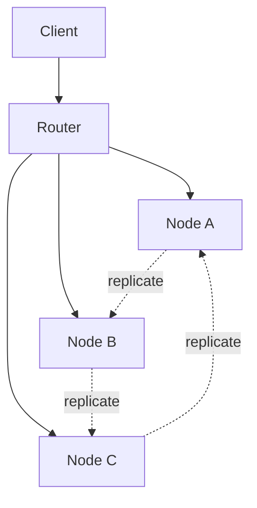

# Map / Dictionary — Senior Level

## Table of Contents

1. [Introduction](#introduction)
2. [Distributed Maps — Architecture](#distributed-maps--architecture)
3. [Redis HASH — A Distributed Map per Key](#redis-hash--a-distributed-map-per-key)
4. [Sharded HashMaps — ConcurrentHashMap and Beyond](#sharded-hashmaps--concurrenthashmap-and-beyond)
5. [Cassandra Wide Columns as Maps](#cassandra-wide-columns-as-maps)
6. [Consistent Hashing for Distributed Maps](#consistent-hashing-for-distributed-maps)
7. [CRDT Maps for Multi-Master Replication](#crdt-maps-for-multi-master-replication)
8. [Hot-Key Mitigation](#hot-key-mitigation)
9. [Capacity Planning](#capacity-planning)
10. [Observability](#observability)
11. [Failure Modes](#failure-modes)
12. [Summary](#summary)

---

## Introduction

> Focus: "How does the Map ADT scale beyond one machine?"

At senior level, the Map ADT becomes a system. The interface is the same — `get`, `put`, `remove` — but the implementation spans nodes, networks, and replicas. We trade local invariants (consistency on a single mutex) for distributed invariants (eventual consistency, quorum reads, conflict resolution).

Most of this material extends `05-hash-tables/senior.md` (consistent hashing, DHTs, `ConcurrentHashMap` internals). Read it first.

---

## Distributed Maps — Architecture

A distributed Map exposes the Map ADT but stores entries across N nodes. The architecture answers four questions:

| Question | Common Answers |
|----------|---------------|
| Where does key K live? | Consistent hashing, range partitioning, lookup directory |
| How many copies? | Replication factor R (commonly 3) |
| How do we read? | Quorum (R/2+1), single replica, read-repair |
| How do we resolve conflicts? | Last-write-wins, vector clocks, CRDT |



### Production examples

| System | Backing | Sharding | Consistency |
|--------|---------|----------|-------------|
| Redis Cluster | hash table per node | hash slots (16384) | async replication, eventual |
| DynamoDB | LSM-tree per partition | consistent hashing | strong / eventual configurable |
| Cassandra | LSM-tree per node | consistent hashing | tunable per-query (ONE/QUORUM/ALL) |
| etcd | BoltDB (B+ tree) | none (Raft replicates all) | strong (Raft) |
| Memcached | hash table per node | client-side consistent hashing | none — cache only |

---

## Redis HASH — A Distributed Map per Key

Redis exposes the Map ADT as the `HASH` data type. Each HASH is a Map; each Redis key holds one HASH.

### Common commands

| Command | Map ADT op | Notes |
|---------|-----------|-------|
| `HSET k field value` | `put` | O(1) per field |
| `HGET k field` | `get` | O(1) |
| `HDEL k field` | `remove` | O(1) |
| `HEXISTS k field` | `containsKey` | O(1) |
| `HLEN k` | `size` | O(1) |
| `HKEYS k` | `keys` | O(N) — N = HASH size |
| `HVALS k` | `values` | O(N) |
| `HGETALL k` | `entries` | O(N) — avoid on large HASHes |
| `HINCRBY k field n` | atomic counter | O(1) |
| `HSCAN k cursor` | cursor-based iteration | O(1) per step |

### Internal encoding switching

Redis chooses the encoding based on size:

- **listpack** (formerly `ziplist`) — flat array, used when both field count and value sizes are small (default: ≤ 128 fields, ≤ 64 bytes per value). O(N) lookups but tiny memory.
- **hashtable** — true hash table once thresholds exceeded. O(1) lookups, more memory per entry.

This is why a HASH of 100 short fields uses ~10x less memory than 100 separate top-level keys.

### Idioms

```text
# Store a user profile as one HASH
HSET user:42 name "Alice" age "30" email "a@x"
HGETALL user:42

# Atomic counter increment
HINCRBY page:home:counters views 1
```

### Sharding caveat

In Redis Cluster, the **entire HASH lives on one node** (it is one key). To spread a logical Map across many nodes, you must shard at the application level:

```text
HSET user:{42}:profile name "Alice"   # hash slot determined by {42}
HSET user:{42}:settings theme "dark"  # same slot as above (hashtag)
```

The `{42}` hashtag forces both keys onto the same shard so atomic ops across them work.

---

## Sharded HashMaps — ConcurrentHashMap and Beyond

### Java's `ConcurrentHashMap` (Java 8+)

Java 8 redesigned `ConcurrentHashMap` for high contention. The design illustrates several techniques every senior should know.

**Key techniques:**

1. **Per-bucket synchronization.** Writes lock only the bucket they touch (`synchronized(bin)`). Reads are lock-free with volatile reads + CAS.
2. **CAS for empty-bucket inserts.** If the head of a bucket is null, CAS to insert. No lock needed.
3. **Treeification.** When a bucket's chain exceeds `TREEIFY_THRESHOLD` (default 8), the chain is converted to a red-black tree. Lookups in that bucket switch from O(chain) to O(log chain). Prevents worst-case O(n) under adversarial hashing.
4. **Parallel resize.** During table resize, multiple writer threads cooperate to move buckets. No stop-the-world.
5. **`LongAdder`-style size counter.** Concurrent counters use striped counters; `size()` is approximate fast path, exact at sync points.

### Atomic compound ops

These are the API methods that make `ConcurrentHashMap` actually useful concurrently:

```java
// putIfAbsent — atomic check-and-insert
cache.putIfAbsent(key, value);

// compute / computeIfPresent / computeIfAbsent — atomic read-modify-write
cache.compute(key, (k, v) -> v == null ? 1 : v + 1);

// merge — typical for counters
cache.merge(key, 1, Integer::sum);

// replace — CAS-style replace
cache.replace(key, oldValue, newValue);
```

> Without these, you would write `if (!map.containsKey(k)) map.put(k, v)` — which is **two operations** and racy.

### Go: `sync.Map` vs `sync.RWMutex + map`

- `sync.Map` is optimized for **stable key set, many readers**. Internally a read-only atomic map + a dirty map.
- For **mixed read/write on a shared key set**, a `sync.RWMutex`-protected `map` is faster.
- For **write-heavy workloads with disjoint key partitions**, use **lock striping**:

```go
type Stripe struct {
    mu sync.RWMutex
    m  map[string]any
}
type StripedMap struct {
    stripes []Stripe
}

func (s *StripedMap) bucket(k string) *Stripe {
    return &s.stripes[fnv32(k) % uint32(len(s.stripes))]
}

func (s *StripedMap) Get(k string) (any, bool) {
    b := s.bucket(k)
    b.mu.RLock()
    defer b.mu.RUnlock()
    v, ok := b.m[k]
    return v, ok
}
```

With 16-64 stripes, contention drops to near zero unless your workload genuinely hammers one key.

### Python: GIL semantics

CPython's GIL makes individual `dict` operations atomic — but compound ops (`if k not in d: d[k] = v`) are still racy across yields. Use `dict.setdefault` (atomic) or a `threading.Lock`.

---

## Cassandra Wide Columns as Maps

Cassandra's data model is essentially a two-level Map:

```text
table = Map<PartitionKey, Map<ClusteringKey, Row>>
```

Each partition is one Map per partition key. Within a partition, clustering keys form an ordered Map (clustering order is enforced at the SSTable level — like a TreeMap).

### CQL example

```sql
CREATE TABLE events (
  user_id  uuid,
  ts       timestamp,
  payload  text,
  PRIMARY KEY (user_id, ts)
) WITH CLUSTERING ORDER BY (ts DESC);

-- Acts like: events[user_id] = SortedMap<timestamp, payload>
SELECT * FROM events WHERE user_id = ? AND ts >= ? AND ts < ?;
```

This is a **distributed sorted Map** with O(log n) range scans within a partition, distributed across nodes by `user_id`.

### Lesson

When you need both "huge total dataset" and "ordered range queries within a key," Cassandra's two-level Map is the canonical answer. The outer Map shards; the inner Map is sorted on one node.

---

## Consistent Hashing for Distributed Maps

Covered in detail in `05-hash-tables/senior.md`. Recap:

- Place keys and nodes on a virtual ring (typically 2^32 or 2^64 positions).
- Each key is owned by the next node clockwise.
- Adding/removing a node remaps only `K/N` keys.
- Use **virtual nodes** (150-200 per physical node) for balanced load.

### Implications for the Map ADT

| Property | Effect |
|----------|--------|
| Iteration order | Per-node arbitrary; global iteration requires scatter-gather |
| Range queries | Almost impossible without secondary index |
| Linearizable ops | Need quorum + coordinator (CP system) or accept eventual (AP) |
| Resize / scale-out | Cheap; only K/N keys move |

---

## CRDT Maps for Multi-Master Replication

In multi-master systems (every replica accepts writes), concurrent updates to the same key conflict. CRDTs (Conflict-free Replicated Data Types) define merge rules that **converge** without coordination.

### OR-Map (Observed-Remove Map)

For a Map<K, V> where V is itself a CRDT (counter, set, register):

- Each entry tagged with a unique **tag** at insertion.
- Removal removes all currently-observed tags; new inserts get new tags.
- A `put` on the same key concurrent with a `remove` survives — because the new tag was not observed by the remover.

### LWW-Map (Last-Writer-Wins Map)

Each entry stores `(value, timestamp)`. Merge keeps the entry with the larger timestamp. Simple but lossy: silent overwrites on concurrent writes.

### Production users

- **Riak** — DT (Data Types) include `map` CRDT.
- **Redis CRDT (Redis Enterprise active-active)** — uses `OR-Set` and `Map` CRDTs.
- **Automerge / Yjs** — document CRDTs built atop Map CRDTs.

### Trade-off

CRDTs give availability under partition and trivial multi-master, but add metadata overhead (tags, timestamps, tombstones) and weaken semantics (you cannot do strong "compare-and-swap").

---

## Hot-Key Mitigation

A **hot key** is a single key receiving so much traffic that its shard saturates while others idle. Common in distributed Maps.

### Detection

- Per-key request counters at the proxy / router layer
- Top-K heavy hitters (Count-Min Sketch)
- Alerting: any key receiving > 1% of total QPS

### Mitigations

| Technique | How |
|-----------|-----|
| **Local cache** | Each app instance caches the hot key for a few ms; reduces fan-in to the store |
| **Replicate the key** | Store `hot_key_1`, `hot_key_2`, ..., `hot_key_N`; clients pick at random |
| **Shard the key's value** | If value is a counter, split into N sub-counters (`HINCRBY` on shard chosen by request); aggregate on read |
| **Promote to dedicated node** | Pin the hot key to a beefier or dedicated machine |
| **Request coalescing** | Deduplicate concurrent reads via a single in-flight request |

### Coalescing in Go

```go
import "golang.org/x/sync/singleflight"

var g singleflight.Group

func Get(key string) (any, error) {
    v, err, _ := g.Do(key, func() (any, error) {
        return backend.Get(key)
    })
    return v, err
}
```

`singleflight` collapses N concurrent gets on the same key into one backend call.

---

## Capacity Planning

For a sharded Map, budget per node:

| Resource | Formula |
|----------|---------|
| Memory | `R * (avg_entry_size * keys_per_node) * overhead_factor` |
| Storage (LSM) | `R * compressed_size_per_entry * keys_per_node * sstable_overhead` |
| CPU | `qps_per_node * cycles_per_op` |
| Network | `qps_per_node * (avg_request_size + avg_response_size)` |

### Worked example: Redis HASH for user sessions

- 10M users, each with a session HASH of 10 fields, ~200 bytes total
- Replication factor 1 (single primary, async replica)
- ~2 GB hot data total

Per Redis node (assuming 4 nodes via cluster):
- ~500 MB sessions per node
- Add 30-50% overhead for hashtable metadata + free pages -> ~750 MB
- Reserve another 50% for COW during background save -> ~1.1 GB total

Plan node memory ≥ 2 GB per shard with a safety margin.

---

## Observability

The metrics you cannot live without when running a Map at scale:

| Metric | Why | Alert |
|--------|-----|-------|
| `map_size` | Capacity planning | > 80% planned |
| `map_load_factor` | Hash distribution health | > 0.85 sustained |
| `op_latency_p50` / `p99` / `p999` | SLOs | p99 > 10 ms |
| `hot_key_qps` | Skew detection | top key > 1% of total |
| `eviction_rate` (if bounded) | Working-set fit | > 1% of qps |
| `replication_lag_seconds` | Read consistency | > 1 s |
| `rehash_in_progress` (Redis) | Latency spikes | > 30 s |
| `key_distribution_entropy` | Hash quality | Shannon entropy / log N < 0.95 |
| `bucket_chain_length_p99` (Java) | Hash flooding | > 32 |

### Logging keys, safely

Never log raw keys when they may be PII (emails, user IDs). Hash or truncate. Many production incidents start with "we logged keys and the log shipper went OOM."

---

## Failure Modes

| Failure | Symptom | Mitigation |
|---------|---------|-----------|
| **Hot key** | One shard saturates; others idle | Local cache, replicate key, coalesce |
| **Hash flooding** | Crafted inputs all collide; bucket chain explodes | Randomized hash seed (SipHash); cap chain length; treeification |
| **Unbounded growth** | OOM; latency cliff | TTL eviction; bounded maps; off-heap storage |
| **Concurrent modification** | `ConcurrentModificationException`; corruption | Use concurrent variant; snapshot for iteration |
| **Iteration order assumption** | Tests pass, prod fails | Document order requirement; use `LinkedHashMap`/`TreeMap` explicitly |
| **Rehash stall** | Latency spike during O(n) rehash | Incremental rehash (Redis); pre-size to avoid; off-peak rehash |
| **Replica divergence** | Different replicas return different values | Read-repair; anti-entropy; CRDT merge |
| **Network partition** | Multi-master conflicts | CRDT or quorum + reconcile |

---

## Summary

At senior level, the Map ADT becomes infrastructure. You choose:

- **Local vs distributed** — based on dataset size and write volume
- **Strong vs eventual consistency** — based on correctness needs
- **Range queries needed?** — drives backing choice (LSM vs hash)
- **Hot keys?** — drives caching, replication, sharding strategy

The interface stays the same — `get`, `put`, `remove` — but the engineering moves to consistency models, hot-spot management, replication, capacity, and observability. Master `ConcurrentHashMap`'s internals, Redis HASH encodings, and consistent hashing — they are the building blocks of every production system you will ever ship.

Cross-links:
- `05-hash-tables/senior.md` — `ConcurrentHashMap`, consistent hashing, DHT
- `21-advanced-structures/concurrent-hash-map` — lock-striped maps in depth
- `21-advanced-structures/lru-cache` — eviction-policy Maps
- `caching-strategies` skill — TTL, write-through, write-back patterns
