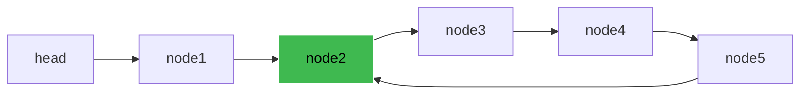

# Floyd's Cycle Detection (Tortoise & Hare) — Junior Level

## Table of Contents

1. [Introduction](#introduction)
2. [Prerequisites](#prerequisites)
3. [Glossary](#glossary)
4. [Core Concepts](#core-concepts)
5. [Big-O Summary](#big-o-summary)
6. [Real-World Analogies](#real-world-analogies)
7. [Pros & Cons](#pros--cons)
8. [Code Examples](#code-examples)
9. [Finding the Cycle Start](#finding-the-cycle-start)
10. [Coding Patterns](#coding-patterns)
11. [Error Handling](#error-handling)
12. [Performance Tips](#performance-tips)
13. [Best Practices](#best-practices)
14. [Edge Cases & Pitfalls](#edge-cases--pitfalls)
15. [Common Mistakes](#common-mistakes)
16. [Cheat Sheet](#cheat-sheet)
17. [Visual Animation](#visual-animation)
18. [Summary](#summary)
19. [Further Reading](#further-reading)

---

## Introduction

> Focus: "What is it?" and "How to use it?"

**Floyd's Cycle Detection Algorithm**, also called the **Tortoise and Hare Algorithm**, detects whether a linked list or any sequence has a cycle. It uses two pointers moving at different speeds: a **slow pointer** that advances one step at a time, and a **fast pointer** that advances two steps at a time. If a cycle exists, the fast pointer will eventually meet the slow pointer inside the loop. If no cycle exists, the fast pointer reaches the end (`null`/`nil`/`None`).

The algorithm runs in **O(n) time** and uses only **O(1) space** — no hash set, no auxiliary list. That constant-space guarantee is what makes it famous: in 1967, Robert W. Floyd showed you do not need any extra memory to detect a cycle.

This same idea generalizes beyond linked lists. It detects cycles in any function `f` that maps a finite set to itself — sequences `x, f(x), f(f(x)), ...` must eventually repeat. That generality is why Floyd's algorithm sits at the heart of **Pollard's rho** integer factorization, random number generator analysis, and duplicate-finding in arrays.

---

## Prerequisites

- **Required:** Linked lists — nodes, `next` pointers, traversal with a `while` loop
- **Required:** Basic two-pointer technique
- **Helpful:** Understanding that "infinite loop" in a program comes from a structural cycle
- **Helpful:** Modular arithmetic intuition (for the cycle-start math)

---

## Glossary

| Term | Definition |
|------|-----------|
| **Cycle** | A sequence of nodes where some node's `next` pointer points back to an earlier node |
| **Tortoise** | The slow pointer, advances 1 step per iteration |
| **Hare** | The fast pointer, advances 2 steps per iteration |
| **Meeting point** | The node where tortoise and hare end up at the same node |
| **Cycle length (λ)** | Number of nodes inside the cycle |
| **Tail length (μ)** | Number of nodes before entering the cycle |
| **Brent's algorithm** | An alternative cycle-detection algorithm using powers of two |
| **ρ-shape** | The visual shape of a list with a tail leading into a loop (looks like the Greek letter rho) |

---

## Core Concepts

### Concept 1: Two pointers at different speeds

Picture two runners on a circular track. The hare runs twice as fast as the tortoise. Once both runners enter the circle, the hare gains exactly one position on the tortoise every step. After at most one full lap, the hare laps the tortoise — they end up on the same node. This is the **meeting**. If the track is **not** circular (i.e., the linked list is a straight line ending in `null`), the hare simply runs off the end and the algorithm reports "no cycle."

### Concept 2: Why fast = 2× slow works

The choice of "2 steps vs 1 step" is intentional. After both pointers enter the cycle, the **distance between them** changes by exactly 1 per iteration. Since the cycle has finite length λ, this distance modulo λ cycles through every value 0, 1, 2, ..., λ-1, and must hit 0 in at most λ steps. That's the meeting. Any other ratio (3:1, 4:1, ...) would also work for detection but breaks the elegant math for finding the cycle's **start node**.

### Concept 3: ρ-shape — the structure of any cyclic sequence

Every cyclic sequence has two parts:
- **Tail (μ nodes):** the entry path leading into the cycle
- **Cycle (λ nodes):** the loop itself

Drawing this gives the Greek letter ρ (rho) — a straight line leading into a circle. Floyd's algorithm is sometimes called the **ρ-algorithm** for this reason, especially in number theory.

### Concept 4: Detection vs cycle-start finding

There are **two separate problems**:
1. **Is there a cycle?** — One pass with tortoise and hare.
2. **Where does the cycle start?** — A second pass after detection, using a math trick.

Many beginners confuse the two. Detection alone is enough for "linked list cycle" questions. Cycle-start finding requires step 2.

---

## Big-O Summary

| Operation | Complexity | Notes |
|-----------|-----------|-------|
| Detect cycle | O(n) | n = total nodes visited (≤ μ + λ) |
| Find cycle start | O(n) | One more linear pass after meeting |
| Find cycle length | O(λ) | Walk around the cycle once from meeting point |
| Space | O(1) | Two pointers only — no hash set, no array |

> Compare to **hash-set detection**: O(n) time, O(n) space. Floyd's wins on memory by a factor of n.

---

## Real-World Analogies

| Concept | Analogy |
|---------|--------|
| **Two pointers at different speeds** | Two runners on a circular track; the faster one always laps the slower one if it's a loop |
| **Meeting point** | Two clocks ticking at 1 Hz and 2 Hz — they agree again whenever their phase difference returns to 0 |
| **Cycle vs no cycle** | A car on a roundabout (cycle) vs a car on a straight highway (no cycle — eventually you reach the end) |
| **Tail (μ)** | The on-ramp before entering the roundabout |
| **Cycle (λ)** | The roundabout itself |
| **Detection** | Asking "did we pass the same landmark twice?" without writing anything down |

> Analogy limit: real runners get tired; pointers don't. The math assumes infinite stamina.

---

## Pros & Cons

| Pros | Cons |
|------|------|
| **O(1) space** — beats hash-set by huge memory factor | Two passes if you also need cycle-start (still O(n) overall) |
| **No allocation** — works in memory-constrained environments | Doesn't tell you the cycle length without a third pass |
| **Generalizes to any function `f`** — not just linked lists | The math (why fast = 2× slow finds start) takes effort to internalize |
| **Modifies nothing** — read-only algorithm | If the structure is read-only AND you must know which exact node is the meeting, you still need pointer comparison |

**When to use:**
- Detecting cycles in singly linked lists with no extra memory budget
- Pollard's rho factorization
- Detecting periodicity in pseudo-random number generators
- Duplicate-finding in fixed-range arrays without modifying the array (LeetCode 287)

**When NOT to use:**
- When you also need the **set of all cycle nodes** — better to use a visited set (O(n) space is fine here)
- When the list is doubly linked and you can mark nodes — marking is simpler
- When you need parallel/concurrent traversal — two pointers must move sequentially

---

## Code Examples

### Example 1: Detect a cycle in a linked list

#### Go

```go
package main

import "fmt"

type ListNode struct {
    Val  int
    Next *ListNode
}

// HasCycle returns true if the list contains a cycle.
// Time: O(n). Space: O(1).
func HasCycle(head *ListNode) bool {
    if head == nil {
        return false
    }
    slow, fast := head, head
    for fast != nil && fast.Next != nil {
        slow = slow.Next
        fast = fast.Next.Next
        if slow == fast {
            return true
        }
    }
    return false
}

func main() {
    // Build: 1 -> 2 -> 3 -> 4 -> back to node 2
    n1 := &ListNode{Val: 1}
    n2 := &ListNode{Val: 2}
    n3 := &ListNode{Val: 3}
    n4 := &ListNode{Val: 4}
    n1.Next = n2
    n2.Next = n3
    n3.Next = n4
    n4.Next = n2 // cycle
    fmt.Println(HasCycle(n1)) // true
}
```

#### Java

```java
public class FloydCycle {
    static class ListNode {
        int val;
        ListNode next;
        ListNode(int val) { this.val = val; }
    }

    // Time: O(n). Space: O(1).
    public static boolean hasCycle(ListNode head) {
        if (head == null) return false;
        ListNode slow = head, fast = head;
        while (fast != null && fast.next != null) {
            slow = slow.next;
            fast = fast.next.next;
            if (slow == fast) return true;
        }
        return false;
    }

    public static void main(String[] args) {
        ListNode n1 = new ListNode(1);
        ListNode n2 = new ListNode(2);
        ListNode n3 = new ListNode(3);
        ListNode n4 = new ListNode(4);
        n1.next = n2; n2.next = n3; n3.next = n4; n4.next = n2;
        System.out.println(hasCycle(n1)); // true
    }
}
```

#### Python

```python
class ListNode:
    def __init__(self, val=0, nxt=None):
        self.val = val
        self.next = nxt

def has_cycle(head):
    """Detect a cycle in a singly linked list. O(n) time, O(1) space."""
    if head is None:
        return False
    slow = fast = head
    while fast and fast.next:
        slow = slow.next
        fast = fast.next.next
        if slow is fast:
            return True
    return False

if __name__ == "__main__":
    n1, n2, n3, n4 = ListNode(1), ListNode(2), ListNode(3), ListNode(4)
    n1.next = n2; n2.next = n3; n3.next = n4; n4.next = n2
    print(has_cycle(n1))  # True
```

**What it does:** Walks two pointers, one twice as fast. If they ever land on the same node, a cycle exists.
**Run:** `go run main.go` | `javac FloydCycle.java && java FloydCycle` | `python floyd.py`

---

## Finding the Cycle Start

Once a cycle is detected, there's an elegant follow-up: **find the node where the cycle begins** (i.e., the first node that has two incoming pointers).

**The trick:** After tortoise and hare meet, reset one pointer to the head. Move both one step at a time. They will meet exactly at the cycle's start.

### Why it works (intuition, not full proof)

Let:
- **μ** = tail length (nodes before cycle)
- **λ** = cycle length
- **m** = meeting point distance from cycle start

When slow and fast meet:
- slow has traveled `μ + m`
- fast has traveled `2(μ + m)`
- fast has done `μ + m + k·λ` for some integer k (it lapped the cycle k times)

So `2(μ + m) = μ + m + k·λ`, which gives `μ + m = k·λ`, or **μ = k·λ - m**.

That means walking μ steps from head and (k·λ - m) steps from the meeting point lands on the **same node** — and that node is the cycle's start.

### Code: Find cycle start

#### Go

```go
// DetectCycleStart returns the node where the cycle begins, or nil.
func DetectCycleStart(head *ListNode) *ListNode {
    if head == nil {
        return nil
    }
    slow, fast := head, head
    for fast != nil && fast.Next != nil {
        slow = slow.Next
        fast = fast.Next.Next
        if slow == fast {
            // Phase 2: find cycle start
            p := head
            for p != slow {
                p = p.Next
                slow = slow.Next
            }
            return p
        }
    }
    return nil
}
```

#### Java

```java
public static ListNode detectCycleStart(ListNode head) {
    if (head == null) return null;
    ListNode slow = head, fast = head;
    while (fast != null && fast.next != null) {
        slow = slow.next;
        fast = fast.next.next;
        if (slow == fast) {
            ListNode p = head;
            while (p != slow) {
                p = p.next;
                slow = slow.next;
            }
            return p;
        }
    }
    return null;
}
```

#### Python

```python
def detect_cycle_start(head):
    if head is None:
        return None
    slow = fast = head
    while fast and fast.next:
        slow = slow.next
        fast = fast.next.next
        if slow is fast:
            p = head
            while p is not slow:
                p = p.next
                slow = slow.next
            return p
    return None
```

---

## Coding Patterns

### Pattern 1: Two-Pointer with Different Speeds

**Intent:** Use one variable to track position and another to track a derived/lookahead state.

#### Go

```go
// General two-speed traversal
slow, fast := start, start
for fast != nil && fast.Next != nil {
    slow = slow.Next       // 1 step
    fast = fast.Next.Next  // 2 steps
    if condition(slow, fast) {
        // detected something
        break
    }
}
```

#### Java

```java
Object slow = start, fast = start;
while (fast != null && fast.next() != null) {
    slow = slow.next();
    fast = fast.next().next();
    if (condition(slow, fast)) break;
}
```

#### Python

```python
slow = fast = start
while fast and fast.next:
    slow = slow.next
    fast = fast.next.next
    if condition(slow, fast):
        break
```

### Pattern 2: Cycle detection on functions (`x_{i+1} = f(x_i)`)

#### Python

```python
def find_cycle(f, x0):
    """Detect cycle in sequence x0, f(x0), f(f(x0)), ..."""
    tortoise = f(x0)
    hare = f(f(x0))
    while tortoise != hare:
        tortoise = f(tortoise)
        hare = f(f(hare))
    return tortoise  # some point inside the cycle
```



The arrow from `node5` back to `node2` creates the cycle. `node2` is the cycle start.

---

## Error Handling

| Error | Cause | Fix |
|-------|-------|-----|
| Null pointer when fast or fast.next is null | Forgetting that fast jumps 2 — both must be checked | Always check `fast != null && fast.next != null` |
| Initial slow == fast triggers false positive | Both initialized to head, so they "meet" before moving | Use a `do/while` pattern OR advance them first OR check inside the loop after movement |
| Infinite loop on cycle | Forgot to advance pointers | Advance slow once and fast twice per iteration |
| Returns wrong node for cycle start | Used 3:1 ratio instead of 2:1 | Stick with 2:1 — the math depends on the speed ratio |

---

## Performance Tips

- **Avoid heap allocation in inner loop** — just move pointers; allocate nothing
- For very large lists, **cache line behavior** matters: linked lists are cache-unfriendly regardless, but Floyd's at least touches each node only twice on average
- In Go and Python, prefer iterative form — recursive cycle detection blows the call stack on long lists
- For arrays-as-functions (`f(i) = a[i]`), Floyd's avoids any allocation and beats hash-set on real benchmarks for n > ~1000

---

## Best Practices

- **Validate input first:** `head == null` should short-circuit return `false`
- **Use named pointers:** `slow`/`fast` or `tortoise`/`hare` — readers should never wonder which is which
- **Document the speed ratio** in a comment when the math depends on it (cycle-start finding)
- **Write the iterative version first.** Recursive variants exist but offer no benefit and risk stack overflow
- **Add a unit test for no-cycle case** — single node, two nodes, long straight list — these catch off-by-one bugs in the `fast.next != null` check
- **Don't mutate the list** — read-only is the algorithm's selling point; if you mark nodes you may as well use the simpler "visited bit" approach

---

## Edge Cases & Pitfalls

- **Empty list (`head == null`)**: return false immediately
- **Single node, no cycle**: `head.next == null`, loop exits, return false
- **Single node, self-loop** (`head.next == head`): one iteration, slow == fast, return true
- **Two nodes, no cycle**: fast.next.next is null in iteration 1 — loop exits
- **Cycle of length 1**: a node points to itself; pointers meet in 1 step
- **Cycle of length 2** (smallest non-trivial): meeting happens at the same parity
- **Long tail, short cycle**: μ huge, λ tiny — algorithm still O(μ + λ)
- **Returning meeting node vs cycle-start node**: meeting node is **not** the start of the cycle in general

---

## Common Mistakes

- **Wrong loop condition**: `while fast != null` (missing `fast.next != null`) — null-pointer crash when fast.next.next is accessed
- **Both pointers start one step ahead**: initializing `slow = head.next; fast = head.next.next` is valid but introduces an off-by-one trap when finding the cycle start
- **Confusing "meeting node" with "cycle start"**: they are different. The meeting node is inside the cycle but not necessarily at the entry
- **Using `==` for value comparison instead of pointer/reference identity**: two distinct nodes can have the same `Val` but no cycle; you must compare node identity
- **Trying to "speed up" with fast = 3× slow**: detection still works, but the elegant cycle-start formula breaks
- **Using Floyd's when a visited set is fine**: if O(n) memory is acceptable, a hash set is simpler and harder to get wrong

---

## Cheat Sheet

| Operation | Time | Space | Notes |
|-----------|------|-------|-------|
| Detect cycle | O(n) | O(1) | Two pointers, fast = 2× slow |
| Find cycle start | O(n) | O(1) | Reset one to head; advance both 1 step |
| Find cycle length | O(λ) | O(1) | Fix one at meeting; advance the other until they meet again |
| Hash set comparison | O(n) | O(n) | Simpler to implement, n× more memory |
| Brent's algorithm | O(n) | O(1) | Slightly fewer iterations on average |

**Mnemonic:** *Slow steps, Fast leaps, Meet means loop, Reset head finds start.*

---

## Visual Animation

> See [`animation.html`](./animation.html) for an interactive visualization of Floyd's Cycle Detection.
>
> The animation demonstrates:
> - Slow (tortoise) and fast (hare) pointer movement on a ρ-shaped list
> - Step-by-step meeting detection
> - Phase 2: resetting and finding the cycle start
> - Compare against no-cycle (straight list) case
> - Speed control and step-by-step mode

---

## Summary

Floyd's Cycle Detection finds loops in linked lists or any iterated function in O(n) time and O(1) space using two pointers at different speeds. After detection, a second pass finds the cycle's entry node via an elegant math trick (`μ = k·λ - m`). Master both phases: detection is easy, cycle-start finding requires understanding why the speed ratio matters.

---

## Further Reading

- *Introduction to Algorithms* (CLRS) — Chapter on graph cycle detection
- Knuth, *The Art of Computer Programming*, Volume 2 — Algorithm B (Brent's cycle-finding)
- Pollard, J. M. (1975), "A Monte Carlo method for factorization" — Floyd's algorithm applied to integer factorization
- LeetCode 141 — Linked List Cycle
- LeetCode 142 — Linked List Cycle II (find cycle start)
- LeetCode 287 — Find the Duplicate Number (Floyd's on `f(i) = nums[i]`)
- cp-algorithms.com — "Tortoise and Hare Algorithm"
