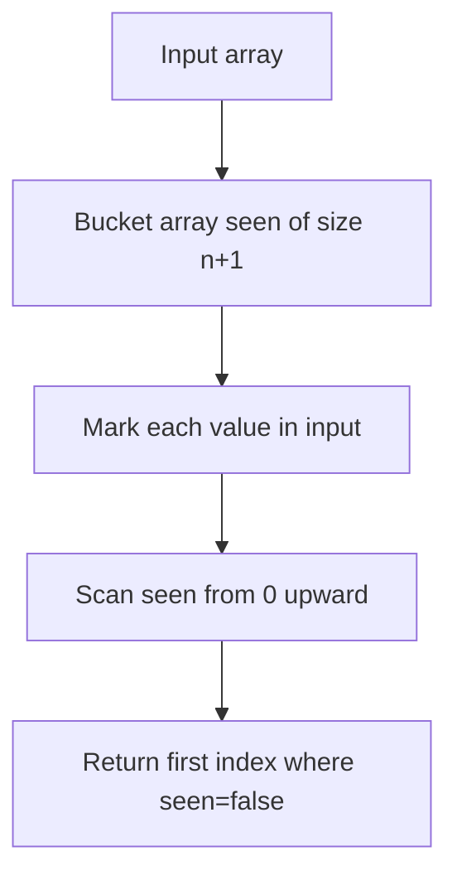

# MEX (Minimum Excludant) — Junior Level

## Table of Contents

1. [Introduction](#introduction)
2. [Prerequisites](#prerequisites)
3. [Glossary](#glossary)
4. [Core Concepts](#core-concepts)
5. [Big-O Summary](#big-o-summary)
6. [Real-World Analogies](#real-world-analogies)
7. [Pros & Cons of Each Approach](#pros--cons-of-each-approach)
8. [Code Examples](#code-examples)
9. [Coding Patterns](#coding-patterns)
10. [Error Handling](#error-handling)
11. [Performance Tips](#performance-tips)
12. [Best Practices](#best-practices)
13. [Edge Cases & Pitfalls](#edge-cases--pitfalls)
14. [Common Mistakes](#common-mistakes)
15. [Cheat Sheet](#cheat-sheet)
16. [Visual Animation](#visual-animation)
17. [Summary](#summary)
18. [Further Reading](#further-reading)

---

## Introduction

> Focus: "What is it?" and "How to compute it?"

The **MEX** (Minimum EXcludant) of a set of non-negative integers is the **smallest non-negative integer that is not in the set**. For example:

```text
MEX({0, 1, 2, 4}) = 3
MEX({1, 2, 3})    = 0
MEX({})           = 0
MEX({0, 1, 2, 3}) = 4
```

It is the smallest "missing" element when you scan up from 0. The function feels simple but appears in surprising places: game theory (Sprague-Grundy values), competitive-programming queries on ranges of arrays, and combinatorial labeling problems. Different constraints (small range, large values, dynamic updates, range queries) lead to very different algorithms — that diversity is what makes MEX an instructive entry-level topic.

In competitive programming you often see `mex(S)` written without explanation. Knowing the fastest way to compute it for the given constraints is the whole battle.

---

## Prerequisites

- **Required:** Arrays, sets, basic loops
- **Required:** Big-O reasoning over array length vs value range
- **Helpful:** Hash sets / hash maps
- **Helpful:** Sorting basics — for the sort-based approach

---

## Glossary

| Term | Definition |
|------|-----------|
| **MEX** | Minimum excludant; the smallest non-negative integer not in the input set |
| **Excludant** | Synonym for "missing value" |
| **Bucket array** | Boolean array indexed by value, used to mark presence |
| **Range MEX** | MEX over a sub-range `[l, r]` of an array — much harder than whole-array MEX |
| **Dynamic MEX** | MEX of a set that supports insert/delete updates |
| **Sprague-Grundy / Nim value** | Game-theoretic value of a position, computed via MEX of moves' grundy values |

---

## Core Concepts

### Concept 1: MEX is bounded by n+1

If the input has `n` elements, the MEX is **at most n**. Proof: the set of `n` elements can cover at most `{0, 1, ..., n-1}`. If it does, MEX = n. If not, MEX < n. So you never need to search above n — this fact powers the optimal O(n) bucket algorithm.

### Concept 2: Bucket array trick

To compute MEX of `n` elements in O(n) time:
1. Allocate a boolean array `seen[0..n]` (size n+1 because MEX ≤ n).
2. For each value `v` in input: if `v ≤ n`, set `seen[v] = true` (ignore values > n — they cannot be the MEX).
3. Scan `seen` left to right; return the first index where `seen[i] == false`.

That's it. Linear time, linear space, no hash set, no sort.

### Concept 3: Trade-off — value range vs array size

When values can be arbitrarily large (e.g., 10^18) and `n` is small (e.g., 10^5), you do **not** allocate a bucket of size 10^18. You either:
- Use a hash set and scan `0, 1, 2, ...` until you find a missing value (still O(n) because MEX ≤ n)
- Sort + linear scan (O(n log n) — usually overkill but simple)

The bucket trick assumes value range fits in memory. The hash-set trick assumes hash ops are O(1).

### Concept 4: MEX of an empty set

MEX(∅) = 0 by definition. Always test this edge case.

---

## Big-O Summary

| Approach | Time | Space | Best for |
|----------|------|-------|----------|
| **Brute force** (try 0, 1, 2, ...) | O(n²) | O(1) | n ≤ 100, teaching |
| **Sort + scan** | O(n log n) | O(1) extra | Simple code, n moderate |
| **Hash set** | O(n) avg | O(n) | Large value range, n moderate |
| **Bucket array** | O(n) | O(n) | n known, values bounded |
| **Ordered set (dynamic)** | O(log n) per op | O(n) | Insert/delete updates |
| **Segment tree (range MEX)** | O(log n) query | O(n log n) build | Range queries on array |

---

## Real-World Analogies

| Concept | Analogy |
|---------|--------|
| **MEX = first missing integer** | Roll call: "0? present. 1? present. 2? present. 3? — no answer." You stop at 3 |
| **Bucket array** | Hotel rooms numbered 0 to n. Mark each booked room. Find the lowest unbooked room |
| **MEX ≤ n bound** | A class of n students cannot all wear different uniforms numbered ≥ n unless some number 0..n-1 is missing |
| **Sprague-Grundy MEX** | Choosing the "least surprising" next move that no opponent has thought of |

---

## Pros & Cons of Each Approach

### Brute force

| Pros | Cons |
|------|------|
| Trivial to write | O(n²) — slow |
| Works without hash sets | Hits TLE in any contest |

### Sort + scan

| Pros | Cons |
|------|------|
| Tiny code, no hash dependencies | O(n log n) wastes the linear bound |
| Stable behavior, no worst-case surprises | Sorting destroys original order if you need it |

### Hash set

| Pros | Cons |
|------|------|
| O(n) average | Hash worst case O(n²) (rare with good hash) |
| Handles huge value ranges | Allocates a hash structure |

### Bucket array

| Pros | Cons |
|------|------|
| Optimal O(n) | Fails when values are unbounded |
| Cache-friendly | Wastes memory if `n` huge and values clustered |

**When to use which:**
- Single-MEX call, n small: brute force or sort+scan
- Single-MEX call, n large, values bounded: bucket array
- Single-MEX call, n large, values unbounded: hash set
- Many MEX calls with insert/delete: ordered set / segment tree (middle.md)
- Range MEX queries: segment tree on values + persistent structure (middle.md)

---

## Code Examples

### Example 1: Bucket-array MEX (optimal for whole-array)

#### Go

```go
package main

import "fmt"

// MEX returns the minimum non-negative integer not in arr.
// Time: O(n). Space: O(n).
func MEX(arr []int) int {
    n := len(arr)
    seen := make([]bool, n+1) // MEX is at most n
    for _, v := range arr {
        if v >= 0 && v <= n {
            seen[v] = true
        }
    }
    for i := 0; i <= n; i++ {
        if !seen[i] {
            return i
        }
    }
    return n + 1 // unreachable in theory
}

func main() {
    fmt.Println(MEX([]int{0, 1, 2, 4}))  // 3
    fmt.Println(MEX([]int{1, 2, 3}))     // 0
    fmt.Println(MEX([]int{}))            // 0
    fmt.Println(MEX([]int{0, 1, 2, 3}))  // 4
}
```

#### Java

```java
public class MEX {
    // Time: O(n). Space: O(n).
    public static int mex(int[] arr) {
        int n = arr.length;
        boolean[] seen = new boolean[n + 1];
        for (int v : arr) {
            if (v >= 0 && v <= n) seen[v] = true;
        }
        for (int i = 0; i <= n; i++) {
            if (!seen[i]) return i;
        }
        return n + 1;
    }

    public static void main(String[] args) {
        System.out.println(mex(new int[]{0, 1, 2, 4})); // 3
        System.out.println(mex(new int[]{1, 2, 3}));    // 0
        System.out.println(mex(new int[]{}));           // 0
        System.out.println(mex(new int[]{0, 1, 2, 3})); // 4
    }
}
```

#### Python

```python
def mex(arr):
    """Minimum excludant. O(n) time, O(n) space."""
    n = len(arr)
    seen = [False] * (n + 1)
    for v in arr:
        if 0 <= v <= n:
            seen[v] = True
    for i in range(n + 1):
        if not seen[i]:
            return i
    return n + 1  # unreachable

if __name__ == "__main__":
    print(mex([0, 1, 2, 4]))  # 3
    print(mex([1, 2, 3]))     # 0
    print(mex([]))            # 0
    print(mex([0, 1, 2, 3]))  # 4
```

### Example 2: Hash-set MEX (when values are large)

#### Python

```python
def mex_hash(arr):
    """MEX with hash set. O(n) avg time, O(n) space."""
    s = set(arr)
    i = 0
    while i in s:
        i += 1
    return i

print(mex_hash([0, 1, 2, 10**18]))  # 3
```

### Example 3: Sort-based MEX (one-liner, n log n)

#### Python

```python
def mex_sort(arr):
    """MEX via sort. O(n log n) time, O(1) extra space if in-place."""
    s = sorted(set(arr))
    expected = 0
    for v in s:
        if v < 0:
            continue
        if v > expected:
            return expected
        if v == expected:
            expected += 1
    return expected
```

**What it does:** Sort unique values, scan left to right tracking the next "expected" non-negative integer. The first gap is the MEX.

---

## Coding Patterns

### Pattern 1: Bucket-array scan

**Intent:** Use the input size as a bound to allocate a fixed-size presence array.

#### Go

```go
// Generic: mark presence in bucket, then scan
seen := make([]bool, n+1)
for _, v := range arr {
    if v >= 0 && v <= n {
        seen[v] = true
    }
}
mex := 0
for seen[mex] {
    mex++
}
```

#### Java

```java
boolean[] seen = new boolean[n + 1];
for (int v : arr) if (v >= 0 && v <= n) seen[v] = true;
int mex = 0;
while (mex <= n && seen[mex]) mex++;
```

#### Python

```python
seen = [False] * (n + 1)
for v in arr:
    if 0 <= v <= n:
        seen[v] = True
mex = 0
while mex <= n and seen[mex]:
    mex += 1
```

### Pattern 2: MEX in game theory (Sprague-Grundy)

**Intent:** Compute the Grundy number of a position: MEX of grundy numbers of reachable positions.

#### Python

```python
from functools import lru_cache

def moves(state):
    """Return list of next states from current state."""
    ...

@lru_cache(maxsize=None)
def grundy(state):
    if is_terminal(state):
        return 0
    reach = {grundy(next_state) for next_state in moves(state)}
    # MEX of reach
    g = 0
    while g in reach:
        g += 1
    return g
```

This pattern shows up in **every** impartial-game problem (Nim, stone games, etc.). Memorize it.



---

## Error Handling

| Error | Cause | Fix |
|-------|-------|-----|
| Index out of bounds writing seen[v] | Value `v > n` or `v < 0` | Guard: `if (v >= 0 && v <= n)` before write |
| Returns wrong MEX for empty array | Forgot to handle n=0 | `seen` of size n+1 = size 1; loop returns 0 |
| Wrong result with negative numbers | Negative values are not "non-negative integers" | Filter or document that MEX is defined only on non-negative ints |
| Hash collision blows up time | Adversarial input | Use language's secure-hashed set or switch to bucket |

---

## Performance Tips

- **Bucket beats hash for small value ranges** (≤ 10^7 in practice) because of cache locality
- **Avoid `set(arr)` allocation** if you can mark in place
- For repeated MEX of slowly-changing sets, **incremental update** beats recomputation (covered in middle.md)
- Python: `bytearray(n+1)` is faster than `[False]*(n+1)` for the bucket
- Go: `make([]bool, n+1)` zero-initializes for free
- Java: `BitSet` is faster than `boolean[]` for very large `n`

---

## Best Practices

- **Choose the algorithm based on constraints**, not habit. The "right" MEX depends on n and value range
- **Write a 4-line brute force test reference** for unit tests
- **Always test empty input** — MEX(∅) = 0 is a common bug
- **Handle negative values explicitly** — either filter or assert
- **Document the value-range assumption** in the function header
- For dynamic MEX with many updates, use the structures in middle.md — not a recompute-from-scratch loop

---

## Edge Cases & Pitfalls

- **Empty array:** MEX = 0 (most common bug: returning -1 or crashing)
- **All identical values:** MEX(`[5, 5, 5]`) = 0 (only 0 matters)
- **Already covers `[0, n-1]`:** MEX = n
- **Negative values present:** must be ignored (MEX is over non-negative integers)
- **Very large values:** bucket array fails; use hash set
- **Duplicates:** MEX is set-theoretic; duplicates do not change the answer
- **Float inputs:** undefined — MEX is for integers
- **Off-by-one in bucket size:** size `n+1` not `n`, because MEX can equal `n`

---

## Common Mistakes

- **Allocating bucket of size `max(arr)+1` instead of `n+1`** — fails for inputs with huge values
- **Returning 1 instead of 0** for empty input — base case bug
- **Forgetting to filter values `> n`** — index-out-of-bounds crash
- **Using `O(n²)` brute force in a contest** — bucket is the same number of code lines
- **Comparing `==` between MEX and `len(arr)`** — they are sometimes equal (`MEX([0,1,2]) = 3 = len`) but not always
- **Confusing MEX with median, mode, or smallest element** — these are different functions
- **Computing MEX over signed values** — MEX is on non-negative integers; `-1` is never the answer

---

## Cheat Sheet

| Operation | Time | Space | Notes |
|-----------|------|-------|-------|
| MEX (brute force) | O(n²) | O(1) | Avoid in contest |
| MEX (sort + scan) | O(n log n) | O(1) extra | One-liner with `sorted(set(arr))` |
| MEX (hash set) | O(n) avg | O(n) | Best for unbounded values |
| MEX (bucket array) | O(n) | O(n) | **Default choice for whole-array MEX** |
| MEX (dynamic / TreeSet) | O(log n) per op | O(n) | Middle level |
| Range MEX query | O(log n) | O(n log n) | Middle level — persistent seg tree |

**Mnemonic:** *Bucket of size n+1, mark in, scan up — done.*

---

## Visual Animation

> See [`animation.html`](./animation.html) for an interactive MEX computation.
>
> The animation demonstrates:
> - Bucket array marking step-by-step
> - Final scan from 0 upward, highlighting the first unmarked index
> - Comparison: bucket vs sort+scan vs hash set
> - Edge cases: empty, all-zero, full coverage, huge value
> - Game-theory variant: Grundy number computation

---

## Summary

MEX is the smallest non-negative integer not in a set. For whole-array MEX, the bucket-array approach is optimal: O(n) time and space, with the crucial insight that MEX ≤ n. Different constraints call for different structures — hash sets for huge value ranges, sort+scan for simplicity, ordered sets and segment trees for dynamic/range MEX (covered in middle.md). The algorithm is small; the engineering judgment about which version to use is the actual skill.

---

## Further Reading

- cp-algorithms.com — "MEX task (Minimal Excluded element in an array)"
- Conway, *On Numbers and Games* — origin of MEX in combinatorial game theory
- Sprague-Grundy theorem — MEX is the fundamental operation for impartial-game Grundy numbers
- LeetCode 268 — Missing Number (special case: MEX over a permutation of `[0, n]`)
- LeetCode 41 — First Missing Positive (1-indexed MEX with in-place trick)
- Codeforces problems tagged `mex` — many practical variants
- *Competitive Programming Handbook* (Laaksonen) — game theory chapter
