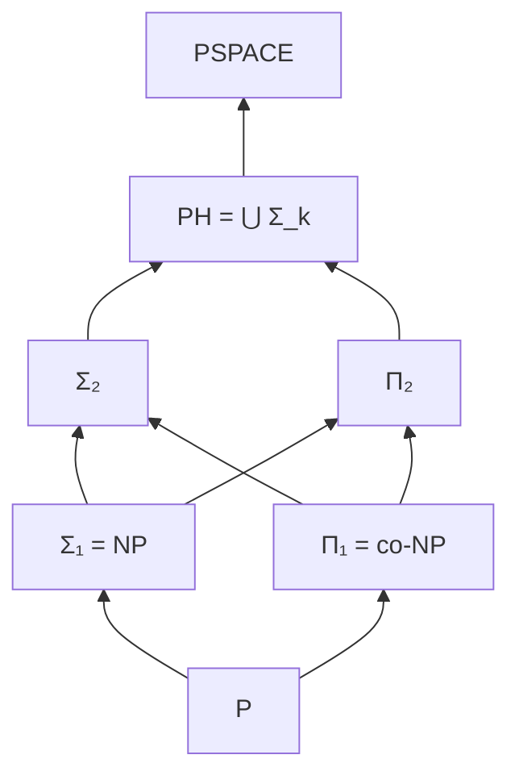
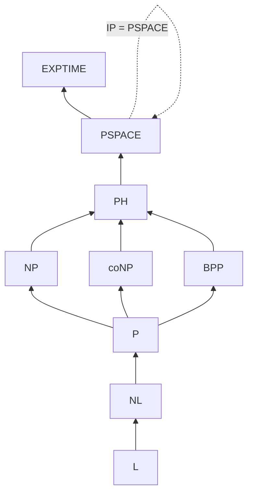

# Complexity Classes: P and NP — Senior Level

## Prerequisites

- [Middle Level](./middle.md) — P, NP, NP-completeness, polynomial-time verifiers, the Cook–Levin theorem, why P=NP matters
- [Reductions and NP-Completeness — Senior](../07-reductions-and-np-completeness/senior.md) — many-one reductions, gadgets, the canonical hard problems

## Table of Contents

1. [What Senior-Level Complexity Theory Is About](#what-senior-level-complexity-theory-is-about)
2. [The Polynomial Hierarchy](#the-polynomial-hierarchy)
3. [NP-Intermediate Problems and Ladner's Theorem](#np-intermediate-problems-and-ladners-theorem)
4. [Why P vs NP Is Hard: The Barriers](#why-p-vs-np-is-hard-the-barriers)
5. [Space Complexity Classes](#space-complexity-classes)
6. [Randomized Complexity Classes](#randomized-complexity-classes)
7. [Interactive Proofs and the Modern Frontier](#interactive-proofs-and-the-modern-frontier)
8. [The Map of Classes](#the-map-of-classes)
9. [What "NP-Hard" Licenses You to Conclude](#what-np-hard-licenses-you-to-conclude)
10. [Decision Framework](#decision-framework)
11. [Research Pointers](#research-pointers)
12. [Key Takeaways](#key-takeaways)

---

## What Senior-Level Complexity Theory Is About

Junior and middle levels establish the load-bearing facts: P is what you can *solve* in polynomial time, NP is what you can *verify* in polynomial time, NP-complete problems are the hardest in NP, and `P = NP?` is open and would be civilization-altering if `P = NP`. That is the elevator pitch, and for day-to-day engineering it is almost enough.

Senior-level complexity theory is about the **structure of the landscape around** P and NP — and, more usefully for an engineer, about **knowing the limits of what a hardness result tells you**:

1. **The classes do not stop at NP.** There is a whole tower (the polynomial hierarchy), a parallel world of space-bounded classes, and a world of randomized classes — and the relationships between them are mostly *conjectured*, not proved. Knowing which separations are theorems and which are beliefs is the senior skill.
2. **`P ≠ NP` is hard for *provable* reasons.** Three barriers — relativization, natural proofs, algebrization — each rule out an entire *style* of proof. Understanding them is what separates "P vs NP is unsolved" from "here is *why* every easy idea you'll have has already been shown insufficient."
3. **Randomness and interaction changed the picture.** The modern belief is `P = BPP` (randomness doesn't buy super-polynomial power), and `IP = PSPACE` (interaction does). These are not footnotes; they reshaped how we think about what efficient computation means.
4. **An NP-hardness proof is a precise, *narrow* statement.** It is routinely over-read. The senior payoff of this entire topic is calibrating exactly what `NP-hard` licenses you to conclude in a design review — and, just as importantly, what it does not.

Get this wrong and you will either chase an impossible exact algorithm, or abandon a perfectly tractable problem instance because someone said the general case is "NP-hard."

---

## The Polynomial Hierarchy

NP and co-NP are the first floor of a tower called the **polynomial hierarchy** (PH), defined by *alternating quantifiers* over a polynomial-time-checkable predicate.

### Quantifier characterization

A language `L` is in NP iff there is a poly-time predicate `R` and a polynomial bound such that

```text
x ∈ L  ⇔  ∃y (|y| ≤ poly(|x|))  R(x, y)
```

The witness `y` is the certificate; `R` is the verifier. co-NP flips the quantifier:

```text
x ∈ L  ⇔  ∀y (|y| ≤ poly(|x|))  R(x, y)
```

The hierarchy is built by *alternating* `∃` and `∀`:

- **Σ₁ = NP** : `∃y. R(x, y)` — one existential block.
- **Π₁ = co-NP** : `∀y. R(x, y)` — one universal block.
- **Σ₂** : `∃y₁ ∀y₂. R(x, y₁, y₂)` — exists-then-for-all.
- **Π₂** : `∀y₁ ∃y₂. R(x, y₁, y₂)`.
- **Σ_k** : `k` alternating blocks starting with `∃`.
- **Π_k** : `k` alternating blocks starting with `∀`.
- **Δ_k** : the "deterministic" level, `Δ_k = P^{Σ_{k-1}}` — problems solvable in poly time *with an oracle* for the level below. `Δ₁ = P`, `Δ₂ = P^NP`.

And `PH = ⋃_k Σ_k = ⋃_k Π_k`.



### What a Σ₂ problem looks like

The quantifier alternation is not abstract. **Minimum equivalent DNF** — "is there a DNF formula of size ≤ k equivalent to the given formula φ?" — is naturally Σ₂: *there exists* a small formula ψ *such that for all* assignments, ψ and φ agree. The inner "for all assignments" is a co-NP check; wrapping it in "there exists a small ψ" makes the whole thing Σ₂. Whenever you find yourself saying "find an X such that no Y breaks it," you are likely above NP.

### The collapse theorems — the important part

The hierarchy is *believed* to be infinite (each level strictly larger than the last), but this is **unproved**. What *is* proved is a cascade of collapse results:

- **If `P = NP`, then `PH = P`** — the entire tower collapses to the ground floor. Intuition: an NP oracle is free if `P = NP`, so each higher level loses its power, inductively.
- **If `NP = co-NP`, then `PH = NP`** (collapse to the first level).
- **General collapse:** if any two adjacent levels coincide, `Σ_k = Σ_{k+1}` (equivalently `Σ_k = Π_k`), then **the hierarchy collapses to level k**: `PH = Σ_k`. The tower cannot have a "finite top with more above" — once it stops growing, it has stopped forever.

This gives the field a powerful proof tactic: **"if X were true, PH would collapse"** is treated as strong evidence that X is false, because almost no one believes PH collapses. For example, the proof that the graph-isomorphism problem is *not* NP-complete-under-reasonable-assumptions runs exactly this way ("if GI were NP-complete, PH would collapse to Σ₂").

The intuition behind the master collapse is worth internalizing. Suppose `Σ_k = Π_k`. The defining feature of `Σ_{k+1}` is an outermost `∃` block wrapping a `Π_k` predicate: `∃y. [Π_k-predicate](x, y)`. If `Π_k = Σ_k`, that inner predicate can be rewritten as a `Σ_k` predicate — whose *own* outermost quantifier is `∃`. Two adjacent `∃` blocks **merge into one** (existentially quantifying a pair is one existential quantifier), so the `(k+1)`-block formula contracts to `k` blocks: `Σ_{k+1} ⊆ Σ_k`. Inducting upward, *every* higher level falls to `Σ_k`. The whole tower is held up by the *strictness* of each rung; remove one rung and the structure above it has nothing to stand on.

### PH sits inside PSPACE

`PH ⊆ PSPACE`. A polynomial number of quantifier alternations can be evaluated by a recursive procedure that reuses space across branches — polynomial space suffices to evaluate any fixed `Σ_k` predicate. Whether the containment is strict is open (a proof that `PH ⊊ PSPACE` would, among other things, separate P from PSPACE). Note the asymmetry: PH is *believed* infinite, yet *all of it* fits in PSPACE, and PSPACE is believed strictly larger still.

---

## NP-Intermediate Problems and Ladner's Theorem

A natural question: if `P ≠ NP`, is *every* problem in NP either in P (easy) or NP-complete (maximally hard)? The answer is **no**.

### Ladner's theorem (1975)

> **Theorem (Ladner).** If `P ≠ NP`, then there exist languages in NP that are neither in P nor NP-complete. These are the **NP-intermediate** (NPI) problems.

The proof is a **diagonalization / "lazy padding"** construction: it builds an artificial language by interleaving regions where the language behaves like SAT (so it can't be in P) with regions where it behaves trivially (so it can't be NP-complete, because no reduction can cover the sparse hard part). The construction is non-constructive in spirit — it manufactures a problem to prove existence, and the manufactured problem is not one anyone would care about.

The interesting consequence is structural: **the world of NP is not a clean dichotomy.** There is a middle, and it is non-empty exactly when `P ≠ NP`. (Conversely, if `P = NP`, everything is in P and the question is vacuous — so NPI existence is *equivalent* to `P ≠ NP`.)

### The natural candidates — and why engineers care

Far more interesting than Ladner's artificial language are **natural problems suspected to be NPI**: in NP, not known to be in P, not known to be NP-complete.

| Problem | Status | Why it matters |
|---|---|---|
| **Integer factoring** | NP ∩ co-NP; not believed NP-complete | RSA's security rests on its hardness |
| **Discrete logarithm** | Similar structural position | Diffie–Hellman, DSA, classical ECC |
| **Graph isomorphism (GI)** | Quasi-polynomial (Babai 2016); not believed NP-complete | The textbook NPI candidate for decades |
| **Lattice problems (approx-SVP / LWE)** | Believed hard, not NP-complete for the relevant approx factors | Post-quantum cryptography |

**Factoring and discrete log are the load-bearing examples for cryptography.** Crucially, they are believed *not* to be NP-complete:

- Factoring sits in **NP ∩ co-NP** (you can certify both that a number has a factor below k *and*, via its prime factorization, that it does not). If an NP ∩ co-NP problem were NP-complete, then `NP = co-NP` and PH collapses — so factoring being NP-complete would be a small earthquake. This is *why* nobody expects it.
- This matters for crypto: an NP-complete problem is "hard in the worst case," but RSA needs hardness on *average* (random instances), and it needs a problem that is hard but *not* so structurally hard that it drags all of NP with it. Factoring's intermediate, structured position is a feature.
- **Shor's algorithm** factors in *quantum* polynomial time. This is the clean illustration that "intermediate" hardness is fragile: factoring is plausibly NPI for classical machines yet falls to a quantum computer, which is exactly why post-quantum cryptography migrated to lattice problems.

### Why NP-completeness is the *wrong* hardness for cryptography

It is a common and damaging misconception that "to build secure crypto, base it on an NP-complete problem." Three reasons this is wrong, all sharpening the NPI story:

1. **NP-completeness is worst-case hardness; crypto needs average-case hardness.** An NP-complete problem is hard on *some* family of instances. A cipher must be hard on the *random* keys your users actually generate. A problem can be NP-complete yet trivial on random instances (random 3-SAT away from the threshold is usually easy). Worst-case-to-average-case reductions are known for *very few* problems — lattice problems (Ajtai) are the celebrated exception, which is precisely why they anchor post-quantum crypto.
2. **NP-completeness would drag all of NP down with it.** If your one-way function's underlying problem were NP-complete and you *broke* it, you'd collapse all of NP — too much leverage, and conversely a sign the problem is structurally entangled with everything, which complicates clean security reductions.
3. **You need *invertibility structure*, not just hardness.** Factoring and discrete log are useful because they come with rich algebraic structure (trapdoors, homomorphisms) that NP-complete problems like SAT lack. The structure that makes factoring NPI-rather-than-NP-complete is the *same* structure that makes it cryptographically usable.

The takeaway: the cryptographically valuable problems sit in the **intermediate** zone by design — hard enough to resist attack on average, structured enough to build trapdoors, and *not* NP-complete (which would be both too strong a claim and the wrong kind of hardness).

### Graph isomorphism after Babai

GI was *the* poster child for NPI for forty years. In 2016, **László Babai** announced a **quasi-polynomial-time** algorithm — running in `2^{(log n)^{O(1)}}` time, faster than any exponential but slower than any polynomial. This did not put GI in P, but it pushed it dramatically closer, reinforcing the belief that GI is not NP-complete (an NP-complete problem with a quasi-poly algorithm would imply a quasi-poly algorithm for all of NP, which essentially no one believes). GI remains the cleanest *natural* candidate for genuinely intermediate complexity.

---

## Why P vs NP Is Hard: The Barriers

The deepest senior-level content is *why* the problem resists. There are three known **barriers**, each a meta-theorem proving that an entire *class of proof techniques* cannot resolve `P vs NP`. They are the reason "I have a simple idea to prove P ≠ NP" is almost always wrong.

### Barrier 1: Relativization (Baker–Gill–Solovay, 1975)

An **oracle** is a black box that answers membership queries for some fixed language `A` in one step. `P^A` and `NP^A` are P and NP given free access to oracle `A`. A proof technique **relativizes** if it stays valid when both classes are given the same oracle — and almost all "classical" techniques (diagonalization, simulation) relativize, because they treat the machine as a black box.

> **Theorem (Baker–Gill–Solovay).** There exist oracles `A` and `B` such that `P^A = NP^A` and `P^B ≠ NP^B`.

- `A` = a `PSPACE`-complete language. With it, both `P^A` and `NP^A` swell up to PSPACE, so they coincide.
- `B` = a carefully constructed language where an existential "needle in a haystack" query separates the classes (the NP machine guesses the needle; the P machine must search exponentially).

The construction of `B` is the instructive half. Build the oracle in stages so that it encodes a "secret" language `L_B = { 1ⁿ : B contains some string of length n }`. Membership of `1ⁿ` is trivially in `NP^B` — the NP machine *guesses* a length-`n` string and asks the oracle whether it's in `B` (one existential guess, one query). But a *deterministic* poly-time machine making only `poly(n)` queries cannot, on inputs of length `n`, inspect more than a polynomial fraction of the `2ⁿ` candidate strings; the adversary building `B` simply waits to see which strings the (enumerated) deterministic machines query and plants the witness *outside* that queried set. So no `P^B` machine decides `L_B`, giving `P^B ≠ NP^B`. The needle is hidden in a haystack the deterministic searcher provably cannot finish combing.

**What it rules out:** any proof that *relativizes* cannot settle P vs NP, because the answer is `yes` relative to `A` and `no` relative to `B`. A relativizing proof, being oracle-blind, would have to give the *same* answer in both worlds — a contradiction. So diagonalization alone (the technique behind the time/space hierarchy theorems) **provably cannot** resolve P vs NP. Any successful proof must be **non-relativizing** — it must exploit the internal structure of computation, not treat machines as black boxes.

### Barrier 2: Natural Proofs (Razborov–Rudich, 1994)

Circuit-complexity lower bounds were the great hope of the 1980s: prove some NP problem needs super-polynomial-size circuits and you separate P from NP. Many such proofs share a structure Razborov and Rudich called **natural**: they exhibit a property of Boolean functions that is (a) **useful** — every easy (small-circuit) function lacks it, so possessing it implies hardness — and (b) **large/constructive** — the property holds for a large fraction of all functions and is efficiently checkable.

> **Theorem (Razborov–Rudich).** If strong **one-way functions** exist (equivalently, strong pseudorandom function generators exist — a standard cryptographic assumption), then **no natural proof can separate P from NP** (more precisely, P/poly from NP).

- The argument: a natural property is, in effect, an efficient *distinguisher* between random functions and pseudorandom (small-circuit) functions. But pseudorandom functions are *defined* to be indistinguishable from random by any efficient test. So a natural lower-bound proof would break the very cryptography most of the field believes is secure.

**What it rules out:** the entire "find a large, constructive, useful combinatorial property" approach — which describes nearly every circuit lower bound proved before 1994. To beat NP, a proof must be **un-natural**: it must violate either *largeness* (target a special, non-generic property) or *constructivity* (use a property that is not efficiently checkable). This is why progress on circuit lower bounds has been so painfully slow.

### Barrier 3: Algebrization (Aaronson–Wigderson, 2008)

After natural proofs, the action moved to **algebraic** techniques — arithmetization (lifting Boolean formulas to low-degree polynomials over a field), the engine behind `IP = PSPACE` and the PCP theorem. These are *non-relativizing*, so they slipped past barrier 1. Aaronson and Wigderson asked whether they suffice, and defined a refined notion: a proof **algebrizes** if it stays valid when one class gets an oracle `A` and the other gets a *low-degree polynomial extension* `Ã` of that oracle.

> **Theorem (Aaronson–Wigderson).** All known arithmetization-based techniques algebrize. And algebrizing techniques **cannot** resolve P vs NP (and many other open separations): there are algebraic oracle settings forcing each answer.

**What it rules out:** the algebraic/arithmetization toolkit *as currently used* — even though it is powerful enough to prove `IP = PSPACE`, it is provably *not* powerful enough to separate P from NP. A successful proof must be **non-algebrizing** as well as non-relativizing and un-natural.

### The combined message

| Barrier | Rules out | A proof must be |
|---|---|---|
| Relativization (1975) | Oracle-blind techniques: diagonalization, simulation | Non-relativizing |
| Natural proofs (1994) | Large + constructive combinatorial properties (most circuit bounds) | Un-natural |
| Algebrization (2008) | Arithmetization as currently deployed | Non-algebrizing |

No known technique threads all three needles. This is the honest senior answer to "why is P vs NP still open?": it is not that no one is trying — it is that we have *proved* the obvious families of approaches are insufficient, and we do not yet have a fourth family. See [`../09-lower-bounds-and-adversary-arguments/senior.md`](../09-lower-bounds-and-adversary-arguments/senior.md) for how lower-bound proof techniques work in the concrete settings where they *do* succeed.

---

## Space Complexity Classes

Time is one axis; **space** (memory) is the other, and the space-bounded classes have a surprisingly clean and well-understood structure — in sharp contrast to the time-bounded world. See [`../01-time-vs-space-complexity/senior.md`](../01-time-vs-space-complexity/senior.md) for the engineering view of the time/space trade-off.

### The space classes

| Class | Definition | Canonical complete problem |
|---|---|---|
| **L** | Deterministic **log**arithmic work space | Undirected `s–t` connectivity (Reingold, 2008) |
| **NL** | **N**ondeterministic log space | Directed `s–t` connectivity (STCON) |
| **PSPACE** | Polynomial space (any amount of time) | TQBF / QBF |
| **NPSPACE** | Nondeterministic polynomial space | — (equals PSPACE) |

Log space means the work tape holds `O(log n)` bits — enough for a constant number of pointers/counters into the input, but not enough to copy the input. This is not an academic toy: **L** and **NL** are the natural home of *streaming-ish* and *pointer-chasing* computations where memory is the scarce resource. Computing whether one node reaches another in a huge graph you can only access by following edges (directed STCON) is the defining NL-complete problem; deciding the same for an *undirected* graph turned out to be in **L** (Reingold's 2008 deterministic log-space random walk derandomization — itself a hardness-vs-randomness triumph). When you hear "can this run in `O(log n)` extra memory over a read-only input?", you are asking an L-vs-NL question.

The chain of *known* containments:

```text
L ⊆ NL ⊆ P ⊆ NP ⊆ PH ⊆ PSPACE = NPSPACE ⊆ EXPTIME
```

Every containment above is believed strict somewhere, but the only *proved* strict separations along this chain come from the hierarchy theorems: `L ⊊ PSPACE` and `P ⊊ EXPTIME` (and `NL ⊊ PSPACE`). We cannot even prove `P ⊊ PSPACE`, though essentially everyone believes it.

### Savitch's theorem — nondeterminism is cheap in space

> **Theorem (Savitch, 1970).** `NSPACE(s(n)) ⊆ DSPACE(s(n)²)` for `s(n) ≥ log n`. In particular **`NPSPACE = PSPACE`** and `NL ⊆ DSPACE(log² n)`.

The proof is a recursive reachability procedure: to decide whether configuration `b` is reachable from `a` in `≤ 2^t` steps, ask whether there's a midpoint `m` reachable from `a` in `≤ 2^{t-1}` steps *and* from which `b` is reachable in `≤ 2^{t-1}` steps — recursing on the midpoint. The recursion depth is `t = O(s)`, and each frame stores one configuration of size `O(s)`, so total space is `O(s²)`. The genius is **reusing the same space across the two recursive halves** rather than storing an entire path.

The contrast with time is profound: in the *time* world, nondeterminism is conjectured to be exponentially powerful (`P` vs `NP`); in the *space* world, Savitch proves it costs only a **quadratic** blow-up. Memory can be reused; elapsed time cannot.

### Immerman–Szelepcsényi — nondeterministic space is closed under complement

> **Theorem (Immerman & Szelepcsényi, 1987, independently).** For `s(n) ≥ log n`, `NSPACE(s)` is closed under complement. In particular **`NL = co-NL`**.

This stunned the field. The time analog — `NP = co-NP` — is the central *unsolved* question whose resolution would collapse PH. Yet for space, the answer is a clean *yes*. The proof technique is **inductive counting**: a nondeterministic log-space machine can count the exact number of configurations reachable from the start in `≤ k` steps, and use that count to certify *non*-reachability (the complement of STCON) — the count lets you verify "I have seen all reachable nodes, and `t` is not among them." This gave one of the first natural problems known to be in NL but whose *complement* membership was non-obvious.

### PSPACE-completeness: TQBF

The canonical PSPACE-complete problem is **TQBF** (True Quantified Boolean Formula), also written **QBF**: given a *fully quantified* Boolean formula

```text
∃x₁ ∀x₂ ∃x₃ … Q xₙ.  φ(x₁, …, xₙ)
```

decide whether it is true. SAT is the special case with only `∃` quantifiers (one block); TQBF allows *unbounded* alternation, which is exactly what takes you from NP all the way up to PSPACE. The polynomial hierarchy is the "bounded alternation" sliver between them: `Σ_k`/`Π_k` are TQBF restricted to `k` quantifier blocks.

TQBF is the natural model for **two-player games of polynomial length** — "does White have a move (∃) such that for all Black replies (∀) White has a move (∃) …, White wins?" This is why generalized board games (generalized Geography, generalized Chess/Go on `n×n` boards under suitable rules) are PSPACE-hard (or harder). When you see *adversarial alternation* — you choose, then the adversary chooses, then you choose — you are in PSPACE territory, not NP.

A concrete contrast makes the jump from SAT to TQBF tangible:

```text
SAT  (NP-complete):    ∃x₁ ∃x₂ ∃x₃.            φ        — "can I satisfy φ?"
TQBF (PSPACE-complete): ∃x₁ ∀x₂ ∃x₃.            φ        — "can I win the φ-game?"
```

For SAT, a *single* satisfying assignment is a short certificate the verifier checks in poly time — that's the NP characterization. For TQBF there is **no short certificate**: a winning strategy is a *tree* of responses, one branch per possible adversary move, of potentially exponential size. You cannot hand the verifier "the answer" — you can only *play out* the game, and that is exactly what polynomial space (reused depth-first across the game tree) buys you and polynomial *certificates* do not. This is the structural reason a problem can be in PSPACE yet (presumably) not in NP.

---

## Randomized Complexity Classes

Real algorithms use randomness (hashing, primality testing, Monte Carlo). Complexity theory captures this with classes of problems solvable by a poly-time probabilistic Turing machine, classified by their *error profile*.

### The randomized classes

| Class | Error type | Guarantee |
|---|---|---|
| **RP** | One-sided | `x ∈ L` ⇒ accept with prob ≥ ½; `x ∉ L` ⇒ **always** reject (no false positives) |
| **co-RP** | One-sided | `x ∉ L` ⇒ reject with prob ≥ ½; `x ∈ L` ⇒ **always** accept (no false negatives) |
| **BPP** | Two-sided | correct with prob ≥ ⅔ on **every** input (bounded error) |
| **ZPP** | Zero error | always correct; *expected* poly time (Las Vegas). `ZPP = RP ∩ co-RP` |

The error thresholds are arbitrary because of **amplification**: run the algorithm `k` independent times and take a majority (BPP) or an OR/AND (RP/co-RP). By Chernoff bounds the error drops *exponentially* in `k`, so `⅔` and `½ + 1/poly` and `1 − 2^{-n}` all define the *same* class. This is why "prob ≥ ⅔" is not a fragile constant — it is robust to within an exponential.

The asymmetry between the classes is exactly about *which* errors are tolerated. For **RP**, repetition is essentially free for confidence: since a "no" instance is *never* accepted, a single "accept" across `k` runs is conclusive proof of membership, and `k` runs drive the false-negative rate to `2^{-k}`. **BPP**, with two-sided error, needs a *majority* vote rather than a single lucky hit — both directions can lie — but Chernoff still gives exponential decay. **ZPP = RP ∩ co-RP** captures the Las Vegas algorithms that never err but whose runtime is a random variable with polynomial *expectation*; you trade a bounded-error guarantee for an always-correct answer at the cost of unbounded (but rarely large) running time. The practical reading: RP/co-RP are "I might miss it but never cry wolf" (or vice versa); BPP is "I'm usually right both ways"; ZPP is "always right, usually fast."

Known containments:

```text
P ⊆ ZPP ⊆ RP ⊆ BPP ⊆ ???
P ⊆ ZPP ⊆ co-RP ⊆ BPP
RP ⊆ NP        (a witness = the lucky random string)
```

### BPP sits inside the polynomial hierarchy

A landmark structural result:

> **Theorem (Sipser–Gács, with Lautemann's simpler proof, 1983).** `BPP ⊆ Σ₂ ∩ Π₂`.

So randomized polynomial time, even with two-sided error, lives *inside the second level of PH*. Lautemann's proof is a gem: if a BPP machine accepts `x` with overwhelming probability, then a *small set of random-string shifts* covers the whole acceptance space (a `∃ shifts ∀ string` statement, hence Σ₂); if it rejects, no such cover exists. Consequence: **if `P = NP` then `BPP = P`**, because `P = NP` collapses PH and BPP is trapped inside it.

### The modern belief: P = BPP

Here is the senior-defining inversion of intuition. For decades, BPP looked plausibly *larger* than P — randomness seemed to add power (primality was the famous example: a fast *randomized* test, Solovay–Strassen / Miller–Rabin, long before a deterministic one). The modern consensus is the opposite:

> **Conjecture (widely believed):** `P = BPP`. Randomness does **not** add super-polynomial computational power; it can always be removed (*derandomized*).

The theoretical engine is the **hardness-vs-randomness** paradigm:

- **Nisan–Wigderson (1994)** showed how to build a **pseudorandom generator (PRG)** from a hard function: if there exists a function in `E = DTIME(2^{O(n)})` requiring exponential-size circuits, then that hardness can be *stretched* into pseudorandom bits that fool any poly-time test.
- **Impagliazzo–Wigderson (1997)** sharpened this to a near-equivalence: a sufficiently strong **circuit lower bound** (some problem in E needs `2^{Ω(n)}`-size circuits) implies `P = BPP`. **Hardness buys derandomization.**

The deep moral: **pseudorandomness and computational hardness are two sides of one coin.** If hard problems exist (which everyone believes), then their hardness can be recycled into "random-looking" bits good enough to replace true randomness — so true randomness is, asymptotically, a convenience rather than a power. The primality story is the empirical vindication: the randomized **Miller–Rabin** test (1976) was eventually matched by the *deterministic* poly-time **AKS** test (2002) — primality moved from BPP-but-not-known-P to provably P, exactly as the `P = BPP` belief predicts.

Note the elegant *self-referential* logic of the hardness-vs-randomness program: derandomizing BPP would itself require *proving* circuit lower bounds, which we cannot yet do (Barrier 2 is one reason). So the field is in a curious position — it strongly believes `P = BPP`, yet a proof of `P = BPP` would entail exactly the kind of lower bound the barriers tell us is hard to obtain. Belief and proof, again, sit far apart; the *consequences* of derandomization (it would yield non-trivial circuit lower bounds, by Kabanets–Impagliazzo) confirm that this is a deep statement, not a routine one.

The clean illustration: **Miller–Rabin** is fast, simple, with exponentially small error, and is what production code actually runs; **AKS** proves primality ∈ P but is slower in practice. Theory says they should be equivalent in *power*; engineering still picks the randomized one for *constants*.

---

## Interactive Proofs and the Modern Frontier

The most surprising results of the last 40 years come from making the *verifier* interactive and probabilistic, instead of a passive certificate-checker.

### IP = PSPACE

In an **interactive proof** (`IP`), an all-powerful but untrusted **Prover** exchanges messages with a randomized poly-time **Verifier**. The Verifier accepts true statements (with the honest prover) and rejects false ones (against *any* cheating prover) with high probability. This generalizes NP: NP is the special case of a *single* message (the certificate) and a *deterministic* check.

> **Theorem (Shamir, 1992; building on LFKN).** `IP = PSPACE`.

Interaction plus randomness lets a *polynomial-time* verifier be convinced of any *PSPACE* statement — for example, the truth of a quantified Boolean formula (TQBF) — by a prover it does not trust. The proof technique is **arithmetization**: encode the Boolean formula as a low-degree polynomial over a finite field, and have the prover answer randomized "sum-check" queries the verifier can spot-check cheaply. (This is precisely the *algebrizing* technique from Barrier 3 — powerful enough for `IP = PSPACE`, provably not enough for `P vs NP`.)

### The PCP theorem and hardness of approximation

> **PCP Theorem (Arora–Safra; Arora–Lund–Motwani–Sudan–Szegev, 1992).** `NP = PCP(O(log n), O(1))`. Every NP statement has a proof that a verifier can check by reading only a **constant** number of randomly chosen bits, using `O(log n)` random bits, with bounded error.

This "probabilistically checkable proof" characterization of NP is one of the crown jewels of complexity theory. Its operational consequence is the foundation of **hardness of approximation**: for many optimization problems, the PCP theorem shows it is NP-hard not merely to solve them exactly but even to *approximate* the optimum within certain factors. The robust, gap-amplified proofs it produces are exactly why we can say "MAX-3SAT is NP-hard to approximate beyond 7/8," and so on. This is the bridge to the next topic — see [`../08-approximation-and-hardness/senior.md`](../08-approximation-and-hardness/senior.md) for how PCP-derived inapproximability sets the *ceiling* on what any approximation algorithm can achieve.

---

## The Map of Classes

A consolidated picture of the believed (and proved) relationships.



| Relationship | Status |
|---|---|
| `L ⊆ NL ⊆ P ⊆ NP ⊆ PH ⊆ PSPACE ⊆ EXPTIME` | **Proved** (containments) |
| `L ⊊ PSPACE`, `NL ⊊ PSPACE`, `P ⊊ EXPTIME` | **Proved** (hierarchy theorems) |
| `P ≠ NP` | **Open** (conjectured true) |
| `NL = co-NL` | **Proved** (Immerman–Szelepcsényi) |
| `NPSPACE = PSPACE` | **Proved** (Savitch) |
| `NP = co-NP` | **Open** (conjectured false) |
| `PH` infinite (no collapse) | **Open** (conjectured infinite) |
| `BPP ⊆ Σ₂ ∩ Π₂` | **Proved** (Sipser–Gács / Lautemann) |
| `P = BPP` | **Open** (conjectured true) |
| `IP = PSPACE` | **Proved** (Shamir) |
| `P ⊊ PSPACE` | **Open** (conjectured true) |

The single most important habit this table should instill: **distinguish theorem from belief.** Most of the "obvious" separations you'd quote in conversation are conjectures, not facts. The few we have proved (NL = co-NL, NPSPACE = PSPACE, IP = PSPACE) are often the *surprising* ones.

---

## What "NP-Hard" Licenses You to Conclude

This is the section that pays the rent. NP-hardness is the most over-interpreted result in practical computer science. Here is the precise calculus.

### What NP-hardness *does* license

- **No worst-case polynomial-time exact algorithm is known, and finding one would prove `P = NP`.** So you should not staff a sprint to find an exact poly-time algorithm for the *general* problem. That is the legitimate, strong conclusion.
- **It justifies pivoting** to approximation, heuristics, parameterized algorithms, or exact-but-exponential solvers — and tells your stakeholders *why* "just optimize it" is not a small ask.

### What NP-hardness does **not** license

- **It says nothing about your *instances*.** NP-hardness is a **worst-case, asymptotic** statement about an *infinite family* of inputs. Your actual inputs may be small, structured, or special-cased into easy subclasses. SAT is NP-complete, yet industrial SAT solvers dispatch instances with *millions* of variables daily. The general problem is hard; *your* problem might be trivial.
- **It does not mean "exponential time is required."** It means *no polynomial algorithm is known and one would imply `P = NP`.* The best algorithm might be `2^{O(√n)}` or `1.3^n` — devastating at `n = 10⁶`, perfectly fine at `n = 40`.
- **It does not forbid approximation.** Many NP-hard optimization problems have excellent approximation algorithms (PTAS, constant-factor). NP-hardness of the *exact* problem says nothing, by itself, about approximability — that requires a *separate* inapproximability result (which is where the PCP theorem earns its keep; see [`../08-approximation-and-hardness/senior.md`](../08-approximation-and-hardness/senior.md)).
- **It is not the end of the conversation.** It is the *start* of the right one: which structure can I exploit, which parameter is small, what approximation ratio is acceptable, how big are instances *really*?

### The senior checklist when someone says "that's NP-hard"

1. **Hard *under what reduction*, and is the reduction to *your* exact problem or a more general one?** People say "NP-hard" about a generalization they aren't actually solving.
2. **How large are real instances?** `n ≤ 30` makes many NP-hard problems a non-issue with a good exact solver (ILP, SAT, branch-and-bound, DP over subsets).
3. **Is there exploitable structure?** Bounded treewidth, planarity, fixed parameters, interval/chordal graphs — whole families turn NP-hard problems polynomial.
4. **Do I need *exact*, or is approximate fine?** If approximate, get the *separate* approximation-hardness result before assuming a good ratio is impossible.
5. **Is the worst case adversarial or natural?** If inputs aren't adversarial, average-case or smoothed behavior may be excellent (the simplex method is the classic example — exponential worst case, polynomial in practice).

The mature engineering stance: **NP-hardness is a redirect, not a dead end.** It reroutes you from "find the optimal polynomial algorithm" to the menu of approximation, parameterization, heuristics, and exact-exponential solvers — and it tells you to go *measure your instances* before despairing.

---

## Decision Framework

| Situation | Reach for |
|---|---|
| Problem has "find X such that no Y breaks it" (∃∀) | Suspect **Σ₂ / above NP**; an NP solver won't directly apply |
| Adversarial alternation, game of polynomial length | **PSPACE** territory (TQBF-like); expect no NP certificate |
| Need to bound *memory*, not time | Space classes: is it in **L / NL**? Savitch caps nondeterminism at quadratic space |
| Tempted to "just prove P ≠ NP" with a clean idea | Check it against the three **barriers** first; almost certainly insufficient |
| Crypto relies on a problem's hardness | Want **NPI-style** (factoring, discrete log, LWE), *not* NP-complete — and check quantum exposure |
| Have a randomized algorithm | It's in **BPP/RP/ZPP**; amplify error cheaply; derandomization may exist but constants favor the randomized version |
| Someone declares the task "NP-hard" | Run the **senior checklist**: instance size, structure, exact-vs-approx, adversarial-vs-natural |

---

## Research Pointers

- **Cook, S. (1971) / Levin, L. (1973).** The Cook–Levin theorem — SAT is NP-complete. The foundation; covered at [`../07-reductions-and-np-completeness/senior.md`](../07-reductions-and-np-completeness/senior.md).
- **Baker, T., Gill, J., & Solovay, R. (1975). "Relativizations of the P =? NP Question."** *SIAM J. Computing.* The oracle barrier.
- **Ladner, R. (1975). "On the Structure of Polynomial Time Reducibility."** *JACM.* NP-intermediate problems exist if `P ≠ NP`.
- **Savitch, W. (1970). "Relationships Between Nondeterministic and Deterministic Tape Complexities."** `NPSPACE = PSPACE`.
- **Immerman, N. (1988) & Szelepcsényi, R. (1988).** Independently: `NL = co-NL` via inductive counting.
- **Razborov, A., & Rudich, S. (1994). "Natural Proofs."** *STOC / JCSS.* The natural-proofs barrier.
- **Aaronson, S., & Wigderson, A. (2008). "Algebrization: A New Barrier in Complexity Theory."** The third barrier.
- **Lautemann, C. (1983). "BPP and the Polynomial Hierarchy."** The slick proof that `BPP ⊆ Σ₂`.
- **Nisan, N., & Wigderson, A. (1994). "Hardness vs. Randomness."** *JCSS.* PRGs from hard functions.
- **Impagliazzo, R., & Wigderson, A. (1997). "P = BPP if E requires exponential circuits."** *STOC.* Derandomization from circuit lower bounds.
- **Shamir, A. (1992). "IP = PSPACE."** *JACM.* And LFKN (Lund–Fortnow–Karloff–Nisan) for the sum-check / arithmetization technique.
- **Arora, S., & Safra, S. (1998); Arora, Lund, Motwani, Sudan, Szegedy (1998).** The PCP theorem.
- **Babai, L. (2016). "Graph Isomorphism in Quasipolynomial Time."** *STOC.* The breakthrough on the canonical NPI candidate.
- **Arora, S., & Barak, B. (2009). *Computational Complexity: A Modern Approach.*** The standard graduate text; covers every result above.

---

## Key Takeaways

1. **The classes form a tower, not a pair.** PH stacks `Σ_k`/`Π_k` via alternating quantifiers above NP/co-NP; `Σ₁ = NP`, `Π₁ = co-NP`. The whole tower collapses if *any* level coincides with the next — and totally if `P = NP`. `PH ⊆ PSPACE`.
2. **NP is not a clean dichotomy.** Ladner's theorem: if `P ≠ NP`, NP-intermediate problems exist. Factoring, discrete log, and (pre-Babai) graph isomorphism are the natural candidates — and crypto depends on them being hard *but not* NP-complete (NP-complete factoring would force `NP = co-NP` and collapse PH).
3. **`P ≠ NP` is hard for proved reasons — the three barriers.** Relativization (no oracle-blind proof), natural proofs (no large+constructive combinatorial property, assuming one-way functions), and algebrization (arithmetization isn't enough). Any winning proof must evade all three.
4. **Space is the well-behaved axis.** Savitch: `NPSPACE = PSPACE` (nondeterminism costs only a quadratic). Immerman–Szelepcsényi: `NL = co-NL` (the space analog of the *open* `NP = co-NP` is a *theorem*). TQBF is the PSPACE-complete model of bounded-and-unbounded quantifier alternation and of polynomial-length games.
5. **Randomness probably adds no power.** `BPP ⊆ Σ₂ ∩ Π₂` (Sipser–Gács/Lautemann), and the modern belief is `P = BPP` via hardness-vs-randomness (Nisan–Wigderson, Impagliazzo–Wigderson): circuit lower bounds yield derandomization. Primality (Miller–Rabin → AKS) is the empirical confirmation.
6. **Interaction is genuinely powerful:** `IP = PSPACE`, and the PCP theorem (`NP = PCP(log n, O(1))`) is the engine of approximation-hardness — the link to [`../08-approximation-and-hardness/senior.md`](../08-approximation-and-hardness/senior.md).
7. **"NP-hard" is a redirect, not a dead end.** It is worst-case and asymptotic. It says nothing about *your* instances' size or structure, does not imply exponential time is required, and does not by itself forbid good approximation. Measure your instances, hunt for structure, and demand a *separate* inapproximability result before giving up on a good ratio.

---

> **See also:** [`./middle.md`](./middle.md) for P, NP, and NP-completeness · [`../07-reductions-and-np-completeness/senior.md`](../07-reductions-and-np-completeness/senior.md) · [`../08-approximation-and-hardness/senior.md`](../08-approximation-and-hardness/senior.md) · [`../09-lower-bounds-and-adversary-arguments/senior.md`](../09-lower-bounds-and-adversary-arguments/senior.md) · [`../01-time-vs-space-complexity/senior.md`](../01-time-vs-space-complexity/senior.md)
