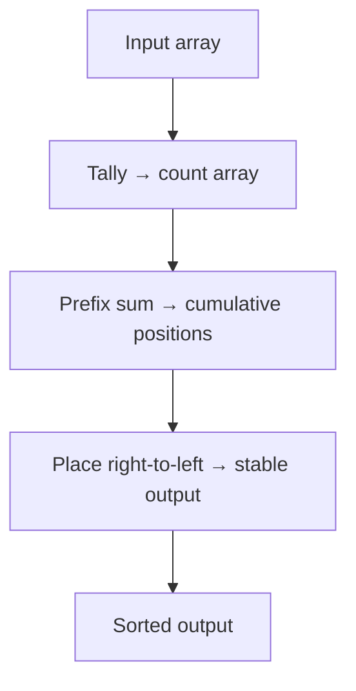

# Counting Sort — Junior Level

## Table of Contents

1. [Introduction](#introduction)
2. [Prerequisites](#prerequisites)
3. [Glossary](#glossary)
4. [Core Concepts](#core-concepts)
5. [Big-O Summary](#big-o-summary)
6. [Real-World Analogies](#real-world-analogies)
7. [Pros & Cons](#pros--cons)
8. [Step-by-Step Walkthrough](#step-by-step-walkthrough)
9. [Code Examples](#code-examples)
10. [Coding Patterns](#coding-patterns)
11. [Error Handling](#error-handling)
12. [Performance Tips](#performance-tips)
13. [Best Practices](#best-practices)
14. [Edge Cases & Pitfalls](#edge-cases--pitfalls)
15. [Common Mistakes](#common-mistakes)
16. [Cheat Sheet](#cheat-sheet)
17. [Visual Animation](#visual-animation)
18. [Summary](#summary)
19. [Further Reading](#further-reading)

---

## Introduction

> Focus: "What is Counting Sort?" and "How does it sort without comparing elements?"

**Counting Sort** is the canonical **non-comparison** sorting algorithm. Instead of asking "is `a[i]` smaller than `a[j]`?", it asks "how many times does the value `v` appear in the input?" — and uses that count to place every element directly into its final position. Because it never compares elements, it escapes the famous **Ω(n log n) lower bound** that every comparison-based sort (Bubble, Merge, Quick, Heap, Insertion) is stuck with. Counting Sort runs in **O(n + k)** time, where `n` is the number of elements and `k` is the size of the value range. When `k = O(n)`, the total cost is **linear** — strictly faster than any comparison sort can ever be.

The catch is in the name: Counting Sort only works on **bounded integer keys** (or things mappable to small integers — characters, enum values, ages, grades). If you feed it floats, arbitrary strings, or integers from `[0, 10^18]`, it either doesn't apply or eats more memory than the universe contains. The algorithm shines in two roles:

1. **A direct sort** when the key range is small and known — sorting ages (0–120), grades (0–100), DNA bases (A/C/G/T), or RGB color channels (0–255).
2. **An inner pass of Radix Sort** (Section 08) — Radix Sort processes digits one at a time, and each digit pass is a stable Counting Sort. The stability property is non-negotiable here: without it, Radix Sort produces wrong output.

Counting Sort was published by Harold H. Seward in 1954 — older than Quick Sort. It is still used today in every Radix Sort implementation, in GPU sorting kernels (where it parallelises beautifully via prefix-sum scans), and as a teaching example for the distinction between **comparison** and **non-comparison** models. Master it because:

1. It is the simplest example that the `n log n` lower bound is **about comparisons, not about sorting**. Change the model, change the bound.
2. The **prefix-sum trick** at the heart of Counting Sort is reused everywhere — Radix Sort, Bucket Sort, parallel scan primitives, GPU compaction, histogram equalisation.
3. The **right-to-left iteration** that preserves stability is a non-obvious detail; understanding *why* it works builds the intuition you need for the harder algorithms in this section.

---

## Prerequisites

- **Required:** Arrays/slices/lists — indexing, length, iteration in reverse
- **Required:** Loops and the ability to read an algorithm written in pseudocode
- **Required:** Understanding of **integer keys** — counting only works on discrete values
- **Helpful:** Familiarity with **stability** as a sorting property (see [`02-merge-sort/junior.md`](../02-merge-sort/junior.md))
- **Helpful:** The notion of `O(n)` vs `O(n log n)` complexity — see [`06-algorithmic-complexity/`](../../06-algorithmic-complexity/01-time-vs-space-complexity/junior.md)
- **Helpful:** Cumulative / prefix sums — Counting Sort uses them in the placement phase

---

## Glossary

| Term | Definition |
|------|-----------|
| **Comparison Sort** | A sort whose only access to keys is via comparisons (`<`, `<=`, etc.). Lower bound: Ω(n log n) |
| **Non-Comparison Sort** | A sort that uses key values directly (e.g., as array indices). Can beat Ω(n log n) |
| **Key Range / Universe** | The set of possible values, usually written `[0, k)` or `[0, k-1]` |
| **k** | Size of the key range. Counting Sort needs O(k) extra memory |
| **Count Array** | Auxiliary array of size `k`; `count[v]` stores how many times value `v` appears |
| **Prefix Sum / Cumulative Sum** | Running total: `count[v] = sum of count[0..v]`. Gives final position of value `v` |
| **Stability** | Equal elements keep their original relative order after sorting |
| **Right-to-Left Iteration** | Walking the input from the last index back to the first — the trick that preserves stability |
| **Offset** | A constant added to keys so that the minimum value maps to index 0 (handles negatives) |
| **Auxiliary Space** | Extra memory beyond the input array (Counting Sort: O(n + k)) |
| **In-Place Counting Sort** | A variant that overwrites the input directly. Faster, but **not stable** |
| **Radix Sort** | A sort that processes digits one at a time, using Counting Sort as its inner pass (Section 08) |
| **Bucket Sort** | A related non-comparison sort that distributes elements into ranges, then sorts each (Section 09) |

---

## Core Concepts

### Concept 1: Count, Don't Compare

A comparison sort spends its time asking "which of these two is smaller?". Counting Sort flips the question: instead of comparing pairs, it **walks the input once and tallies how often each value appears**. That tally is the count array. Once you know how many `0`s, `1`s, `2`s, ..., `k-1`s are in the input, you already know everything about the sorted order — you just emit them out in order of value, each one as many times as it appeared.

For an input `[2, 5, 3, 0, 2, 3, 0, 3]` (values in `[0, 6)`), the count array is:

```text
value:  0  1  2  3  4  5
count:  2  0  2  3  0  1
```

Output: `[0, 0, 2, 2, 3, 3, 3, 5]`. No comparison was ever made. This is the **counting** step, and it takes a single pass — **O(n)** to build the count, **O(k)** to walk the count and emit the output. Total: **O(n + k)**.

### Concept 2: The Prefix Sum Gives Final Positions

For the *naïve* sort above, scanning the count and emitting values works fine — but it loses any information attached to the keys (objects with extra fields, original index, etc.). The general algorithm fixes this with one extra step: transform the count array into a **prefix sum** that tells us the **final position** of each value.

After prefix-sum:

```text
value:           0  1  2  3  4  5
count (before):  2  0  2  3  0  1
count (after):   2  2  4  7  7  8
```

Now `count[v]` says: "values `<= v` occupy positions `0 .. count[v]-1` in the output." So the last `0` belongs at index 1, the last `2` belongs at index 3, the last `3` belongs at index 6, the last `5` belongs at index 7. We then walk the input and place each element into its slot, **decrementing the count** so the next equal element goes one slot to the left.

### Concept 3: Right-to-Left Iteration Preserves Stability

Here is the subtle part. We want **stability**: among equal keys, the one that appeared earlier in the input must appear earlier in the output. The prefix-sum approach achieves this *only if we iterate the input from right to left*.

Why? The prefix sum tells us "the **last** position for value `v` is `count[v]-1`." If we walk the input from the end backwards and place the right-most occurrence of `v` first (at `count[v]-1`), then the next-to-right-most occurrence at `count[v]-2`, and so on, the **leftmost** occurrence in the input ends up at the **leftmost** position in the output range — which is exactly stability.

If we walked left to right, we'd be placing the leftmost occurrence at the rightmost slot — reversing relative order. Subtle, but critical. **In Radix Sort (Section 08), stability is non-negotiable** — radix only works because each digit pass preserves the relative order of keys whose current digit ties.

### Concept 4: The Space Cost Is a Hard Constraint

Counting Sort's auxiliary space is **O(n + k)**: the output array of size `n`, plus the count array of size `k`. For `n = 1000` ages in `[0, 120]`, that's a 120-element count array — trivial. For `n = 1000` 32-bit integers in `[0, 2^32)`, the count array is 4 billion entries (16 GB). The algorithm becomes useless. **The hard rule:** Counting Sort is appropriate only when `k = O(n)` — when the universe is roughly the same size as the input, or smaller.

When `k` is too large, you have two options: (1) hash the values to a smaller range and live with collisions (Bucket Sort, Section 09), or (2) sort digit by digit using a small base, so each pass has small `k` (Radix Sort, Section 08).

### Concept 5: Linear, but Not Magic

Counting Sort is **O(n + k)** — true linear time when `k = O(n)`. This **does not violate** the Ω(n log n) lower bound, because the lower bound is for the **comparison model**. Counting Sort isn't a comparison sort: it reads `arr[i]` and uses the value directly as an array index. That single trick — treating data as an index — lets it sidestep the bound. The cost is the **O(k)** memory and the requirement that keys be small bounded integers. There is no free lunch: comparison sorts work on any totally ordered keys; Counting Sort works only on small ints.

---

## Big-O Summary

| Operation / Case | Complexity | Notes |
|-----------------|-----------|-------|
| Time — Best | **O(n + k)** | No early-exit advantage; same as average |
| Time — Average | **O(n + k)** | Independent of input order |
| Time — Worst | **O(n + k)** | **No O(n²) tail** like Quick Sort |
| Space — Auxiliary | **O(n + k)** | Output array + count array |
| Stable | **Yes** | When iterating input right-to-left during placement |
| In-place | **No** (standard) / Yes (unstable variant) | |
| Adaptive | **No** | Sorted/reverse input takes the same time |
| Comparisons | **0** | Non-comparison sort — uses values as array indices |
| Comparison-model lower bound | **Bypassed** | Counting Sort is not in the comparison model |
| Best for | Small bounded integer keys, inner pass of Radix Sort | |

> **Important:** when `k = O(n)`, total runtime is `O(n)` — strictly linear. When `k >> n` (e.g., `k = n^2`), Counting Sort becomes slower than `O(n log n)` Merge Sort and uses more memory.

---

## Real-World Analogies

| Concept | Analogy |
|---------|--------|
| **Counting occurrences** | A teacher tallying how many students got each grade A, B, C, D, F before lining them up by score |
| **Prefix sum gives position** | A queue numbering: "tickets 1–30 = adults, 31–55 = students, 56–60 = seniors" — knowing your category tells you your seat range |
| **Right-to-left for stability** | Stacking books on a shelf: place the rightmost book first at the rightmost slot, so the leftmost book lands at the leftmost slot — original left-to-right order preserved |
| **Bounded range requirement** | A library with one bin per Dewey-decimal category works only if the catalog is small enough to have that many bins |
| **Non-comparison nature** | Sorting envelopes by ZIP code: you don't compare ZIPs pairwise, you toss each envelope into the bin matching its ZIP |
| **k too large** | One bin per nine-digit ZIP+4 = 10^9 bins — impractical; bin by 5-digit ZIP first (Radix Sort idea) |

> **Where the analogy breaks:** Counting Sort doesn't physically "move" elements into bins — it computes positions arithmetically using prefix sums. The bin analogy is conceptually accurate but operationally simpler than the actual algorithm.

---

## Pros & Cons

| Pros | Cons |
|------|------|
| **Linear O(n + k) time** — beats the Ω(n log n) comparison-model bound | Only works on **bounded integer keys** (or things mappable to small ints) |
| **Stable** (when iterated right-to-left during placement) | **O(n + k) extra memory** — blows up when `k >> n` |
| **Predictable runtime** — input distribution doesn't matter | Not in-place in the stable form |
| **Simple to implement** — ~20 lines of code | Useless for keys with large range (e.g., 64-bit hashes, floats) |
| **Foundation of Radix Sort** — Counting Sort enables linear-time Radix Sort | Cache-unfriendly when `k` is very large |
| **Parallelisable** — counting and prefix-sum both scan-parallel; GPUs love it | Per-key metadata complicates the placement phase |

**When to use:**
- Keys are **small bounded integers** (ages, grades, byte values, small enum codes).
- You need **stability** and **worst-case linear time** simultaneously.
- You are implementing a **Radix Sort** and need its inner pass.
- You are writing a **GPU sort kernel** or a parallel histogram builder.
- The key universe is a known fixed size (e.g., 256 byte values, 10 digits).

**When NOT to use:**
- Keys are **floating-point** numbers or arbitrary strings (no direct mapping to small ints).
- The key range **k** is much larger than `n` (e.g., sorting 1000 random 32-bit ints — count array would have 4·10⁹ entries).
- Memory is tight and you cannot spare O(n + k) auxiliary buffers.
- You need an in-place sort (use Quick Sort or Heap Sort instead).

---

## Step-by-Step Walkthrough

Sort `[4, 2, 2, 8, 3, 3, 1]` (n = 7, values in `[0, 9)`, so k = 9):

**Phase 1 — Count occurrences (scan input once):**

```text
value:  0  1  2  3  4  5  6  7  8
count:  0  1  2  2  1  0  0  0  1
```

**Phase 2 — Convert to prefix sums (cumulative):**

```text
value:           0  1  2  3  4  5  6  7  8
count (before):  0  1  2  2  1  0  0  0  1
count (after):   0  1  3  5  6  6  6  6  7
```

Now `count[v]` = number of elements `<= v`. The last position used by value `v` will be `count[v] - 1`.

**Phase 3 — Place elements right to left into output:**

Input: `[4, 2, 2, 8, 3, 3, 1]` (indices 0..6). Walk from index 6 back to 0.

- `i=6, value=1`: `count[1]=1`, place at output[0]. Decrement: `count[1]=0`. Output: `[1, _, _, _, _, _, _]`
- `i=5, value=3`: `count[3]=5`, place at output[4]. Decrement: `count[3]=4`. Output: `[1, _, _, _, 3, _, _]`
- `i=4, value=3`: `count[3]=4`, place at output[3]. Decrement: `count[3]=3`. Output: `[1, _, _, 3, 3, _, _]`
- `i=3, value=8`: `count[8]=7`, place at output[6]. Decrement: `count[8]=6`. Output: `[1, _, _, 3, 3, _, 8]`
- `i=2, value=2`: `count[2]=3`, place at output[2]. Decrement: `count[2]=2`. Output: `[1, _, 2, 3, 3, _, 8]`
- `i=1, value=2`: `count[2]=2`, place at output[1]. Decrement: `count[2]=1`. Output: `[1, 2, 2, 3, 3, _, 8]`
- `i=0, value=4`: `count[4]=6`, place at output[5]. Decrement: `count[4]=5`. Output: `[1, 2, 2, 3, 3, 4, 8]` ✓

**Stability check:** The two `2`s in the input were at indices 1 and 2. In the output they are at indices 1 and 2 — same relative order. The two `3`s at indices 4 and 5 land at output indices 3 and 4 — same relative order. Stability holds because we walked the input right-to-left.

**Operation counts:**
- Comparisons: **0** (no element ever compared to another)
- Reads: n + k + n = 2n + k = 23
- Writes: n + k = 16

---

## Code Examples

### Example 1: Stable Counting Sort (Standard)

#### Go

```go
package main

import "fmt"

// CountingSort sorts arr ascending, stably, in O(n + k) time and O(n + k) space.
// Pre: every element is in [0, k).
func CountingSort(arr []int, k int) []int {
    n := len(arr)
    if n == 0 {
        return arr
    }
    count := make([]int, k)
    output := make([]int, n)

    // Phase 1: tally each value
    for _, v := range arr {
        count[v]++
    }

    // Phase 2: prefix sums - count[v] = final position (exclusive) for value v
    for i := 1; i < k; i++ {
        count[i] += count[i-1]
    }

    // Phase 3: place elements right to left (preserves stability)
    for i := n - 1; i >= 0; i-- {
        v := arr[i]
        count[v]--
        output[count[v]] = v
    }
    return output
}

func main() {
    data := []int{4, 2, 2, 8, 3, 3, 1}
    fmt.Println(CountingSort(data, 9)) // [1 2 2 3 3 4 8]
}
```

#### Java

```java
import java.util.Arrays;

public class CountingSort {
    // Sort arr ascending, stably. Pre: every element is in [0, k).
    public static int[] countingSort(int[] arr, int k) {
        int n = arr.length;
        if (n == 0) return arr;
        int[] count = new int[k];
        int[] output = new int[n];

        for (int v : arr) count[v]++;            // tally
        for (int i = 1; i < k; i++) count[i] += count[i - 1]; // prefix sum

        for (int i = n - 1; i >= 0; i--) {       // right-to-left for stability
            int v = arr[i];
            count[v]--;
            output[count[v]] = v;
        }
        return output;
    }

    public static void main(String[] args) {
        int[] data = {4, 2, 2, 8, 3, 3, 1};
        System.out.println(Arrays.toString(countingSort(data, 9)));
    }
}
```

#### Python

```python
def counting_sort(arr, k):
    """Sort arr ascending, stably. Pre: every element is in [0, k).
    Time: O(n + k). Space: O(n + k)."""
    n = len(arr)
    if n == 0:
        return arr
    count = [0] * k
    output = [0] * n

    # Phase 1: tally
    for v in arr:
        count[v] += 1

    # Phase 2: prefix sums
    for i in range(1, k):
        count[i] += count[i - 1]

    # Phase 3: place right-to-left for stability
    for i in range(n - 1, -1, -1):
        v = arr[i]
        count[v] -= 1
        output[count[v]] = v

    return output


if __name__ == "__main__":
    data = [4, 2, 2, 8, 3, 3, 1]
    print(counting_sort(data, 9))  # [1, 2, 2, 3, 3, 4, 8]
```

**What it does:** Allocates a count array of size `k` and an output array of size `n`. Tallies, prefix-sums, then walks the input right-to-left to place each element. Returns a new sorted array; does not mutate input.
**Run:** `go run main.go` | `javac CountingSort.java && java CountingSort` | `python counting.py`

---

### Example 2: Counting Sort with Offset (Handles Negative Values)

#### Go

```go
package main

import "fmt"

// CountingSortRange sorts arr ascending. Works for any integer range [min, max].
func CountingSortRange(arr []int) []int {
    n := len(arr)
    if n == 0 {
        return arr
    }
    minV, maxV := arr[0], arr[0]
    for _, v := range arr {
        if v < minV { minV = v }
        if v > maxV { maxV = v }
    }
    k := maxV - minV + 1
    count := make([]int, k)
    output := make([]int, n)

    for _, v := range arr {
        count[v-minV]++
    }
    for i := 1; i < k; i++ {
        count[i] += count[i-1]
    }
    for i := n - 1; i >= 0; i-- {
        v := arr[i]
        count[v-minV]--
        output[count[v-minV]] = v
    }
    return output
}

func main() {
    data := []int{-3, 7, -3, 0, 7, 2, -5}
    fmt.Println(CountingSortRange(data)) // [-5 -3 -3 0 2 7 7]
}
```

#### Java

```java
import java.util.Arrays;

public class CountingSortRange {
    public static int[] countingSortRange(int[] arr) {
        int n = arr.length;
        if (n == 0) return arr;
        int min = arr[0], max = arr[0];
        for (int v : arr) {
            if (v < min) min = v;
            if (v > max) max = v;
        }
        int k = max - min + 1;
        int[] count = new int[k];
        int[] output = new int[n];

        for (int v : arr) count[v - min]++;
        for (int i = 1; i < k; i++) count[i] += count[i - 1];

        for (int i = n - 1; i >= 0; i--) {
            int v = arr[i];
            count[v - min]--;
            output[count[v - min]] = v;
        }
        return output;
    }

    public static void main(String[] args) {
        int[] data = {-3, 7, -3, 0, 7, 2, -5};
        System.out.println(Arrays.toString(countingSortRange(data)));
    }
}
```

#### Python

```python
def counting_sort_range(arr):
    """Sort any integer array, including negatives. O(n + (max-min+1))."""
    n = len(arr)
    if n == 0:
        return arr
    mn, mx = min(arr), max(arr)
    k = mx - mn + 1
    count = [0] * k
    output = [0] * n

    for v in arr:
        count[v - mn] += 1
    for i in range(1, k):
        count[i] += count[i - 1]
    for i in range(n - 1, -1, -1):
        v = arr[i]
        count[v - mn] -= 1
        output[count[v - mn]] = v
    return output


if __name__ == "__main__":
    print(counting_sort_range([-3, 7, -3, 0, 7, 2, -5]))
```

**What it does:** Finds `min` in one scan, uses `value - min` as the index into the count array. Same complexity, same stability guarantee. The `min` shift lets you handle negative values and avoid wasting count slots when the range starts above 0.

---

### Example 3: Naïve Counting Sort (Faster When You Only Sort Keys)

#### Go

```go
package main

import "fmt"

// CountingSortNaive: sort plain ints (no attached objects) by directly
// emitting count[v] copies of v. Stable trivially. O(n + k).
func CountingSortNaive(arr []int, k int) []int {
    count := make([]int, k)
    for _, v := range arr {
        count[v]++
    }
    out := make([]int, 0, len(arr))
    for v := 0; v < k; v++ {
        for j := 0; j < count[v]; j++ {
            out = append(out, v)
        }
    }
    return out
}

func main() {
    fmt.Println(CountingSortNaive([]int{4, 2, 2, 8, 3, 3, 1}, 9))
}
```

#### Python

```python
def counting_sort_naive(arr, k):
    """Naive version: emit count[v] copies of each value. Works only
    when elements carry no extra data (sorting plain ints/keys)."""
    count = [0] * k
    for v in arr:
        count[v] += 1
    out = []
    for v in range(k):
        out.extend([v] * count[v])
    return out


print(counting_sort_naive([4, 2, 2, 8, 3, 3, 1], 9))
```

**Trade-off:** the naïve version skips the prefix-sum and right-to-left placement — simpler and slightly faster. But it loses any per-element data. The general (Example 1) version is required whenever each input element is a record with extra fields, or when Counting Sort is used as the inner pass of Radix Sort.

---

## Coding Patterns

### Pattern 1: Histogram (Counting Without Output)

**Intent:** Build a frequency table — the *first half* of Counting Sort. Used everywhere: character frequencies, vote tallies, anomaly detection, request counts per IP.

#### Go

```go
func histogram(arr []int, k int) []int {
    count := make([]int, k)
    for _, v := range arr {
        count[v]++
    }
    return count
}
```

#### Java

```java
public static int[] histogram(int[] arr, int k) {
    int[] count = new int[k];
    for (int v : arr) count[v]++;
    return count;
}
```

#### Python

```python
from collections import Counter
def histogram(arr):
    return Counter(arr)  # dict-like, no upper bound on k
```

### Pattern 2: Prefix Sum (Scan)

**Intent:** Turn a per-element value into a "running total" — the *position computation* phase of Counting Sort. Used in parallel sorts, GPU scans, dynamic programming, and segment counts.

#### Go

```go
func prefixSum(a []int) []int {
    out := make([]int, len(a))
    if len(a) == 0 { return out }
    out[0] = a[0]
    for i := 1; i < len(a); i++ {
        out[i] = out[i-1] + a[i]
    }
    return out
}
```

#### Python

```python
from itertools import accumulate
def prefix_sum(a):
    return list(accumulate(a))
```



### Pattern 3: Sort Records by an Integer Key

**Intent:** Sort objects (not raw ints) by an integer field — the production form of Counting Sort, identical to the inner pass of Radix Sort.

#### Python

```python
def counting_sort_by_key(records, key, k):
    """Sort `records` stably by `key(record)`, where key returns int in [0, k)."""
    n = len(records)
    count = [0] * k
    output = [None] * n
    for r in records:
        count[key(r)] += 1
    for i in range(1, k):
        count[i] += count[i - 1]
    for i in range(n - 1, -1, -1):
        v = key(records[i])
        count[v] -= 1
        output[count[v]] = records[i]
    return output

people = [{"name": "Anna", "age": 30}, {"name": "Bob", "age": 25},
          {"name": "Cara", "age": 30}, {"name": "Dan", "age": 25}]
print(counting_sort_by_key(people, lambda r: r["age"], 120))
# Stable: Anna comes before Cara (both age 30); Bob before Dan (both age 25)
```

---

## Error Handling

| Error | Cause | Fix |
|-------|-------|-----|
| `IndexError` / panic / `ArrayIndexOutOfBoundsException` | Element value ≥ `k` | Validate input range or compute `k = max(arr) + 1` |
| Negative index error | Negative value used directly as index | Use offset variant (`value - min`) or shift values first |
| Output sorted but unstable | Iterated input left-to-right during placement | Iterate **right-to-left** (`for i in range(n-1, -1, -1)`) |
| Wrong output (positions off by one) | Used `count[v]` before decrementing instead of after | Always `count[v]--; output[count[v]] = v;` in that order |
| `MemoryError` / OOM | `k` too large (e.g., 32-bit ints) | Use Radix Sort or Bucket Sort; do not allocate `k` slots |
| Off-by-one in prefix sum loop | Forgot to start at index 1 | `for i := 1; i < k; i++ { count[i] += count[i-1] }` |
| Sort works for ints, breaks for floats | Counting Sort needs integer indices | Map floats to ints first (multiply + truncate), or use a different sort |

---

## Performance Tips

- **Compute `k = max(arr) + 1`** dynamically when you don't know the range up front — costs O(n) but avoids guessing too high.
- **Reuse the count array** across multiple calls (e.g., Radix Sort) — `clear` instead of re-allocating.
- **Skip the output array** if you can write back into the input (the unstable in-place variant, Example 1 in `middle.md`).
- **For 256 byte values, use a `[256]int` stack array** in Go — no heap allocation; fits in two cache lines.
- **For very small `k` (< 32),** the entire count array fits in L1 cache; Counting Sort is then memory-bandwidth-bound, not CPU-bound.
- **Avoid Counting Sort when `k > 10*n`** — Merge or Quick Sort will be faster because their O(n log n) factor is smaller than the O(k) memory traffic.

---

## Best Practices

- **Always document the key range assumption** in a comment: "Pre: every element is in `[0, k)`."
- **Validate input** when `k` is provided by the caller — assert `0 <= v < k` for every element.
- **Use `<=` semantics implicitly** — Counting Sort is automatically stable; no comparison logic to get wrong.
- **Prefer the offset variant** for general-purpose code where you don't know `min` in advance.
- **Test stability explicitly** with attached records — sort `[(2,"a"), (1,"b"), (2,"c")]` and assert `"a"` precedes `"c"` in the output.
- **For Radix Sort,** Counting Sort must be stable; do not use the in-place unstable variant.
- **For one-off integer sorts where `k` is small,** Counting Sort beats every comparison sort — use it without apology.

---

## Edge Cases & Pitfalls

- **Empty array (`[]`)** → return immediately; do not allocate count array.
- **Single element (`[42]`)** → already sorted; return as-is.
- **All identical (`[5, 5, 5, 5]`)** → `count[5] = 4`; output is just four 5s. Stability matters when records have extra fields.
- **All distinct, k = n** → tightest fit; output array and count array each occupy `n` slots.
- **k = 1** → every element is the same value; output equals input.
- **Negative values** → use offset variant; `count[v - min]` instead of `count[v]`.
- **Values out of range** (`v >= k`) → index error; validate beforehand or use the range-detecting variant.
- **Very large k** (e.g., `k = 10^9`) → memory blow-up; switch to Radix Sort.
- **Floating-point keys** → not directly applicable; quantise to ints first (or use Bucket Sort).
- **Iteration direction** → must be **right-to-left** for stability. Left-to-right gives a *correct* sort but reverses the relative order of equal keys.

---

## Common Mistakes

1. **Iterating input left-to-right during placement** → still produces a sorted array, but **reverses** the relative order of equal keys. Breaks Radix Sort. Always go right-to-left.
2. **Decrementing `count[v]` AFTER writing to `output`** → off-by-one; the first equal element lands one slot past where it should. Decrement first, then write.
3. **Allocating `count` of size `max(arr)`** instead of `max(arr) + 1` → index-out-of-range when the maximum value is written.
4. **Assuming `k = O(n)` without checking** → on adversarial input with `k = 10^9`, memory explodes. Always validate range before allocating.
5. **Using Counting Sort for floats or arbitrary strings** → doesn't apply directly. Map to integers first or pick a different algorithm.
6. **Forgetting the prefix-sum step** → the output positions are wrong; you get a histogram, not a sorted array.
7. **Modifying input during the count phase** → unexpected results. Counting Sort is a two-pass algorithm; treat input as read-only until placement.
8. **Confusing "in-place" with "stable"** — the in-place variant (Example 1 in `middle.md`) is **not** stable. Pick one or the other.

---

## Cheat Sheet

```text
Counting Sort — Quick Reference

ALGORITHM (stable, standard):
    sort(arr, k):
        n = len(arr)
        count = [0] * k
        output = [0] * n

        for v in arr: count[v] += 1                  # tally
        for i in 1..k-1: count[i] += count[i-1]      # prefix sum

        for i = n-1 down to 0:                       # right-to-left
            v = arr[i]
            count[v] -= 1
            output[count[v]] = v

        return output

COMPLEXITY:
    Time:    O(n + k) — all cases
    Space:   O(n + k) — output array + count array
    Stable:  YES (with right-to-left placement)
    In-place: NO (standard form)
    Comparisons: 0

WHEN TO USE:
    - Small bounded integer keys (ages, grades, bytes)
    - Need stable, worst-case linear sort
    - Inner pass of Radix Sort
    - GPU / parallel histogram-style sort

NEVER USE FOR:
    - Floats / arbitrary strings (no direct integer mapping)
    - k >> n (memory explodes)
    - Memory-constrained in-place requirement
```

---

## Visual Animation

> See [`animation.html`](./animation.html) for an interactive visual animation of Counting Sort.
>
> The animation demonstrates:
> - **Phase 1 — Counting:** input array on top, count buckets at bottom; each input element increments its bucket
> - **Phase 2 — Prefix sum:** count buckets transform into cumulative positions
> - **Phase 3 — Placement:** input pointer walks right-to-left, each element flies into its output slot, decrementing its count
> - Color-coded states: scanning (yellow), incrementing (green), placing (blue), stable-tie highlight (purple)
> - Live counters: comparisons (always 0), reads, writes
> - Custom input + speed control + step mode

---

## Summary

Counting Sort is the canonical **non-comparison** sort. Its three phases — **tally → prefix sum → right-to-left placement** — give it **O(n + k)** time, **O(n + k)** space, and **guaranteed stability**. By treating keys as array indices rather than comparing them pairwise, it sidesteps the **Ω(n log n) comparison-model lower bound** that constrains Merge, Quick, Heap, and Insertion Sort.

Master Counting Sort because:
1. It is the simplest example of a sub-`n log n` sort — a concrete proof that the lower bound is *about the model*, not about sorting.
2. The **prefix-sum + right-to-left** idiom is the inner pass of **Radix Sort** (Section 08) and a building block of every GPU-parallel sort.
3. The **histogram** and **scan** patterns it introduces are reused in compression, image processing, parallel algorithms, and analytics.

Two essential takeaways:
1. **`k = O(n)` is a hard precondition.** When the universe is large, Counting Sort's memory blows up — use Radix Sort instead.
2. **Iterate input right-to-left in the placement phase.** This is the one detail that makes Counting Sort stable, and stability is what makes Radix Sort work.

Move next to **Radix Sort** ([`08-radix-sort/`](../08-radix-sort/junior.md)) to see Counting Sort applied digit-by-digit for linear-time sorting of large integers, or to **Bucket Sort** ([`09-bucket-sort/`](../09-bucket-sort/junior.md)) for the floating-point analogue.

---

## Further Reading

- **CLRS — Introduction to Algorithms (4th ed.)**, Section 8.2 (Counting Sort) and Section 8.1 (lower bound for comparison sorting)
- **Sedgewick & Wayne — Algorithms (4th ed.)**, Section 5.1 (key-indexed counting)
- **Knuth — TAOCP Vol. 3**, Section 5.2 (sorting by distribution)
- **Harold H. Seward, 1954** — original technical report introducing distribution counting
- **GPU Gems 3, Chapter 39** — "Parallel Prefix Sum (Scan) with CUDA" — Counting Sort's prefix-sum step on GPUs
- Go: [`sort`](https://pkg.go.dev/sort) package — uses Pdqsort (comparison sort); for Counting Sort, roll your own
- Java: no built-in Counting Sort; [`Arrays.sort(int[])`](https://docs.oracle.com/javase/8/docs/api/java/util/Arrays.html) uses Dual-Pivot Quick Sort
- Python: [`collections.Counter`](https://docs.python.org/3/library/collections.html#collections.Counter) for the histogram step; full Counting Sort must be implemented manually
- [visualgo.net/en/sorting](https://visualgo.net/en/sorting) — interactive Counting Sort visualisation
