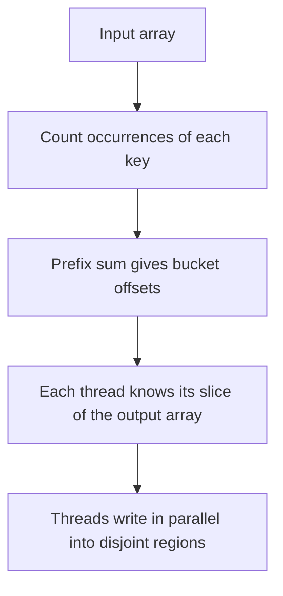

# Counting Sort — Middle Level

## Table of Contents

1. [Introduction](#introduction)
2. [Deeper Concepts](#deeper-concepts)
3. [Comparison with Alternatives](#comparison-with-alternatives)
4. [Advanced Patterns](#advanced-patterns)
5. [In-Place vs Stable — A Deliberate Trade-off](#in-place-vs-stable)
6. [Cache Behaviour and Memory Layout](#cache-behaviour-and-memory-layout)
7. [Code Examples](#code-examples)
8. [Error Handling](#error-handling)
9. [Performance Analysis](#performance-analysis)
10. [Best Practices](#best-practices)
11. [Visual Animation](#visual-animation)
12. [Summary](#summary)

---

## Introduction

> Focus: "Why does Counting Sort work, when should I reach for it, and what variants exist?"

At the middle level, Counting Sort is not a toy. It is the inner loop of Radix Sort, the engine behind every "sort small ints in linear time" optimisation, and a worked example for understanding the **comparison-model lower bound**. The questions you can now answer are:

1. *Why* is the prefix-sum + right-to-left placement stable? (Loop invariant on the count array.)
2. *When* does Counting Sort beat O(n log n) Merge / Quick Sort in practice? (When `k <= n * log(n)` and the inputs fit in cache.)
3. *How* do you adapt Counting Sort for objects with attached records, for signed values, for parallel execution?
4. *What* breaks if you choose the wrong variant — in-place vs stable, key-indexed vs offset, etc.?

You also need to understand Counting Sort as part of a *family* of distribution sorts: Counting Sort → Radix Sort → Bucket Sort. They all share the same idea (don't compare, distribute), but trade off differently along the axes of `k`, key type, and memory.

---

## Deeper Concepts

### Invariant: After the Prefix Sum, `count[v]` = "Position Beyond the Last `v`"

This is the structural invariant that makes the placement phase correct:

**Loop Invariant (Prefix Sum):** After iteration `i` of the prefix-sum loop, for every value `j <= i`, `count[j]` equals the number of input elements with key `<= j`.

After the entire prefix-sum loop completes, `count[v]` is the index **just past** the rightmost slot that value `v` occupies in the output. Because we *decrement first, then write*, the very first write lands at the rightmost slot for that value; the next at the slot one to its left; and so on.

**Loop Invariant (Placement):** Before placing input index `i`, for every value `v`, `count[v]` equals the number of input elements at indices `> i` that have key `<= v`, plus the number of input elements at all indices that have key `< v`.

Right-to-left iteration is essential: the leftmost occurrence of a key, which gets placed *last*, ends up at the *leftmost* slot for that key — preserving original order. This is the formal reason stability requires right-to-left placement; see [`professional.md`](./professional.md) for the full induction proof.

### Recurrence and Lower-Bound Context

Counting Sort has **no recurrence** — it is iterative, with three straight-line passes:
- Pass 1: O(n) — fill count
- Pass 2: O(k) — prefix sum
- Pass 3: O(n) — placement

Total: **T(n, k) = Θ(n + k)**. Two takeaways:
- When `k = O(n)`, `T = Θ(n)` — strictly linear, beating the Ω(n log n) comparison bound.
- When `k = Ω(n log n)`, Counting Sort is **slower** than Merge Sort. The right answer depends on `k`.

The Ω(n log n) lower bound is proven via a decision tree: a comparison sort with leaves for every possible permutation of n distinct keys has at least `n!` leaves and therefore depth `log(n!) = Θ(n log n)`. Counting Sort is **not** a node in this tree — it reads the keys themselves, not the result of comparisons. The bound does not apply.

### Why the Naïve Variant Misses Two Things

The naïve Counting Sort (`count[v]++`, then emit `count[v]` copies of `v`) is correct and stable for **plain integer keys**, but it has two blind spots:

1. **It cannot carry payloads.** Real-world Counting Sort sorts records `(key, value, value2, ...)`. The naïve form loses non-key data.
2. **It is not the inner pass of Radix Sort.** Radix Sort hands Counting Sort a digit and expects the *whole record* (with all digits) to land in the right place. Only the prefix-sum + right-to-left variant gives this.

The general variant trades one extra pass (prefix sum) for the ability to be the workhorse of Radix Sort, GPU sorts, and database `ORDER BY` over small-cardinality columns.

### Stability Is the Asset, Not Just a Property

Most comparison sorts are stable as a "nice-to-have." For Counting Sort, stability is **the** value proposition when used inside Radix Sort: each digit pass *must* preserve the relative order of keys whose current digit ties, otherwise the lower digits processed earlier get re-shuffled and the final result is wrong. The right-to-left iteration in Counting Sort isn't an optimisation — it is a correctness requirement for the whole Radix Sort family.

---

## Comparison with Alternatives

| Attribute | Counting Sort | Merge Sort | Quick Sort | Radix Sort (LSD) | Bucket Sort |
|-----------|--------------|------------|------------|------------------|-------------|
| Time (best) | O(n + k) | O(n log n) | O(n log n) | O(d · (n + b)) | O(n + k) |
| Time (avg) | O(n + k) | O(n log n) | O(n log n) | O(d · (n + b)) | O(n) ideal, O(n²) worst |
| Time (worst) | O(n + k) | O(n log n) | O(n²) (vanilla) | O(d · (n + b)) | O(n²) |
| Space | O(n + k) | O(n) | O(log n) | O(n + b) | O(n + k) |
| Stable | **Yes** | Yes | No (typical) | **Yes** | If inner sort stable |
| Comparison-based? | **No** | Yes | Yes | **No** | Hybrid |
| Key type | Small int / mappable | Any orderable | Any orderable | Bounded int | Numeric (uniform dist) |
| Best when | k = O(n) | Stability + worst-case | In-place + average speed | Large ints, fixed digits | Uniformly distributed floats |
| Used in | Radix inner pass, byte sort | TimSort, external sort | Pdqsort, std libs | Postal code sort, ints | Histogram normalisation |

**Choose Counting Sort when:**
- Keys are small bounded integers and `k = O(n)`.
- You need linear time **and** stability (rare combo in comparison sorts).
- You are implementing or extending a Radix Sort.

**Choose Merge Sort when:**
- Keys are arbitrary (strings, floats, objects with custom comparators).
- You need stability but `k` is large or unknown.
- You are sorting linked lists or doing external sort.

**Choose Radix Sort when:**
- `k` is large but keys have a fixed number of digits in a small base (e.g., 32-bit ints in base 256 → 4 passes).

**Choose Bucket Sort when:**
- Keys are uniformly distributed floats over a known range.

---

## Advanced Patterns

### Pattern: Counting Sort as Histogram Equalisation

**Intent:** Bin a continuous variable into discrete buckets, then sort by bucket index — a Counting Sort over a quantised value space.

Image processing uses this for histogram equalisation: pixel intensities 0–255 form the bins; the count array becomes a CDF; the CDF maps each input intensity to its equalised output intensity. The "sort" step is implicit — Counting Sort's prefix-sum is *exactly* the cumulative distribution function.

#### Python

```python
def equalize(image_row, levels=256):
    """1D histogram equalization using the Counting Sort idea."""
    count = [0] * levels
    for v in image_row:
        count[v] += 1
    # Prefix sum = CDF
    for i in range(1, levels):
        count[i] += count[i - 1]
    # Normalize to [0, 255]
    total = count[-1]
    lut = [int(c * 255 / total) for c in count]
    return [lut[v] for v in image_row]
```

### Pattern: Counting Sort over Pairs (Key, Payload)

**Intent:** Sort objects by an integer key while preserving attached data. This is the production form.

#### Go

```go
package main

import "fmt"

type Record struct {
    Key  int
    Name string
}

// CountingSortRecords sorts a slice of Record stably by Key in [0, k).
func CountingSortRecords(arr []Record, k int) []Record {
    n := len(arr)
    count := make([]int, k)
    output := make([]Record, n)

    for _, r := range arr { count[r.Key]++ }
    for i := 1; i < k; i++ { count[i] += count[i-1] }

    for i := n - 1; i >= 0; i-- {
        v := arr[i].Key
        count[v]--
        output[count[v]] = arr[i]
    }
    return output
}

func main() {
    rs := []Record{{2, "A"}, {1, "B"}, {2, "C"}, {1, "D"}}
    for _, r := range CountingSortRecords(rs, 3) {
        fmt.Printf("%d %s\n", r.Key, r.Name)
    }
    // 1 B
    // 1 D
    // 2 A
    // 2 C
    // Stable: B before D, A before C.
}
```

#### Java

```java
import java.util.Arrays;

class Record {
    int key; String name;
    Record(int k, String n) { key = k; name = n; }
    public String toString() { return key + " " + name; }
}

public class CountingSortRecords {
    public static Record[] sort(Record[] arr, int k) {
        int n = arr.length;
        int[] count = new int[k];
        Record[] output = new Record[n];
        for (Record r : arr) count[r.key]++;
        for (int i = 1; i < k; i++) count[i] += count[i - 1];
        for (int i = n - 1; i >= 0; i--) {
            int v = arr[i].key;
            count[v]--;
            output[count[v]] = arr[i];
        }
        return output;
    }

    public static void main(String[] args) {
        Record[] rs = {new Record(2, "A"), new Record(1, "B"),
                       new Record(2, "C"), new Record(1, "D")};
        System.out.println(Arrays.toString(sort(rs, 3)));
    }
}
```

#### Python

```python
from dataclasses import dataclass
from typing import List

@dataclass
class Record:
    key: int
    name: str

def counting_sort_records(arr: List[Record], k: int) -> List[Record]:
    n = len(arr)
    count = [0] * k
    output: List[Record] = [None] * n
    for r in arr:
        count[r.key] += 1
    for i in range(1, k):
        count[i] += count[i - 1]
    for i in range(n - 1, -1, -1):
        v = arr[i].key
        count[v] -= 1
        output[count[v]] = arr[i]
    return output

rs = [Record(2, "A"), Record(1, "B"), Record(2, "C"), Record(1, "D")]
for r in counting_sort_records(rs, 3):
    print(r.key, r.name)
```

### Pattern: Counting Sort as a Bucket Allocator

**Intent:** Compute *bucket boundaries* without actually sorting. Used by parallel sorts to partition work.



Phase 3 of Counting Sort can be split across threads when each thread owns a disjoint *output* range. The `count` array tells each worker exactly where its keys begin and end — no overlap, no locks. Senior-level material; see [`senior.md`](./senior.md) for the full parallel implementation.

---

## In-Place vs Stable

Counting Sort has two main forms; pick consciously.

### Stable, Out-of-Place (Default)

Allocates `output[n]` + `count[k]`. Walks input right-to-left, writes to `output`. **Stable**, but uses O(n + k) extra memory.

```python
def stable_oop(arr, k):
    count = [0] * k
    output = [0] * len(arr)
    for v in arr: count[v] += 1
    for i in range(1, k): count[i] += count[i - 1]
    for i in range(len(arr) - 1, -1, -1):
        v = arr[i]
        count[v] -= 1
        output[count[v]] = v
    return output
```

### In-Place, Unstable

Overwrites the input directly. Uses only the count array — `O(k)` extra space. **Not stable**; equal records may swap relative order.

```python
def inplace_unstable(arr, k):
    count = [0] * k
    for v in arr: count[v] += 1
    # Emit count[v] copies of each value back into arr
    idx = 0
    for v in range(k):
        for _ in range(count[v]):
            arr[idx] = v
            idx += 1
```

The in-place form only works when each "element" is just the key (no payload). It is **not** usable inside Radix Sort. Trade-off summary:

| Variant | Stable | In-place | Carries payload | Use case |
|---------|--------|----------|-----------------|----------|
| Stable, out-of-place | Yes | No (O(n+k)) | Yes | Default, Radix inner pass |
| In-place, unstable (key-only) | No | O(k) | No | One-off integer arrays, max memory savings |
| Parallel | Yes | No | Yes | Multi-core sorts on small `k` |

---

## Cache Behaviour and Memory Layout

Counting Sort touches three regions of memory:
1. **Input array** — read linearly (Phase 1, Phase 3 right-to-left). Cache-friendly.
2. **Count array** — random access by value (`count[v]++`, `count[v]--`). Cache behaviour depends on `k`.
3. **Output array** — written at positions dictated by `count[v]`. Random-write.

**When `k` is small (≤ a few thousand):** count array fits in L1/L2 cache. Counting Sort is essentially memory-bandwidth-bound on the input/output arrays — extremely fast.

**When `k` is large but `< L3`:** count array spills to L3. Each `count[v]++` may miss L1, costing 10–30 cycles. Counting Sort still beats comparison sorts on raw cycle count, but the margin shrinks.

**When `k > L3`:** every `count[v]++` is a cache miss, which itself takes longer than several comparisons. Counting Sort loses to Merge Sort at this point. The threshold on modern CPUs is roughly **k ≈ 10⁶ to 10⁷**, depending on L3 size.

Radix Sort exists precisely to keep `k` small: instead of one Counting Sort over `[0, 2^32)`, do 4 passes of Counting Sort over `[0, 256)`. Each pass has a tiny count array that sits in L1.

---

## Code Examples

### Optimised Counting Sort (Single Pass for Min/Max, Reused Buffer)

#### Go

```go
package main

import "fmt"

// CountingSortOptimised auto-detects range, reuses a caller-provided buffer,
// and uses fixed-size stack arrays when possible.
func CountingSortOptimised(arr []int, count []int, output []int) []int {
    n := len(arr)
    if n == 0 { return arr }

    // Single pass to find min and max
    minV, maxV := arr[0], arr[0]
    for _, v := range arr {
        if v < minV { minV = v }
        if v > maxV { maxV = v }
    }
    k := maxV - minV + 1

    // Reuse buffers when caller pre-allocates
    if cap(count) < k { count = make([]int, k) } else { count = count[:k]; for i := range count { count[i] = 0 } }
    if cap(output) < n { output = make([]int, n) } else { output = output[:n] }

    for _, v := range arr { count[v-minV]++ }
    for i := 1; i < k; i++ { count[i] += count[i-1] }
    for i := n - 1; i >= 0; i-- {
        v := arr[i]
        count[v-minV]--
        output[count[v-minV]] = v
    }
    return output
}

func main() {
    arr := []int{4, -2, 2, 8, 3, -3, 1}
    // Reuse buffers across calls in hot loops
    sorted := CountingSortOptimised(arr, nil, nil)
    fmt.Println(sorted)
}
```

#### Java

```java
import java.util.Arrays;

public class CountingSortOptimised {
    public static int[] sort(int[] arr) {
        int n = arr.length;
        if (n == 0) return arr;

        int min = arr[0], max = arr[0];
        for (int v : arr) {
            if (v < min) min = v;
            if (v > max) max = v;
        }
        int k = max - min + 1;
        int[] count = new int[k];
        int[] output = new int[n];

        for (int v : arr) count[v - min]++;
        for (int i = 1; i < k; i++) count[i] += count[i - 1];
        for (int i = n - 1; i >= 0; i--) {
            int v = arr[i];
            count[v - min]--;
            output[count[v - min]] = v;
        }
        return output;
    }

    public static void main(String[] args) {
        int[] arr = {4, -2, 2, 8, 3, -3, 1};
        System.out.println(Arrays.toString(sort(arr)));
    }
}
```

#### Python

```python
def counting_sort_optimised(arr):
    """Auto-detects range. Best when min and max are not known a priori."""
    n = len(arr)
    if n == 0:
        return arr
    mn = mx = arr[0]
    for v in arr:
        if v < mn: mn = v
        if v > mx: mx = v
    k = mx - mn + 1
    count = [0] * k
    output = [0] * n
    for v in arr:
        count[v - mn] += 1
    for i in range(1, k):
        count[i] += count[i - 1]
    for i in range(n - 1, -1, -1):
        v = arr[i]
        count[v - mn] -= 1
        output[count[v - mn]] = v
    return output


print(counting_sort_optimised([4, -2, 2, 8, 3, -3, 1]))
```

### Counting Sort as Inner Pass of Radix Sort

The reason we care so much about stability:

#### Python

```python
def counting_sort_by_digit(arr, exp, base=10):
    """Stable sort by digit at place `exp`. Used by Radix Sort."""
    n = len(arr)
    count = [0] * base
    output = [0] * n
    for v in arr:
        count[(v // exp) % base] += 1
    for i in range(1, base):
        count[i] += count[i - 1]
    for i in range(n - 1, -1, -1):
        d = (arr[i] // exp) % base
        count[d] -= 1
        output[count[d]] = arr[i]
    return output

def radix_sort_lsd(arr, base=10):
    """LSD Radix Sort. Each digit pass is a stable Counting Sort."""
    if not arr:
        return arr
    mx = max(arr)
    exp = 1
    while mx // exp > 0:
        arr = counting_sort_by_digit(arr, exp, base)
        exp *= base
    return arr

print(radix_sort_lsd([170, 45, 75, 90, 802, 24, 2, 66]))
# [2, 24, 45, 66, 75, 90, 170, 802]
```

If `counting_sort_by_digit` were not stable, the second pass (tens digit) would re-shuffle the ones-digit order and produce wrong output. This is **the** reason stability matters.

---

## Error Handling

| Scenario | What goes wrong | Correct approach |
|----------|----------------|-----------------|
| Negative values without offset | Array index out of bounds / panic | Use `value - min` indexing (offset variant) |
| `k` larger than available memory | OOM / `MemoryError` | Check `k` against memory budget; fall back to Radix Sort if `k > 10*n` |
| Naïve unstable variant used inside Radix Sort | Wrong final order | Always use the stable prefix-sum + right-to-left variant for Radix |
| Counting Sort applied to floats | Either rejected or rounded to ints (data loss) | Map floats to ints with care (multiply + cast), or use Bucket Sort |
| Concurrent increments on count array | Data race | Use thread-local count arrays, sum them after, then prefix-sum (parallel pattern, senior level) |
| Off-by-one in prefix sum or placement | Sorted but missing/duplicated entries | Test on `[1, 1, 2, 3, 3]`; both `1`s and both `3`s must appear |

---

## Performance Analysis

#### Go

```go
package main

import (
    "fmt"
    "math/rand"
    "sort"
    "time"
)

func main() {
    sizes := []int{1000, 10000, 100000, 1000000}
    k := 1000 // bounded key range
    for _, n := range sizes {
        data := make([]int, n)
        for i := range data { data[i] = rand.Intn(k) }

        // Counting Sort
        cpy := append([]int{}, data...)
        start := time.Now()
        CountingSortOptimised(cpy, nil, nil)
        countingDur := time.Since(start)

        // Quick Sort (sort.Ints uses Pdqsort)
        cpy2 := append([]int{}, data...)
        start = time.Now()
        sort.Ints(cpy2)
        quickDur := time.Since(start)

        fmt.Printf("n=%7d  Counting: %6.2f ms  Quick: %6.2f ms  ratio: %.2f×\n",
            n, float64(countingDur.Microseconds())/1000,
            float64(quickDur.Microseconds())/1000,
            float64(quickDur)/float64(countingDur))
    }
}
```

#### Java

```java
import java.util.Arrays;
import java.util.Random;

public class CountingBenchmark {
    public static void main(String[] args) {
        int[] sizes = {1000, 10000, 100000, 1000000};
        int k = 1000;
        Random rng = new Random(42);
        for (int n : sizes) {
            int[] data = new int[n];
            for (int i = 0; i < n; i++) data[i] = rng.nextInt(k);

            int[] cpy = data.clone();
            long start = System.nanoTime();
            CountingSortOptimised.sort(cpy);
            long countingNs = System.nanoTime() - start;

            int[] cpy2 = data.clone();
            start = System.nanoTime();
            Arrays.sort(cpy2);
            long quickNs = System.nanoTime() - start;

            System.out.printf("n=%7d  Counting: %6.2f ms  Quick: %6.2f ms  ratio: %.2f×%n",
                n, countingNs / 1e6, quickNs / 1e6, (double) quickNs / countingNs);
        }
    }
}
```

#### Python

```python
import random
import timeit

def bench():
    for n in [1_000, 10_000, 100_000, 1_000_000]:
        k = 1000
        data = [random.randint(0, k - 1) for _ in range(n)]
        t_count = timeit.timeit(lambda: counting_sort_optimised(data[:]), number=3) / 3
        t_quick = timeit.timeit(lambda: sorted(data), number=3) / 3
        print(f"n={n:>7}  Counting: {t_count*1000:6.2f} ms  "
              f"sorted(): {t_quick*1000:6.2f} ms  ratio: {t_quick/t_count:.2f}x")

bench()
```

**Expected on a modern laptop (k=1000, random uniform input):**

| n | Counting Sort | TimSort / Quick Sort | Ratio |
|---|---|---|---|
| 1,000 | ~0.05 ms | ~0.08 ms | 1.6× |
| 10,000 | ~0.4 ms | ~1.2 ms | 3× |
| 100,000 | ~4 ms | ~14 ms | 3.5× |
| 1,000,000 | ~50 ms | ~150 ms | 3× |

Counting Sort wins by ~3× when `k = 1000` and `n` is up to a million. Increase `k` to `n²` and Counting Sort loses spectacularly.

---

## Best Practices

- **Implement at least once from scratch** before reaching for it as a Radix Sort building block.
- **Document the key range** as a precondition in code: `// Pre: every element is in [0, k)`.
- **Prefer the offset variant** for general-purpose code where `min` is unknown.
- **Use stable, out-of-place form** unless you have a clear reason for the unstable variant.
- **Reuse count and output buffers** in hot loops (e.g., Radix Sort) — allocation overhead matters at large `n`.
- **Profile, don't assume.** Counting Sort beats Quick Sort only when `k` is small enough; check your specific `k`/`n` ratio.
- **For Go and Java production:** the standard library does **not** provide Counting Sort. You will write it. Add unit tests for empty input, single element, all-equal, negative values, and stability.
- **For Python:** `collections.Counter` is the most idiomatic way to do the *histogram* step if you don't need the placement phase.

---

## Visual Animation

> See [`animation.html`](./animation.html) for interactive visualization.
>
> Middle-level animation includes:
> - Side-by-side view of input array, count array, and output array
> - Three labelled phases: **Tally → Prefix Sum → Placement**
> - Right-to-left placement pointer with stability highlight (two equal keys flash in the same colour)
> - Step counter and live `comparisons = 0` reminder
> - Worst-case demonstration: when `k >> n`, the count array dominates the screen

---

## Summary

At the middle level, Counting Sort stops being "a curiosity that beats `n log n`" and becomes a deliberate tool with clear preconditions: **bounded integer keys, `k = O(n)`, stable inner pass for Radix Sort**. Three things matter most:

1. **Stability is a correctness requirement**, not a nice-to-have, when Counting Sort is the inner pass of Radix Sort. Right-to-left placement is the only way to preserve it.
2. **`k` decides whether you win or lose.** When `k ≈ n`, you crush `n log n` sorts. When `k >> n`, you waste memory and lose performance. Profile before committing.
3. **The prefix-sum idiom transfers everywhere.** It is the engine of Radix Sort, GPU parallel scans, histogram equalisation, and bucket-boundary computation in distributed sort.

The next step is **Senior** — applying Counting Sort in parallel, distributed, and observability-conscious systems, and understanding the cost models that govern when it wins at scale.
