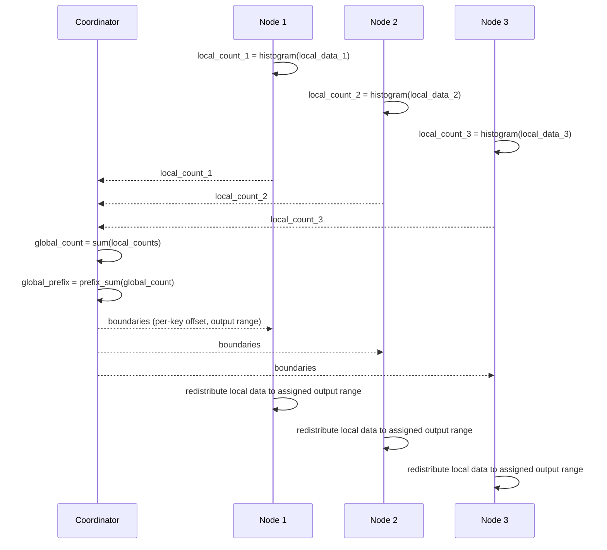

# Counting Sort — Senior Level

## Table of Contents

1. [Introduction](#introduction)
2. [System Design with Counting Sort](#system-design-with-counting-sort)
3. [Parallel Counting Sort on Multi-Core](#parallel-counting-sort-on-multi-core)
4. [Distributed Counting Sort via Histograms](#distributed-counting-sort-via-histograms)
5. [Architecture Patterns](#architecture-patterns)
6. [Capacity Planning](#capacity-planning)
7. [Code Examples](#code-examples)
8. [Observability](#observability)
9. [Failure Modes](#failure-modes)
10. [Production Trade-offs](#production-trade-offs)
11. [Summary](#summary)

---

## Introduction

> Focus: "How do I architect systems around Counting Sort at scale, and when does linear-time really pay off?"

At the senior level, Counting Sort is not a clever undergraduate trick — it is the engine behind:

- **GPU sort primitives** (CUB, Thrust, ModernGPU) — every fast GPU sort is a parallel Counting/Radix Sort.
- **Database `ORDER BY` over low-cardinality columns** — columnar engines (DuckDB, ClickHouse, Vertica) detect when an int column has small `k` and switch from Quick Sort to Counting Sort.
- **Histogram-based partitioning** in distributed sort (Spark, Flink, MapReduce shuffle) — you build a global histogram via per-partition Counting Sort, then use the prefix sum to derive partition boundaries.
- **Image processing pipelines** — histogram equalisation, threshold computation, contrast stretching are Counting Sort variants.
- **Network telemetry** — per-flow packet counts, per-IP request tallies, top-k flows all start with a Counting Sort histogram.
- **String tries and suffix-array construction** — DC3/SA-IS suffix-array algorithms use Counting Sort for bucketing.

The senior questions are:
1. **Cache behaviour:** when does the count array spill out of L3 and ruin the algorithm's linear-time promise?
2. **Parallelism:** how do you split the count phase across cores without lock contention?
3. **Distribution:** how do you build a global histogram across machines without shipping all the data?
4. **Capacity:** at what `k` does memory cost dominate compute time? When should you pick Radix Sort instead?

---

## System Design with Counting Sort

```mermaid
graph TD
    Client -->|sort request| Engine[Query Engine]
    Engine -->|inspect column stats| Stats{cardinality<br/>k vs n}
    Stats -->|k = O(n), in cache| CountingSort[Counting Sort<br/>O(n + k)]
    Stats -->|k large, fixed-width int| RadixSort[Radix Sort<br/>O(d*(n + b))]
    Stats -->|k arbitrary or unknown| TimSort[TimSort / Pdqsort<br/>O(n log n)]
    CountingSort --> Result[Sorted Output]
    RadixSort --> Result
    TimSort --> Result
```

The senior decision is **algorithm selection at query-plan time**, not at compile time. Columnar databases store per-column statistics (`min`, `max`, distinct count) precisely so the planner can choose Counting Sort when it pays off.

**Rule of thumb:** if `k <= 16 · n / log n`, Counting Sort wins on a modern CPU. Else, fall back to Radix or Quick.

---

## Parallel Counting Sort on Multi-Core

Counting Sort decomposes cleanly into three parallel phases.

### Phase 1 — Parallel Counting (Local Histograms)

Each of `p` threads scans a `n/p` slice of the input into its **own** local count array. No locks, no contention.

```text
Input:  [v0 v1 v2 v3 ... vn]
Split:  [---thread 0---|---thread 1---|...]
Each thread:  local_count[t][v] = number of occurrences of v in slice t
```

After Phase 1, sum local counts column-wise to get the global count: `global_count[v] = sum over t of local_count[t][v]`. The column-sum is itself parallelisable.

### Phase 2 — Parallel Prefix Sum (Scan)

Convert the global count into a prefix sum. The textbook **work-efficient parallel scan** (Blelloch) runs in `O(k / p + log k)` time with `O(k)` total work. For modest `k`, the sequential scan is fast enough — Phase 2 is rarely the bottleneck.

### Phase 3 — Parallel Placement (Disjoint Writes)

This is where stability gets tricky. Each thread needs to know **where to write** each of its keys without conflicting with other threads. The trick: each thread computes its own *prefix sums* from its local count, then offsets them by the global prefix sum.

```text
For thread t and value v:
    write_start[t][v] = global_prefix[v-1] + sum over t'<t of local_count[t'][v]
```

Thread `t` writes its occurrences of value `v` into `[write_start[t][v], write_start[t][v] + local_count[t][v])` — disjoint regions per thread per value. **Stability is preserved per thread** if each thread iterates its slice right-to-left and writes into its slot right-to-left. **Global stability** requires threads be ordered consistently (thread 0's keys come before thread 1's keys in the output).

### Speedup Analysis

For `p` cores:
- T_seq = O(n + k)
- T_par(p) = O((n + k) / p + log k)

Speedup peaks at `p ≈ sqrt(n / k)`. Beyond that, the per-thread count arrays + cache traffic eat the gains. On 8 cores with `k=1000`, expect **5–7×** speedup. On 64 cores, expect ~20× before memory bandwidth saturates.

---

## Distributed Counting Sort via Histograms

For data spread across nodes (Spark, Flink, Hadoop), Counting Sort runs as a coordination algorithm:



This is **exactly** how Spark's `sortByKey` derives range partitions: each executor reports a histogram (or a sample of it), the driver computes global quantile boundaries, then re-partitions data by range. The Counting-Sort logic is buried in the driver but it is what drives the whole shuffle.

### Network Cost

For `n` total elements spread over `m` nodes, the histogram phase costs `O(m · k)` bytes on the wire (each node ships a `k`-element count). The data redistribution phase costs `O(n)` bytes (every element moves to its destination node).

**When `k` is huge** (say `k = 10^9`), the histogram phase costs `m · 10^9 · 8 bytes = 8 GB per node` — completely impractical. The fix: **approximate histogram** via reservoir sampling or quantile sketches (t-digest, KLL). Spark uses sampling: each node sends a 1‰ sample, the driver computes approximate quantile boundaries, accepting some skew.

---

## Architecture Patterns

### Pattern: Two-Pass "Cardinality-Aware" Sort

Database query engines (DuckDB, ClickHouse, Vertica) inspect each column's statistics and pick the sort algorithm dynamically:

```text
plan_sort(column, n):
    stats = catalog.column_stats(column)
    if stats.is_int and stats.cardinality <= n:
        emit CountingSort(min=stats.min, max=stats.max)
    elif stats.is_int and stats.max < 2^32:
        emit RadixSort(base=256, digits=4)
    else:
        emit TimSort()
```

For a 100M-row sort over a column with cardinality 200 (e.g., country code), the planner picks Counting Sort and finishes in ~1 second versus ~10 seconds for TimSort.

### Pattern: Histogram-Based Range Partitioning

Distributed sort (Spark `sortByKey`):

1. **Sample phase:** each executor draws a small random sample.
2. **Histogram phase:** driver builds a global histogram over the samples; the prefix sum gives partition boundaries.
3. **Shuffle phase:** every record routes to the partition whose range contains its key.
4. **Local sort phase:** each partition sorts its slice in-memory (TimSort or Counting Sort, depending on cardinality).

The histogram step is a distributed Counting Sort. Without it, the shuffle would be skewed: some partitions would receive 10× more data than others, causing the overall sort to take 10× longer.

### Pattern: Materialised Histogram for `GROUP BY` and `ORDER BY`

A columnar engine can maintain a **persistent histogram** for each column. The histogram doubles as:
- A **selectivity estimate** for the query planner.
- The **count array** for an in-memory Counting Sort over that column.
- The **bucket boundaries** for partition-pruning.

Maintenance cost: O(1) per insert (increment the bucket). Worth it for high-cardinality-aware tables.

### Pattern: GPU Sort Pipeline

NVIDIA's CUB library implements `DeviceRadixSort`, which is internally:
1. **Per-warp histogram** (32 threads count into local arrays in registers).
2. **Block-level prefix sum** (one warp per 8-bit digit).
3. **Global scatter** — each thread writes its keys to global memory at positions dictated by the global prefix sum.

This is Counting Sort, executed in massive parallel. On a modern GPU, it sorts 1 GB of 32-bit integers in **~30 ms**.

---

## Capacity Planning

### Memory Budget for Counting Sort

```text
Memory = sizeof(count) + sizeof(output)
       = k * sizeof(int)  +  n * sizeof(record)
```

For 64-bit count entries (safe against overflow):
- `k = 256` (byte sort): count = 2 KB → trivial
- `k = 10^5` (ZIP codes): count = 800 KB → fits in L2
- `k = 10^7` (UNIX timestamps over a year): count = 80 MB → fits in L3 on big servers
- `k = 10^9` (32-bit user IDs): count = 8 GB → impractical; use Radix Sort

### When to Pick Counting Sort vs Radix Sort

| Situation | Choose | Why |
|-----------|--------|-----|
| `k <= 10^4` and `n ≥ k` | Counting Sort | Single pass, count fits in L2 |
| `k <= 10^6` and `n ≥ 10·k` | Counting Sort | Count fits in L3, still linear |
| `k > 10^7` but bounded (e.g., 32-bit int) | Radix Sort | Several passes with small `k` per pass |
| Keys are 64-bit hashes or floats | TimSort or Pdqsort | Counting/Radix don't apply directly |

### CPU Bandwidth Estimate

Counting Sort's bottleneck is memory bandwidth. With modern DDR4-3200 hardware (~25 GB/s per channel), the algorithm reads input once and writes output once — about 2·8·n bytes for 64-bit ints. At 25 GB/s, that's ~6 ns per element. So a 10M-element Counting Sort takes ~60 ms in the best case. Comparison sorts get nowhere near this.

---

## Code Examples

### Thread-Safe Parallel Counting Sort

#### Go

```go
package main

import (
    "fmt"
    "sync"
)

// ParallelCountingSort: 3-phase parallel implementation for small k.
// Each goroutine builds a local histogram, then writes into disjoint output ranges.
func ParallelCountingSort(arr []int, k, numWorkers int) []int {
    n := len(arr)
    if n == 0 { return arr }

    chunk := (n + numWorkers - 1) / numWorkers
    localCount := make([][]int, numWorkers)

    // Phase 1: parallel local histograms
    var wg sync.WaitGroup
    for w := 0; w < numWorkers; w++ {
        wg.Add(1)
        go func(w int) {
            defer wg.Done()
            lc := make([]int, k)
            lo := w * chunk
            hi := lo + chunk
            if hi > n { hi = n }
            for i := lo; i < hi; i++ {
                lc[arr[i]]++
            }
            localCount[w] = lc
        }(w)
    }
    wg.Wait()

    // Phase 2: combine into global count + prefix sum
    globalCount := make([]int, k)
    for _, lc := range localCount {
        for v := 0; v < k; v++ {
            globalCount[v] += lc[v]
        }
    }
    // Per-thread per-value write offsets
    writeStart := make([][]int, numWorkers)
    for w := 0; w < numWorkers; w++ {
        writeStart[w] = make([]int, k)
    }
    runningTotal := 0
    for v := 0; v < k; v++ {
        offset := runningTotal
        for w := 0; w < numWorkers; w++ {
            writeStart[w][v] = offset
            offset += localCount[w][v]
        }
        runningTotal += globalCount[v]
    }

    // Phase 3: parallel scatter to disjoint output ranges
    output := make([]int, n)
    for w := 0; w < numWorkers; w++ {
        wg.Add(1)
        go func(w int) {
            defer wg.Done()
            lo := w * chunk
            hi := lo + chunk
            if hi > n { hi = n }
            cursor := append([]int{}, writeStart[w]...) // copy
            for i := lo; i < hi; i++ {
                v := arr[i]
                output[cursor[v]] = v
                cursor[v]++
            }
        }(w)
    }
    wg.Wait()
    return output
}

func main() {
    arr := []int{4, 2, 2, 8, 3, 3, 1, 5, 0, 7, 6, 2, 3, 4, 1}
    fmt.Println(ParallelCountingSort(arr, 9, 4))
}
```

### Java — Per-Thread Histogram with ForkJoin

```java
import java.util.concurrent.RecursiveAction;
import java.util.concurrent.ForkJoinPool;
import java.util.Arrays;

public class ParallelCountingSort {
    static final int THRESHOLD = 100_000;

    static class HistogramTask extends RecursiveAction {
        int[] arr, count;
        int lo, hi;
        HistogramTask(int[] arr, int[] count, int lo, int hi) {
            this.arr = arr; this.count = count; this.lo = lo; this.hi = hi;
        }
        protected void compute() {
            if (hi - lo <= THRESHOLD) {
                for (int i = lo; i < hi; i++) count[arr[i]]++;
            } else {
                int mid = (lo + hi) >>> 1;
                int[] left = new int[count.length];
                int[] right = new int[count.length];
                invokeAll(new HistogramTask(arr, left, lo, mid),
                          new HistogramTask(arr, right, mid, hi));
                for (int v = 0; v < count.length; v++) count[v] += left[v] + right[v];
            }
        }
    }

    public static int[] sort(int[] arr, int k) {
        int[] count = new int[k];
        ForkJoinPool.commonPool().invoke(new HistogramTask(arr, count, 0, arr.length));
        for (int i = 1; i < k; i++) count[i] += count[i - 1];

        int[] output = new int[arr.length];
        for (int i = arr.length - 1; i >= 0; i--) {
            int v = arr[i];
            count[v]--;
            output[count[v]] = v;
        }
        return output;
    }

    public static void main(String[] args) {
        int[] arr = {4, 2, 2, 8, 3, 3, 1, 5, 0, 7};
        System.out.println(Arrays.toString(sort(arr, 9)));
    }
}
```

### Python — Distributed Histogram (Conceptual Outline)

```python
def distributed_counting_sort(rdd, k):
    """Pseudocode for distributed counting sort over an RDD."""
    # Phase 1: each partition builds a local histogram
    local_counts = rdd.mapPartitions(lambda part: [local_histogram(part, k)])

    # Phase 2: driver sums local histograms (k-element vectors)
    global_count = local_counts.reduce(lambda a, b: [x + y for x, y in zip(a, b)])

    # Phase 3: driver computes prefix sum -> output ranges
    prefix = [0]
    for c in global_count:
        prefix.append(prefix[-1] + c)

    # Phase 4: redistribute each element to its destination partition
    return rdd.mapPartitions(lambda part: scatter(part, prefix))

def local_histogram(part, k):
    c = [0] * k
    for v in part:
        c[v] += 1
    return c
```

---

## Observability

When you run Counting Sort at scale (or use it as a hot-path inside a database engine), monitor:

| Metric | Threshold | What it means |
|--------|-----------|---------------|
| `counting_sort_k` | track per-call | If `k` keeps drifting up, the assumption "small bounded keys" is being violated |
| `counting_sort_count_array_bytes` | > L3 size | The count array no longer fits in cache; performance drops by 5–10× |
| `counting_sort_throughput_mb_sec` | < 500 MB/s on modern CPU | Memory bandwidth-bound; investigate cache misses |
| `histogram_skew_ratio` | > 10× (max bin / median bin) | Skewed input; consider hashing or per-bin sub-sort |
| `parallel_speedup` | < 3× on 8 cores | Thread synchronisation overhead; check chunk size |
| `distributed_histogram_bytes` | grows with `k · m` | Use sampling-based histogram for huge `k` |

### Tracing

Tag spans with the sort algorithm chosen and its parameters:

```python
span.set_tag("sort.algorithm", "counting_sort")
span.set_tag("sort.k", k)
span.set_tag("sort.n", len(arr))
span.set_tag("sort.k_over_n_ratio", k / max(len(arr), 1))
span.set_tag("sort.duration_ms", elapsed_ms)
```

Correlating these with downstream query latency lets you detect when the planner's algorithm choice was wrong.

---

## Failure Modes

| Mode | Symptom | Mitigation |
|------|---------|------------|
| **`k` overflow** | OOM allocating count array | Validate `k`; fall back to Radix Sort when `k > threshold` |
| **Integer overflow in count** | Negative counts on >2^31 elements per bucket | Use `int64` or `long` for count array |
| **Skewed input** | One bucket holds 99% of records; no speedup | Use Radix Sort or hash the key first |
| **Hot count entry under contention** | Parallel version stalls on cache-line ping-pong | Use per-thread local count arrays, then reduce |
| **Histogram telemetry blow-up** | Distributed phase ships GB of count vectors | Use sampling (reservoir, t-digest) for histogram approximation |
| **Lost stability in custom variant** | Radix Sort gives wrong order on multi-key sort | Audit placement loop direction (must be right-to-left) |
| **`k` computed wrong** | Index out of bounds | Compute `k = max(arr) + 1`, not `max(arr)` |

---

## Production Trade-offs

### Counting Sort vs Radix Sort

- **Counting Sort:** one pass; perfect when `k` is small. Loses to Radix when `k > 10^6`.
- **Radix Sort:** `d` passes of Counting Sort, each over a small base. Constant-factor overhead but scales to arbitrary bounded ints.

A common production pattern: try Counting Sort if `max - min < 10·n`; else Radix Sort with base 256. The crossover is empirical, tied to L2/L3 cache size.

### Counting Sort vs Hash-Based Group-By

For `GROUP BY low_cardinality_col`, both Counting Sort and hash-based aggregation are O(n). Counting Sort wins when:
- The grouping key is a small bounded integer.
- The output must be **sorted** by group key (Counting Sort gives this for free).

Hash aggregation wins when:
- Keys are strings or 64-bit hashes.
- The query doesn't need sorted output.

### Counting Sort vs Trie/Bucket Counting

For string-keyed inputs (e.g., URLs, hostnames), neither Counting Sort nor Radix Sort works directly. You either:
- Build a **trie** and walk it in-order (O(N) where N = total string length).
- Hash strings to small ints and Counting Sort the hashes (loses original lexical order).

### Latency vs Throughput

- **Latency-sensitive (real-time):** Counting Sort's `O(n + k)` worst-case is fully predictable — no tail latency.
- **Throughput-sensitive (batch):** Counting Sort wins on small `k` but consumes more memory bandwidth per element than Quick Sort.

---

## Summary

At senior level, Counting Sort is the **architectural primitive** behind GPU sorts, columnar database `ORDER BY` over low-cardinality columns, distributed range partitioning, histogram equalisation, and the inner loop of every Radix Sort implementation. The key insights:

1. **`k` is the only knob.** Counting Sort wins precisely when `k = O(n)` and the count array fits in L3 cache. Outside that envelope, Radix Sort or TimSort wins.
2. **Parallelism is natural.** Three independent phases — local histograms, global prefix sum, disjoint scatter — give nearly linear speedup on multi-core hardware.
3. **Distribution is histogram-based.** Counting Sort in distributed systems isn't about sorting the data, it's about deriving partition boundaries from a global histogram.
4. **The CPU bandwidth model dominates.** A well-tuned Counting Sort approaches the memory bandwidth of the machine; comparison sorts cap out far below that ceiling.
5. **Algorithm selection is dynamic.** Production database engines inspect column cardinality at plan time and switch between Counting, Radix, and TimSort. Hard-coding one algorithm is a senior-level mistake.

The design pattern: **count once, prefix-sum once, scatter once.** Whenever you can frame a problem as "compute a histogram, then act on the prefix sum," you've stumbled onto a Counting Sort. That same idea recurs in pixel histograms, network telemetry, distributed shuffles, GPU compaction, and suffix-array construction. The algorithm is small, but the pattern is enormous.
