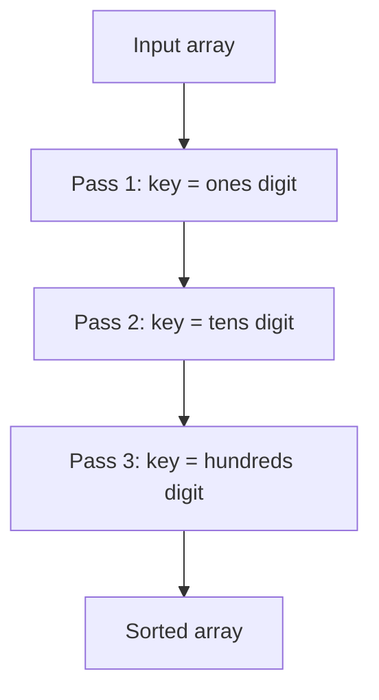

# Radix Sort — Junior Level

## Table of Contents

1. [Introduction](#introduction)
2. [Prerequisites](#prerequisites)
3. [Glossary](#glossary)
4. [Core Concepts](#core-concepts)
5. [Big-O Summary](#big-o-summary)
6. [Real-World Analogies](#real-world-analogies)
7. [Pros & Cons](#pros--cons)
8. [Step-by-Step Walkthrough](#step-by-step-walkthrough)
9. [Code Examples](#code-examples)
10. [Coding Patterns](#coding-patterns)
11. [Error Handling](#error-handling)
12. [Performance Tips](#performance-tips)
13. [Best Practices](#best-practices)
14. [Edge Cases & Pitfalls](#edge-cases--pitfalls)
15. [Common Mistakes](#common-mistakes)
16. [Cheat Sheet](#cheat-sheet)
17. [Visual Animation](#visual-animation)
18. [Summary](#summary)
19. [Further Reading](#further-reading)

---

## Introduction

> Focus: "What is Radix Sort?" and "How can a sort beat O(n log n)?"

**Radix Sort** is a **non-comparison** sort that orders numbers (or fixed-length strings) by looking at one **digit** at a time. Instead of comparing two values like every other sort you've seen so far — Bubble, Insertion, Selection, Merge, Quick, Heap — Radix Sort treats each key as a sequence of digits and uses the digits as **bucket addresses**. There is **no `if (a < b)` line anywhere** in the inner loop.

This single change has a surprising consequence: Radix Sort runs in **O(d · (n + k))** time, where `d` is the number of digits and `k` is the radix (the base — usually 10 or 256). When `d` is small and fixed (say, sorting 32-bit integers as 4 byte-digits), the algorithm is effectively **O(n)**. It beats the **Ω(n log n) lower bound** that applies to all comparison-based sorts, because that lower bound only applies when the algorithm's only operation is "compare two keys."

There are two main variants:

1. **LSD (Least Significant Digit) Radix Sort** — process digits **right to left**, using a **stable inner sort** (almost always Counting Sort) for each digit pass. After all `d` passes, the array is sorted. This is the version you'll use 99% of the time for fixed-width keys.
2. **MSD (Most Significant Digit) Radix Sort** — process digits **left to right**, recursively partitioning the input. Useful for variable-length keys like strings, and structurally similar to Quick Sort (you're partitioning, not merging).

Radix Sort isn't magic — it trades comparison cost for **digit extraction** cost and **bucket** memory. But when the data is right (fixed-width integers, IP addresses, fixed-format strings, dates), it is by far the fastest sort in practice. GPU sorting libraries (`cub::DeviceRadixSort`, Thrust), database batch sorts, and high-performance distributed sorters (TeraSort) all rely on radix variants.

---

## Prerequisites

- **Required:** Arrays/slices/lists — indexing, iteration, length
- **Required:** Integer arithmetic — division, modulo, bit-shifts
- **Required:** Stability of a sort — what "stable" means and why it matters
- **Required:** [`07-counting-sort/junior.md`](../07-counting-sort/junior.md) — Radix Sort uses Counting Sort as its inner subroutine
- **Helpful:** Bases and place-value notation (base 10 vs base 2 vs base 256)
- **Helpful:** Familiarity with one comparison sort (`Merge Sort` or `Insertion Sort`) so you can contrast

---

## Glossary

| Term | Definition |
|------|-----------|
| **Radix** | Another word for "base." Base 10 has radix 10; base 256 has radix 256 |
| **Digit** | One position in a number's representation. `123` in base 10 has digits `1, 2, 3` |
| **LSD** | Least Significant Digit — the rightmost digit (the ones place in base 10) |
| **MSD** | Most Significant Digit — the leftmost digit (highest place value) |
| **Pass** | One full scan of the array sorting by one digit position |
| **Bucket** | A holding area for elements that share the same digit value at the current position |
| **Stable inner sort** | A sort that preserves relative order of equal keys — required so earlier passes' ordering is not destroyed |
| **Counting Sort** | The standard stable O(n + k) inner sort used by Radix Sort |
| **Non-comparison sort** | Sort that does not use `<` or `>` on whole keys — accesses digit positions directly |
| **Comparison lower bound** | The theoretical Ω(n log n) bound that comparison sorts cannot beat. Radix Sort is **not** subject to this |
| **d** | Number of digits in the largest key (in the chosen radix) |
| **k** | The radix itself — how many distinct digit values exist (10, 256, etc.) |
| **n** | The number of elements being sorted |
| **Byte-radix** | Using radix 256 so each digit is exactly one byte — usually the fastest choice |
| **In-place** | Sort that uses O(1) extra memory. Standard Radix Sort is **NOT** in-place |

---

## Core Concepts

### Concept 1: Sort by One Digit at a Time

The core trick of LSD Radix Sort is breathtakingly simple. Given numbers like `[170, 45, 75, 90, 802, 24, 2, 66]`:

- **Pass 1 — sort by ones digit:** `[170, 90, 802, 2, 24, 45, 75, 66]`
- **Pass 2 — sort by tens digit:** `[802, 2, 24, 45, 66, 170, 75, 90]` — wait that looks wrong. Let me redo.

Let me redo it carefully on `[170, 45, 75, 90, 802, 24, 2, 66]`:

| Pass | Sort by | Result |
|------|---------|--------|
| 1 | ones (last digit) | `[170, 90, 802, 2, 24, 45, 75, 66]` |
| 2 | tens (middle digit) | `[802, 2, 24, 45, 66, 170, 75, 90]` |
| 3 | hundreds (first digit) | `[2, 24, 45, 66, 75, 90, 170, 802]` ✓ |

Why does this work? Because each pass must use a **stable** sort. When pass 2 sees two numbers with the same tens digit (e.g., `802` and `2` both have a tens digit of `0`), it preserves the order pass 1 gave them — which is the correct order by ones digit. By the time the final (most significant) pass runs, lower digits already encode their relative tie-breaks.

### Concept 2: Why Stability Is Non-Negotiable

If the inner sort is unstable, Radix Sort produces wrong answers. Suppose pass 1 sorted `[12, 22]` to `[12, 22]` (both end in `2`, original order preserved). Pass 2 sorts by tens digit. Both have tens digit equal: `1` vs `2`. A stable sort keeps `12` before `22` — correct. An unstable sort could swap them, giving `[22, 12]` — which is wrong overall.

So Radix Sort is a **stable sort using a stable inner sort** — a property that follows directly from the proof by induction on passes.

### Concept 3: Counting Sort Is the Inner Engine

Almost every Radix Sort implementation uses **Counting Sort** as its per-digit subroutine. Counting Sort is naturally stable when written correctly (iterate right-to-left in the placement loop), runs in O(n + k) time, and works perfectly when keys are bounded (which they are — each digit is bounded by the radix).

> See [`07-counting-sort/junior.md`](../07-counting-sort/junior.md) for the full algorithm. In this file we just call it as a black box that "stably sorts an array by a key function."

### Concept 4: Choosing the Radix Is a Trade-off

A key has total bit-width `w` (e.g., 32 bits for `int32`). Suppose we pick a radix of `k` digit values. Then the number of digits is:

```text
d = ceil(w / log₂(k))
```

| Radix k | log₂ k | d for 32-bit ints | Buckets per pass |
|---------|--------|-------------------|------------------|
| 2 | 1 | 32 passes | 2 |
| 10 | ~3.3 | 10 passes (decimal) | 10 |
| 16 | 4 | 8 passes | 16 |
| 256 | 8 | **4 passes** | 256 |
| 65536 | 16 | 2 passes | 65536 |

The total cost is `O(d · (n + k))`. As `k` grows, `d` shrinks but `k` itself grows. The sweet spot is around `k = 256` (one byte per pass) for general data: 4 passes for 32-bit integers, 8 passes for 64-bit integers, and bucket arrays still fit comfortably in cache.

### Concept 5: LSD vs MSD — Two Directions

| Variant | Direction | Stable inner sort? | Best for |
|---------|-----------|--------------------|----------|
| **LSD** | Right to left (ones → tens → hundreds) | Required | Fixed-width keys, integers |
| **MSD** | Left to right (highest → lowest) | Recursive partition | Variable-length keys, strings |

LSD is **iterative**: `d` passes, each touching all `n` elements. MSD is **recursive**: it partitions into `k` buckets at the most-significant level, then recurses into each bucket on the next-lower digit — like Quick Sort but with `k`-way partition instead of 2-way.

MSD has the nice property of early termination: if a bucket only has one element (or zero), no further recursion is needed. This makes it ideal for variable-length string keys.

### Concept 6: Space — Where Does the Memory Go?

Radix Sort needs:
- **O(n)** for the output buffer (you can't sort in place during the bucket-place step).
- **O(k)** for the counting array (one slot per digit value).

Total: **O(n + k)**. For typical k = 256, the extra space beyond the output buffer is trivial. The output buffer dominates and is the same n cost you pay for Merge Sort.

### Concept 7: When Radix Sort Is Faster Than Comparison Sorts

Radix Sort wins when:
- Keys are **fixed-width** (32/64-bit ints, fixed-length strings, IPv4 addresses, dates).
- `d` is small (e.g., 4-8 passes).
- The radix `k` is small enough to fit count tables in L1/L2 cache.
- Memory bandwidth (not CPU) is your bottleneck — radix sorts are linear scans that prefetch well.

For 1 million random 32-bit integers, byte-radix LSD typically beats `std::sort` (introsort) by 2-3×. For sorted-ish data, TimSort or Pdqsort can pull ahead. Always benchmark.

---

## Big-O Summary

| Operation / Case | Complexity | Notes |
|-----------------|-----------|-------|
| Time — Best | **O(d · (n + k))** | No best-case shortcut. Same for all inputs |
| Time — Average | **O(d · (n + k))** | |
| Time — Worst | **O(d · (n + k))** | |
| Time — fixed-width ints, byte radix | **O(n)** effectively (d, k constants) | 4 passes for 32-bit, 8 for 64-bit |
| Space — Auxiliary | **O(n + k)** | Output buffer + count table |
| Stable (LSD) | **Yes** | Requires stable inner sort |
| Stable (MSD) | **Yes** if written carefully | Some implementations are unstable |
| In-place | **No** | Standard versions allocate an output buffer |
| Adaptive | **No** | Same time on any input shape |
| Comparison-based? | **No** | Beats the Ω(n log n) lower bound |
| Best for | Fixed-width integers, IPs, dates, fixed strings | |

---

## Real-World Analogies

| Concept | Analogy |
|---------|--------|
| **LSD pass by digit** | Sorting a deck of cards first by suit, then by rank — but only if the rank sort is stable |
| **Buckets** | Post office sorting mail: 10 bins by last-digit of ZIP, then 10 bins by second-to-last, etc. |
| **MSD recursion** | Library card catalog: first cabinet by first letter (A-Z), then within "S" drawer by second letter |
| **Stability requirement** | Two students with the same exam score keep their original alphabetical order between passes |
| **Radix choice** | Choosing a base — bigger base means fewer passes but more bins per pass |
| **Beating the comparison bound** | A judge skimming case numbers digit by digit, not comparing whole numbers — fewer "thinks" per case |

> **Where the analogy breaks:** real postal sorters don't need O(n) extra bins because they have physical pigeonholes; in software we pay the buffer memory.

---

## Pros & Cons

| Pros | Cons |
|------|------|
| **Linear-time** for fixed-width keys — beats O(n log n) | Requires **fixed-width** (or bounded-width) keys |
| **Stable** (LSD form) | Not in-place — needs O(n + k) extra memory |
| Excellent for **integers, IPs, dates, fixed strings** | Comparison sorts beat it on variable, complex types |
| **Cache-friendly** linear scans, low branching | Bucket scattering can cause cache misses if k is large |
| Trivially **parallelizable** (MSD partitions independently) | Implementing for floats/negatives needs care |
| Dominant on **GPU** workloads (Thrust, CUB) | Code is non-trivial — easy to get wrong on first try |

**When to use:**
- Sorting millions of fixed-width integers, especially in batch ETL pipelines.
- IPv4 address sorting, packet processing, network analytics.
- Building **suffix arrays** for string algorithms (see [`17-string-algorithms/04-suffix-arrays/`](../../17-string-algorithms/04-suffix-arrays/) — once that section exists).
- GPU and vectorized SIMD sorts — radix dominates here.
- Sorting fixed-length keys after hashing.

**When NOT to use:**
- Sorting complex objects via a custom comparator (use Merge/Tim Sort).
- Very small arrays (n < 100) — the constants in d × (n + k) lose to Insertion Sort.
- Variable-length data with high digit-count variance (use Quick Sort).
- Floating-point sorting unless you handle the IEEE-754 sign/exponent bits carefully.
- Memory-constrained environments where O(n) auxiliary is too much.

---

## Step-by-Step Walkthrough

Sorting `[170, 45, 75, 90, 802, 24, 2, 66]` with **LSD Radix Sort**, base 10 (3 digits each, leading zeros conceptually):

```text
Input:        [170, 045, 075, 090, 802, 024, 002, 066]
```

**Pass 1 — sort by ones digit (rightmost):**

| Value | Ones digit |
|-------|-----------|
| 170   | 0 |
| 45    | 5 |
| 75    | 5 |
| 90    | 0 |
| 802   | 2 |
| 24    | 4 |
| 2     | 2 |
| 66    | 6 |

Bucket 0: `[170, 90]`
Bucket 2: `[802, 2]`
Bucket 4: `[24]`
Bucket 5: `[45, 75]`
Bucket 6: `[66]`

Collect: `[170, 90, 802, 2, 24, 45, 75, 66]`

**Pass 2 — sort by tens digit:**

| Value | Tens digit |
|-------|-----------|
| 170   | 7 |
| 90    | 9 |
| 802   | 0 |
| 2     | 0 |
| 24    | 2 |
| 45    | 4 |
| 75    | 7 |
| 66    | 6 |

Bucket 0: `[802, 2]`
Bucket 2: `[24]`
Bucket 4: `[45]`
Bucket 6: `[66]`
Bucket 7: `[170, 75]`
Bucket 9: `[90]`

Collect: `[802, 2, 24, 45, 66, 170, 75, 90]`

**Pass 3 — sort by hundreds digit:**

| Value | Hundreds digit |
|-------|-----------|
| 802   | 8 |
| 2     | 0 |
| 24    | 0 |
| 45    | 0 |
| 66    | 0 |
| 170   | 1 |
| 75    | 0 |
| 90    | 0 |

Bucket 0: `[2, 24, 45, 66, 75, 90]`
Bucket 1: `[170]`
Bucket 8: `[802]`

Collect: `[2, 24, 45, 66, 75, 90, 170, 802]` ✓

**Three passes. n = 8 elements touched per pass. Total work ≈ 3 × (8 + 10) = 54 operations**, compared to Merge Sort's ~24 comparisons + 24 moves = ~48. Radix Sort wins as n grows because passes stay constant while comparison sorts scale with log n.

---

## Code Examples

### Example 1: LSD Radix Sort for Non-Negative Integers (Base 10)

#### Go

```go
package main

import "fmt"

// LSDRadixSort sorts non-negative ints ascending using base-10 LSD radix.
// Time: O(d · (n + k)) where d = digits in max, k = 10. Space: O(n + k).
func LSDRadixSort(arr []int) {
    if len(arr) <= 1 {
        return
    }
    maxVal := arr[0]
    for _, v := range arr {
        if v > maxVal {
            maxVal = v
        }
    }
    for exp := 1; maxVal/exp > 0; exp *= 10 {
        countingSortByDigit(arr, exp)
    }
}

// countingSortByDigit stably sorts arr by the digit at position `exp`.
// exp = 1 → ones, exp = 10 → tens, exp = 100 → hundreds, ...
func countingSortByDigit(arr []int, exp int) {
    n := len(arr)
    output := make([]int, n)
    count := make([]int, 10)

    // Count occurrences of each digit
    for _, v := range arr {
        digit := (v / exp) % 10
        count[digit]++
    }
    // Prefix sums → end positions for each digit bucket
    for i := 1; i < 10; i++ {
        count[i] += count[i-1]
    }
    // Place stably: walk right-to-left so equal-digit items keep input order
    for i := n - 1; i >= 0; i-- {
        digit := (arr[i] / exp) % 10
        count[digit]--
        output[count[digit]] = arr[i]
    }
    copy(arr, output)
}

func main() {
    data := []int{170, 45, 75, 90, 802, 24, 2, 66}
    LSDRadixSort(data)
    fmt.Println(data) // [2 24 45 66 75 90 170 802]
}
```

#### Java

```java
import java.util.Arrays;

public class LSDRadixSort {
    public static void sort(int[] arr) {
        if (arr.length <= 1) return;
        int max = arr[0];
        for (int v : arr) if (v > max) max = v;
        for (int exp = 1; max / exp > 0; exp *= 10) {
            countingSortByDigit(arr, exp);
        }
    }

    private static void countingSortByDigit(int[] arr, int exp) {
        int n = arr.length;
        int[] output = new int[n];
        int[] count = new int[10];
        for (int v : arr) count[(v / exp) % 10]++;
        for (int i = 1; i < 10; i++) count[i] += count[i - 1];
        for (int i = n - 1; i >= 0; i--) {
            int digit = (arr[i] / exp) % 10;
            output[--count[digit]] = arr[i];
        }
        System.arraycopy(output, 0, arr, 0, n);
    }

    public static void main(String[] args) {
        int[] data = {170, 45, 75, 90, 802, 24, 2, 66};
        sort(data);
        System.out.println(Arrays.toString(data));
    }
}
```

#### Python

```python
def lsd_radix_sort(arr):
    """Sort non-negative ints ascending. Base 10. Stable."""
    if len(arr) <= 1:
        return
    max_val = max(arr)
    exp = 1
    while max_val // exp > 0:
        _counting_sort_by_digit(arr, exp)
        exp *= 10

def _counting_sort_by_digit(arr, exp):
    n = len(arr)
    output = [0] * n
    count = [0] * 10
    for v in arr:
        count[(v // exp) % 10] += 1
    for i in range(1, 10):
        count[i] += count[i - 1]
    # walk right-to-left for stability
    for i in range(n - 1, -1, -1):
        digit = (arr[i] // exp) % 10
        count[digit] -= 1
        output[count[digit]] = arr[i]
    arr[:] = output

if __name__ == "__main__":
    data = [170, 45, 75, 90, 802, 24, 2, 66]
    lsd_radix_sort(data)
    print(data)  # [2, 24, 45, 66, 75, 90, 170, 802]
```

**What it does:** For each digit position from least significant up, stably bucket-sort the array by that digit. After the last (most significant) pass, the array is fully sorted.
**Run:** `go run main.go` | `javac LSDRadixSort.java && java LSDRadixSort` | `python radix.py`

---

### Example 2: LSD Radix Sort with Byte Radix (Base 256)

#### Go

```go
package main

import "fmt"

// LSDByteRadix sorts uint32 values using 4 passes of base-256 radix.
// Faster than base-10 in practice because the count table fits in cache
// and digit extraction is a fast bit-shift + mask.
func LSDByteRadix(arr []uint32) {
    n := len(arr)
    if n <= 1 {
        return
    }
    buf := make([]uint32, n)
    for shift := uint(0); shift < 32; shift += 8 {
        var count [257]int // [0..256], extra slot for prefix-sum convenience
        for _, v := range arr {
            count[((v>>shift)&0xFF)+1]++
        }
        for i := 1; i < 257; i++ {
            count[i] += count[i-1]
        }
        for _, v := range arr {
            digit := (v >> shift) & 0xFF
            buf[count[digit]] = v
            count[digit]++
        }
        arr, buf = buf, arr
    }
}

func main() {
    data := []uint32{170, 45, 75, 90, 802, 24, 2, 66, 1<<20, 1<<31}
    LSDByteRadix(data)
    fmt.Println(data)
}
```

#### Java

```java
import java.util.Arrays;

public class LSDByteRadix {
    public static void sort(int[] arr) {
        int n = arr.length;
        if (n <= 1) return;
        int[] buf = new int[n];
        for (int shift = 0; shift < 32; shift += 8) {
            int[] count = new int[257];
            for (int v : arr) count[((v >>> shift) & 0xFF) + 1]++;
            for (int i = 1; i < 257; i++) count[i] += count[i - 1];
            for (int v : arr) {
                int digit = (v >>> shift) & 0xFF;
                buf[count[digit]++] = v;
            }
            int[] tmp = arr; arr = buf; buf = tmp;
        }
        // Note: this code path assumes non-negative ints; for full signed
        // support, see middle.md for a sign-bit fix.
    }

    public static void main(String[] args) {
        int[] data = {170, 45, 75, 90, 802, 24, 2, 66, 1 << 20};
        sort(data);
        System.out.println(Arrays.toString(data));
    }
}
```

#### Python

```python
def lsd_byte_radix(arr):
    """Sort uint32-like ints using 4 passes of base-256 radix."""
    n = len(arr)
    if n <= 1:
        return
    buf = [0] * n
    for shift in (0, 8, 16, 24):
        count = [0] * 257
        for v in arr:
            count[((v >> shift) & 0xFF) + 1] += 1
        for i in range(1, 257):
            count[i] += count[i - 1]
        for v in arr:
            digit = (v >> shift) & 0xFF
            buf[count[digit]] = v
            count[digit] += 1
        arr, buf = buf, arr
    # If we swapped an odd number of times, copy back. With 4 passes it ends in place.

if __name__ == "__main__":
    data = [170, 45, 75, 90, 802, 24, 2, 66, 1 << 20]
    lsd_byte_radix(data)
    print(data)
```

**What it does:** Replaces the 10-bucket decimal version with 256 buckets (one byte). For 32-bit ints, this is exactly 4 passes — fast and cache-friendly.

---

### Example 3: MSD Radix Sort for Strings

#### Python

```python
def msd_radix_sort(strings):
    """Sort fixed/variable-length strings using MSD radix recursion."""
    if len(strings) <= 1:
        return strings[:]
    output = [None] * len(strings)
    _msd(strings, 0, len(strings), 0, output)
    return strings

def _msd(arr, lo, hi, d, aux):
    if hi - lo <= 1:
        return
    R = 256  # ASCII range
    count = [0] * (R + 2)
    for i in range(lo, hi):
        c = ord(arr[i][d]) + 1 if d < len(arr[i]) else 0
        count[c + 1] += 1
    for r in range(R + 1):
        count[r + 1] += count[r]
    for i in range(lo, hi):
        c = ord(arr[i][d]) + 1 if d < len(arr[i]) else 0
        aux[lo + count[c]] = arr[i]
        count[c] += 1
    for i in range(lo, hi):
        arr[i] = aux[i]
    # recurse on each non-empty subrange (skip bucket 0 = "end of string")
    for r in range(R):
        start = lo + count[r]
        end = lo + count[r + 1]
        if end - start > 1:
            _msd(arr, start, end, d + 1, aux)

if __name__ == "__main__":
    words = ["she", "sells", "seashells", "by", "the", "seashore"]
    msd_radix_sort(words)
    print(words)
```

**What it does:** MSD recursively partitions strings by the d-th character. Each recursion shrinks the active range and advances the digit position. Bucket `0` is reserved for "string shorter than d" (so shorter strings come before their prefixes).

---

## Coding Patterns

### Pattern 1: Stable Inner Sort by Key Function

**Intent:** Treat each radix pass as "stably sort by `key(x)`." Reusable for any radix variant.

#### Go

```go
// stableSortByKey: rearrange arr stably so that key(x) values are non-decreasing.
// key must return a value in [0, k).
func stableSortByKey(arr []int, key func(int) int, k int) {
    n := len(arr)
    out := make([]int, n)
    count := make([]int, k)
    for _, v := range arr { count[key(v)]++ }
    for i := 1; i < k; i++ { count[i] += count[i-1] }
    for i := n - 1; i >= 0; i-- {
        kx := key(arr[i])
        count[kx]--
        out[count[kx]] = arr[i]
    }
    copy(arr, out)
}
```

#### Java

```java
public static void stableSortByKey(int[] arr, java.util.function.IntUnaryOperator key, int k) {
    int n = arr.length;
    int[] out = new int[n];
    int[] count = new int[k];
    for (int v : arr) count[key.applyAsInt(v)]++;
    for (int i = 1; i < k; i++) count[i] += count[i - 1];
    for (int i = n - 1; i >= 0; i--) {
        int kx = key.applyAsInt(arr[i]);
        out[--count[kx]] = arr[i];
    }
    System.arraycopy(out, 0, arr, 0, n);
}
```

#### Python

```python
def stable_sort_by_key(arr, key, k):
    """Stable bucket-sort by key in [0, k)."""
    n = len(arr)
    out = [0] * n
    count = [0] * k
    for v in arr:
        count[key(v)] += 1
    for i in range(1, k):
        count[i] += count[i - 1]
    for i in range(n - 1, -1, -1):
        kx = key(arr[i])
        count[kx] -= 1
        out[count[kx]] = arr[i]
    arr[:] = out
```



### Pattern 2: Choose Radix from Key Width

**Intent:** Compute the digit count once.

```text
def digit_count(max_val, radix):
    if max_val == 0:
        return 1
    d = 0
    while max_val > 0:
        d += 1
        max_val //= radix
    return d
```

For `max_val = 4_294_967_295` and `radix = 256`: `d = 4`.

### Pattern 3: Double Buffer Swap

**Intent:** Avoid `copy(arr, out)` on every pass — keep two buffers and swap references.

```python
def lsd_double_buffer(arr, passes, key_fn, k):
    a, b = arr, [0] * len(arr)
    for p in range(passes):
        # stable sort from a → b using key_fn(p, x)
        # then swap a and b
        a, b = b, a
    # if `passes` is odd, copy b back to original
```

---

## Error Handling

| Error | Cause | Fix |
|-------|-------|-----|
| Wrong order with negative numbers | Two's complement makes `-1` have the largest unsigned bit pattern | Flip the sign bit before sorting, flip back after |
| Empty array crash | `max(arr)` undefined on empty input | Add `if len(arr) == 0: return` early |
| Floats sorted wrong | IEEE-754 sign bit makes negatives look "larger" than positives byte-wise | Reinterpret bits: for negatives flip all bits; for non-negatives flip sign bit. Reverse after sort |
| String sort puts longer strings before shorter ones | Forgot the "end of string" sentinel bucket | Reserve bucket 0 for "no more characters" |
| Counting array index out of bounds | Digit extraction returned `radix` instead of `radix - 1` | Use `((v >> shift) & 0xFF)` and verify mask matches radix |
| Pass loses stability | Inner placement loop went left-to-right | Always walk right-to-left when using the "decrement count, place at count" idiom |
| Used `<` comparison somewhere | Hybrid mistake | LSD should have NO key comparison — only digit extraction |

---

## Performance Tips

- **Use byte radix (256)** for integer keys — fast bit-shift + mask, count table fits in L1 cache.
- **Pre-allocate the auxiliary buffer once** and reuse across passes. Don't allocate per pass.
- **Double-buffer ping-pong** to skip the final `copy(arr, out)` per pass. Saves `d` linear passes worth of memory traffic.
- **Avoid `count = make([]int, k)` per pass on the heap** — for byte radix, declare a stack-allocated `[257]int` array.
- **Skip a pass if all digits are 0** at that position (rare in random data; common when sorting small values).
- **Use Insertion Sort below a threshold** — for sub-arrays of size ≤ 24, Insertion Sort wins. Hybrid MSD sorts always do this.
- **Process multi-byte digits if cache allows** — radix 65536 needs a 256 KB count table; usually slower than 256 due to cache misses.

---

## Best Practices

- **Document the key model.** Are inputs non-negative `int32`? `uint64`? UTF-8 strings? Floats? Different models need different digit extraction.
- **Test stability explicitly.** Sort pairs `(key, original_index)` and assert that ties preserve original index order.
- **Validate digit extraction.** Print the first pass's output for a small input — check it's actually sorted by the chosen digit.
- **Prefer LSD for known-width keys.** Simpler, iterative, easier to vectorize.
- **Prefer MSD for variable-length strings.** Naturally handles "string ends here."
- **Don't write your own from scratch in production.** Use language libraries or `cub::DeviceRadixSort` (GPU). Hand-roll only if you've profiled and need it.
- **Benchmark vs Pdqsort / TimSort** on your actual data. Radix wins for many but not all integer workloads.

---

## Edge Cases & Pitfalls

- **Empty array (`[]`)** → return immediately. Don't try to compute `max`.
- **Single element (`[42]`)** → return immediately. Even d=0 is fine.
- **All identical (`[7, 7, 7]`)** → each pass is a no-op (all in bucket 7 or 0), but you still pay the d × n cost.
- **All zeros (`[0, 0, 0]`)** → `maxVal = 0`, the `maxVal / exp > 0` guard means zero passes — handle the 0-pass case carefully.
- **One huge value, rest small (`[1, 2, 3, 10^9]`)** → d is dominated by the max → many wasted passes. Comparison sort wins here.
- **Negative numbers** → standard LSD treats them as huge positives; either flip sign bit or partition negatives/positives first.
- **Floating-point** → reinterpret bits as ints, transform: positives flip sign bit, negatives flip all bits. Reverse on output.
- **Variable-length strings in LSD** → does not work cleanly; use MSD with end-of-string bucket.
- **Sorting stability across passes** → if you copy from buffer to original incorrectly, you lose stability silently.

---

## Common Mistakes

1. **Forgetting that each pass must be stable.** Using QuickSort or HeapSort as the inner sort destroys correctness.
2. **Walking left-to-right in the placement loop.** The "decrement count, place at index" idiom only stays stable when walking right-to-left.
3. **Computing `max` once at the start but not for each pass.** That's correct for `d`; what you mustn't do is recompute the max in the inner pass loop.
4. **Allocating `output` and `count` arrays inside the inner pass.** Pre-allocate once, reuse — saves significant time.
5. **Using `% 10` for a base-256 implementation.** The digit extraction must match the radix.
6. **Treating signed ints as unsigned.** `-1` as `uint32` is `0xFFFFFFFF`, the largest unsigned value, so negatives end up at the end of the sort.
7. **Using LSD on variable-length strings without padding.** Pad with zeros, or use MSD.
8. **Choosing `k = n`** to get "one pass." Then the count array is O(n) and the count-array initialization itself is O(n) — no real win.
9. **Forgetting the final pass for highest digit.** Loop condition `maxVal/exp > 0` is correct; `maxVal/exp >= 0` would loop forever.

---

## Cheat Sheet

```text
LSD Radix Sort — Quick Reference

ALGORITHM:
    sort(arr):
        find max value
        for exp = 1, 10, 100, ... while max/exp > 0:
            stable_counting_sort_by_digit(arr, exp)
        # arr is now sorted

    stable_counting_sort_by_digit(arr, exp):
        count[0..k-1] = 0
        for v in arr: count[(v/exp) % k]++
        for i in 1..k-1: count[i] += count[i-1]
        for i from n-1 down to 0:    # right-to-left for stability
            d = (arr[i]/exp) % k
            count[d]--
            output[count[d]] = arr[i]
        arr := output

COMPLEXITY:
    Time:   O(d · (n + k))   — effectively O(n) for fixed-width keys
    Space:  O(n + k)
    Stable: YES (if inner sort is stable)
    In-place: NO

CHOOSING RADIX:
    base 10  → 10 buckets, slow, demonstrative only
    base 256 → 4 passes for u32, 8 for u64, cache-friendly, default for ints

WHEN TO USE:
    - Fixed-width integers (u32, u64)
    - IP addresses, dates
    - Fixed-length strings (with MSD for variable)
    - GPU sort, vectorized sort
    - You need stability AND O(n)

NEVER USE FOR:
    - Custom comparator on objects
    - Very small arrays (n < 100)
    - Variable-width data without preprocessing
```

---

## Visual Animation

> See [`animation.html`](./animation.html) for an interactive visual animation of LSD Radix Sort.
>
> The animation demonstrates:
> - Each pass highlights the current digit position being sorted
> - Buckets (0-9 in base 10) shown below the array with elements falling in
> - Stable collection from buckets back into the array
> - Color-coded states: scanning (blue), bucketing (yellow), placing (green)
> - Live counters: pass number, current digit, total work
> - Speed control + single-step mode for studying stability

---

## Summary

Radix Sort is the **non-comparison sort** of the sorting world. It sidesteps the Ω(n log n) lower bound by treating keys as sequences of digits and using a **stable inner sort** (Counting Sort) on each digit position. The two flavors — **LSD** (right-to-left, iterative) and **MSD** (left-to-right, recursive) — handle different input shapes: LSD for fixed-width integers, MSD for variable-length strings.

The time complexity is **O(d · (n + k))**, where `d` is the digit count and `k` is the radix. With byte radix (`k = 256`), 32-bit integers sort in **4 passes** and 64-bit in **8 passes** — effectively linear time. The cost: **O(n + k)** auxiliary memory, not in-place, and a careful implementation needed to handle negatives, floats, and variable-length keys.

Three takeaways:
1. **The inner sort MUST be stable** — Counting Sort is the canonical choice. Stability is what makes the LSD chain produce a correctly sorted output.
2. **Byte radix (256) is almost always the right choice** for integer keys — small enough to keep count tables in cache, large enough that 4-8 passes finish the job.
3. **It's not a free lunch.** Radix Sort needs fixed-width keys, extra memory, and careful handling for negatives and floats. For arbitrary comparable objects, stick with Merge/Tim Sort.

Next, study **[`07-counting-sort/`](../07-counting-sort/)** to understand the inner subroutine in depth. Then **[`09-bucket-sort/`](../09-bucket-sort/)** to contrast the related (but distinct) bucket approach, and **[`11-tim-sort/`](../11-tim-sort/)** to see the dominant general-purpose comparison sort that radix competes with.

---

## Further Reading

- **CLRS — Introduction to Algorithms (4th ed.)**, Section 8.3 — Radix Sort
- **Sedgewick & Wayne — Algorithms (4th ed.)**, Section 5.1 — String Sorts (LSD and MSD)
- **Knuth — TAOCP Vol. 3**, Section 5.2.5 — Sorting by Distribution
- **Cormen et al.** original Radix Sort analysis with `b`-bit keys and base `r`
- **PARADIS: An Efficient Parallel Algorithm for In-Place Radix Sort** — Cho et al., for the cache-aware variant
- **NVIDIA CUB documentation** — `cub::DeviceRadixSort` for GPU radix
- Go: no stdlib radix; see `github.com/shawnsmithdev/zermelo` for an integer radix sort
- Java: no stdlib radix; manual implementation needed
- Python: no stdlib radix; `numpy.argsort(kind="stable")` uses TimSort, not radix
- [visualgo.net/en/sorting](https://visualgo.net/en/sorting) — interactive radix sort visualization
