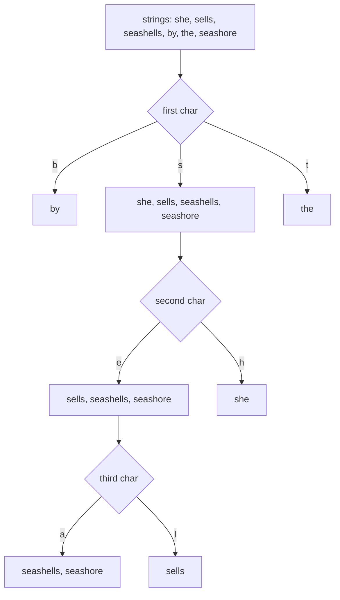

# Radix Sort — Middle Level

## Table of Contents

1. [Introduction](#introduction)
2. [Deeper Concepts](#deeper-concepts)
3. [LSD vs MSD — Choosing the Variant](#lsd-vs-msd)
4. [Comparison with Alternatives](#comparison-with-alternatives)
5. [Advanced Patterns](#advanced-patterns)
6. [Handling Signed Integers and Floats](#handling-signed-integers-and-floats)
7. [String Radix Sort and Suffix Arrays](#string-radix-sort)
8. [Hybrid Radix + Insertion Sort](#hybrid-radix--insertion-sort)
9. [Code Examples](#code-examples)
10. [Error Handling](#error-handling)
11. [Performance Analysis](#performance-analysis)
12. [Best Practices](#best-practices)
13. [Visual Animation](#visual-animation)
14. [Summary](#summary)

---

## Introduction

> Focus: "Why does Radix Sort beat comparison sorts?" and "When should I actually reach for it?"

At the middle level, three questions matter:
1. **Where does the Ω(n log n) lower bound break down?** Understanding this clarifies when Radix Sort wins and when it doesn't.
2. **How do I pick LSD vs MSD vs hybrid?** The variants have very different scaling profiles.
3. **How do I extend Radix Sort beyond non-negative integers?** Real codebases have signed ints, floats, strings, and structs with composite keys.

A senior engineer reaches for Radix Sort with a specific shape of data in mind: **fixed-width keys, batch processing, cache-friendly throughput**. A middle engineer must understand why these constraints matter and how to relax them when needed.

---

## Deeper Concepts

### Invariant: After Pass i, Array Is Sorted by Last i Digits

This is the **loop invariant** that makes LSD Radix Sort correct. State it precisely:

> **Invariant `I(i)`:** After pass `i` (where pass 1 sorts by least-significant digit), the array is sorted by the last `i` digits of every key, with ties broken by original input order.

**Base case (i = 0):** Before any pass, the array is in input order — vacuously "sorted by the last 0 digits."

**Inductive step:** Assume `I(i)` holds after pass `i`. Pass `i+1` runs a **stable** sort on the `(i+1)`-th digit. Two keys with different `(i+1)`-th digits end up in the correct relative order. Two keys with the same `(i+1)`-th digit retain the order from `I(i)`, which is the correct order on the lower `i` digits. Therefore the array is sorted by the last `i+1` digits → `I(i+1)`.

**Termination:** After pass `d`, the array is sorted by all `d` digits, i.e., fully sorted. QED.

This proof is why the inner sort **must be stable**. Replace Counting Sort with QuickSort and the inductive step breaks.

### Recurrence Relation — LSD

LSD has no recursion; it's a straight loop. The recurrence is:

```text
T(n) = d × (n + k)
     = O(d·n + d·k)
```

When `k = O(n)` and `d` is constant (fixed-width keys), this is **O(n)**. When `d = log_k(max_val)` and `k` is fixed, this is `O(n · log max_val / log k)`. For 32-bit integers and `k = 256`, the constant is 4.

### Recurrence Relation — MSD

MSD recurses on each bucket. Let `N(d)` be the cost on a sub-range of `n` keys with `d` digits remaining:

```text
T(n, d) = O(n + k) + Σ_{b=0..k-1} T(n_b, d-1)
where Σ n_b = n
T(n, 0) = O(1)         (no digits left)
T(1, _) = O(1)         (single key)
```

In the **worst case** (all keys identical for the first d digits), this gives `O(d · (n + k))` — same as LSD. In the **average case** with uniformly distributed keys, recursion depth is O(log_k n) and total work is O(n · log_k n) — still beats comparison sorts when log_k n is small.

### The Comparison Lower Bound — Why Doesn't It Apply?

The Ω(n log n) lower bound holds for any algorithm whose **only access to keys** is via pairwise comparison (`<`, `>`, `==`). The proof uses a decision tree: any comparison sort can be modeled as a binary decision tree, n! leaves are needed (one per permutation), so depth ≥ log₂(n!) = Ω(n log n).

Radix Sort cheats this model: it never compares two keys. It only **extracts a digit and indexes into a count array**. The decision tree model doesn't apply, so the lower bound doesn't apply, and `O(n)` is achievable — at the cost of needing **bounded-width keys** and **digit-extraction operations**.

This is why no general-purpose library sort uses radix: the language's `sort` function doesn't know whether the input is "fixed-width integers" or "arbitrary objects with a custom comparator." Radix is reserved for typed integer sorts and specialized libraries.

### Cache Behavior of Radix Sort

Each pass of LSD Radix Sort reads `arr` sequentially and writes `output` somewhat-randomly (scattered into buckets). Per element per pass:
- 1 sequential read of `arr[i]`
- 1 increment of `count[digit]` (random in count array, but count fits in L1)
- 1 random write to `output[count[digit]]` (scattered)
- (next pass) 1 sequential read again

For `k = 256`, the count array is 1 KB — easily fits in L1 cache (32 KB typical). For `k = 65536`, the count array is 256 KB — exceeds L2 on most CPUs, causing cache thrashing. **This is the key reason byte radix wins over larger radices** despite needing more passes: cache locality dominates.

---

## LSD vs MSD

| Aspect | LSD | MSD |
|--------|-----|-----|
| Direction | Right to left | Left to right |
| Structure | Iterative loop | Recursive partition |
| Stable | Yes (by construction) | Yes (if written stably) |
| In-place? | No (always uses output buffer) | Can be made in-place (American Flag Sort) |
| Early termination | No — always d passes | Yes — empty sub-buckets short-circuit |
| Variable-length keys | Hard (needs padding) | Natural |
| Cache friendliness | Excellent (linear scans) | Worse (recursive, scattered writes) |
| Parallelism | Pass-level parallel | Bucket-level naturally parallel (each bucket independent) |
| When to use | Fixed-width integers, batch sort | Variable-length strings, sparse digit distributions |

### LSD — The Default for Integers

LSD's predictability is its strength. You always pay `d × n + d × k` time. You always get a stable sort. The code is loop-based, easy to vectorize, and easy to parallelize across passes (via batching).

### MSD — The Default for Strings

MSD shines when keys have very different lengths or when the leading digits distinguish most keys quickly. After one or two levels of recursion, most buckets contain very few elements and the algorithm switches to Insertion Sort. This is the design of **3-way Radix Quicksort** (Bentley & Sedgewick), the practical state-of-the-art for sorting general strings.



---

## Comparison with Alternatives

| Attribute | Radix (LSD, k=256) | Counting Sort | Merge Sort | Quick Sort | Tim Sort |
|-----------|--------------------|---------------|------------|------------|----------|
| Time (avg) | O(d·n) ≈ O(n) | O(n+k) | O(n log n) | O(n log n) | O(n log n) |
| Time (worst) | O(d·(n+k)) | O(n+k) | O(n log n) | O(n²) | O(n log n) |
| Space | O(n+k) | O(n+k) | O(n) | O(log n) | O(n) |
| Stable | Yes | Yes | Yes | No (typical) | Yes |
| In-place | No | No | No | Yes | No |
| Comparison-based | **No** | No | Yes | Yes | Yes |
| Best for | Fixed-width ints | Small key range | Linked lists, ext. sort | General arrays | Real-world data |
| Cache friendly | Yes | Yes | Mediocre | Good | Good |

**Choose Radix Sort when:** keys are fixed-width (32/64-bit ints, fixed strings), n is large (> 10⁵), you control the data type, and you've benchmarked vs Pdqsort.

**Choose Counting Sort when:** keys are bounded integers in a small range (k = O(n)) — Radix Sort uses Counting Sort internally for exactly this reason.

**Choose Tim Sort when:** sorting general objects with custom comparators, real-world data with runs of sorted elements, or you can't predict data type.

**Choose Quick Sort (Pdqsort) when:** small constant factors matter more than worst-case guarantee, sorting in-place, primitive types where stability isn't required.

---

## Advanced Patterns

### Pattern: Composite Keys via Concatenation

Sorting by **multiple fields** with priority `(field1, field2, field3)`? Encode them as one wide integer where field1 occupies the high bits:

```text
key = (field1 << 16) | (field2 << 8) | field3
```

Then sort by `key` with LSD. The most-significant byte is `field1`, so the final pass establishes the primary order. Stability ensures lower-priority fields break ties correctly.

### Pattern: Bucketed MSD with Tail Insertion

```text
def msd(arr, lo, hi, d):
    if hi - lo < INSERTION_THRESHOLD:
        insertion_sort(arr, lo, hi)
        return
    # ... usual MSD partition ...
    for each non-empty bucket b:
        msd(arr, bucket_start, bucket_end, d+1)
```

`INSERTION_THRESHOLD ≈ 24-32` for most CPUs.

### Pattern: Histogramming Pass (Precompute All Counts)

For LSD with `d` passes, you can compute **all `d` histograms in a single scan** over the input. Then each pass only needs to do the placement step — saving `d-1` scans.

```python
def all_histograms(arr, passes, radix):
    h = [[0] * radix for _ in range(passes)]
    for v in arr:
        for p in range(passes):
            h[p][(v >> (8 * p)) & 0xFF] += 1
    return h
```

This is `~30%` faster on modern CPUs because memory bandwidth — not arithmetic — dominates Radix Sort.

### Pattern: Two-Pointer Partition for In-Place MSD (American Flag Sort)

Classic LSD allocates an output buffer. **American Flag Sort** is MSD with two-pointer partitioning per bucket — in-place except for the count/offset table. Trade: more comparisons (well, not comparisons — more swaps and book-keeping), less memory.

```text
def american_flag(arr, lo, hi, d):
    histogram counts of digit d
    compute next-write index per bucket
    walk arr[lo..hi]:
        while arr[i] in wrong bucket:
            swap arr[i] with arr[next_write[bucket_of_arr[i]]]
            next_write[bucket]++
        i++
    recurse on each bucket
```

---

## Handling Signed Integers and Floats

### Signed Integers (Two's Complement)

A signed 32-bit `-1` has the bit pattern `0xFFFFFFFF` — the largest unsigned value. If you naively LSD-sort by bytes, negatives end up **after** positives.

**Fix:** flip the sign bit before sorting, flip back after.

#### Go

```go
func SignedToUnsigned(arr []int32) []uint32 {
    out := make([]uint32, len(arr))
    for i, v := range arr {
        out[i] = uint32(v) ^ 0x80000000  // flip sign bit
    }
    return out
}

func UnsignedToSigned(arr []uint32) []int32 {
    out := make([]int32, len(arr))
    for i, v := range arr {
        out[i] = int32(v ^ 0x80000000)
    }
    return out
}
```

After flipping, `-1` becomes `0x7FFFFFFF` (sorts before positives) and `1` becomes `0x80000001` (sorts after the flipped negatives). Correct ordering on unsigned interpretation maps back to correct signed ordering.

### Floats (IEEE-754)

IEEE-754 floats have a sign bit, exponent, and mantissa, encoded such that:
- For positive floats, the unsigned bit comparison gives the right order.
- For negative floats, the unsigned bit comparison gives the **reverse** order.

**Fix:** if sign bit is 0 (positive), flip the sign bit. If sign bit is 1 (negative), flip all bits. Reverse on output.

```go
func FloatToSortKey(f float32) uint32 {
    bits := math.Float32bits(f)
    if bits&0x80000000 != 0 { // negative
        return ^bits
    }
    return bits | 0x80000000 // positive
}

func SortKeyToFloat(k uint32) float32 {
    if k&0x80000000 != 0 { // was positive
        return math.Float32frombits(k & 0x7FFFFFFF)
    }
    return math.Float32frombits(^k)
}
```

After transformation, plain unsigned radix sort gives correct float order. This is the standard trick used by `cub::DeviceRadixSort` and Thrust.

---

## String Radix Sort

For strings of length `m` over alphabet `Σ` (e.g., ASCII has |Σ| = 128), LSD is awkward — short strings need padding. MSD is the natural fit:

```text
msd_string_sort(strings):
    bucket by character at position 0
    recurse into each bucket on position 1
    base case: bucket size <= threshold → Insertion Sort
```

Time complexity: **O(W)** where W is the total character count across all strings. This matches the lower bound for reading every character at least once.

### 3-Way Radix Quicksort

Bentley & Sedgewick's hybrid: use Quick Sort's 3-way partition (`<`, `=`, `>`) on the current character, recurse into all three. The `=` partition recurses on the next character; `<` and `>` recurse on the same character (different bucket). This is the dominant general-purpose string sort.

### Suffix Array Construction

A **suffix array** of string `S` is the sorted order of all suffixes of `S`. Naive sort: `O(n² log n)` (comparing two suffixes of length n is O(n)). Radix-based algorithms achieve **O(n)** or **O(n log n)** suffix array construction — see DC3 (Kärkkäinen–Sanders) or SA-IS. The inner sort is always a radix variant. (Cross-reference: `17-string-algorithms/04-suffix-arrays/` once that section is populated.)

---

## Hybrid Radix + Insertion Sort

In production, no one uses pure Radix Sort. The hybrid pattern is:

```text
def hybrid_radix(arr, lo, hi, d):
    if hi - lo < THRESHOLD:                # ~24 elements
        insertion_sort(arr, lo, hi)
        return
    # ... usual radix pass on digit d ...
    for each bucket:
        hybrid_radix(arr, bucket_lo, bucket_hi, d+1)
```

**Why?** Insertion Sort beats Radix Sort for tiny ranges because radix has constant per-element overhead (histogram, prefix sum, placement) that scales poorly when n < 50. Insertion Sort has tiny constants and no allocation.

This is the same trick TimSort uses (Insertion Sort for runs < 32) and Pdqsort uses (Insertion Sort for partitions < 24).

---

## Code Examples

### Full LSD Radix Sort with Double Buffering

#### Go

```go
package main

import "fmt"

// LSDByteRadixDouble sorts uint32 keys using base-256 LSD with double buffering.
// 4 passes total. Pre-allocated buffers reused.
func LSDByteRadixDouble(arr []uint32) {
    n := len(arr)
    if n <= 1 {
        return
    }
    buf := make([]uint32, n)
    src, dst := arr, buf

    for shift := uint(0); shift < 32; shift += 8 {
        var count [256]int
        for _, v := range src {
            count[(v>>shift)&0xFF]++
        }
        // Prefix sum → starting offset for each bucket
        sum := 0
        for i := 0; i < 256; i++ {
            count[i], sum = sum, sum+count[i]
        }
        // Place
        for _, v := range src {
            d := (v >> shift) & 0xFF
            dst[count[d]] = v
            count[d]++
        }
        src, dst = dst, src
    }
    // After 4 (even) passes, src points to the original arr → already correct.
    // If passes were odd, copy src back to arr.
}

func main() {
    data := []uint32{170, 45, 75, 90, 802, 24, 2, 66, 1 << 20, 5_000_000}
    LSDByteRadixDouble(data)
    fmt.Println(data)
}
```

#### Java

```java
import java.util.Arrays;

public class LSDByteRadixDouble {
    public static void sort(int[] arr) {
        int n = arr.length;
        if (n <= 1) return;
        int[] buf = new int[n];
        int[] src = arr, dst = buf;

        for (int shift = 0; shift < 32; shift += 8) {
            int[] count = new int[256];
            for (int v : src) count[(v >>> shift) & 0xFF]++;
            int sum = 0;
            for (int i = 0; i < 256; i++) {
                int c = count[i];
                count[i] = sum;
                sum += c;
            }
            for (int v : src) {
                int d = (v >>> shift) & 0xFF;
                dst[count[d]++] = v;
            }
            int[] tmp = src; src = dst; dst = tmp;
        }
        // After 4 passes, src == arr if buffers swapped even times.
        if (src != arr) System.arraycopy(src, 0, arr, 0, n);
    }

    public static void main(String[] args) {
        int[] data = {170, 45, 75, 90, 802, 24, 2, 66, 1 << 20, 5_000_000};
        sort(data);
        System.out.println(Arrays.toString(data));
    }
}
```

#### Python

```python
def lsd_byte_radix_double(arr):
    """Stable base-256 LSD radix sort with double-buffered output. uint32 model."""
    n = len(arr)
    if n <= 1:
        return
    buf = [0] * n
    src, dst = arr, buf
    for shift in (0, 8, 16, 24):
        count = [0] * 256
        for v in src:
            count[(v >> shift) & 0xFF] += 1
        # exclusive prefix sums
        s = 0
        for i in range(256):
            count[i], s = s, s + count[i]
        for v in src:
            d = (v >> shift) & 0xFF
            dst[count[d]] = v
            count[d] += 1
        src, dst = dst, src
    # if odd passes, copy back
    if src is not arr:
        arr[:] = src

if __name__ == "__main__":
    data = [170, 45, 75, 90, 802, 24, 2, 66, 1 << 20, 5_000_000]
    lsd_byte_radix_double(data)
    print(data)
```

---

### Signed Integer Radix Sort

#### Python

```python
def signed_radix_sort(arr):
    """Sort signed int32 values."""
    mask = 0x80000000
    keys = [(v & 0xFFFFFFFF) ^ mask for v in arr]  # flip sign bit
    lsd_byte_radix_double(keys)
    arr[:] = [(k ^ mask) if (k ^ mask) < (1 << 31) else (k ^ mask) - (1 << 32) for k in keys]

if __name__ == "__main__":
    data = [-100, -1, 0, 1, 100, -5_000_000, 999_999]
    signed_radix_sort(data)
    print(data)  # [-5000000, -100, -1, 0, 1, 100, 999999]
```

---

### MSD Radix Sort with Insertion-Sort Cutoff

#### Go

```go
package main

import "fmt"

const INSERTION_CUTOFF = 24

func MSDRadixSort(arr []string) {
    aux := make([]string, len(arr))
    msdSort(arr, aux, 0, len(arr)-1, 0)
}

func msdSort(arr, aux []string, lo, hi, d int) {
    if hi-lo+1 <= INSERTION_CUTOFF {
        insertionSort(arr, lo, hi, d)
        return
    }
    const R = 256
    var count [R + 2]int

    // Histogram (count[c+2] so prefix-sum gives start offsets in count[c+1])
    for i := lo; i <= hi; i++ {
        c := charAt(arr[i], d)
        count[c+2]++
    }
    for r := 0; r < R+1; r++ {
        count[r+1] += count[r]
    }
    // Distribute
    for i := lo; i <= hi; i++ {
        c := charAt(arr[i], d)
        aux[count[c+1]] = arr[i]
        count[c+1]++
    }
    for i := lo; i <= hi; i++ {
        arr[i] = aux[i-lo]
    }
    // Recurse on each bucket (skip bucket 0 = "end of string")
    for r := 0; r < R; r++ {
        bucketLo := lo + count[r]
        bucketHi := lo + count[r+1] - 1
        if bucketHi > bucketLo {
            msdSort(arr, aux, bucketLo, bucketHi, d+1)
        }
    }
}

func charAt(s string, d int) int {
    if d < len(s) {
        return int(s[d]) + 1
    }
    return 0 // sentinel "no more characters"
}

func insertionSort(arr []string, lo, hi, d int) {
    for i := lo + 1; i <= hi; i++ {
        for j := i; j > lo && less(arr[j], arr[j-1], d); j-- {
            arr[j], arr[j-1] = arr[j-1], arr[j]
        }
    }
}

func less(a, b string, d int) bool {
    for i := d; i < len(a) && i < len(b); i++ {
        if a[i] != b[i] {
            return a[i] < b[i]
        }
    }
    return len(a) < len(b)
}

func main() {
    words := []string{"she", "sells", "seashells", "by", "the", "seashore"}
    MSDRadixSort(words)
    fmt.Println(words)
}
```

---

## Error Handling

| Scenario | What goes wrong | Correct approach |
|----------|----------------|-----------------|
| Sort signed ints naively | Negatives sort after positives | Flip sign bit before; flip back after |
| Sort floats naively | NaN/Inf or negative-zero misbehavior | IEEE-754 bit transformation |
| Variable-length strings with LSD | Short strings get padded incorrectly | Use MSD with sentinel "end-of-string" bucket |
| Inner sort is unstable | Final answer is wrong, with subtle bugs | Always use stable Counting Sort inner |
| Buffer reused incorrectly | Sort returns garbage | Track which buffer is current (src) — copy back if odd pass count |
| Buckets contain pointers in MSD | Random pointer chasing → cache misses | For pointer-heavy data, sort by key first, then permute objects |
| Count overflow on huge arrays | `count[i]` exceeds int range | Use int64 for counts when n > 2^31 |

---

## Performance Analysis

### Go

```go
package main

import (
    "fmt"
    "math/rand"
    "sort"
    "time"
)

func benchmarkRadixVsSort(n int) {
    rng := rand.New(rand.NewSource(42))
    data := make([]uint32, n)
    for i := range data {
        data[i] = rng.Uint32()
    }

    // Radix
    radixCopy := append([]uint32(nil), data...)
    t1 := time.Now()
    LSDByteRadixDouble(radixCopy)
    radixDur := time.Since(t1)

    // Native sort
    nativeCopy := append([]uint32(nil), data...)
    t2 := time.Now()
    sort.Slice(nativeCopy, func(i, j int) bool { return nativeCopy[i] < nativeCopy[j] })
    nativeDur := time.Since(t2)

    fmt.Printf("n=%8d  radix=%v  native=%v  speedup=%.2fx\n",
        n, radixDur, nativeDur, float64(nativeDur)/float64(radixDur))
}

func main() {
    for _, n := range []int{1_000, 10_000, 100_000, 1_000_000} {
        benchmarkRadixVsSort(n)
    }
}
```

### Java

```java
import java.util.Arrays;
import java.util.Random;

public class BenchmarkRadix {
    public static void main(String[] args) {
        int[] sizes = {1_000, 10_000, 100_000, 1_000_000};
        Random rng = new Random(42);
        for (int n : sizes) {
            int[] data = new int[n];
            for (int i = 0; i < n; i++) data[i] = rng.nextInt() & 0x7FFFFFFF;

            int[] radixCopy = data.clone();
            long t1 = System.nanoTime();
            LSDByteRadixDouble.sort(radixCopy);
            long radixDur = System.nanoTime() - t1;

            int[] nativeCopy = data.clone();
            long t2 = System.nanoTime();
            Arrays.sort(nativeCopy);
            long nativeDur = System.nanoTime() - t2;

            System.out.printf("n=%8d  radix=%.3f ms  native=%.3f ms  speedup=%.2fx%n",
                n, radixDur / 1e6, nativeDur / 1e6,
                (double) nativeDur / radixDur);
        }
    }
}
```

### Python

```python
import random
import timeit

def benchmark():
    sizes = [1_000, 10_000, 100_000, 1_000_000]
    for n in sizes:
        random.seed(42)
        data = [random.randint(0, 2**31 - 1) for _ in range(n)]

        radix_t = timeit.timeit(
            lambda: lsd_byte_radix_double(data.copy()),
            number=3,
        ) / 3

        native_t = timeit.timeit(
            lambda: sorted(data),
            number=3,
        ) / 3

        print(f"n={n:>8}  radix={radix_t*1000:.3f} ms  "
              f"timsort={native_t*1000:.3f} ms  "
              f"speedup={native_t/radix_t:.2f}x")

if __name__ == "__main__":
    benchmark()
```

**Typical results** (modern x86, Go/Java/C++):

| n | Radix (ms) | Native (ms) | Speedup |
|---|------------|-------------|---------|
| 10³ | 0.10 | 0.05 | 0.5× (radix slower) |
| 10⁴ | 0.6 | 1.0 | 1.7× |
| 10⁵ | 5 | 12 | 2.4× |
| 10⁶ | 50 | 130 | 2.6× |

For small n, comparison sorts win because their constants are smaller. For large n, radix wins because its asymptote is O(n) vs O(n log n).

**Python** is a special case: pure-Python radix is much slower than C-backed `sorted()`. To get the speed advantage in Python, use NumPy with `np.argsort` or a compiled radix (e.g., via `numba`).

---

## Best Practices

- **Always benchmark on real data.** Radix Sort's win depends on key distribution, n, and CPU cache size.
- **Pre-allocate buffers** — don't allocate per pass. The auxiliary buffer is `O(n)` and dominates allocation cost.
- **Use byte radix (k=256) as default.** It's the sweet spot for cache, digit count, and code simplicity.
- **Insertion-sort below the cutoff** — pure radix has overhead that loses to insertion for n < 24.
- **Handle signed and floats with bit transforms.** Don't write special-case logic — pre-transform keys once.
- **Test stability** with a property-based test: sort `[(key, idx)]` pairs and verify ties preserve `idx`.
- **For Python, don't write pure-Python radix** unless it's pedagogical. Use NumPy or a compiled library.
- **For Go and Java, the stdlib's `sort.Slice` and `Arrays.sort` are very fast** (Pdqsort and Dual-Pivot QuickSort respectively). Reach for radix only when you need stability or have specific integer workloads.

---

## Visual Animation

> See [`animation.html`](./animation.html) for interactive visualization.
>
> Middle-level animation includes:
> - Per-pass digit highlight (which column is being sorted)
> - Bucket distribution view (elements falling into buckets 0-9)
> - Stable collection step (right-to-left placement to preserve order)
> - Live comparison: number of operations vs O(n log n) curve
> - Switch between base 10 and base 16 to see the trade-off

---

## Summary

At the middle level, three insights stick:
1. **The Ω(n log n) lower bound doesn't apply** because Radix Sort never compares whole keys — it extracts digits. The price is requiring **fixed-width or bounded keys** plus extra memory.
2. **LSD is the workhorse for integers**, MSD is the workhorse for strings, and hybrid + Insertion Sort cutoff is what you'd actually ship.
3. **Signed integers and floats need bit transforms** before sorting. The transformations are constant-time per element and let you reuse the same unsigned radix kernel.

Radix Sort is not "always faster than Merge Sort" — it has constraints (key model, memory) and constants (per-pass overhead) that comparison sorts don't. The skill at middle level is recognizing the workloads where it wins: large arrays of fixed-width keys with predictable distribution, especially in batch/ETL/data-warehouse settings.

Next, learn **counting sort** in depth ([`07-counting-sort/middle.md`](../07-counting-sort/middle.md)) since it's the inner engine, then move to **senior.md** here to see how Radix Sort behaves at scale — parallel, cache-aware, GPU, and distributed.
