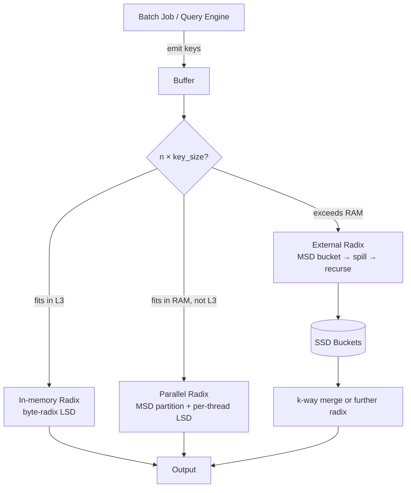
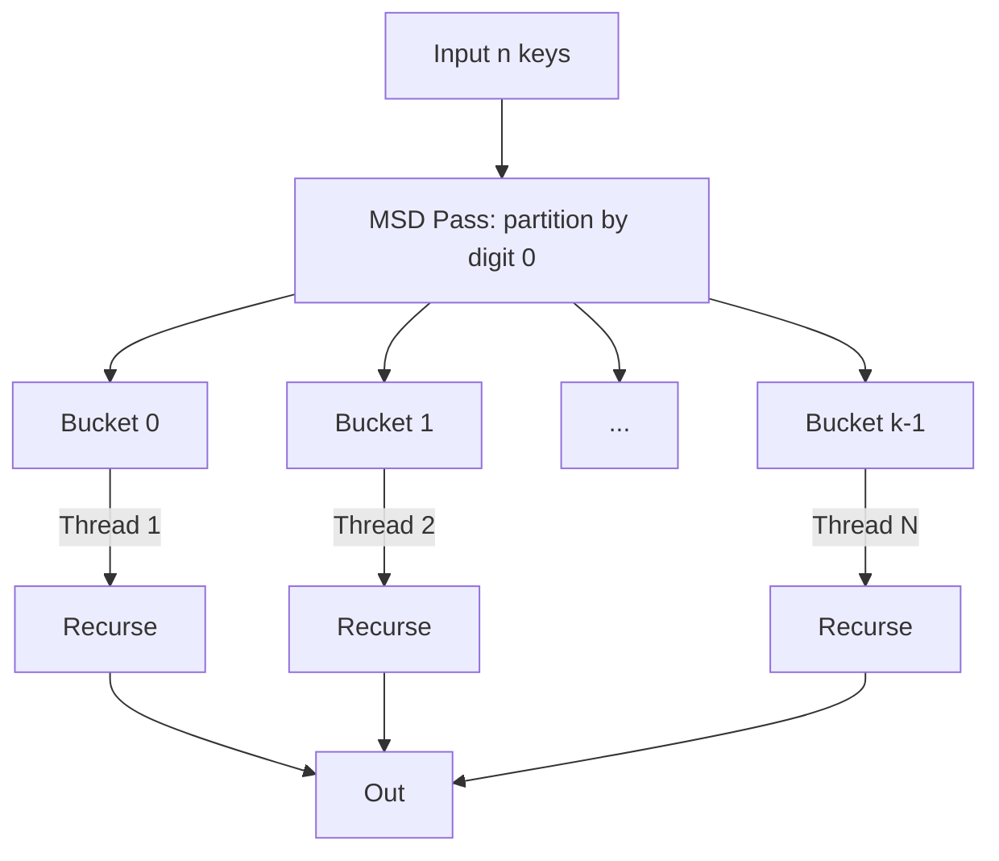
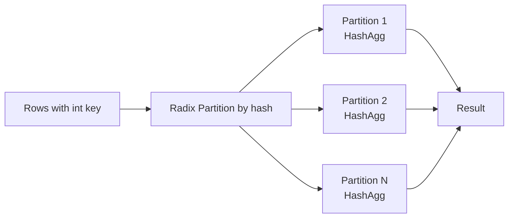
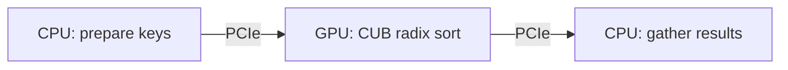

# Radix Sort — Senior Level

## Table of Contents

1. [Introduction](#introduction)
2. [System Design with Radix Sort](#system-design-with-radix-sort)
3. [Cache-Aware Radix Sort (PARADIS)](#cache-aware-radix-sort)
4. [Parallel Radix Sort on Multi-Core](#parallel-radix-sort-on-multi-core)
5. [External-Memory Radix Sort](#external-memory-radix-sort)
6. [GPU Radix Sort](#gpu-radix-sort)
7. [Distributed Radix Sort (TeraSort)](#distributed-radix-sort)
8. [Architecture Patterns](#architecture-patterns)
9. [Code Examples](#code-examples)
10. [Observability](#observability)
11. [Failure Modes](#failure-modes)
12. [Production Trade-offs](#production-trade-offs)
13. [Summary](#summary)

---

## Introduction

> Focus: "How do I architect a high-throughput sort pipeline using Radix?"

At the senior level, Radix Sort is not a textbook curiosity — it's the **dominant integer-sort kernel** behind:

- **GPU sort libraries** (`cub::DeviceRadixSort`, Thrust, ModernGPU, OneFlow) — sorting 100M+ keys per second.
- **Database engine vectorized sorts** (DuckDB, ClickHouse, Velox) — radix variants chosen for predictable cache behavior.
- **TeraSort and the Sort Benchmark** — distributed radix-style algorithms have won the Daytona Gray sort multiple times.
- **Network packet classification** — sort by IP/port using LSD for line-rate processing.
- **Search engine posting list merging** — sort document IDs as fixed-width ints.

The senior engineer's job is to (a) recognize when a problem reduces to integer sort, (b) choose the right radix variant for the memory hierarchy and hardware, (c) size the pipeline correctly, and (d) operate it (monitor throughput, plan capacity, design for failure).

This document covers four scaling axes: **CPU cache**, **multi-core**, **external memory**, **distributed / GPU**.

---

## System Design with Radix Sort



Decision tree at design time:
- **n × key_size < L3 cache** (~8-32 MB) → single-threaded byte-radix LSD wins.
- **n × key_size < heap** (~1-32 GB) → parallel MSD partition + per-thread byte LSD.
- **n × key_size > heap** → external MSD partition writes per-bucket files; recurse or merge.
- **GPU available** → CUB device radix sort; orders of magnitude faster than CPU.
- **Distributed (multi-node)** → sample-based range partition + per-node radix.

---

## Cache-Aware Radix Sort

The naive LSD pass writes to scattered positions in the output buffer (one per bucket). For `k = 256` buckets and an output of size n, each scatter write touches a random cache line — about `n/8` cache misses per pass (assuming 8 keys per line).

### PARADIS: In-Place Parallel Radix Sort

**PARADIS** (Cho et al., 2015) is a published in-place parallel radix sort that achieves near-perfect cache behavior. Key ideas:

1. **Partition the input into k regions** (one per bucket value).
2. **For each region, swap misplaced elements** into the correct bucket — like a multi-way American Flag Sort.
3. **Recurse on each region for the next digit**.

The in-place swap pattern avoids the O(n) auxiliary buffer and limits cache misses to one per cache line per pass.

### Software Write-Combining

A practical optimization: **buffer scatter writes** into thread-local "write-combining" buffers of one cache line each. When a buffer fills (8 keys for `int64`), flush the whole line to the output. This trades a small per-bucket buffer (k × cache_line_size bytes) for fewer scattered stores.

Used by Intel's IPP radix sort and DuckDB's `RadixPartition`.

```text
For each input key v:
    bucket = digit(v)
    push v onto buffer[bucket]
    if buffer[bucket] is full (8 keys):
        memcpy line to output[bucket_offset[bucket]]
        bucket_offset[bucket] += 8
        clear buffer[bucket]
```

Gain: **2-3× speedup** on x86 due to fewer cache-line transactions.

### Choosing Radix to Fit Cache

The L1 data cache is typically 32-48 KB. The count table for radix `k` is `k × sizeof(int)` = `4k` bytes. To fit in L1:

```text
4k < L1_size / 2     (leave room for input/output)
k  < L1_size / 8
```

For L1 = 32 KB: `k < 4096`. In practice, choose `k = 256` (1 KB count table) to leave headroom for the input/output cache footprint.

For software write-combining, also need `k × cache_line_size` bytes for buffers: 256 × 64 B = 16 KB. Now `k = 256` fully occupies L1. Even higher radix (e.g., 1024) is impractical.

---

## Parallel Radix Sort on Multi-Core

Radix Sort parallelizes along three axes:

### 1. Pass-Level Parallelism (Limited)

Each pass is intrinsically sequential (later passes depend on earlier passes' output). You **cannot** parallelize across passes for LSD. Only thing you can parallelize within one pass: the **histogram** computation (each thread counts a sub-range), then merge histograms; the **scatter** step is harder (concurrent writes to scatter targets).

### 2. Bucket-Level Parallelism (MSD's natural parallelism)

MSD's recursive structure is **embarrassingly parallel**: each bucket can be sorted on a separate thread. After the first pass, you have `k` independent sub-problems. Use a work-stealing thread pool:



**Load imbalance** is the main risk: if 90% of keys share a digit prefix, one bucket dominates. **Sample first, partition by quantiles** to balance load.

### 3. Per-Thread LSD (Cache-Local)

Inside each MSD bucket, switch to **single-threaded byte LSD** once the bucket fits in L3 cache. This hybrid (MSD-on-top, LSD-on-bottom) is what high-performance libraries actually ship.

### Scaling Limits

- 1 → 4 threads: near-linear speedup (cache local to each core).
- 4 → 16 threads: 6-10× speedup (memory bandwidth becomes the limit).
- 16+ threads: diminishing returns; memory controller is saturated.

In practice, 16-core CPUs achieve ~10× sort throughput over single-core for byte-radix LSD on 100M keys.

---

## External-Memory Radix Sort

When `n × key_size > RAM`, write per-bucket files to disk during MSD, then recurse on each file (or merge if small enough).

### Two-Phase External Radix

**Phase 1 — Partition (one pass over input):**

```text
open k output files (one per bucket of the top byte)
stream input keys:
    bucket = (key >> 24) & 0xFF
    write key to file[bucket]
close files
```

This pass uses O(n) sequential read and O(n) sequential write — disk I/O is **2N**.

**Phase 2 — Recurse:**

For each per-bucket file:
- If file fits in RAM → load + in-memory radix sort.
- Else → recurse: open k sub-bucket files, partition by next byte.

After all recursion, concatenate the bucket files in order — the result is sorted.

### I/O Complexity

Each pass reads N and writes N. Number of passes = `ceil(log_k(N/M))` where M is RAM size. For N = 1 TB, k = 256, M = 16 GB:

```text
log_256(1 TB / 16 GB) = log_256(64) = 0.75 → ceil = 1 pass
```

**1 partition pass + 1 in-memory sort pass = 2N + N = 3N I/O total.**

Compare to external merge sort: 2 passes × 2N = 4N. Radix wins because each pass writes to fewer files (k = 256) versus merge's k = √(M/B) = ~thousands of streams.

### TPC-H / Database Application

External radix sort is the standard `ORDER BY` implementation for OLAP engines when sorting by an integer key:
- ClickHouse uses radix for `ORDER BY` over integer columns.
- DuckDB's `RadixPartitionedHashAggregate` partitions by hash for parallel aggregation.
- Vertica and Snowflake document radix-style hash-partition phases.

### File System Considerations

- **256 simultaneous open files** is fine on Linux (ulimit > 1024 typical).
- **Disk locality** — keep all bucket files on the same volume to avoid cross-mount overhead.
- **Compression** — gzip bucket files if disk I/O dominates; CPU-cheap LZ4 is the usual choice.

---

## GPU Radix Sort

GPU radix sort is **the** state-of-the-art for sorting on modern hardware. NVIDIA's CUB library (`cub::DeviceRadixSort`) sorts a billion 32-bit keys in under a second on an A100.

### Why GPUs Love Radix

- **Tens of thousands of threads** — perfect for the histogram phase (one thread per key).
- **Coalesced memory access** — sequential reads of input fit GPU's bandwidth model.
- **No comparisons** — branchless inner loop avoids warp divergence.
- **Wide buckets** — 256 or 1024 buckets fit in shared memory.

### Algorithm Outline (Simplified)

```text
for each digit position (pass):
    Phase 1 (per-block histogram, parallel):
        each block of threads computes a local histogram for its key range
    Phase 2 (global prefix sum, parallel):
        compute prefix sums across all per-block histograms → starting offset per bucket per block
    Phase 3 (per-block scatter, parallel):
        each block writes its keys to the global output at the computed offsets
```

Each phase uses GPU primitives (block-level scan, exchange). The result: ~10× faster than the best CPU radix sort on the same node.

### Memory Traffic

Each pass reads N and writes N keys to global GPU memory. With memory bandwidth ~1.5 TB/s on A100, sorting 4 GB of int32 (1B keys) needs `4 passes × 8 GB = 32 GB` of traffic = ~21 ms. Actual: ~25 ms in CUB. **Memory-bandwidth-bound.**

### When Not to Use GPU Radix

- Latency-sensitive small sorts (< 1M keys) — kernel launch overhead dominates.
- Heterogeneous keys (variable strings) — sort by hashed key first.
- Data already on CPU — PCIe transfer cost exceeds sort cost for small batches.

---

## Distributed Radix Sort

For terabyte / petabyte sort, distribute across many machines.

### TeraSort (Hadoop / Spark)

The classic **TeraSort** algorithm wins many Sort Benchmark records:

1. **Sample** ~100k keys from input, sort the sample, compute `k - 1` quantile boundaries.
2. **Range partition**: each map task assigns each input key to one of `k` partitions based on the quantiles.
3. **Per-partition sort**: each reducer receives one partition and sorts it locally (often with external radix sort).
4. **Concatenate**: the sorted partitions in order form the final sorted output.

### Why Radix at Each Stage

- Step 2's "assign by quantile" is a digit-like bucket assignment — O(log k) binary search per key.
- Step 3's local sort uses external radix or in-memory radix depending on partition size.
- Step 4 is concatenation only — no merge step needed because partitions are disjoint by key range.

### TeraSort Records

| Year | Org | Data | Time | Nodes |
|------|-----|------|------|-------|
| 2014 | Apache Spark | 100 TB | 23 min | 206 nodes |
| 2016 | Tencent | 100 TB | 134 s | 512 nodes |
| 2016 | Tencent | 1 PB | 14.5 min | 1024 nodes |

All winners used range-partition + per-node radix/external-merge.

### Bottleneck: Network

Network shuffle bandwidth (mapper → reducer transfer) is the limit. For TeraSort, this is **N bytes shuffled** (every key moves once). Modern 100 Gbps interconnects can ship ~12 GB/s/node — for 100 TB on 200 nodes, that's `100 TB / (200 × 12 GB/s)` ≈ **42 seconds of network time** alone.

### Compression for Shuffle

Compress shuffle data with **LZ4** or **Snappy** — typical 2× reduction with negligible CPU. This roughly halves shuffle time.

---

## Architecture Patterns

### Pattern: Radix as a Building Block for Hash Aggregation



Used by DuckDB, ClickHouse, Polars. The radix partition step lets the hash aggregation fit in cache per partition — massive speedup.

### Pattern: Radix Sort for Top-K with Partial Sort

When you only need the **top-K** values, run one pass of MSD: sort by the top byte, then only sort within the buckets that contain the largest values. This is a **partial radix sort** — O(n) for the first pass, O(K log K) for the final sort. Avoids fully sorting n elements.

### Pattern: Radix Sort for Sort-Merge Join on Integer Keys

```text
SELECT * FROM A JOIN B ON A.id = B.id
where A.id and B.id are int64

→ Radix sort A by id, radix sort B by id
→ Sort-merge join (linear scan with two pointers)
```

Cheaper than hash join when the data is already partly sorted or when range queries follow the join.

### Pattern: GPU Offload for Embarrassingly Parallel Sort



For batch sorts of N ≥ 10M int32 keys with PCIe transfer overhead amortized, GPU radix is 10-100× faster than CPU. Used in real-time analytics, ML preprocessing (kNN, sort then bucket).

---

## Code Examples

### Parallel MSD with Goroutines (Go)

```go
package main

import (
    "fmt"
    "runtime"
    "sync"
)

const PARALLEL_THRESHOLD = 50_000
const INSERTION_THRESHOLD = 32

func ParallelMSDRadix(arr []uint32) {
    workers := runtime.NumCPU()
    sem := make(chan struct{}, workers)
    var wg sync.WaitGroup
    msdParallel(arr, 0, len(arr), 24, sem, &wg)
    wg.Wait()
}

func msdParallel(arr []uint32, lo, hi int, shift uint, sem chan struct{}, wg *sync.WaitGroup) {
    n := hi - lo
    if n <= INSERTION_THRESHOLD {
        insertion(arr, lo, hi)
        return
    }
    var count [257]int
    for i := lo; i < hi; i++ {
        count[((arr[i]>>shift)&0xFF)+1]++
    }
    for i := 1; i < 257; i++ {
        count[i] += count[i-1]
    }
    tmp := make([]uint32, n)
    offsets := count
    for i := lo; i < hi; i++ {
        d := (arr[i] >> shift) & 0xFF
        tmp[offsets[d]] = arr[i]
        offsets[d]++
    }
    copy(arr[lo:hi], tmp)

    if shift == 0 {
        return // last digit done
    }
    // Recurse on each bucket
    for b := 0; b < 256; b++ {
        bucketLo := lo + count[b]
        bucketHi := lo + count[b+1]
        if bucketHi-bucketLo > 1 {
            if bucketHi-bucketLo >= PARALLEL_THRESHOLD {
                wg.Add(1)
                sem <- struct{}{}
                go func(blo, bhi int) {
                    defer wg.Done()
                    defer func() { <-sem }()
                    msdParallel(arr, blo, bhi, shift-8, sem, wg)
                }(bucketLo, bucketHi)
            } else {
                msdParallel(arr, bucketLo, bucketHi, shift-8, sem, wg)
            }
        }
    }
}

func insertion(arr []uint32, lo, hi int) {
    for i := lo + 1; i < hi; i++ {
        v := arr[i]
        j := i
        for j > lo && arr[j-1] > v {
            arr[j] = arr[j-1]
            j--
        }
        arr[j] = v
    }
}

func main() {
    n := 1_000_000
    data := make([]uint32, n)
    for i := range data {
        data[i] = uint32(n - i)
    }
    ParallelMSDRadix(data)
    fmt.Println("Sorted first 5:", data[:5], "last 5:", data[n-5:])
}
```

### External Radix Sort (Python, simplified)

```python
import os
import tempfile
import struct

CHUNK = 1_000_000      # records per in-memory sort
RADIX_BUCKETS = 256

def external_radix_sort(input_path, output_path):
    """Sort 64-bit unsigned ints in a binary file, larger-than-RAM-safe."""
    # Phase 1: partition top byte into 256 files
    bucket_files = []
    bucket_writers = []
    tmpdir = tempfile.mkdtemp()
    for b in range(RADIX_BUCKETS):
        p = os.path.join(tmpdir, f"b{b:03d}.bin")
        bucket_files.append(p)
        bucket_writers.append(open(p, "wb"))

    with open(input_path, "rb") as f:
        while True:
            chunk = f.read(8 * CHUNK)
            if not chunk:
                break
            keys = struct.unpack(f"{len(chunk)//8}Q", chunk)
            for k in keys:
                bucket = (k >> 56) & 0xFF
                bucket_writers[bucket].write(struct.pack("Q", k))

    for w in bucket_writers:
        w.close()

    # Phase 2: for each bucket, load + in-memory sort + emit
    with open(output_path, "wb") as out:
        for p in bucket_files:
            with open(p, "rb") as bf:
                data = bf.read()
                keys = list(struct.unpack(f"{len(data)//8}Q", data))
                keys.sort()  # in-memory sort of bucket
                out.write(struct.pack(f"{len(keys)}Q", *keys))
            os.unlink(p)
    os.rmdir(tmpdir)

# Usage:
# external_radix_sort("input.bin", "sorted.bin")
```

For real production use, replace the inner `keys.sort()` with an in-memory radix call, and handle buckets that exceed RAM by recursing on the next byte.

---

## Observability

When operating systems that rely on radix sort (databases, ETL, GPU pipelines), monitor:

| Metric | Threshold | What it means |
|--------|-----------|---------------|
| `radix_sort_keys_per_sec` | < baseline | Throughput regression; investigate cache or memory bandwidth |
| `radix_sort_passes` | unexpected change | Key width changed, or histogram shows skewed distribution |
| `radix_sort_bucket_load_imbalance` | > 4× from mean | Skewed input; consider sampling to repartition |
| `radix_sort_l1_miss_ratio` | > 15% | Count table too large or scatter buffer too small |
| `radix_sort_l2_miss_ratio` | > 5% | Working set exceeds L2; reduce per-thread chunk size |
| `external_radix_spill_bytes` | spike | Data outgrew memory; check chunk sizing |
| `gpu_radix_kernel_ms` | > baseline | Check input key entropy, memory bandwidth saturation |
| `distributed_radix_shuffle_skew` | > 2× from mean partition | Range boundaries off; resample to recompute |
| `distributed_radix_network_mbps` | < 80% interface speed | Network underutilized; check serialization overhead |

### Tracing

```python
span.set_tag("sort.algorithm", "radix-byte-lsd")
span.set_tag("sort.n_keys", n)
span.set_tag("sort.key_width_bytes", 8)
span.set_tag("sort.passes", 8)
span.set_tag("sort.bucket_max_load", max(bucket_sizes))
span.set_tag("sort.bucket_skew_ratio", max(bucket_sizes) / mean(bucket_sizes))
span.set_tag("sort.duration_ms", elapsed_ms)
```

These tags let you spot when key distribution changes (a common production issue when a new tenant joins a multi-tenant system).

---

## Failure Modes

| Mode | Symptom | Mitigation |
|------|---------|------------|
| **Skewed key distribution** | One bucket holds 90% of keys; parallel speedup collapses | Sample input first; range-partition by quantiles |
| **Cache thrashing on large radix** | Throughput drops 10× above k = 1024 | Stick to byte radix (256); use software write-combining |
| **External sort fills disk** | `ENOSPC`; partial sort output | Pre-check available space; reject jobs over threshold |
| **PCIe bottleneck on GPU sort** | GPU sort time < transfer time; net no win | Batch larger jobs; use GPUDirect Storage |
| **TeraSort range boundaries wrong** | Some reducers OOM, others idle | Re-sample on data shift; use percentile-based ranges |
| **Pass count off-by-one** | Top digit not sorted; output partially wrong | Validate max key fits chosen pass count |
| **Two's complement on signed sort** | Negatives sort after positives | Flip sign bit before sort, flip back after |
| **NaN floats** | NaN sorts to extremes or breaks order | Filter NaN out before sort |
| **Concurrent modification during sort** | Crash or wrong order | Snapshot input; sort copy |
| **Histogram overflow on huge n** | Counter wraps; corrupted output | Use int64 counters when n > 2^31 |

---

## Production Trade-offs

### Radix vs Pdqsort / TimSort in Production

| Scenario | Choose | Why |
|----------|--------|-----|
| Small array (n < 100) | Insertion / Pdqsort | Radix per-pass overhead dominates |
| Generic objects, custom comparator | TimSort | Radix requires bounded-width keys |
| 1M+ int32 from a database column | Byte LSD radix | 2-3× faster than Pdqsort |
| 1M+ float64 | Pdqsort (or radix with IEEE transform) | Both work; profile your data |
| Strings of variable length | MSD radix or 3-way Radix Quicksort | LSD needs padding; MSD handles natively |
| GPU available, batch sort | CUB device radix sort | 10× faster than CPU |
| Distributed, > 1 TB | TeraSort + per-node external radix | Network + disk-aware design |
| Online incremental sort | Skip list / balanced BST | Radix is batch only |

### Memory vs Time

- **In-place radix (PARADIS, American Flag):** saves O(n) memory at the cost of more swaps and harder parallelization. Choose when memory-constrained.
- **Out-of-place radix with double-buffer:** simpler, faster scalar throughput, but needs O(n) extra. The default in production libraries.
- **External radix:** scales to disk but with 3-4× I/O. Use only when data exceeds RAM.

### Throughput vs Latency

- **Batch processing (ETL, OLAP):** radix wins on throughput. Latency of a single sort doesn't matter — total throughput does.
- **Online (real-time API):** prefer Pdqsort or skip-list-based incremental structures. Radix's batch nature is wrong here.

### Stability vs Speed

LSD is stable; some parallel MSD variants are not. If stability matters (multi-key sort), enforce stable inner sort in the implementation contract. Document this contract in the API.

---

## Summary

At the senior level, Radix Sort is the **integer-sort kernel** that scales from L1 cache to billion-key GPU sorts to petabyte distributed sorts. The architectural insights:

1. **Choose radix and pass count to fit the memory hierarchy.** Byte radix (k = 256) hits the L1 sweet spot for CPU; 1024-2048 buckets work on GPU shared memory.
2. **MSD parallelizes naturally** — bucket-per-thread on multi-core, block-per-thread-group on GPU, partition-per-node distributed.
3. **External radix beats external merge** for fixed-width integer keys by reducing pass count (256 ways per pass vs ~32 for merge).
4. **TeraSort + range partition + per-node radix** is the canonical distributed sort design. Network bandwidth is the limit, not CPU.
5. **GPU radix (CUB, Thrust) is 10× faster** than the best CPU implementation for batch integer sort. The PCIe transfer cost amortizes for n > 10M.

The design pattern: **radix is the right tool when keys are dense, fixed-width, and you control the data type**. For everything else — variable-length, complex comparators, online updates — reach for TimSort, Pdqsort, or a balanced BST. Reach for radix when you've measured and the workload looks integer-heavy.

Next, see [`professional.md`](./professional.md) for formal proofs (correctness by induction, I/O complexity bounds, parallel work-span analysis), or [`12-intro-sort/`](../12-intro-sort/) for the comparison-based general-purpose alternative used in C++ stdlib.
