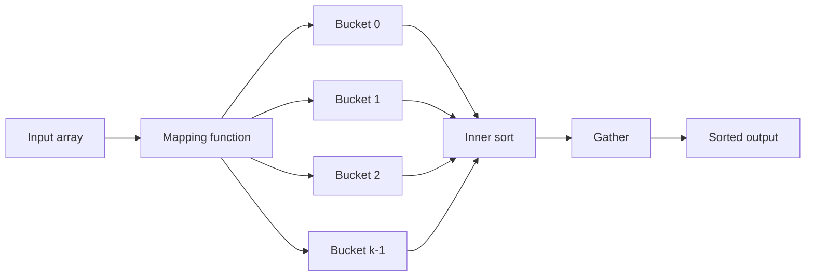

# Bucket Sort — Junior Level

## Table of Contents

1. [Introduction](#introduction)
2. [Prerequisites](#prerequisites)
3. [Glossary](#glossary)
4. [Core Concepts](#core-concepts)
5. [Big-O Summary](#big-o-summary)
6. [Real-World Analogies](#real-world-analogies)
7. [Pros & Cons](#pros--cons)
8. [Step-by-Step Walkthrough](#step-by-step-walkthrough)
9. [Code Examples](#code-examples)
10. [Coding Patterns](#coding-patterns)
11. [Error Handling](#error-handling)
12. [Performance Tips](#performance-tips)
13. [Best Practices](#best-practices)
14. [Edge Cases & Pitfalls](#edge-cases--pitfalls)
15. [Common Mistakes](#common-mistakes)
16. [Cheat Sheet](#cheat-sheet)
17. [Visual Animation](#visual-animation)
18. [Summary](#summary)
19. [Further Reading](#further-reading)

---

## Introduction

> Focus: "What is Bucket Sort?" and "How does distribution-based sorting work?"

**Bucket Sort** is a **distribution sort**: instead of comparing elements pairwise like Merge Sort or Quick Sort, it **scatters** elements into a fixed number of **buckets** using a cheap mapping function, **sorts each bucket independently**, then **gathers** the buckets in order. The intuition: pre-partition the data into ranges so each range is a tiny sort problem.

Bucket Sort is famous for one striking property — under the right input distribution it runs in **O(n) average time**, beating the **Ω(n log n)** lower bound that all comparison sorts must obey. It is not a comparison sort: the mapping function carries the ordering work, leaving the inner sort with O(1) average elements per bucket.

The catch: you must know something about the input distribution. If all elements map to one bucket, runtime degenerates to whatever inner sort you used (typically O(n²) for Insertion Sort). If keys are uniformly distributed on a known range — floats in `[0, 1)`, hash values mod a prime, normalized percentile scores — Bucket Sort is unbeatable.

Bucket Sort sits in a family of three distribution sorts beginners often confuse:
- **Counting Sort** (see `07-counting-sort/`): each bucket holds one integer value (a counter).
- **Radix Sort** (see `08-radix-sort/`): a chain of bucket-sort passes, one per digit.
- **Bucket Sort** (this topic): buckets cover arbitrary ranges; an inner sort orders each.

A famous large-scale use is **TeraSort**, which sorts a terabyte on a Hadoop cluster: TeraSort is a distributed Bucket Sort that range-partitions the input across workers.

---

## Prerequisites

- **Required:** Arrays / slices / lists — indexing, appending, iterating
- **Required:** Basic loops and conditionals
- **Required:** Understanding of `O(n)` and `O(n log n)` — see [`06-algorithmic-complexity/`](../../06-algorithmic-complexity/01-time-vs-space-complexity/junior.md)
- **Required:** Knowledge of one comparison sort (Insertion Sort is most common as the inner sort) — see [`01-bubble-sort/`](../01-bubble-sort/junior.md), [`03-insertion-sort/`](../03-insertion-sort/junior.md)
- **Helpful:** Floating-point arithmetic basics — most textbook examples sort floats in `[0, 1)`
- **Helpful:** Understanding of probability distributions — "uniform" vs. "skewed" inputs explain when Bucket Sort wins or loses
- **Helpful:** Familiarity with Counting Sort or Radix Sort — Bucket Sort generalizes both

---

## Glossary

| Term | Definition |
|------|-----------|
| **Distribution Sort** | A sort that places elements into positions based on key value, not by comparing them pairwise |
| **Bucket** | A small container (list, array, or linked list) holding all elements that map to one range |
| **Scatter Phase** | First pass: walk the input and append each element to the bucket chosen by the mapping function |
| **Gather Phase** | Last pass: walk the buckets in order, concatenating them into the output |
| **Mapping Function** | A cheap function `key → bucket index`; the most common form is `floor(k × key / max)` |
| **Inner Sort** | The algorithm used to sort the contents of one bucket (usually Insertion Sort) |
| **Uniform Distribution** | Inputs spread evenly across the key range — the ideal case for Bucket Sort |
| **Skewed Distribution** | Inputs cluster into one bucket — the worst case, makes Bucket Sort O(n²) |
| **Fat Bucket** | A bucket that absorbed too many elements — the failure mode of skewed input |
| **k** | The number of buckets — a tuning parameter, typically chosen so `k ≈ n` |
| **Stable Sort** | Preserves the original relative order of equal keys (Bucket Sort is stable if the inner sort is) |
| **TeraSort** | A distributed Bucket Sort used to sort terabytes of data on a Hadoop cluster |
| **Pigeonhole Sort** | Extreme Bucket Sort where each bucket holds exactly one possible key value |

---

## Core Concepts

### Concept 1: Three Phases — Scatter, Sort, Gather

Bucket Sort always proceeds in three explicit phases:

1. **Scatter:** allocate `k` empty buckets. For each input element `x`, compute `i = mapping(x)` and append `x` to `buckets[i]`.
2. **Sort:** for each non-empty bucket, sort its contents using an inner sort (typically Insertion Sort).
3. **Gather:** concatenate `buckets[0]`, `buckets[1]`, ..., `buckets[k-1]` in order to produce the sorted output.

The whole algorithm is conceptually trivial — the only intelligence is in the mapping function, which decides which elements land together. A good mapping function spreads input evenly; a bad one piles everything into one bucket.

### Concept 2: The Mapping Function — The Heart of the Algorithm

For floats in `[0, 1)` with `n` elements and `k = n` buckets, the textbook mapping is:

```text
mapping(x) = floor(k * x)
```

This places `0.0` in bucket 0, `0.5` in bucket `k/2`, and `0.999` in bucket `k-1`. If inputs are uniformly random, the **expected** count in each bucket is exactly 1 — the inner sort touches at most a handful of elements per bucket.

For integers in range `[lo, hi]`, the natural generalization is:

```text
mapping(x) = floor(k * (x - lo) / (hi - lo + 1))
```

Both formulas share the same idea: scale the key into `[0, k)` and floor to get a bucket index.

### Concept 3: Why O(n) Average?

If `n` elements scatter uniformly into `k` buckets, then on average each bucket gets `n/k` elements. The inner sort costs `O((n/k)²)` for Insertion Sort, so total cost across all buckets is:

```text
T(n) = n           (scatter)
     + k * O((n/k)²) (sort buckets)
     + n           (gather)
     = O(n + n²/k)
```

Choose `k = n` and `n²/k = n`, so `T(n) = O(n)`. This is **expected-case linear time** — better than any comparison sort. The constant factor hides the cost of allocating `k` buckets, but for large `n` this is dominated by the scatter pass.

### Concept 4: Worst Case Is O(n²)

If all `n` elements map to the same bucket, the scatter pass costs O(n), the inner sort costs O(n²), and gather costs O(n) — total **O(n²)**. This happens when:
- The mapping function is bad (constant function).
- The input is severely skewed (e.g., all values are `0.5` and the buckets cover narrower ranges).
- An adversary chose the input to defeat the bucket boundaries.

Senior engineers harden this by sampling the input to set bucket boundaries (see `senior.md` — sample-then-partition).

### Concept 5: Stability — Depends on Inner Sort

Bucket Sort is stable **if and only if** the inner sort is stable. Insertion Sort is stable, so the standard textbook variant is stable. If you swap in Quick Sort or Heap Sort as the inner sort, you lose stability.

Stability matters when sorting records by multiple keys (e.g., sort employees by department, then by name within department) — preserving the secondary order requires a stable sort.

### Concept 6: How Bucket Sort Differs from Counting and Radix

This is the most common source of confusion at the junior level:

- **Counting Sort:** "bucket" = exactly one integer value. There are no inner sorts; the bucket itself is a counter that holds duplicates. Use when the key range is small relative to `n`.
- **Bucket Sort:** "bucket" = a range of keys. Inner sort handles ordering within each bucket. Use when keys are real-valued or come from a large range that you can partition.
- **Radix Sort:** chain of `d` bucket-sort passes, one per digit. Each pass uses a tiny key range (10 buckets for decimal, 256 for byte). Use when keys are integers with fixed width.

Pigeonhole Sort is the degenerate case of Bucket Sort where bucket count equals the key universe size — at that point it becomes Counting Sort.

---

## Big-O Summary

| Operation / Case | Complexity | Notes |
|-----------------|-----------|-------|
| Time — Best | **O(n + k)** | All buckets empty or trivially sorted |
| Time — Average | **O(n + k)** when `k ≈ n` and input is uniform | The famous "beats O(n log n)" case |
| Time — Worst | **O(n²)** | All elements land in one fat bucket |
| Space — Auxiliary | **O(n + k)** | `k` bucket headers + total `n` elements |
| Stable | **Yes** if inner sort is stable | Insertion Sort gives stability |
| In-place | **No** | Buckets are allocated separately |
| Adaptive | **Partially** | Faster on uniformly distributed input; not adaptive in the TimSort sense |
| Comparison-based? | **No** | Beats Ω(n log n) lower bound when assumptions hold |
| Best for | Uniform floats in `[0, 1)`, hash-bucketing, distributed sort | |

---

## Real-World Analogies

| Concept | Analogy |
|---------|--------|
| **Scatter phase** | Mail at the post office: each letter goes into its zip-code slot |
| **Inner sort per bucket** | Mail carrier sorting one neighborhood by house number |
| **Gather phase** | Loading the truck: zip 10001's bag, then 10002's, then 10003's |
| **Fat bucket failure** | One zip code gets 90% of the mail — the carrier still sorts it slowly |
| **Bucket boundaries** | Teacher splitting essays into A/B/C grades; if everyone got a B, the B pile is huge |
| **Sample-then-partition** | Florist samples flowers, then sets price tiers by quality distribution |
| **Counting vs Bucket** | Counting = one bin per zip code; Bucket = one bin per state |
| **Radix vs Bucket** | Radix = bucket by last digit, then second-to-last — repeated bucketing |

> **Where the analogy breaks:** real mail uses exact zip codes — no comparison. Bucket Sort's inner sort still compares within each bucket.

---

## Pros & Cons

| Pros | Cons |
|------|------|
| **O(n) average** on uniform input — beats Ω(n log n) | Requires known input distribution to pick `k` and `f` |
| **Embarrassingly parallel** — each bucket on its own thread | O(n²) worst case when input lands in one bucket |
| **Natural fit for distributed systems** (TeraSort, MapReduce) | Not in-place — O(n + k) auxiliary memory |
| **Easy to implement** — three phases | Picking `k` is a tuning trade-off |
| **Stable** when inner sort is stable | Wastes memory if many buckets are empty |
| **Cache-friendly scatter** when `k` fits in L2/L3 | Floating-point mapping can introduce rounding errors |

**When to use:**
- Inputs are **uniformly distributed floats** in a known range (the textbook case).
- Hash-bucketing for distributed sort, e.g., partitioning by `hash(key) % k`.
- The bucket-sort phase of an external or distributed sort (TeraSort, MapReduce shuffle).
- Pre-partitioning data before a database `GROUP BY` or sort-merge join.
- GPU / SIMD sorts where many small per-bucket sorts run in parallel.

**When NOT to use:**
- You **do not know** the input distribution — Quick Sort or Merge Sort is safer.
- The input is **heavily skewed** (e.g., a Zipf distribution of word frequencies) — pick a hashing strategy or use a comparison sort.
- Memory is tight and you cannot afford `O(n + k)` auxiliary space — use Heap Sort or in-place Quick Sort.
- The data set is tiny (n < 32) — Insertion Sort alone wins.

---

## Step-by-Step Walkthrough

Sort `[0.42, 0.32, 0.23, 0.52, 0.25, 0.47, 0.51]` (n = 7 floats in `[0, 1)`), using `k = 10` buckets.

**Phase 1 — Scatter:**

Compute `index = floor(10 * x)` for each `x`:

| x | floor(10·x) | Bucket |
|----|-----|----|
| 0.42 | 4 | 4 |
| 0.32 | 3 | 3 |
| 0.23 | 2 | 2 |
| 0.52 | 5 | 5 |
| 0.25 | 2 | 2 |
| 0.47 | 4 | 4 |
| 0.51 | 5 | 5 |

After scatter:

```text
bucket 0: []
bucket 1: []
bucket 2: [0.23, 0.25]
bucket 3: [0.32]
bucket 4: [0.42, 0.47]
bucket 5: [0.52, 0.51]
bucket 6: []
bucket 7: []
bucket 8: []
bucket 9: []
```

**Phase 2 — Sort each bucket** (Insertion Sort):

- bucket 2: `[0.23, 0.25]` — already sorted.
- bucket 3: `[0.32]` — single element.
- bucket 4: `[0.42, 0.47]` — already sorted.
- bucket 5: `[0.52, 0.51]` → `[0.51, 0.52]`.

**Phase 3 — Gather** in order:

```text
[] + [] + [0.23, 0.25] + [0.32] + [0.42, 0.47] + [0.51, 0.52] + [] + [] + [] + []
= [0.23, 0.25, 0.32, 0.42, 0.47, 0.51, 0.52]
```

Total work:
- Scatter: 7 operations.
- Inner sorts: 1 swap (in bucket 5).
- Gather: 7 operations.

**Total comparisons:** about 5 (vs. Bubble Sort's ~21 for the same input).

---

## Code Examples

### Example 1: Bucket Sort for Floats in `[0, 1)`

#### Go

```go
package main

import (
    "fmt"
    "sort"
)

// BucketSort sorts a slice of floats in [0, 1) using bucket sort.
// Time: O(n) average for uniform input. Space: O(n + k).
func BucketSort(arr []float64) []float64 {
    n := len(arr)
    if n <= 1 {
        return arr
    }
    k := n // one bucket per element
    buckets := make([][]float64, k)

    // Phase 1: Scatter — place each element into its bucket.
    for _, x := range arr {
        idx := int(float64(k) * x)
        if idx == k { // guard against x == 1.0
            idx = k - 1
        }
        buckets[idx] = append(buckets[idx], x)
    }

    // Phase 2: Sort each bucket (use any stable inner sort).
    for i := range buckets {
        sort.Float64s(buckets[i])
    }

    // Phase 3: Gather — concatenate buckets in order.
    result := make([]float64, 0, n)
    for _, b := range buckets {
        result = append(result, b...)
    }
    return result
}

func main() {
    data := []float64{0.42, 0.32, 0.23, 0.52, 0.25, 0.47, 0.51}
    fmt.Println(BucketSort(data))
}
```

#### Java

```java
import java.util.ArrayList;
import java.util.Arrays;
import java.util.Collections;
import java.util.List;

public class BucketSortFloats {
    public static double[] bucketSort(double[] arr) {
        int n = arr.length;
        if (n <= 1) return arr;
        int k = n;

        List<List<Double>> buckets = new ArrayList<>(k);
        for (int i = 0; i < k; i++) buckets.add(new ArrayList<>());

        // Phase 1: Scatter
        for (double x : arr) {
            int idx = (int) (k * x);
            if (idx == k) idx = k - 1;       // guard for x == 1.0
            buckets.get(idx).add(x);
        }

        // Phase 2: Sort each bucket
        for (List<Double> b : buckets) Collections.sort(b);

        // Phase 3: Gather
        double[] out = new double[n];
        int pos = 0;
        for (List<Double> b : buckets) {
            for (double v : b) out[pos++] = v;
        }
        return out;
    }

    public static void main(String[] args) {
        double[] data = {0.42, 0.32, 0.23, 0.52, 0.25, 0.47, 0.51};
        System.out.println(Arrays.toString(bucketSort(data)));
    }
}
```

#### Python

```python
def bucket_sort(arr):
    """Sort floats in [0, 1). Time: O(n) average, O(n^2) worst. Space: O(n + k)."""
    n = len(arr)
    if n <= 1:
        return arr
    k = n
    buckets = [[] for _ in range(k)]

    # Phase 1: Scatter
    for x in arr:
        idx = int(k * x)
        if idx == k:               # guard for x == 1.0
            idx = k - 1
        buckets[idx].append(x)

    # Phase 2: Sort each bucket (Python's sorted is TimSort, O(m log m) per bucket)
    for b in buckets:
        b.sort()

    # Phase 3: Gather
    result = []
    for b in buckets:
        result.extend(b)
    return result

if __name__ == "__main__":
    data = [0.42, 0.32, 0.23, 0.52, 0.25, 0.47, 0.51]
    print(bucket_sort(data))
```

**What it does:** Scatters floats into `n` buckets by linear scaling, sorts each bucket, then concatenates. Returns a new sorted list.
**Run:** `go run main.go` | `javac BucketSortFloats.java && java BucketSortFloats` | `python bucket_sort.py`

---

### Example 2: Bucket Sort for Integers in a Known Range

#### Go

```go
package main

import (
    "fmt"
    "sort"
)

// BucketSortInts sorts integers in [lo, hi] using bucket sort.
func BucketSortInts(arr []int, lo, hi int) []int {
    n := len(arr)
    if n <= 1 {
        return arr
    }
    k := n
    width := float64(hi-lo+1) / float64(k)
    buckets := make([][]int, k)

    for _, x := range arr {
        idx := int(float64(x-lo) / width)
        if idx >= k {
            idx = k - 1
        }
        buckets[idx] = append(buckets[idx], x)
    }

    for i := range buckets {
        sort.Ints(buckets[i])
    }

    out := make([]int, 0, n)
    for _, b := range buckets {
        out = append(out, b...)
    }
    return out
}

func main() {
    data := []int{42, 32, 23, 52, 25, 47, 51, 10, 99, 1}
    fmt.Println(BucketSortInts(data, 0, 100))
}
```

#### Java

```java
import java.util.ArrayList;
import java.util.Arrays;
import java.util.Collections;
import java.util.List;

public class BucketSortInts {
    public static int[] bucketSort(int[] arr, int lo, int hi) {
        int n = arr.length;
        if (n <= 1) return arr;
        int k = n;
        double width = (double)(hi - lo + 1) / k;

        List<List<Integer>> buckets = new ArrayList<>(k);
        for (int i = 0; i < k; i++) buckets.add(new ArrayList<>());

        for (int x : arr) {
            int idx = (int) ((x - lo) / width);
            if (idx >= k) idx = k - 1;
            buckets.get(idx).add(x);
        }

        for (List<Integer> b : buckets) Collections.sort(b);

        int[] out = new int[n];
        int pos = 0;
        for (List<Integer> b : buckets) {
            for (int v : b) out[pos++] = v;
        }
        return out;
    }

    public static void main(String[] args) {
        int[] data = {42, 32, 23, 52, 25, 47, 51, 10, 99, 1};
        System.out.println(Arrays.toString(bucketSort(data, 0, 100)));
    }
}
```

#### Python

```python
def bucket_sort_ints(arr, lo, hi):
    """Sort integers in [lo, hi]."""
    n = len(arr)
    if n <= 1:
        return arr
    k = n
    width = (hi - lo + 1) / k
    buckets = [[] for _ in range(k)]

    for x in arr:
        idx = int((x - lo) / width)
        if idx >= k:
            idx = k - 1
        buckets[idx].append(x)

    for b in buckets:
        b.sort()

    out = []
    for b in buckets:
        out.extend(b)
    return out

if __name__ == "__main__":
    data = [42, 32, 23, 52, 25, 47, 51, 10, 99, 1]
    print(bucket_sort_ints(data, 0, 100))
```

**What it does:** Generalizes Example 1 to any integer range. The `width` defines how wide a bucket is in key space. Using Insertion Sort instead of `sort.Ints` works equally well when the average bucket holds 1-3 elements (the textbook CLRS pattern).

---

## Coding Patterns

### Pattern 1: Scatter-Sort-Gather

**Intent:** The universal Bucket Sort skeleton — applicable to any distribution sort.

```text
function bucket_sort(arr, k, mapping):
    buckets = array of k empty lists
    for x in arr:
        buckets[mapping(x)].append(x)
    for b in buckets:
        inner_sort(b)
    return concatenate(buckets)
```

This pattern is reusable for Radix Sort (where `mapping(x)` extracts a digit) and Counting Sort (where `inner_sort` is no-op and `mapping(x) = x`).

### Pattern 2: Linear Mapping Function

**Intent:** Scale a real-valued key into a bucket index using one multiplication.

```text
mapping(x) = floor(k * (x - lo) / (hi - lo))
```

For floats in `[0, 1)`: `mapping(x) = floor(k * x)`.
For integers in `[lo, hi]`: same formula with floating-point or rescaled integer math.



### Pattern 3: Hash-Based Mapping (Distributed Variant)

**Intent:** Bucket by hash for non-numeric keys (strings, structs).

#### Go

```go
func bucketIndex(key string, k int) int {
    var h uint32 = 2166136261 // FNV-1a offset basis
    for i := 0; i < len(key); i++ {
        h ^= uint32(key[i])
        h *= 16777619
    }
    return int(h % uint32(k))
}
```

#### Java

```java
public static int bucketIndex(String key, int k) {
    int h = key.hashCode();
    return Math.floorMod(h, k);
}
```

#### Python

```python
def bucket_index(key, k):
    return hash(key) % k
```

Hash-based bucketing is used in distributed shuffle: every node maps each record to a bucket and sends it to the responsible worker.

---

## Error Handling

| Error | Cause | Fix |
|-------|-------|-----|
| `IndexError` / `panic: index out of range` | `floor(k * x)` returns `k` for `x = 1.0` | Clamp: `if idx == k: idx = k - 1` |
| All elements in one bucket — slow | Mapping function collapses input | Pick a better mapping or use comparison sort |
| `MemoryError` for huge `k` | Allocating millions of empty buckets | Use a sparse map or pick smaller `k` |
| Lost stability | Inner sort is unstable | Use Insertion Sort or another stable sort |
| Floating-point precision drift | `floor(k * x)` rounds wrong for tiny `x` | Use integer arithmetic if possible |
| Negative input crashes scatter | Mapping assumes `x ≥ 0` | Shift input: `mapping(x - lo)` |

---

## Performance Tips

- **Choose `k ≈ n`** to keep average bucket size at 1.
- **Use Insertion Sort** for buckets of size ≤ 16; beats library sort on tiny inputs.
- **Reuse a single output buffer** in the gather phase.
- **Pre-allocate bucket lists** with capacity hints.
- **Prefer integer mapping** for integer keys; avoids floating-point precision issues.
- **Sample the input** to set quantile boundaries when the distribution is unknown.

---

## Best Practices

- **Document the distribution assumption** in docstrings.
- **Validate the input range** before scattering.
- **Pick the inner sort consciously** — Insertion Sort for tiny, library sort for unpredictable.
- **Scale `k` with `n`**, not a constant.
- **Handle the boundary `x = max`** — clamp `idx = k - 1`.
- **Production:** use the language's stable library sort unless Insertion Sort is proven faster.
- **Benchmark on real input** — synthetic uniform data is rarely representative.

---

## Edge Cases & Pitfalls

- **Empty array** → return immediately.
- **Single element** → return as-is.
- **All equal** (`[0.5, 0.5, 0.5]`) → all in one bucket; inner sort must not degrade.
- **Boundary `x = 1.0`** → `floor(k*x) = k`; must clamp to `k - 1`.
- **Negative values** → shift input by `-lo` first.
- **All in one bucket** → O(n²) inner cost; accept or use sampling.
- **NaN keys** → `floor(k * NaN)` is undefined; filter NaN first.
- **Empty buckets** → harmless but waste memory when `k >> n`.
- **Floating-point rounding near `max`** → test boundary values explicitly.

---

## Common Mistakes

1. **Forgetting to clamp `idx = k` to `k - 1`** when `x` equals the upper bound — off-by-one crash.
2. **Picking constant `k` regardless of `n`** — works for tiny inputs, blows up for large.
3. **Using Quick Sort as inner sort and claiming stability** — Quick Sort is unstable.
4. **Assuming uniform distribution** without measuring — real data is often skewed.
5. **Allocating fresh buckets in a loop** — reuse the bucket arrays across calls.
6. **Confusing Bucket / Counting / Radix Sort** — see Concept 6.
7. **Mismatched types in mapping** (integer division when floating-point intended) — all-zero indices.

---

## Cheat Sheet

```text
Bucket Sort — Quick Reference

ALGORITHM:
    bucket_sort(arr, k):
        buckets = [[] for _ in range(k)]
        for x in arr:
            i = mapping(x, k)
            buckets[i].append(x)
        for b in buckets:
            insertion_sort(b)
        return concatenate(buckets)

MAPPING (floats in [0,1)):  i = floor(k * x)  ; clamp to k-1
MAPPING (ints in [lo,hi]):   i = floor(k * (x-lo) / (hi-lo+1))

COMPLEXITY:
    Time best/avg: O(n + k)  when k ~ n, uniform input
    Time worst:    O(n^2)    when all elements land in one bucket
    Space:         O(n + k)
    Stable:        YES if inner sort is stable
    In-place:      NO

WHEN TO USE:
    - Uniformly distributed floats / ints over a known range
    - Hash-bucketing for distributed sort
    - TeraSort phase / MapReduce shuffle
    - Pre-partition for GROUP BY / sort-merge join

NEVER USE FOR:
    - Unknown / heavily skewed distributions
    - Tight memory budgets
    - Tiny arrays (< 32 elements)
```

---

## Visual Animation

> See [`animation.html`](./animation.html) for an interactive visual animation of Bucket Sort.
>
> The animation demonstrates:
> - Scatter phase: each input element is colored by target bucket and animated into its bucket row
> - Sort phase: each bucket sorts itself with Insertion Sort, highlighting comparisons
> - Gather phase: buckets concatenate top-to-bottom into the final output array
> - Live counters: bucket count, scatter operations, comparisons, swaps
> - Switch between uniform input (best case) and skewed input (worst case) to see O(n) vs O(n²) in action

---

## Summary

Bucket Sort is a **distribution sort**: it places elements into `k` buckets by a cheap mapping function, sorts each bucket independently, and concatenates the buckets. When inputs are **uniformly distributed** and `k ≈ n`, average runtime is **O(n)** — beating the comparison-sort lower bound of Ω(n log n). When inputs are skewed, runtime degrades to **O(n²)**, the worst case of the inner sort.

Master Bucket Sort because:
1. It is the simplest algorithm that breaks the Ω(n log n) barrier.
2. It generalizes Counting Sort and underlies Radix Sort — understanding it unlocks all distribution sorts.
3. It is the natural blueprint for **distributed sort** (TeraSort, MapReduce shuffle) and **parallel sort** on GPUs.
4. The scatter–sort–gather pattern shows up in databases (`GROUP BY`, hash join), networking (packet classification), and analytics pipelines.

Two essential takeaways:
1. **Choosing `k` and the mapping function is the only intelligence in the algorithm** — get them right and you win O(n); get them wrong and you lose to Quick Sort.
2. **Always clamp the index** when `x` hits the upper bound — the most common bug in textbook implementations.

Move next to **Counting Sort** (`07-counting-sort/`) to see the degenerate case of bucket sort, or **Radix Sort** (`08-radix-sort/`) to see bucket sort chained across digits.

---

## Further Reading

- **CLRS — Introduction to Algorithms (4th ed.)**, Chapter 8.4 (Bucket Sort) — formal expected-time proof.
- **Sedgewick & Wayne — Algorithms (4th ed.)**, Section 5.1 (key-indexed counting).
- **Knuth — TAOCP Vol. 3**, Section 5.2 (sorting by distribution).
- **TeraSort paper** — O'Malley, "TeraByte Sort on Apache Hadoop" (2008) — distributed bucket sort.
- **External sorting survey** — Garcia-Molina, *Database Systems*, Chapter 11.
- Go: [`sort`](https://pkg.go.dev/sort) package docs.
- Java: [`Arrays.sort`](https://docs.oracle.com/javase/8/docs/api/java/util/Arrays.html), [`Collections.sort`](https://docs.oracle.com/javase/8/docs/api/java/util/Collections.html).
- Python: [`sorted`](https://docs.python.org/3/library/functions.html#sorted) — TimSort, used as a common inner sort.
- [visualgo.net/en/sorting](https://visualgo.net/en/sorting) — interactive sorting animations.
