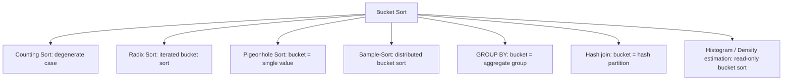

# Bucket Sort — Middle Level

## Table of Contents

1. [Introduction](#introduction)
2. [Deeper Concepts](#deeper-concepts)
3. [Comparison with Alternatives](#comparison-with-alternatives)
4. [Advanced Patterns](#advanced-patterns)
5. [Choosing the Mapping Function](#choosing-the-mapping-function)
6. [Bucket Sort and DP / Graph Connections](#bucket-sort-and-dp--graph-connections)
7. [Code Examples](#code-examples)
8. [Error Handling](#error-handling)
9. [Performance Analysis](#performance-analysis)
10. [Best Practices](#best-practices)
11. [Visual Animation](#visual-animation)
12. [Summary](#summary)

---

## Introduction

> Focus: "Why does Bucket Sort beat O(n log n)?" and "When should I choose it over its cousins?"

At the junior level, Bucket Sort is "scatter, sort each bucket, gather." At the middle level it becomes a precise tool with three orthogonal design choices: **how many buckets**, **what mapping function**, **which inner sort**. Each choice is a Pareto trade-off — change one and you move along a curve of expected-time vs. worst-case vs. memory.

The middle-level engineer must also know exactly how Bucket Sort relates to Counting Sort, Radix Sort, Pigeonhole Sort, and hash-based partitioning — because in production they often appear in the same pipeline. A Spark job that performs `sortByKey` does a range-partition Bucket Sort across the cluster, then runs a TimSort within each partition. Knowing which step is which lets you debug skew, tune the partition count, and predict the shape of the shuffle.

---

## Deeper Concepts

### Invariant: One-Bucket Locality

Throughout the algorithm, the following property holds at the end of the scatter phase:

```text
For all i < j, every element in bucket[i] is <= every element in bucket[j].
```

This invariant is exactly what allows the gather phase to be a simple concatenation rather than a merge. If you violate this invariant — e.g., by using a hash function whose output order does not match key order — then the gather phase becomes a `k`-way merge instead of a free concatenation, and you have effectively reinvented external Merge Sort.

A subtler invariant: **stability within a bucket**. If the inner sort is stable, the order in which the scatter phase appends to each bucket is preserved. Combined with the cross-bucket invariant, this gives end-to-end stability of the whole sort.

### Recurrence and Expected-Time Analysis

Let `n_i` be the number of elements that land in bucket `i`. The inner sort costs `O(n_i²)` if it is Insertion Sort. Total time is:

```text
T(n) = O(n)                 (scatter)
     + sum_i O(n_i^2)       (inner sorts)
     + O(n + k)             (gather)
```

For uniformly distributed input with `k = n`, `E[n_i] = 1` but `E[n_i²]` is not `1` — it follows a Poisson distribution with mean 1. The standard identity is:

```text
E[n_i^2] = Var(n_i) + (E[n_i])^2 = 1 + 1 = 2  (Poisson)
sum_i E[n_i^2] = k * 2 = 2n
```

So total expected time is `O(n)`. The factor-of-2 hidden in `E[n_i²] = 2` is what differentiates "linear time" from "perfectly linear." See `professional.md` for the formal derivation.

### Why k = n Is the Sweet Spot

```text
T(n) = n + k * (n/k)^2 + n
     = 2n + n^2 / k
```

Setting `dT/dk = 0` and solving (treating `k` as continuous), one finds the minimum is at large `k` — but memory pressure pushes back. The empirical compromise is `k = n` (or `k = n/2` for very-tight memory budgets, doubling expected bucket size to 2 but cutting bucket-overhead memory in half).

### The Skew Failure Mode

Real data is rarely uniform. Two failure patterns dominate:

1. **One fat bucket:** the input contains a popular value (e.g., 80% of records have `status = "active"`). Bucket Sort by `status` puts 80% of records in one bucket, which runs at O(n²) or O(n log n) depending on inner sort.
2. **Long tail / Zipf:** a few buckets are fat, most are empty. Memory is wasted, parallelism is uneven.

The fix at the middle level is **sample-then-partition** (see Pattern: Sampling for Range Partitioning below). This shifts ownership of the "uniform distribution" assumption from "the input must be uniform" to "the boundaries must be picked so each bucket is balanced."

---

## Comparison with Alternatives

| Attribute | Bucket Sort | Counting Sort | Radix Sort | Quick Sort | Merge Sort |
|-----------|------------|--------------|-----------|-----------|-----------|
| Time (avg) | O(n + k) | O(n + r) | O(d (n + b)) | O(n log n) | O(n log n) |
| Time (worst) | O(n²) | O(n + r) | O(d (n + b)) | O(n²) | O(n log n) |
| Space | O(n + k) | O(n + r) | O(n + b) | O(log n) | O(n) |
| Stable? | Yes (if inner is) | Yes | Yes | No | Yes |
| In-place? | No | No | No | Yes | No |
| Comparison-based? | No | No | No | Yes | Yes |
| Distribution assumption | Uniform on known range | Small integer range | Fixed-width integer keys | None | None |
| Best for | Uniform floats / hash-bucketing | Small-range integer histograms | Fixed-width integers | General-purpose | Stability + worst-case bound |

> `r` = range size for Counting Sort; `d` = number of digit passes for Radix Sort; `b` = base of each digit.

**Choose Bucket Sort when:** input is real-valued or comes from a wide range, AND you can characterize the distribution (uniform, or sample-able).
**Choose Counting Sort when:** keys are integers from a small range (`r = O(n)`); skip the inner sort entirely.
**Choose Radix Sort when:** keys are fixed-width integers; Bucket Sort cannot exploit digit structure directly.
**Choose Quick Sort when:** general-purpose, primitives, cache locality matters.
**Choose Merge Sort when:** stability + guaranteed O(n log n) + external/linked-list scenarios.

### Counting Sort as Degenerate Bucket Sort

If you set the mapping function so that **each bucket holds exactly one possible key value**, Bucket Sort becomes Counting Sort: each bucket is a counter (or a list of identical elements), and the inner sort is a no-op. This is the "extreme" version that works only for small key ranges.

### Radix Sort as Iterated Bucket Sort

Radix Sort is `d` passes of bucket sort, each pass using a base-`b` mapping function on one digit. Each pass is stable, and the passes are ordered LSD-first (or MSD-first). The number of buckets per pass is small (`b`), so memory is bounded; the cost moves into the digit-extraction loop.

---

## Advanced Patterns

### Pattern: Two-Pass Sample-Then-Partition

**Intent:** Make Bucket Sort robust against skewed input by choosing bucket boundaries based on a sample of the data.

#### Go

```go
package main

import (
    "math/rand"
    "sort"
)

// SampledBucketSort uses sampling to set bucket boundaries.
// Robust against skewed input; resists fat-bucket failure.
func SampledBucketSort(arr []int) []int {
    n := len(arr)
    if n <= 1 {
        return arr
    }
    k := n / 16 // target average bucket size = 16

    // Step 1: sample 1% of input (or at least k entries).
    sampleSize := max(k*8, n/100)
    sample := make([]int, 0, sampleSize)
    for i := 0; i < sampleSize; i++ {
        sample = append(sample, arr[rand.Intn(n)])
    }
    sort.Ints(sample)

    // Step 2: pick boundaries at evenly spaced quantiles.
    boundaries := make([]int, k-1)
    for i := 1; i < k; i++ {
        boundaries[i-1] = sample[i*len(sample)/k]
    }

    // Step 3: scatter using binary search on boundaries.
    buckets := make([][]int, k)
    for _, x := range arr {
        idx := sort.SearchInts(boundaries, x)
        buckets[idx] = append(buckets[idx], x)
    }

    // Step 4: sort each bucket.
    for i := range buckets {
        sort.Ints(buckets[i])
    }

    // Step 5: gather.
    out := make([]int, 0, n)
    for _, b := range buckets {
        out = append(out, b...)
    }
    return out
}

func max(a, b int) int { if a > b { return a }; return b }
```

#### Java

```java
import java.util.*;

public class SampledBucketSort {
    public static int[] sort(int[] arr) {
        int n = arr.length;
        if (n <= 1) return arr;
        int k = Math.max(2, n / 16);

        Random rng = new Random(42);
        int sampleSize = Math.max(k * 8, n / 100);
        int[] sample = new int[sampleSize];
        for (int i = 0; i < sampleSize; i++) {
            sample[i] = arr[rng.nextInt(n)];
        }
        Arrays.sort(sample);

        int[] boundaries = new int[k - 1];
        for (int i = 1; i < k; i++) {
            boundaries[i - 1] = sample[i * sample.length / k];
        }

        List<List<Integer>> buckets = new ArrayList<>(k);
        for (int i = 0; i < k; i++) buckets.add(new ArrayList<>());
        for (int x : arr) {
            int idx = Arrays.binarySearch(boundaries, x);
            if (idx < 0) idx = -idx - 1;
            buckets.get(idx).add(x);
        }

        for (List<Integer> b : buckets) Collections.sort(b);

        int[] out = new int[n];
        int pos = 0;
        for (List<Integer> b : buckets) for (int v : b) out[pos++] = v;
        return out;
    }
}
```

#### Python

```python
import bisect, random

def sampled_bucket_sort(arr):
    n = len(arr)
    if n <= 1:
        return arr
    k = max(2, n // 16)

    sample_size = max(k * 8, n // 100)
    sample = sorted(random.choice(arr) for _ in range(sample_size))
    boundaries = [sample[i * len(sample) // k] for i in range(1, k)]

    buckets = [[] for _ in range(k)]
    for x in arr:
        idx = bisect.bisect_left(boundaries, x)
        buckets[idx].append(x)

    for b in buckets:
        b.sort()

    out = []
    for b in buckets:
        out.extend(b)
    return out
```

**Why this works:** the sample approximates the empirical CDF of the input. Choosing boundaries at the sample's quantiles makes each bucket receive (in expectation) `n/k` elements — regardless of how skewed the underlying distribution is.

**Sample size matters:** too small → poor quantile estimates → uneven buckets. Common rule: sample at least `k * 8` elements (32 samples per target bucket).

### Pattern: Generic Distribution Sort

**Intent:** A template that handles any key type with a user-supplied mapping function.

#### Python

```python
from typing import Callable, List, TypeVar

T = TypeVar("T")

def generic_bucket_sort(arr: List[T], k: int, mapping: Callable[[T], int],
                        inner_sort=sorted) -> List[T]:
    buckets: List[List[T]] = [[] for _ in range(k)]
    for x in arr:
        idx = mapping(x)
        if idx >= k:
            idx = k - 1
        elif idx < 0:
            idx = 0
        buckets[idx].append(x)

    out: List[T] = []
    for b in buckets:
        out.extend(inner_sort(b))
    return out
```

Use cases:
- Sort URLs by domain: `mapping = lambda url: hash(domain(url)) % k`.
- Sort log lines by timestamp: `mapping = lambda line: int(line.ts // bucket_seconds)`.
- Sort customer records by region: `mapping = lambda c: region_to_index[c.region]`.

### Pattern: Linked-List Buckets (Sorted Insertion)

**Intent:** Merge the scatter and inner-sort phases by inserting each element into a sorted linked list. Each insert is O(m) for a bucket of size m, so total cost remains O(n + sum m²) — identical Big-O, but no separate sort pass.

Useful in memory-constrained environments where bucket array re-allocation is expensive, and in textbook CLRS exposition.

---

## Choosing the Mapping Function

| Mapping | Use when | Cost |
|---------|----------|------|
| `floor(k * x / max)` (linear) | Keys uniform on `[0, max]` | O(1) per call |
| `floor(k * (x - lo) / (hi - lo))` | Keys uniform on `[lo, hi]` | O(1) per call |
| Quantile-from-sample | Skewed keys, sample-able | O(log k) per call (binary search) |
| `hash(x) % k` | Keys arbitrary, want hash partition | O(hash cost) per call |
| Percentile lookup table | Keys from known empirical distribution | O(1) per call after O(k) setup |
| Hierarchical / recursive | Multi-stage routing (e.g., MapReduce) | Variable |

The trade-off is **cheap mapping (constant time, simple formula) vs. balanced buckets (more work upfront to estimate boundaries)**. For low-skew workloads, linear mapping wins. For high-skew, quantile-from-sample is safer.

---

## Bucket Sort and DP / Graph Connections



**Sort-merge join (database):** when both inputs are pre-sorted by the join key, the merge step from Merge Sort joins them in O(n + m). When you bucket-sort both inputs by the same hash function first, you reduce a join over `n + m` records to many small joins over `n/k + m/k` records — this is the **hash join** algorithm.

**GROUP BY in SQL:** if the grouping column is the bucket key, scatter into buckets and aggregate per bucket. The same scatter pattern powers `COUNT(*) GROUP BY column` in column-store databases.

**Frequency analysis / histograms:** stop after the scatter phase — `len(buckets[i])` is the histogram bin. Useful for IP-rate-limiting, query profiling, and online quantile estimation.

---

## Code Examples

### Full Implementation: Bucket Sort with Adaptive Inner Sort

#### Go

```go
package main

import (
    "fmt"
    "sort"
)

// BucketSort with adaptive inner sort: Insertion Sort for small buckets,
// library sort for large.
func BucketSort(arr []float64) []float64 {
    n := len(arr)
    if n <= 1 {
        return arr
    }
    k := n
    buckets := make([][]float64, k)

    for _, x := range arr {
        idx := int(float64(k) * x)
        if idx >= k {
            idx = k - 1
        }
        buckets[idx] = append(buckets[idx], x)
    }

    const INSERTION_THRESHOLD = 16
    for i := range buckets {
        if len(buckets[i]) <= INSERTION_THRESHOLD {
            insertionSort(buckets[i])
        } else {
            sort.Float64s(buckets[i])
        }
    }

    out := make([]float64, 0, n)
    for _, b := range buckets {
        out = append(out, b...)
    }
    return out
}

func insertionSort(a []float64) {
    for i := 1; i < len(a); i++ {
        x := a[i]
        j := i - 1
        for j >= 0 && a[j] > x {
            a[j+1] = a[j]
            j--
        }
        a[j+1] = x
    }
}

func main() {
    data := []float64{0.42, 0.32, 0.23, 0.52, 0.25, 0.47, 0.51}
    fmt.Println(BucketSort(data))
}
```

#### Java

```java
import java.util.*;

public class AdaptiveBucketSort {
    private static final int INSERTION_THRESHOLD = 16;

    public static double[] sort(double[] arr) {
        int n = arr.length;
        if (n <= 1) return arr;
        int k = n;

        List<List<Double>> buckets = new ArrayList<>(k);
        for (int i = 0; i < k; i++) buckets.add(new ArrayList<>());
        for (double x : arr) {
            int idx = (int)(k * x);
            if (idx >= k) idx = k - 1;
            buckets.get(idx).add(x);
        }

        for (List<Double> b : buckets) {
            if (b.size() <= INSERTION_THRESHOLD) insertionSort(b);
            else Collections.sort(b);
        }

        double[] out = new double[n];
        int pos = 0;
        for (List<Double> b : buckets) for (double v : b) out[pos++] = v;
        return out;
    }

    private static void insertionSort(List<Double> a) {
        for (int i = 1; i < a.size(); i++) {
            double x = a.get(i);
            int j = i - 1;
            while (j >= 0 && a.get(j) > x) {
                a.set(j + 1, a.get(j));
                j--;
            }
            a.set(j + 1, x);
        }
    }
}
```

#### Python

```python
INSERTION_THRESHOLD = 16

def adaptive_bucket_sort(arr):
    n = len(arr)
    if n <= 1:
        return arr
    k = n
    buckets = [[] for _ in range(k)]
    for x in arr:
        idx = int(k * x)
        if idx >= k:
            idx = k - 1
        buckets[idx].append(x)

    for b in buckets:
        if len(b) <= INSERTION_THRESHOLD:
            _insertion_sort(b)
        else:
            b.sort()

    out = []
    for b in buckets:
        out.extend(b)
    return out

def _insertion_sort(a):
    for i in range(1, len(a)):
        x = a[i]
        j = i - 1
        while j >= 0 and a[j] > x:
            a[j + 1] = a[j]
            j -= 1
        a[j + 1] = x
```

**What it does:** picks Insertion Sort for tiny buckets (where its lower constant wins) and library sort for fat buckets (where O(n log n) saves time). This is the standard "introsort-like" defensive pattern.

---

## Error Handling

| Scenario | What goes wrong | Correct approach |
|----------|----------------|-----------------|
| `floor(k * 1.0) = k` | Index out of range | Clamp: `if idx == k: idx = k - 1` |
| Unknown input range | Negative index from `(x - lo)` when `x < lo` | Pre-validate `lo <= min(arr) <= max(arr) <= hi` |
| All elements in one bucket | O(n²) inner sort | Detect skew at scatter time and fall back to Merge Sort |
| Empty input | Undefined `max`, divide-by-zero in mapping | Early return for `n == 0` |
| Hash collision storm (hash mapping) | One bucket gets 90% of input | Re-hash with a different seed, or use range-partition fallback |
| Floating-point overflow in `k * x` | NaN / Inf bucket index | Use integer mapping when possible |

---

## Performance Analysis

### Benchmark Across Input Distributions

#### Go

```go
import (
    "fmt"
    "math/rand"
    "time"
)

func benchmark() {
    sizes := []int{1000, 10000, 100000, 1000000}
    for _, n := range sizes {
        // Uniform
        uni := make([]float64, n)
        for i := range uni { uni[i] = rand.Float64() }
        // Skewed (Beta(0.5, 5) approximation — most values near 0)
        skew := make([]float64, n)
        for i := range skew { skew[i] = rand.Float64() * rand.Float64() }

        start := time.Now()
        BucketSort(append([]float64{}, uni...))
        uniTime := time.Since(start)

        start = time.Now()
        BucketSort(append([]float64{}, skew...))
        skewTime := time.Since(start)

        fmt.Printf("n=%7d uniform=%6.2fms skewed=%6.2fms ratio=%.1fx\n",
            n, float64(uniTime.Microseconds())/1000.0,
            float64(skewTime.Microseconds())/1000.0,
            float64(skewTime)/float64(uniTime))
    }
}
```

> The Java version follows the same pattern with `System.nanoTime()`; see `tasks.md` Benchmark Task for the full code in all three languages.

#### Python

```python
import random, timeit

for n in [1_000, 10_000, 100_000]:
    uni = [random.random() for _ in range(n)]
    skew = [random.random() * random.random() for _ in range(n)]

    t1 = timeit.timeit(lambda: adaptive_bucket_sort(uni[:]), number=5) / 5
    t2 = timeit.timeit(lambda: adaptive_bucket_sort(skew[:]), number=5) / 5
    print(f"n={n:>7} uniform={t1*1000:.2f}ms skewed={t2*1000:.2f}ms ratio={t2/t1:.1f}x")
```

Expected trend: uniform input scales roughly O(n); skewed input scales roughly O(n log n) (because the inner library sort kicks in for fat buckets). The "ratio" column quantifies how much skew costs.

---

## Best Practices

- **Always benchmark on real input distributions** — the textbook uniform case is unusual in practice.
- **Document the assumed range and distribution** in the function signature / docstring.
- **Use Insertion Sort for tiny buckets** (n ≤ 16) — measurably faster than `sorted()`.
- **Prefer the library stable sort** as the inner sort when bucket sizes are unpredictable.
- **For production hash partitioning**, use a hash function with good avalanche (xxHash, MurmurHash3) — Java's `String.hashCode()` is okay but not great.
- **For sample-based partitioning**, sample at least `8k` elements to get stable boundaries.
- **Pre-allocate the output array** in the gather phase to avoid repeated `append` re-allocations.
- **Detect skew early** — if the largest bucket holds > 10% of input, abort and fall back to Merge Sort.

---

## Visual Animation

> See [`animation.html`](./animation.html) for interactive visualization.
>
> Middle-level animation includes:
> - Toggle between uniform input (Bucket Sort wins) and skewed input (degrades to inner-sort time)
> - Side-by-side comparison: Bucket Sort vs. Merge Sort step count
> - Visualization of the mapping function as a curve from input to bucket index
> - Live tracking of the largest bucket size — the predictor of overall runtime
> - Optional: switch inner sort between Insertion Sort and library sort to see the trade-off

---

## Summary

At the middle level, Bucket Sort is understood as three orthogonal design knobs — bucket count `k`, mapping function, and inner sort — each with its own Pareto trade-off. The **uniform-distribution assumption** is the load-bearing wall: when it holds, Bucket Sort runs in expected **O(n)** time; when it fails, the algorithm gracefully degrades to whatever inner sort you picked. Defensive patterns like sample-then-partition and adaptive inner sort harden Bucket Sort against real-world skew.

Bucket Sort is the **family head** of distribution sorts. Counting Sort is the degenerate case (one bucket per value); Radix Sort is iterated bucket sort across digits; Pigeonhole Sort is the trivial special case where bucket count equals the universe size. Mastering Bucket Sort gives you the mental model to recognize, design, and tune all four — plus their distributed cousins (TeraSort, MapReduce shuffle, Spark `repartitionAndSortWithinPartitions`).
