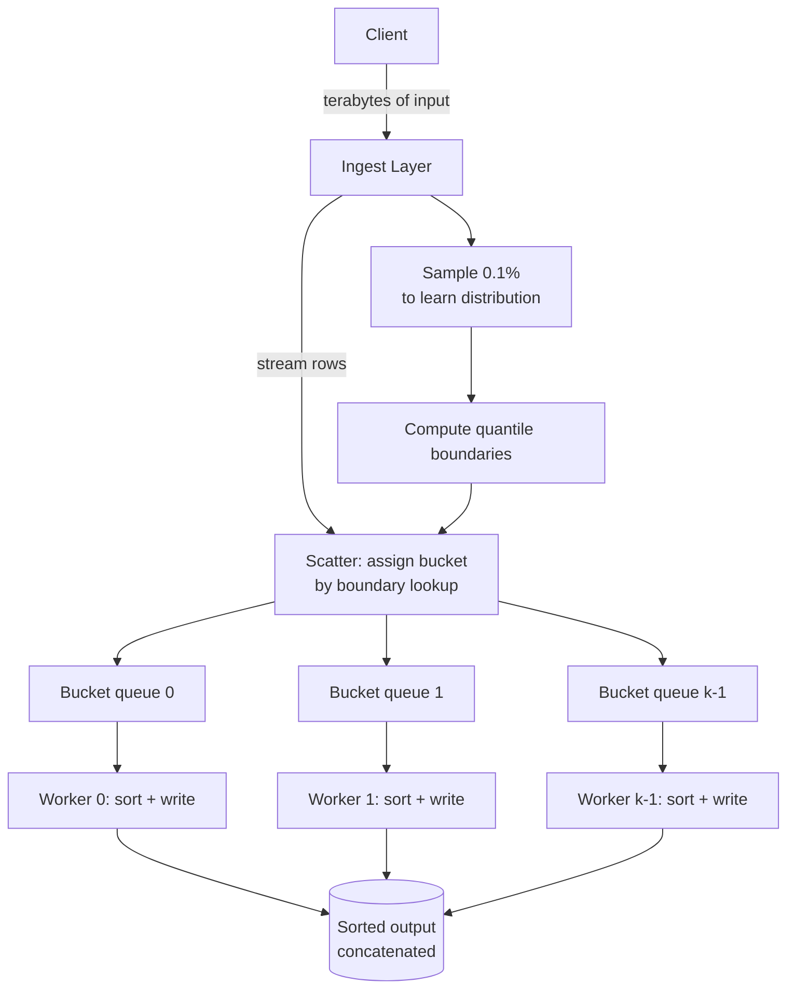
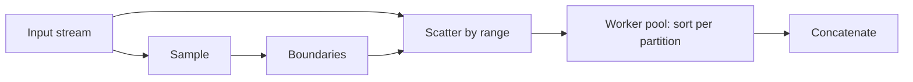
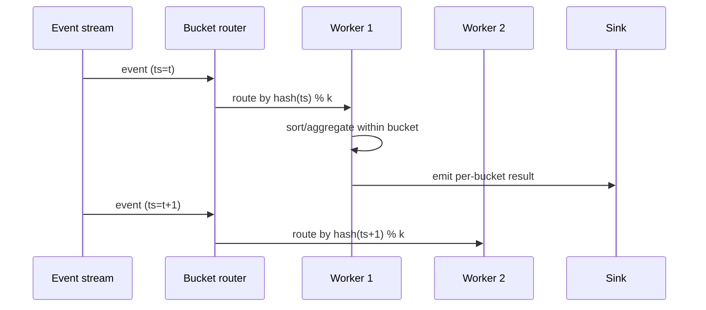

# Bucket Sort — Senior Level

## Table of Contents

1. [Introduction](#introduction)
2. [System Design with Bucket Sort](#system-design-with-bucket-sort)
3. [Distributed Bucket Sort — TeraSort and Friends](#distributed-bucket-sort)
4. [External-Memory Bucket Sort](#external-memory-bucket-sort)
5. [Parallel and GPU Bucket Sort](#parallel-and-gpu-bucket-sort)
6. [Architecture Patterns](#architecture-patterns)
7. [Code Examples](#code-examples)
8. [Observability](#observability)
9. [Failure Modes](#failure-modes)
10. [Production Trade-offs](#production-trade-offs)
11. [Summary](#summary)

---

## Introduction

> Focus: "How do I architect distributed and parallel sorting around Bucket Sort?"

At the senior level, Bucket Sort isn't a sorting algorithm — it's an **architectural primitive** for partitioning data across machines, threads, or memory tiers. The scatter–sort–gather pattern is the backbone of:

- **TeraSort** and the Sort Benchmark — distributed Bucket Sort across a Hadoop cluster.
- **Apache Spark** `repartitionAndSortWithinPartitions` — sample-based range partitioning + per-partition TimSort.
- **MapReduce shuffle phase** — mapper output is bucketed by reducer index.
- **GPU sample sort** — bucket sort on thousands of CUDA cores in parallel.
- **Distributed databases** — pre-partitioning for `ORDER BY ... DISTRIBUTED BY`.
- **External sort run generation** — chunks are produced by bucketing on a range mapping.
- **CDN caching** — request streams partitioned by URL hash into per-bucket sort/dedupe pipelines.

The senior engineer's job is to **place the scatter step in the right place** — on each ingest node, between map and reduce, on the network boundary, or on the GPU — so that the expensive inner sort and the cheap gather concatenation align with the system's bottleneck.

---

## System Design with Bucket Sort



Three architectural decisions dominate:
1. **Where does the scatter happen?** Ingest node, mapper, GPU kernel, network router.
2. **How are bucket boundaries chosen?** Static (mathematically derived) or dynamic (sample-based, refreshed periodically).
3. **What guarantees does the inner sort need?** Stability, predictable latency, in-place — each picks a different inner algorithm.

---

## Distributed Bucket Sort

### TeraSort — The Reference Distributed Sort

TeraSort, the benchmark champion of the Sort Benchmark (https://sortbenchmark.org/), is a three-stage distributed Bucket Sort:

**Stage 1 — Sample:**
- A small driver reads a random sample (typically 100 000 rows from a 1 TB input).
- Sample is sorted in memory.
- `R - 1` boundaries are picked at evenly spaced quantiles, where `R` is the number of reducers.

**Stage 2 — Map / Scatter:**
- Each mapper reads its split, binary-searches each row in the boundary table, and emits `(bucket_index, row)`.
- Mapper output is sorted per bucket locally.
- Bucket files are written to local disk, one per reducer.

**Stage 3 — Reduce / Sort + Gather:**
- Each reducer pulls its assigned bucket from every mapper.
- Reducer performs a `k`-way merge (since each mapper's bucket is already sorted).
- Reducer writes its merged output as part `R_i` of the final sorted file.

**Final output:** `R` files, `R_0` < `R_1` < ... < `R_{R-1}` in sort order. Concatenating them gives a globally sorted result.

**Why this beats global sort:** every comparison stays within a bucket — no cross-machine comparisons are needed after Stage 1. Network I/O is `O(n / m)` per mapper (each row sent to exactly one reducer), and reducer-side merge is `O(n_i log m)` where `n_i` is the reducer's local count and `m` is the mapper count.

### Spark `repartitionAndSortWithinPartitions`

Spark's primitive for distributed sort. It's TeraSort with cleaner ergonomics:

```python
# Spark pseudocode
sorted_rdd = (
    raw_rdd
        .repartitionAndSortWithinPartitions(
            numPartitions=k,
            partitionFunc=lambda key: bisect_left(boundaries, key),
        )
)
```

- `partitionFunc` is the bucket mapping function.
- `repartitionAndSortWithinPartitions` triggers a single shuffle that scatters and sorts in one step (the shuffle writer sorts each partition before writing).
- The `boundaries` come from a prior `RangePartitioner` that samples the input.

### Skew Handling in Distributed Sort

The hardest production problem: **one bucket gets 80% of input**. Mitigations, in order of common use:

| Strategy | When to use | Cost |
|----------|-------------|------|
| **Salting** — split hot keys across N synthetic sub-keys | Known hotspots | Requires second pass to merge sub-keys |
| **Sample-based boundaries** | Unknown but well-distributed skew | One pre-pass over a sample |
| **Two-stage partition** — coarse first, then fine within fat buckets | Long-tail skew | Doubles the shuffle cost for hot buckets |
| **Range repartition based on histogram** | Continuous keys | Requires accurate histogram |
| **Speculative execution** for slow reducers | Some buckets are unavoidably larger | Adds compute overhead |

Most modern systems (Spark, Flink, BigQuery) implement sample-based range partitioning by default and provide salting as a user-facing tuning knob.

---

## External-Memory Bucket Sort

When data > RAM but fits on local disk, external Bucket Sort is the natural choice:

1. **Scatter pass:** stream input from disk; for each row, write to the bucket file determined by the mapping function. `k` open output files.
2. **Sort pass:** for each bucket file, read it into RAM, sort with TimSort, write back. Bucket files must be sized to fit in RAM.
3. **Gather pass:** concatenate bucket files in order. No merge required.

**I/O complexity:** `O(N / B)` reads + `O(N / B)` writes, where `B` is block size — but with a constant 3 (one scatter read/write, one sort read/write, one gather read). Beats external Merge Sort's `2 log_k(N/M)` pass count when the mapping function is good.

**File handle pressure:** `k` open files during scatter. On Linux defaults, `ulimit -n` is 1024 — design `k ≤ 512` to leave headroom. Two-stage bucketing helps: 32 coarse buckets in pass 1, 32 fine buckets in pass 2 → 32² = 1024 effective buckets with only 32 open files at a time.

### When External Bucket Sort Beats External Merge Sort

| Condition | Winner | Why |
|-----------|--------|-----|
| Uniform distribution known | Bucket Sort | One scatter pass, no merge |
| Distribution unknown, can sample | Bucket Sort with sampled boundaries | Same I/O, robust |
| Distribution unknown, skewed | Merge Sort | Bucket would have unbalanced buckets |
| Inputs already pre-sorted in runs | Merge Sort | Skips run-generation phase |
| Output must be globally sorted on disk | Either; Bucket Sort wins on I/O | Concatenation > merge |

---

## Parallel and GPU Bucket Sort

### Multi-Core CPU Sort

```text
Phase 1 (sequential): scatter into k buckets.
Phase 2 (parallel):   each of p threads sorts k/p buckets.
Phase 3 (sequential): gather.
```

If `k = p`, each thread owns one bucket — perfect load balancing assuming uniform input. If `k >> p`, the runtime can use work-stealing (Java `ForkJoinPool`, Go goroutines) to balance dynamically.

**Speedup:** `p` for uniform input; degraded by the largest bucket's size for skewed input (Amdahl's law).

### GPU Sample Sort

GPU sorts (Thrust, CUB) use sample sort, a variant of Bucket Sort:

1. **Sample selection:** pick `k = O(p)` pivots from a small random sample.
2. **Splitter computation:** sort the sample on the host; pick `k - 1` splitters.
3. **Bucket assignment:** each warp computes, in parallel, the bucket index for its input chunk using a balanced binary search tree of splitters.
4. **Scatter:** prefix-sum across all warps to compute output positions; each warp writes its rows in coalesced order.
5. **Inner sort:** each bucket is sorted by a small warp-cooperative bitonic sort.
6. **Gather:** trivial; buckets are already laid out contiguously in memory.

GPU sample sort achieves > 500 M keys/sec on modern GPUs — about 10× faster than CPU TimSort for the same input. The key insight: the GPU's many cores make the scatter-and-sort phase massively parallel; the gather phase, which is sequential, becomes the bottleneck.

### Warp-Cooperative Inner Sort

Inside each bucket on the GPU, the inner sort runs across one warp (32 threads):
- Use bitonic sort or odd-even merge sort — both parallel-friendly and predictable in latency.
- Each warp handles a bucket of 1024-4096 elements held in shared memory.
- No global synchronization needed within a warp.

---

## Architecture Patterns

### Pattern: Range Partition + Per-Partition Sort



The canonical distributed pattern. Used by Spark, Flink, BigQuery, Snowflake.

### Pattern: Two-Pass Bucket Sort

When `k` is too large to materialize in memory:
1. First pass uses coarse buckets `k_1`.
2. Each coarse bucket is sorted by a second pass using `k_2` fine buckets.
3. Total buckets = `k_1 × k_2`; memory pressure = `max(k_1, k_2)`.

Used in disk-based databases and in radix sort on bytes (`k_1 = 256, k_2 = 256` per byte).

### Pattern: Histogram-Then-Scatter

Two-pass scatter avoids the dynamic-array overhead:
1. First pass: count occurrences per bucket → exact bucket sizes.
2. Compute offsets via prefix sum.
3. Second pass: write each element directly into its target slot in a pre-allocated output.

This is the basis of Radix Sort's MSD (most-significant-digit) variant and is the standard GPU implementation. Memory traffic is twice that of one-pass scatter, but eliminates dynamic allocation — a win on GPUs and HPC code.

### Pattern: Stream Bucketing for Real-Time Analytics



Used in time-series databases (InfluxDB, TimescaleDB) and stream processors (Flink, Kafka Streams). Each bucket is a "shard" that owns a key range; the system's scaling story is: add more buckets, redistribute boundaries on resize.

---

## Code Examples

### Sample-Sort Coordinator (Distributed-Sort Outline)

#### Go

```go
package main

import (
    "math/rand"
    "sort"
    "sync"
)

// SampleSort: distributed bucket sort with sample-based boundaries.
// Runs each bucket-sort in a separate goroutine to model worker parallelism.
func SampleSort(input []int, numWorkers int) []int {
    n := len(input)
    if n <= 1 {
        return input
    }

    // Step 1: sample.
    sampleSize := 32 * numWorkers
    sample := make([]int, sampleSize)
    for i := range sample {
        sample[i] = input[rand.Intn(n)]
    }
    sort.Ints(sample)

    // Step 2: boundaries.
    boundaries := make([]int, numWorkers-1)
    for i := 1; i < numWorkers; i++ {
        boundaries[i-1] = sample[i*len(sample)/numWorkers]
    }

    // Step 3: scatter (single-threaded; production would parallelize per shard).
    buckets := make([][]int, numWorkers)
    for _, x := range input {
        idx := sort.SearchInts(boundaries, x)
        buckets[idx] = append(buckets[idx], x)
    }

    // Step 4: parallel inner sort.
    var wg sync.WaitGroup
    for i := range buckets {
        wg.Add(1)
        go func(i int) {
            defer wg.Done()
            sort.Ints(buckets[i])
        }(i)
    }
    wg.Wait()

    // Step 5: gather.
    out := make([]int, 0, n)
    for _, b := range buckets {
        out = append(out, b...)
    }
    return out
}
```

#### Java

```java
import java.util.*;
import java.util.concurrent.*;

public class SampleSort {
    public static int[] sort(int[] input, int numWorkers) throws Exception {
        int n = input.length;
        if (n <= 1) return input;

        Random rng = new Random(42);
        int[] sample = new int[32 * numWorkers];
        for (int i = 0; i < sample.length; i++) sample[i] = input[rng.nextInt(n)];
        Arrays.sort(sample);

        int[] boundaries = new int[numWorkers - 1];
        for (int i = 1; i < numWorkers; i++) {
            boundaries[i - 1] = sample[i * sample.length / numWorkers];
        }

        List<List<Integer>> buckets = new ArrayList<>(numWorkers);
        for (int i = 0; i < numWorkers; i++) buckets.add(new ArrayList<>());
        for (int x : input) {
            int idx = Arrays.binarySearch(boundaries, x);
            if (idx < 0) idx = -idx - 1;
            buckets.get(idx).add(x);
        }

        ExecutorService pool = Executors.newFixedThreadPool(numWorkers);
        List<Future<?>> futures = new ArrayList<>();
        for (List<Integer> b : buckets) {
            futures.add(pool.submit(() -> Collections.sort(b)));
        }
        for (Future<?> f : futures) f.get();
        pool.shutdown();

        int[] out = new int[n];
        int pos = 0;
        for (List<Integer> b : buckets) for (int v : b) out[pos++] = v;
        return out;
    }
}
```

#### Python

```python
import bisect, random
from concurrent.futures import ThreadPoolExecutor

def sample_sort(arr, num_workers):
    n = len(arr)
    if n <= 1:
        return arr

    sample = sorted(random.choice(arr) for _ in range(32 * num_workers))
    boundaries = [sample[i * len(sample) // num_workers] for i in range(1, num_workers)]

    buckets = [[] for _ in range(num_workers)]
    for x in arr:
        idx = bisect.bisect_left(boundaries, x)
        buckets[idx].append(x)

    with ThreadPoolExecutor(max_workers=num_workers) as pool:
        for b in buckets:
            pool.submit(b.sort)

    out = []
    for b in buckets:
        out.extend(b)
    return out
```

### Thread-Safe Bucket Router for Real-Time Use

#### Go

```go
import "sync"

type BucketRouter struct {
    mu      sync.RWMutex
    buckets [][]int
    bounds  []int
}

func (r *BucketRouter) Route(x int) {
    r.mu.RLock()
    defer r.mu.RUnlock()
    idx := sort.SearchInts(r.bounds, x)
    r.buckets[idx] = append(r.buckets[idx], x)
}

func (r *BucketRouter) Reshape(newBounds []int) {
    r.mu.Lock()
    defer r.mu.Unlock()
    r.bounds = newBounds
    // rebucket existing data...
}
```

The RWMutex lets many writers route in parallel; reshaping (re-sampling boundaries) takes the write lock briefly.

---

## Observability

When operating systems that perform Bucket Sort at scale, monitor:

| Metric | Threshold | Meaning |
|--------|-----------|---------|
| `bucket_max_size / bucket_avg_size` | > 5× | Severe skew; reshape boundaries |
| `scatter_throughput_rps` | < target | Mapping function is too slow |
| `inner_sort_p99_ms` | Track baseline | Fat bucket or memory pressure |
| `bucket_count_active` | Match `k` plan | Mapping function bug if many buckets are empty |
| `shuffle_bytes_per_reducer_stddev` | Track variance | Skew warning for distributed sort |
| `straggler_workers` | > 1 | Skew causing one worker to lag the others |
| `sample_freshness_seconds` | > 600 for live workloads | Boundaries are stale; redistribute |

### Distributed Tracing Spans

```python
span.set_tag("sort.bucket_count", k)
span.set_tag("sort.max_bucket_size", max(len(b) for b in buckets))
span.set_tag("sort.skew_ratio", max_bucket / (n / k))
span.set_tag("sort.spilled_to_disk", spill_bytes > 0)
```

A skew_ratio > 5 means one bucket is more than 5× the expected size; alert and re-sample boundaries.

### Skew-Detection Sketch

Maintain a Count-Min Sketch of bucket sizes online; when one bucket dominates, trigger an automatic rebalance. Used in Flink's adaptive shuffle and Kafka's tiered storage.

---

## Failure Modes

| Mode | Symptom | Mitigation |
|------|---------|------------|
| **Fat-bucket / data skew** | One reducer OOMs; others idle | Sample-based boundaries; salting; speculative execution |
| **Hash collision storm** | Many keys hash to same bucket | Use better hash (xxHash, Murmur3); reseed |
| **File handle exhaustion** | `EMFILE` during external scatter | Two-pass bucketing; tune `ulimit` |
| **Stale boundaries in long-running stream** | New buckets always fat | Periodic re-sample; warm-up phase on restart |
| **Network bandwidth saturation** | Slow shuffle; mappers blocked | Compress shuffle data; tune mapper-side combiner |
| **Disk fills during external sort** | `ENOSPC` errors | Set per-job disk quota; reject queries exceeding budget |
| **Inner sort non-deterministic** | Different output across runs | Use stable inner sort; document and audit comparator |
| **Cardinality explosion** | Memory blows up when `k` is huge | Bound `k` to `min(target, hardware_limit)` |
| **Boundary drift** | Late-arriving data falls outside known range | Use a sentinel bucket for outliers; periodically re-sample |

---

## Production Trade-offs

### Bucket Sort vs. Sort-Merge in Distributed Engines

| Scenario | Choose | Why |
|----------|--------|-----|
| Global sort over uniform / sample-able data | Distributed Bucket Sort (Sample Sort, TeraSort) | One shuffle, scales linearly |
| Inputs already sorted in runs | Distributed Merge Sort | Free upstream sort; skip scatter |
| Unknown distribution, no sampling budget | Distributed Merge Sort | Bucket Sort might skew |
| Heavy skew, well-known hotspots | Bucket Sort with salting | Spreads load by design |
| Low latency required | Pre-bucketed by ingest pipeline | Sort is "free" at read time |

### Memory vs. Network Trade-offs

- More buckets (`k` larger) → less memory per bucket but more network round-trips and more open files.
- Fewer buckets (`k` smaller) → bigger per-bucket sort, less network overhead, but worse parallelism.
- The sweet spot is usually `k = p × 2` to `p × 4`, where `p` is the worker count — enough for work-stealing without exhausting file handles.

### Stability vs. Throughput

- Production GPU sample sorts (Thrust, CUB) are **not stable** — they prioritize raw throughput.
- Production CPU sample sorts (Intel's IPP, GNU `parallel::sort`) are typically stable.
- If stability matters end-to-end (e.g., a user-visible "sort by date, then by name" feature), pick a stable distributed implementation; check the docs.

### Latency-Sensitive vs. Batch

| Workload | Choose |
|----------|--------|
| Latency-sensitive API (sort 1k items) | In-memory adaptive bucket sort |
| Real-time stream (sort time windows) | Stream bucketing + windowed sort |
| Daily batch ETL (sort billions) | Distributed sample sort |
| Multi-table sort-merge join | Pre-bucket both tables on join key |

---

## Summary

At the senior level, Bucket Sort is the **partitioning primitive** that powers TeraSort, Spark's range partitioner, GPU sample sort, and external sort. The senior engineer's value-add is in placing the scatter step in the right tier of the stack and protecting it against the only failure that matters in distribution sorts: **skew**. Five tools, in order of frequency of use, are: sample-based boundaries, salting hot keys, two-stage partitioning, work-stealing across buckets, and speculative execution for stragglers.

The pattern recurs across the stack:

1. **In-memory:** parallel bucket sort with work-stealing across `p` threads.
2. **External:** scatter pass + per-bucket TimSort + concatenation; beats Merge Sort when the distribution is known.
3. **Distributed:** sample → boundaries → shuffle → per-partition sort; the algorithm behind every modern batch sort engine.
4. **GPU:** sample sort with bitonic inner sort, > 500 M keys/sec.
5. **Real-time:** bucket routers with online skew detection and periodic rebalance.

The design discipline is the same in all five: pick the mapping function so buckets stay balanced; make the inner sort fast; make the gather cheap; instrument the skew ratio.
