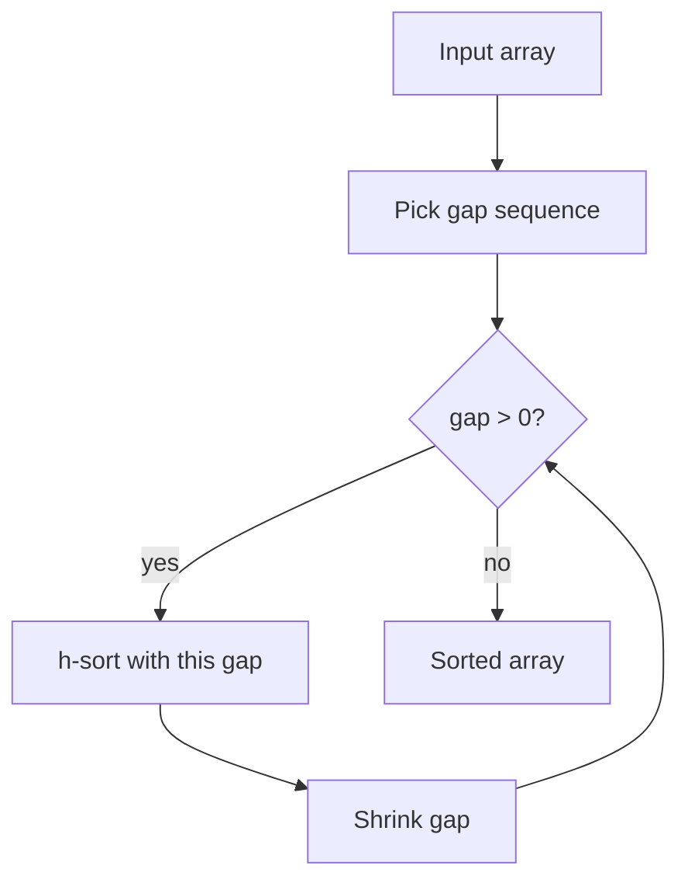

# Shell Sort — Junior Level

## Table of Contents

1. [Introduction](#introduction)
2. [Prerequisites](#prerequisites)
3. [Glossary](#glossary)
4. [Core Concepts](#core-concepts)
5. [Big-O Summary](#big-o-summary)
6. [Gap Sequences at a Glance](#gap-sequences-at-a-glance)
7. [Real-World Analogies](#real-world-analogies)
8. [Pros & Cons](#pros--cons)
9. [Step-by-Step Walkthrough](#step-by-step-walkthrough)
10. [Code Examples](#code-examples)
11. [Coding Patterns](#coding-patterns)
12. [Error Handling](#error-handling)
13. [Performance Tips](#performance-tips)
14. [Best Practices](#best-practices)
15. [Edge Cases & Pitfalls](#edge-cases--pitfalls)
16. [Common Mistakes](#common-mistakes)
17. [Cheat Sheet](#cheat-sheet)
18. [Visual Animation](#visual-animation)
19. [Summary](#summary)
20. [Further Reading](#further-reading)

---

## Introduction

> Focus: "What is Shell Sort?" and "Why does adding a gap make insertion sort faster?"

**Shell Sort** is a generalization of **Insertion Sort** invented by **Donald L. Shell** in 1959. Its single idea is small but powerful: instead of comparing only adjacent elements (like plain insertion sort does), Shell Sort first sorts elements that are far apart, then progressively shrinks the distance until it reaches 1 — at which point it ends with a normal insertion sort over a now **nearly-sorted** array.

That distance is called the **gap** `g`. For each gap, Shell Sort performs an insertion sort on every `g`-spaced subsequence:

```text
gap = 4, array = [9, 8, 7, 6, 5, 4, 3, 2, 1, 0]
Subsequence at offset 0: indices 0,4,8 -> [9, 5, 1]
Subsequence at offset 1: indices 1,5,9 -> [8, 4, 0]
Subsequence at offset 2: indices 2,6   -> [7, 3]
Subsequence at offset 3: indices 3,7   -> [6, 2]
```

Each subsequence is sorted independently with insertion sort. Then the gap shrinks (say `g = 2`, then `g = 1`) and the process repeats.

Why does this help? Plain insertion sort moves out-of-place elements **one position at a time**. If the array is `[9, 8, ..., 0]` (reverse-sorted, n = 10), the single element `0` has to travel 9 positions, doing 9 swaps. Shell Sort with gap 4 moves it 4 positions per swap — only ~3 moves to get close to its final home. The final `g = 1` pass then finishes in nearly O(n) because the array is almost sorted.

Shell Sort was historically important — it was one of the first sub-quadratic algorithms to break the O(n²) barrier on practical inputs — and remains useful in **embedded systems**, **kernel/firmware code**, and **interrupt handlers** where you need an **in-place**, **non-recursive**, **modest-code-size** sort that still outperforms insertion/selection/bubble on medium inputs.

> If you have not yet read [`03-insertion-sort/junior.md`](../03-insertion-sort/junior.md), read it first — Shell Sort is literally insertion sort with a gap, so we will not re-derive insertion-sort internals here.

---

## Prerequisites

- **Required:** Insertion sort (see [`03-insertion-sort/`](../03-insertion-sort/junior.md)) — shift-and-insert pattern, stability, adaptiveness.
- **Required:** Arrays, indexing, loops.
- **Required:** Understanding of "in-place" and O(1) extra space.
- **Helpful:** Familiarity with [merge sort](../02-merge-sort/junior.md) and [quick sort](../04-quick-sort/junior.md) — for comparison.
- **Helpful:** Basic logarithm intuition (because Shell Sort sequences shrink geometrically).

---

## Glossary

| Term | Definition |
|------|-----------|
| **Gap** (`g`) | Distance between elements compared in one pass |
| **Gap sequence** | Decreasing sequence of gaps used over multiple passes, ending at 1 |
| **`h`-sorted** | Array is sorted along every subsequence of stride `h` (e.g., `arr[i] <= arr[i + h]` for all valid `i`) |
| **Pass** | One full iteration over the array using a single gap |
| **Subsequence** | The slice of elements at indices `offset, offset + g, offset + 2g, ...` |
| **Shell sequence** | Shell's original `n/2, n/4, ..., 1` — simple but O(n²) worst case |
| **Hibbard sequence** | `2^k - 1`: `1, 3, 7, 15, 31, ...` — O(n^(3/2)) |
| **Sedgewick sequence** | `9·4^k - 9·2^k + 1` and similar — O(n^(4/3)) |
| **Pratt sequence** | `2^a · 3^b` (e.g., `1, 2, 3, 4, 6, 8, 9, 12, ...`) — O(n log² n), provably tight |
| **Knuth sequence** | `(3^k - 1) / 2`: `1, 4, 13, 40, 121, ...` — simple, decent |
| **Ciura sequence** | Empirically tuned: `1, 4, 10, 23, 57, 132, 301, 701, ...` — practical speed champion |
| **Diminishing increment sort** | Shell's original name — captures the "shrinking gap" idea |
| **Stable** | A sort is stable when equal elements keep their original relative order — Shell Sort is **not** stable |

---

## Core Concepts

### Concept 1: Shell Sort = "Insertion Sort with a Gap, Repeated"

For each gap `g` in the chosen sequence:

```text
for i from g to n-1:
    x = arr[i]
    j = i
    while j >= g and arr[j - g] > x:
        arr[j] = arr[j - g]
        j -= g
    arr[j] = x
```

This is exactly the insertion-sort inner loop with `1` replaced by `g`. When `g = 1`, it **is** insertion sort.

The trick is the **outer** loop over gaps:

```text
for each g in gap_sequence (descending, ending in 1):
    h-sort(arr, g)
```

After `g = 1`, the array is fully sorted because plain insertion sort is the last pass.

### Concept 2: Why Large Gaps First?

A large gap moves elements **long distances cheaply**. Each comparison-and-shift at gap `g` is one operation but moves an element `g` slots toward its destination. On reverse-sorted input, this gives an order-of-magnitude reduction in total moves compared to plain insertion sort.

After the first few large-gap passes the array is **`h`-sorted for several `h` values simultaneously**, which empirically produces a near-sorted state by the time the final `g = 1` pass starts.

### Concept 3: Why Finish at g = 1?

Only `g = 1` guarantees the array is **fully sorted**. Any `h`-sorted array for `h > 1` may still have local disorder (e.g., `[1, 3, 2, 4]` is 2-sorted but not 1-sorted). The final pass cleans up, and because the array is almost sorted by then, it runs in **nearly O(n)**.

### Concept 4: The Algorithm's Complexity Depends Almost Entirely on the Gap Sequence

This is the unique feature of Shell Sort:

- **Shell's original `n/2, n/4, ..., 1`** → worst case **O(n²)** (poor: gaps share many factors).
- **Hibbard `2^k - 1`** → worst case **O(n^(3/2))**.
- **Sedgewick** → worst case **O(n^(4/3))**.
- **Pratt `2^a · 3^b`** → worst case **O(n log² n)** — best known proven bound.
- **Ciura's empirical sequence** → no proven bound, but **fastest in practice** on small/medium inputs.

We will look at this table again in the [Gap Sequences](#gap-sequences-at-a-glance) section.

### Concept 5: Shell Sort Is NOT Stable

Two equal elements that start far apart can end up in swapped relative order, because the gap passes move them on independent subsequence trajectories. Use Shell Sort only when stability does not matter.

### Concept 6: In-Place, No Recursion

Shell Sort uses **O(1) extra space** (a single temporary `x` and a few indices) and **no recursion**. That makes it valuable in:
- Embedded firmware (small stacks, no malloc).
- Interrupt handlers (cannot afford recursion or allocation).
- Kernel code paths that need bounded stack use.

---

## Big-O Summary

| Operation / Case | Complexity | Notes |
|-----------------|-----------|-------|
| Time — Best | **O(n log n)** | Already-sorted input, good gap sequence |
| Time — Average | **O(n^(4/3)) — O(n^(3/2))** | Depends on gap sequence |
| Time — Worst (Shell sequence) | **O(n²)** | Avoid this gap sequence |
| Time — Worst (Hibbard) | **O(n^(3/2))** | Acceptable |
| Time — Worst (Sedgewick) | **O(n^(4/3))** | Good |
| Time — Worst (Pratt) | **O(n log² n)** | Best provable |
| Space | **O(1)** | In-place |
| Stable | **No** | Equal elements may reorder |
| Adaptive | **Yes** | Faster on nearly-sorted input (final pass is cheap) |
| In-place | **Yes** | No auxiliary buffer |
| Recursive | **No** | Iterative |

---

## Gap Sequences at a Glance

| Sequence | First terms | Worst-case time | Stable? | Notes |
|----------|-------------|----------------|---------|-------|
| **Shell (original)** | n/2, n/4, ..., 1 | O(n²) | No | Simple but slow worst case |
| **Knuth** | 1, 4, 13, 40, 121, 364 | unproven; ~O(n^(3/2)) in practice | No | `(3^k - 1)/2` — simple formula, commonly used |
| **Hibbard** | 1, 3, 7, 15, 31, 63 | O(n^(3/2)) | No | `2^k - 1` |
| **Sedgewick (1986)** | 1, 5, 19, 41, 109, 209 | O(n^(4/3)) | No | Mixed `9·4^k - 9·2^k + 1` and `4^k - 3·2^k + 1` |
| **Pratt (1971)** | 1, 2, 3, 4, 6, 8, 9, 12, 16, 18 | **O(n log² n)** | No | All products `2^a · 3^b` — best proven bound but many passes |
| **Ciura (empirical)** | 1, 4, 10, 23, 57, 132, 301, 701, 1750 | unproven | No | Fastest in practice on n ≤ a few million |

Choose Ciura for production speed, Pratt for provable bounds, Knuth for simplicity.

---

## Real-World Analogies

| Concept | Analogy |
|---------|--------|
| **Sorting by gap** | A messy bookshelf: first sort every 8th book, then every 4th, then every 2nd, then adjacent — small adjustments at the end |
| **Final g=1 pass** | After major moves, you only need to nudge neighbors |
| **Diminishing increments** | Tuning a piano — coarse adjustments first, then fine-tuning |
| **Multiple subsequences** | Multiple teams sort their assigned shelves in parallel, then a final teamwide pass smooths it out |

> Where these analogies break: real Shell Sort processes subsequences **sequentially**, not in parallel; the "parallel" feel is conceptual.

---

## Pros & Cons

| Pros | Cons |
|------|------|
| **In-place** — O(1) extra space | **Not stable** — equal elements may swap order |
| **No recursion** — fixed, small stack | Complexity depends on gap sequence choice |
| **Adaptive** — fast on nearly-sorted | Slower than Quick Sort / Merge Sort on large random inputs |
| Simple code; small binary footprint | No tight general lower bound — analysis is hard |
| Better than Insertion / Bubble / Selection for medium `n` | Worst case can be O(n²) if you pick a bad sequence |
| Good cache behavior at small gaps | Modern systems mostly prefer Quick/Merge/Tim |

**When to use:**
- **Embedded / firmware / kernel code** where you cannot afford the memory or stack depth of Merge Sort or Quick Sort.
- **Medium-sized arrays** (a few hundred to a few thousand elements) where simplicity and predictable in-place behavior matter more than peak speed.
- **Educational / historical contexts** to understand how gap sequences improve insertion sort.
- **Code-size-constrained** environments (microcontrollers) — Shell Sort fits in very few lines.

**When NOT to use:**
- You need **stability** (sorting by multiple keys, preserving order of equals).
- **Very large** inputs (n > 10^6) where O(n log n) sorts dominate.
- Production server code where a language runtime sort is available.

---

## Step-by-Step Walkthrough

Input: `arr = [9, 8, 7, 6, 5, 4, 3, 2, 1, 0]`, gap sequence `4, 2, 1` (Shell sequence for n = 10).

### Pass 1 — `g = 4`

Four `4`-spaced subsequences:

```text
indices 0,4,8 -> [9, 5, 1]   -> sort -> [1, 5, 9]
indices 1,5,9 -> [8, 4, 0]   -> sort -> [0, 4, 8]
indices 2,6   -> [7, 3]      -> sort -> [3, 7]
indices 3,7   -> [6, 2]      -> sort -> [2, 6]
```

Array after pass 1: `[1, 0, 3, 2, 5, 4, 7, 6, 9, 8]`. The array is now **4-sorted**.

### Pass 2 — `g = 2`

Two `2`-spaced subsequences:

```text
indices 0,2,4,6,8 -> [1, 3, 5, 7, 9] -> already sorted
indices 1,3,5,7,9 -> [0, 2, 4, 6, 8] -> already sorted
```

Array after pass 2: `[1, 0, 3, 2, 5, 4, 7, 6, 9, 8]`. Now **2-sorted** as well.

### Pass 3 — `g = 1`

Plain insertion sort on the near-sorted array. Each element is at most 1 position away — only ~5 swaps total.

Final: `[0, 1, 2, 3, 4, 5, 6, 7, 8, 9]`. ✓

**Total work:** roughly 12 inserts (vs. ~45 swaps for plain insertion sort on the same input). The big gap moved long-distance elements cheaply.

---

## Code Examples

### Example 1: Shell Sort with Shell's Original Gap Sequence

#### Go

```go
package main

import "fmt"

// ShellSort sorts arr in place using Shell's original gap sequence (n/2, n/4, ..., 1).
// Time: O(n^2) worst case with this sequence. Space: O(1).
func ShellSort(arr []int) {
    n := len(arr)
    for gap := n / 2; gap > 0; gap /= 2 {
        for i := gap; i < n; i++ {
            x := arr[i]
            j := i
            for j >= gap && arr[j-gap] > x {
                arr[j] = arr[j-gap]
                j -= gap
            }
            arr[j] = x
        }
    }
}

func main() {
    data := []int{9, 8, 7, 6, 5, 4, 3, 2, 1, 0}
    ShellSort(data)
    fmt.Println(data) // [0 1 2 3 4 5 6 7 8 9]
}
```

#### Java

```java
import java.util.Arrays;

public class ShellSort {
    public static void sort(int[] arr) {
        int n = arr.length;
        for (int gap = n / 2; gap > 0; gap /= 2) {
            for (int i = gap; i < n; i++) {
                int x = arr[i];
                int j = i;
                while (j >= gap && arr[j - gap] > x) {
                    arr[j] = arr[j - gap];
                    j -= gap;
                }
                arr[j] = x;
            }
        }
    }

    public static void main(String[] args) {
        int[] data = {9, 8, 7, 6, 5, 4, 3, 2, 1, 0};
        sort(data);
        System.out.println(Arrays.toString(data));
    }
}
```

#### Python

```python
def shell_sort(arr):
    """In-place Shell Sort using Shell's original gap sequence.
    Time: O(n^2) worst case with this sequence. Space: O(1).
    """
    n = len(arr)
    gap = n // 2
    while gap > 0:
        for i in range(gap, n):
            x = arr[i]
            j = i
            while j >= gap and arr[j - gap] > x:
                arr[j] = arr[j - gap]
                j -= gap
            arr[j] = x
        gap //= 2

if __name__ == "__main__":
    data = [9, 8, 7, 6, 5, 4, 3, 2, 1, 0]
    shell_sort(data)
    print(data)  # [0, 1, 2, 3, 4, 5, 6, 7, 8, 9]
```

**What it does:** Halves the gap each pass, performing a gapped insertion sort at every step. Mutates input.
**Run:** `go run main.go` | `javac ShellSort.java && java ShellSort` | `python shell_sort.py`

---

### Example 2: Shell Sort with Knuth's Gap Sequence

Knuth's sequence is `(3^k - 1) / 2`: `1, 4, 13, 40, 121, 364, ...`. Built by starting from 1 and applying `g = 3g + 1`. Faster than Shell's original on average.

#### Go

```go
package main

import "fmt"

func ShellSortKnuth(arr []int) {
    n := len(arr)
    // Largest gap that fits: g = 1, 4, 13, ... up to g < n
    gap := 1
    for gap < n/3 {
        gap = 3*gap + 1
    }
    for ; gap > 0; gap = (gap - 1) / 3 {
        for i := gap; i < n; i++ {
            x := arr[i]
            j := i
            for j >= gap && arr[j-gap] > x {
                arr[j] = arr[j-gap]
                j -= gap
            }
            arr[j] = x
        }
    }
}

func main() {
    data := []int{12, 34, 54, 2, 3, 1, 7, 19, 8}
    ShellSortKnuth(data)
    fmt.Println(data)
}
```

#### Java

```java
import java.util.Arrays;

public class ShellSortKnuth {
    public static void sort(int[] arr) {
        int n = arr.length;
        int gap = 1;
        while (gap < n / 3) gap = 3 * gap + 1;
        for (; gap > 0; gap = (gap - 1) / 3) {
            for (int i = gap; i < n; i++) {
                int x = arr[i];
                int j = i;
                while (j >= gap && arr[j - gap] > x) {
                    arr[j] = arr[j - gap];
                    j -= gap;
                }
                arr[j] = x;
            }
        }
    }

    public static void main(String[] args) {
        int[] data = {12, 34, 54, 2, 3, 1, 7, 19, 8};
        sort(data);
        System.out.println(Arrays.toString(data));
    }
}
```

#### Python

```python
def shell_sort_knuth(arr):
    """Shell Sort using Knuth's gap sequence (3^k - 1)/2."""
    n = len(arr)
    gap = 1
    while gap < n // 3:
        gap = 3 * gap + 1
    while gap > 0:
        for i in range(gap, n):
            x = arr[i]
            j = i
            while j >= gap and arr[j - gap] > x:
                arr[j] = arr[j - gap]
                j -= gap
            arr[j] = x
        gap = (gap - 1) // 3

if __name__ == "__main__":
    data = [12, 34, 54, 2, 3, 1, 7, 19, 8]
    shell_sort_knuth(data)
    print(data)
```

**What it does:** Computes the largest Knuth gap fitting in n, then walks the sequence down to 1. Empirically ~30% faster than Shell's original sequence.

---

### Example 3: Shell Sort with Ciura's Empirical Gap Sequence

Ciura discovered an empirical sequence through extensive benchmarking that beats every proven sequence on practical input sizes.

#### Go

```go
package main

import "fmt"

// CiuraGaps are the speed-champion empirical gaps.
// For larger n, extrapolate with g_{k+1} ≈ 2.25 * g_k.
var CiuraGaps = []int{701, 301, 132, 57, 23, 10, 4, 1}

func ShellSortCiura(arr []int) {
    n := len(arr)
    for _, gap := range CiuraGaps {
        if gap >= n {
            continue
        }
        for i := gap; i < n; i++ {
            x := arr[i]
            j := i
            for j >= gap && arr[j-gap] > x {
                arr[j] = arr[j-gap]
                j -= gap
            }
            arr[j] = x
        }
    }
}

func main() {
    data := []int{12, 34, 54, 2, 3, 1, 7, 19, 8, 25, 11, 4}
    ShellSortCiura(data)
    fmt.Println(data)
}
```

#### Java

```java
import java.util.Arrays;

public class ShellSortCiura {
    private static final int[] CIURA_GAPS = {701, 301, 132, 57, 23, 10, 4, 1};

    public static void sort(int[] arr) {
        int n = arr.length;
        for (int gap : CIURA_GAPS) {
            if (gap >= n) continue;
            for (int i = gap; i < n; i++) {
                int x = arr[i];
                int j = i;
                while (j >= gap && arr[j - gap] > x) {
                    arr[j] = arr[j - gap];
                    j -= gap;
                }
                arr[j] = x;
            }
        }
    }

    public static void main(String[] args) {
        int[] data = {12, 34, 54, 2, 3, 1, 7, 19, 8, 25, 11, 4};
        sort(data);
        System.out.println(Arrays.toString(data));
    }
}
```

#### Python

```python
CIURA_GAPS = [701, 301, 132, 57, 23, 10, 4, 1]

def shell_sort_ciura(arr):
    """Shell Sort with Ciura's empirical gap sequence — fastest in practice."""
    n = len(arr)
    for gap in CIURA_GAPS:
        if gap >= n:
            continue
        for i in range(gap, n):
            x = arr[i]
            j = i
            while j >= gap and arr[j - gap] > x:
                arr[j] = arr[j - gap]
                j -= gap
            arr[j] = x

if __name__ == "__main__":
    data = [12, 34, 54, 2, 3, 1, 7, 19, 8, 25, 11, 4]
    shell_sort_ciura(data)
    print(data)
```

**Why Ciura?** Across decades of benchmarks, Ciura's empirically chosen gaps consistently outperform Hibbard, Knuth, and Sedgewick on n ≤ ~10⁶. For n > 700 you typically extrapolate with `g_{k+1} ≈ floor(2.25 * g_k)`.

---

## Coding Patterns

### Pattern 1: Gapped Insertion Sort (the core kernel)

**Intent:** Insertion sort, but compare `arr[j]` against `arr[j - gap]` instead of `arr[j - 1]`.

```python
def gapped_insertion(arr, gap):
    for i in range(gap, len(arr)):
        x = arr[i]
        j = i
        while j >= gap and arr[j - gap] > x:
            arr[j] = arr[j - gap]
            j -= gap
        arr[j] = x
```

The whole Shell Sort is just this kernel wrapped in a loop over decreasing gaps.

### Pattern 2: Driver Loop over a Gap Sequence

```python
def shell_sort(arr, gaps):
    for g in gaps:
        if g >= len(arr):
            continue
        gapped_insertion(arr, g)
```

Now you can swap in any gap sequence by passing a different `gaps` list. Useful for testing different sequences in one codebase.

### Pattern 3: Build Gap Sequence on the Fly

For Knuth's sequence: start at 1, repeat `g = 3g + 1` while `g < n/3`. Then descend with `g = (g - 1) / 3`.



---

## Error Handling

| Error | Cause | Fix |
|-------|-------|-----|
| Infinite loop | Gap formula returns 0 too early or never reaches 1 | Always ensure the sequence terminates at exactly 1 |
| Index out of bounds | Forgetting `j >= gap` guard in inner while | Always include `j >= gap` first in the condition |
| Wrong order | Used `<` instead of `>` in inner test | Verify the comparison direction matches ascending sort |
| Lost stability silently | Expecting stable behavior from Shell Sort | Shell Sort is not stable — use Merge Sort or TimSort if stability matters |
| Slow on big n | Wrong tool | For n > 10^6 prefer Merge Sort / Quick Sort / TimSort |
| Integer overflow when computing gaps | Very large n with `gap = 3g + 1` | Cap gap at `INT_MAX / 3` or use 64-bit indices |

---

## Performance Tips

- **Use Ciura's sequence** for n ≤ 10^6 — fastest in practice.
- **Use Knuth's sequence** when you want a simple closed-form formula.
- **Skip gaps `>= n`** — they would have zero iterations and just waste branch checks.
- **Cache the value `x = arr[i]`** in a local variable before shifting, so the compiler can keep it in a register.
- **Loop in the inner direction (decreasing `j`)** matches CPU prefetchers fine for small gaps; large gaps will incur cache misses but they touch few elements.
- **For very small arrays** (n ≤ 16), plain insertion sort is faster — skip Shell Sort's outer loop entirely.

---

## Best Practices

- Always **end the gap sequence at exactly 1**. Otherwise the array may not be fully sorted.
- Pick **one gap sequence** and **document why** in a comment.
- Validate inputs: empty array, single element, all equal, sorted, reverse-sorted.
- Implement Shell Sort once **from scratch** before reaching for any library — the algorithm is short enough that you should be able to write it from memory.
- **Do not assume stability.** If you need stable sort, use Merge Sort or TimSort.
- For **embedded code**, hardcode the gap sequence as a `const` array — no division or multiplication in hot loops.

---

## Edge Cases & Pitfalls

- **Empty array (`[]`)** → outer loop body never runs. Safe.
- **Single element (`[42]`)** → gap quickly becomes 0; loop exits. Safe.
- **Two elements (`[2, 1]`)** → gap = 1; final pass swaps them. Safe.
- **All equal (`[5, 5, 5, 5]`)** → no shifts; total O(n) per pass.
- **Already sorted** → best case; each pass is O(n) — total O(n log n) for log-many gaps.
- **Reverse sorted** → Shell sequence is O(n²); Hibbard/Knuth/Ciura much better.
- **Duplicates** → sorted correctly but **relative order not preserved** (no stability).
- **Negative numbers** → no special handling needed.
- **NaN** (floats) → comparisons with NaN are false; NaNs may end up in undefined positions. Filter out before sorting.

---

## Common Mistakes

1. **Gap sequence ends above 1** → array is left only partially sorted (`h`-sorted for `h > 1`).
2. **Forgetting `j >= gap` guard** → IndexError / panic on small i.
3. **Using `>=` instead of `>`** in inner test → slower but does not break correctness (insertion sort kept stability via `>`, but Shell Sort is unstable either way).
4. **Choosing Shell's `n/2` sequence in production** → leaves O(n²) worst case behavior on the table.
5. **Assuming stability** — Shell Sort is not stable.
6. **Recomputing gap inside hot loop** with division each iteration — store in a variable.
7. **Using Shell Sort for n > 10^7** — Merge Sort and Quick Sort beat it asymptotically and in practice.

---

## Cheat Sheet

```text
Shell Sort — Quick Reference

ALGORITHM:
  for each gap g in DECREASING gap sequence (ending at 1):
      for i in [g, n):
          x = arr[i]
          j = i
          while j >= g and arr[j - g] > x:
              arr[j] = arr[j - g]
              j -= g
          arr[j] = x

GAP SEQUENCES:
  Shell:    n/2, n/4, ..., 1            -> O(n^2)
  Hibbard:  2^k - 1                     -> O(n^(3/2))
  Knuth:    (3^k - 1)/2 = 1,4,13,40...  -> ~O(n^(3/2)) practical
  Sedgewick: 1,5,19,41,109,209,...      -> O(n^(4/3))
  Pratt:    2^a * 3^b                   -> O(n log^2 n) proven
  Ciura:    1,4,10,23,57,132,301,701    -> fastest in practice

COMPLEXITY:
  Best:   O(n log n)
  Avg:    O(n^(4/3)) to O(n^(3/2))      (sequence-dependent)
  Worst:  O(n^2) (Shell), O(n log^2 n) (Pratt)
  Space:  O(1)
  Stable: NO
  Adaptive: YES
  Recursive: NO

WHEN TO USE:
  - Embedded / kernel / interrupt code
  - Medium n (a few hundred to a few thousand)
  - Need in-place, no recursion, predictable stack
  - Stability NOT required

NEVER USE FOR:
  - Stable sort needed
  - n > 10^6 (Merge/Quick/TimSort win)
```

---

## Visual Animation

> See [`animation.html`](./animation.html) for an interactive visual animation of Shell Sort.
>
> The animation demonstrates:
> - Color-coded subsequences for the current gap (each offset gets its own color).
> - Shifts within each subsequence using the insertion-sort kernel.
> - Gap shrinking (4 → 2 → 1, for example) with a banner showing the current gap.
> - Live counters: total comparisons, shifts, pass number.
> - Choice of gap sequence (Shell, Knuth, Ciura).
> - Custom input and randomize buttons.

---

## Summary

Shell Sort is **insertion sort generalized with a gap**, repeated for a sequence of shrinking gaps that ends at 1. Each pass uses the simple insertion-sort kernel with stride `g` instead of `1`. The final `g = 1` pass operates on a near-sorted array and runs in nearly O(n).

The algorithm is **in-place**, **non-recursive**, **adaptive**, but **not stable**. Its complexity depends almost entirely on the **gap sequence**: Shell's original O(n²), Hibbard's O(n^(3/2)), Sedgewick's O(n^(4/3)), Pratt's O(n log² n), and Ciura's empirically fastest practical sequence.

**Why care today?** Shell Sort still wins in **embedded firmware**, **kernel modules**, and **interrupt handlers** where you need an in-place, no-recursion, small-code sort that handles medium inputs better than insertion/bubble/selection. For mainstream code on large inputs, Quick Sort / Merge Sort / TimSort are faster.

Two essential takeaways:

1. **The gap sequence is the algorithm.** Pick Ciura for speed, Pratt for proofs, Knuth for simplicity.
2. **Always end the sequence at exactly 1.** That is what makes the final array fully sorted.

Move next to **[`11-tim-sort/`](../11-tim-sort/junior.md)** to see how modern hybrid sorts use insertion sort and merge sort together, or back to **[`03-insertion-sort/`](../03-insertion-sort/junior.md)** to revisit the kernel Shell Sort builds on.

---

## Further Reading

- **CLRS — Introduction to Algorithms (4th ed.)**, Problem 2-2 (Shell sort exercise) and references in Chapter 8.
- **Sedgewick & Wayne — Algorithms (4th ed.)**, Section 2.1 (shellsort, Knuth's gap sequence).
- **Knuth — TAOCP Vol. 3**, Section 5.2.1 (Sorting by insertion — Shell's method and analysis of `(3^k - 1)/2`).
- **D. L. Shell (1959)** — "A High-Speed Sorting Procedure", *Communications of the ACM* 2(7): 30-32.
- **V. R. Pratt (1971)** — "Shellsort and sorting networks" PhD thesis (Pratt sequence and O(n log² n) proof).
- **M. Ciura (2001)** — "Best Increments for the Average Case of Shellsort" — empirical sequence derivation.
- **R. Sedgewick (1986)** — "A new upper bound for shellsort" (Sedgewick sequence).
- [Wikipedia: Shellsort](https://en.wikipedia.org/wiki/Shellsort) — comparison of gap sequences.
- [visualgo.net/en/sorting](https://visualgo.net/en/sorting) — interactive Shell Sort animation.
