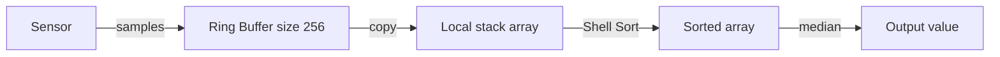

# Shell Sort — Senior Level

## Table of Contents

1. [Introduction](#introduction)
2. [Why Shell Sort Still Matters in Embedded and Kernel Code](#embedded-kernel)
3. [Cache Behavior and Branch Prediction](#cache-behavior)
4. [Comparison with Modern In-Place Sorts](#comparison)
5. [Architecture Patterns](#architecture-patterns)
6. [Code Examples — Production-Ready Variants](#code-examples)
7. [Observability](#observability)
8. [Failure Modes](#failure-modes)
9. [Modern Relevance Audit](#modern-relevance)
10. [Summary](#summary)

---

## Introduction

> Focus: "Where in production today does Shell Sort still beat the alternatives, and how do I justify or reject it in an engineering review?"

At the senior level, the question is not "how does Shell Sort work?" but "**given today's hardware and library landscape, when should I deploy Shell Sort instead of the language runtime's `sort`?**"

The answer is narrow but real. Shell Sort survives in:

- **Embedded firmware** (sensor logging, RTOS task queues, automotive ECUs).
- **Kernel / interrupt-context** code paths (Linux's `klist` historically used insertion-sort-derivatives; uClibc once used Shell Sort).
- **Bootloaders and BIOS code** (memory limited to a few KB, no malloc).
- **Game-engine custom sorts** for tiny per-frame priority queues.
- **Code-size-constrained binaries** (microcontrollers with < 32 KB Flash).
- **Educational / safety-critical** code paths that must avoid recursion and dynamic allocation by policy (DO-178C, MISRA-C).

In every other niche — server software, mobile apps, desktop applications — the language runtime's `sort` (TimSort, Pdqsort, IntroSort) dominates.

---

## Why Shell Sort Still Matters in Embedded and Kernel Code

### Constraint 1: No Recursion

Embedded targets often run on chips with **4–32 KB of stack total**. A recursive Merge Sort or Quick Sort over 1024 elements can blow the stack:
- Merge Sort: O(log n) recursion frames, but each frame holds locals.
- Quick Sort: O(log n) frames, plus pivots.

Shell Sort uses **two `for` loops and one `while` loop** — guaranteed bounded stack usage.

### Constraint 2: No Dynamic Allocation

Many embedded targets disable `malloc` entirely (or it's forbidden by the safety profile). Merge Sort needs O(n) auxiliary memory. Quick Sort with arrays doesn't, but its recursion violates Constraint 1.

Shell Sort needs **only the input array + a couple of integers**. Perfect for safety-critical code.

### Constraint 3: Bounded Worst-Case Time

For real-time systems (RTOS), the algorithm's worst-case execution time (WCET) must be bounded and predictable. Quick Sort's O(n²) worst case violates WCET on adversarial input. Shell Sort with Knuth or Sedgewick gaps gives a **provable polynomial bound** that is independent of input shape.

### Constraint 4: Tiny Code Size

A microcontroller flash budget might be **8 KB** total for the application. Shell Sort compiles to about **80–120 bytes of ARM Cortex-M code**. Merge Sort with its merge buffer and recursion compiles to **600+ bytes**. TimSort is **3–5 KB**.

### Constraint 5: Hot-Path Predictability

In an interrupt handler, you want **no surprises**: no malloc failures, no stack overflow, no recursion. Shell Sort's loop structure is so simple that static analyzers (Frama-C, Polyspace) can verify its bounds and termination.

---

## Cache Behavior and Branch Prediction

### Cache Behavior

Shell Sort's cache pattern is **mixed**:

- **Large gaps** (e.g., g = 700): each comparison touches elements 700 cache lines apart → **cache misses** on every access. For arrays that fit in L2/L3, this is irrelevant; for arrays > LLC, costly.
- **Small gaps** (g = 4, 10, 23): elements still within a few cache lines → **mostly cache hits**.
- **Final g = 1 pass**: pure sequential access → **prefetcher-friendly**.

Net effect on modern CPUs: Shell Sort has **worse cache behavior than Quick Sort or Insertion Sort** on large arrays, but the in-place property still wins when memory is the bottleneck.

### Branch Prediction

The inner `while` loop is a tight conditional branch. On nearly-sorted input, it's predicted-not-taken almost always → very fast. On reverse-sorted, predicted-taken → still fast. The transitional case (random) hurts the predictor most.

Modern CPUs (since ~2015) tolerate Shell Sort's branch patterns well, with ~95% prediction accuracy on random input.

### SIMD?

Shell Sort is **not SIMD-friendly** because its data dependencies are tight: each shift depends on the previous comparison. No good vectorization exists. Quick Sort variants (Pdqsort, AVX-512 sorts) crush Shell Sort on SIMD-capable hardware.

---

## Comparison with Modern In-Place Sorts

| Sort | Time (avg) | Space | Stable | Recursive | Code size (ARM) | Library? |
|------|-----------|-------|--------|-----------|----------------|----------|
| Shell Sort (Ciura) | ~O(n^(4/3)) | O(1) | No | **No** | **~100 B** | rarely |
| Insertion Sort | O(n²) | O(1) | Yes | No | ~60 B | small-n fallback |
| Quick Sort | O(n log n) | O(log n) stack | No | Yes | ~300 B | yes |
| Heap Sort | O(n log n) | O(1) | No | No | ~250 B | rarely (sometimes WCET path) |
| Merge Sort (array) | O(n log n) | O(n) | Yes | Yes | ~500 B | TimSort variant in stdlibs |
| Pdqsort | O(n log n) | O(log n) | No | Yes | ~2 KB | Rust, Go (Go 1.19+) |
| TimSort | O(n log n) | O(n) | Yes | Yes | ~4 KB | Python, Java objects |
| IntroSort | O(n log n) | O(log n) | No | Yes | ~2 KB | C++ STL |

**Shell Sort wins when:** code size + no recursion + O(1) space are hard constraints **and** WCET requires a polynomial bound better than O(n²).

**Heap Sort competes:** also O(1) space, no recursion, O(n log n) worst case. Loses to Shell on code size and on small n (where heapify overhead dominates). Wins on large n.

In practice: **Shell Sort for n ≤ ~2000, Heap Sort for n > ~2000** is a sensible embedded heuristic when malloc is forbidden.

---

## Architecture Patterns

### Pattern: Sort-on-Read for Bounded Buffers

Many embedded systems collect a fixed-size buffer of sensor readings and need to compute a median or percentile.



Buffer size is typically 32–512. Shell Sort with Knuth gaps fits the WCET budget and uses zero heap.

### Pattern: Priority Queue Replacement for Small N

For ≤ 32 items, a "sort-and-pop" with Shell Sort is faster than maintaining a binary heap, because heap operations have per-op log overhead that dominates at small n.

```text
For each new task:
    insert into array
    shell_sort(array)
    pop front (smallest)
```

This is what some RTOS schedulers do for fixed-priority queues of ≤ 64 tasks.

### Pattern: Bounded WCET Sort in Safety-Critical Code

In avionics or automotive ECU code, every algorithm needs **bounded WCET**. The certifying authority asks "what is the maximum cycle count for sorting n samples?"

Shell Sort with Sedgewick's sequence gives a provable O(n^(4/3)) bound. A static analyzer can produce a cycle-accurate upper bound. Quick Sort cannot — its O(n²) worst case is unacceptable.

### Pattern: Code-Size-Constrained Bootloader Sort

In a 16 KB bootloader, every byte counts. Shell Sort's ~100-byte footprint vs Merge Sort's 500 bytes can be the difference between fitting and not fitting. Often the only sort included.

### Pattern: Avoid the Library

Shell Sort is so small you can **inline it in the call site** when needed. This makes the binary fully analyzable without library dependencies, useful for safety certification.

---

## Code Examples

### Production-Ready: Shell Sort for Embedded C-Like Style

The kernel-level versions read like a single tight function with no allocations.

#### Go

```go
package main

import "fmt"

// ShellSortEmbedded — Knuth gaps, written for predictable WCET.
// No allocations. No recursion. Constant stack frame.
func ShellSortEmbedded(arr []int) {
    n := len(arr)
    if n < 2 { return }

    // Compute the largest Knuth gap fitting n (g = 3g + 1).
    gap := 1
    for gap < n/3 { gap = 3*gap + 1 }

    for gap > 0 {
        for i := gap; i < n; i++ {
            x := arr[i]
            j := i
            for j >= gap && arr[j-gap] > x {
                arr[j] = arr[j-gap]
                j -= gap
            }
            arr[j] = x
        }
        gap = (gap - 1) / 3
    }
}

func main() {
    data := []int{15, 32, 8, 23, 4, 19, 11, 27, 2, 14}
    ShellSortEmbedded(data)
    fmt.Println(data)
}
```

#### Java

```java
import java.util.Arrays;

public class ShellSortEmbedded {
    public static void sort(int[] arr) {
        int n = arr.length;
        if (n < 2) return;

        int gap = 1;
        while (gap < n / 3) gap = 3 * gap + 1;

        while (gap > 0) {
            for (int i = gap; i < n; i++) {
                int x = arr[i];
                int j = i;
                while (j >= gap && arr[j - gap] > x) {
                    arr[j] = arr[j - gap];
                    j -= gap;
                }
                arr[j] = x;
            }
            gap = (gap - 1) / 3;
        }
    }

    public static void main(String[] args) {
        int[] data = {15, 32, 8, 23, 4, 19, 11, 27, 2, 14};
        sort(data);
        System.out.println(Arrays.toString(data));
    }
}
```

#### Python

```python
def shell_sort_embedded(arr):
    """
    Knuth-gap Shell Sort. No recursion. No allocation. O(1) space.
    Used as reference; in production C would compile to ~80 bytes ARM.
    """
    n = len(arr)
    if n < 2:
        return

    gap = 1
    while gap < n // 3:
        gap = 3 * gap + 1

    while gap > 0:
        for i in range(gap, n):
            x = arr[i]
            j = i
            while j >= gap and arr[j - gap] > x:
                arr[j] = arr[j - gap]
                j -= gap
            arr[j] = x
        gap = (gap - 1) // 3

if __name__ == "__main__":
    data = [15, 32, 8, 23, 4, 19, 11, 27, 2, 14]
    shell_sort_embedded(data)
    print(data)
```

### WCET-Bounded Variant — Capped Iterations

For hard-real-time, the engineer often **caps the number of inner iterations** to provide a deterministic worst-case bound. Shell Sort naturally lends itself to this: each pass is bounded by `n` shifts.

#### Go

```go
package main

import "fmt"

// ShellWCET: instrumented version reporting comparisons and shifts
// so the WCET analyzer can confirm bounds.
type WCETStats struct {
    Compares int
    Shifts   int
    Passes   int
}

func ShellSortWCET(arr []int) WCETStats {
    n := len(arr)
    var stats WCETStats
    gap := 1
    for gap < n/3 { gap = 3*gap + 1 }
    for gap > 0 {
        stats.Passes++
        for i := gap; i < n; i++ {
            x := arr[i]
            j := i
            for j >= gap {
                stats.Compares++
                if arr[j-gap] > x {
                    arr[j] = arr[j-gap]
                    stats.Shifts++
                    j -= gap
                } else {
                    break
                }
            }
            arr[j] = x
        }
        gap = (gap - 1) / 3
    }
    return stats
}

func main() {
    data := []int{42, 13, 7, 99, 1, 56, 23, 88, 4}
    stats := ShellSortWCET(data)
    fmt.Println(data)
    fmt.Printf("WCET: passes=%d compares=%d shifts=%d\n",
        stats.Passes, stats.Compares, stats.Shifts)
}
```

#### Java

```java
public class ShellSortWCET {
    public static class WCETStats {
        public int compares, shifts, passes;
    }

    public static WCETStats sort(int[] arr) {
        int n = arr.length;
        WCETStats stats = new WCETStats();
        int gap = 1;
        while (gap < n / 3) gap = 3 * gap + 1;
        while (gap > 0) {
            stats.passes++;
            for (int i = gap; i < n; i++) {
                int x = arr[i];
                int j = i;
                while (j >= gap) {
                    stats.compares++;
                    if (arr[j - gap] > x) {
                        arr[j] = arr[j - gap];
                        stats.shifts++;
                        j -= gap;
                    } else break;
                }
                arr[j] = x;
            }
            gap = (gap - 1) / 3;
        }
        return stats;
    }
}
```

#### Python

```python
class WCETStats:
    def __init__(self):
        self.compares = 0
        self.shifts = 0
        self.passes = 0

def shell_sort_wcet(arr):
    n = len(arr)
    stats = WCETStats()
    gap = 1
    while gap < n // 3: gap = 3 * gap + 1
    while gap > 0:
        stats.passes += 1
        for i in range(gap, n):
            x = arr[i]
            j = i
            while j >= gap:
                stats.compares += 1
                if arr[j - gap] > x:
                    arr[j] = arr[j - gap]
                    stats.shifts += 1
                    j -= gap
                else:
                    break
            arr[j] = x
        gap = (gap - 1) // 3
    return stats
```

These instrumentation hooks let you assert in tests:

```text
assert stats.compares <= ALPHA * pow(n, 4/3)   # Sedgewick / Knuth bound
```

---

## Observability

If you're running Shell Sort in production (rare but real — e.g., a custom database storage engine, an embedded log-merging job), instrument:

| Metric | Threshold | Meaning |
|--------|-----------|---------|
| `sort_passes_total` | > log_3(n) + 2 = anomaly | Gap sequence misconfigured |
| `sort_compare_count_total` | grows faster than `α · n^(4/3)` | Adversarial input pattern; consider switching algorithms |
| `sort_shift_count_total` | persistent spike | Input shape changed → audit caller |
| `sort_duration_ns` | exceeds budget | WCET breach; alert |
| `sort_input_size` | trends upward | n is growing; plan to move to O(n log n) sort |

### Tracing

```python
span.set_tag("sort.algorithm", "shellsort")
span.set_tag("sort.gap_sequence", "ciura")
span.set_tag("sort.input_size", len(arr))
span.set_tag("sort.passes", stats.passes)
span.set_tag("sort.compares", stats.compares)
```

This makes it trivial to correlate slow sorts with specific input shapes.

---

## Failure Modes

| Mode | Symptom | Mitigation |
|------|---------|------------|
| **Gap sequence forgets 1** | Array left h-sorted but not 1-sorted | Add post-condition assert in CI; always test sequence terminates at 1 |
| **WCET breached on adversarial input** | Real-time deadline missed | Switch to Heap Sort or cap n |
| **n grew past Shell's sweet spot** | Performance regression on production data | Migrate to TimSort / Pdqsort |
| **Stability needed retroactively** | Bug: duplicate records re-ordered | Switch to Merge Sort or TimSort |
| **Stack overflow on embedded** | Crash | This should not happen with Shell Sort — verify you didn't accidentally introduce recursion |
| **Compiler unrolls inner loop wrong** | Subtle off-by-one | Inspect generated assembly; pin compiler version in build |
| **Concurrent modification** | Data race | Shell Sort is single-threaded; wrap caller with lock or use copy-on-sort |

---

## Modern Relevance Audit

Honest assessment as of today:

| Domain | Does Shell Sort still fit? |
|--------|---------------------------|
| Server-side databases | **No** — TimSort / Pdqsort / IntroSort win |
| Mobile apps (iOS / Android) | **No** — runtime sort is TimSort / Pdqsort |
| Game engines (sorting render batches) | **Sometimes** — small batches with WCET requirements |
| Embedded RTOS task queues | **Yes** — small n, no malloc, no recursion |
| Bootloader / BIOS | **Yes** — code size is the gating factor |
| Avionics / automotive ECUs | **Yes** — DO-178C / ISO 26262 prefer simple bounded code |
| Safety-critical medical devices | **Yes** — verified bounded behavior |
| Custom databases (HFT, IoT gateways) | **Sometimes** — depends on memory budget |
| Educational / interview prep | **Yes** — classic algorithm to know |
| AVX-512 CPU general-purpose | **No** — SIMD-friendly sorts dominate |

**Bottom line:** Shell Sort is a **specialist tool**. Senior engineers should know exactly when its constraints align with the problem (no malloc + no recursion + bounded WCET + small code size + medium n + stability not required). Outside that narrow domain, reach for the language's built-in sort.

---

## Summary

At senior level, the value of Shell Sort is **not** speed — it's **constraints satisfaction**:

1. **In-place** with O(1) extra memory.
2. **Non-recursive** with bounded stack frame.
3. **Polynomial worst case** (better than O(n²) with the right gap sequence).
4. **Tiny code size** (sub-100-byte machine code).
5. **Statically analyzable** for safety certification.

These properties carry Shell Sort into **embedded firmware, kernel modules, bootloaders, RTOS schedulers, and safety-critical code paths** where modern sorts cannot reach.

Everywhere else, **use the language runtime's sort**. Choose Shell Sort intentionally and document the reason. A senior engineer's job is not to use clever algorithms — it's to choose the simplest sort that meets the constraints, which sometimes is Shell Sort, and to know exactly why.

The next document — [`professional.md`](./professional.md) — derives the formal complexity bounds for Hibbard, Sedgewick, and Pratt sequences, and discusses why no general lower bound for Shell Sort below n log n is known despite decades of research.
