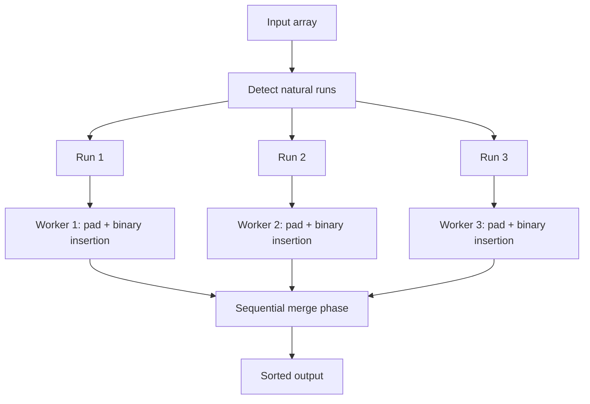

# Tim Sort — Middle Level

## Table of Contents

1. [Introduction](#introduction)
2. [Deeper Concepts](#deeper-concepts)
3. [Galloping Mode Explained](#galloping-mode-explained)
4. [Comparison with Alternatives](#comparison-with-alternatives)
5. [Advanced Patterns](#advanced-patterns)
6. [The 2015 Invariant Bug](#the-2015-invariant-bug)
7. [Code Examples](#code-examples)
8. [Error Handling](#error-handling)
9. [Performance Analysis](#performance-analysis)
10. [Best Practices](#best-practices)
11. [Visual Animation](#visual-animation)
12. [Summary](#summary)

---

## Introduction

> Focus: "Why do TimSort's invariants exist?" and "When does it beat plain Merge Sort?"

At the middle level, you stop thinking of TimSort as a recipe and start thinking of it as a **carefully tuned cost model**: every choice (when to merge, when to gallop, how big `minrun` should be) was made to minimize a specific cost on a specific kind of input — partially ordered, real-world data. Understanding *why* each piece exists tells you when TimSort wins big, when it merely matches plain Merge Sort, and the (rare) cases where another sort beats it.

---

## Deeper Concepts

### Invariant: Stack Length Constraints

TimSort maintains two constraints on the top three entries of its run stack (lengths `A`, `B`, `C` from third-from-top to top):

```text
Invariant 1:  A > B + C
Invariant 2:  B > C
```

**Why these invariants?** Two reasons:

1. **Balanced merges.** A merge of run sizes `m` and `n` costs `O(m + n)`. If sizes are unbalanced (1 vs 1000), the small run "wastes" the merge — each element of the big run is touched but contributes nothing. Forcing `A > B + C` keeps merges between runs of similar size, ensuring the total merge cost is `O(n log n)` rather than `O(n²)`.
2. **Bounded stack size.** The invariants force the run lengths to grow exponentially down the stack (`length[i] > 2 * length[i+1]` roughly). For `n` elements, stack depth is `O(log_φ n)` where `φ` is the golden ratio — so depth ≤ ~85 entries for any realistic `n`.

CPython preallocates a stack of `85` entries (`MAX_MERGE_PENDING`); OpenJDK's TimSort uses a more conservative `40` (which is what caused the 2015 bug, see below).

### Recurrence Relation

For a TimSort merge of `k` runs of equal size `m`:

```text
T(km) = 2 T(km/2) + O(km)
By Master Theorem (case 2): T(km) = O(km log k)
With k = n/m runs of size m: T(n) = O(n log(n/m))
```

If `m = minrun ≈ 32`, then `log(n/32) ≈ log n - 5`, so practical runtime is `n · (log n - 5)`. The savings come from the `O(n)` work to sort each minrun via insertion sort being much faster (better constants) than O(n log n) work to merge that many tiny runs.

### Why `minrun` Is Between 32 and 64

Tim Peters' analysis (from `listsort.txt`):

- If `minrun` is too small (say 2): too many runs, too many merges, merge tree is tall.
- If `minrun` is too large (say `n/2`): Binary Insertion Sort dominates and we get O(n²) on the random portion.
- Sweet spot: `2^5 = 32` to `2^6 = 64`. Binary Insertion Sort on 32-64 items is very fast in cache.

The algorithm picks `minrun` so that `n / minrun` is *just below* a power of 2. This makes the merge tree perfectly balanced — every merge combines runs of equal length, no orphan merges.

### Why Strict `<` for Descending But `<=` for Ascending?

This asymmetry is the entire reason TimSort is stable. Consider input `[5, 5, 5, 3]`:

- If descending used `<=`: the run `[5, 5, 5, 3]` would be detected as descending and reversed to `[3, 5, 5, 5]`. The three 5's were originally in positions 0, 1, 2 — now they're in positions 1, 2, 3, but the order **between them is unchanged**. Still stable here, but...
- Now consider `[5a, 5b, 3]` where `a` and `b` are tag attributes. If detected as descending and reversed: `[3, 5b, 5a]` — `5b` now before `5a`, stability **broken**.

By using strict `<`, equal elements never participate in a reverse. The pair `(5, 5)` is ascending (non-strict), so they stay in order.

---

## Galloping Mode Explained

### The Problem Galloping Solves

Suppose you're merging:

```text
L = [1, 2, 3, 4, ..., 1000]       (1000 elements)
R = [500, 501, 502]               (3 elements)
```

Naive merge takes `1000` element-comparisons just to find where `500` slots in. Plain merge: 1000 + 3 = 1003 comparisons; many of them are wasted on consecutive picks from `L`.

### Galloping Algorithm

1. **Linear merge** picks one element at a time, tracking a counter `win_count` for each side.
2. When one side wins `min_gallop` times in a row (default 7), enter galloping mode for that side.
3. **Exponential search**: from the losing run's current head, find the first index in the winning run that exceeds it. Search at offsets `1, 2, 4, 8, 16, ...` until you overshoot, then **binary search** in the bracket.
4. **Bulk copy** all winners.
5. After the bulk, drop back to linear mode but lower `min_gallop` by 1 (rewards adaptive data).
6. If linear stays in mode for a while, raise `min_gallop` by 1 (avoids gallop overhead on random data).

### Cost Analysis

For random data: galloping rarely triggers, overhead is negligible.

For data where one side dominates: galloping converts `O(n)` per-element comparisons to `O(log n)` per bulk transfer. On the `[1..1000]` and `[500..502]` example above, galloping does `log₂(500) ≈ 9` comparisons to find where to insert each element of `R`, total ~30 comparisons instead of 1003.

### `min_gallop` Self-Tuning

`min_gallop` starts at `7`. Every successful gallop **decrements** it (down to 1). Every gallop attempt that fails to find a useful run **increments** it (up to infinity practically). This means the algorithm learns the data:

- Random data: `min_gallop` rises, galloping disables.
- Structured data: `min_gallop` falls, galloping triggers eagerly.

---

## Comparison with Alternatives

| Attribute | Tim Sort | Merge Sort (plain) | Quick Sort | pdqsort | Heap Sort |
|-----------|---------|--------------------|--------|---------|-----------|
| Time (best) | **O(n)** | O(n log n) | O(n log n) | **O(n)** | O(n log n) |
| Time (average) | O(n log n) | O(n log n) | O(n log n) | O(n log n) | O(n log n) |
| Time (worst) | O(n log n) | O(n log n) | **O(n²)** | O(n log n) | O(n log n) |
| Space | O(n) | O(n) | O(log n) | O(log n) | O(1) |
| Stable | **Yes** | Yes | No | No | No |
| In-place | No | No | **Yes** (mostly) | **Yes** | **Yes** |
| Adaptive | **Yes** | No | Partially | **Yes** | No |
| Cache behavior | Good | Good | **Excellent** | **Excellent** | Poor |
| Production usage | Python, Java(obj), Android, V8 | Educational, external sort | Older Java/C | Go, Rust | Embedded, real-time |

**Choose Tim Sort when:**
- You're in Python or Java — just use the built-in.
- You need **stability** + **adaptive** behavior on real-world data.
- You're sorting **objects** where comparisons are expensive (galloping saves comparisons).

**Choose pdqsort when:**
- You're in Go, Rust, or C++ (it's the default in those).
- You're sorting **primitives** and stability doesn't matter.
- You want O(log n) extra space, not O(n).

**Choose Heap Sort when:**
- You have a **hard memory budget** (e.g., embedded).
- You need O(1) extra space and guaranteed O(n log n) worst case.
- You're sorting in-place in a tight loop.

---

## Advanced Patterns

### Pattern: Decorate-Sort-Undecorate (DSU) With TimSort

When sorting by an expensive key, compute keys once.

#### Go

```go
package main

import (
    "fmt"
    "sort"
)

type Decorated struct {
    Key   float64 // precomputed sort key
    Value string  // original
}

func main() {
    raw := []string{"alice", "bob", "charlie", "dave"}
    decorated := make([]Decorated, len(raw))
    for i, s := range raw {
        decorated[i] = Decorated{Key: expensiveScore(s), Value: s}
    }
    sort.SliceStable(decorated, func(i, j int) bool { return decorated[i].Key < decorated[j].Key })
    sorted := make([]string, len(decorated))
    for i, d := range decorated {
        sorted[i] = d.Value
    }
    fmt.Println(sorted)
}

func expensiveScore(s string) float64 { /* simulated */ return float64(len(s)) }
```

#### Java

```java
import java.util.*;
import java.util.stream.Collectors;

public class DSU {
    record Decorated(double key, String value) {}

    public static void main(String[] args) {
        List<String> raw = List.of("alice", "bob", "charlie", "dave");
        List<Decorated> decorated = raw.stream()
            .map(s -> new Decorated(expensiveScore(s), s))
            .sorted(Comparator.comparingDouble(Decorated::key))
            .collect(Collectors.toList());
        List<String> sorted = decorated.stream().map(Decorated::value).toList();
        System.out.println(sorted);
    }

    static double expensiveScore(String s) { return s.length(); }
}
```

#### Python

```python
def expensive_score(s):
    return len(s)

raw = ["alice", "bob", "charlie", "dave"]
# DSU pattern: decorate once, sort, undecorate
decorated = [(expensive_score(s), i, s) for i, s in enumerate(raw)]  # i breaks ties
decorated.sort()
result = [s for _, _, s in decorated]
print(result)

# Modern Python: just use key=
result2 = sorted(raw, key=expensive_score)  # key called n times, cached internally
print(result2)
```

In Python 2, DSU was strictly faster than `key=`. In Python 3, `key=` does the same internally — they're equivalent. Use `key=` for readability.

---

### Pattern: Parallel TimSort via Run-Splitting

TimSort has a natural parallel opportunity: detected runs are independent of each other. Sort runs on parallel workers, then sequentially merge.



Java's `Arrays.parallelSort(Object[])` does exactly this — uses ForkJoinPool to parallelize the run-padding phase.

---

### Pattern: TimSort as External Sort Inner Loop

For data larger than RAM, TimSort sorts each chunk (which fits in memory); then a k-way merge combines chunks (see [`02-merge-sort/senior.md`](../02-merge-sort/senior.md)). The chunk sort step is where TimSort wins over plain Merge Sort — if a chunk arrives partially sorted (common in log streams), TimSort handles it in O(chunk_size) instead of O(chunk_size log chunk_size).

---

## The 2015 Invariant Bug

In 2015, Stijn de Gouw and colleagues attempted to **formally verify** OpenJDK's `TimSort.java` using the KeY theorem prover. They discovered that the invariant-checking code only inspected the **top three** stack entries, but in some pathological inputs, an invariant could be violated **deeper in the stack** without triggering a merge.

### The Pathological Input

```text
runs = [120, 80, 25, 20, 30]
```

After all runs are pushed:

- Top 3: `25, 20, 30`. Invariants: `25 > 20 + 30`? No, `25 < 50`. So we merge.
- But the bug: the merge selection sometimes chose to merge the wrong pair, leaving `80, 105, 30` on the stack. Now `80 > 105 + 30`? No. **Invariant violated, but not checked.**

For very specific inputs, this allowed the stack to grow beyond the preallocated `MAX_MERGE_PENDING = 40` in OpenJDK, causing an `ArrayIndexOutOfBoundsException`.

### The Fix

**Python's fix (2.7.16, 3.6.3):** Increase the invariant check to top **four** entries — extend the invariant to `A > B + C + D` and recompute, or add a deeper check.

**Java's fix (OpenJDK 9):** Increase the preallocated stack from 40 to 49 (mathematically guaranteed to be enough), and recheck invariants after every merge.

### Why This Matters

This is the rare case where a **production sorting algorithm in two of the world's most popular languages had a 13-year-old bug**, found only by formal verification. Two takeaways:

1. **Empirical testing** (which CPython and OpenJDK had plenty of) is insufficient to catch invariant bugs in adaptive algorithms — the trigger inputs are too rare.
2. **Formal methods** found a real bug in real code. This is one of the strongest case studies for theorem proving on real-world software.

See `professional.md` for the formal invariant analysis.

---

## Code Examples

### Galloping Mode Implementation

#### Go

```go
package main

import "fmt"

// gallopRight finds the first index in arr[start:start+length] strictly greater than key.
// Used during merge when right side is winning streaks.
// Hint is the start of the exponential search.
func gallopRight(key int, arr []int, start, length, hint int) int {
    if hint < 0 || hint >= length {
        hint = 0
    }
    ofs, lastOfs := 1, 0
    if key < arr[start+hint] {
        // Gallop left: find rightmost arr[start+hint-ofs] <= key
        maxOfs := hint + 1
        for ofs < maxOfs && key < arr[start+hint-ofs] {
            lastOfs = ofs
            ofs = ofs*2 + 1
            if ofs <= 0 { // overflow
                ofs = maxOfs
            }
        }
        if ofs > maxOfs {
            ofs = maxOfs
        }
        // Switch to absolute offsets relative to start.
        tmp := lastOfs
        lastOfs = hint - ofs
        ofs = hint - tmp
    } else {
        // Gallop right.
        maxOfs := length - hint
        for ofs < maxOfs && key >= arr[start+hint+ofs] {
            lastOfs = ofs
            ofs = ofs*2 + 1
            if ofs <= 0 {
                ofs = maxOfs
            }
        }
        if ofs > maxOfs {
            ofs = maxOfs
        }
        lastOfs += hint
        ofs += hint
    }
    // Binary search in (lastOfs, ofs].
    lastOfs++
    for lastOfs < ofs {
        m := lastOfs + (ofs-lastOfs)/2
        if key < arr[start+m] {
            ofs = m
        } else {
            lastOfs = m + 1
        }
    }
    return ofs
}

func main() {
    arr := []int{1, 5, 10, 15, 20, 25, 30, 35, 40, 45}
    // Where does 22 belong?
    pos := gallopRight(22, arr, 0, len(arr), 0)
    fmt.Printf("22 belongs at index %d (between %d and %d)\n", pos, arr[pos-1], arr[pos])
}
```

#### Python

```python
def gallop_right(key, arr, start, length, hint=0):
    """Find first index in arr[start:start+length] strictly greater than key.
    Uses exponential search starting from hint, then binary search."""
    if hint < 0 or hint >= length:
        hint = 0
    ofs, last_ofs = 1, 0
    if key < arr[start + hint]:
        max_ofs = hint + 1
        while ofs < max_ofs and key < arr[start + hint - ofs]:
            last_ofs = ofs
            ofs = ofs * 2 + 1
        ofs = min(ofs, max_ofs)
        last_ofs, ofs = hint - ofs, hint - last_ofs
    else:
        max_ofs = length - hint
        while ofs < max_ofs and key >= arr[start + hint + ofs]:
            last_ofs = ofs
            ofs = ofs * 2 + 1
        ofs = min(ofs, max_ofs)
        last_ofs, ofs = last_ofs + hint, ofs + hint
    last_ofs += 1
    while last_ofs < ofs:
        m = (last_ofs + ofs) // 2
        if key < arr[start + m]:
            ofs = m
        else:
            last_ofs = m + 1
    return ofs


# Example: 22 belongs where?
arr = [1, 5, 10, 15, 20, 25, 30, 35, 40, 45]
print(gallop_right(22, arr, 0, len(arr)))  # 5 (between 20 and 25)
```

---

## Error Handling

| Scenario | Cause | Fix |
|----------|-------|-----|
| `IllegalArgumentException: Comparison method violates its general contract` (Java) | Non-transitive comparator | Audit `compare(a, b)` to ensure: `compare(a,b) > 0 → compare(b,a) < 0` and `compare(a,b) > 0 ∧ compare(b,c) > 0 → compare(a,c) > 0` |
| Sort produces wrong result, no error (Python) | Same as above — Python doesn't enforce | Same audit; use [`functools.cmp_to_key`](https://docs.python.org/3/library/functools.html#functools.cmp_to_key) carefully |
| `ArrayIndexOutOfBoundsException` in OpenJDK ≤ 8 TimSort | Pre-2015-fix invariant bug | Upgrade to Java 9+ |
| Slow sort on near-sorted data | Galloping not engaging | Inspect `min_gallop` adaptation — may need warmup |
| Memory error on very large array | O(n) merge buffer too big | Use external sort; chunk input |

---

## Performance Analysis

### Benchmark Harness

#### Go

```go
package main

import (
    "fmt"
    "math/rand"
    "sort"
    "time"
)

func benchmark() {
    sizes := []int{1000, 10_000, 100_000, 1_000_000}
    for _, n := range sizes {
        data := make([]int, n)
        for i := range data {
            data[i] = rand.Intn(n)
        }
        // Test: random
        runs := func(label string, gen func() []int) {
            t := time.Now()
            for i := 0; i < 10; i++ {
                d := gen()
                sort.SliceStable(d, func(i, j int) bool { return d[i] < d[j] })
            }
            fmt.Printf("n=%-7d %-15s: %.2f ms/op\n", n, label, float64(time.Since(t).Milliseconds())/10.0)
        }
        runs("random", func() []int { c := make([]int, n); copy(c, data); return c })
        runs("sorted", func() []int { c := make([]int, n); for i := range c { c[i] = i }; return c })
        runs("reverse", func() []int { c := make([]int, n); for i := range c { c[i] = n - i }; return c })
        runs("near-sorted", func() []int {
            c := make([]int, n)
            for i := range c { c[i] = i }
            for i := 0; i < n/100; i++ { c[rand.Intn(n)] = rand.Intn(n) }
            return c
        })
    }
}

func main() { benchmark() }
```

#### Java

```java
import java.util.*;

public class TimSortBench {
    public static void main(String[] args) {
        int[] sizes = {1000, 10_000, 100_000, 1_000_000};
        Random rng = new Random(42);
        for (int n : sizes) {
            Integer[] random = new Integer[n];
            Integer[] sorted = new Integer[n];
            Integer[] reverse = new Integer[n];
            Integer[] nearSorted = new Integer[n];
            for (int i = 0; i < n; i++) {
                random[i] = rng.nextInt(n);
                sorted[i] = i;
                reverse[i] = n - i;
                nearSorted[i] = i;
            }
            for (int i = 0; i < n / 100; i++) nearSorted[rng.nextInt(n)] = rng.nextInt(n);

            run("random      ", n, random);
            run("sorted      ", n, sorted);
            run("reverse     ", n, reverse);
            run("near-sorted ", n, nearSorted);
        }
    }

    static void run(String label, int n, Integer[] data) {
        long start = System.nanoTime();
        for (int i = 0; i < 10; i++) {
            Integer[] copy = data.clone();
            Arrays.sort(copy); // TimSort for Integer[]
        }
        long elapsedMs = (System.nanoTime() - start) / 1_000_000 / 10;
        System.out.printf("n=%-7d %s: %d ms/op%n", n, label, elapsedMs);
    }
}
```

#### Python

```python
import random
import timeit

sizes = [1000, 10_000, 100_000, 1_000_000]
for n in sizes:
    random.seed(42)
    random_data = [random.randint(0, n) for _ in range(n)]
    sorted_data = list(range(n))
    reverse_data = list(range(n, 0, -1))
    near_sorted = list(range(n))
    for _ in range(n // 100):
        near_sorted[random.randint(0, n - 1)] = random.randint(0, n)

    for label, data in [("random", random_data), ("sorted", sorted_data),
                         ("reverse", reverse_data), ("near-sorted", near_sorted)]:
        t = timeit.timeit(lambda: sorted(data), number=10) * 1000 / 10
        print(f"n={n:<8} {label:<13}: {t:.2f} ms/op")
```

**Expected pattern:**

| Input | TimSort time | Notes |
|-------|-------------|-------|
| Random | ~baseline | Full O(n log n) |
| Sorted | ~10-50× faster | O(n) — one run |
| Reverse-sorted | ~10-50× faster | O(n) — reverse + done |
| Near-sorted (1% perturbed) | ~5-10× faster than random | Few merges |

---

## Best Practices

- **Trust the built-in.** Python's `sorted` and Java's `Arrays.sort(Object[])` are TimSort and have been hand-optimized for 20+ years. Don't reimplement.
- **Profile before optimizing.** If your sort is slow, it's probably the `key=` function (called n times), not the sort itself.
- **For huge arrays of primitives**, use `Arrays.sort(int[])` (Dual-Pivot Quicksort) — faster than `Arrays.sort(Integer[])` because no boxing and no stability tax.
- **For floats**, beware `NaN` — Python `sorted` will produce weird orders; Java throws. Filter NaNs first.
- **For object arrays with expensive comparisons**, TimSort's galloping minimizes calls. Measure comparator call count to confirm.
- **Document stability dependence.** If downstream code relies on equal-key order, comment it explicitly.

---

## Visual Animation

> See [`animation.html`](./animation.html) for interactive visualization.
>
> Middle-level animation highlights:
>
> - **Side-by-side comparison** with plain Merge Sort on the same input.
> - **Run detection phase** with colored brackets per run.
> - **Stack visualization** showing invariant checks after each push.
> - **Galloping demo** — bulk-copy long winning streaks.
> - **Counters**: comparisons, merges, gallops triggered, stack max depth.

---

## Summary

At middle level, TimSort is understood through its cost model:

1. **Run detection** turns adaptive input into adaptive runtime: `O(n + n log R)` where `R` is the number of runs.
2. **`minrun` padding** keeps the merge tree balanced — `n / minrun` is just under a power of 2.
3. **Stack invariants** (`A > B+C`, `B > C`) keep merges balanced and stack depth at `O(log n)`.
4. **Galloping mode** turns dominating runs into `O(log n)` per bulk transfer.
5. The **2015 invariant bug** showed that even after a decade of production use, formal verification can find real bugs.

When choosing between TimSort and pdqsort: **stability** + **adaptive on real data** → TimSort. **Cache-friendly in-place** + **primitives** → pdqsort. The Python/Java ecosystem chose TimSort; the Go/Rust ecosystem chose pdqsort. Both choices are well-defended.
