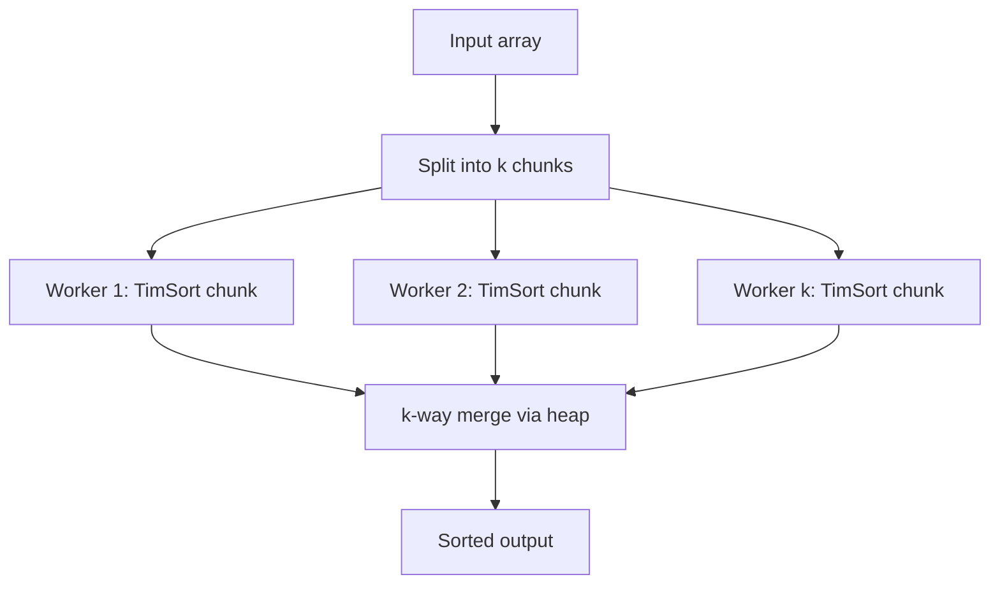
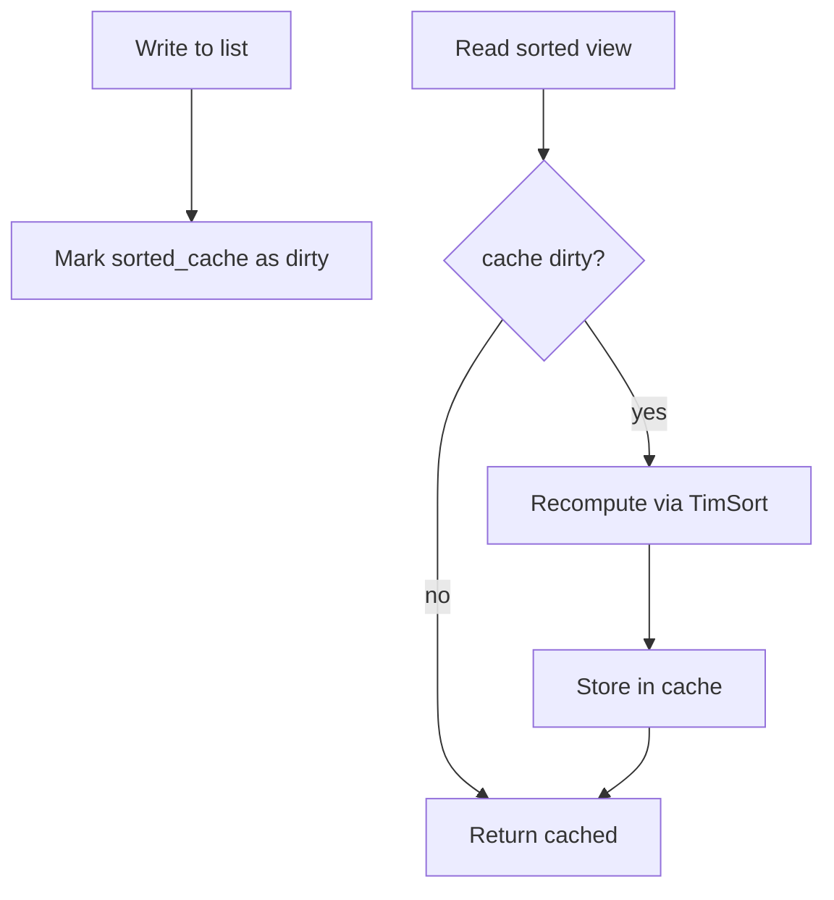

# Tim Sort — Senior Level

## Table of Contents

1. [Introduction](#introduction)
2. [TimSort in CPython — The Reference Implementation](#timsort-in-cpython)
3. [TimSort in OpenJDK — The Conservative Port](#timsort-in-openjdk)
4. [TimSort in V8 — The JavaScript Story](#timsort-in-v8)
5. [Parallel and Distributed TimSort](#parallel-and-distributed-timsort)
6. [Comparison with Alternatives at Scale](#comparison-with-alternatives-at-scale)
7. [Observability](#observability)
8. [Failure Modes](#failure-modes)
9. [Production Trade-offs](#production-trade-offs)
10. [Code Examples](#code-examples)
11. [Sort Pipeline Patterns](#sort-pipeline-patterns)
12. [Summary](#summary)

---

## Introduction

> Focus: "How is TimSort integrated into runtimes, and how does it behave at scale?"

At the senior level, TimSort is no longer an algorithm — it's a **piece of infrastructure** that ships with every Python interpreter, every JVM, every Android device, and every V8-based JavaScript engine. Decisions about it are made by language implementers (CPython core, OpenJDK, V8) and affect billions of programs. Understanding its production reality means looking at:

- **How each runtime adapts the canonical TimSort** to its constraints (object model, GC, calling convention).
- **What metrics to observe** (run count, gallop count, memory) when TimSort is in your hot path.
- **When to override the default** (parallel sort, external sort, primitive sort).
- **The trade-offs runtimes accepted** when they chose TimSort over pdqsort, IntroSort, or pure QuickSort.

---

## TimSort in CPython

CPython's TimSort lives in [`Objects/listobject.c`](https://github.com/python/cpython/blob/main/Objects/listobject.c), approximately 1000 lines of C surrounding the function `list_sort_impl`. The accompanying design doc, [`Objects/listsort.txt`](https://github.com/python/cpython/blob/main/Objects/listsort.txt), is Tim Peters' original write-up and is required reading.

### Key CPython-Specific Adaptations

| Concern | CPython approach |
|---------|------------------|
| **Comparison function** | Calls `PyObject_RichCompareBool(a, b, Py_LT)` per comparison — Python interpreter overhead per call |
| **Key function** | Computes `key(x)` once per element, builds a parallel key array, sorts key array, reorders original |
| **Stability tag** | Original index tracked indirectly via the parallel key array — no tagging needed |
| **Stack size** | Preallocated `MAX_MERGE_PENDING = 85` entries — enough for any `Py_ssize_t` array (proven via Fibonacci-based bound) |
| **Galloping threshold** | `MIN_GALLOP = 7`, adapts at runtime |
| **Minrun computation** | Exactly as in Tim's paper: bottom 5-6 bits + round-up |
| **Type-specific fast paths (CPython 3.11+)** | Detects "all ints" or "all strings" arrays, dispatches to specialized comparator avoiding `PyObject_RichCompareBool` overhead — ~50% speedup |

### CPython 3.11+ Adaptive Sort Specialization

In Python 3.11, the sort routine added type-specialization. Before the first comparison, it walks the array and checks whether all elements are the same type (`int`, `str`, `float`, or `tuple of these`). If so, it dispatches to a specialized comparator that bypasses the generic `PyObject_RichCompareBool`. This is **invisible** to user code but speeds up real-world sorts of typed lists by 30-60%.

### Sample: How `list.sort()` Calls TimSort

```text
list.sort(key=lambda x: x.field, reverse=False)
   │
   └─▶ list_sort_impl(list, keyfunc, reverse)
         │
         ├─▶ if keyfunc: build keys[] = [keyfunc(x) for x in list]
         ├─▶ specialize comparator based on key type
         ├─▶ run TimSort on keys[], reordering list in parallel
         └─▶ if reverse: reverse(list) at end
```

The key insight: `reverse=True` is done by sorting ascending then reversing — this preserves stability. Doing a descending sort directly would break stability of equal keys.

---

## TimSort in OpenJDK

OpenJDK's [`java.util.TimSort`](https://github.com/openjdk/jdk/blob/master/src/java.base/share/classes/java/util/TimSort.java) is used by:

- `Arrays.sort(Object[])` and `Arrays.sort(Object[], Comparator)`.
- `Collections.sort(List)`.
- `List.sort(Comparator)`.

For **primitive arrays** (`int[]`, `long[]`, etc.), Java uses **Dual-Pivot Quicksort** (`java.util.DualPivotQuicksort`) instead. The justification: primitives don't need stability, so the choice is purely about speed and cache locality.

### Key OpenJDK Differences from CPython

| Concern | OpenJDK approach | CPython approach |
|---------|-----------------|------------------|
| Stack size | 49 entries (post-2015 fix) | 85 entries (Tim's original) |
| Galloping triggers | Slightly fewer paths to gallop (less aggressive) | More aggressive |
| Comparator | `Comparable.compareTo` or user `Comparator.compare` — JIT-inlined | Python C call |
| Pre-allocation | Allocates merge buffer up front for `n >= MIN_MERGE` | Allocates lazily, doubles on grow |
| Thread safety | Single-threaded; concurrent modification → `ConcurrentModificationException` | Single-threaded; GIL prevents true parallelism |

### `Arrays.parallelSort`

For multi-core machines, Java provides `Arrays.parallelSort(Object[])`, which:

1. Splits the array into chunks of size `n / (numProcessors * 4)`.
2. Each chunk is sorted by TimSort on a ForkJoinPool worker.
3. Sorted chunks are merged in parallel using a parallel merge.
4. Falls back to sequential `Arrays.sort` if array is too small (< ~8000 elements).

**Speedup:** typically 3-5× on 8 cores for `n = 10⁶`. Beyond `n = 10⁷` memory bandwidth dominates and speedup plateaus.

### IllegalArgumentException: Broken Comparator

A famously confusing error:

```text
Exception in thread "main" java.lang.IllegalArgumentException:
    Comparison method violates its general contract!
```

TimSort detects when a comparator returns inconsistent results during merge (e.g., `a < b` once and `a > b` later — non-transitive comparator). It throws to prevent infinite loops or stack corruption. **Before Java 7**, the old MergeSort silently produced wrong results in this case. TimSort surfaces the bug.

Common causes:

- Comparator that uses subtraction with `int`s causing overflow (`a - b` is buggy for large values; use `Integer.compare(a, b)`).
- Comparator that uses external mutable state.
- Comparator that doesn't handle `null` consistently.

---

## TimSort in V8

JavaScript V8 (Chrome, Node.js) switched from a custom hand-rolled QuickSort to TimSort in **V8 v7.0 (Node.js 11)**, around 2018. The motivation was ECMAScript 2019 mandating that `Array.prototype.sort` be stable — V8's QuickSort was not.

V8's TimSort is written in C++ (in [`v8/src/builtins/array-sort.tq`](https://github.com/v8/v8) — Torque, V8's intermediate language). Key adaptations:

- **No primitive vs object distinction** — JS arrays are heterogeneous; everything goes through TimSort.
- **Comparison via call into JS code** when a user comparator is provided — much slower than C/Java, so galloping (which reduces comparisons) matters more.
- **Sparse array detection** — V8 falls back to a different routine for arrays with many holes.
- **`length` cached at start** — sorts a fixed range, ignoring mutations to length during sort.

V8 published a [blog post](https://v8.dev/blog/array-sort) explaining the change. Real-world page-load benchmarks improved on stable-sort-dependent code.

---

## Parallel and Distributed TimSort

### Parallel TimSort Design

The natural parallelization:



Each worker runs TimSort on its chunk; the merge can be:

- **Sequential k-way merge** with a heap — simple but bottlenecked on the merge.
- **Parallel pairwise merge tree** — split merges across workers, use parallel-merge algorithm to split each pairwise merge across two threads.

Java's `Arrays.parallelSort` uses ForkJoinPool and parallel pairwise merge. The actual gains plateau at ~4-5× because:

1. Memory bandwidth limits cross-thread data movement.
2. The final pairwise merge of two large halves is inherently sequential without parallel-merge logic.

### Distributed TimSort

For data larger than one node:

1. **Range partition** — sample data, choose pivots, send keys to specific nodes by range.
2. **Local TimSort** on each node's partition.
3. **Concatenate** partitions in range order — globally sorted.

This is what Spark's `sortBy` does. Each Spark task runs TimSort (in Java) on its partition; Spark schedules tasks across workers; the output is a globally sorted RDD because partitions are non-overlapping by range.

---

## Comparison with Alternatives at Scale

| Workload | Best choice | Why |
|----------|------------|-----|
| Sort Python `list` of small objects, n = 1000 | TimSort (built-in) | Adaptive, stable, no tuning needed |
| Sort Java `Object[]`, n = 10⁶ | TimSort (`Arrays.sort`) | Stability + adaptive + good on real data |
| Sort Java `int[]`, n = 10⁶ | Dual-Pivot Quicksort (`Arrays.sort`) | Cache wins, no stability tax |
| Parallel sort 10⁷ objects | `Arrays.parallelSort` (parallel TimSort) | 3-5× speedup on 8 cores |
| External sort 10⁹ rows | Chunked TimSort + k-way merge | Each chunk sorted by TimSort, merged via heap |
| Sort in Go | `sort.SliceStable` (TimSort-like) or pdqsort | Pick stable when needed |
| Sort in Rust | `slice::sort` (TimSort-derived) or `sort_unstable` (pdqsort) | Stable: Rust's TimSort variant |
| Sort in C++ | `std::stable_sort` (variant of TimSort/merge) | Stable variant; `std::sort` is introsort |
| Lambda over expensive key | DSU or `sorted(key=…)` | Cache keys, avoid re-computation |

---

## Observability

When TimSort is in your latency-critical path (e.g., per-request server sort), instrument:

| Metric | Threshold | What it means |
|--------|-----------|--------------|
| `sort_duration_p99_ms` | Track baseline | Drift = data shape changed or volume grew |
| `sort_input_size_p99` | Track | Drives capacity planning |
| `sort_run_count_avg` | If close to `n/minrun` | Mostly random data — pdqsort might be faster |
| `sort_run_count_avg` | If `< n / 100` | Highly adaptive — TimSort wins big |
| `sort_gallop_engagements_total` | Track | Indicates structured (run-dominant) data |
| `sort_comparator_calls_total` | Should be ≤ `n log n` | Outliers = broken comparator |
| `sort_max_stack_depth` | Should be < 50 | Anomalies = pathological input shape |
| `sort_buffer_bytes` | < 80% of available heap | Risk of OOM on big sorts |

### Tracing Annotations

```python
# Python OpenTelemetry example
with tracer.start_as_current_span("sort_records") as span:
    span.set_attribute("sort.input_size", len(records))
    span.set_attribute("sort.key_type", type(records[0]).__name__)
    t0 = time.perf_counter()
    records.sort(key=extract_key)
    span.set_attribute("sort.duration_ms", (time.perf_counter() - t0) * 1000)
```

For object arrays, log the **comparator call count** — TimSort with galloping should be near `n log n`; if you see `n²`, the comparator is broken (not transitive).

---

## Failure Modes

| Mode | Symptom | Mitigation |
|------|--------|-----------|
| **OOM during sort** | `OutOfMemoryError` / `MemoryError` | Stream + external sort; chunked merge |
| **Slow sort on adversarial input** | Sort takes 100× longer than expected | Inspect data shape — likely highly structured worst-case for galloping overhead. Profile. |
| **`IllegalArgumentException` in JVM** | Broken comparator | Fix comparator to be transitive + total |
| **Stack overflow** | Recursive merge depth too deep | Should NOT happen — TimSort is iterative. If you see this in a custom port, audit your merge implementation. |
| **Concurrent modification during sort** | `ConcurrentModificationException` | Sort a snapshot; do not modify the array during sort |
| **NaN in float array** | Weird order, no error | Filter NaN before sort |
| **Time complexity drift** | p99 latency creeps up | Likely growing data; check `sort_input_size` trend |
| **Heap pressure from key array** | GC pauses spike during sort | Reduce key complexity; use primitive sort with DSU |

---

## Production Trade-offs

### Why Python Chose TimSort Forever

In 2002, Python's built-in sort was an in-place samplesort (a QuickSort variant). It was fast but **not stable**, and Python's developer community kept asking for stability. Tim Peters built TimSort, demonstrated it was:

1. **Always at least as fast** as the existing sort on random data.
2. **Dramatically faster** on real-world data with runs.
3. **Stable** — guaranteed.
4. **Adaptive** — exploit any structure.

That triple-win meant no one objected to taking on the implementation complexity. Python has been on TimSort ever since.

### Why Java Split Primitives from Objects

Java's choice in Java 7:

- **Primitives** (`int[]`, `long[]`, `double[]`) → Dual-Pivot Quicksort. Justification: no stability needed (an int doesn't have identity), cache-friendly, smallest memory footprint, fastest in practice on random data.
- **Objects** (`Object[]`) → TimSort. Justification: stability matters (objects have identity), comparators are expensive (TimSort's gallop minimizes calls), real-world object arrays are often partially sorted.

This split is **principled** — choose the sort that wins on the data shape you have.

### Why V8 Migrated Later

V8 used QuickSort until 2018 because:

1. JS arrays are heterogeneous — type-specialization is harder than in Java.
2. ECMAScript 2017 didn't require stability — V8 could win benchmarks without it.
3. The user-provided comparator is JavaScript code, which is slow to call — galloping was crucial to TimSort being competitive.

When ECMAScript 2019 mandated stability, V8 switched. The migration is documented and the team reports ~10-15% speedup on real-world page loads.

### When Not to Use TimSort

| Scenario | Better choice |
|----------|--------------|
| Sort primitives, no stability needed | pdqsort, Dual-Pivot Quicksort — better cache locality |
| Very small array (n < 32) | Plain Insertion Sort (no overhead) |
| Embedded / fixed memory budget | Heap Sort (O(1) extra space, guaranteed O(n log n)) |
| Sorting under hard real-time deadlines | Heap Sort (predictable, no merge buffer allocation) |
| GPU sort | Bitonic sort, radix sort (highly parallelizable) |
| Numeric data with known range | Counting sort, radix sort (linear time) |

---

## Code Examples

### Thread-Safe Sort Wrapper

When multiple readers and one writer share a list, you must snapshot before sorting — TimSort itself is single-threaded.

#### Go

```go
package main

import (
    "fmt"
    "sort"
    "sync"
)

type SortableList struct {
    mu   sync.RWMutex
    data []int
}

func (s *SortableList) Append(v int) {
    s.mu.Lock()
    defer s.mu.Unlock()
    s.data = append(s.data, v)
}

func (s *SortableList) SortedSnapshot() []int {
    s.mu.RLock()
    snapshot := append([]int{}, s.data...) // copy under read lock
    s.mu.RUnlock()
    sort.SliceStable(snapshot, func(i, j int) bool { return snapshot[i] < snapshot[j] })
    return snapshot
}

func main() {
    l := &SortableList{}
    for _, v := range []int{3, 1, 4, 1, 5, 9, 2, 6} {
        l.Append(v)
    }
    fmt.Println(l.SortedSnapshot())
}
```

#### Java

```java
import java.util.*;
import java.util.concurrent.locks.ReentrantReadWriteLock;

public class SortableList {
    private final ReentrantReadWriteLock lock = new ReentrantReadWriteLock();
    private final List<Integer> data = new ArrayList<>();

    public void append(int v) {
        lock.writeLock().lock();
        try { data.add(v); }
        finally { lock.writeLock().unlock(); }
    }

    public List<Integer> sortedSnapshot() {
        List<Integer> snap;
        lock.readLock().lock();
        try { snap = new ArrayList<>(data); }
        finally { lock.readLock().unlock(); }
        Collections.sort(snap); // TimSort
        return snap;
    }
}
```

#### Python

```python
import threading

class SortableList:
    def __init__(self):
        self._lock = threading.RLock()
        self._data = []

    def append(self, v):
        with self._lock:
            self._data.append(v)

    def sorted_snapshot(self):
        with self._lock:
            snap = list(self._data)
        return sorted(snap)  # TimSort

l = SortableList()
for v in [3, 1, 4, 1, 5, 9, 2, 6]:
    l.append(v)
print(l.sorted_snapshot())
```

**Key idea:** copy under the lock, then sort outside the lock. Sorting takes O(n log n); holding a write lock that long would block all writers.

---

## Sort Pipeline Patterns

### Pattern: Cached Sort Result with Invalidation

For read-heavy workloads where the underlying list changes infrequently:



TimSort's adaptive behavior helps here: if writes are typically appends to an already-sorted list, recomputation is O(n) — much cheaper than recomputing from scratch.

### Pattern: Streaming Sort with Bounded Memory

For unbounded input streams, use a bounded heap rather than full sort. Maintain top-k via `heapq.nsmallest` / `PriorityQueue`. When `k` is small, this beats sorting the entire stream.

### Pattern: Sort-Then-Process for Locality

Reduce database hits by sorting incoming requests by primary key before processing — the database can use sequential reads:

```python
def batch_fetch(ids):
    sorted_ids = sorted(ids)               # TimSort O(n log n)
    return db.execute("SELECT * FROM t WHERE id = ANY(%s)", (sorted_ids,))
```

This pattern is common in batch ETL jobs and microservice fan-in handlers.

---

## Summary

At senior level, TimSort is understood as an **engineered system** integrated into language runtimes, not just an algorithm:

1. **CPython** ships the canonical implementation; CPython 3.11 added type-specialization for ~50% speedup on typed lists.
2. **OpenJDK** uses TimSort for objects, Dual-Pivot Quicksort for primitives — a principled split based on data shape.
3. **V8** switched to TimSort in 2018 when ECMAScript 2019 required stability; documented 10-15% real-world speedup.
4. **Parallel TimSort** (`Arrays.parallelSort`) achieves 3-5× speedup on 8 cores via ForkJoinPool.
5. **Distributed TimSort** is the per-partition primitive in Spark / Flink — range-partition then local TimSort per partition.
6. **Observability** matters: track run count, gallop engagements, stack depth, comparator call count. Drift indicates a data-shape change or broken comparator.

The senior judgment call: **TimSort is the default for object/stable sorts in managed runtimes; pdqsort and Dual-Pivot Quicksort dominate for primitive/unstable sorts**. Both ecosystems made the right call for their constraints.

Move next to [`12-intro-sort/`](../12-intro-sort/) to see the alternative — pdqsort and IntroSort — and `professional.md` in this folder for the formal invariant analysis.
