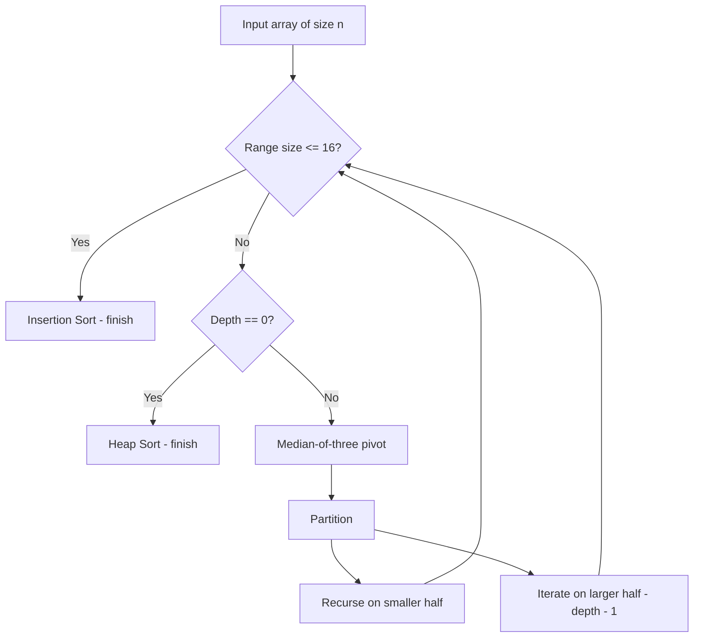

# Intro Sort — Junior Level

> **One-line summary:** Intro Sort (Introspective Sort) is a hybrid sort that starts as Quick Sort, switches to Heap Sort when recursion gets too deep, and finishes tiny subarrays with Insertion Sort — giving you Quick Sort's speed in practice with a guaranteed `O(n log n)` worst case.

---

## Table of Contents

1. [Introduction](#introduction)
2. [Prerequisites](#prerequisites)
3. [Glossary](#glossary)
4. [Core Concepts](#core-concepts)
5. [Big-O Summary](#big-o-summary)
6. [Real-World Analogies](#real-world-analogies)
7. [Pros & Cons](#pros--cons)
8. [Step-by-Step Walkthrough](#step-by-step-walkthrough)
9. [Code Examples](#code-examples)
10. [Coding Patterns](#coding-patterns)
11. [Error Handling](#error-handling)
12. [Performance Tips](#performance-tips)
13. [Best Practices](#best-practices)
14. [Edge Cases & Pitfalls](#edge-cases--pitfalls)
15. [Common Mistakes](#common-mistakes)
16. [Cheat Sheet](#cheat-sheet)
17. [Visual Animation](#visual-animation)
18. [Summary](#summary)
19. [Further Reading](#further-reading)

---

## Introduction

> Focus: "What is Intro Sort?" and "Why is it the sort behind `std::sort`?"

**Intro Sort**, short for **Introspective Sort**, is the production sort that powers C++ `std::sort`, Microsoft .NET `Array.Sort`, and historical Go `sort.Sort`. It was invented by **David Musser in 1997** as a fix for the most embarrassing failure mode of Quick Sort: the **`O(n²)` worst case** on adversarial input.

Intro Sort's idea is not to invent a new sorting algorithm — instead, it **introspects** on Quick Sort's own progress and switches algorithms when things go wrong. The strategy is three-layered:

1. **Start with Quick Sort.** Average case `O(n log n)`, excellent cache behavior, the fastest sort on random data.
2. **Watch the recursion depth.** If it exceeds `2 · log₂(n)`, Quick Sort is degenerating — bail out and switch to **Heap Sort** on the offending partition. Heap Sort guarantees `O(n log n)` and never recurses.
3. **For small subarrays (typically size < 16), switch to Insertion Sort.** Insertion Sort beats both Quick and Heap Sort below this threshold because of low constant factors and cache friendliness.

The result is a sort that:

- runs as fast as Quick Sort on real-world inputs;
- never exceeds `O(n log n)` in the worst case;
- is **in-place** (only `O(log n)` recursion stack);
- is **not stable** (because Quick Sort and Heap Sort aren't).

Intro Sort is the canonical example of a **hybrid algorithm** — combining multiple algorithms by picking the right one for each region of input. It is the model that later inspired **pdqsort** (2016), the modern evolution used by Rust and Go 1.19+.

| Algorithm | Quick Sort | Heap Sort | Insertion Sort | **Intro Sort** |
|-----------|-----------|-----------|----------------|----------------|
| Avg time | O(n log n) | O(n log n) | O(n²) | **O(n log n)** |
| Worst time | **O(n²)** | O(n log n) | O(n²) | **O(n log n)** |
| Small n | slow | slow | **fast** | **fast** |
| Cache behavior | great | poor | great | **great** |
| Stable | no | no | yes | no |
| In-place | yes | yes | yes | **yes** |

You should learn Intro Sort because (a) it is the sort that runs millions of times per second in every C++ program on the planet, (b) it is the textbook hybrid-algorithm example, and (c) understanding its switching logic prepares you to read pdqsort, Tim Sort, and any modern production sort.

---

## Prerequisites

- **Required:** Familiarity with **Quick Sort** — see [`04-quick-sort/junior.md`](../04-quick-sort/junior.md).
- **Required:** Familiarity with **Heap Sort** — see [`06-heap-sort/junior.md`](../06-heap-sort/junior.md).
- **Required:** Familiarity with **Insertion Sort** — see [`03-insertion-sort/junior.md`](../03-insertion-sort/junior.md).
- **Required:** Recursion, arrays, partition.
- **Helpful:** Knowing what an "adversarial input" is and how Quick Sort degrades on sorted input with naïve pivot.
- **Helpful:** Big-O intuition: `2 · log₂(n)` for `n = 10⁶` is roughly 40, so a recursion depth above 40 already tells us Quick Sort has gone bad.

If you do not yet feel solid on Quick Sort and Heap Sort, finish those topics first. Intro Sort is the union of them.

---

## Glossary

| Term | Definition |
|------|-----------|
| **Intro Sort / Introspective Sort** | Hybrid sort that starts with Quick Sort, switches to Heap Sort on depth overrun, finishes with Insertion Sort on small subarrays. |
| **Hybrid algorithm** | Algorithm built by composing two or more algorithms, switching between them based on input characteristics. |
| **Depth limit** | Maximum allowed recursion depth before switching to Heap Sort. Typically `2 · ⌊log₂(n)⌋`. |
| **Insertion-sort cutoff** | Size threshold below which the algorithm switches to Insertion Sort. Typically 16 (libstdc++) or 32. |
| **Pivot** | Element chosen by Quick Sort to partition the array; pivot selection determines balance. |
| **Median-of-three** | Pick the median of `arr[lo]`, `arr[mid]`, `arr[hi]` as pivot. Standard pivot rule in libstdc++ introsort. |
| **Ninther** | Median of three medians-of-three — used for very large arrays. |
| **Tukey's ninther** | The ninther selection strategy formally proposed by John Tukey. |
| **Heapify / sift-down** | Heap Sort's restoration step; used as the depth-limit fallback. |
| **Pdqsort** | Pattern-Defeating Quick Sort (Orson Peters, 2016) — the modern successor to Intro Sort. Used by Rust and Go 1.19+. |
| **Block partition** | Pdqsort's branch-prediction-friendly partition technique. |
| **Adversarial input** | Input crafted to trigger the worst-case behavior — sorted, reverse, all-equal, killer permutations. |
| **Stability** | Whether equal-keyed elements preserve their input order. Intro Sort is **not** stable. |
| **In-place** | Uses `O(1)` extra memory beyond the input; only the `O(log n)` recursion stack. |

---

## Core Concepts

### Concept 1: Why Hybrid?

No single comparison sort is the best on every input:

- **Quick Sort:** fastest on random data; worst case `O(n²)`.
- **Heap Sort:** guaranteed `O(n log n)`; slower constant factor and poor cache behavior.
- **Insertion Sort:** very fast on tiny or nearly-sorted inputs; `O(n²)` overall.
- **Merge Sort:** stable and worst-case `O(n log n)`; needs `O(n)` extra memory.

Intro Sort gets the best of **three** of these by partitioning the input recursively and choosing the right sort for each region.

### Concept 2: The Three Switching Rules

```text
introsort(arr, lo, hi, depth_limit):
    while hi - lo > INSERTION_THRESHOLD:
        if depth_limit == 0:
            heap_sort(arr, lo, hi)      // switch (a): depth blown
            return
        depth_limit -= 1
        p = partition(arr, lo, hi)      // Quick Sort step
        introsort(arr, p+1, hi, depth_limit)   // recurse on right
        hi = p - 1                              // iterate on left (tail-call optimization)
    insertion_sort(arr, lo, hi)         // switch (b): small subarray
```

Three switches happen:

- **(a) Depth overrun.** If recursion has descended past `2 · ⌊log₂(n)⌋` levels, Quick Sort is clearly imbalanced; finish the current partition with Heap Sort.
- **(b) Small subarray.** If the current range has fewer than ~16 elements, finish with Insertion Sort.
- **(c) Tail recursion.** Recurse only on one side, iterate on the other — bounds stack to `O(log n)` even on imbalanced inputs.

### Concept 3: Why Depth Limit `2 · log₂(n)`?

Quick Sort's recursion depth is `⌈log₂(n)⌉` in the best balanced case. We allow it `2 ·` that — twice the optimum — before declaring failure. This gives Quick Sort plenty of room to handle a few bad pivots while still bounding the **worst case**.

The factor `2` is conservative but not magic. A formal proof in [`professional.md`](./professional.md) shows that any constant factor `c ≥ 1` keeps the total complexity `O(n log n)`; the constant only affects how often we fall back.

### Concept 4: Pivot Selection

Intro Sort does not just use `arr[lo]` or `arr[hi]` — that would trigger the depth limit constantly. Standard pivot rules:

- **Median-of-three** (libstdc++): pivot = `median(arr[lo], arr[mid], arr[hi])`. Excellent for random and partially-sorted data.
- **Ninther** (very large `n`): pivot = `median(median(s₁), median(s₂), median(s₃))` for three sample triples.
- **Random pivot** (some variants): cryptographically random index — robust against adversaries.

A good pivot makes the depth limit a rarely-triggered safety net. On purely random input, you almost never hit it; on adversarial input you bail out into Heap Sort.

### Concept 5: Insertion Sort Cutoff

Insertion Sort is `O(n²)` but its **constant factor is tiny**. For `n ≤ 16`, it actually beats Quick Sort because:

- No recursion overhead.
- Linear memory access — perfect cache behavior.
- Branch-predictor-friendly.

`libstdc++` uses 16; some implementations use 24 or 32. The exact value is tuned per machine.

### Concept 6: Not Stable

Intro Sort inherits the instability of Quick Sort (partition can swap equal-keyed elements) and Heap Sort (sift-down can reorder equal keys). Insertion Sort is stable, but that does not save the whole algorithm. If you need stability, use [`02-merge-sort`](../02-merge-sort/) or [`11-tim-sort`](../11-tim/) instead.

---

## Big-O Summary

| Property | Value | Notes |
|----------|-------|-------|
| **Time — best** | `O(n log n)` | Even a fully sorted array runs `O(n log n)` (no Tim-Sort-style early exit). |
| **Time — average** | `O(n log n)` | Same as Quick Sort; the depth check rarely fires. |
| **Time — worst** | `O(n log n)` | Guaranteed by the Heap Sort fallback. |
| **Space** | `O(log n)` | Recursion stack only; in-place otherwise. |
| **Stable** | No | Quick Sort and Heap Sort are both unstable. |
| **Adaptive** | No (vanilla) | Pdqsort, the successor, **is** adaptive to nearly-sorted input. |
| **In-place** | Yes | Only the stack. |
| **Comparisons** | ~1.39 n log n (avg) | Slightly above Merge Sort's lower bound. |
| **Cache behavior** | Excellent | Inherits Quick Sort's locality on most partitions. |

---

## Real-World Analogies

| Concept | Analogy |
|---------|--------|
| **Hybrid switching** | A driver uses a sports car (Quick Sort) on highways, switches to an off-roader (Heap Sort) when the road gets bad, and walks (Insertion Sort) the last meters to the door. |
| **Depth limit** | A surgeon attempts a minimally-invasive procedure first; if the patient's condition worsens past a threshold, they switch to open surgery. |
| **Insertion cutoff** | You'd boot up a chainsaw to fell a tree (Quick Sort), but use scissors (Insertion Sort) to trim 10 hairs. |
| **Introspective** | Like a coach who watches the team's stats during a game and substitutes players when performance drops. |
| **Pivot strategy** | Median-of-three is like picking the middle-skilled candidate from three interviewees, not the most extreme. |

> Where these analogies break: real surgeons don't have a fixed threshold; Intro Sort uses an exact integer depth counter. Real drivers don't analyze their input first; Intro Sort relies on input behavior during sorting.

---

## Pros & Cons

| Pros | Cons |
|------|------|
| **Worst-case `O(n log n)`** — eliminates Quick Sort's `O(n²)` DoS risk. | **Not stable** — cannot preserve equal-key order. |
| **Fast in practice** — Quick Sort speed on real inputs. | **Vanilla version is not adaptive** — no special speed-up on nearly-sorted input. |
| **In-place** — only `O(log n)` stack. | **Three algorithms to implement and debug** — more code than a single sort. |
| **Production-proven** — `std::sort`, `Array.Sort`, historical Go. | **Comparison sort lower bound** — can't beat `Ω(n log n)`. |
| **Cache-friendly** — Quick Sort's partition keeps data hot. | **Heap Sort fallback is slower per operation** — a fallback you don't want to hit often. |
| **Robust against adversarial input** — with median-of-three or random pivot. | **Tuning needed** — cutoff thresholds depend on hardware. |

**When to use:**

- Any general-purpose unstable in-place sort.
- The "I want Quick Sort's speed but cannot tolerate `O(n²)` worst case" scenario.
- When you implement a sort in a systems language without a built-in.

**When NOT to use:**

- You need stability → use [Merge Sort](../02-merge-sort/) or [Tim Sort](../11-tim/).
- You need adaptivity on nearly-sorted data → use [pdqsort](#) (successor) or Tim Sort.
- You sort small fixed-size arrays (`n < 32`) → use Insertion Sort directly.
- You sort integers and can afford linear time → use [Radix Sort](../08-radix/) or [Counting Sort](../07-counting/).

---

## Step-by-Step Walkthrough

Sort `[7, 2, 1, 6, 8, 5, 3, 4]`, `n = 8`, depth limit = `2 · ⌊log₂(8)⌋ = 2 · 3 = 6`, insertion cutoff = 4 (small example).

**Call:** `introsort([7,2,1,6,8,5,3,4], lo=0, hi=7, depth=6)`

- Size 8 > 4 (cutoff). Depth 6 > 0. Partition with median-of-three on `(arr[0]=7, arr[3]=6, arr[7]=4)`; median is 6, swap to end → pivot 6.
- After partition: `[2,1,5,3,4,6,8,7]`, pivot at index 5.
- Recurse right: `introsort(arr, 6, 7, depth=5)`. Size 2 ≤ 4 → Insertion Sort on `[8,7]` → `[7,8]`. Array: `[2,1,5,3,4,6,7,8]`.
- Iterate on left: `lo=0, hi=4, depth=5`.

**Iter:** `introsort(arr, 0, 4, depth=5)`

- Size 5 > 4. Depth 5 > 0. Median-of-three on `(arr[0]=2, arr[2]=5, arr[4]=4)`; median is 4. Pivot 4.
- After partition: `[2,1,3,4,5]`, pivot at index 3. Array: `[2,1,3,4,5,6,7,8]`.
- Recurse right: `introsort(arr, 4, 4)` — size 1, returns.
- Iterate: `lo=0, hi=2, depth=4`.

**Iter:** `introsort(arr, 0, 2, depth=4)`

- Size 3 ≤ 4 (cutoff). Insertion Sort on `[2,1,3]` → `[1,2,3]`. Array: `[1,2,3,4,5,6,7,8]`. Done.

Final array: `[1,2,3,4,5,6,7,8]`. We never triggered the heap fallback because the median-of-three gave good pivots. Depth used: at most 2 levels.

Now imagine an adversarial input designed to give us bad pivots every time. The same trace would eventually hit `depth=0` and call `heap_sort(arr, lo, hi)` instead of partitioning — that's the safety net.

---

## Code Examples

### Example 1: Clean Intro Sort (Go)

#### Go

```go
package main

import (
	"fmt"
	"math/bits"
)

const insertionCutoff = 16

// IntroSort sorts arr ascending in place, guaranteed O(n log n).
func IntroSort(arr []int) {
	n := len(arr)
	if n < 2 {
		return
	}
	depthLimit := 2 * (bits.Len(uint(n)) - 1) // 2*floor(log2(n))
	introsort(arr, 0, n-1, depthLimit)
}

func introsort(arr []int, lo, hi, depth int) {
	for hi-lo > insertionCutoff {
		if depth == 0 {
			heapSort(arr, lo, hi)
			return
		}
		depth--
		p := partition(arr, lo, hi)
		introsort(arr, p+1, hi, depth) // recurse on right
		hi = p - 1                     // iterate on left
	}
	insertionSort(arr, lo, hi)
}

// medianOfThree positions median at arr[hi] so partition can use it as pivot.
func medianOfThree(arr []int, lo, mid, hi int) {
	if arr[mid] < arr[lo] {
		arr[lo], arr[mid] = arr[mid], arr[lo]
	}
	if arr[hi] < arr[lo] {
		arr[lo], arr[hi] = arr[hi], arr[lo]
	}
	if arr[hi] < arr[mid] {
		arr[mid], arr[hi] = arr[hi], arr[mid]
	}
	// Now arr[lo] <= arr[mid] <= arr[hi]; move median to hi-1 (sentinel pattern).
	arr[mid], arr[hi-1] = arr[hi-1], arr[mid]
}

func partition(arr []int, lo, hi int) int {
	mid := lo + (hi-lo)/2
	medianOfThree(arr, lo, mid, hi)
	pivot := arr[hi-1]
	i, j := lo, hi-1
	for {
		for i++; arr[i] < pivot; i++ {
		}
		for j--; arr[j] > pivot; j-- {
		}
		if i >= j {
			break
		}
		arr[i], arr[j] = arr[j], arr[i]
	}
	arr[i], arr[hi-1] = arr[hi-1], arr[i] // restore pivot
	return i
}

func insertionSort(arr []int, lo, hi int) {
	for i := lo + 1; i <= hi; i++ {
		v := arr[i]
		j := i - 1
		for j >= lo && arr[j] > v {
			arr[j+1] = arr[j]
			j--
		}
		arr[j+1] = v
	}
}

func heapSort(arr []int, lo, hi int) {
	n := hi - lo + 1
	// Build max-heap on arr[lo..hi]
	for i := n/2 - 1; i >= 0; i-- {
		siftDown(arr, lo, i, n)
	}
	for end := n - 1; end > 0; end-- {
		arr[lo], arr[lo+end] = arr[lo+end], arr[lo]
		siftDown(arr, lo, 0, end)
	}
}

func siftDown(arr []int, base, root, n int) {
	for {
		left := 2*root + 1
		if left >= n {
			return
		}
		largest := left
		if right := left + 1; right < n && arr[base+right] > arr[base+left] {
			largest = right
		}
		if arr[base+root] >= arr[base+largest] {
			return
		}
		arr[base+root], arr[base+largest] = arr[base+largest], arr[base+root]
		root = largest
	}
}

func main() {
	a := []int{7, 2, 1, 6, 8, 5, 3, 4}
	IntroSort(a)
	fmt.Println(a) // [1 2 3 4 5 6 7 8]
}
```

#### Java

```java
import java.util.Arrays;

public class IntroSort {
    private static final int INSERTION_CUTOFF = 16;

    public static void sort(int[] arr) {
        int n = arr.length;
        if (n < 2) return;
        int depthLimit = 2 * (31 - Integer.numberOfLeadingZeros(n));
        introsort(arr, 0, n - 1, depthLimit);
    }

    private static void introsort(int[] arr, int lo, int hi, int depth) {
        while (hi - lo > INSERTION_CUTOFF) {
            if (depth == 0) {
                heapSort(arr, lo, hi);
                return;
            }
            depth--;
            int p = partition(arr, lo, hi);
            introsort(arr, p + 1, hi, depth);
            hi = p - 1;
        }
        insertionSort(arr, lo, hi);
    }

    private static int partition(int[] a, int lo, int hi) {
        int mid = lo + (hi - lo) / 2;
        medianOfThree(a, lo, mid, hi);
        int pivot = a[hi - 1];
        int i = lo, j = hi - 1;
        while (true) {
            while (a[++i] < pivot) {}
            while (a[--j] > pivot) {}
            if (i >= j) break;
            int t = a[i]; a[i] = a[j]; a[j] = t;
        }
        int t = a[i]; a[i] = a[hi - 1]; a[hi - 1] = t;
        return i;
    }

    private static void medianOfThree(int[] a, int lo, int mid, int hi) {
        if (a[mid] < a[lo]) { int t = a[lo]; a[lo] = a[mid]; a[mid] = t; }
        if (a[hi]  < a[lo]) { int t = a[lo]; a[lo] = a[hi];  a[hi]  = t; }
        if (a[hi]  < a[mid]){ int t = a[mid];a[mid]= a[hi];  a[hi]  = t; }
        int t = a[mid]; a[mid] = a[hi - 1]; a[hi - 1] = t;
    }

    private static void insertionSort(int[] a, int lo, int hi) {
        for (int i = lo + 1; i <= hi; i++) {
            int v = a[i], j = i - 1;
            while (j >= lo && a[j] > v) { a[j + 1] = a[j]; j--; }
            a[j + 1] = v;
        }
    }

    private static void heapSort(int[] a, int lo, int hi) {
        int n = hi - lo + 1;
        for (int i = n / 2 - 1; i >= 0; i--) siftDown(a, lo, i, n);
        for (int end = n - 1; end > 0; end--) {
            int t = a[lo]; a[lo] = a[lo + end]; a[lo + end] = t;
            siftDown(a, lo, 0, end);
        }
    }

    private static void siftDown(int[] a, int base, int root, int n) {
        while (true) {
            int left = 2 * root + 1;
            if (left >= n) return;
            int largest = left;
            int right = left + 1;
            if (right < n && a[base + right] > a[base + left]) largest = right;
            if (a[base + root] >= a[base + largest]) return;
            int t = a[base + root]; a[base + root] = a[base + largest]; a[base + largest] = t;
            root = largest;
        }
    }

    public static void main(String[] args) {
        int[] a = {7, 2, 1, 6, 8, 5, 3, 4};
        sort(a);
        System.out.println(Arrays.toString(a));
    }
}
```

#### Python

```python
import math

INSERTION_CUTOFF = 16


def intro_sort(arr: list[int]) -> None:
    """Sort arr ascending in place. Guaranteed O(n log n)."""
    n = len(arr)
    if n < 2:
        return
    depth_limit = 2 * int(math.log2(n))
    _introsort(arr, 0, n - 1, depth_limit)


def _introsort(arr, lo, hi, depth):
    while hi - lo > INSERTION_CUTOFF:
        if depth == 0:
            _heap_sort(arr, lo, hi)
            return
        depth -= 1
        p = _partition(arr, lo, hi)
        _introsort(arr, p + 1, hi, depth)
        hi = p - 1
    _insertion_sort(arr, lo, hi)


def _partition(arr, lo, hi):
    mid = (lo + hi) // 2
    _median_of_three(arr, lo, mid, hi)
    pivot = arr[hi - 1]
    i, j = lo, hi - 1
    while True:
        i += 1
        while arr[i] < pivot:
            i += 1
        j -= 1
        while arr[j] > pivot:
            j -= 1
        if i >= j:
            break
        arr[i], arr[j] = arr[j], arr[i]
    arr[i], arr[hi - 1] = arr[hi - 1], arr[i]
    return i


def _median_of_three(arr, lo, mid, hi):
    if arr[mid] < arr[lo]:
        arr[lo], arr[mid] = arr[mid], arr[lo]
    if arr[hi] < arr[lo]:
        arr[lo], arr[hi] = arr[hi], arr[lo]
    if arr[hi] < arr[mid]:
        arr[mid], arr[hi] = arr[hi], arr[mid]
    arr[mid], arr[hi - 1] = arr[hi - 1], arr[mid]


def _insertion_sort(arr, lo, hi):
    for i in range(lo + 1, hi + 1):
        v = arr[i]
        j = i - 1
        while j >= lo and arr[j] > v:
            arr[j + 1] = arr[j]
            j -= 1
        arr[j + 1] = v


def _heap_sort(arr, lo, hi):
    n = hi - lo + 1
    for i in range(n // 2 - 1, -1, -1):
        _sift_down(arr, lo, i, n)
    for end in range(n - 1, 0, -1):
        arr[lo], arr[lo + end] = arr[lo + end], arr[lo]
        _sift_down(arr, lo, 0, end)


def _sift_down(arr, base, root, n):
    while True:
        left = 2 * root + 1
        if left >= n:
            return
        largest = left
        right = left + 1
        if right < n and arr[base + right] > arr[base + left]:
            largest = right
        if arr[base + root] >= arr[base + largest]:
            return
        arr[base + root], arr[base + largest] = arr[base + largest], arr[base + root]
        root = largest


if __name__ == "__main__":
    a = [7, 2, 1, 6, 8, 5, 3, 4]
    intro_sort(a)
    print(a)
```

**What it does:** Sorts `[7,2,1,6,8,5,3,4]` ascending in place. Compute `depth_limit = 2·log₂(n)`. Recursively partition with median-of-three pivot. If the small-range cutoff hits, finish with Insertion Sort. If depth runs out, finish with Heap Sort.

**Run:** `go run main.go` | `javac IntroSort.java && java IntroSort` | `python intro_sort.py`

---

## Coding Patterns

### Pattern 1: Three-Way Switch (the central pattern)

```text
loop:
    if range is small         -> insertion sort
    else if depth is exhausted -> heap sort
    else                      -> partition + recurse-shorter, iterate-longer
```

This is the **introspection** part of the name. The algorithm watches itself.

### Pattern 2: Tail-Recursion-by-Iteration

Recurse on the smaller partition; iterate (rewrite `lo`/`hi`) on the larger. This guarantees recursion depth is `O(log n)` regardless of partition balance.

#### Go

```go
for hi-lo > cutoff {
    p := partition(arr, lo, hi)
    if p-lo < hi-p {
        introsort(arr, lo, p-1, depth-1) // smaller side recursed
        lo = p + 1                       // larger side iterated
    } else {
        introsort(arr, p+1, hi, depth-1)
        hi = p - 1
    }
}
```

### Pattern 3: Median-of-Three Pivot

#### Java

```java
static int medianIndex(int[] a, int lo, int hi) {
    int mid = lo + (hi - lo) / 2;
    if (a[lo] > a[mid]) { swap(a, lo, mid); }
    if (a[lo] > a[hi])  { swap(a, lo, hi);  }
    if (a[mid] > a[hi]) { swap(a, mid, hi); }
    return mid;
}
```

### Pattern 4: Depth Limit from `log₂(n)`

#### Python

```python
import math
depth_limit = 2 * int(math.log2(n))
```

In Go use `bits.Len(uint(n)) - 1`. In Java use `31 - Integer.numberOfLeadingZeros(n)`. These all give `⌊log₂(n)⌋` without floating point.



---

## Error Handling

| Error | Cause | Fix |
|-------|-------|-----|
| `RecursionError` / `StackOverflowError` | Forgot tail-recursion-by-iteration, deeply imbalanced input | Iterate on the larger partition |
| Wrong output | Depth limit overflowed signed int | Use `int` (typical sizes are tiny, ~40) |
| Infinite loop in partition | Hoare partition without proper boundary | Use sentinel index `hi-1` after median-of-three |
| Worst case `O(n log² n)` instead of `O(n log n)` | Re-running heap sort recursively rather than as final | Heap Sort must be **terminal** for that partition |
| Off-by-one in cutoff | Comparing `hi - lo` vs `hi - lo + 1` | Pick one convention (range size) and stay consistent |
| Index out of bounds in median-of-three | `hi - 1 < lo` when range is tiny | Skip median-of-three when range < 3 |

---

## Performance Tips

- **Tune the insertion cutoff** to your hardware. 16 is libstdc++'s default; 24 or 32 may be faster on machines with deep pipelines.
- **Use median-of-three pivot** at minimum. Random pivot is more robust but adds an RNG call per partition.
- **For very large `n`**, switch to **ninther** pivot.
- **Inline the partition loop** — function-call overhead dominates for tiny ranges.
- **Cache `arr[hi-1]` as `pivot` once**; do not re-read inside the partition loop.
- **Avoid generics if you can** — primitive `int[]` is much faster than `Integer[]` in Java because of unboxing.
- **Use language built-ins** (`std::sort`, `Arrays.sort(int[])`) for production — they're already tuned Intro Sort or pdqsort.

---

## Best Practices

- **Document the pivot strategy and cutoffs** at the top of the function.
- **Test against pathological inputs**: all-equal, sorted ascending, sorted descending, alternating, Musser's "killer sequence."
- **Verify worst-case behavior** with a recursion-depth counter — assert it never exceeds `2·log₂(n)` + constant.
- **Separate the three sub-algorithms** into testable functions. Test each independently first.
- **Use a stable sort** (Merge Sort, Tim Sort) when you need stability — Intro Sort can never be made stable without `O(n)` extra space.
- **Benchmark on realistic data** — random, partially-sorted, with duplicates. Worst-case theory and average-case practice are different things.

---

## Edge Cases & Pitfalls

- **Empty array (`n = 0`)** → return immediately.
- **Single element (`n = 1`)** → return immediately.
- **All equal** → standard Intro Sort is `O(n log n)` but does many wasted swaps. Use 3-way partition (Bentley-McIlroy) for `O(n)` on this case.
- **Already sorted** → with median-of-three pivot, picks the true median — runs in `O(n log n)` perfectly balanced. With first-as-pivot it would trigger heap fallback.
- **Reverse sorted** → same as already sorted with median-of-three.
- **Musser's killer sequence** → a specific permutation that, against `libstdc++` pre-2014, made Intro Sort degrade. The fix: include a small randomization in pivot selection.
- **Very small `n` (< 16)** → only Insertion Sort runs; partition never executes.
- **Recursion stack on 1B elements** → `log₂(10⁹) ≈ 30`, so 60 levels at the limit — perfectly safe.

---

## Common Mistakes

1. **Forgetting to switch to Heap Sort at `depth == 0`** → still gives `O(n²)` worst case. The depth check is the entire point.
2. **Setting the cutoff too high** (e.g., `n = 1000`) → Insertion Sort's `O(n²)` dominates the small partitions.
3. **Calling Heap Sort but not returning** → both algorithms try to sort the same range; output is garbage.
4. **Using `log₂(n)` via `Math.log(n) / Math.log(2)`** in performance-critical code → floating point is slower than `bit_length(n) - 1`.
5. **Always recursing on the right side** rather than the smaller side → stack depth `O(n)` on imbalanced input.
6. **Mixing up `hi` as inclusive vs exclusive** between sub-algorithms.
7. **Treating Intro Sort as stable** → it's not. Equal-keyed records can swap.
8. **Forgetting to subtract 1 from depth** before recursing → infinite recursion.

---

## Cheat Sheet

```text
              ┌──────────────────────────────────────────────────────┐
              │                  INTRO SORT (Musser 1997)             │
              ├──────────────────────────────────────────────────────┤
              │  Time (best/avg/worst):  O(n log n) / O(n log n)      │
              │  Space:                  O(log n) — stack only         │
              │  Stable:                 NO                             │
              │  Adaptive:               NO (vanilla)                   │
              │  In-place:               YES                            │
              ├──────────────────────────────────────────────────────┤
              │  Depth limit:            2 * floor(log2(n))            │
              │  Insertion cutoff:       16 (libstdc++)                │
              │  Pivot:                  median-of-three (or ninther) │
              ├──────────────────────────────────────────────────────┤
              │  introsort(arr, lo, hi, depth):                       │
              │    while hi - lo > CUTOFF:                            │
              │      if depth == 0: heap_sort(arr, lo, hi); return   │
              │      p = partition(arr, lo, hi)                       │
              │      introsort(arr, p+1, hi, depth-1)                 │
              │      hi = p - 1                                       │
              │    insertion_sort(arr, lo, hi)                        │
              ├──────────────────────────────────────────────────────┤
              │  PRODUCTION USE:                                     │
              │  - C++ std::sort  (libstdc++, libc++)                │
              │  - .NET Array.Sort                                   │
              │  - Go sort.Sort (until 1.19)                         │
              │  SUCCESSOR: pdqsort (Rust, Go 1.19+)                 │
              └──────────────────────────────────────────────────────┘
```

---

## Visual Animation

> See [`animation.html`](./animation.html) for interactive visualization.
>
> The animation shows the three switching layers:
> - Quick Sort partition with median-of-three pivot.
> - Depth counter that ticks each recursion; at 0 the heap fallback kicks in.
> - Heap visualization (binary tree) when Heap Sort takes over a partition.
> - Highlighted insertion-sort phase when the partition shrinks below cutoff.

---

## Summary

- **Intro Sort = Quick Sort + Heap Sort + Insertion Sort**, switched dynamically based on recursion depth and partition size.
- **Worst case is `O(n log n)`** because Heap Sort takes over before Quick Sort can degrade.
- **It is the production sort behind `std::sort`** and many other systems-language sort libraries.
- **It is in-place, unstable, and not adaptive** — for those properties use Merge Sort or Tim Sort.
- **Pdqsort** is the modern successor and gives Intro Sort's guarantees plus adaptivity to nearly-sorted data.

Two takeaways:

1. **Hybridization is the universal trick of production sorts** — no single algorithm wins on every input.
2. **The depth check is the whole insight**: by detecting that Quick Sort is going wrong before it costs you, you reclaim its worst case without losing its average-case speed.

> **Next step:** read [`middle.md`](./middle.md) for invariant analysis of the depth limit and a comparison with pdqsort.

---

## Further Reading

- Musser, D. R. (1997). *Introspective Sorting and Selection Algorithms*, Software: Practice and Experience 27(8):983–993. **The original paper.**
- Sedgewick & Wayne, *Algorithms* 4ed §2.3 — Quick Sort foundations.
- Orson Peters (2016). *pdqsort* — the modern successor. [github.com/orlp/pdqsort](https://github.com/orlp/pdqsort).
- *libstdc++* source: `bits/stl_algo.h::__introsort_loop`.
- Go: [`sort` package](https://pkg.go.dev/sort) (pdqsort since 1.19).
- Microsoft .NET: `Array.Sort` documentation.
- McIlroy, M. D. (1999). *A Killer Adversary for Quicksort* — how to defeat naïve pivots.
</content>
</invoke>