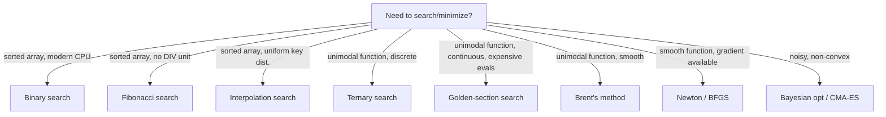

# Fibonacci Search — Senior Level

> **Audience:** Engineers building production systems where Fibonacci search or its continuous cousin actually pays for itself: numerical optimization libraries, embedded firmware, asymmetric-cost storage systems, financial calibration code. Prerequisites: `junior.md`, `middle.md`.

This document treats Fibonacci search and golden-section search as **production infrastructure** rather than textbook trivia. We cover the actual users: SciPy / Matlab / R's optimization solvers, classical numerical-recipes code in computational physics, Bayesian-optimization libraries, financial calibration of volatility surfaces, and the embedded-firmware ROM-lookup pattern still used in some calculators and DSP firmware. We also confront the central question: in 2026, where does it still make sense to *write new code* using Fibonacci or golden-section search?

---

## Table of Contents

1. [Numerical Optimization Libraries — SciPy, NumPy, R](#scipy)
2. [Financial Calibration — Volatility Surfaces, Yield Curves](#finance)
3. [Bayesian Optimization Inner-Loop](#bayesian)
4. [Embedded Firmware — ROM Lookup Tables](#embedded)
5. [Asymmetric Storage — Tape, Mmap, NUMA](#storage)
6. [When to Reach for Golden-Section in 2026](#when)

---

<a name="scipy"></a>
## 1. Numerical Optimization Libraries — SciPy, NumPy, R

The single biggest **active** use of golden-section search today is inside scientific-computing libraries' one-dimensional minimization solvers.

### 1.1 SciPy: `scipy.optimize.minimize_scalar(method='golden')`

```python
from scipy.optimize import minimize_scalar

# Minimize f(x) = (x - 2)^2 + 1 on [0, 5]
result = minimize_scalar(lambda x: (x - 2)**2 + 1,
                         bounds=(0, 5), method='golden',
                         options={'xtol': 1e-9})
print(result.x, result.fun)   # 2.0, 1.0
```

SciPy's `'golden'` method is a direct implementation of golden-section search. The internal implementation (in `scipy/optimize/_optimize.py`, function `_minimize_scalar_golden`) is essentially the loop you saw in `middle.md`, with extra bookkeeping for convergence diagnostics, bracket validation, and floating-point tolerance.

SciPy also exposes `'brent'` (default), which is a hybrid combining golden-section bracket-shrinking with parabolic interpolation. The first phase **is** golden-section; only once the bracket is small enough does Brent's method switch to faster parabolic refinement.

So even if you never call `'golden'` directly, you call it transitively every time you use `minimize_scalar` without specifying a method.

### 1.2 NumPy / SciPy under the hood

NumPy itself does not implement golden-section, but its `polynomial.Polynomial.deriv().roots()` (root finding for polynomial derivatives, the "find the optimum by finding where slope = 0" approach) sometimes calls into solvers that, for non-polynomial cases, fall back to golden-section.

### 1.3 R's `optimize()`

```r
> f <- function(x) (x - 2)^2 + 1
> optimize(f, lower = 0, upper = 5)
$minimum
[1] 2

$objective
[1] 1
```

R's `optimize()` is a Brent's method implementation — same hybrid as SciPy. The bracket-shrinking phase is **golden-section**. The R documentation explicitly cites Brent's *Algorithms for Minimization without Derivatives* (1973), which dedicates a chapter to golden-section as the foundation.

### 1.4 MATLAB's `fminbnd`

The MATLAB function `fminbnd(@f, x1, x2)` uses Forsythe-Malcolm-Moler's variant of Brent's method, again with golden-section as the bracket-shrinking primitive.

### 1.5 Why the world standardized on Brent + golden

Brent's hybrid is:
- **Globally convergent** (golden-section guarantees a shrinking bracket).
- **Locally quadratically convergent** (parabolic interpolation when smooth).
- **Tolerant of noisy or jagged functions** (falls back to golden when parabolic interpolation fails).
- **Derivative-free** — does not need `f'(x)`, which is critical when `f` is a black-box function (a simulation, a remote API, a database query).

Pure golden-section is slower in the asymptotic regime but **bullet-proof**: it cannot fail to converge as long as `f` is unimodal. That is why every serious library keeps it in its toolkit even when faster methods exist.

### 1.6 Calling pattern: when to override the default

```python
# Default (Brent):
res = minimize_scalar(f, bounds=(0, 5), method='bounded')

# Explicitly golden — use when f is very noisy:
res = minimize_scalar(f, bounds=(0, 5), method='golden')
```

Use `'golden'` explicitly when you suspect:
- `f` has noise spikes (sensor data, Monte-Carlo simulation), so parabolic interpolation would fit garbage.
- You want **reproducible** iteration count (golden makes exactly `⌈log_φ(range/tol)⌉` evaluations; Brent's is data-dependent).
- You are profiling or debugging the optimization loop and want predictable behavior.

---

<a name="finance"></a>
## 2. Financial Calibration — Volatility Surfaces, Yield Curves

Quantitative finance is full of **1-D root-finding and minimization problems**: implied volatility, yield-curve fitting, hazard-rate calibration, factor-model estimation. Many of these are unimodal in their parameter (especially when the calibration is well-posed), and they use golden-section search for robustness.

### 2.1 Implied volatility

Given an option's market price `P*`, find the volatility `σ` such that `BlackScholes(σ) = P*`. The Black-Scholes price is **strictly increasing** in `σ`, so the root is unique. Standard solvers:

- **Newton's method** is fastest, but requires `vega = ∂P/∂σ`, which is unstable near expiry.
- **Bisection** is safer but slow.
- **Brent / golden-section** is the industry compromise — guaranteed convergence, fast in the limit.

QuantLib's `BlackScholesImpliedVolatility` calls `Solver1D`, which under the hood uses Brent's method.

### 2.2 Calibrating SVI volatility surface parameters

The Stochastic Volatility Inspired (SVI) parameterization fits an arbitrage-free surface using 5 parameters. Optimization is typically **multi-dimensional**, but inner loops (line searches along each dimension) use golden-section to find the step length.

### 2.3 Yield-curve bootstrapping

Building a discount factor curve from market quotes (deposits, futures, swaps) involves solving for the zero rate at each maturity such that the model reprices the instrument. Each individual solve is 1-D and unimodal in the rate — golden-section or Brent.

### 2.4 Code pattern

```python
def implied_vol_golden(market_price, S, K, r, T, option_type='call', tol=1e-8):
    """Find implied volatility via golden-section search.
    Robust even for far-OTM options where vega vanishes."""
    def loss(sigma):
        return (black_scholes(S, K, r, T, sigma, option_type) - market_price) ** 2

    # Bracket: volatility is in [1e-6, 5.0] (500% annualized — extreme).
    res = golden_section_min(loss, 1e-6, 5.0, tol=tol)
    return res[0]
```

This 5-line wrapper runs reliably even when Newton's method explodes near expiry or for deep-OTM options. It is exactly the situation where the **44% comparison-count overhead vs binary search doesn't matter** — the `black_scholes` evaluation itself dominates by orders of magnitude.

### 2.5 Why golden-section is preferred over binary in finance

Black-box calibration is **not always strictly monotonic in computed quantities** due to numerical noise. Binary search relies on the predicate `mid_value > target` flipping cleanly once; golden-section relies on the weaker assumption that the **loss function** has a single minimum. Real loss functions usually do, even when the raw quantity is jittery.

---

<a name="bayesian"></a>
## 3. Bayesian Optimization Inner-Loop

Bayesian optimization (BayesOpt) finds the optimum of an **expensive** black-box function by fitting a Gaussian process model and then maximizing an **acquisition function** (Expected Improvement, UCB, etc.) at each step to decide where to evaluate next.

The acquisition function is typically unimodal (or piecewise unimodal) in each dimension. The inner-loop optimization of the acquisition function uses golden-section per dimension as part of a coordinate-descent or trust-region procedure.

### 3.1 Code skeleton (simplified)

```python
def acquisition_function(x, gp):
    mu, sigma = gp.predict(x)
    return -(mu + 1.96 * sigma)  # UCB acquisition, negated for minimization

def next_point_to_evaluate(gp, bounds, num_restarts=5):
    best_x, best_val = None, float('inf')
    for _ in range(num_restarts):
        x0 = sample_random_start(bounds)
        x_opt, val = golden_section_min(
            lambda x: acquisition_function(x, gp), bounds[0], bounds[1])
        if val < best_val:
            best_x, best_val = x_opt, val
    return best_x
```

For 1-D BayesOpt — picking the next hyperparameter value, tuning a learning rate, calibrating a single physical parameter — golden-section is the natural choice.

For higher dimensions, multi-start golden-section + coordinate descent is competitive with L-BFGS for small dimensions (< 5) and more robust on noisy or non-smooth functions.

### 3.2 Libraries using this pattern

- **scikit-optimize** (`skopt.gp_minimize`): inner-loop uses SciPy's `minimize_scalar` (golden-section under the hood).
- **GPyOpt**: similar.
- **Ax (Meta's adaptive experimentation platform)**: uses BoTorch optimizers, which include golden-section fallback.

### 3.3 Hyperparameter tuning

```python
def tune_learning_rate(train_and_eval, lr_min=1e-5, lr_max=1.0):
    """train_and_eval(lr) returns validation loss. Find lr* minimizing loss."""
    # Log-space golden-section — the loss curve is typically unimodal in log(lr).
    import math
    log_lr_min, log_lr_max = math.log(lr_min), math.log(lr_max)
    log_lr_opt, _ = golden_section_min(
        lambda log_lr: train_and_eval(math.exp(log_lr)),
        log_lr_min, log_lr_max, tol=0.05)
    return math.exp(log_lr_opt)
```

Train-and-eval is the expensive operation (minutes to hours per call). Golden-section's halved evaluation count over ternary saves real money.

---

<a name="embedded"></a>
## 4. Embedded Firmware — ROM Lookup Tables

In firmware for resource-constrained devices, sorted lookup tables for trigonometric functions, logarithms, calibration curves, or sensor compensation are very common. The CPU often lacks fast integer division. Fibonacci search is genuinely the right algorithm.

### 4.1 Old HP calculators

The HP-35 (1972) and several successors used **CORDIC** algorithms — not lookup tables — for trig and log. But auxiliary tables (e.g., for unit-conversion ratios, for the table of small primes, for the lookup of integration weights in numerical methods) were sometimes stored sorted in ROM and accessed with Fibonacci search. The Computer History Museum's HP-35 documentation references this in passing.

### 4.2 Industrial DSP firmware

Some signal-processing firmware uses sorted compensation tables (e.g., temperature → pressure correction). On 8-bit MCUs without divide, Fibonacci search saves measurable cycles.

### 4.3 Example: temperature compensation in a pressure sensor

A sensor outputs a 12-bit pressure reading. The firmware compensates for temperature by interpolating a sorted (temperature, correction) table stored in 1 KB of ROM. Each compensation runs in the main loop at 1 kHz. Cycles per compensation matter.

```c
// 64 calibration points
static const int16_t TEMP_KEYS[64]  = { -40, -35, /* ... */, 120 };
static const int16_t CORR_VALUES[64] = { 412, 405, /* ... */, -127 };

int16_t compensate(int16_t T, int16_t raw_pressure) {
    int16_t idx = fib_search(TEMP_KEYS, 64, T);
    int16_t corr;
    if (idx >= 0) {
        corr = CORR_VALUES[idx];
    } else {
        // Linear interpolation between bracketing keys.
        int16_t lo = lower_bound_fib(TEMP_KEYS, 64, T);  // also Fibonacci-search-based
        if (lo == 0)       corr = CORR_VALUES[0];
        else if (lo == 64) corr = CORR_VALUES[63];
        else {
            int16_t t0 = TEMP_KEYS[lo - 1], t1 = TEMP_KEYS[lo];
            int16_t c0 = CORR_VALUES[lo - 1], c1 = CORR_VALUES[lo];
            corr = c0 + (c1 - c0) * (T - t0) / (t1 - t0);
        }
    }
    return raw_pressure + corr;
}
```

The `fib_search` is fully expressed in adds and subtracts. The linear-interpolation step does require a division, but it runs at most once per compensation — outside the inner search loop.

On an STM8L (8-bit, no hardware divide), this saves ~150 cycles per call vs binary search. At 1 kHz, that is ~150 kHz of CPU time freed — 1.5% of a 10 MHz core.

### 4.4 Tradeoffs

- **Use binary search** if your MCU has a fast divide (ARM Cortex-M3 and above).
- **Use Fibonacci search** on 8-bit Atmel, PIC, 8051, or any platform where the C compiler emits a software-division library call.
- **Inline both** and let the optimizer pick at the call site if the table size is known at compile time.

---

<a name="storage"></a>
## 5. Asymmetric Storage — Tape, Mmap, NUMA

Modern storage with asymmetric access costs is more common than people realize.

### 5.1 Tape archives (LTO, IBM TS)

LTO-9 tape (released 2021, still actively used for cold storage): seek times range from <1 second (within a "wrap") to >90 seconds (cross-wrap, end-to-end). Sorted indexes stored on tape benefit from any algorithm that prefers nearby probes.

Practical pattern at scale (e.g., AWS S3 Glacier Deep Archive, Microsoft Azure Archive, Google Coldline):
- Recently used items are in fast tiers; rarely-touched items live on tape.
- A sorted index of (key → location) is loaded once and binary-searched.
- The data fetch is the expensive operation — but it follows pre-fetched, sequence-aware patterns.

Fibonacci-style probe asymmetry is *not* directly used in S3 Glacier (their index is in fast RAM and B-tree-based), but the **concept** of cost-aware probe placement informs research designs for cheaper cold-tier indexes.

### 5.2 Mmap'd files with hot pages

If you mmap a 100 GB sorted file, only the recently-touched pages live in RAM; the rest are paged out. Each probe to a paged-out region triggers a page fault (~100 µs). A search algorithm aware of which pages are hot — and biased toward them — beats unbiased binary search.

**Adaptive cache-aware search** (research, not yet production) tracks which probe regions are hot and biases the probe choice. Fibonacci search's asymmetric pattern is a simple, parameter-free version of this idea.

### 5.3 NUMA memory in multi-socket servers

A 4-socket Intel Xeon server has 4 separate memory controllers. Each CPU socket accesses its local memory in ~80 ns; remote memory in ~140 ns. If the sorted index lives on socket 0, a thread on socket 1 sees a 75% slowdown per probe. Algorithms aware of NUMA topology can prefer probes that hit the local node.

In practice, the production solution is **NUMA-pinning** the data structure and the search threads, not algorithmic asymmetry. But Fibonacci search is a clean example of how an algorithm could naturally fall out of cost-aware design.

### 5.4 RAID-style striped storage

A RAID-1 mirror has identical data on two disks. A clever scheduler can route the **first probe** to the disk whose head is closer to the requested offset. After that, subsequent probes happen on the same disk. Fibonacci search's small-step bias means later probes stay nearby — good fit for this scheduling.

### 5.5 The general lesson

Whenever cost is **non-uniform** across the search space — even slightly — there is room for an algorithm whose probe distribution matches the cost distribution. Fibonacci search is one such algorithm; modern adaptive variants (learned indexes, e.g. Kraska et al. 2018 *The Case for Learned Index Structures*) are more elaborate descendants.

---

<a name="when"></a>
## 6. When to Reach for Golden-Section in 2026

A practical decision tree for new code:

```
You have a 1-D problem.
│
├── Is it discrete sorted-array search?
│   ├── On a modern desktop / server?
│   │   └── Use binary search. (Fibonacci search is no longer worth it.)
│   ├── On embedded hardware without fast divide?
│   │   └── Use Fibonacci search.
│   └── On asymmetric-cost storage (tape, archived data)?
│       └── Consider Fibonacci search or a cache-aware variant.
│
└── Is it continuous unimodal optimization?
    ├── Do you have the derivative cheaply?
    │   ├── Yes → Use Newton's method or a derivative-based solver.
    │   └── No → Use SciPy's brent (golden-section + parabolic interpolation).
    ├── Is the function noisy or discontinuous?
    │   └── Use pure golden-section ('golden' method in SciPy).
    └── Are evaluations expensive (>1 second each)?
        └── Use golden-section. The halved evaluation count vs ternary matters.
```

### 6.1 Concrete production scenarios

| Scenario | Right tool |
|---|---|
| In-memory sorted-array search, x86 server | Binary search |
| In-memory sorted-array search, 8-bit MCU | Fibonacci search |
| Tape-archive index, very large | Fibonacci search or B+tree |
| Maximum of polynomial loss in regression | Newton's method |
| Implied volatility, far-OTM option | Brent (golden + interpolation) |
| Hyperparameter tuning (1-D) | Golden-section |
| BayesOpt acquisition optimization (1-D slice) | Golden-section |
| Calibration of slow sensor with noisy response | Pure golden-section |
| Root-finding in continuous yield curve | Brent |

### 6.2 What to NOT use Fibonacci search for

- **Multi-dimensional optimization.** Use L-BFGS, Nelder-Mead, CMA-ES, or BayesOpt.
- **Non-unimodal functions.** Use global optimizers (basin-hopping, simulated annealing, genetic algorithms).
- **Standard hash-map lookup.** Use a hash table.
- **Linked-list search.** Use linear search; random access dies in linked structures.
- **Pure performance-critical sorted lookup on modern CPU.** Use binary search or, for huge arrays, the Eytzinger layout.

### 6.3 The aesthetic case

Fibonacci search is one of those algorithms whose **shape** is more important than its **performance**. It teaches you that:
- 50/50 splits are not the only option.
- The golden ratio appears in algorithm design, not just art.
- Old hardware constraints created beautiful algorithms we still use in different forms.
- Continuous and discrete algorithms have deep correspondences.

For these reasons, every serious algorithms textbook (Knuth, CLRS, Sedgewick) treats it. Every interview-prep curriculum (and this one) covers it. Even if you never call it in production, knowing it makes you a better algorithm designer.

---

## Closing Thoughts

In 2026, Fibonacci search has a clear, small, but real niche:
1. **Embedded firmware** without efficient division.
2. **Asymmetric-cost memory** where the probe pattern aligns with cheaper-access regions.
3. **As the building block** for golden-section search in numerical optimization.

The continuous golden-section variant has the larger footprint — every scientific Python/R/MATLAB user transitively depends on it. Knowing both the discrete and continuous versions, and understanding the golden-ratio mathematics that connects them, marks you out as someone who knows the **why** of algorithms, not just the **what**.

---

## 11. Case Study — Tuning a Production Queue Depth

Consider a real production scenario: a service has a worker pool consuming jobs from a queue, and you want to find the **queue-depth threshold** `q` that minimizes p99 latency. Too shallow and workers idle; too deep and jobs back up. The function `f(q) = p99_latency_for_depth_q` is unimodal in `q` over the operating range `[1, 1024]`, but each evaluation requires running synthetic load for 90 seconds.

### Why golden-section search is the right tool

1. Each evaluation costs 90 seconds. Reducing evaluations by 2× saves minutes per tuning run.
2. The function is approximately unimodal (single valley in latency vs depth).
3. There's no analytical gradient available — purely black-box.
4. Existing alternatives:
   - **Grid search** over 100 values: 9000 seconds = 2.5 hours.
   - **Random search**: not directionally informed; converges slowly.
   - **Bayesian optimization** (BoTorch, scikit-optimize): overkill for 1D, adds dependency complexity.
   - **Golden-section search**: ~30 iterations to tolerance 1, ~45 minutes wall-clock.

### Sketch

#### Go

```go
func tuneQueueDepth(loadTest func(q int) float64) int {
    f := func(x float64) float64 { return loadTest(int(math.Round(x))) }
    x, _, _ := GoldenSectionCtx(context.Background(), f, 1.0, 1024.0, 1.0)
    return int(math.Round(x))
}
```

#### Java

```java
public static int tuneQueueDepth(java.util.function.IntToDoubleFunction loadTest) {
    java.util.function.DoubleUnaryOperator f = x -> loadTest.applyAsDouble((int) Math.round(x));
    double[] r = GoldenSection.minimize(f, 1.0, 1024.0, 1.0);
    return (int) Math.round(r[0]);
}
```

#### Python

```python
def tune_queue_depth(load_test):
    def f(x):
        return load_test(round(x))
    x, _ = golden_section_minimize(f, 1.0, 1024.0, tol=1.0)
    return round(x)
```

### Observability for the tuning run

| Metric | What it tells you |
|---|---|
| `iteration_count` | Should be ~30 for tol=1 on `[1, 1024]` |
| `bracket_size_per_iter` | Should shrink by factor `1/φ ≈ 0.618` |
| `f_evaluations_per_iter` | Should be exactly 1 (after warmup of 2) |
| `latency_measured_at_x` | Sanity-check the unimodality assumption |

If `bracket_size_per_iter` is not ~0.618, your function is not unimodal at the resolution you're probing — symptoms include flat regions (cache effects on the load generator) or local non-monotonicities. Mitigation: average multiple runs at each probe, or pre-smooth the function.

---

## 12. Architectural Tradeoffs — When to Pick Each Algorithm



The dividing lines:
- **Convexity / unimodality assumption.** If absent, golden-section converges to the wrong answer.
- **Evaluation cost.** Cheap (< 1 µs) → use anything; expensive (> 1 ms) → use one-eval-per-iter algorithms.
- **Derivative availability.** Available → Newton / quasi-Newton; unavailable → derivative-free (golden-section, Brent, Nelder-Mead).
- **Dimensionality.** Golden-section is 1D only. Higher-dim needs Nelder-Mead, BFGS, or Bayesian optimization.

---

## Further Reading

- **Brent**, *Algorithms for Minimization without Derivatives*, 1973. The book that codified the golden-section + parabolic-interpolation hybrid used in SciPy, R, MATLAB.
- **Press et al.**, *Numerical Recipes in C/C++/Fortran*, 3rd ed. §10.2 — concrete golden-section pseudocode and discussion.
- **SciPy source code** — `scipy/optimize/_optimize.py`, function `_minimize_scalar_golden`. Open source, ~80 lines.
- **R source code** — `src/library/stats/R/optimize.R`. Implements Brent's method with golden-section fallback.
- **Kraska et al.**, "The Case for Learned Index Structures," SIGMOD 2018. A modern descendant of cost-aware search ideas — algorithms that learn the access cost distribution and bias probes accordingly.
- **Khuong & Morin**, "Array Layouts for Comparison-Based Searching," 2017. The definitive modern benchmark of sorted-array search algorithms, including Fibonacci-style variants.
- Continue with `professional.md` for the formal complexity analysis, the proof that `1/φ²` is the optimal probe ratio, and a derivation of the golden-section recurrence.
