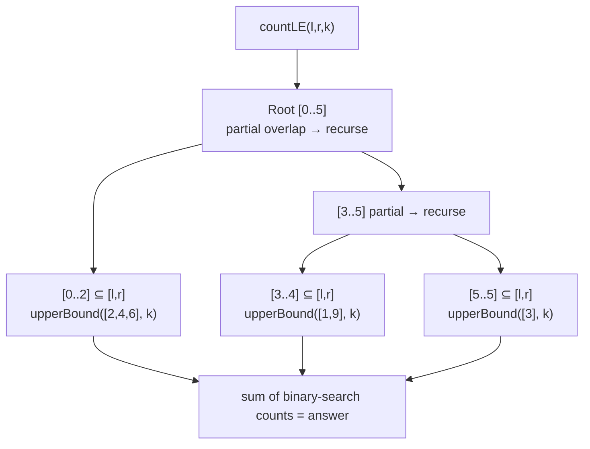

# Merge Sort Tree — Junior Level

> **Read time: ~35 minutes** · **Audience:** Engineers who already know arrays, binary search, and the basic idea of a segment tree, and who want to learn how to answer "how many elements in a range are ≤ k?" in logarithmic-ish time on a static array.

A **merge sort tree** is a segment tree in which **every node stores the sorted list of the elements in its range**. You build it exactly like merge sort: a leaf holds a one-element sorted list, and an internal node's list is the **merge** of its two children's sorted lists. Once built, you can answer queries such as *"how many elements in `A[l..r]` are ≤ k?"* by decomposing `[l, r]` into `O(log n)` canonical segment-tree nodes and **binary-searching** the sorted list at each one. Each binary search is `O(log n)`, and there are `O(log n)` nodes, so a query costs **`O(log² n)`**. Building costs `O(n log n)` time and `O(n log n)` space, because each of the `n` elements appears once on each of the `log n` levels of the tree.

The structure is the workhorse answer to a whole family of "range + order" questions: count of elements ≤ k in a range, count of elements in a value band `[a, b]` within an index range, and — with a bit more machinery — the k-th smallest element of a range. It is **offline-friendly and online-capable**, conceptually simple, and a favorite in competitive programming because you can code it in 40 lines and it "just works" on a static array.

The catch, and it is a real one: the array is essentially **static**. A point update would require re-sorting `O(log n)` lists touching `O(n)` total elements in the worst case, so the classic merge sort tree does not support efficient updates. If you need updates, you reach for a different tool (a BIT of sorted lists with sqrt rebuilds, a wavelet tree variant, or a balanced-BST-augmented segment tree). This document teaches the static structure thoroughly: how to build it, how the count-≤-k query works, why it is `O(log² n)`, and how it compares to the alternatives you will meet at the middle level.

---

## Table of Contents

1. [Introduction — Range + Order Queries](#introduction)
2. [Prerequisites — Segment Trees and Binary Search](#prerequisites)
3. [Glossary](#glossary)
4. [Core Concepts — Sorted Lists at Every Node](#core-concepts)
5. [Big-O Summary](#big-o-summary)
6. [Real-World Analogies](#analogies)
7. [Pros and Cons](#pros-and-cons)
8. [Step-by-Step Walkthrough](#walkthrough)
9. [Code Examples — Go, Java, Python](#code-examples)
10. [Coding Patterns — Build Like Merge Sort](#patterns)
11. [Error Handling — Off-by-One and Bounds](#errors)
12. [Performance Tips](#performance-tips)
13. [Best Practices](#best-practices)
14. [Edge Cases](#edge-cases)
15. [Common Mistakes](#common-mistakes)
16. [Cheat Sheet](#cheat-sheet)
17. [Visual Animation Reference](#animation)
18. [Summary](#summary)
19. [Further Reading](#further-reading)

---

<a name="introduction"></a>
## 1. Introduction — Range + Order Queries

You have an array `A` of `n` numbers. You want to answer, many times, questions that mix **a range of positions** with **an order condition on values**. The canonical one:

> **`countLE(l, r, k)`** — how many indices `i` with `l ≤ i ≤ r` satisfy `A[i] ≤ k`?

Two extreme approaches frame the problem:

- **Brute force.** For each query, scan `A[l..r]` and count. `O(n)` per query, `O(1)` preprocessing. Fine for a handful of queries; hopeless for `q = 10^5` queries on `n = 10^5` (that is `10^{10}` operations).
- **Per-value prefix sums.** Precompute, for every possible value `v`, a prefix-count array. `O(1)` per query but `O(n · V)` memory where `V` is the value range — impossible when values are large.

A merge sort tree threads the needle: **`O(n log n)` preprocessing**, **`O(log² n)` per query**, and **`O(n log n)` memory**. On `n = 10^5`, that is roughly `10^5 · 17 ≈ 1.7·10^6` cells of storage and about `17² ≈ 289` operations per query — instant.

The trick is to **store sorted information so that binary search can count.** A sorted list of `m` numbers answers "how many are ≤ k?" in `O(log m)` with a single `upperBound(k)` (the index of the first element strictly greater than `k`). If we had **one** sorted list covering the whole query range, we would be done in `O(log n)`. We almost never do — the query range `[l, r]` is arbitrary. But a segment tree decomposes **any** `[l, r]` into `O(log n)` precomputed canonical nodes, and if each node already holds its range sorted, we binary-search each one and add up the counts. That is the entire idea.

This pattern appears on `LC 315` (count of smaller numbers after self), `LC 327` (count of range sum), `LC 493` (reverse pairs), the classic SPOJ `KQUERY` and `MKTHNUM`, and countless Codeforces problems. In production it underlies **offline analytics** ("how many transactions in this time window were below the threshold?") on immutable, pre-sorted columnar data.

---

<a name="prerequisites"></a>
## 2. Prerequisites — Segment Trees and Binary Search

The merge sort tree is a **segment tree with an augmented payload**, so you should be comfortable with two ideas.

### 2.1 Segment-tree decomposition

A segment tree over `[0, n-1]` is a binary tree where the root covers the whole array, each internal node splits its range into two halves, and leaves cover single positions. Any query range `[l, r]` is covered by `O(log n)` **canonical nodes** — nodes whose ranges are fully inside `[l, r]` and whose parents are not. The standard recursive query descends from the root: if a node's range is disjoint from `[l, r]`, return the identity; if it is fully inside, return the node's contribution; otherwise recurse into both children.

```
query(node, [l, r]):
    if node.range disjoint from [l, r]: return identity
    if node.range ⊆ [l, r]:            return f(node)
    return combine(query(left, [l,r]), query(right, [l,r]))
```

For a **sum** segment tree, `f(node)` is the stored sum. For a **merge sort tree**, `f(node)` is `upperBound(node.sorted, k)` — a binary search counting how many of the node's elements are ≤ k.

### 2.2 `upperBound` / `lowerBound` on a sorted array

Given a sorted array `S`, `upperBound(S, k)` returns the number of elements `≤ k` (equivalently, the index of the first element `> k`). `lowerBound(S, k)` returns the number of elements `< k`. Both are standard binary searches in `O(log |S|)`:

| Query | Returns |
|---|---|
| `upperBound(S, k)` | count of `S[i] ≤ k` |
| `lowerBound(S, k)` | count of `S[i] < k` |
| `upperBound(S, b) − lowerBound(S, a)` | count of `S[i]` in `[a, b]` |

These map directly onto Go's `sort.SearchInts`, Java's `Arrays.binarySearch` (with care) or a hand-rolled bound, and Python's `bisect.bisect_right` / `bisect.bisect_left`. Knowing these three operations is enough to write the entire query.

---

<a name="glossary"></a>
## 3. Glossary

| Term | Definition |
|---|---|
| **Merge sort tree** | A segment tree where each node stores the sorted list of the array elements in its range. Built bottom-up by merging children's sorted lists, exactly like merge sort. |
| **Canonical node** | A segment-tree node whose range is fully contained in the query range while its parent's is not. Any `[l, r]` decomposes into `O(log n)` canonical nodes. |
| **`countLE(l, r, k)`** | The number of indices `i ∈ [l, r]` with `A[i] ≤ k`. The primary query. |
| **`countInBand(l, r, a, b)`** | The number of indices `i ∈ [l, r]` with `a ≤ A[i] ≤ b`. Computed as `countLE(l,r,b) − countLE(l,r,a−1)`. |
| **`upperBound(S, k)`** | Count of elements `≤ k` in sorted list `S`. Index of first element `> k`. |
| **`lowerBound(S, k)`** | Count of elements `< k` in sorted list `S`. Index of first element `≥ k`. |
| **k-th smallest in range** | The value that would sit at rank `k` if `A[l..r]` were sorted. Found by binary searching on the answer value, with a `countLE` check each step (`O(log² n · log V)` here; `O(log n)` with fractional cascading or a persistent/wavelet structure). |
| **Static array** | An array whose contents do not change after the structure is built. The merge sort tree's main limitation: efficient point updates are not supported. |
| **Offline query** | A query known in advance, before any answers are produced. Lets you batch and reorder for efficiency. |
| **Online query** | A query that arrives one at a time and must be answered before the next is seen (often with the next query depending on the previous answer). The merge sort tree handles both. |
| **Merge step** | Combining two sorted lists into one sorted list in linear time, the same routine used inside merge sort. |
| **Build level** | One horizontal layer of the tree. There are `⌈log₂ n⌉ + 1` levels; each level's nodes collectively store all `n` elements once. |

---

<a name="core-concepts"></a>
## 4. Core Concepts — Sorted Lists at Every Node

### 4.1 The shape of the tree

Start with a normal segment tree over `A[0..n-1]`. Instead of each node storing an aggregate number (sum, min, max), **each node stores a sorted copy of every array element in its range**.

For `A = [2, 6, 4, 1, 9, 3]` (n = 6), the tree looks like this, with each node showing its **range** and its **sorted list**:

```
                 [0..5] -> [1,2,3,4,6,9]
                /                       \
       [0..2] -> [2,4,6]          [3..5] -> [1,3,9]
        /        \                  /         \
 [0..1]->[2,6]  [2..2]->[4]   [3..4]->[1,9]  [5..5]->[3]
   /     \                      /     \
[0]->[2] [1]->[6]          [3]->[1]  [4]->[9]
```

Read the leaves left to right: `[2], [6], [4], [1], [9], [3]` — the original array, each as a one-element sorted list. Each internal node is the sorted merge of its two children. The root holds the **entire array sorted**.

Notice the key structural fact: **each element appears once per level.** Element `2` is in the leaf `[0]`, in `[0..1]`, in `[0..2]`, and in the root — exactly four times, once per level, because the tree is four levels deep. With `⌈log₂ n⌉ + 1` levels and `n` elements per level, the total stored data is `n · (⌈log₂ n⌉ + 1) = O(n log n)`.

### 4.2 Building by merging (just like merge sort)

A leaf's sorted list is `[A[i]]`. An internal node's sorted list is `merge(leftChild.sorted, rightChild.sorted)`. If you build bottom-up — compute children before parents — each merge is linear in the combined size. Summing the merge work over a level is `O(n)` (every element is touched once per merge at that level), and there are `O(log n)` levels, so the build is `O(n log n)` time. The space is the same `O(n log n)` because we store the merged lists.

This is **literally merge sort with the intermediate results kept**. Merge sort throws away the partial sorted lists once it has merged them upward; the merge sort tree keeps every one of them, indexed by which segment-tree node produced it. That is the whole construction.

### 4.3 The count-≤-k query: decompose, then binary-search

To answer `countLE(l, r, k)`:

1. Descend the segment tree as usual, decomposing `[l, r]` into `O(log n)` canonical nodes.
2. At each canonical node, do `upperBound(node.sorted, k)` — a binary search returning how many of that node's elements are `≤ k`.
3. Sum those counts.

Because the canonical nodes' ranges are **disjoint and cover `[l, r]` exactly**, the sum is precisely the count of `A[i] ≤ k` over `[l, r]`. Each binary search is `O(log n)` (the node's list has at most `n` elements), and there are `O(log n)` nodes, so the query is `O(log² n)`.



### 4.4 From count-≤-k to value bands and k-th smallest

Once `countLE` exists, other queries follow:

- **Count in band `[a, b]`** = `countLE(l, r, b) − countLE(l, r, a − 1)`.
- **Count strictly less than `k`** = `countLE(l, r, k − 1)` (for integer values) or a `lowerBound` variant.
- **k-th smallest in `[l, r]`** = binary-search on the answer value `v`: find the smallest `v` such that `countLE(l, r, v) ≥ k`. Each candidate check is `O(log² n)`, the outer search over the `O(log V)` distinct values is `O(log V)` (or `O(log n)` after coordinate compression), giving `O(log² n · log n)`. The middle and professional levels show how **fractional cascading** collapses the query to `O(log n)` total.

---

<a name="big-o-summary"></a>
## 5. Big-O Summary

| Operation | Time | Space |
|---|---|---|
| Build | O(n log n) | O(n log n) |
| `countLE(l, r, k)` | O(log² n) | O(1) extra |
| `countInBand(l, r, a, b)` | O(log² n) | O(1) extra |
| k-th smallest in range (naive) | O(log³ n) or O(log² n · log V) | O(1) extra |
| k-th smallest (fractional cascading) | O(log n) | O(n log n) (same as build) |
| Point update | **not supported efficiently** | — |
| Memory total | n(⌈log₂ n⌉ + 1) cells | |

For `n = 10^5`: storage is about `1.7·10^6` integers (≈ 13 MB at 8 bytes) and each `countLE` query is about `17² ≈ 289` comparisons. For `n = 10^6`: about `2·10^7` integers (≈ 160 MB at 8 bytes) — the memory cost starts to bite, which is exactly why the senior level discusses memory budgeting and rebuild strategies.

---

<a name="analogies"></a>
## 6. Real-World Analogies

### 6.1 A library organized by shelf, each shelf alphabetized

Imagine a library where books are grouped into shelves, shelves into bookcases, bookcases into rooms, and so on — a tree of nested groupings. Within **every** grouping (shelf, bookcase, room, floor), the books are sorted by title. To answer "how many books with title ≤ 'M' are in bookcases 3 through 7?", you do not scan every book. You pick the few groupings that exactly cover bookcases 3–7 and, within each, binary-search the alphabetized list for the cutoff 'M'. Sum the positions. That is a merge sort tree: nested ranges, each independently sorted, queried by decompose-then-binary-search.

The analogy breaks where updates come in: re-shelving one book means re-sorting every grouping that contains it, all the way up. That is why the structure is for **static** collections.

### 6.2 Russian nesting dolls, each labeled with a sorted index card

Each doll (segment) contains smaller dolls, and on each doll is taped an index card listing — in sorted order — every value inside it. To count values ≤ k inside some band of dolls, you open only the dolls whose ranges tile the band exactly and read each card's sorted list with a binary search. You never open the innermost dolls individually; the cards summarize them.

### 6.3 Tournament bracket where each node keeps a sorted roster

In `09-fenwick-tree`, the tournament analogy had each node track a **sum** (total wins). Here, each bracket node keeps the full **sorted roster** of every player in its subtree. "How many players with rating ≤ 1500 are in the left half of the bracket?" is a binary search on that half's roster. The price of keeping the full sorted roster instead of a single number is the `O(n log n)` memory — you trade space for the ability to answer order queries, not just additive ones.

---

<a name="pros-and-cons"></a>
## 7. Pros and Cons

### Pros

- **Answers range-order queries** (count ≤ k, count in band, k-th smallest) that a sum/Fenwick tree cannot, because the aggregate is not invertible.
- **Simple to build and reason about.** It is literally merge sort with the intermediate lists retained; ~40 lines of code.
- **Online-capable.** Queries can arrive one at a time and depend on previous answers — no need to know them all in advance (unlike a pure offline BIT sweep).
- **Stable `O(log² n)` query**, regardless of value distribution — no degeneracy.
- **Easy to extend** to count-in-band and (with binary search on the answer) to k-th smallest.

### Cons

- **`O(n log n)` memory.** Roughly `log n` times the input size. On `n = 10^6` this is hundreds of MB — often the deciding constraint.
- **Static.** No efficient point updates; the classic structure is read-only after build.
- **`O(log² n)` query**, a `log n` factor slower than a wavelet tree or a fractionally-cascaded variant for the same count query.
- **Slower constant factor** than a BIT-based offline sweep when the problem **is** offline and the values can be coordinate-compressed.
- **k-th smallest is awkward** in the basic form (extra `log` factor) unless you add fractional cascading or switch to a persistent segment tree / wavelet tree.

### When to use which

| Need | Use |
|---|---|
| Count ≤ k / in band on a **static** array, online | **Merge sort tree** |
| Same, but **offline** and values compressible | BIT + offline sweep (sort queries by k) |
| k-th smallest in range, **static**, tight constant | Wavelet tree or persistent segment tree |
| k-th smallest in range with **updates** | BIT/segment tree of sorted lists + sqrt rebuild, or Mo + BIT (offline) |
| Range sum / min / max (no order condition) | Segment tree or Fenwick tree |
| Count ≤ k with **point updates** | sqrt decomposition (sorted blocks) or merge-sort-tree-on-BIT with rebuilds |

The middle level builds out this comparison in full.

---

<a name="walkthrough"></a>
## 8. Step-by-Step Walkthrough

Use `A = [2, 6, 4, 1, 9, 3]` (0-indexed, n = 6). We will build the tree, then answer `countLE(1, 4, 5)` — "how many of `A[1], A[2], A[3], A[4]` are ≤ 5?".

### 8.1 Build (bottom-up merges)

```
Leaves:   [0]->[2]  [1]->[6]  [2]->[4]  [3]->[1]  [4]->[9]  [5]->[3]
Level up: [0..1]->merge([2],[6])=[2,6]
          [2..2]->[4]               (odd split; [2..2] is a leaf here)
          [3..4]->merge([1],[9])=[1,9]
          [5..5]->[3]
Next:     [0..2]->merge([2,6],[4])=[2,4,6]
          [3..5]->merge([1,9],[3])=[1,3,9]
Root:     [0..5]->merge([2,4,6],[1,3,9])=[1,2,3,4,6,9]
```

The exact split points depend on your build convention (`mid = (lo+hi)/2`); the principle is identical. The root holds the whole array sorted.

### 8.2 Query `countLE(1, 4, 5)`

The true answer: `A[1..4] = [6, 4, 1, 9]`; elements ≤ 5 are `4` and `1`, so the answer is **2**. Let's see the tree compute it.

Decompose `[1, 4]` into canonical nodes. A standard split (root covers `[0..5]`, `mid = 2`, left `[0..2]`, right `[3..5]`) yields:

```
node [0..2] partially overlaps [1,4] → recurse
   node [0..1] partially overlaps [1,4] → recurse
      node [0] = [0..0] disjoint from [1,4] → contributes 0
      node [1] = [1..1] ⊆ [1,4] → upperBound([6], 5) = 0   (6 > 5)
   node [2] = [2..2] ⊆ [1,4] → upperBound([4], 5) = 1       (4 ≤ 5)
node [3..5] partially overlaps [1,4] → recurse
   node [3..4] ⊆ [1,4] → upperBound([1,9], 5) = 1           (1 ≤ 5, 9 > 5)
   node [5] disjoint from [1,4] → contributes 0
```

Sum of canonical contributions: `0 (node[1]) + 1 (node[2]) + 1 (node[3..4]) = 2`. ✓

Canonical nodes used: `[1..1]`, `[2..2]`, `[3..4]` — three nodes covering `[1,4]` exactly, each binary-searched. Three binary searches, each `O(log n)`. That is the `O(log² n)` query in action.

### 8.3 Count in a band, e.g. `countInBand(0, 5, 3, 6)`

"How many of the whole array are in `[3, 6]`?" Compute `countLE(0,5,6) − countLE(0,5,2)`. The whole array maps to the **root** alone: `upperBound([1,2,3,4,6,9], 6) = 5` and `upperBound([1,2,3,4,6,9], 2) = 2`, so the band count is `5 − 2 = 3`. Check: array elements in `[3,6]` are `6, 4, 3` → three. ✓

---

<a name="code-examples"></a>
## 9. Code Examples — Go, Java, Python

We store the tree as a flat array of sorted slices, `tree[node]`, using the standard `1`-based segment-tree node numbering: node `1` is the root, node `v`'s children are `2v` and `2v+1`. We allocate `4n` node slots to be safe.

### 9.1 Build

**Go:**
```go
package mergesorttree

import "sort"

// MergeSortTree stores, at each segment-tree node, the sorted list of the
// array values in that node's index range. Static after Build. 0-indexed input.
type MergeSortTree struct {
	n    int
	tree [][]int // tree[v] is the sorted list for node v; nodes are 1-indexed
}

func Build(a []int) *MergeSortTree {
	n := len(a)
	t := &MergeSortTree{n: n, tree: make([][]int, 4*n)}
	if n > 0 {
		t.build(1, 0, n-1, a)
	}
	return t
}

// build constructs node v covering [lo, hi] by merging its children. O(n log n) total.
func (t *MergeSortTree) build(v, lo, hi int, a []int) {
	if lo == hi {
		t.tree[v] = []int{a[lo]}
		return
	}
	mid := (lo + hi) / 2
	t.build(2*v, lo, mid, a)
	t.build(2*v+1, mid+1, hi, a)
	t.tree[v] = merge(t.tree[2*v], t.tree[2*v+1])
}

// merge combines two sorted slices into one sorted slice. O(|x| + |y|).
func merge(x, y []int) []int {
	out := make([]int, 0, len(x)+len(y))
	i, j := 0, 0
	for i < len(x) && j < len(y) {
		if x[i] <= y[j] {
			out = append(out, x[i])
			i++
		} else {
			out = append(out, y[j])
			j++
		}
	}
	out = append(out, x[i:]...)
	out = append(out, y[j:]...)
	return out
}

// upperBound returns the count of elements <= k in sorted slice s. O(log |s|).
func upperBound(s []int, k int) int {
	return sort.Search(len(s), func(i int) bool { return s[i] > k })
}
```

**Java:**
```java
import java.util.*;

public final class MergeSortTree {
    private final int n;
    private final int[][] tree;     // tree[v] = sorted list for node v (1-indexed)

    public MergeSortTree(int[] a) {
        this.n = a.length;
        this.tree = new int[4 * Math.max(1, n)][];
        if (n > 0) build(1, 0, n - 1, a);
    }

    private void build(int v, int lo, int hi, int[] a) {
        if (lo == hi) {
            tree[v] = new int[]{ a[lo] };
            return;
        }
        int mid = (lo + hi) >>> 1;
        build(2 * v, lo, mid, a);
        build(2 * v + 1, mid + 1, hi, a);
        tree[v] = merge(tree[2 * v], tree[2 * v + 1]);
    }

    private static int[] merge(int[] x, int[] y) {
        int[] out = new int[x.length + y.length];
        int i = 0, j = 0, p = 0;
        while (i < x.length && j < y.length)
            out[p++] = (x[i] <= y[j]) ? x[i++] : y[j++];
        while (i < x.length) out[p++] = x[i++];
        while (j < y.length) out[p++] = y[j++];
        return out;
    }

    /** Count of elements <= k in sorted array s. O(log |s|). */
    private static int upperBound(int[] s, int k) {
        int lo = 0, hi = s.length;
        while (lo < hi) {
            int m = (lo + hi) >>> 1;
            if (s[m] <= k) lo = m + 1; else hi = m;
        }
        return lo;
    }
}
```

**Python:**
```python
import bisect


class MergeSortTree:
    """Segment tree whose every node stores the sorted list of its range.
    Static after construction. 0-indexed input. countLE in O(log^2 n)."""

    def __init__(self, a):
        self.n = len(a)
        self.tree = [None] * (4 * max(1, self.n))
        if self.n:
            self._build(1, 0, self.n - 1, a)

    def _build(self, v, lo, hi, a):
        if lo == hi:
            self.tree[v] = [a[lo]]
            return
        mid = (lo + hi) // 2
        self._build(2 * v, lo, mid, a)
        self._build(2 * v + 1, mid + 1, hi, a)
        # Python's sorted-merge: merge two already-sorted lists in linear time.
        self.tree[v] = self._merge(self.tree[2 * v], self.tree[2 * v + 1])

    @staticmethod
    def _merge(x, y):
        out = []
        i = j = 0
        while i < len(x) and j < len(y):
            if x[i] <= y[j]:
                out.append(x[i]); i += 1
            else:
                out.append(y[j]); j += 1
        out.extend(x[i:]); out.extend(y[j:])
        return out
```

### 9.2 The `countLE` query

**Go:**
```go
// CountLE returns the number of indices i in [l, r] with a[i] <= k. O(log^2 n).
func (t *MergeSortTree) CountLE(l, r, k int) int {
	if l > r || t.n == 0 {
		return 0
	}
	return t.query(1, 0, t.n-1, l, r, k)
}

func (t *MergeSortTree) query(v, lo, hi, l, r, k int) int {
	if r < lo || hi < l { // disjoint
		return 0
	}
	if l <= lo && hi <= r { // fully inside: binary-search this node's sorted list
		return upperBound(t.tree[v], k)
	}
	mid := (lo + hi) / 2
	return t.query(2*v, lo, mid, l, r, k) + t.query(2*v+1, mid+1, hi, l, r, k)
}

// CountInBand returns the number of i in [l, r] with a <= a[i] <= b. O(log^2 n).
func (t *MergeSortTree) CountInBand(l, r, a, b int) int {
	return t.CountLE(l, r, b) - t.CountLE(l, r, a-1)
}
```

**Java:**
```java
/** Number of indices i in [l, r] with a[i] <= k. O(log^2 n). */
public int countLE(int l, int r, int k) {
    if (l > r || n == 0) return 0;
    return query(1, 0, n - 1, l, r, k);
}

private int query(int v, int lo, int hi, int l, int r, int k) {
    if (r < lo || hi < l) return 0;              // disjoint
    if (l <= lo && hi <= r) return upperBound(tree[v], k);  // fully inside
    int mid = (lo + hi) >>> 1;
    return query(2 * v, lo, mid, l, r, k)
         + query(2 * v + 1, mid + 1, hi, l, r, k);
}

/** Number of i in [l, r] with a <= a[i] <= b. */
public int countInBand(int l, int r, int a, int b) {
    return countLE(l, r, b) - countLE(l, r, a - 1);
}
```

**Python:**
```python
    def count_le(self, l, r, k):
        """Number of indices i in [l, r] with a[i] <= k. O(log^2 n)."""
        if l > r or self.n == 0:
            return 0
        return self._query(1, 0, self.n - 1, l, r, k)

    def _query(self, v, lo, hi, l, r, k):
        if r < lo or hi < l:            # disjoint
            return 0
        if l <= lo and hi <= r:         # fully inside
            return bisect.bisect_right(self.tree[v], k)
        mid = (lo + hi) // 2
        return (self._query(2 * v, lo, mid, l, r, k)
                + self._query(2 * v + 1, mid + 1, hi, l, r, k))

    def count_in_band(self, l, r, a, b):
        """Number of i in [l, r] with a <= a[i] <= b."""
        return self.count_le(l, r, b) - self.count_le(l, r, a - 1)
```

### 9.3 Driver — verifying against brute force

**Python:**
```python
if __name__ == "__main__":
    a = [2, 6, 4, 1, 9, 3]
    t = MergeSortTree(a)
    assert t.count_le(1, 4, 5) == 2          # [6,4,1,9] -> 4,1
    assert t.count_in_band(0, 5, 3, 6) == 3  # 6,4,3
    # brute-force cross-check
    def brute(l, r, k):
        return sum(1 for i in range(l, r + 1) if a[i] <= k)
    for l in range(len(a)):
        for r in range(l, len(a)):
            for k in range(-1, 11):
                assert t.count_le(l, r, k) == brute(l, r, k)
    print("all good")
```

The brute-force `O(n)` reference is the gold standard for testing: generate random arrays and random `(l, r, k)`, and assert the tree matches. Always write this test.

---

<a name="patterns"></a>
## 10. Coding Patterns — Build Like Merge Sort

The single mental model to keep is: **the merge sort tree is merge sort, paused at every level.** Standard merge sort recurses, sorts each half, merges them, and discards the halves. The merge sort tree does the same recursion but **keeps every merged list**, tagging it with the segment-tree node that produced it.

The standard idioms:

```
build(v, lo, hi):
    if lo == hi: tree[v] = [A[lo]]; return
    mid = (lo + hi) / 2
    build(2v, lo, mid)
    build(2v+1, mid+1, hi)
    tree[v] = merge(tree[2v], tree[2v+1])      # linear merge of two sorted lists

query(v, lo, hi, l, r, k):
    if [lo,hi] disjoint from [l,r]: return 0
    if [lo,hi] ⊆ [l,r]:            return upperBound(tree[v], k)
    mid = (lo + hi) / 2
    return query(2v, lo, mid, l, r, k) + query(2v+1, mid+1, hi, l, r, k)
```

Two patterns extend this:

- **Band query** = two `countLE` calls subtracted: `countLE(l,r,b) − countLE(l,r,a−1)`.
- **k-th smallest** = binary search on the value `v`, asking `countLE(l, r, v) ≥ k?` each step. The smallest such `v` is the answer.

Once you have `build`, `merge`, `upperBound`, and `query`, you have the whole structure. Everything at the middle/senior/professional level is a re-skin of these four routines.

---

<a name="errors"></a>
## 11. Error Handling — Off-by-One and Bounds

### 11.1 `4n` allocation

The flat tree needs up to `4n` node slots with the `2v / 2v+1` numbering. Allocating `2n` overflows for some `n` (non-powers-of-two cause deeper-than-expected nodes). Always allocate `4 * n` (and guard `n == 0`). Under-allocation is the most common crash.

### 11.2 `upperBound` vs `lowerBound` confusion

`countLE(l, r, k)` must use **`upperBound`** (`bisect_right`, "first element `> k`") so that elements **equal** to `k` are counted. Using `lowerBound` (`bisect_left`) silently undercounts ties. For "strictly less than `k`", use `lowerBound`. Pick the right one per query and test with arrays full of duplicates.

### 11.3 Empty intersection returns 0, not identity garbage

The disjoint case must return `0`. A bug where the disjoint branch falls through and binary-searches anyway will overcount. The guard `if r < lo || hi < l: return 0` must come **first**.

### 11.4 Inclusive vs exclusive ranges

Decide once whether `[l, r]` is inclusive (both endpoints counted) and keep it consistent across `build`, `query`, and the public API. Mixing inclusive and exclusive conventions is a classic off-by-one. This document uses **inclusive** `[l, r]` everywhere.

### 11.5 Band with `a − 1` underflow

`countInBand(l, r, a, b)` computes `countLE(l, r, a − 1)`. If `a` is `Int.MIN`, `a − 1` underflows. Guard the lower bound, or use a `lowerBound`-based "count `< a`" call instead of `countLE(..., a-1)`.

---

<a name="performance-tips"></a>
## 12. Performance Tips

1. **Build bottom-up; never re-sort a parent from scratch.** Merging two sorted children is `O(m)`; sorting a parent's `m` elements afresh is `O(m log m)` and turns the whole build into `O(n log² n)`.

2. **Store each node's list contiguously.** Flat `int` arrays (Java `int[][]`, Go `[][]int`, NumPy in Python) beat trees of boxed objects on cache locality. The query is a binary search, which is already cache-unfriendly; do not add pointer chasing.

3. **Coordinate-compress if values are sparse/large.** Replacing values by their rank shrinks the numbers and lets you use `int32`. It also enables `O(log n)` outer binary search for k-th smallest instead of `O(log V)`.

4. **For purely offline `countLE` workloads, consider a BIT sweep instead.** Sorting queries by `k` and sweeping a Fenwick tree keyed by index is `O((n+q) log n)` total — often faster than `q · log² n` because it drops a `log` and has a tiny constant.

5. **Reserve slice capacity in `merge`.** Pre-allocate `len(x)+len(y)` to avoid repeated reallocation (`make([]int, 0, len(x)+len(y))` in Go, the fixed `out` array in Java).

6. **Iterative binary search beats `Arrays.binarySearch` for `upperBound`.** `Arrays.binarySearch` returns an undefined index among duplicates; hand-roll the bound to count ties correctly and avoid surprises.

7. **Watch memory before time.** At `n = 10^6`, the `O(n log n)` storage (~160 MB) is the real constraint. If it does not fit, switch to a wavelet tree (`O(n log V)` bits) or a persistent segment tree.

---

<a name="best-practices"></a>
## 13. Best Practices

- **Treat the tree as immutable after build.** Document loudly that updates are unsupported. If callers need updates, hand them a different structure.
- **Use `upperBound` for `≤ k` and `lowerBound` for `< k`.** Write both, name them clearly, and unit-test on duplicate-heavy arrays.
- **Allocate `4n` nodes.** Guard `n == 0`.
- **Coordinate-compress** when values are large or you want `int32` storage and `O(log n)` k-th-smallest search.
- **Cross-test against an `O(n)` brute force** on random inputs, including all-equal, sorted, reverse-sorted, and single-element arrays.
- **Profile memory first.** Decide early whether `O(n log n)` fits the budget; if not, pick a wavelet/persistent alternative before writing code.
- **Keep the inclusive-range convention consistent** across build, query, and the public surface.

---

<a name="edge-cases"></a>
## 14. Edge Cases

| Case | Behavior |
|---|---|
| `n = 0` | Empty tree. All queries return 0. Guard the constructor. |
| `n = 1` | Single leaf; root is `[A[0]]`. `countLE(0,0,k)` is `1` if `A[0] ≤ k` else `0`. |
| `l > r` | Empty range. Return 0; do not recurse. |
| `k` below all values | `countLE` returns 0 (every `upperBound` returns 0). |
| `k` at or above max value | `countLE(l, r, k)` returns `r − l + 1` (everything counted). |
| All elements equal | `upperBound` returns full size when `k ≥ value`, 0 otherwise. Correct with `≤`. |
| Duplicates | Handled correctly *iff* you use `upperBound` for `≤` and `lowerBound` for `<`. |
| Negative values | Fully supported; comparisons work on negatives. |
| Band with `a > b` | Empty band; returns a value `≤ 0`. Caller should validate `a ≤ b`. |

---

<a name="common-mistakes"></a>
## 15. Common Mistakes

1. **Allocating fewer than `4n` nodes.** Index-out-of-bounds on deep nodes.
2. **Re-sorting parents instead of merging children.** Turns the `O(n log n)` build into `O(n log² n)`.
3. **Using `lowerBound` for a `≤ k` count.** Undercounts ties; off by the number of elements equal to `k`.
4. **Forgetting the disjoint guard, or ordering it after the inside check.** Overcounts or recurses into out-of-range nodes.
5. **Expecting point updates to be cheap.** They are not; a single update can touch `O(n)` elements across the levels.
6. **Mixing inclusive/exclusive `[l, r]` conventions** between build and query.
7. **Storing boxed integers** (Python `int` objects, Java `Integer[]`) and then wondering why memory blew up — use primitive arrays.
8. **Ignoring the `O(n log n)` memory** until OOM at large `n`.
9. **Computing `countInBand` as `countLE(b) − countLE(a)` instead of `countLE(b) − countLE(a−1)`** — drops elements equal to `a`.
10. **Doing k-th smallest with a fresh `countLE` per candidate value over the raw value range** instead of binary-searching over compressed values — adds an unnecessary `log V` factor.

---

<a name="cheat-sheet"></a>
## 16. Cheat Sheet

```
BUILD(v, lo, hi)                       # O(n log n) total, O(n log n) space
    if lo == hi: tree[v] = [A[lo]]; return
    mid = (lo + hi) / 2
    BUILD(2v, lo, mid)
    BUILD(2v+1, mid+1, hi)
    tree[v] = MERGE(tree[2v], tree[2v+1])   # linear merge of sorted lists

COUNT_LE(v, lo, hi, l, r, k)           # O(log^2 n)
    if [lo,hi] ∩ [l,r] = ∅: return 0
    if [lo,hi] ⊆ [l,r]:     return upperBound(tree[v], k)   # count <= k
    mid = (lo + hi) / 2
    return COUNT_LE(2v, lo, mid, l, r, k)
         + COUNT_LE(2v+1, mid+1, hi, l, r, k)

COUNT_IN_BAND(l, r, a, b) = COUNT_LE(l,r,b) - COUNT_LE(l,r,a-1)

KTH_SMALLEST(l, r, k)                  # binary search on value
    find smallest v with COUNT_LE(l, r, v) >= k

upperBound(S, k) = index of first S[i] > k = count of S[i] <= k
lowerBound(S, k) = index of first S[i] >= k = count of S[i] <  k

COMPLEXITY
    build:        O(n log n) time, O(n log n) space
    countLE:      O(log^2 n)
    countInBand:  O(log^2 n)
    kth (naive):  O(log^2 n · log V)
    updates:      NOT supported efficiently (static array)
```

---

<a name="animation"></a>
## 17. Visual Animation Reference

See `animation.html` in this folder. It renders the original array on top and the merge sort tree below it, with **each node showing its index range and its sorted list**. Run a `countLE(l, r, k)` query and the animation highlights the `O(log n)` canonical nodes that tile `[l, r]`, runs a binary search inside each one's sorted list for the cutoff `k`, and accumulates the running answer — so you can literally watch "decompose into nodes, binary-search each, sum the counts." A Big-O panel and an operation log accompany the visualization.

Watching the canonical nodes light up for a few different ranges is the fastest way to internalize why the query is `O(log n)` nodes × `O(log n)` per binary search = `O(log² n)`.

---

<a name="summary"></a>
## 18. Summary

- A **merge sort tree** is a segment tree whose every node stores the **sorted list** of its range, built bottom-up by merging children — exactly like merge sort with the intermediate lists kept.
- It answers **`countLE(l, r, k)`** (and, by subtraction, count-in-band) in **`O(log² n)`**: decompose `[l, r]` into `O(log n)` canonical nodes and binary-search each node's sorted list.
- **Build** is `O(n log n)` time and `O(n log n)` space, because each element appears once per level and there are `log n` levels.
- The array is effectively **static**: efficient point updates are not supported, since one update can touch `O(n)` stored copies.
- **k-th smallest** in a range comes from binary-searching the answer value with a `countLE` check; naively `O(log³ n)`, reducible to `O(log n)` with fractional cascading (professional level).
- Pick a merge sort tree for **static, online range-order queries**. Prefer a BIT sweep when the workload is offline, a wavelet tree or persistent segment tree when you need tight k-th-smallest, and sqrt decomposition or Mo's algorithm when updates or pure offline batching change the trade-offs.

The merge sort tree is the friendliest entry point into "range + order" data structures: once you can write merge sort, you can write this, and it unlocks a large class of counting queries.

---

<a name="further-reading"></a>
## 19. Further Reading

- **CP-Algorithms** (cp-algorithms.com) — *"Merge sort tree"* / segment tree augmentation articles. The clearest free reference with the count-≤-k and k-th-smallest patterns.
- **Halim & Halim**, *Competitive Programming 4*, segment-tree augmentation sections. Covers the merge sort tree alongside the BIT-offline alternative with discussion of when to use each.
- **Cormen, Leiserson, Rivest, Stein (CLRS)** — chapter on order statistics and augmenting data structures; the conceptual foundation for "decompose and count."
- **SPOJ** — `KQUERY`, `KQUERYO`, `MKTHNUM` (k-th number). The canonical practice problems.
- **LeetCode** — 315, 327, 493, 2179, 2940. Range-order counting problems that the merge sort tree (or its cousins) solves.
- **Chazelle, B.** (1988) — *"A functional approach to data structures and its use in multidimensional searching"* — the theoretical lineage of fractional cascading, which speeds the query to `O(log n)`.
- Continue with `middle.md` for the k-th-smallest query and a full comparison against the wavelet tree, persistent segment tree, Mo's algorithm + BIT, and sqrt decomposition.

**Next step:** Read [`middle.md`](./middle.md) for k-th smallest in a range, the why/when of merge sort trees versus wavelet trees, persistent segment trees, Mo's algorithm + BIT, and sqrt decomposition.
