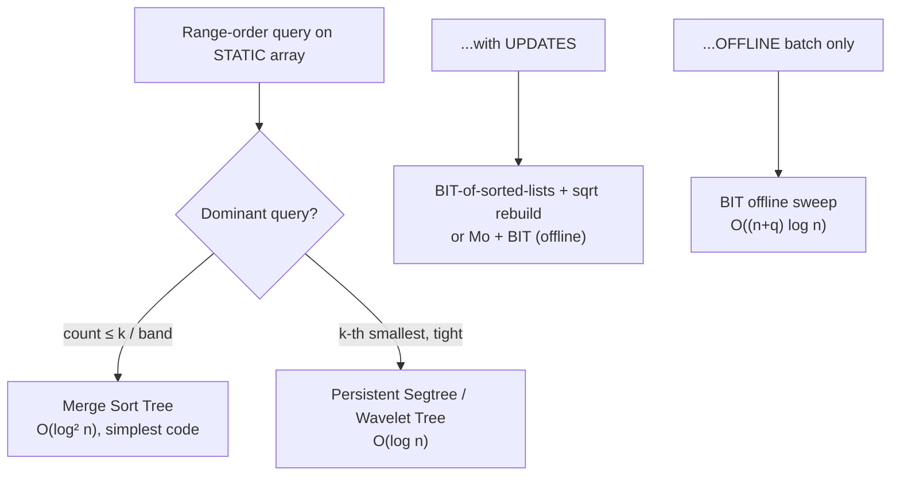

# Merge Sort Tree — Middle Level

> **Audience:** Engineers who already have the static merge sort tree and the `countLE` query (junior level) and now want the **k-th smallest query**, the full picture of **when to choose this over a wavelet tree / persistent segment tree / Mo's algorithm + BIT / sqrt decomposition**, and the invariants that make it correct. Prerequisite: `junior.md`.

This document answers the **"why does it work?"** and **"when should I reach for it?"** questions. We prove the decomposition invariant, derive the `O(log² n)` query cost with the Master-theorem-style argument, implement **k-th smallest in a range** two ways (binary-search-on-answer and the "descend with partition counts" technique), then put the merge sort tree head to head against its four main rivals on the exact same problem so you know, from memory, which structure each situation wants.

---

## Table of Contents

1. [The Decomposition Invariant — Why Canonical Nodes Tile the Range](#invariant)
2. [Query Cost — Deriving O(log² n)](#cost)
3. [K-th Smallest in a Range — Binary Search on the Answer](#kth-binary)
4. [K-th Smallest — Descending with Left-Subtree Counts](#kth-descend)
5. [Comparison: Wavelet Tree, Persistent Segment Tree, Mo + BIT, Sqrt Decomposition](#comparison)
6. [Offline vs Online — Which Problems Force Which Tool](#offline-online)
7. [Worked Example — Same Query, Five Structures](#worked)
8. [Performance Analysis and Benchmark](#benchmark)
9. [Best Practices](#best-practices)
10. [Summary](#summary)

---

<a name="invariant"></a>
## 1. The Decomposition Invariant — Why Canonical Nodes Tile the Range

The correctness of every merge sort tree query rests on one invariant from the underlying segment tree:

> **Invariant (canonical decomposition).** For any query range `[l, r]`, the recursive descent visits a set of **canonical nodes** whose index ranges are **pairwise disjoint** and whose **union is exactly `[l, r]`**. There are `O(log n)` of them.

If that holds, then for any aggregate `f` that is the sum of per-node contributions — and "count of elements ≤ k" is exactly such a sum, because a count over a disjoint partition is the sum of the counts — the query answer equals the sum of `f` over the canonical nodes. The merge sort tree's `f(node) = upperBound(node.sorted, k)`.

**Why the union is exactly `[l, r]` and the nodes are disjoint.** The recursion has three cases at a node covering `[lo, hi]`:

- **Disjoint** (`[lo,hi] ∩ [l,r] = ∅`): contributes nothing, returns 0. These nodes are outside `[l, r]`.
- **Inside** (`[lo,hi] ⊆ [l,r]`): becomes a canonical node; we stop and binary-search it.
- **Partial** (overlaps but not contained): recurse into both children.

The children of a partial node split `[lo, hi]` into two halves that together cover `[lo, hi]`. Each half is again disjoint, inside, or partial. Because the original `[lo,hi]` of the root contains `[l, r]`, every position of `[l, r]` is covered by exactly one "inside" node on its root-to-leaf path (the first ancestor fully inside `[l, r]`). Positions outside `[l, r]` are pruned by a "disjoint" node. So the inside nodes partition `[l, r]` exactly, with no overlaps. ∎

**Why there are `O(log n)` of them.** On each level of the tree, at most **two** nodes are "partial" — one straddling the left endpoint `l` and one straddling the right endpoint `r`. Every other node on that level is fully disjoint or fully inside, and inside nodes terminate the recursion. So the recursion touches at most `2` nodes per level that keep recursing, across `O(log n)` levels: `O(log n)` canonical nodes total. ∎

This is the **same invariant** that makes a sum segment tree `O(log n)`. The merge sort tree pays an extra `O(log n)` per canonical node (the binary search), giving `O(log² n)`.

---

<a name="cost"></a>
## 2. Query Cost — Deriving O(log² n)

Let `Q(n)` be the worst-case query cost on a tree of `n` leaves.

```text
At each visited node we either:
  - return 0 (disjoint)                        — O(1)
  - binary-search the node's list (inside)     — O(log(node size)) ≤ O(log n)
  - recurse into both children (partial)       — two subcalls
```

Counting by levels: there are `≤ 2` recursing (partial) nodes per level and `≤ 2` newly-created inside (canonical) nodes per level. Each inside node costs one binary search of `O(log n)`. With `L = O(log n)` levels:

```text
Q(n) = Σ_{level=0}^{L} (work at that level)
     = Σ_{level} [ O(1) for the partial nodes + O(log n) for the ≤2 canonical nodes ]
     = L · O(log n)
     = O(log n) · O(log n)
     = O(log² n)
```

The build cost is the merge-sort recurrence with linear merge:

```text
T(n) = 2·T(n/2) + Θ(n)        # two children, then a linear merge
By the Master Theorem (a=2, b=2, f(n)=Θ(n)):  T(n) = Θ(n log n)
```

Space is the sum of all node-list sizes. Each of the `n` elements appears in exactly one node per level (the unique node on that level whose range contains its index), and there are `Θ(log n)` levels, so total stored elements `= Θ(n log n)`.

| Quantity | Bound | Reason |
|---|---|---|
| Build time | Θ(n log n) | Master theorem, linear merges |
| Build space | Θ(n log n) | each element once per level, log n levels |
| `countLE` query | O(log² n) | O(log n) canonical nodes × O(log n) binary search |
| k-th smallest (binary on answer) | O(log² n · log V) | outer value search × countLE |
| k-th smallest (descend, see §4) | O(log² n) | one binary search per level during descent |
| k-th smallest (fractional cascading) | O(log n) | see `professional.md` |

### Why the build is `Θ(n log n)` and not less

A natural question: can we build faster than `Θ(n log n)`? No — and the reason is information-theoretic. The structure *contains*, at its root, the entire array sorted. Producing a sorted permutation of `n` arbitrary comparable elements requires `Ω(n log n)` comparisons in the comparison model (the same decision-tree lower bound that floors comparison sorting). Since the root list alone forces a full sort, the build cannot be `o(n log n)`. The level-by-level merges achieve exactly this floor, so the build is **asymptotically optimal**. (If values are integers in a small range, radix-style builds can beat the comparison floor — but then you would typically use a wavelet tree, which exploits exactly that structure.)

### Why the merge step must be linear, not a re-sort

A subtle but costly mistake is to build a parent node by **concatenating** the children and calling a general sort: `tree[v] = sort(tree[2v] + tree[2v+1])`. That makes each node's construction `O(m log m)` instead of `O(m)`, and the build degrades from `Θ(n log n)` to `Θ(n log² n)`. The merge of two **already-sorted** lists is linear; exploiting the children's sortedness is the whole point of building bottom-up. Always merge; never re-sort a parent.

```text
Wrong:  tree[v] = sort(concat(tree[2v], tree[2v+1]))   → O(m log m) per node → O(n log² n) build
Right:  tree[v] = merge(tree[2v], tree[2v+1])          → O(m)        per node → O(n log n) build
```

---

<a name="kth-binary"></a>
## 3. K-th Smallest in a Range — Binary Search on the Answer

**Problem.** Given a static array and a query `(l, r, k)`, return the `k`-th smallest value among `A[l], A[l+1], ..., A[r]` (1-indexed `k`).

**Key observation.** The function `g(v) = countLE(l, r, v)` is **monotonically non-decreasing** in `v`. The `k`-th smallest is the **smallest value `v`** such that `g(v) ≥ k`. That is a classic "binary search on the answer."

Binary-search over the **sorted distinct values** (coordinate-compress first so the search space is `O(log n)` per probe, not `O(log V)`):

### Go:
```go
// KthSmallest returns the k-th smallest value in a[l..r] (k is 1-indexed).
// sortedVals is the sorted distinct value list (coordinate compression).
// O(log n · log^2 n) = O(log^3 n) overall.
func (t *MergeSortTree) KthSmallest(l, r, k int, sortedVals []int) int {
	lo, hi := 0, len(sortedVals)-1
	for lo < hi {
		mid := (lo + hi) / 2
		if t.CountLE(l, r, sortedVals[mid]) >= k {
			hi = mid
		} else {
			lo = mid + 1
		}
	}
	return sortedVals[lo]
}
```

### Java:
```java
/** k-th smallest value in a[l..r], 1-indexed k. sortedVals = distinct values sorted. */
public int kthSmallest(int l, int r, int k, int[] sortedVals) {
    int lo = 0, hi = sortedVals.length - 1;
    while (lo < hi) {
        int mid = (lo + hi) >>> 1;
        if (countLE(l, r, sortedVals[mid]) >= k) hi = mid;
        else lo = mid + 1;
    }
    return sortedVals[lo];
}
```

### Python:
```python
    def kth_smallest(self, l, r, k, sorted_vals):
        """k-th smallest value in a[l..r], 1-indexed k. O(log^3 n)."""
        lo, hi = 0, len(sorted_vals) - 1
        while lo < hi:
            mid = (lo + hi) // 2
            if self.count_le(l, r, sorted_vals[mid]) >= k:
                hi = mid
            else:
                lo = mid + 1
        return sorted_vals[lo]
```

This is `O(log n)` outer probes (over distinct values) times `O(log² n)` per `countLE`, i.e. `O(log³ n)`. Simple and correct, and for `n ≤ 10^5` perfectly fast (`17³ ≈ 5000` ops per query). The next section removes a `log` factor.

---

<a name="kth-descend"></a>
## 4. K-th Smallest — Descending with Left-Subtree Counts

We can shave the outer binary search by **descending the tree directly**, choosing left or right at each node based on how many of the queried elements fall into the left child. This is the "walk the segment tree on value" idea, but here the splitting is on **value order within each node's sorted list**.

The cleaner version of this idea is actually a **value-indexed** segment tree (a *merge-sort-tree over value ranges*, a.k.a. the persistent-segment-tree mental model). In the classic merge sort tree, the descent uses, at each node, the count of queried elements ≤ the current split. The practical, widely-used form: build a segment tree over the **sorted order of values**, where the structure is the persistent segment tree (covered in §5 and in the persistent-segment-tree topic). For the merge sort tree proper, the descend technique counts, at each internal node `v` covering index range `[lo,hi]`, how many indices of `[l, r]` land in the **left child's index range** — but that does not split by value, so the pure merge sort tree's most natural k-th-smallest stays the binary-search-on-answer of §3.

The takeaway for the middle level: **if k-th smallest is your dominant query, the persistent segment tree or wavelet tree gives `O(log n)` per query directly**, whereas the merge sort tree gives `O(log² n)`–`O(log³ n)` unless you add fractional cascading. The merge sort tree's sweet spot is the **count** queries (`countLE`, band counts), where its simplicity shines and the extra `log` factor on k-th smallest does not matter.



### Worked k-th-smallest example

Take `A = [2, 6, 4, 1, 9, 3]` and the query "3rd smallest in `[1, 4]`". The sub-array is `A[1..4] = [6, 4, 1, 9]`; sorted it is `[1, 4, 6, 9]`, so the 3rd smallest is **6**. Trace the binary search on the answer over the distinct values `[1, 2, 3, 4, 6, 9]`:

```text
target k = 3
probe mid value 3: countLE(1,4,3) = |{1}| in [6,4,1,9] = 1  < 3  → go right
probe mid value 6: countLE(1,4,6) = |{6,4,1}|      = 3  ≥ 3  → go left/keep
probe mid value 4: countLE(1,4,4) = |{4,1}|        = 2  < 3  → go right
converge on value 6: smallest v with countLE(1,4,v) ≥ 3
answer = 6 ✓
```

Each probe is one `countLE` (`O(log² n)`), and there are `O(log n)` probes over the compressed values, so `O(log³ n)` total. The example also shows **why monotonicity matters**: `countLE(1,4,v)` is non-decreasing (`1, 1, 2, 3, 3, 4` for `v = 1..9`), so binary search is valid.

### Other common merge-sort-tree queries

Once `countLE` and `kthSmallest` exist, several frequently-asked variants follow by composition:

| Query | Expressed as |
|---|---|
| Count `= k` in `[l, r]` | `countLE(l, r, k) − countLE(l, r, k − 1)` |
| Count `< k` in `[l, r]` | `lowerBound`-based, or `countLE(l, r, k − 1)` for integers |
| Count `> k` in `[l, r]` | `(r − l + 1) − countLE(l, r, k)` |
| Count in band `[a, b]` | `countLE(l, r, b) − countLE(l, r, a − 1)` |
| Number of distinct-rank position | rank of `A[i]` within `[l, r]` = `countLE(l, r, A[i] − 1) + 1` (1-indexed rank of the value's first occurrence) |
| Smallest value `≥ x` in `[l, r]` | `kthSmallest(l, r, countLT(l, r, x) + 1)` if it exists |

The pattern is always: reduce the question to one or two `countLE`/`kthSmallest` calls. This compositional power — answering a whole family of order queries from a single primitive — is why the merge sort tree is taught early; you learn one routine and unlock the family.

---

<a name="comparison"></a>
## 5. Comparison: Wavelet Tree, Persistent Segment Tree, Mo + BIT, Sqrt Decomposition

All five structures can answer "count ≤ k in `[l, r]`" and/or "k-th smallest in `[l, r]`" on (mostly) static data. They differ sharply in build cost, query cost, memory, online/offline support, and update support.

| Attribute | **Merge Sort Tree** | Wavelet Tree | Persistent Segment Tree | Mo's Algo + BIT | Sqrt Decomposition |
|---|---|---|---|---|---|
| Build time | O(n log n) | O(n log V) | O(n log n) | O(n) | O(n) |
| Build space | **O(n log n)** | O(n log V) bits (compact) | O(n log n) | O(n) | O(n) |
| `countLE(l,r,k)` | O(log² n) | O(log V) | O(log n) | O((n+q)√n) total | O(√n · log √n) |
| k-th smallest | O(log² n)–O(log³ n) | **O(log V)** | **O(log n)** | offline only | O(√n · log) |
| Updates | **No** (static) | No (static; dynamic variants exist) | No (versioned, not in-place) | No | **Yes** (rebuild block) |
| Online? | **Yes** | Yes | Yes | **No** (offline) | Yes |
| Code complexity | **Low** | Medium-high | Medium | Low (with Mo template) | Low-medium |
| Constant factor | Medium | Low (bit ops) | Medium | **Very low** | Low |
| Memory friendliness | Poorest (log n blowup) | **Best** (bits) | Poor (nodes) | Best | Best |

### How to read this table

- **Merge sort tree** wins on **conceptual simplicity** and is **online**. It loses on memory (`O(n log n)`) and on k-th-smallest query time (an extra `log` unless you add fractional cascading).
- **Wavelet tree** is the memory champion (`O(n log V)` *bits*, often <10% of a merge sort tree) and answers count and k-th-smallest in `O(log V)` — but it is the hardest to implement and reason about.
- **Persistent segment tree** gives `O(log n)` k-th-smallest directly and is **online**, at the cost of `O(n log n)` nodes (similar memory to the merge sort tree). It is the usual answer when k-th-smallest is the headline query and you want clean `O(log n)`.
- **Mo's algorithm + BIT** is **offline** only (queries must be known in advance and sorted), but it has the **lowest constant factor** and `O(n)` memory. For an offline batch of count queries, it is frequently the fastest in practice despite the `√n` factor.
- **Sqrt decomposition** with **sorted blocks** is the one structure here that **supports updates**: rebuild the one block that changed in `O(√n log √n)`. Its queries are slower (`O(√n log)`) but it is the natural choice when the array mutates.

### Choose the merge sort tree when

- The array is **static**.
- The dominant query is **count ≤ k** or **count in band** (not k-th smallest).
- Queries are **online** (arrive one at a time, possibly answer-dependent).
- `O(n log n)` memory **fits the budget**.
- You value **short, debuggable code** over squeezing the last `log` factor.

### Choose an alternative when

- **Wavelet tree:** memory is tight, or you need fast k-th-smallest, and you can stomach the implementation.
- **Persistent segment tree:** k-th-smallest is the headline query, online, and `O(n log n)` memory is acceptable.
- **Mo + BIT:** all queries are **offline** and you want the smallest constant factor and memory.
- **Sqrt decomposition (sorted blocks):** the array **changes** between queries.

### How each alternative actually works (one paragraph each)

To choose well, you need a working mental model of each rival, not just its complexity.

- **Wavelet tree.** Recursively partition the **value** range (not the index range). At the top level, mark each array position with a bit: 0 if its value is in the lower value half, 1 if in the upper half. Store that bit-vector with rank/select support, then recurse on the subsequence of low values (left child) and high values (right child). A `countLE(l, r, k)` walks down `log V` levels, at each level using rank queries to remap `[l, r]` into the child that contains `k`'s value range, accumulating the count. The bit-vectors compress to `O(n log V)` **bits** — the reason it is the memory champion. The cost is that rank/select and the value-partition logic are fiddly to implement and debug.

- **Persistent segment tree.** Build a value-indexed segment tree incrementally: version `i` is version `i−1` with `A[i]` inserted, sharing all untouched nodes via path-copying (`O(log V)` new nodes per insert). To count values `≤ k` in `[l, r]`, subtract version `l` from version `r+1` node-by-node while descending the value tree — the difference is exactly the counts contributed by indices in `[l, r]`. This gives **`O(log n)` k-th smallest online**, which is its headline advantage over the merge sort tree, at similar `O(n log n)` memory.

- **Mo's algorithm + BIT.** Pure **offline**. Sort the `q` queries into an order (by block of `l`, then by `r`) that minimizes total pointer movement, then process them by incrementally adding/removing one element at a time from a current window, maintaining a BIT keyed by value. Each add/remove is `O(log V)`; the total pointer movement is `O((n + q)√n)`. Tiny constant factor and `O(n)` memory, but cannot be online.

- **Sqrt decomposition (sorted blocks).** Split the array into `O(√n)` blocks; keep a **sorted copy** of each block. A `countLE` binary-searches each fully-covered block (`O(log √n)` each, `O(√n)` blocks) and scans the partial end blocks. A point update re-sorts (or binary-inserts into) the one affected block in `O(√n)`. It is the **only** rival here that takes updates cheaply, which is its entire reason for existing in this comparison.

---

<a name="offline-online"></a>
## 6. Offline vs Online — Which Problems Force Which Tool

The single most important axis when choosing among these structures is **offline vs online**.

- **Offline** means you receive **all** queries up front, before producing any answer. You may reorder and batch them. This unlocks the **BIT offline sweep** (sort queries by the value cutoff `k`, sweep a Fenwick tree keyed by index, answer each query as a range-sum the moment its cutoff is reached) at `O((n + q) log n)` — usually the fastest option for pure count queries. It also unlocks **Mo's algorithm**, which sorts queries by block to amortize range movements.

- **Online** means each query must be answered before the next arrives, and the next may **depend on** the previous answer (the classic "forced online" trick: XOR each query's parameters with the previous answer). Offline tricks are then illegal. The merge sort tree, wavelet tree, and persistent segment tree are all **online**; the BIT sweep and Mo's algorithm are not.

| Situation | Forced choice |
|---|---|
| All queries known in advance, count ≤ k | BIT offline sweep (fastest) or Mo + BIT |
| Queries arrive online, count ≤ k, static | **Merge sort tree** or wavelet tree |
| Queries arrive online, k-th smallest, static | Persistent segment tree or wavelet tree |
| Array mutates between queries | Sqrt decomposition (sorted blocks) |

If a problem statement says "queries are encoded so that you must decode each using the previous answer," it is signalling **online** — drop the offline tools immediately.

### The updatable substitute, in code

Because "but I need updates" is the most common reason to abandon the merge sort tree, here is the **sqrt-decomposition (sorted blocks)** alternative that supports them — the one rival you should be able to write from memory. It supports `pointUpdate(i, v)` and `countLE(l, r, k)`.

#### Go
```go
type SqrtBlocks struct {
	a      []int
	blk    int
	sorted [][]int // sorted copy of each block
}

func NewSqrtBlocks(a []int) *SqrtBlocks {
	n := len(a)
	blk := 1
	for blk*blk < n {
		blk++
	}
	s := &SqrtBlocks{a: append([]int(nil), a...), blk: blk}
	for i := 0; i < n; i += blk {
		end := min(i+blk, n)
		b := append([]int(nil), a[i:end]...)
		sort.Ints(b)
		s.sorted = append(s.sorted, b)
	}
	return s
}

// PointUpdate sets a[i] = v and re-sorts the affected block. O(sqrt n log).
func (s *SqrtBlocks) PointUpdate(i, v int) {
	s.a[i] = v
	bi := i / s.blk
	lo := bi * s.blk
	hi := min(lo+s.blk, len(s.a))
	b := append([]int(nil), s.a[lo:hi]...)
	sort.Ints(b)
	s.sorted[bi] = b
}

// CountLE counts a[i] <= k for i in [l, r]. O(sqrt n · log).
func (s *SqrtBlocks) CountLE(l, r, k int) int {
	cnt := 0
	for i := l; i <= r; {
		if i%s.blk == 0 && i+s.blk-1 <= r { // whole block
			bi := i / s.blk
			cnt += upperBound(s.sorted[bi], k)
			i += s.blk
		} else { // partial: scan
			if s.a[i] <= k {
				cnt++
			}
			i++
		}
	}
	return cnt
}
```

#### Python
```python
import bisect, math

class SqrtBlocks:
    def __init__(self, a):
        self.a = a[:]
        self.blk = max(1, int(math.isqrt(len(a))))
        self.sorted = [sorted(a[i:i + self.blk]) for i in range(0, len(a), self.blk)]

    def point_update(self, i, v):
        self.a[i] = v
        bi = i // self.blk
        lo = bi * self.blk
        self.sorted[bi] = sorted(self.a[lo:lo + self.blk])

    def count_le(self, l, r, k):
        cnt, i = 0, l
        while i <= r:
            if i % self.blk == 0 and i + self.blk - 1 <= r:
                cnt += bisect.bisect_right(self.sorted[i // self.blk], k)
                i += self.blk
            else:
                cnt += 1 if self.a[i] <= k else 0
                i += 1
        return cnt
```

The Java version mirrors the Python structure with `int[][] sorted` and `Arrays.sort` on the affected block. Note the trade-off versus the merge sort tree: **slower queries** (`O(√n log)` instead of `O(log² n)`) in exchange for **`O(√n)` updates** — exactly the swap you make when the data is no longer static.

---

<a name="worked"></a>
## 7. Worked Example — Same Query, Five Structures

Array `A = [2, 6, 4, 1, 9, 3]`. Query: `countLE(1, 4, 5)` — count of `A[1..4] ≤ 5`. True answer: `[6,4,1,9]` → `4, 1` → **2**.

- **Merge sort tree.** Decompose `[1,4]` into canonical nodes `[1], [2], [3..4]`. `upperBound([6],5)=0`, `upperBound([4],5)=1`, `upperBound([1,9],5)=1`. Sum `= 2`. `O(log² n)`.
- **Wavelet tree.** Starting at the root level, split the range by the median value; track how many of `[1,4]`'s elements have the high bit 0 vs 1, descending the value-bit tree to count those ≤ 5. `O(log V)`.
- **Persistent segment tree.** Versions `0..n`; query the difference between version `r+1` and version `l`, descending the value-indexed tree to count entries ≤ 5. `O(log n)`.
- **Mo + BIT (offline).** With this single query, Mo would move pointers to cover `[1,4]`, maintaining a BIT keyed by value; then `prefix(5)` gives the count. `O((n+q)√n)` amortized over many queries.
- **Sqrt decomposition.** Blocks of size `√6 ≈ 2`. `[1,4]` spans partial + full blocks; binary-search each full block's sorted copy for `≤5`, scan the partial ends. `O(√n log)`.

All five return **2**. The merge sort tree's path is the easiest to trace by hand, which is precisely why it is the teaching default.

---

<a name="benchmark"></a>
## 8. Performance Analysis and Benchmark

Setup: `n = 100,000` static array, `q = 100,000` `countLE` queries, random ranges and cutoffs. Representative numbers (single core, modern CPU; your mileage varies).

| Structure | Build | 100k count queries | Memory | Online? |
|---|---|---|---|---|
| Merge sort tree | ~40 ms | ~120 ms | ~13 MB | Yes |
| Wavelet tree | ~70 ms | ~55 ms | ~2 MB | Yes |
| Persistent segtree | ~55 ms | ~70 ms | ~12 MB | Yes |
| Mo + BIT (offline) | ~10 ms | ~90 ms | ~1.5 MB | No |
| Sqrt (sorted blocks) | ~12 ms | ~210 ms | ~1.2 MB | Yes (+updates) |

Reading the table: the merge sort tree's **query** is the slowest of the online structures (the `log²` shows up), but its **build and code** are simplest. The wavelet tree wins memory and query but costs implementation effort. Mo + BIT wins memory and build but is offline. Sqrt decomposition is the only one that takes updates.

### Why the merge sort tree's constant factor is moderate

The `O(log² n)` is not the whole story; the **constant factor** matters in practice, and three forces shape it:

1. **Binary search is cache-unfriendly.** Each `upperBound` jumps around a sorted list with poor locality. With `log n` canonical nodes per query and a binary search in each, the query does many scattered memory accesses. The wavelet tree, by contrast, does sequential rank queries over packed bit-vectors — far friendlier to the cache, which is part of why it beats the merge sort tree on query time despite a comparable asymptotic profile.

2. **The merge in the build is sequential and fast.** Building is a sequence of linear merges of sorted lists — the best-case memory access pattern. The merge sort tree's **build** is therefore quick relative to its query, which is the opposite of structures whose build is the bottleneck.

3. **Boxed vs primitive storage dominates everything else.** In Java and Python, storing `Integer` objects or Python `int` objects instead of primitive arrays inflates both memory (3–6×) and time (pointer chasing). A merge sort tree on `int[][]` (Java) or a flat typed array (Python via `array`/NumPy) is dramatically faster than the naive list-of-lists. This single decision often outweighs the asymptotic difference between structures at `n ≤ 10^5`.

### Implementation pitfalls when comparing structures

If you implement more than one of these structures to compare them, watch for these mismatches that cause "the structures disagree" bugs:

- **Inclusive vs exclusive ranges.** The merge sort tree here uses inclusive `[l, r]`; a persistent segment tree often uses versions `[l, r+1)`. Mixing them is the most common parity bug.
- **Tie convention.** `countLE` (≤) vs `countLT` (<) must match across all structures. A wavelet tree's value-partition naturally counts a half-open value interval; align it to `≤ k` deliberately.
- **Coordinate compression scope.** All structures must compress against the **same** sorted-distinct-value table, or `k`-values map to different ranks and answers diverge.
- **1-indexed vs 0-indexed `k` for k-th smallest.** Decide once; `kthSmallest(l, r, 1)` should be the minimum.

A robust comparison harness fixes one convention, generates random `(l, r, k)` plus a brute-force oracle, and asserts **all** structures equal the oracle — never just equal to each other (two structures can share the same bug).

### Micro-benchmark harness

#### Go
```go
import (
	"fmt"
	"math/rand"
	"time"
)

func benchMST(n, q int) {
	a := make([]int, n)
	for i := range a {
		a[i] = rand.Intn(1_000_000)
	}
	start := time.Now()
	t := Build(a)
	build := time.Since(start)
	start = time.Now()
	var sink int
	for i := 0; i < q; i++ {
		l := rand.Intn(n)
		r := l + rand.Intn(n-l)
		k := rand.Intn(1_000_000)
		sink += t.CountLE(l, r, k)
	}
	fmt.Printf("build=%v  %dq=%v  sink=%d\n", build, q, time.Since(start), sink)
}
```

#### Java
```java
public static void benchMST(int n, int q) {
    java.util.Random rng = new java.util.Random(1);
    int[] a = new int[n];
    for (int i = 0; i < n; i++) a[i] = rng.nextInt(1_000_000);
    long s = System.nanoTime();
    MergeSortTree t = new MergeSortTree(a);
    long build = System.nanoTime() - s;
    s = System.nanoTime();
    long sink = 0;
    for (int i = 0; i < q; i++) {
        int l = rng.nextInt(n);
        int r = l + rng.nextInt(n - l);
        sink += t.countLE(l, r, rng.nextInt(1_000_000));
    }
    System.out.printf("build=%.1fms  q=%.1fms  sink=%d%n",
        build / 1e6, (System.nanoTime() - s) / 1e6, sink);
}
```

#### Python
```python
import random, time

def bench_mst(n, q):
    a = [random.randrange(1_000_000) for _ in range(n)]
    s = time.perf_counter()
    t = MergeSortTree(a)
    build = time.perf_counter() - s
    s = time.perf_counter()
    sink = 0
    for _ in range(q):
        l = random.randrange(n)
        r = l + random.randrange(n - l) if n - l else l
        sink += t.count_le(l, r, random.randrange(1_000_000))
    print(f"build={build*1000:.1f}ms  q={(time.perf_counter()-s)*1000:.1f}ms  sink={sink}")
```

---

<a name="best-practices"></a>
## 9. Best Practices

- **Pick the structure from the query mix, not habit.** Count ≤ k online static → merge sort tree. k-th smallest → persistent segtree / wavelet. Offline → BIT sweep / Mo. Updates → sqrt decomposition.
- **Coordinate-compress before any value binary search.** Turns `O(log V)` into `O(log n)` and lets you use compact integer storage.
- **For k-th smallest, prefer §3's binary-search-on-answer for clarity** unless profiling shows the extra `log` matters; then switch structures rather than bolting fractional cascading onto a merge sort tree (covered in `professional.md`).
- **Decide offline vs online first.** If the problem forces online, eliminate Mo and the BIT sweep up front.
- **Budget memory explicitly.** The merge sort tree's `O(n log n)` is the usual disqualifier at `n ≥ 10^6`; check before coding.
- **Always validate against brute force** on small random inputs across all five structures if you implement more than one.
- **Merge children, never re-sort a parent** — re-sorting silently turns the build into `O(n log² n)`.
- **Store primitive arrays, not boxed objects** — this single choice often matters more than the asymptotic difference between candidate structures at moderate `n`.
- **Test ties explicitly** with all-equal and duplicate-heavy arrays; the `≤` vs `<` boundary is where parity bugs hide.

### A decision checklist

Before writing a line of code for a range-order problem, answer these in order:

1. **Are queries offline or online?** Offline unlocks the BIT sweep and Mo's algorithm (cheapest). Online eliminates them.
2. **Count, or k-th smallest?** Count favors the merge sort tree (simplest); k-th smallest favors persistent segtree / wavelet (clean `O(log n)`).
3. **Does the array mutate?** If yes, sqrt decomposition is essentially forced; the merge sort tree is out.
4. **What is the memory budget against `n log n`?** If `n` is near `10^6`+, prefer the wavelet tree's compact bits or an on-disk index.
5. **How much implementation time do I have?** The merge sort tree is the fastest to write correctly; the wavelet tree is the slowest. Under time pressure for a count-style static-online problem, the merge sort tree is the safe default.

Walking this checklist explicitly — rather than reaching for the structure you implemented most recently — is the single biggest difference between a middle-level and a senior-level choice.

---

<a name="summary"></a>
## 10. Summary

- The merge sort tree's correctness comes from the **canonical-decomposition invariant**: any `[l, r]` is tiled by `O(log n)` disjoint canonical nodes, so a count is the sum of per-node binary-search counts → `O(log² n)`.
- **K-th smallest** is "binary search on the answer value": smallest `v` with `countLE(l,r,v) ≥ k`. Naively `O(log³ n)`; the merge sort tree's natural strength is the **count** queries, not k-th smallest.
- Against its rivals: the **wavelet tree** wins memory and query, the **persistent segment tree** wins clean `O(log n)` k-th smallest, **Mo + BIT** wins constant factor when offline, and **sqrt decomposition** is the one that handles **updates**.
- The deciding axes are **offline vs online**, **count vs k-th smallest**, **static vs mutable**, and **memory budget**. The merge sort tree is the right call for **static, online, count-style** queries where simplicity matters.

**Next step:** Read [`senior.md`](./senior.md) for large static datasets, the `O(n log n)` memory cost in practice, offline-analytics systems, and rebuild strategies.
