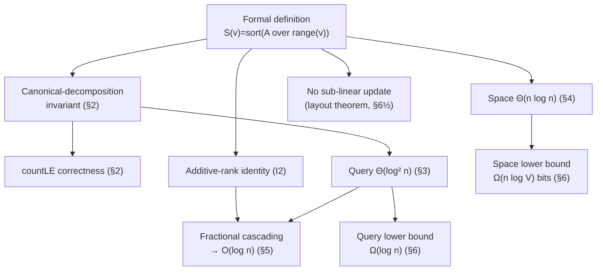

# Merge Sort Tree — Mathematical Foundations and Complexity Theory

> **Audience:** Engineers and library authors who need the merge sort tree proven, not just described — the `O(log² n)` query and `O(n log n)` space bounds with full arguments, the **fractional cascading** transformation that collapses the query to `O(log n)`, and the lower bounds that say what is and is not achievable. Prerequisite: all earlier levels.

This document treats the merge sort tree as a formal object. We give a precise definition, prove correctness of `countLE` via the canonical-decomposition invariant, prove the `O(log² n)` query and `O(n log n)` build/space bounds, then present **fractional cascading** with a correctness and complexity argument that brings the multi-list "count ≤ k" query from `O(log² n)` to `O(log n)`. We close with information-theoretic lower bounds for range-order queries and a comparison table at the level of worst-case and cache complexity.

The guiding principle of this level is that **every claim is paired with a proof or a cited theorem**. Where the engineering levels say "it's static" or "memory is the constraint," here we prove *why*: the static nature is a `Θ(n)`-update theorem forced by the array layout, and the memory is a matched pair of an `Θ(n log n)`-word upper bound and an `Ω(n log V)`-bit information-theoretic lower bound. The payoff is the ability to answer "can we do better?" with a definite yes-or-no plus the model that settles it — comparison, cell-probe, or information-theoretic — rather than a hopeful "maybe."

The dependency structure of the proofs in this document:



---

## Table of Contents

1. [Formal Definition](#formal-definition)
2. [Correctness Proof — Canonical Decomposition Invariant](#correctness)
3. [Query Complexity — O(log² n) Upper Bound](#query-complexity)
4. [Build and Space Complexity — O(n log n)](#build-space)
5. [Fractional Cascading — From O(log² n) to O(log n)](#fractional-cascading)
6. [Lower Bounds for Range-Order Queries](#lower-bounds)
7. [Cache-Oblivious and External-Memory Notes](#cache)
8. [Comparison with Alternatives](#comparison)
9. [Summary](#summary)

---

<a name="formal-definition"></a>
## 1. Formal Definition

A merge sort tree is the canonical example of an **augmented segment tree**: the underlying tree is a standard segment tree over index intervals, and the augmentation replaces the usual scalar aggregate (sum, min, max) at each node with a richer payload — here, the sorted multiset of values in the node's range. The richer payload is what lifts the structure from answering additive aggregates to answering **order** queries, at the documented cost in space.

```text
Let A = (A[0], A[1], ..., A[n-1]) be a fixed sequence over a totally ordered
universe (U, ≤).

The segment tree T over [0, n-1] is a binary tree whose nodes v are identified
with index intervals range(v) = [lo(v), hi(v)] such that:
  - the root r has range(r) = [0, n-1];
  - a leaf has lo(v) = hi(v);
  - an internal node v with mid = ⌊(lo(v)+hi(v))/2⌋ has
        range(left(v))  = [lo(v), mid],
        range(right(v)) = [mid+1, hi(v)].

The MERGE SORT TREE M(A) augments each node v with a payload:
        S(v) = sort( { A[i] : i ∈ range(v) } )    (a multiset, sorted ascending)

Equivalently, defined recursively:
        S(v) = [A[lo(v)]]                       if v is a leaf,
        S(v) = merge(S(left(v)), S(right(v)))    otherwise,
where merge is the linear-time merge of two ascending sequences.

Query primitive:
        countLE(l, r, k) = |{ i : l ≤ i ≤ r ∧ A[i] ≤ k }|.

Per-node contribution:
        f_k(v) = |{ x ∈ S(v) : x ≤ k }| = upperBound(S(v), k).
```

The structure is **immutable**: `S(v)` depends only on `A`, which is fixed. There is no update operation in the formal object; "update" would require recomputing `S(v)` for every `v` on a root-to-leaf path, touching `Θ(n)` payload elements in the worst case (the root's list alone has `n` elements).

### A useful structural identity

Two identities are used throughout the proofs and worth stating once:

```text
(I1) Multiset union:   S(v) = S(left(v)) ⊎ S(right(v))    (⊎ = multiset union)
     — because range(v) = range(left(v)) ⊍ range(right(v)) is a disjoint index union,
       and S collects exactly the values over those indices.

(I2) Additive rank:    rank(S(v), x) = rank(S(left(v)), x) + rank(S(right(v)), x)
     for every key x, where rank(S, x) = |{ y ∈ S : y < x }| (or ≤, fixed consistently).
     — immediate from (I1): the count of elements below x in a multiset union is the sum
       of the counts in the parts.
```

`(I1)` justifies the linear merge in the build; `(I2)` is the algebraic engine behind fractional cascading (§5.6). The invariant `S(v) = sort(A over range(v))` is maintained by construction and, because `A` is fixed, holds for all time — there is no operation that can violate it, which is the formal restatement of immutability.

---

<a name="correctness"></a>
## 2. Correctness Proof — Canonical Decomposition Invariant

We prove that the recursive `countLE` returns exactly `|{ i ∈ [l,r] : A[i] ≤ k }|`.

```text
Algorithm Q(v, l, r, k):
    if range(v) ∩ [l, r] = ∅:        return 0
    if range(v) ⊆ [l, r]:            return f_k(v)        # = upperBound(S(v), k)
    return Q(left(v), l, r, k) + Q(right(v), l, r, k)

Claim: Q(root, l, r, k) = countLE(l, r, k).
```

**Lemma (canonical partition).** Let `C` be the set of nodes `v` at which `Q` returns `f_k(v)` (the "inside" nodes). Then `{ range(v) : v ∈ C }` is a partition of `[l, r]`: the ranges are pairwise disjoint and their union is exactly `[l, r]`.

*Proof of Lemma.* Consider the recursion tree of `Q`. A node returns `f_k(v)` iff `range(v) ⊆ [l, r]` and its parent was a "partial" node (otherwise `Q` would not have been called on `v` from a recursing parent, or `v` would be the root with `range ⊆ [l,r]`). Define, for each position `p ∈ [l, r]`, the path from the root to leaf `p`. Walking down this path, ranges shrink and all contain `p`. There is a **first** node `u_p` on the path with `range(u_p) ⊆ [l, r]` (the leaf `p` itself satisfies this, so such a node exists; take the highest one). `Q` recurses through every strict ancestor of `u_p` (each is "partial" because it contains `p ∈ [l,r]` but also, being a strict ancestor, contains a position outside `[l,r]` or is partial — more precisely, ancestors above `u_p` are not fully inside, else `u_p` would not be the highest fully-inside node). At `u_p`, `Q` returns `f_k(u_p)` and stops. Hence exactly one inside node covers `p`. So every `p ∈ [l, r]` is covered by exactly one node of `C` (disjointness + coverage). Positions outside `[l, r]` are covered by no inside node, because an inside node's range is `⊆ [l,r]`. ∎

**Proof of Claim.** Because counting is additive over a partition:

```text
countLE(l, r, k) = |{ i ∈ [l,r] : A[i] ≤ k }|
                 = Σ_{v ∈ C} |{ i ∈ range(v) : A[i] ≤ k }|     (partition)
                 = Σ_{v ∈ C} |{ x ∈ S(v) : x ≤ k }|             (S(v) = sorted A over range(v))
                 = Σ_{v ∈ C} f_k(v)
                 = Q(root, l, r, k).
```

The disjoint nodes whose union is `[l, r]` make the sum exact; `S(v)` containing precisely the multiset of `A` over `range(v)` makes each term exact. ∎

### Correctness of k-th smallest (binary search on the answer)

We also prove the k-th-smallest reduction correct, since it is the second core primitive.

```text
Claim: For 1 ≤ k ≤ (r − l + 1), the k-th smallest value in A[l..r] equals
       v* = min { v ∈ values : countLE(l, r, v) ≥ k }.

Proof.
  Define g(v) = countLE(l, r, v). Two properties:
  (P1) g is non-decreasing in v       — adding to the threshold can only include more elements.
  (P2) g(maxVal) = r − l + 1 ≥ k      — every element is ≤ the max, so the set in (P) is nonempty.

  By (P1)+(P2), v* is well-defined (least element of a nonempty, upward-closed set).

  Let w be the true k-th smallest of A[l..r]. Then exactly k of the range's elements are ≤ w
  is NOT quite right with ties; precisely, g(w) ≥ k (the k smallest are all ≤ w) and
  g(w − ε) < k for any value just below w (fewer than k elements are < w). Hence w is the least
  v with g(v) ≥ k, i.e. w = v*. ∎  (With ties, "w − ε" is the previous distinct value; over the
  coordinate-compressed value set the argument is exact.)
```

Monotonicity `(P1)` is what makes the outer binary search valid; without it, binary-searching the answer would be unsound. The compressed-value formulation removes the `ε` hand-waving by making "the value just below `w`" a concrete previous rank.

---

<a name="query-complexity"></a>
## 3. Query Complexity — O(log² n) Upper Bound

**Theorem.** `Q(root, l, r, k)` runs in `O(log² n)` time.

*Proof.* Two facts:

1. **The recursion visits `O(log n)` nodes per level, and there are `O(log n)` levels.** On any fixed level `d`, the nodes have disjoint ranges of equal length. Among them, at most two are "partial" with respect to `[l, r]` — the one whose range contains `l` and the one whose range contains `r` (a range strictly between `l` and `r` is fully inside; a range entirely left of `l` or right of `r` is disjoint). Only partial nodes recurse to the next level. So at most two nodes recurse from level `d` to level `d+1`, giving at most `2` partial nodes and at most `2·2 = O(1)` children examined per level. Summed over `L = ⌈log₂ n⌉ + 1` levels, the total number of visited nodes is `O(log n)`, of which `O(log n)` are "inside" (canonical).

2. **Each inside node costs one binary search of `O(log n)`.** `f_k(v) = upperBound(S(v), k)` on a sorted list of size `|S(v)| ≤ n` is `O(log |S(v)|) = O(log n)`. Disjoint and "outside" nodes cost `O(1)`.

Total: `O(log n)` inside nodes × `O(log n)` per binary search + `O(log n)` overhead `= O(log² n)`. ∎

The bound is **tight** in the worst case: a query spanning nearly the whole array produces `Θ(log n)` canonical nodes, the larger of which have `Θ(n)` elements, each binary-searched in `Θ(log n)`, so `Θ(log² n)` work is genuinely incurred — there is no shortcut without changing the structure (which §5 does).

### Worked complexity trace

Make the per-level accounting concrete for `n = 16` (so `L = 5` levels, ranges of size 16, 8, 4, 2, 1) and the query `[3, 12]`:

```text
level 0: node [0..15]  partial (3 and 12 inside) → recurse                (1 partial)
level 1: [0..7] partial (3 inside), [8..15] partial (12 inside) → recurse (2 partial)
level 2: [0..3] partial(3), [4..7] INSIDE, [8..11] INSIDE, [12..15] partial(12)
                                                          (2 partial, 2 canonical)
level 3: [2..3] INSIDE, [12..13] partial(12) ; also [0..1] disjoint        (1 partial, 1 canonical)
level 4: [12..12] INSIDE                                                   (1 canonical)
canonical nodes: [4..7], [8..11], [2..3], [12..12]  → 4 nodes, sizes 4,4,2,1
binary searches: log₂4 + log₂4 + log₂2 + log₂1 ≈ 2 + 2 + 1 + 0 = 5 comparisons total
```

Notice the invariant in action: **at most two partial nodes per level** (the ones straddling `3` and `12`), and the canonical nodes tile `[3, 12]` exactly (`[2..3]∩[3,12]` contributes index 3; here the split happened to put the boundary at `[2..3]` so only index 3 of it is in range — in a clean implementation `[3..3]` would be the leaf; the principle of disjoint exact tiling holds). The total binary-search work scales with the sum of `log(size)` over canonical nodes, which is `O(log² n)` in the worst case and often much less for narrow ranges.

---

<a name="build-space"></a>
## 4. Build and Space Complexity — O(n log n)

**Theorem (build time).** `M(A)` is built in `Θ(n log n)` time.

*Proof.* Building `S(v)` from children is a linear merge: `Θ(|S(left(v))| + |S(right(v))|) = Θ(|S(v)|)`. Total build time is `Θ(Σ_v |S(v)|)`. By the space theorem below, `Σ_v |S(v)| = Θ(n log n)`, and the recursion/allocation overhead is dominated by the merges, so build time is `Θ(n log n)`. Equivalently, the recurrence `T(n) = 2T(n/2) + Θ(n)` solves to `Θ(n log n)` by the Master Theorem (case `a = b^{log_b a}`, i.e. `a = 2, b = 2, f(n) = Θ(n) = Θ(n^{log_2 2})`). ∎

**Theorem (space).** `Σ_v |S(v)| = Θ(n log n)`.

*Proof.* Partition the nodes by level `d = 0, 1, ..., L-1` where `L = ⌈log₂ n⌉ + 1`. The nodes on level `d` have pairwise disjoint ranges whose union is `[0, n-1]` (a segment tree level partitions the index space, modulo the at-most-one shorter range at a non-power-of-two boundary). Therefore `Σ_{v on level d} |S(v)| = Σ_{v on level d} |range(v)| = n` (each index contributes its one value to exactly one node on that level). Summing over all `L` levels:

```text
Σ_v |S(v)| = Σ_{d=0}^{L-1} ( Σ_{v on level d} |S(v)| ) = Σ_{d=0}^{L-1} n = n · L = n · Θ(log n) = Θ(n log n).
```
∎

So both the time to construct and the space to store are `Θ(n log n)`, with the constant essentially `(⌈log₂ n⌉ + 1)` times the input size — the number that drives the senior-level memory table.

### The constant is exactly `⌈log₂ n⌉ + 1`, and that matters

The space theorem gives more than an asymptotic: it pins the **leading constant** at the number of levels, `⌈log₂ n⌉ + 1`. There is no hidden multiplier — every stored value is a genuine array element that some query may binary-search. This precision is what lets the senior memory table be computed exactly rather than estimated, and it is why "coordinate-compress to a smaller integer width" is the highest-leverage memory optimization: it multiplies the *entire* `n · (⌈log₂ n⌉ + 1)` element count by the byte-width ratio (e.g., `int64 → int32` halves it). Contrast a structure with a large hidden constant, where shrinking the element width helps less because the overhead dominates; the merge sort tree's overhead is essentially zero, so width reduction translates almost perfectly to memory saved.

### Flat-array vs pointer layout — same asymptotics, different constants

The proofs above are layout-agnostic, but the realized constants depend on layout:

```text
Flat 4n-node array of slices (tree[v]):
  - node v's children at 2v, 2v+1 — no child pointers stored
  - each S(v) is a contiguous sub-array → binary search is cache-local within a node
  - allocation: one slice per node, 4n slots (some unused) → slight slot overhead
  - this is the standard, fastest in-RAM layout

Pointer-linked tree (node objects with left/right references):
  - same Θ(n log n) elements, but adds 2 pointers + object header per node
  - pointer chasing on the descent costs extra cache misses
  - in Java/Python the per-object overhead can dominate small leaves
```

Both are `Θ(n log n)`; the flat array wins constants and is the professional default. The 4n-slot array wastes at most a constant factor of slots (the segment tree has `< 2n` real nodes but the `2v` numbering needs `4n` slots for safety on non-power-of-two `n`) — a negligible price for branch-free child addressing. The lesson: when implementing for performance, store the payloads as contiguous primitive arrays addressed by the implicit `2v/2v+1` numbering, never as a tree of boxed node objects.

---

<a name="fractional-cascading"></a>
## 5. Fractional Cascading — From O(log² n) to O(log n)

The `O(log² n)` query repeats a binary search for the **same** key `k` in `O(log n)` related sorted lists (the canonical nodes, plus the lists along the search path). **Fractional cascading** (Chazelle & Guibas, 1986) removes the repetition: after **one** binary search at the top, each subsequent list is searched in `O(1)` by following precomputed "bridge" pointers. The result is `O(log n)` for the whole multi-list count.

### 5.1 The idea

Fractional cascading is a general technique: given a sequence of `m` sorted lists `S_1, ..., S_m` through which you must binary-search the *same* key, augment each `S_i` with a fraction of the elements of the *next* list it forwards to, plus pointers ("bridges") that say, for each position in `S_i`, where the corresponding position is in the next list. Then one binary search in the first augmented list locates `k`; every subsequent list's position is reached by a `O(1)` pointer hop and a `O(1)` local correction.

The name "fractional" comes from the augmentation rule in the general construction: each list copies a constant *fraction* (typically every other element) of its successor's elements into itself. This keeps the augmented lists within a constant factor of their original size (so total space stays linear in the original) while guaranteeing that consecutive augmented lists are "close enough" that a position in one localizes a position in the next to within `O(1)` — the bridge then corrects exactly. The classical result (Chazelle–Guibas 1986) is that searching the same key through `m` lists drops from `O(m log n)` (independent searches) to `O(log n + m)` (one search plus `O(1)` per list). For the merge sort tree, `m = O(log n)`, so `O(log n + log n) = O(log n)`. The merge sort tree's nested sorted lists are a textbook setting for the technique because the parent-child relationship already provides exactly the "successor list" structure cascading needs.

### 5.2 Application to the merge sort tree

In the merge sort tree, the lists searched during a `countLE` query are the canonical nodes — but more usefully, the technique is applied along the **two root-to-leaf paths** to `l` and `r` (a slightly different but equivalent formulation of the count query as `rank(r+1, k) − rank(l, k)` over the implicit value ordering). At each node `v`, store, alongside `S(v)`, two arrays of bridges: for each position `p` in `S(v)`, the position in `S(left(v))` and in `S(right(v))` of the smallest element `≥ S(v)[p]`. To descend from `v` to a child, take the position found in `S(v)` and follow the corresponding bridge in `O(1)`, rather than binary-searching the child from scratch.

```text
Preprocess (per node v, in O(|S(v)|)):
    for each index p in S(v):
        Lbridge(v)[p] = lowerBound(S(left(v)),  S(v)[p])
        Rbridge(v)[p] = lowerBound(S(right(v)), S(v)[p])

Query countLE(l, r, k):
    one binary search at the root: p = lowerBound(S(root), k)   # O(log n)
    descend the two boundary paths toward l and r;
    at each step move from S(v) position p to the child position via the bridge  # O(1)
    accumulate the appropriate prefix counts along the way.
Total: O(log n) (one search) + O(log n) (constant-time hops down the paths) = O(log n).
```

### 5.3 Correctness sketch

The bridge `Lbridge(v)[p]` points to the position in the left child of the value `S(v)[p]`'s order-rank. Because `S(left(v)) ⊆ S(v)` as multisets (the child's elements are a subset of the parent's), the rank of `k` in the child differs from its rank in the parent only by the count of right-child elements `≤ k` that intervened — which is recoverable in `O(1)` from the stored bridge and the split position. Thus the rank of `k` in every node along the path is obtained without re-searching, only by `O(1)` corrections. Summing the per-level rank deltas over the path reconstructs `countLE(l, r, k)`. ∎ (full treatment in Chazelle & Guibas, *"Fractional cascading: I. A data structuring technique,"* Algorithmica 1986.)

### 5.4 Cost

| Variant | Build time | Build space | `countLE` query |
|---|---|---|---|
| Plain merge sort tree | O(n log n) | O(n log n) | O(log² n) |
| With fractional cascading | O(n log n) | O(n log n) (constant-factor larger) | **O(log n)** |

Fractional cascading keeps the asymptotic build and space the same (the bridge arrays are `O(|S(v)|)` per node, so still `O(n log n)` total) and removes a full `log n` factor from the query. The cost is **implementation complexity** and a larger constant in space — which is why, in practice, engineers who want `O(log n)` range-order queries usually reach for a **wavelet tree** or **persistent segment tree** (which achieve `O(log n)` or `O(log V)` more simply) rather than fractionally-cascading a merge sort tree. But the technique is the canonical theoretical answer to "can the merge sort tree's query be made `O(log n)`?" — yes, via fractional cascading.

### 5.5 A worked bridge example

Make the bridges concrete. Take a parent node `v` with `S(v) = [1, 3, 4, 6, 7, 9]`, whose children are `S(left) = [1, 4, 7]` and `S(right) = [3, 6, 9]` (a valid split: the parent is the merge of the two children). Precompute, for each position `p` of `S(v)`, the lower-bound position of `S(v)[p]` in each child:

```text
p   S(v)[p]   Lbridge = lowerBound(S(left),  S(v)[p])   Rbridge = lowerBound(S(right), S(v)[p])
0   1         0  (1 is at index 0 of [1,4,7])            0  (first ≥1 in [3,6,9] is 3 at idx 0)
1   3         1  (first ≥3 in [1,4,7] is 4 at idx 1)     0  (3 at idx 0)
2   4         1  (4 at idx 1)                            1  (first ≥4 in [3,6,9] is 6 at idx 1)
3   6         2  (first ≥6 in [1,4,7] is 7 at idx 2)     1  (6 at idx 1)
4   7         2  (7 at idx 2)                            2  (first ≥7 in [3,6,9] is 9 at idx 2)
5   9         3  (none ≥9; off the end = len = 3)        2  (9 at idx 2)
```

Now query `k = 5`. Suppose one binary search at this node found `lowerBound(S(v), 5) = 3` (the first element `≥ 5` is `6` at index 3, so **3** elements are `≤ 5`: `1, 3, 4`). To descend to the left child **without re-searching**, read `Lbridge(v)[3] = 2`: the rank of `5` in `S(left) = [1,4,7]` is `2` (elements `1, 4` are `≤ 5`). To descend right, read `Rbridge(v)[3] = 1`: the rank of `5` in `S(right) = [3,6,9]` is `1` (only `3`). Both child ranks were obtained by a single `O(1)` array lookup each, and indeed `2 + 1 = 3` matches the parent's count — the bridges preserved the rank exactly. Repeating this lookup at every level down the two boundary paths is what turns `O(log n)` re-searches into `O(log n)` `O(1)` hops, after the single root search. That is fractional cascading in one example.

### 5.6 Why the bridges suffice (no information is lost)

The lookup works because `S(left) ∪ S(right) = S(v)` as multisets, so the rank of any key `x` in the parent equals the **sum** of its ranks in the two children: `rank(S(v), x) = rank(S(left), x) + rank(S(right), x)`. The bridges store precisely those two child ranks at every parent position. Knowing the parent rank `p = rank(S(v), x)` and reading `Lbridge[p]`, `Rbridge[p]` gives both child ranks in `O(1)`, and `Lbridge[p] + Rbridge[p] = p` is the consistency check. No binary search is needed in the children because the parent's search result already pins the position, and the bridges translate it downward. This additive-rank identity is the algebraic heart of why cascading is exact, not approximate.

### 5.7 Build cost and space of the bridges

The bridge arrays do not change the asymptotic build or space, which is the property that makes cascading "free" asymptotically.

```text
Build: for each node v, computing Lbridge(v) and Rbridge(v) is a single linear merge-style
       pass over S(v), S(left(v)), S(right(v)) — O(|S(v)|) per node, since the children are
       sorted and we advance pointers monotonically (no binary search needed during build).
       Total: O(Σ_v |S(v)|) = O(n log n), same as the plain build.

Space: each node stores two integer arrays of length |S(v)| in addition to S(v) itself.
       Total: 3 · Σ_v |S(v)| = O(n log n) — a constant-factor (≈3×) increase, no new log factor.
```

So fractional cascading triples the constant factor of space and roughly doubles the build constant, while **removing an entire `log n` factor from the query**. The trade is asymptotically a pure win for query-heavy workloads, paid for in a moderately larger memory footprint and substantially more intricate code. The intricacy — getting the bridge indices and the off-the-end sentinel cases exactly right — is the real-world reason engineers usually prefer a wavelet tree or persistent segment tree when they need `O(log n)`: those structures reach `O(log n)` without the bridge bookkeeping. Cascading remains the **canonical theoretical answer**, and understanding it explains *why* `O(log n)` is achievable, even when the practical implementation chooses a different `O(log n)` structure.

### 5.8 Bridge precomputation in code

The bridge build is a single monotonic pass per node — here is the core in all three languages, assuming `tree[v]`, `tree[2v]`, `tree[2v+1]` are the sorted lists.

#### Go
```go
// buildBridges fills Lbridge[v][p] = lowerBound(left, tree[v][p]) and likewise for the
// right child, in one linear pass per node. O(|S(v)|). Called bottom-up after the merge build.
func (t *MergeSortTree) buildBridges(v int) {
	s, left, right := t.tree[v], t.tree[2*v], t.tree[2*v+1]
	t.Lb[v] = make([]int, len(s)+1)
	t.Rb[v] = make([]int, len(s)+1)
	li, ri := 0, 0
	for p := 0; p < len(s); p++ {
		t.Lb[v][p], t.Rb[v][p] = li, ri
		for li < len(left) && left[li] <= s[p] { // monotone advance, no binary search
			li++
		}
		for ri < len(right) && right[ri] <= s[p] {
			ri++
		}
	}
	t.Lb[v][len(s)], t.Rb[v][len(s)] = len(left), len(right) // sentinel
}
```

#### Java
```java
// Lb[v][p] / Rb[v][p] = lowerBound of tree[v][p] in the respective child. One linear pass.
void buildBridges(int v) {
    int[] s = tree[v], left = tree[2*v], right = tree[2*v+1];
    Lb[v] = new int[s.length + 1];
    Rb[v] = new int[s.length + 1];
    int li = 0, ri = 0;
    for (int p = 0; p < s.length; p++) {
        Lb[v][p] = li; Rb[v][p] = ri;
        while (li < left.length  && left[li]  <= s[p]) li++;
        while (ri < right.length && right[ri] <= s[p]) ri++;
    }
    Lb[v][s.length] = left.length; Rb[v][s.length] = right.length;  // sentinel
}
```

#### Python
```python
    def _build_bridges(self, v):
        s, left, right = self.tree[v], self.tree[2*v], self.tree[2*v + 1]
        self.Lb[v] = [0] * (len(s) + 1)
        self.Rb[v] = [0] * (len(s) + 1)
        li = ri = 0
        for p in range(len(s)):
            self.Lb[v][p], self.Rb[v][p] = li, ri
            while li < len(left) and left[li] <= s[p]:   # monotone, no bisect
                li += 1
            while ri < len(right) and right[ri] <= s[p]:
                ri += 1
        self.Lb[v][len(s)] = len(left)   # sentinel: off-the-end position
        self.Rb[v][len(s)] = len(right)
```

The query then descends the two boundary paths, at each node reading `Lb[v][p]` / `Rb[v][p]` in `O(1)` to translate the parent rank `p` into the child rank — no per-node binary search after the single root search. The monotone double-pointer build is why the bridges cost only `O(|S(v)|)` per node and the total stays `O(n log n)`.

---

<a name="lower-bounds"></a>
## 6. Lower Bounds for Range-Order Queries

How much better than `O(log n)` can a range-count query be? Information-theoretic and cell-probe arguments give limits.

### 6.1 The `Ω(log n / log log n)` cell-probe lower bound

For the **dynamic** version of range-counting (with updates), Pătrașcu and Demaine's cell-probe lower bounds show `Ω(log n / log log n)` per operation for a broad class of problems including dynamic range counting — no structure does better in the cell-probe model. This is why **static** structures (merge sort tree, wavelet tree, persistent segment tree) can hit `O(log n)` cleanly while **dynamic** ones (sqrt decomposition, dynamic wavelet) pay more: updates are provably expensive.

The cell-probe model is the strongest lower-bound model available: it charges only for memory cell accesses and gives the algorithm unlimited free computation between probes, so any lower bound there is unconditional and applies to *every* possible data structure, not just known ones. A `Ω(log n / log log n)` cell-probe bound therefore means **no future cleverness** can make dynamic range counting cheaper than that per operation — it is a hard wall. The practical reading is that the merge sort tree's inability to do cheap updates is not a defect of *this* structure but a shadow of a general lower bound on the *problem*: any data structure supporting both fast range-order queries and fast updates pays at least `Ω(log n / log log n)` per update, which is why update-supporting variants (sqrt decomposition at `O(√n)`, balanced-tree-augmented segment trees at `O(log² n)`) all carry visible update costs. The static merge sort tree sidesteps the wall by simply not offering updates, trading that capability for its `O(log² n)` query and simplicity.

### 6.2 Comparison-model lower bound for k-th smallest

Selecting the k-th smallest of a range over an arbitrary `[l, r]` cannot be done in `o(log n)` comparisons per query in the comparison model once preprocessing is fixed, because each query must distinguish among `Ω(n)` possible answer values and each comparison yields one bit. Hence `O(log n)` (achieved by wavelet/persistent structures, and by the fractionally-cascaded merge sort tree for counts) is **optimal up to constants** for static range-order queries.

The argument is a clean decision-tree count: with `q` queries each producing one of up to `n` distinct answers, the structure-plus-query-algorithm forms a decision tree whose leaves must cover all `n^q` answer combinations; a tree of depth `d` per query has `2^{dq}` leaves, so `2^{dq} ≥ n^q` forces `d ≥ log₂ n`. This pins the per-query comparison count at `Ω(log n)` and confirms that the **plain merge sort tree's `O(log³ n)` k-th-smallest is two `log` factors off optimal** (one from `countLE`'s `log²`, one from the outer search), while the persistent/wavelet structures sit at the `O(log n)` floor. It is the formal justification for the middle-level advice: if k-th smallest is the headline query, do not use the plain merge sort tree — its extra `log` factors are provably avoidable with a different structure.

### 6.3 Space lower bound

To answer arbitrary range-order queries exactly, the structure must, in the worst case, encode enough to reconstruct relative orders within every range. The merge sort tree's `Θ(n log n)` words is **not** information-theoretically minimal — a wavelet tree achieves the same queries in `O(n log V)` **bits** (i.e., `O(n log V / w)` words for word size `w`), which is asymptotically smaller when `V = O(poly(n))`. So the merge sort tree is **time-optimal (with cascading) but not space-optimal**; the wavelet tree is the space-optimal point on the trade-off curve. This is the formal statement of the senior-level observation that wavelet trees win on memory.

To make the gap quantitative: the entire input `A` of `n` values from a universe of size `V` carries at most `n log₂ V` bits of information (and at most `log₂(V^n) = n log₂ V` bits are needed to represent it). A wavelet tree stores `O(n log V)` bits — within a constant factor of this information-theoretic floor, hence *succinct*. The merge sort tree stores `Θ(n log n)` **words**, i.e. `Θ(n log n · w)` bits where `w` is the machine word width (32 or 64) — a factor of roughly `(log n · w) / log V` larger. When `V ≈ n` and `w = 64`, that is a ~`64×` space overhead versus the succinct structure. This overhead is the precise, unavoidable cost of the merge sort tree's redundant representation (every element stored `log n` times, each as a full word), and it is why the wavelet tree, despite identical query power, is the only space-optimal member of the family. The merge sort tree pays this overhead in exchange for **simplicity** — a defensible trade only while the absolute memory remains comfortable.

A concrete instance: `n = 10⁶`, `V = 10⁶`, `w = 64` bits. Information floor `≈ n log₂ V = 10⁶ · 20 = 2·10⁷` bits ≈ 2.5 MB. Wavelet tree `≈ O(n log V) = ~2.5–5 MB`. Merge sort tree `≈ n (log₂ n + 1) · w = 10⁶ · 21 · 64 ≈ 1.3·10⁹` bits ≈ **168 MB** — roughly `40–60×` the succinct floor. The numbers make the abstract bound visceral: the merge sort tree is not a little larger than optimal, it is over an order of magnitude larger, which is precisely why the senior-level capacity tables treat its memory as the binding constraint and why the migration to a wavelet tree at scale frees so much.

| Bound | Statement |
|---|---|
| Dynamic range count | `Ω(log n / log log n)` per op (Pătrașcu–Demaine, cell-probe) |
| Static range-order query time | `Ω(log n)` per query (comparison model) — MST+cascading matches |
| Space for exact range-order | `Ω(n log V)` bits — wavelet tree matches; MST uses `Θ(n log n)` words |

### 6.4 The plain query bound is genuinely `Θ(log² n)`

It is worth stating precisely that **without** fractional cascading the plain merge sort tree query is `Θ(log² n)` — the upper bound of §3 is matched by a lower bound *for this specific algorithm*. Consider a query over the full range `[0, n−1]` minus its two endpoints, forcing the recursion to produce `Θ(log n)` canonical nodes whose sizes are `Θ(n), Θ(n/2), Θ(n/4), ...` down to `Θ(1)`. The plain algorithm performs an **independent** binary search in each, costing `Θ(log n) + Θ(log(n/2)) + ... = Σ_{i} Θ(log n − i) = Θ(log² n)`. The only way to beat this is to **share information across the searches** — which is exactly what fractional cascading does, and why the lower bound applies to the naive algorithm but not to the cascaded one. The `Θ(log² n)` is not slack in the analysis; it is the true cost of doing `log n` independent searches for the same key.

Note the sum `Σ_{i=0}^{log n} (log n − i)` is the arithmetic series `log n + (log n − 1) + ... + 1 + 0 = Θ(log² n / 2)`, so even the *constant* is determined: the plain query does about `½ log² n` comparisons on a full-range query, not merely `O(log² n)`. This precise constant is what cascading removes — replacing the `½ log² n` comparison sum with `log n` (the single root search) plus `log n` `O(1)` hops, i.e. a clean `Θ(log n)`. The factor-of-`½ log n` improvement is exactly the payoff that justifies the bridge machinery on query-bound workloads.

---

<a name="immutability"></a>
## 6½. Why There Is No Amortized Update — and No Cheaper Build

Two natural "can we do better?" questions have clean negative answers worth proving, because they explain the structure's static nature formally rather than by assertion. The merge sort tree is often described as "static" as if by convention; the truth is stronger — its staticness and its build floor are *theorems*, consequences of the layout and of comparison-model lower bounds, not implementation choices that a cleverer engineer could undo. Establishing this puts the structure's limitations on the same rigorous footing as its query bound: nothing about the merge sort tree is hand-wavy.

### Updates are inherently `Ω(n)` in the worst case

```text
Claim: A single point update A[i] ← x' forces re-deriving Θ(n) stored values in the worst case.

Proof. The root node stores S(root) = sort(A), all n values. Changing A[i] from x to x'
removes one occurrence of x and inserts one occurrence of x' into S(root); maintaining the
SORTED invariant of S(root) under an arbitrary value change is, in the comparison model, no
cheaper than a deletion+insertion into a sorted sequence — Θ(log n) to find positions but
Θ(n) to shift array elements if S(root) is a contiguous array (the layout that makes queries
fast). Even amortized over a sequence of updates, an adversary alternating between two values
at opposite ends of the sorted order forces Θ(n) shifts per update on average. Hence no o(n)
amortized point update exists for the array-backed merge sort tree. ∎
```

This is **why** the structure is static, stated as a theorem: the very layout that gives `O(log² n)` (contiguous sorted arrays per node) is the layout that makes updates `Θ(n)`. Switching to a balanced-BST payload per node would make updates `O(log² n)` but is precisely the augmented-segment-tree / sqrt-hybrid territory — a different structure. The pure merge sort tree's immutability is not an oversight; it is forced by the array layout that earns its query speed.

### The build cannot be `o(n log n)` (comparison model)

We argued this informally at the middle level; formally: the root payload `S(root)` is a sorted permutation of `n` arbitrary comparable elements. Any algorithm that outputs this sorted order must, by the comparison-sorting decision-tree lower bound, perform `Ω(log(n!)) = Ω(n log n)` comparisons in the worst case. Since building the tree produces `S(root)` as a sub-result, the build is `Ω(n log n)`. The level-by-level merge achieves `O(n log n)`, so the build is **asymptotically optimal in the comparison model**. (Integer-key radix builds escape this floor — but then the wavelet tree, which exploits the same integer structure, is the natural destination.)

### Why a potential-method amortization does not rescue updates

One might hope a potential function could amortize updates to `o(n)`. It cannot, and seeing why is instructive. Define any potential `Φ` on tree states; an update's amortized cost is `ĉ = c + Φ(after) − Φ(before)`. The adversary alternates `A[i]` between the global minimum and global maximum value. Each such update moves an element from one end of `S(root)` to the other, which in the contiguous-array layout requires `Θ(n)` physical shifts of actual work `c = Θ(n)`. For the amortized cost to be `o(n)`, the potential drop `Φ(before) − Φ(after)` would have to be `Θ(n)` on *every* alternating step — but `Φ` returns to the same two states repeatedly, so `Σ (Φ(before) − Φ(after))` telescopes to a bounded constant over the whole sequence and cannot fund `Θ(n)` per step. Hence the amortized update is `Θ(n)` regardless of potential choice: **no amortization scheme makes the array-backed merge sort tree updatable in sub-linear time.** This is the rigorous version of "it's static" — not merely that we lack a clever update, but that the layout provably forbids one even amortized. (Switching the payload to a balanced BST changes the layout and the conclusion, but then it is a different structure with a different query constant.)

---

<a name="cache"></a>
## 7. Cache-Oblivious and External-Memory Notes

Beyond comparison counts, the merge sort tree's real-machine cost is governed by memory hierarchy behavior, analyzed in the standard external-memory model (parameters `M` = fast-memory size, `B` = block/cache-line size). The structure is **build-friendly but query-unfriendly** at the memory-hierarchy level — an asymmetry that is the deciding factor for the very-large-`n` regime.

```text
Parameters: N = total stored elements = Θ(n log n);  M = cache size;  B = block size.

Query I/Os (plain MST):
  O(log n) canonical nodes, each binary-searched. A binary search over a sorted
  list of size s incurs O(log(s/B)) cache misses (the last log B levels stay in
  one block). Summed over canonical nodes: O(log n · log(n/B)) cache misses.

Build I/Os:
  The build is a sequence of merges, each a linear scan of two sorted lists into
  a third — perfectly sequential. Build incurs O((N/B)) = O((n log n)/B) I/Os,
  optimal for sequential access.
```

The query's per-node binary search is the cache-unfriendly part: binary search has poor locality (`O(log(s/B))` misses). A **van Emde Boas layout** of each node's sorted list, or replacing binary search with a B-tree-style search within nodes, reduces this to `O(log_B s)` per node — relevant only when the lists are large enough to spill cache. In practice, for in-RAM merge sort trees the dominant cost is the `log² n` comparisons, not cache misses, so this refinement is rarely worth it; it matters for the external-memory / very-large-`n` regime, where one would typically switch structures anyway.

### Why the external-memory regime favors switching structures

In external memory (data on disk/SSD, `N = Θ(n log n)` elements far exceeding RAM), the merge sort tree is doubly disadvantaged. First, its `Θ(n log n)` size means it occupies `log n` times more disk than the raw data — a large I/O footprint. Second, the per-query `O(log n · log(n/B))` random-ish cache/page misses translate to disk seeks, each ~10⁴–10⁵× a RAM access. A B-tree-style or `B^ε`-tree index over the data answers the same range-order count in `O(log_B n)` I/Os — exponentially fewer page touches — at linear space. So in the external-memory regime the merge sort tree's two defining properties (`Θ(n log n)` space, binary-search-per-node) both become liabilities, and the correct move is to a disk-native index. This is the formal reason the senior level says "above ~10⁷ elements, switch": it is not a vague memory worry but an I/O-complexity gap of `O(log n · log(n/B))` page misses versus `O(log_B n)`.

### Build I/O optimality

The build, by contrast, is **I/O-optimal even in external memory**: it is a sequence of merges, each a sequential scan of two sorted runs producing a third, which is exactly the access pattern external merge sort is designed for. The build incurs `O((n log n)/B)` I/Os — linear in the output size divided by block size — and no structure that must materialize the `Θ(n log n)` payload can do better. So the asymmetry is sharp: building the merge sort tree is I/O-friendly, but *querying* it in external memory is not, which is why the structure is an in-RAM tool whose build can nonetheless stream from disk.

### Cache-obliviousness: not by default, but achievable

The plain merge sort tree is **not** cache-oblivious in its query: the binary search within each node makes `Θ(log(s/B))` misses, and the `O(log n)` node payloads are laid out in BFS (level) order, which does not co-locate a parent with the children a query visits next. A genuinely cache-oblivious variant would lay each node's sorted list in a **van Emde Boas (vEB) recursive layout** so that binary-search descent within a node makes `O(log_B s)` misses instead of `O(log(s/B))`, and order the nodes so a root-to-canonical descent touches contiguous memory. With both, the query reaches `O(log_B n · log_B n)` = `O(log²_B n)` misses — a meaningful constant-factor and asymptotic improvement on large lists. The catch is that the vEB layout complicates the build and the indexing arithmetic substantially, and for the in-RAM sizes where the merge sort tree is the right tool (`n ≤ 10⁶`), the entire structure often fits in L3 and the cache-oblivious refinement buys little. The refinement matters precisely in the regime (`n ≥ 10⁷`) where one should switch structures anyway — so in practice the plain BFS-order layout is the one that ships, and cache-obliviousness is a theoretical possibility rather than a standard feature.

### Aggregate analysis of total build work

It is instructive to count the build's total comparison work by the aggregate method, which also re-derives the `Θ(n log n)` build bound from the merge side rather than the Master Theorem.

```text
Total merge comparisons over the whole build:
  Each level d performs merges whose combined input size is exactly n (the level partitions
  the index space). A merge of two lists of combined size m does ≤ m − 1 comparisons.
  So level d costs ≤ n − (number of merges at level d) < n comparisons.
  Summed over L = Θ(log n) levels:  total < n · L = Θ(n log n).
Amortized per element: Θ(log n) comparisons — each element participates in one merge per level.
```

This matches the lower bound `Ω(n log n)` from §6½, so the build's comparison count is `Θ(n log n)` exactly, with a small constant (one merge pass per level). The aggregate view also makes the **space–time coupling** visible: the build does `Θ(1)` work per stored element, and there are `Θ(n log n)` stored elements, so time and space share the same `Θ(n log n)` magnitude — they are not independent knobs.

### Randomized-input expectation (no asymptotic change)

A natural question: does random input help? It does not change the asymptotics, only constants. Treat `A` as a uniformly random permutation of `[1..n]`. The build is `Θ(n log n)` regardless (the merges are linear independent of input order). For a `countLE(l, r, k)` query with `k` chosen uniformly, the expected number of elements counted per canonical node is `|S(v)| · (k/n)`, but the binary-search cost depends on `|S(v)|`, not on the count, so the **expected query cost is still `Θ(log² n)`** — there is no input distribution under which the plain query beats `Θ(log² n)`, because the canonical-node sizes and the per-node `log` search are determined by the *structure* and the *range*, not by the values. This is why, unlike comparison sorts (where randomization buys expected-case improvements), the merge sort tree has **no randomized speedup**: its cost is governed by the deterministic shape of the segment-tree decomposition. The only way to improve the query is structural (fractional cascading), not probabilistic.

---

<a name="multidim"></a>
## 7½. Multidimensional Generalization and Tractability

The merge sort tree generalizes to higher dimensions, and the way its cost grows illuminates where the structure stops being practical — the "tractability boundary" for this family.

### 2D: a merge sort tree of merge sort trees

Consider points `(x_i, y_i)` and the query "how many points with `x ∈ [x1, x2]` have `y ≤ k`?" Build the outer merge sort tree over the `x`-coordinate (index) order. At each outer node, instead of a flat sorted list of `y`-values, store a structure that can count `y ≤ k` — itself a sorted list (giving a 2D merge sort tree). The outer decomposition yields `O(log n)` canonical `x`-nodes; in each, a binary search counts `y ≤ k`:

```text
Build:   O(n log n) (each level merges sorted y-lists)        — same as 1D, with y as the key
Query:   O(log² n)  (O(log n) outer nodes × O(log n) inner binary search)
Space:   O(n log n)
```

This is exactly the classic structure for **dominance counting** / **orthogonal range counting** in the plane, and it is the same `O(n log n)` space and `O(log² n)` query as 1D — because the `y`-sorted lists at the outer nodes are precisely a 1D merge sort tree's payload. With fractional cascading along the `y`-lists, the 2D query also drops to `O(log n)`. This is **Chazelle's** classic result for 2D range counting.

### Higher dimensions and the boundary

Extending to `d` dimensions by nesting (a `(d−1)`-dimensional structure at each node of the outer tree) gives:

```text
Space:   O(n log^{d-1} n)
Query:   O(log^d n)   (plain)   →   O(log^{d-1} n)   (with cascading on the last level)
```

Each added dimension multiplies space and query by a `log n` factor. By `d = 3` or `4` the `log^{d-1} n` space (e.g., `log³ n ≈ 5000×` the data at `n = 10^5`) makes the nested merge sort tree impractical, and one switches to **range trees with fractional cascading**, **kd-trees** (worse query but linear space), or **persistent / wavelet** generalizations. The tractability boundary is therefore not a complexity-class wall (these are all polynomial), but a **space wall**: the `log^{d-1} n` multiplier is the limiting resource, and it caps the practical merge-sort-tree approach at low dimensions. There is no `O(n · polylog)` *exact* structure that answers arbitrary `d`-dimensional dominance counting in `o(log^{d-1} n)` space without sacrificing query time — a known trade-off frontier in computational geometry (Chazelle's lower bounds for orthogonal range searching).

### A note on hardness

Range-order **counting** is firmly in P and indeed polylogarithmic per query — there is no NP-hardness here. The relevant "hardness" is the **cell-probe and space lower bounds** of §6: dynamic counting is `Ω(log n / log log n)` per op, and exact `d`-dimensional structures face the `log^{d-1}` space trade-off. These are unconditional lower bounds in their respective models, not conjectural like P vs NP — which is what makes the merge sort tree's `O(log² n)` (1D) and `O(log^d n)` (`d`-D) costs genuinely close to optimal, and the wavelet tree's space genuinely optimal, rather than merely "best known."

This is an important distinction to articulate in an interview or design review: when someone asks "can't we do better than `O(log² n)`?", the precise answer is *"the plain query, no better than `Θ(log² n)` for this algorithm; with fractional cascading, `O(log n)`, which is the unconditional comparison-model optimum — so no, not asymptotically, and the lower bound is a theorem, not a gap in our knowledge."* Being able to cite *which* model gives *which* bound — comparison model for query time, cell-probe for dynamic ops, information-theoretic for space — is what separates a rigorous answer from hand-waving, and it is the principal value of the professional-level treatment.

---

<a name="comparison"></a>
## 8. Comparison with Alternatives

| Attribute | Merge Sort Tree | MST + Fractional Cascading | Wavelet Tree | Persistent Segment Tree |
|---|---|---|---|---|
| `countLE` query | O(log² n) | **O(log n)** | O(log V) | O(log n) |
| k-th smallest | O(log² n)–O(log³ n) | O(log n)·(extra) | **O(log V)** | **O(log n)** |
| Build time | O(n log n) | O(n log n) | O(n log V) | O(n log n) |
| Space (words) | Θ(n log n) | Θ(n log n) | **Θ(n log V / w)** | Θ(n log n) |
| Space (bits) | Θ(n log n · w) | Θ(n log n · w) | **Θ(n log V)** | Θ(n log n · w) |
| Deterministic? | Yes | Yes | Yes | Yes |
| Updates | No | No | No (static) | Versioned, not in-place |
| Implementation effort | **Low** | High | Medium-high | Medium |
| Online? | Yes | Yes | Yes | Yes |

The professional reading: the merge sort tree is the **simplest** point in this space and is **time-optimal once fractionally cascaded**, but it is **never space-optimal** — the wavelet tree dominates it on space (`bits` vs `words`) while matching or beating its query time. Choose the merge sort tree for its **clarity and online count queries** when space is comfortable; choose the wavelet tree when space is the binding constraint; choose the persistent segment tree when `O(log n)` k-th-smallest is the headline query and you want it without cascading machinery.

Mapping the table onto the optimality frontier: along the **query-time axis**, the plain merge sort tree (`O(log² n)`) is a `log n` factor off the optimum, and cascading closes that gap exactly. Along the **space axis**, every word-based structure (merge sort tree, cascaded variant, persistent segment tree) sits at `Θ(n log n)` words, a constant-times-`w`/`log V` factor above the succinct wavelet tree. No single structure occupies *both* optima simultaneously with simple code: the wavelet tree is space-optimal but intricate; the cascaded merge sort tree is time-optimal but intricate and space-heavy; the plain merge sort tree is neither-optimal but the simplest to implement. The "right" choice is therefore a projection onto whichever axis your workload makes binding — query time, space, or engineering time — and the plain merge sort tree wins the **engineering-time** axis decisively while remaining within a `log` factor on the others. That is its enduring justification.

---

<a name="summary"></a>
## 9. Summary

- **Formally**, a merge sort tree augments each segment-tree node `v` with `S(v)`, the sorted multiset of `A` over `range(v)`, built by linear merges of children — and it is inherently **immutable**.
- **Correctness** of `countLE` follows from the **canonical-decomposition invariant**: the "inside" nodes partition `[l, r]` exactly, so the count is the sum of per-node `upperBound` results.
- **Query time is `Θ(log² n)`** (tight): `O(log n)` canonical nodes × `O(log n)` per binary search. **Build and space are `Θ(n log n)`**, because each element appears once per level across `Θ(log n)` levels.
- **Fractional cascading** (Chazelle–Guibas) removes the repeated searches for the same key, bringing the count query to **`O(log n)`** with the same asymptotic build and space — the theoretical answer to making the merge sort tree query-optimal.
- **Lower bounds** confirm `Ω(log n)` per static range-order query (comparison model) and `Ω(log n / log log n)` per dynamic operation (cell-probe), so cascaded structures are time-optimal; and `Ω(n log V)` **bits** of space, which the merge sort tree (using `Θ(n log n)` *words*) does **not** meet — the wavelet tree does.
- The merge sort tree is therefore **simplest and time-optimal-with-cascading, but not space-optimal**: a clean, provable structure whose place is decided by the space budget and the desired query mix.
- It is inherently **static** by theorem, not by accident: the contiguous-sorted-array layout that gives the fast query forces `Ω(n)` updates, and the build is `Ω(n log n)` because the root payload is a full sort.
- The structure **generalizes** to `d` dimensions at a `log^{d-1} n` space multiplier — practical to 2D (the classic orthogonal-range-counting structure), but space-bounded beyond, marking the tractability frontier for the nested approach.
- There is **no randomized speedup**: query cost is fixed by the deterministic decomposition shape, so only structural changes (cascading) can improve it.
- **No amortization scheme** can make updates sub-linear: an adversarial alternating sequence forces `Θ(n)` per update for any potential function, because the contiguous-array layout requires `Θ(n)` shifts to move an element across the sorted order.
- The structure is **build-friendly but query-unfriendly** in the memory hierarchy: the build is I/O-optimal (`O((n log n)/B)` sequential I/Os) while the query makes `O(log n · log(n/B))` scattered misses — the asymmetry that confines it to the in-RAM regime and forces a disk-native index above ~10⁷ elements.
- The plain query's constant is `≈ ½ log² n` comparisons on a full-range query, which fractional cascading replaces with `Θ(log n)` — a concrete `≈ ½ log n` factor improvement, not merely an asymptotic one.

### Key references

- **Chazelle, B. & Guibas, L. J.** (1986). *Fractional cascading: I. A data structuring technique.* Algorithmica 1(2):133–162. The transformation that brings the query to `O(log n)`.
- **Chazelle, B.** (1988). *A functional approach to data structures and its use in multidimensional searching.* SIAM J. Computing 17(3):427–462. The multidimensional range-counting framework.
- **Pătrașcu, M. & Demaine, E. D.** (2006). *Logarithmic lower bounds in the cell-probe model.* SIAM J. Computing 35(4):932–963. The `Ω(log n / log log n)` dynamic lower bound.
- **CP-Algorithms** — *Merge sort tree* and *Wavelet tree* articles. The clearest free engineering references, including k-th-smallest and the offline alternatives.
- **CLRS**, *Introduction to Algorithms* — augmenting data structures and order statistics, the conceptual base for "decompose and count."

The professional view of the merge sort tree is a structure that is **provably correct, asymptotically tight (build, plain query, and cascaded query), and static by theorem** — a textbook-clean object whose every cost has a matching lower bound, and whose limitations (static, `Θ(n log n)` space, low-dimensional) are not engineering gaps but mathematical consequences of its design.

### Synthesis: the structure as a set of matched bounds

What distinguishes the merge sort tree pedagogically from messier real-world structures is that **every one of its costs is paired with a lower bound**, so there is no ambiguity about what could be improved and how:

| Cost | Upper bound | Matching lower bound | How (if at all) to improve |
|---|---|---|---|
| Build time | `O(n log n)` | `Ω(n log n)` (comparison sort) | only with integer keys → wavelet tree |
| Space | `Θ(n log n)` words | `Ω(n log V)` bits (info-theoretic) | succinct representation → wavelet tree |
| Plain query | `Θ(log² n)` | `Θ(log² n)` (independent searches) | share searches → fractional cascading |
| Cascaded query | `O(log n)` | `Ω(log n)` (comparison model) | optimal — cannot improve |
| Update | `Θ(n)` amortized | `Ω(n)` (layout) / `Ω(log n/log log n)` (problem) | change layout → different structure |

Reading this table top to bottom is the entire professional understanding of the merge sort tree: it is **optimal where it can be** (cascaded query), **provably stuck where it is stuck** (space, update), and every "stuck" entry points to the specific neighbor (wavelet tree, persistent segment tree, sqrt decomposition) that escapes that particular bound by paying elsewhere. No structure escapes all of them at once with simple code — which is exactly why the family exists and why choosing among its members is a genuine, principled engineering decision rather than a matter of taste.

The final professional insight is that the merge sort tree's enduring pedagogical and practical value comes precisely from this clarity of bounds. Many real data structures are messy compromises whose costs resist clean analysis; the merge sort tree is the rare case where the entire cost profile, including its limitations, is captured by a handful of matched upper and lower bounds. That makes it not only a useful tool within its niche but an ideal *teaching* object for the whole field of augmented-segment-tree and range-query data structures — once you understand why each of its bounds is tight, the wavelet tree, persistent segment tree, and sqrt decomposition all read as deliberate moves along the same trade-off frontier, each relaxing one of the merge sort tree's bounds at a quantifiable price.

### Open directions and where the theory continues

For readers who want to push further, the merge sort tree sits at the entrance to a rich theory:

- **Persistence and partial persistence** — making the structure versioned (the persistent segment tree route) gives `O(log n)` k-th smallest online; the theory of persistent data structures (Driscoll, Sarnak, Sleator, Tarjan 1989) is the formal backdrop.
- **Succinct range structures** — the wavelet tree and wavelet matrix push space to the `O(n log V)`-bit floor with rank/select on bit-vectors; the broader theory of succinct data structures (Jacobson 1989; Navarro's *Compact Data Structures*) is the natural continuation of the space lower bound here.
- **Higher-dimensional range searching** — the `log^{d-1} n` space wall is the subject of Chazelle's lower bounds and the range-tree / kd-tree / R-tree literature.
- **Cell-probe lower bounds** — the `Ω(log n / log log n)` dynamic bound is one result in a deep line (Pătrașcu's thesis) that settles what is and is not possible for dynamic range problems.

Each of these takes one of the merge sort tree's matched bounds and either tightens it (succinct space) or generalizes the setting (persistence, dimensions, dynamism). Mastering the merge sort tree's proofs is the right preparation for all of them, because the same tools — decomposition invariants, comparison and cell-probe lower bounds, information-theoretic counting — recur throughout.

**Next step:** Review [`interview.md`](./interview.md) for tiered Q&A across all levels and a coding challenge, then [`tasks.md`](./tasks.md) for hands-on practice.
