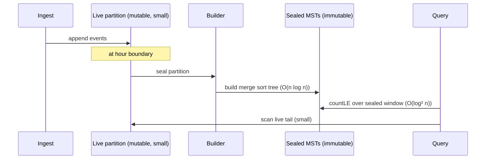
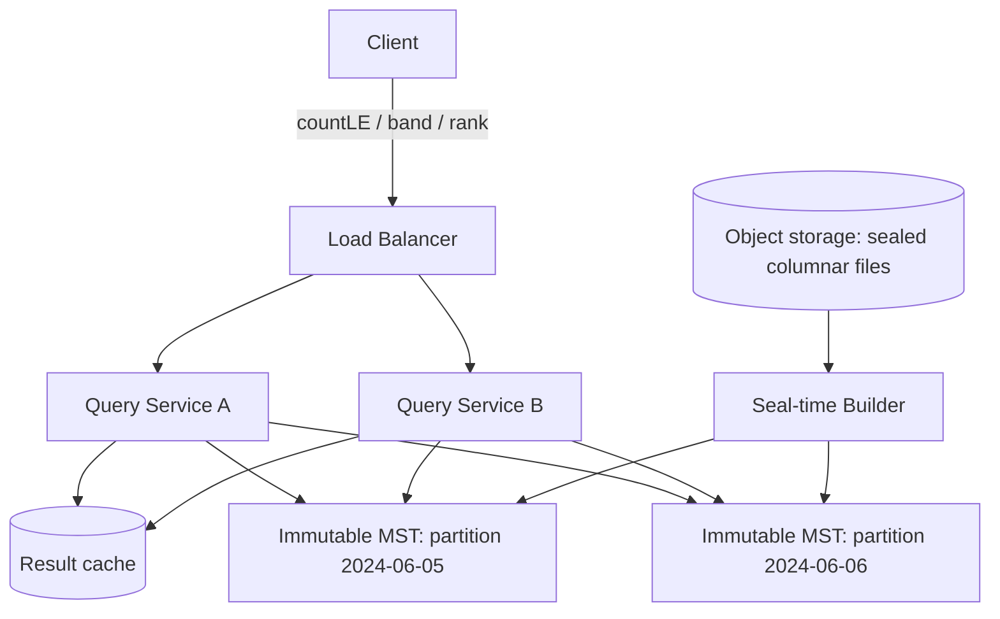
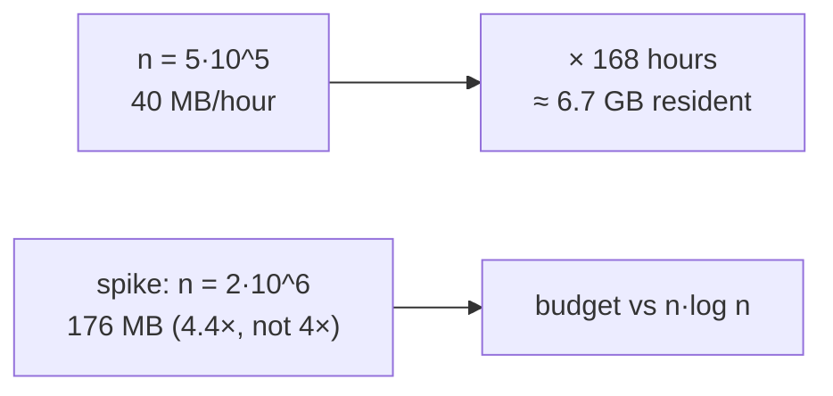
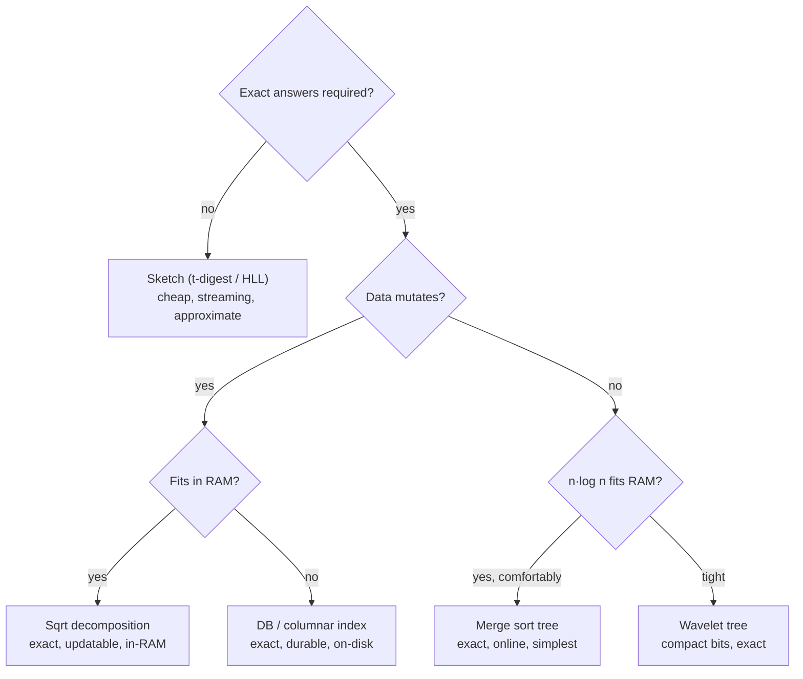

# Merge Sort Tree — Senior Level

> **Audience:** Engineers who design systems around large, mostly-immutable datasets and need to know where a merge sort tree (and its alternatives) actually earns its place in production analytics. Prerequisite: `junior.md`, `middle.md`.

This document is about **applied context and engineering trade-offs** at scale: large static datasets, the real cost of `O(n log n)` memory, where range-order counting shows up in offline analytics and columnar systems, how to handle the static-array limitation with **rebuild strategies**, and the failure modes you must instrument against. The merge sort tree is rarely the literal structure shipped in a database — but the *pattern* it teaches (precompute sorted summaries per range, decompose-and-binary-search) is exactly what columnar analytics engines do, and understanding the trade-offs tells you when the in-memory merge sort tree is the right tool for a service.

The senior framing throughout is **decision-oriented**. Rather than cataloguing what the structure can do, this level asks: given a concrete workload with a concrete `n`, value range, mutability pattern, and memory budget, *should* you reach for a merge sort tree, and if so, how do you operate it safely? The answer is usually a short series of go/no-go checks (immutable? exact? RAM-comfortable?) followed by an operational plan (build off the hot path, swap immutable trees atomically, instrument resident bytes against the memory model). Where the answer is "no," the level names the specific alternative that fits — and that judgment, knowing the boundary and the neighbor, is the senior skill the structure exercises.

---

## Table of Contents

1. [The Niche: Static, Read-Heavy, Range-Order Analytics](#niche)
2. [The Real Cost of O(n log n) Memory](#memory-cost)
3. [Offline Analytics Systems and Columnar Storage](#analytics)
4. [Rebuild Strategies — Living with the Static Limitation](#rebuild)
5. [Architecture: A Range-Count Service](#architecture)
6. [Choosing Merge Sort Tree vs Database Index vs Sketch](#choosing)
7. [Observability](#observability)
8. [Failure Modes](#failure-modes)
9. [Production War Stories](#war-stories)
10. [Summary](#summary)

---

<a name="niche"></a>
## 1. The Niche: Static, Read-Heavy, Range-Order Analytics

The merge sort tree occupies a precise niche: **a large array that does not change, queried many times with range + order conditions, where the answers must be exact and the queries arrive online.** Concretely:

- A day's worth of immutable event records, sorted by time (so "index range" = "time window").
- A query like *"how many events in this time window had latency ≤ 200 ms?"* or *"what was the 95th-percentile-rank value in this window?"*
- Thousands to millions of such queries against the same fixed dataset.

This is **read-heavy, write-once** analytics. The data is built once (e.g., when an hour or day "seals" and becomes immutable), then served. The merge sort tree's static limitation is a non-issue here because the data is static by design. Its `O(log² n)` query is fast enough for interactive dashboards, and its online nature means each dashboard request is answered independently without batching.

Where it does **not** fit: high-write OLTP workloads, unbounded streaming with continuous updates, or datasets so large that `O(n log n)` memory is prohibitive. Those push you toward sketches (approximate), columnar indexes on disk (exact but slower), or update-friendly structures (sqrt decomposition, LSM-backed indexes).

### The three questions that place a workload in (or out of) the niche

Before adopting a merge sort tree for a service, answer three questions; a "no" to any one usually rules it out:

1. **Is the underlying data effectively immutable once built?** Sealed time partitions, finished batch jobs, snapshot exports — yes. A continuously-mutated table — no (go to sqrt decomposition or a DB index).
2. **Are exact answers required?** Compliance counts, billing, audit trails — yes, exactness is non-negotiable. Dashboards that show "≈ p95" — no, a sketch is cheaper.
3. **Does `n · log n` fit comfortably in RAM with headroom for spikes?** Sub-`10^6` per partition — yes. Tens of millions — usually no (wavelet tree or on-disk).

The niche is the **intersection** of all three yeses: immutable, exact, RAM-comfortable. That intersection is real and common (sealed analytics partitions are everywhere), which is why the structure earns its place — but it is also narrow, and the senior skill is recognizing when a workload sits just outside it and choosing the appropriate neighbor.

A useful way to internalize this: the merge sort tree is a **specialist, not a generalist**. Unlike a hash map or a B-tree — workhorses you reach for reflexively across many workloads — the merge sort tree is a precision instrument for one shape of problem. Reaching for it reflexively is a mistake; reaching for it *deliberately*, after confirming the three yeses, is exactly right. Treat it the way a surgeon treats a specialized clamp: indispensable for the specific procedure, wrong for everything else.

The corollary for system design: when you *do* deploy a merge sort tree, document the three-yes justification in the design doc, so the next engineer understands the constraints that make it correct here and the conditions (mutation creeping in, data outgrowing RAM, an "approximate is fine" requirement appearing) that would invalidate the choice and trigger a migration. A specialist tool deployed without its preconditions recorded is a future incident waiting to happen; one deployed with its boundary written down is a deliberate, defensible decision.

### Why "online and exact" together is the differentiator

The merge sort tree's specific edge over its closest rivals is being **simultaneously online and exact** with simple code. Sketches are online but approximate. The offline BIT sweep is exact but must batch all queries. Among the exact-and-online structures (merge sort tree, wavelet tree, persistent segment tree), the merge sort tree is the **least code to get right**, which matters when the alternative is a wavelet tree that takes a week to debug. For a static, exact, online, count-style workload under engineering time pressure, "boring and correct in 40 lines" is frequently the right senior call — you can always migrate to a wavelet tree later if memory becomes the binding constraint.

---

<a name="memory-cost"></a>
## 2. The Real Cost of O(n log n) Memory

The defining engineering constraint of the merge sort tree is its memory. Each of `n` elements is stored once per level, across `⌈log₂ n⌉ + 1` levels.

| n | log₂ n | stored ints (n · (log n + 1)) | bytes at 8B/int | bytes at 4B/int |
|---|---|---|---|---|
| 10^4 | ~14 | ~1.4·10^5 | ~1.1 MB | ~560 KB |
| 10^5 | ~17 | ~1.7·10^6 | ~14 MB | ~7 MB |
| 10^6 | ~20 | ~2.1·10^7 | ~168 MB | ~84 MB |
| 10^7 | ~24 | ~2.4·10^8 | ~1.9 GB | ~960 MB |
| 10^8 | ~27 | ~2.7·10^9 | ~22 GB | ~11 GB |

Reading this table is the whole senior-level memory lesson:

- At `n = 10^5`, the structure is trivially small (~14 MB) — ship it.
- At `n = 10^6`, you are at ~168 MB for 8-byte ints; **coordinate-compress to 4-byte ints** to halve it (~84 MB) and it is still comfortable.
- At `n = 10^7`, you are near 1 GB even compressed — now you must seriously consider a **wavelet tree** (`O(n log V)` *bits*, often 10–20× smaller) or move to disk-backed columnar indexes.
- At `n = 10^8`, the merge sort tree is out; only compact (wavelet) or external structures survive.

**Mitigations, in order of preference:**

1. **Coordinate-compress** values to the smallest integer type that fits (`int32`, even `int16`). Halves or quarters memory, and enables `O(log n)` value searches.
2. **Use primitive contiguous arrays**, never boxed objects. A Java `Integer[][]` or Python list-of-`int`-objects can be 3–6× larger than `int[][]` / typed arrays.
3. **Drop a level or two with a hybrid:** store sorted lists only at nodes above some block size `B`, and brute-force-scan within blocks of size `B`. This reduces memory by skipping the bottom `log B` levels at the cost of `O(B)` scan per partial block. (This is essentially merging the merge sort tree with sqrt decomposition.)
4. **Switch structures** when the table above says you are out of room: wavelet tree for compact in-memory, persistent segment tree if k-th-smallest dominates, or an on-disk columnar index for truly huge `n`.

The senior decision is not "how do I make the merge sort tree smaller" in isolation — it is **"given my `n`, my value range, and my memory budget, is the merge sort tree even the right structure?"** The table above is the tool for that decision.

### The block-hybrid, quantified

Mitigation 3 — stopping the tree at blocks of size `B` and brute-scanning within — deserves a quantitative look, because it is the single most effective in-place memory reduction. Skipping the bottom `log₂ B` levels removes `n · log₂ B` stored elements:

```text
full tree stored ints      = n · (log₂ n + 1)
block-hybrid stored ints   = n · (log₂ n + 1) − n · log₂ B
                           = n · (log₂(n / B) + 1)
fraction saved             ≈ log₂ B / log₂ n
```

| n | B | levels kept | memory vs full | added scan per query |
|---|---|---|---|---|
| 10^6 | 1 | ~21 | 100% (full tree) | none |
| 10^6 | 16 | ~17 | ~80% | scan ≤ 16 elements per partial end |
| 10^6 | 64 | ~15 | ~71% | scan ≤ 64 elements per partial end |
| 10^6 | √n ≈ 1024 | ~11 | ~52% | scan ≤ ~1024 (this is sqrt decomposition) |

So `B = 64` buys a ~29% memory cut for a tiny added scan, and pushing `B` to `√n` halves memory but degrades toward sqrt-decomposition query cost. The hybrid is the **continuous dial** between the merge sort tree (`B = 1`) and sqrt decomposition (`B = √n`); pick `B` to fit your memory budget while keeping the scan cost tolerable. In practice `B ∈ [32, 128]` is a sweet spot for in-RAM analytics: meaningful memory savings, negligible query impact.

---

<a name="analytics"></a>
## 3. Offline Analytics Systems and Columnar Storage

The merge sort tree's core idea — **precompute sorted summaries of ranges, then decompose-and-binary-search** — is the same idea behind several production analytics techniques, even when the literal data structure differs.

### 3.1 Columnar engines and zone maps

Columnar stores (Parquet/ORC files, ClickHouse `MergeTree`, Apache Druid segments, Snowflake micro-partitions) split a column into **row groups / granules / segments**. For each block they keep **min/max statistics** (zone maps) and often a **sorted dictionary or sorted sample**. A range-order query ("count rows where `value ≤ k` in time window `[t1, t2]`") prunes whole blocks by min/max, then for surviving blocks either scans or binary-searches a sorted representation. This is a **flattened, two-level merge sort tree**: the "tree" is just "blocks + a top-level index," tuned so the block size matches disk/page granularity.

The merge sort tree is the **in-memory, fully-recursive** version of this pattern. When your dataset fits in RAM and you want exact `O(log² n)` counts without a query engine, the merge sort tree gives you the columnar engine's counting power in 40 lines.

The relationship is precise enough to tabulate:

| Concept | Columnar engine | Merge sort tree |
|---|---|---|
| Unit of summary | row group / granule / segment | tree node |
| Pruning info | min/max zone map | range bounds + sorted list |
| "Count ≤ k in window" | prune by zone map, then scan/binary-search surviving blocks | decompose into canonical nodes, binary-search each |
| Levels of summary | usually 1–2 (file + row-group) | `log n` (fully recursive) |
| Block size | tuned to page/disk granularity | always 1 element at the leaf |
| Mutability | sealed segments, compaction | immutable, rebuild |

The two diverge on **how many levels of summary** they keep: a columnar engine uses one or two coarse levels matched to disk pages, because going finer would cost random I/O it cannot afford; the in-memory merge sort tree goes all the way down to single elements because RAM makes the fine levels cheap to traverse. This is also the design knob behind the **block-hybrid** variant (junior §12 / senior §2): stop the tree at blocks of size `B` and brute-scan within, landing you exactly at the columnar engine's two-level design when `B = √n`. The merge sort tree and the columnar zone map are two points on the same continuum, parameterized by block size.

### 3.2 Sorted-by-key immutable segments

Time-series and log systems (Prometheus TSDB blocks, Loki chunks, Druid historical segments) seal immutable, sorted segments. Within a sealed segment, "count values ≤ threshold in this sub-window" is a textbook merge sort tree query. Production systems usually answer it with columnar scans + SIMD rather than an explicit merge sort tree (because they also need full scans, decompression, and other operations), but for a **dedicated counting micro-service** over a sealed segment, an in-memory merge sort tree is a legitimate, simple choice.

The reason general engines prefer scans + SIMD over an explicit merge sort tree is instructive: a scan touches each element **once sequentially** (cache- and SIMD-friendly) and amortizes well when the engine must *also* decompress, project, and filter on other columns in the same pass. The merge sort tree wins only when the workload is **purely** "count ≤ k in a sub-window," repeated many times, with no accompanying full-scan needs — a narrow but real specialization. Knowing this boundary keeps you from proposing a merge sort tree inside a general query engine (where it would duplicate work the scan already does) while still reaching for it in the dedicated micro-service case.

### 3.3 Inverted-percentile and rank dashboards

Dashboards that show "rank of this value within the selected window" or "how many sessions were below the SLA in this window" are range-order queries. When the underlying data is a sealed, sorted-by-time array and the window is a contiguous index range, the merge sort tree answers rank/count queries exactly and online — the right primitive for an interactive percentile-rank explorer over immutable data.

Concretely, "what percentile is value `x` at, within window `[l, r]`?" is `100 · countLE(l, r, x) / (r − l + 1)` — a single `countLE`. And "what value sits at the p-th percentile of window `[l, r]`?" is `kthSmallest(l, r, ⌈p/100 · (r−l+1)⌉)`. So both directions of a percentile explorer (value→rank and rank→value) reduce to the two primitives the merge sort tree already exposes, exactly, and online — which is why it is a natural fit for this class of dashboard even though large analytics engines implement the same queries with columnar scans. The merge sort tree is the right tool when you want a **self-contained, exact, low-dependency** rank service over a sealed dataset, rather than standing up a full query engine.

---

<a name="rebuild"></a>
## 4. Rebuild Strategies — Living with the Static Limitation

The merge sort tree is static. Real datasets are rarely *forever* static; they are **append-mostly** or **periodically sealed**. The senior craft is choosing a rebuild strategy that respects the static structure while accommodating change.

### 4.1 Seal-and-build (the natural fit)

Most analytics data is **time-partitioned**: the current hour/day is mutable (still ingesting), but past hours/days are **sealed** and never change. Build a merge sort tree per sealed partition at seal time (an `O(n log n)` one-shot), and serve all historical queries from these immutable trees. The mutable current partition is handled separately (a small live structure, or just brute-force since it is small). Queries spanning live + sealed partitions split into a fast tree query over the sealed part and a cheap scan over the small live part.



### 4.2 Periodic full rebuild

If the dataset is small enough that an `O(n log n)` rebuild is cheap (say, `n ≤ 10^6`, rebuild ~tens of ms), simply **rebuild the whole tree on a schedule** (every N minutes, or after every batch of appends). Serve the previous immutable tree until the new one is ready, then atomically swap the pointer. This is the simplest possible "support updates" story: you do not update the tree, you replace it. Readers never see a partial structure.

The key sizing question is the **rebuild interval vs staleness tolerance**: queries see data as of the last rebuild, so the staleness is at most one interval. If the product tolerates 1-minute-stale counts and a rebuild takes 50 ms, a 1-minute interval wastes <0.1% of a core and is trivially affordable. If the product needs near-real-time counts, the interval shrinks until rebuild cost becomes significant — at which point switch to the delta-log hybrid (§4.3), which bounds staleness without paying a full rebuild each interval. The decision is a straightforward trade between **staleness, rebuild cost, and CPU budget**, and full-rebuild is the right pick whenever the interval can be comfortably longer than the rebuild time.

### 4.3 Hybrid: merge sort tree + delta log

Keep the immutable merge sort tree plus a small **delta buffer** of recent changes. A query answers `tree.countLE(...)` and then corrects with a linear scan over the (small) delta buffer. When the delta buffer grows past a threshold, trigger a rebuild that folds the deltas in. This bounds staleness and amortizes rebuild cost. It mirrors the LSM-tree philosophy: an immutable sorted base plus a small mutable overlay, periodically compacted.

### 4.4 Block-rebuild (sqrt-style) for genuine updates

If you truly need per-element updates with reasonable cost, **abandon the pure merge sort tree** for **sqrt decomposition with sorted blocks**: split the array into `√n` blocks, each kept sorted. A point update re-sorts (or binary-inserts into) one block in `O(√n)` / `O(√n log √n)`. A count query binary-searches each fully-covered block. This is the standard "merge-sort-tree-with-updates" substitute and is the honest answer when the data mutates — the merge sort tree's `O(n log n)` rebuild per update is a non-starter.

| Change pattern | Strategy |
|---|---|
| Time-partitioned, past sealed | Seal-and-build per partition |
| Small, append-mostly | Periodic full rebuild + atomic swap |
| Append-mostly, low-latency reads | MST base + delta log (LSM-style) |
| Genuine per-element updates | Sqrt decomposition (sorted blocks) — not MST |

### 4.5 The delta-log pattern, in code

The MST-base + delta-log strategy is worth seeing concretely because it is the most general "make a static structure feel live" technique. The immutable tree answers the base; a small mutable buffer holds recent inserts/deletes and is scanned and corrected at query time; a threshold triggers a rebuild that folds the deltas in.

#### Go
```go
type LiveRangeCount struct {
	base   *MergeSortTree // immutable base over baseArr
	baseN  int
	deltas []deltaEntry   // recent inserts (positive) / deletes (negative)
	maxBuf int
}

type deltaEntry struct {
	value int
	sign  int // +1 insert, -1 delete
}

func (lc *LiveRangeCount) Insert(value int) {
	lc.deltas = append(lc.deltas, deltaEntry{value, +1})
	if len(lc.deltas) >= lc.maxBuf {
		lc.rebuild()
	}
}

// CountLEGlobal answers count of values <= k over the whole logical set
// (base + deltas). The base query is O(log^2 n); the delta scan is O(|deltas|).
func (lc *LiveRangeCount) CountLEGlobal(k int) int {
	cnt := lc.base.CountLE(0, lc.baseN-1, k)
	for _, d := range lc.deltas {
		if d.value <= k {
			cnt += d.sign
		}
	}
	return cnt
}

func (lc *LiveRangeCount) rebuild() {
	// fold deltas into a fresh array, rebuild the immutable base, clear buffer.
	// (omitted: materialize merged array; lc.base = Build(merged))
	lc.deltas = lc.deltas[:0]
}
```

#### Python
```python
class LiveRangeCount:
    def __init__(self, base_tree, base_n, max_buf=1000):
        self.base = base_tree        # immutable MergeSortTree over base array
        self.base_n = base_n
        self.deltas = []             # list of (value, sign)
        self.max_buf = max_buf

    def insert(self, value):
        self.deltas.append((value, +1))
        if len(self.deltas) >= self.max_buf:
            self.rebuild()

    def count_le_global(self, k):
        cnt = self.base.count_le(0, self.base_n - 1, k)
        for value, sign in self.deltas:
            if value <= k:
                cnt += sign
        return cnt

    def rebuild(self):
        # materialize base + deltas into one array, rebuild immutable base, clear
        self.deltas.clear()
```

The correctness hinge is the **sign discipline**: an insert contributes `+1` to any count whose cutoff it satisfies; a delete contributes `−1`. Get the sign wrong and counts drift silently. The staleness bound is `O(maxBuf)`: never more than `maxBuf` un-folded changes, so the query overhead is bounded and the rebuild amortizes to `O((n log n)/maxBuf)` per change. This is precisely the LSM-tree bargain — an immutable sorted base plus a bounded mutable overlay, compacted on a threshold.

---

<a name="architecture"></a>
## 5. Architecture: A Range-Count Service

A typical deployment serving range-order counts over sealed data:



Design notes:

- **Immutable trees are trivially shareable across threads and replicas.** No locks on the read path — the static structure means every query service replica can mmap or hold the same tree and serve concurrently with zero coordination. This is a major operational win over update-heavy structures.
- **Cache hot queries.** Dashboard queries repeat (same window, same threshold); a small result cache in front of the tree absorbs them.
- **Build off the hot path.** The `O(n log n)` build runs in the seal-time Builder, never blocking queries. New partitions are published atomically.
- **Memory budget per replica gates `n`.** Use §2's table to decide how many partitions a replica can hold resident, and shard partitions across replicas accordingly.

### A capacity-planning worked example

Suppose you serve one immutable merge sort tree per **hour** of events, each hour holding `n = 5·10^5` records, latency values that fit in `int32` after compression, and you keep the **last 168 hours** (one week) resident for ad-hoc dashboard queries. Plan the memory:

```text
per-hour stored ints  = n · (⌈log₂ n⌉ + 1)
                      ≈ 5·10^5 · (19 + 1)
                      = 1.0·10^7 ints
per-hour bytes (int32) = 1.0·10^7 · 4 B = 40 MB
week resident (168 h) = 168 · 40 MB ≈ 6.7 GB
```

So one week of hourly trees is ~6.7 GB — fits on a single large-memory node, or splits across 2–3 mid-size replicas. Now suppose a marketing event 4×'s one hour to `n = 2·10^6`:

```text
spiked hour ints  ≈ 2·10^6 · (21 + 1) = 4.4·10^7 ints
spiked hour bytes = 4.4·10^7 · 4 B = 176 MB     (4.4× the normal hour, not 4×)
```

Note the **super-linear** jump: 4× the data is ~4.4× the memory because `log n` grew too. This is the capacity-planning lesson — **budget against `n log n`, not `n`** — and it is exactly what bites teams who provision linearly. If spikes are common, cap per-hour `n` by sharding the hot hour across two trees, or switch the hot hours to a wavelet tree.



---

<a name="choosing"></a>
## 6. Choosing Merge Sort Tree vs Database Index vs Sketch

At senior scale, the merge sort tree competes not only with other in-memory structures but with **databases** and **probabilistic sketches**.

| Approach | Exact? | Updates | Memory | Best when |
|---|---|---|---|---|
| Merge sort tree (in-RAM) | Exact | No (static) | O(n log n) | Sealed data fits in RAM; online exact counts; simple service |
| Wavelet tree (in-RAM) | Exact | No | O(n log V) bits | Same, but memory-constrained or k-th-smallest heavy |
| Sqrt decomposition | Exact | Yes | O(n) | Data mutates; counts can be a bit slower |
| B-tree / columnar DB index | Exact | Yes | O(n) on disk | Data too big for RAM; durability needed; SQL ecosystem |
| t-digest / KLL sketch | **Approximate** | Yes (streaming) | O(1)–O(polylog) | Quantiles over unbounded streams; error tolerable |
| Count-min / HLL | Approximate | Yes | O(1) | Frequency/cardinality, not range-order |

The senior judgment:

- If you need **exact** counts on **static, RAM-resident** data, online — merge sort tree (or wavelet tree if memory is tight).
- If the data **mutates** — sqrt decomposition (exact, in-RAM) or a database index (exact, durable, on disk).
- If **approximate is acceptable** and the stream is unbounded — reach for a sketch (t-digest for quantiles) and skip exact structures entirely; they are far cheaper.

A common senior mistake is reaching for an exact merge sort tree when the product only needs an approximate p95 over a stream — a t-digest would be a fraction of the memory and would handle updates for free. Match the structure to the **exactness and mutability requirements**, not to what is intellectually satisfying.

The decision condenses to a short flow:



Reading the flow top-down picks the right structure in three or four questions. The merge sort tree sits at the bottom-right: **exact, static, RAM-comfortable** — and it is the simplest box in the diagram to implement correctly, which is its enduring practical advantage within that niche.

### Concurrency via atomic pointer swap

The immutability of the merge sort tree is what makes its concurrency story trivial — and worth implementing deliberately. Because a built tree is never mutated, **readers need no locks at all**; the only synchronization is publishing a new immutable tree by atomically swapping a pointer. Writers (the seal-time builder) build off to the side and then flip the pointer; in-flight readers keep using the old tree until they finish, then the old tree is reclaimed once no reader references it.

#### Go
```go
import "sync/atomic"

// PartitionStore holds the current immutable tree behind an atomic pointer.
// Readers load with zero locking; the builder publishes via atomic store.
type PartitionStore struct {
	current atomic.Pointer[MergeSortTree]
}

// Query reads the current tree lock-free. Safe under concurrent Publish.
func (p *PartitionStore) Query(l, r, k int) int {
	t := p.current.Load() // immutable snapshot; never changes under us
	if t == nil {
		return 0
	}
	return t.CountLE(l, r, k)
}

// Publish swaps in a freshly built tree. The old one is GC'd when readers drain.
func (p *PartitionStore) Publish(t *MergeSortTree) {
	p.current.Store(t)
}
```

#### Java
```java
import java.util.concurrent.atomic.AtomicReference;

public final class PartitionStore {
    private final AtomicReference<MergeSortTree> current = new AtomicReference<>();

    /** Lock-free read of the current immutable tree. */
    public int query(int l, int r, int k) {
        MergeSortTree t = current.get();   // immutable snapshot
        return (t == null) ? 0 : t.countLE(l, r, k);
    }

    /** Atomically publish a freshly built tree. */
    public void publish(MergeSortTree t) {
        current.set(t);
    }
}
```

#### Python
```python
class PartitionStore:
    """In CPython the GIL makes the attribute swap atomic; under free-threaded
    builds, guard publish with a lock. Reads remain lock-free."""
    def __init__(self):
        self._current = None  # immutable MergeSortTree or None

    def query(self, l, r, k):
        t = self._current          # snapshot the reference once
        return 0 if t is None else t.count_le(l, r, k)

    def publish(self, tree):
        self._current = tree       # atomic reference rebind
```

Contrast this with an update-heavy structure (sqrt decomposition), where every write mutates shared state and you must serialize readers against writers with a read-write lock — a real bottleneck under load. The merge sort tree's immutability turns concurrency from a problem into a non-problem: **build off the hot path, swap the pointer, done.** This is one of the strongest operational arguments for choosing it (or any immutable, periodically-rebuilt structure) over a mutable one when the data permits.

---

<a name="observability"></a>
## 7. Observability

| Metric | Why | Alert threshold (example) |
|---|---|---|
| `mst_query_latency_p99` | Detect slow queries / cache misses | > 5 ms |
| `mst_build_duration` | Seal-time build not blocking ingest | > SLA for partition seal |
| `mst_resident_bytes` | Memory budget; the `O(n log n)` killer | > 80% of replica budget |
| `mst_partitions_resident` | Capacity planning | nearing per-replica cap |
| `mst_cache_hit_ratio` | Result cache effectiveness | < 0.5 (tune cache) |
| `mst_rebuild_lag` (hybrid) | Delta buffer staleness | delta size > threshold |

The two metrics that matter most are **`mst_resident_bytes`** (because memory is the structure's Achilles heel) and **`mst_build_duration`** (because a slow seal-time build can back up ingestion). Instrument both from day one.

### Deriving the resident-bytes alert from first principles

Set the `mst_resident_bytes` alert from the §2 memory model, not a guessed constant. If a replica holds `P` partitions of average size `n̄`, with `w` bytes per stored value:

```text
expected_resident ≈ P · n̄ · (log₂ n̄ + 1) · w
alert_threshold   = min( 0.8 · replica_ram , expected_resident · 1.5 )
```

The `· 1.5` headroom absorbs the super-linear spike when one partition grows: recall that a 4× data spike is ~4.4× memory (the `log n` grows too), so a tight threshold will page you on every normal surge. Tie the alert to the **model**, and it self-adjusts as `n̄` drifts. A flat byte threshold, by contrast, either pages constantly (set too low) or misses the OOM (set too high) as partition sizes evolve.

### What "good" looks like on a dashboard

A healthy range-count service shows: `query_latency_p99` flat and low (sub-millisecond for cached, single-digit ms uncached); `resident_bytes` a sawtooth that tracks partition rotation (rises as new partitions seal, drops as old ones age out) and never approaches the replica cap; `build_duration` well under the partition-seal interval (a 1-second build for an hourly partition is fine; a 30-second build for a minutely partition is a problem); and `cache_hit_ratio` high if the query distribution is skewed (dashboards repeat windows). Deviations from this shape are your early warning: a rising `resident_bytes` baseline means partitions are growing and you must re-plan capacity; a creeping `build_duration` means a partition is approaching the size where you should shard it or switch structures.

---

<a name="failure-modes"></a>
## 8. Failure Modes

- **Memory exhaustion / OOM.** The `O(n log n)` footprint grows faster than the data. A partition that doubled in size nearly doubles tree memory. Mitigation: enforce a per-partition `n` cap, coordinate-compress, and use §2's table for capacity planning. Alert on `mst_resident_bytes` *before* OOM, not after.
- **Build stalls ingestion.** If the seal-time build runs on the ingest thread, a large partition's `O(n log n)` build can pause writes. Mitigation: build asynchronously on a separate pool; publish the tree atomically when done.
- **Silent staleness (hybrid mode).** If the delta buffer grows without triggering a rebuild, queries drift from truth. Mitigation: hard cap the delta buffer size and force a rebuild when exceeded; alert on `mst_rebuild_lag`.
- **Tie-counting bugs at scale.** `upperBound` vs `lowerBound` mistakes (junior §11) are invisible on unique data and only surface on duplicate-heavy production data. Mitigation: property-test against brute force with duplicate-heavy inputs in CI.
- **Wrong tool for mutable data.** Someone bolts "updates" onto a merge sort tree by rebuilding on every write; throughput collapses. Mitigation: if writes are frequent, switch to sqrt decomposition or a DB index — do not fight the static design.
- **Coordinate-compression mismatch.** If queries use raw values but the tree stores compressed ranks, comparisons silently break. Mitigation: keep a single compression map, apply it on both build and query, and test the round trip.
- **Boxed-storage memory blowup.** Shipping a Java `Integer[][]` or a Python list-of-lists-of-`int` instead of primitive arrays inflates memory 3–6× and surfaces as an unexpected OOM at a smaller `n` than the model predicts. Mitigation: store primitive contiguous arrays (`int[][]`, typed/`array` buffers), and reconcile measured resident bytes against the §2 model — a large gap signals boxing.
- **Cross-partition query fan-out.** A query spanning many partitions (e.g., "last 7 days") fans out to many trees and sums; if each tree query is independent, latency adds up. Mitigation: parallelize the per-partition sub-queries across cores and combine, or pre-aggregate coarse partitions; alert on `query_latency_p99` for wide windows specifically.
- **Stale published pointer after a failed build.** If a build throws mid-way and the publish path isn't guarded, readers may see a half-built or `nil` tree. Mitigation: build fully into a local variable and publish only on success; never mutate the live tree in place.

---

<a name="war-stories"></a>
## 9. Production War Stories

### 9.1 The dashboard that OOMed at month-end

A latency-analytics dashboard built a merge sort tree per sealed day to answer "how many requests under the SLA in this window?". It worked for months. At month-end, a marketing event 5×'d daily volume; one day's `n` jumped from `2·10^6` to `10^7`, and the tree's footprint went from ~340 MB to ~1.9 GB on 8-byte ints — the replica OOMed mid-build. The fix was twofold: coordinate-compress latencies to `int32` (halving memory) and cap per-partition `n` by sharding the largest days across two trees. Lesson: the `O(n log n)` footprint scales **super-linearly** with data growth; capacity-plan against `n · log n`, not `n`.

### 9.2 "We need updates" — and the rebuild that ate the CPU

A team needed occasional corrections to historical records and implemented them by **rebuilding the affected day's merge sort tree on every correction**. Corrections came in bursts (a backfill job). Each rebuild was `O(n log n)`; a burst of 10,000 corrections triggered 10,000 full rebuilds, pinning CPU for an hour. The fix was a **delta buffer**: corrections accumulate in a small overlay scanned at query time, and a single rebuild folds them in once per hour. Lesson: never rebuild a static structure per update — batch the changes and rebuild on a schedule, or use an update-friendly structure.

### 9.3 The wavelet tree that should have been the default

A service held `n = 3·10^7` sealed records in a merge sort tree, consuming ~5.7 GB across replicas (compressed). Memory pressure forced over-provisioning. A migration to a **wavelet tree** dropped the footprint to ~300 MB (bits, not ints) with comparable query latency, freeing the over-provisioned replicas. Lesson: above ~10^7 elements, the merge sort tree's memory is usually the wrong trade-off; the wavelet tree (or an on-disk index) is the senior choice. The merge sort tree is for the **teaching-clear, RAM-comfortable** regime, not the memory-constrained one.

### 9.4 The tie-counting bug that only appeared in production

A fraud-analytics service used `countLE` to flag "how many transactions in this window were at or below the suspicious-amount threshold." In staging, all test amounts were distinct, so `upperBound` (≤) and `lowerBound` (<) produced identical results and the unit tests passed. In production, **many transactions were exactly the round-number threshold** (e.g., exactly `$500`), and the implementation had accidentally used the `<` variant — silently undercounting every threshold-equal transaction. The numbers looked plausible (just slightly low), so the bug survived for weeks until an auditor cross-checked by hand. The fix was one word (`lowerBound` → `upperBound`) plus a CI property test on duplicate-heavy inputs. Lesson: the `≤` vs `<` boundary is invisible on unique data; **always property-test ties** against a brute-force oracle with deliberately repeated values, especially the exact threshold values your domain cares about.

### 9.5 The "approximate would have been fine" over-engineering

A product needed a p95-rank widget on a live stream of session durations. The team built an exact, periodically-rebuilt merge sort tree pipeline — seal-and-build, atomic swaps, the works — consuming significant memory and engineering time. A later review found the widget only ever displayed an **approximate** p95 to two significant figures; a single `t-digest` per stream (a few KB, updates for free, no rebuild pipeline) would have met the requirement with a fraction of the cost. They migrated and deleted the rebuild infrastructure. Lesson: confirm the **exactness requirement** before reaching for an exact structure. If approximate suffices and the data streams, a sketch is almost always the right answer — the merge sort tree's exactness is a feature you pay for and should only buy when you need it.

---

<a name="summary"></a>
## 10. Summary

- The merge sort tree's production niche is **static, read-heavy, online, exact range-order analytics** that fits in RAM — sealed time partitions, dashboard counts, percentile-rank explorers.
- Its defining constraint is **`O(n log n)` memory**, which scales super-linearly with data. The senior decision is gating `n` against the §2 memory table and choosing wavelet trees / disk indexes above ~10^7 elements.
- The pattern (sorted summaries per range + decompose-and-binary-search) mirrors **columnar zone maps and sealed segments**; the merge sort tree is the in-memory, fully-recursive form of that idea.
- The static limitation is managed with **rebuild strategies**: seal-and-build per partition (the natural fit), periodic full rebuild + atomic swap, an MST base + delta log (LSM-style), or — for genuine updates — **sqrt decomposition instead of MST**.
- Operationally, immutable trees are **lock-free and trivially shareable across replicas**, a real win; the risks are OOM, build-stall, and silent staleness, all of which are instrumentable.
- Pick exact in-RAM structures only when the data is static and fits; reach for sketches when approximate suffices, for sqrt/DB indexes when it mutates, and for wavelet trees when memory is tight.
- The **block-hybrid** dial (stop the tree at blocks of size `B`) continuously interpolates between the full merge sort tree (`B = 1`) and sqrt decomposition (`B = √n`), trading memory for a bounded per-query scan — and lands exactly at the columnar zone-map design at `B = √n`.
- Percentile explorers (value→rank and rank→value) reduce to one `countLE` or one `kthSmallest`, so the merge sort tree is a self-contained, exact rank service over sealed data without a full query engine.
- Capacity-plan against **`n · log n`, not `n`**: a 4× data spike is ~4.4× memory because `log n` grows too, and alert thresholds derived from the memory model self-adjust as partition sizes drift.

The senior takeaway is not a love of the structure but a map of its **boundary**: inside the static-exact-RAM niche it is the simplest correct choice with a trivial concurrency story; one step outside — mutation, approximation tolerance, or tens of millions of elements — a specific neighbor (sqrt decomposition, a sketch, a wavelet tree, or a disk index) dominates it, and recognizing which neighbor is the actual senior skill.

### One-line operating rules

To close, the rules that should be muscle memory when a merge sort tree is on the table:

- **Build off the hot path; publish immutable trees by atomic pointer swap.** Never mutate a live tree.
- **Coordinate-compress to the smallest int width that fits** — it is the highest-leverage memory lever.
- **Alert on resident bytes derived from the `n·log n` model, with 1.5× headroom for spikes.**
- **Cap per-partition `n`; shard or switch structures before a partition's tree approaches the replica budget.**
- **If updates appear, do not rebuild per write** — batch into a delta log or move to sqrt decomposition.
- **If the requirement is approximate, delete the exact pipeline** and use a sketch.

Each rule maps directly to a war story above; together they are the operational checklist for running the structure in production without the failure modes that bit the teams in §9.

**Next step:** Read [`professional.md`](./professional.md) for the formal `O(log² n)` query and `O(n log n)` space proofs, fractional cascading to bring the query down to `O(log n)`, and the lower-bound arguments.
