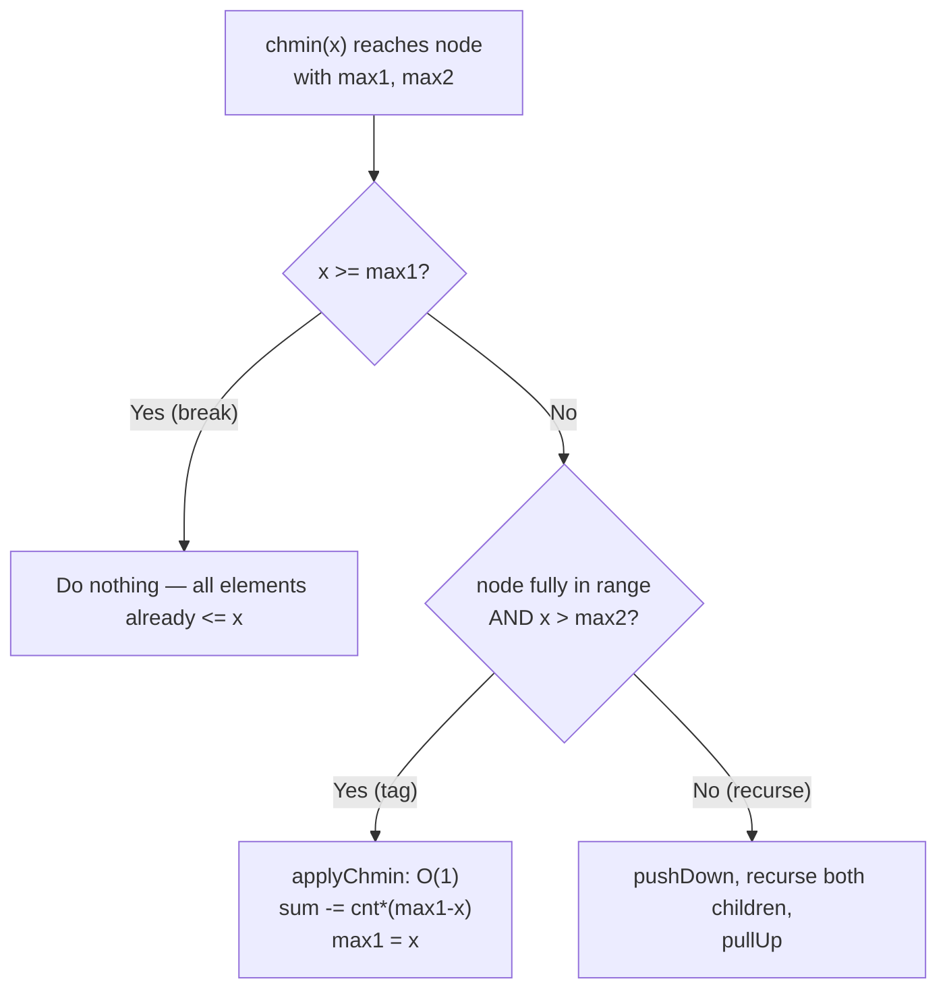

# Segment Tree Beats — Junior Level

> **Read time: ~50 minutes** · **Audience:** Students who have written a lazy segment tree (`09-06-segment-tree`) and now want to handle the one range operation that breaks ordinary lazy propagation: **range chmin** (`a_i = min(a_i, x)` for every `i` in a range).

A **Segment Tree Beats** (also called the **Ji Driver Segment Tree**, named after the Chinese competitive programmer 吉如一 / "Ji Ruyi") is a segment tree that supports operations that a plain lazy segment tree **cannot**, most famously:

- **Range chmin:** for all `i` in `[l, r]`, set `a_i = min(a_i, x)`.
- **Range chmax:** for all `i` in `[l, r]`, set `a_i = max(a_i, x)`.
- combined with **range-sum** and **range-max** (and range-min) queries.

The reason ordinary lazy propagation fails here is subtle and important, and understanding *why* is the whole point of this document. The trick that makes it work — tracking the **maximum, the strict second-maximum, and the count of the maximum** at every node — is beautiful once you see it. We build the idea on a tiny array, trace every recursion, and finish with a cheat sheet you can reuse forever.

---

## Table of Contents

1. [Introduction — The Operation That Lazy Segment Trees Can't Do](#introduction)
2. [Prerequisites](#prerequisites)
3. [Glossary](#glossary)
4. [Why Plain Lazy Propagation Fails for chmin](#why-fails)
5. [Core Concepts — max / second-max / count-of-max](#core-concepts)
6. [Big-O Summary](#big-o)
7. [Real-World Analogies](#analogies)
8. [Pros and Cons](#pros-cons)
9. [Step-by-Step Walkthrough on `[5, 2, 5, 1, 5]`](#walkthrough)
10. [Code Examples — Go, Java, Python](#code-examples)
11. [Coding Patterns — Break Condition vs Tag Condition](#patterns)
12. [Error Handling](#errors)
13. [Performance Tips](#performance-tips)
14. [Best Practices](#best-practices)
15. [Edge Cases](#edge-cases)
16. [Common Mistakes](#common-mistakes)
17. [Cheat Sheet](#cheat-sheet)
18. [Visual Animation Reference](#animation)
19. [Summary](#summary)
20. [Further Reading](#further-reading)

---

<a name="introduction"></a>
## 1. Introduction — The Operation That Lazy Segment Trees Can't Do

Imagine you have an array of `n` integers and you must support these operations, interleaved millions of times:

1. **Range chmin:** "for every element in `arr[l..r]`, replace it with `min(element, x)`." (Clamp a window down to a ceiling `x`.)
2. **Range sum:** "what is `arr[l] + arr[l+1] + ... + arr[r]`?"
3. **Range max:** "what is the largest element in `arr[l..r]`?"

The chmin operation looks innocent. "Take the minimum with `x`" — surely a lazy segment tree handles that? But it does not, and here is the difficulty in one sentence:

> **A `chmin(l, r, x)` changes *some* elements in the range and leaves others untouched — it depends on each element's current value — so you cannot summarize its effect with a single number stamped on a node.**

A normal lazy tag is a single value that means "apply this same transformation to *every* element underneath me." Range-add (`a_i += v`) works because adding `v` is the same for everyone. Range-assign (`a_i = v`) works because overwriting with `v` is the same for everyone. But `chmin` with `x` only affects elements that are **currently greater than `x`** — and a node covering a thousand elements may have some above `x` and some below. There is no single number that captures "lower the big ones, leave the small ones."

Segment Tree Beats solves this with a clever, almost magical idea. At each node we store not just the maximum but also:

- **`max1`** — the maximum value in the segment.
- **`max2`** — the **strict** second maximum (the largest value strictly less than `max1`; `-∞` if all equal).
- **`cnt`** — how many elements equal `max1`.

Now a `chmin(x)` falls into three cases at a node:

| Condition | Name | Action |
|---|---|---|
| `x >= max1` | **break / skip** | Every element is already `<= x`. Nothing changes. Return immediately. |
| `max2 < x < max1` | **tag** | Only the maximum elements are affected; they all drop to `x`. We can apply this *lazily* — update the node in O(1) — because exactly `cnt` elements change, each from `max1` to `x`. |
| `x <= max2` | **recurse** | `x` is low enough to affect both the maximum *and* some non-maximum elements. We cannot summarize this; descend into both children and try again. |

This three-way split — **break condition** (`x >= max1`), **tag condition** (`x > max2`), and otherwise **recurse** — is the engine of Segment Tree Beats. The "beats" in the name is a pun: it *beats down* the large values, and it *beats* the limitation of plain lazy segment trees.

The remarkable fact, proven in `professional.md` via Ji's **potential-function analysis**, is that even though a single chmin may recurse deep into the tree, the **total** work across all operations is bounded: the classic chmin + sum problem runs in **amortized O(n log² n)**. For a junior reader, the takeaway is simpler: the recursion almost always stops early, so in practice it is fast.

---

<a name="prerequisites"></a>
## 2. Prerequisites

To follow this document you should be comfortable with:

1. **The basic segment tree** (`09-06-segment-tree/junior.md`): tree-in-an-array layout, root at index 1, children at `2v` and `2v+1`, the build/query/update recursion, and the `4n` allocation rule.
2. **Lazy propagation** (`09-06-segment-tree/middle.md`): the idea of stamping a deferred update on a node and *pushing it down* before descending. Segment Tree Beats is lazy propagation with a smarter "can I stop here?" test.
3. **Recursion on trees.** Every operation recurses on `(node, lo, hi)`.
4. **min / max and basic arithmetic.** We track maxima and sums.
5. **Big-O for trees.** Height O(log n) is the backbone of the cost argument.

If lazy propagation is shaky, re-read `09-06-segment-tree/middle.md §1` first — Segment Tree Beats will not make sense otherwise.

---

<a name="glossary"></a>
## 3. Glossary

| Term | Definition |
|---|---|
| **chmin** | "Change-min": the operation `a_i = min(a_i, x)`. Lowers elements above `x` down to `x`. |
| **chmax** | "Change-max": the operation `a_i = max(a_i, x)`. Raises elements below `x` up to `x`. |
| **`max1`** | The maximum value within a node's segment. |
| **`max2`** | The **strict second maximum** — the largest value strictly less than `max1`. `-∞` if every element equals `max1`. |
| **`cnt`** | Count of elements in the segment equal to `max1`. |
| **`sum`** | Sum of all elements in the segment (the query we answer). |
| **Break condition** | `x >= max1`: the chmin does nothing here; return immediately. |
| **Tag condition** | `max2 < x < max1`: only the maximum is affected; apply lazily in O(1). |
| **Recurse condition** | `x <= max2`: the chmin affects non-maximum elements too; descend into children. |
| **Lazy "chmin tag"** | A pending "cap the maximum at `t`" stored on a node, applied to children on push-down. |
| **Potential function** | A non-negative quantity Φ used in `professional.md` to prove the amortized O(n log² n) bound. |
| **Ji Driver / 吉司机** | Nickname for this structure, after the competitor who popularized it. |
| **Beats** | The structure "beats down" the maxima; also a pun on beating lazy-segtree limits. |

---

<a name="why-fails"></a>
## 4. Why Plain Lazy Propagation Fails for chmin

Let us nail down *exactly* why an ordinary lazy segment tree cannot do chmin, because this motivates everything.

A lazy segment tree stores, at each internal node, a **lazy tag**: a single piece of data describing "a pending transformation that applies uniformly to every element in my subtree." For the tree to work, two properties must hold:

1. **Composability.** Two pending tags must combine into one tag. (Two range-adds `+u` then `+v` combine to `+(u+v)`.)
2. **Aggregate update from the tag.** Given a node's current aggregate and a tag, you must be able to compute the new aggregate in O(1) *without* looking at individual elements. (For range-add and sum: `new_sum = old_sum + v * (count of elements)`.)

Now try `chmin(x)`:

- **Aggregate update fails.** Suppose a node covers `[3, 9, 4, 9, 2]` with `sum = 27`. After `chmin(5)`, the array becomes `[3, 5, 4, 5, 2] = 19`. The change is `-8`, but **8 = (9-5) + (9-5)** depends on *which* elements exceeded 5 and by how much. From the single number `sum = 27` and the value `x = 5`, you cannot deduce the new sum. You would need to know the distribution of values — which a single aggregate does not capture.

```text
node = [3, 9, 4, 9, 2]   sum = 27
chmin(5):  9 -> 5,  9 -> 5,  others unchanged
new        = [3, 5, 4, 5, 2]   sum = 19
delta = -8 = (9-5) + (9-5)     <-- depends on count and values of elements > 5
```

The single number `sum` does not tell us how many elements are `> 5`, so we cannot update it.

This is the wall. A plain lazy tag of the form "cap everything at `x`" is *not* enough, because capping changes elements by different amounts.

**Segment Tree Beats breaks the wall** by storing just enough extra structure — `max1`, `max2`, `cnt` — so that *in the special case where chmin only touches the maximum*, the aggregate update **becomes** O(1):

```text
If max2 < x < max1, every affected element equals max1 and drops to x.
Exactly cnt elements change, each by (max1 - x).
new_sum = old_sum - cnt * (max1 - x)
new_max1 = x
(max2 and the rest of the distribution are untouched)
```

That is the tag case, and it is the crux. When `x` is too small (`x <= max2`), the assumption "only the maximum is affected" breaks, so we recurse and re-evaluate the same three-way test on each child — where the segments are smaller and the assumption is more likely to hold.

---

<a name="core-concepts"></a>
## 5. Core Concepts — max / second-max / count-of-max

### 5.1 What each node stores

For the classic **chmin + range-sum + range-max** problem, each node over segment `[lo, hi]` stores:

| Field | Meaning |
|---|---|
| `sum` | Sum of all elements in `[lo, hi]`. |
| `max1` | Maximum value in `[lo, hi]`. |
| `max2` | Strict second maximum (`-∞` if all equal). |
| `cnt` | Number of elements equal to `max1`. |

A leaf `[i, i]` holds: `sum = max1 = arr[i]`, `max2 = -∞`, `cnt = 1`.

### 5.2 The merge (pull-up)

When we combine a left child `L` and right child `R` into their parent, sum is easy and the max-trio needs care to keep `max2` **strict**:

```text
sum  = L.sum + R.sum
max1 = max(L.max1, R.max1)

if L.max1 == R.max1:
    cnt  = L.cnt + R.cnt
    max2 = max(L.max2, R.max2)
elif L.max1 > R.max1:
    cnt  = L.cnt
    max2 = max(L.max2, R.max1)     # R's overall max is a candidate 2nd-max
else: # R.max1 > L.max1
    cnt  = R.cnt
    max2 = max(R.max2, L.max1)
```

The key subtlety: when one child's max1 is strictly larger, the *other* child's `max1` becomes a candidate for the parent's `max2`. Getting this merge right (and keeping `max2` strictly below `max1`) is the most bug-prone part of a beginner's implementation.

### 5.3 The "apply chmin to a node" helper

When the **tag condition** holds (`max2 < x < max1`), we apply `x` to a whole node in O(1):

```text
applyChmin(node, x):           # precondition: max2 < x < max1
    node.sum  -= (node.max1 - x) * node.cnt   # cnt elements drop by (max1 - x)
    node.max1  = x                            # the new maximum is x
    # max2 and cnt unchanged; the lazy "cap" is implied by max1 having dropped
```

Because we lowered `max1` to `x`, any descendant whose stored `max1` is still the old value is "stale" — the cap is pushed down lazily when we next descend through this node.

### 5.4 Push-down

Before descending into children (during a query or a deeper chmin), we propagate the cap. The parent's `max1` is the cap; any child whose `max1` exceeds the parent's `max1` must be lowered to it:

```text
pushDown(parent):
    for child in (left, right):
        if child.max1 > parent.max1:
            applyChmin(child, parent.max1)
```

This is exactly the chmin tag pushed one level down. After push-down, both children are consistent with the parent.

### 5.5 The chmin recursion — the three-way test

```text
chmin(v, lo, hi, l, r, x):
    if r < lo or hi < l or x >= tree[v].max1:
        return                       # disjoint OR break condition: nothing to do
    if l <= lo and hi <= r and x > tree[v].max2:
        applyChmin(v, x)             # tag condition: O(1)
        return
    pushDown(v)
    mid = (lo + hi) / 2
    chmin(2v,   lo,    mid, l, r, x)
    chmin(2v+1, mid+1, hi,  l, r, x)
    pullUp(v)                        # re-merge children
```

Read the three branches carefully — they map directly onto §1's table:

1. **First `if`:** disjoint segment *or* the break condition `x >= max1` (everything already `<= x`).
2. **Second `if`:** fully covered *and* tag condition `x > max2` (only the maximum is affected) → apply lazily, O(1).
3. **Otherwise:** push down and recurse. This is where the amortized cost lives.

### 5.6 Diagram of the decision



---

<a name="big-o"></a>
## 6. Big-O Summary

| Operation | Time | Notes |
|---|---|---|
| **Build** | O(n) | Same as any segment tree. |
| **Range max query** | O(log n) | Plain segment-tree query on `max1`. |
| **Range sum query** | O(log n) | Plain query on `sum`. |
| **Range chmin** | **amortized O(log² n)** | Classic chmin+sum; per-op may be deeper, but the *total* over many ops is bounded. |
| **Range chmin + range max query only** | **amortized O(log n)** | The easier variant (no sum) has a tighter bound. |
| **Range add + range chmin (combined)** | amortized O(log² n) | Add tags interact with the chmin analysis. |
| **Space** | O(n) | `4n` nodes, each storing `sum, max1, max2, cnt`. |

> **Important nuance for juniors:** the cost of a *single* chmin is **not** O(log n) — it can recurse deeper. The O(n log² n) figure is the **amortized total** for `n` operations, proven by a potential argument (`professional.md`). In practice, on random and adversarial inputs alike, it behaves like a slightly-heavier lazy segment tree.

For `n = 10⁶` and `10⁶` mixed operations, expect on the order of `10⁶ × 20² ≈ 4×10⁸` node touches in the worst theoretical case — runnable in well under a second in Go/Java.

---

<a name="analogies"></a>
## 7. Real-World Analogies

### 7.1 A thermostat ceiling on a row of rooms
Picture a corridor of rooms, each with a temperature. `chmin(l, r, x)` is "install a ceiling thermostat at `x` °C in rooms `l..r`": any room *hotter* than `x` cools to `x`; cooler rooms are untouched. To know the new total energy you only need to know **how many rooms were hotter than `x` and the hottest temperature** — exactly `cnt` and `max1`. If `x` sits above all but the very hottest rooms, the update is trivial; only when `x` dips below the "second-hottest" tier do you have to inspect individual rooms.

### 7.2 Salary cap
A league imposes a salary cap `x` (`chmin`): every player earning more than `x` is reduced to `x`; everyone else keeps their salary. The total payroll change is `(number of over-cap players) × (their reduction)`. If everyone over the cap earned the same top salary, one subtraction fixes the payroll — the tag case. If players earned a spread of high salaries, you must look at each tier — the recurse case.

### 7.3 Clipping an audio waveform
Audio limiting clamps any sample above a threshold down to that threshold (`chmin` on the positive side, `chmax` on the negative). DSP hardware tracks peak and near-peak levels — the analog of `max1` and `max2` — to decide cheaply whether a sample even needs clamping.

> Where the analogies break: real rooms/players/samples are independent, but a segment tree must answer *aggregate range* questions efficiently, which is why we hierarchically store `max1/max2/cnt`.

---

<a name="pros-cons"></a>
## 8. Pros and Cons

### Pros
- **Does what lazy segment trees cannot:** range chmin / chmax mixed with range sum and range max.
- **Amortized efficient:** O(n log² n) for chmin+sum — fast enough for competitive constraints (`n, q <= 2×10⁵` and beyond).
- **Composable with other tags:** range-add can be layered on top (`middle.md`), enabling "add then clamp" workloads.
- **Same skeleton** as a lazy segment tree — only the node fields, the merge, and the "can I stop?" test change.

### Cons
- **Harder to implement correctly.** The strict-`max2` merge and the three-way condition are bug magnets.
- **Amortized, not worst-case, per operation.** A single chmin can be slow; only the total is bounded. Unsuitable for hard per-operation latency SLAs.
- **Heavier nodes.** Each node stores `sum, max1, max2, cnt` (and more once you add chmax/add), ~4× the memory of a sum tree.
- **Overkill if you don't need chmin/chmax.** For plain range-add + range-sum, use an ordinary lazy segment tree.

### Decision matrix
| Need | Use |
|---|---|
| Range add + range sum | **Lazy segment tree** (`09-06`) |
| Range assign + range sum | **Lazy segment tree** |
| Range **chmin/chmax** + range sum/max | **Segment Tree Beats** |
| Range add **and** chmin + range sum | **Segment Tree Beats** (with add tag) |
| Only range max queries with chmin | **Segment Tree Beats** (cheaper variant) |

---

<a name="walkthrough"></a>
## 9. Step-by-Step Walkthrough on `[5, 2, 5, 1, 5]`

Let `n = 5`, `arr = [5, 2, 5, 1, 5]`. We will do `chmin(0, 4, 3)` (cap everything at 3), then a range-sum query.

### 9.1 Build — node trio values

Sum of the whole array is `5+2+5+1+5 = 18`. The root `[0,4]` has `max1 = 5`, the strict second max is `2` (the largest value `< 5`), and three elements equal 5, so `cnt = 3`.

```
                     [0,4] sum=18 max1=5 max2=2 cnt=3
                    /                               \
        [0,2] sum=12 max1=5 max2=2 cnt=2     [3,4] sum=6 max1=5 max2=1 cnt=1
        /            \                          /          \
 [0,1] s=7          [2,2] s=5            [3,3] s=1        [4,4] s=5
 max1=5 max2=2 cnt=1  max1=5 cnt=1       max1=1 cnt=1     max1=5 cnt=1
   /     \
[0,0]s=5  [1,1]s=2
```

### 9.2 `chmin(0, 4, 3)` — cap everything at 3

Call `chmin(v=1, [0,4], l=0, r=4, x=3)`:

```
v=1 [0,4]: x=3, max1=5  -> 3 >= 5? No (not break).
            fully covered, x > max2? 3 > 2? YES  -> TAG CONDITION!
            applyChmin: cnt=3 elements equal to max1=5 drop to 3.
            sum -= (5 - 3) * 3 = 6   ->  sum = 18 - 6 = 12
            max1 = 3.   Done — O(1), no recursion!
```

The entire chmin resolved at the **root** because the strict second max (2) was already `< 3`. After this single O(1) tag, the root reads:

```
[0,4] sum=12 max1=3 max2=2 cnt=3
```

Conceptually the array is now `[3, 2, 3, 1, 3]` (sum 12) — and indeed `5,5,5 → 3,3,3` and `2,1` unchanged. The children still hold stale `max1=5` values; they will be corrected on the next push-down.

### 9.3 `chmin(0, 4, 1)` — now cap at 1 (forces recursion)

Now `x = 1`. At the root: `1 >= max1=3`? No. Fully covered and `x > max2`? `1 > 2`? **No** — so we are in the **recurse** case (`x <= max2`), because lowering to 1 affects the `2` as well, not just the maxima.

```
v=1 [0,4]: recurse. pushDown: children with max1>3 get capped to 3.
  v=2 [0,2] max1 was 5 -> capped to 3 (sum 12->? ...).
  v=3 [3,4] max1 was 5 -> capped to 3.
  Then recurse into both with x=1...
```

We descend, and at deeper nodes the three-way test fires again. The point for a junior: **the second chmin recursed because `x` dropped below `max2`**, exactly as the condition predicts.

### 9.4 Range sum query after the first chmin

`querySum(0, 4)` simply returns the root's `sum = 12`. After capping `[5,5,5]` to 3, the total fell from 18 to 12 — verified by hand: `3+2+3+1+3 = 12`. ✓

---

<a name="code-examples"></a>
## 10. Code Examples — Go, Java, Python

Below is a complete chmin + range-sum + range-max Segment Tree Beats. The node stores `sum, max1, max2, cnt`. Study the `merge`, `applyChmin`, `pushDown`, and the three-way `chmin`.

### Go

```go
package beats

const NEG = int64(-1) << 62 // -infinity sentinel

type Node struct {
    sum, max1, max2, cnt int64
}

type Beats struct {
    n int
    t []Node
}

func New(arr []int64) *Beats {
    n := len(arr)
    b := &Beats{n: n, t: make([]Node, 4*max(n, 1))}
    if n > 0 {
        b.build(1, 0, n-1, arr)
    }
    return b
}

func (b *Beats) merge(v int) {
    L, R := b.t[2*v], b.t[2*v+1]
    b.t[v].sum = L.sum + R.sum
    if L.max1 == R.max1 {
        b.t[v].max1 = L.max1
        b.t[v].cnt = L.cnt + R.cnt
        b.t[v].max2 = maxI(L.max2, R.max2)
    } else if L.max1 > R.max1 {
        b.t[v].max1 = L.max1
        b.t[v].cnt = L.cnt
        b.t[v].max2 = maxI(L.max2, R.max1)
    } else {
        b.t[v].max1 = R.max1
        b.t[v].cnt = R.cnt
        b.t[v].max2 = maxI(R.max2, L.max1)
    }
}

func (b *Beats) build(v, lo, hi int, arr []int64) {
    if lo == hi {
        b.t[v] = Node{sum: arr[lo], max1: arr[lo], max2: NEG, cnt: 1}
        return
    }
    mid := (lo + hi) / 2
    b.build(2*v, lo, mid, arr)
    b.build(2*v+1, mid+1, hi, arr)
    b.merge(v)
}

// applyChmin assumes t[v].max2 < x < t[v].max1.
func (b *Beats) applyChmin(v int, x int64) {
    if x >= b.t[v].max1 {
        return
    }
    b.t[v].sum -= (b.t[v].max1 - x) * b.t[v].cnt
    b.t[v].max1 = x
}

func (b *Beats) pushDown(v int) {
    b.applyChmin(2*v, b.t[v].max1)
    b.applyChmin(2*v+1, b.t[v].max1)
}

// Chmin: a_i = min(a_i, x) for i in [l, r].
func (b *Beats) Chmin(l, r int, x int64) { b.chmin(1, 0, b.n-1, l, r, x) }
func (b *Beats) chmin(v, lo, hi, l, r int, x int64) {
    if r < lo || hi < l || x >= b.t[v].max1 { // disjoint OR break condition
        return
    }
    if l <= lo && hi <= r && x > b.t[v].max2 { // tag condition: O(1)
        b.applyChmin(v, x)
        return
    }
    b.pushDown(v)
    mid := (lo + hi) / 2
    b.chmin(2*v, lo, mid, l, r, x)
    b.chmin(2*v+1, mid+1, hi, l, r, x)
    b.merge(v)
}

func (b *Beats) QuerySum(l, r int) int64 { return b.querySum(1, 0, b.n-1, l, r) }
func (b *Beats) querySum(v, lo, hi, l, r int) int64 {
    if r < lo || hi < l {
        return 0
    }
    if l <= lo && hi <= r {
        return b.t[v].sum
    }
    b.pushDown(v)
    mid := (lo + hi) / 2
    return b.querySum(2*v, lo, mid, l, r) + b.querySum(2*v+1, mid+1, hi, l, r)
}

func (b *Beats) QueryMax(l, r int) int64 { return b.queryMax(1, 0, b.n-1, l, r) }
func (b *Beats) queryMax(v, lo, hi, l, r int) int64 {
    if r < lo || hi < l {
        return NEG
    }
    if l <= lo && hi <= r {
        return b.t[v].max1
    }
    b.pushDown(v)
    mid := (lo + hi) / 2
    return maxI(b.queryMax(2*v, lo, mid, l, r), b.queryMax(2*v+1, mid+1, hi, l, r))
}

func maxI(a, b int64) int64 { if a > b { return a }; return b }
func max(a, b int) int     { if a > b { return a }; return b }
```

### Java

```java
public final class Beats {
    static final long NEG = Long.MIN_VALUE / 2;
    final int n;
    final long[] sum, max1, max2, cnt;

    public Beats(long[] arr) {
        n = arr.length;
        int sz = Math.max(4 * n, 4);
        sum = new long[sz]; max1 = new long[sz]; max2 = new long[sz]; cnt = new long[sz];
        if (n > 0) build(1, 0, n - 1, arr);
    }

    private void merge(int v) {
        int L = 2 * v, R = 2 * v + 1;
        sum[v] = sum[L] + sum[R];
        if (max1[L] == max1[R]) {
            max1[v] = max1[L];
            cnt[v]  = cnt[L] + cnt[R];
            max2[v] = Math.max(max2[L], max2[R]);
        } else if (max1[L] > max1[R]) {
            max1[v] = max1[L];
            cnt[v]  = cnt[L];
            max2[v] = Math.max(max2[L], max1[R]);
        } else {
            max1[v] = max1[R];
            cnt[v]  = cnt[R];
            max2[v] = Math.max(max2[R], max1[L]);
        }
    }

    private void build(int v, int lo, int hi, long[] a) {
        if (lo == hi) { sum[v] = a[lo]; max1[v] = a[lo]; max2[v] = NEG; cnt[v] = 1; return; }
        int mid = (lo + hi) >>> 1;
        build(2 * v, lo, mid, a);
        build(2 * v + 1, mid + 1, hi, a);
        merge(v);
    }

    private void applyChmin(int v, long x) {     // assumes max2[v] < x < max1[v]
        if (x >= max1[v]) return;
        sum[v] -= (max1[v] - x) * cnt[v];
        max1[v] = x;
    }

    private void pushDown(int v) {
        applyChmin(2 * v, max1[v]);
        applyChmin(2 * v + 1, max1[v]);
    }

    public void chmin(int l, int r, long x) { chmin(1, 0, n - 1, l, r, x); }
    private void chmin(int v, int lo, int hi, int l, int r, long x) {
        if (r < lo || hi < l || x >= max1[v]) return;            // disjoint or break
        if (l <= lo && hi <= r && x > max2[v]) { applyChmin(v, x); return; } // tag
        pushDown(v);
        int mid = (lo + hi) >>> 1;
        chmin(2 * v, lo, mid, l, r, x);
        chmin(2 * v + 1, mid + 1, hi, l, r, x);
        merge(v);
    }

    public long querySum(int l, int r) { return querySum(1, 0, n - 1, l, r); }
    private long querySum(int v, int lo, int hi, int l, int r) {
        if (r < lo || hi < l) return 0;
        if (l <= lo && hi <= r) return sum[v];
        pushDown(v);
        int mid = (lo + hi) >>> 1;
        return querySum(2 * v, lo, mid, l, r) + querySum(2 * v + 1, mid + 1, hi, l, r);
    }

    public long queryMax(int l, int r) { return queryMax(1, 0, n - 1, l, r); }
    private long queryMax(int v, int lo, int hi, int l, int r) {
        if (r < lo || hi < l) return NEG;
        if (l <= lo && hi <= r) return max1[v];
        pushDown(v);
        int mid = (lo + hi) >>> 1;
        return Math.max(queryMax(2 * v, lo, mid, l, r), queryMax(2 * v + 1, mid + 1, hi, l, r));
    }
}
```

### Python

```python
class Beats:
    """chmin + range-sum + range-max Segment Tree Beats."""
    NEG = -(1 << 62)

    def __init__(self, arr):
        self.n = len(arr)
        sz = max(4 * self.n, 4)
        self.sum  = [0] * sz
        self.max1 = [0] * sz
        self.max2 = [self.NEG] * sz
        self.cnt  = [0] * sz
        if self.n:
            self._build(1, 0, self.n - 1, arr)

    def _merge(self, v):
        L, R = 2 * v, 2 * v + 1
        self.sum[v] = self.sum[L] + self.sum[R]
        if self.max1[L] == self.max1[R]:
            self.max1[v] = self.max1[L]
            self.cnt[v]  = self.cnt[L] + self.cnt[R]
            self.max2[v] = max(self.max2[L], self.max2[R])
        elif self.max1[L] > self.max1[R]:
            self.max1[v] = self.max1[L]
            self.cnt[v]  = self.cnt[L]
            self.max2[v] = max(self.max2[L], self.max1[R])
        else:
            self.max1[v] = self.max1[R]
            self.cnt[v]  = self.cnt[R]
            self.max2[v] = max(self.max2[R], self.max1[L])

    def _build(self, v, lo, hi, a):
        if lo == hi:
            self.sum[v] = self.max1[v] = a[lo]
            self.max2[v] = self.NEG
            self.cnt[v] = 1
            return
        mid = (lo + hi) // 2
        self._build(2 * v, lo, mid, a)
        self._build(2 * v + 1, mid + 1, hi, a)
        self._merge(v)

    def _apply_chmin(self, v, x):          # assumes max2[v] < x < max1[v]
        if x >= self.max1[v]:
            return
        self.sum[v] -= (self.max1[v] - x) * self.cnt[v]
        self.max1[v] = x

    def _push_down(self, v):
        self._apply_chmin(2 * v, self.max1[v])
        self._apply_chmin(2 * v + 1, self.max1[v])

    def chmin(self, l, r, x):
        self._chmin(1, 0, self.n - 1, l, r, x)

    def _chmin(self, v, lo, hi, l, r, x):
        if r < lo or hi < l or x >= self.max1[v]:      # disjoint or break
            return
        if l <= lo and hi <= r and x > self.max2[v]:   # tag, O(1)
            self._apply_chmin(v, x)
            return
        self._push_down(v)
        mid = (lo + hi) // 2
        self._chmin(2 * v, lo, mid, l, r, x)
        self._chmin(2 * v + 1, mid + 1, hi, l, r, x)
        self._merge(v)

    def query_sum(self, l, r):
        return self._query_sum(1, 0, self.n - 1, l, r)

    def _query_sum(self, v, lo, hi, l, r):
        if r < lo or hi < l:
            return 0
        if l <= lo and hi <= r:
            return self.sum[v]
        self._push_down(v)
        mid = (lo + hi) // 2
        return self._query_sum(2 * v, lo, mid, l, r) + self._query_sum(2 * v + 1, mid + 1, hi, l, r)

    def query_max(self, l, r):
        return self._query_max(1, 0, self.n - 1, l, r)

    def _query_max(self, v, lo, hi, l, r):
        if r < lo or hi < l:
            return self.NEG
        if l <= lo and hi <= r:
            return self.max1[v]
        self._push_down(v)
        mid = (lo + hi) // 2
        return max(self._query_max(2 * v, lo, mid, l, r), self._query_max(2 * v + 1, mid + 1, hi, l, r))
```

**What it does:** Builds the trio tree, supports `chmin(l, r, x)`, `query_sum(l, r)`, `query_max(l, r)`. The chmin uses the break/tag/recurse three-way test.

**Run:** `go test` | `javac Beats.java` | `python beats.py`

---

<a name="patterns"></a>
## 11. Coding Patterns — Break Condition vs Tag Condition

Every Segment Tree Beats operation is a *guided* lazy segment tree. The pattern is a recursion with **two early-exit conditions**:

```text
def beat(v, lo, hi, l, r, x):
    # BREAK CONDITION — this subtree is already done; prune.
    if disjoint([lo,hi], [l,r]) or x >= node.max1:
        return

    # TAG CONDITION — fully covered and the update touches only the maximum.
    if contained([lo,hi], [l,r]) and x > node.max2:
        apply_in_O1(v, x)
        return

    # RECURSE — the update reaches non-maximum elements; push down and split.
    push_down(v)
    mid = (lo + hi) // 2
    beat(2v,   lo,    mid, l, r, x)
    beat(2v+1, mid+1, hi,  l, r, x)
    pull_up(v)
```

The **break condition** is the *generalized* "disjoint" check from a normal segment tree, strengthened with the value test `x >= max1`. The **tag condition** is the *generalized* "fully contained" check, strengthened with `x > max2`. The genius is that these strengthened conditions cut off the recursion early enough that the amortized cost stays small.

This pattern generalizes: chmax mirrors it with `min1 / min2 / cnt_min` and tests `x <= min1` (break) and `x < min2` (tag). Adding range-add layers another tag on top (`middle.md`).

---

<a name="errors"></a>
## 12. Error Handling

| Error | Cause | Fix |
|---|---|---|
| Wrong sum after chmin | `max2` not kept **strict** in merge | In merge, when `L.max1 > R.max1`, candidate is `R.max1` (not `R.max2` alone). |
| Infinite-ish recursion / TLE | Forgot the break condition `x >= max1` | Add it to the first `if`; without it you descend even when nothing changes. |
| Stale children after query | Forgot push-down before descending in *query* too | Push down in `querySum`/`queryMax`, not only in `chmin`. |
| Overflow in `(max1 - x) * cnt` | 32-bit ints with big values × big counts | Use 64-bit (`int64`/`long`). |
| `max2` initialized wrong | Leaf `max2` set to 0 instead of `-∞` | Leaf `max2 = NEG` sentinel. |
| Off-by-one in `mid` split | Mixed inclusive/exclusive bounds | Keep `[lo, hi]` inclusive everywhere. |

---

<a name="performance-tips"></a>
## 13. Performance Tips

1. **Use 64-bit integers everywhere** for `sum`, `max1`, `max2`. The product `(max1 - x) * cnt` overflows 32-bit fast.
2. **Pick a safe `-∞` sentinel** like `-(1<<62)` so arithmetic on it never overflows.
3. **Store fields in parallel arrays** (SoA) in Java/Go for cache locality, rather than an array of structs, on hot paths.
4. **Push down inside queries too** — but a sum query can skip push-down by computing on the fly; for clarity (and chmax/add tags) push down anyway.
5. **Prefer iterative I/O** in contest settings; the tree itself is the bottleneck only at very large `n`.
6. **Increase Python recursion limit** (`sys.setrecursionlimit(300000)`) for deep trees.

---

<a name="best-practices"></a>
## 14. Best Practices

- **Write the merge function once, test it in isolation** against a brute-force over a small node. The strict-`max2` merge is the #1 source of bugs.
- **Unit-test the whole structure against an O(n) brute force** on thousands of random `chmin`/`query` sequences.
- **Keep the three conditions in this order:** break first (cheapest), then tag, then recurse.
- **Document the precondition of `applyChmin`** (`max2 < x < max1`) — calling it outside that range silently corrupts state.
- **Use 64-bit and a clear `NEG` sentinel** from the start.
- **Separate chmin from chmax** mentally — they use mirror-image fields; don't share code until you're sure.

---

<a name="edge-cases"></a>
## 15. Edge Cases

| Case | Input | Expected behavior |
|---|---|---|
| chmin with `x` above all | `arr=[3,1,2]`, `chmin(0,2,9)` | No change (break at root). |
| chmin with `x` below all | `arr=[3,1,2]`, `chmin(0,2,-5)` | All become `-5`; recursion to leaves. |
| All elements equal | `arr=[4,4,4]`, `chmin(0,2,2)` | `cnt=3`, `max2=-∞`, tag applies; all → 2. |
| Single element | `arr=[7]`, `chmin(0,0,3)` | Leaf → 3. |
| chmin exactly to `max2` | `max1=5, max2=2`, `chmin(...,2)` | `2 <= max2` → recurse (not tag). |
| chmin to `max2 + 1` | `max1=5, max2=2`, `chmin(...,3)` | `3 > 2` → tag, O(1). |
| Empty range query | `query(3,1)` | Reject or return identity. |

---

<a name="common-mistakes"></a>
## 16. Common Mistakes

1. **Non-strict `max2`.** If `max2` can equal `max1`, the tag condition `x > max2` misfires and you under-count affected elements. Keep `max2` strictly below `max1`.
2. **Dropping the break condition.** Without `x >= max1` in the first `if`, every chmin recurses fully → O(n) per op → TLE.
3. **Forgetting push-down in queries.** Stale `max1` in children gives wrong max queries and wrong sums after lazy caps.
4. **32-bit overflow.** `(max1 - x) * cnt` with values ~10⁹ and `cnt ~ 10⁵` overflows `int`.
5. **Wrong merge when `max1` ties.** When children share `max1`, `cnt` must **add** and `max2 = max(L.max2, R.max2)` — not pull in a `max1`.
6. **Treating per-op cost as O(log n).** It's amortized; never rely on a single chmin being fast for a latency SLA.
7. **Mixing chmin and chmax fields.** chmax needs `min1/min2/cnt_min`; reusing the max fields breaks both.
8. **Applying a tag when `x >= max1`.** `applyChmin` must early-return; otherwise `sum` goes wrong (subtracting a negative).

---

<a name="cheat-sheet"></a>
## 17. Cheat Sheet

```
NODE FIELDS (chmin + sum + max)
    sum, max1, max2 (strict 2nd max), cnt (count of max1)
    leaf: sum=max1=a[i], max2=-inf, cnt=1

MERGE(L, R) -> parent
    sum = L.sum + R.sum
    if L.max1 == R.max1:  max1=L.max1; cnt=L.cnt+R.cnt; max2=max(L.max2,R.max2)
    elif L.max1 > R.max1: max1=L.max1; cnt=L.cnt;        max2=max(L.max2,R.max1)
    else:                 max1=R.max1; cnt=R.cnt;        max2=max(R.max2,L.max1)

APPLY CHMIN(v, x)   # precondition max2 < x < max1
    sum -= (max1 - x) * cnt
    max1 = x

PUSH DOWN(v)
    applyChmin(left,  max1[v])     # only lowers if child.max1 > max1[v]
    applyChmin(right, max1[v])

CHMIN(v, lo, hi, l, r, x)
    if disjoint or x >= max1:                 return        # BREAK
    if contained and x > max2:  applyChmin(v,x); return     # TAG  O(1)
    pushDown(v); recurse both; merge(v)                     # RECURSE

COMPLEXITY
    build O(n);  query O(log n)
    chmin amortized O(log^2 n)  [chmin + sum]
    space O(n) = 4n nodes
```

---

<a name="animation"></a>
## 18. Visual Animation Reference

See `animation.html` in this folder. It renders the tree with each node showing **`max1 / max2 / cnt`** and the running **sum**. Enter an array, then fire a `chmin(l, r, x)`: nodes are colored by which branch they hit — **green** where the *break* condition stops the recursion (`x >= max1`), **yellow** where the *tag* condition applies in O(1) (`max2 < x < max1`), and **red** where the recursion is forced to descend (`x <= max2`). The sum and `max1` update live, and a trace log narrates every break/tag/recurse decision. Stepping through one chmin makes the three-way condition permanent.

---

<a name="summary"></a>
## 19. Summary

- **Segment Tree Beats (Ji Driver Segment Tree)** supports range **chmin/chmax** mixed with range **sum/max** — operations a plain lazy segment tree cannot do.
- Plain lazy propagation fails because a single tag cannot capture "lower the big ones, leave the small ones" — the aggregate update is not O(1) from `sum` alone.
- The fix: each node stores **`max1` (max), `max2` (strict 2nd max), `cnt` (count of max1)**, plus `sum`.
- A `chmin(x)` uses a three-way test: **break** (`x >= max1`, do nothing), **tag** (`max2 < x < max1`, apply in O(1)), **recurse** (`x <= max2`).
- The tag case works because exactly `cnt` equal-to-`max1` elements drop to `x`, so `sum -= cnt*(max1 - x)`.
- Cost is **amortized O(n log² n)** for chmin + sum — proven by a potential function in `professional.md`.

Master this and you can clamp, floor, and ceiling entire ranges while still answering sum and max queries — the foundation for "range add + range chmin", historic-max queries, and the whole Ji-driver family.

---

<a name="further-reading"></a>
## 20. Further Reading

- **Ji Ruyi (吉如一)**, "区间最值操作与历史最值问题" (*Range Min/Max Operations and Historic Value Problems*), China National Olympiad in Informatics (IOI) National Team candidate paper, 2016 — the original treatment and the potential-function proof.
- **CP-Algorithms / competitive blogs** — search "Segment Tree Beats" for the canonical chmin+sum implementation and the `O(n log² n)` analysis.
- **Codeforces blog** "A simple introduction to Segment Tree Beats" — worked examples and the chmin/chmax/add extensions.
- **HDU 5306 — Gorgeous Sequence** — the canonical practice problem (chmin + sum + max).
- Continue with `middle.md` for **break vs tag conditions in depth, chmax, and the range-add + chmin combination**.

**Next step:** [middle.md](./middle.md) — break vs tag conditions, chmax, and combining range-add with range-chmin.
