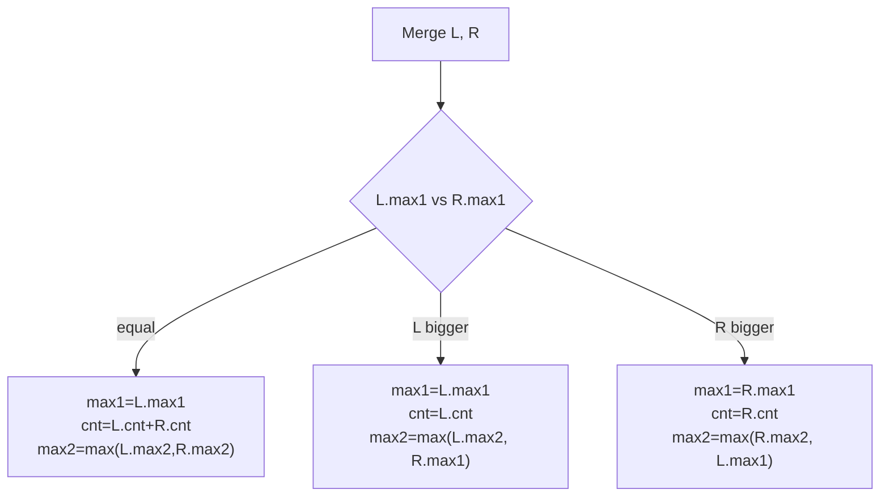

# Segment Tree Beats — Middle Level

> **Audience:** Engineers who have written the basic chmin + sum Segment Tree Beats (`junior.md`) and now want the precise meaning of the break/tag conditions, the symmetric **chmax**, and the crown jewel of the family: **range-add combined with range-chmin** in one tree. Prerequisite: `junior.md`.

This document is about **why and when**. Why are the conditions `x >= max1` (break) and `x > max2` (tag) the *exact* right cutoffs — no looser, no tighter? When does Segment Tree Beats beat (and lose to) alternatives? And how do you stack a **range-add tag** on top of the chmin machinery so that "add `v` to a range, then clamp another range at `x`" both run in amortized polylog time? That combination is the real reason Beats matters in contests and in analytics engines.

---

## Table of Contents

1. [Introduction](#introduction)
2. [The Break Condition and Tag Condition, Precisely](#conditions)
3. [Why max2 Must Be Strict — A Worked Counterexample](#strict-max2)
4. [Symmetric chmax](#chmax)
5. [Combining chmin AND chmax in One Tree](#both)
6. [Range-Add + Range-Chmin — The Big Combination](#add-chmin)
7. [Comparison with Alternatives](#comparison)
8. [Advanced Pattern — Historic Maximum](#historic)
9. [Full Implementations — Go, Java, Python](#code)
10. [Error Handling](#errors)
11. [Performance Analysis](#performance)
12. [Best Practices](#best-practices)
13. [Visual Animation](#animation)
14. [Summary](#summary)

---

<a name="introduction"></a>
## 1. Introduction

A plain lazy segment tree answers "is this update uniform across my whole subtree?" with a binary yes/no — yes if the node is fully covered, no otherwise. Segment Tree Beats refines this into a **three-way** decision keyed on the *values* in the subtree, not just on the index range:

- **Break:** the update provably changes nothing here.
- **Tag:** the update is uniform *on the part that matters* (the maxima) and can be applied in O(1).
- **Recurse:** the update is not uniform; split and re-test on smaller segments.

The whole art is choosing the break and tag conditions so that (a) they are **correct** — never apply a tag that would give a wrong sum — and (b) they are **tight** — recurse as rarely as possible, so the amortized cost stays low. For chmin those conditions are `x >= max1` and `max2 < x < max1`. This section explains exactly why, then builds chmax, the combined tree, and the marquee range-add + chmin tree.

---

<a name="conditions"></a>
## 2. The Break Condition and Tag Condition, Precisely

Consider `chmin(x)` reaching a node whose segment is fully inside the query range. Let the node store `max1`, `max2` (strict second max), `cnt`, `sum`.

### 2.1 Break: `x >= max1`

If `x >= max1`, then **every** element `e` in the segment satisfies `e <= max1 <= x`, so `min(e, x) = e`. Nothing changes. We return immediately. This is the *value-aware* generalization of the disjoint check: a normal segment tree prunes when the index ranges don't overlap; Beats *also* prunes when the values make the update a no-op.

### 2.2 Tag: `max2 < x < max1`

If `max2 < x < max1`:

- Elements equal to `max1` (there are `cnt` of them) satisfy `e = max1 > x`, so they become `x`.
- Every other element `e` satisfies `e <= max2 < x`, so `min(e, x) = e` — unchanged.

Therefore the update affects **exactly** the `cnt` maximum elements, each dropping from `max1` to `x`. The aggregate update is closed-form:

```text
sum  -= cnt * (max1 - x)
max1  = x
cnt, max2 unchanged
```

This is O(1) — the **defining win** of Beats. The condition `x > max2` is precisely what guarantees "only the maxima are affected," which is precisely what makes the O(1) update correct.

### 2.3 Recurse: `x <= max2`

If `x <= max2`, then at least one *non-maximum* element (one of those equal to `max2`, or smaller) is `>= x` and would be lowered — but those elements have heterogeneous values, so no single closed form updates the sum. We must descend. After pushing the implied cap down and recursing, the children have smaller segments where `x` is more likely to clear their `max2`.

### 2.4 Why this is tight

Could we use a looser tag condition, say `x > max2 - 1`? No: if `x == max2`, an element equal to `max2` *also* changes, breaking the "only maxima" assumption. Could we use a tighter break, say `x > max1`? That would needlessly recurse when `x == max1` (a no-op). So `>= max1` and `> max2` are the exact boundaries. The animation in this folder colors nodes by exactly these three outcomes.

| Reaching `x` vs node | Region | Outcome |
|---|---|---|
| `x >= max1` | at or above the max | **break** (no-op) |
| `max2 < x < max1` | strictly between 2nd-max and max | **tag** (O(1)) |
| `x <= max2` | at or below the 2nd-max | **recurse** |

---

<a name="strict-max2"></a>
## 3. Why max2 Must Be Strict — A Worked Counterexample

Suppose, by mistake, `max2` were the *non-strict* second maximum, i.e. it could equal `max1`. Take a node over `[5, 5, 3]`: `max1 = 5`, `cnt = 2`. A correct strict `max2 = 3`. A buggy non-strict `max2` might be `5`.

Now `chmin(4)`. With the **correct strict** `max2 = 3`: tag condition `4 > 3` holds, so two elements (the 5s) drop to 4: `sum = 13 → 13 - 2*(5-4) = 11`. Array becomes `[4,4,3]`, sum 11. ✓

With the **buggy** `max2 = 5`: tag condition `4 > 5` is false, so we recurse — slower, but *still correct* (recursion always recomputes). So an over-large `max2` only costs time, not correctness. The dangerous direction is an **under-large** `max2`: if `max2` were reported as `2` when it should be `3`, then `chmin(3)` would (wrongly) satisfy `3 > 2` and apply a tag — but the real second max is 3, which *also* gets clamped at 3 (no change here, but in general this under-counts affected elements and corrupts the sum).

**Rule:** `max2` must be the *exact strict* second maximum. The merge in `junior.md §5.2` produces exactly this; verify it against brute force.



---

<a name="chmax"></a>
## 4. Symmetric chmax

`chmax(x)` (`a_i = max(a_i, x)`) is the mirror image. Track at each node:

| Field | Meaning |
|---|---|
| `min1` | minimum value |
| `min2` | strict second minimum (`+∞` if all equal) |
| `cnt_min` | count of elements equal to `min1` |

The three-way test flips:

- **Break:** `x <= min1` — every element already `>= x`.
- **Tag:** `min1 < x < min2` — only the minimum elements are raised, `cnt_min` of them, each from `min1` to `x`: `sum += cnt_min * (x - min1)`.
- **Recurse:** `x >= min2`.

The merge for the min-trio is the exact reflection of the max-trio:

```text
min1 = min(L.min1, R.min1)
if L.min1 == R.min1: cnt_min = L.cnt_min + R.cnt_min; min2 = min(L.min2, R.min2)
elif L.min1 < R.min1: cnt_min = L.cnt_min;            min2 = min(L.min2, R.min1)
else:                 cnt_min = R.cnt_min;            min2 = min(R.min2, L.min1)
```

---

<a name="both"></a>
## 5. Combining chmin AND chmax in One Tree

To support *both* chmin and chmax (and sum), a node carries the full sextet: `sum, max1, max2, cnt_max, min1, min2, cnt_min`. The two operations interact through a subtlety:

> When `chmin` lowers `max1` to `x`, it may also affect `min1`, `min2`, or even the second-extremes — because in a node of size 1 or 2, the maximum and minimum are the same elements.

The standard fix: in `applyChmin(v, x)`, after lowering `max1` to `x`, also patch the *minimum* fields if they referenced the old maximum:

```text
applyChmin(v, x):                       # max2 < x < max1
    sum -= (max1 - x) * cnt_max
    if min1 == max1:  min1 = x          # singleton-ish node: min was the max
    if min2 == max1:  min2 = x          # the 2nd-min coincided with the max
    max1 = x
```

and symmetrically for `applyChmax`. This bookkeeping is fiddly; most contest solutions that need both operations carefully enumerate these coincidence cases. For the *combined* case the per-node "apply" becomes a small set of conditionals, but the asymptotics are unchanged.

---

<a name="add-chmin"></a>
## 6. Range-Add + Range-Chmin — The Big Combination

This is the headline result: support **`add(l, r, v)`** (`a_i += v`) *and* **`chmin(l, r, x)`** *and* range-sum / range-max, all amortized polylog. The reason it is nontrivial: a range-add shifts `max1`, `max2`, *and* every element uniformly, so it composes cleanly with the trio — but the chmin's `applyChmin` only touches the maxima, so the **add tag must be applied to `max1` and `max2` differently from the chmin tag.**

### 6.1 Two lazy tags per node

Each node holds **two** pending tags:

1. `addAll` — an amount to add to *every* element below.
2. `addMax` — an additional amount to add only to elements currently equal to `max1`.

Why two? Because a chmin is implemented as "add a (negative) amount to *only the maximum* elements." Instead of a separate chmin tag, we model `applyChmin(x)` as `addMax = -(max1 - x)`: lower just the maxima. Range-add contributes to `addAll` (everyone). This unifies add and chmin into a two-component additive tag.

### 6.2 The apply function

```text
applyTag(v, addAll, addMax):
    # elements equal to max1 get addAll + addMax; others get addAll
    sum  += addAll * (cnt of all elements) + addMax * cnt_max
    max1 += addAll + addMax
    if max2 != -inf: max2 += addAll      # 2nd-max is a non-max element: only addAll
    addAll[v] += addAll
    addMax[v] += addMax
```

- A **range-add `+v`**: `applyTag(v, addAll=v, addMax=0)`.
- A **chmin to `x`** at a tag-eligible node (`max2 < x < max1`): `applyTag(v, addAll=0, addMax=x - max1)`. This raises max1 by `(x - max1) < 0`, i.e. lowers it to `x`, and adjusts `sum` by `cnt_max*(x-max1)` — exactly the chmin formula.

### 6.3 Push-down composes the tags

On push-down, a parent flushes both `addAll` and `addMax` to each child. But there is a catch: `addMax` applies to elements equal to the *parent's* max1, which after `addAll` may or may not still be the child's max1. The standard resolution: a child receives `addMax` **only if its `max1` equals the parent's pre-tag `max1`** (i.e. the child contains the global maximum). Concretely:

```text
pushDown(v):
    for child in (L, R):
        give = (child.max1 == max1_of_parent_before_tag)
        applyTag(child, addAll[v], give ? addMax[v] : 0)
    addAll[v] = addMax[v] = 0
```

In implementation, the cleaner trick (used in the reference code below) is: push `addAll` to both children, then for `addMax`, apply it to a child **iff `child.max1` (after addAll) equals the new parent `max1`**. Equivalently: a child gets the `addMax` only when it still carries a maximum-valued element.

### 6.4 Complexity

With range-add interleaved, the amortized cost rises to **O(n log² n)** (and a careful analysis by Ji shows the combined add+chmin+chmax+sum problem is O(q log² n) or O(q log³ n) depending on the exact operation set and analysis). The potential function argument is in `professional.md`.

| Operation set | Amortized bound |
|---|---|
| chmin + sum | O(log² n) per op |
| chmin + chmax + sum | O(log² n) per op |
| chmin + add + sum | O(log² n) per op |
| chmin + chmax + add + sum (+ historic max) | O(log² n)–O(log³ n) per op |

---

<a name="comparison"></a>
## 7. Comparison with Alternatives

| Attribute | Segment Tree Beats | Lazy Segment Tree | Sqrt Decomposition | Balanced BST (per-value) |
|---|---|---|---|---|
| Range chmin/chmax | **yes** | **no** | yes (block rebuild) | no (not range-indexed) |
| Range add + sum | yes | yes | yes | no |
| Per-op cost | amortized O(log² n) | O(log n) worst | O(√n) | O(log n) |
| Worst-case per op | **not bounded by log** | O(log n) | O(√n) | O(log n) |
| Implementation difficulty | high | medium | low | medium |
| Memory | ~6–8 fields/node | 2 fields/node | O(n) + blocks | O(n) |
| Best for | chmin/chmax-heavy range problems | uniform range updates | simple, small constraints | order statistics |

**Choose Segment Tree Beats when:** the problem mixes range chmin/chmax with range sum/max and `n, q` are large (≥ 10⁵).
**Choose a plain lazy segment tree when:** updates are uniform (add/assign) — Beats is pure overhead there.
**Choose sqrt decomposition when:** `n` is small (≤ a few × 10⁴), or you want the simplest correct thing and per-op `O(√n)` is acceptable. Each block keeps `max1/cnt`; a chmin rebuilds only the partial boundary blocks and tags whole blocks.

---

<a name="historic"></a>
## 8. Advanced Pattern — Historic Maximum

A famous extension: support range-add and chmin while answering **"the maximum value position `i` *ever* held"** — its *historic maximum* `H_i = max over time of a_i`. This requires tracking, per node, the historic max of the current max (`hmax1`) and an extra "historic add to max" lazy component. The bookkeeping mirrors §6 with one more tag pair. This is the problem Ji's original paper centers on ("区间最值操作与历史最值问题" = "range min/max operations and historic value problems"). We sketch it in `professional.md`; for now, know that the trio (`max1/max2/cnt`) + two-component add tag is the substrate everything else builds on.

---

<a name="code"></a>
## 9. Full Implementations — Go, Java, Python

A range-**add** + range-**chmin** + range-sum/max tree. The node carries `sum, max1, max2, cnt`, with two lazy tags `addAll`, `addMax`.

### Go

```go
package beats

const NEG = int64(-1) << 61

type AddChmin struct {
    n                          int
    sum, max1, max2, cnt       []int64
    addAll, addMax             []int64
    sz                         []int64 // segment size cache
}

func NewAddChmin(a []int64) *AddChmin {
    n := len(a)
    m := 4 * max(n, 1)
    t := &AddChmin{n: n,
        sum: make([]int64, m), max1: make([]int64, m), max2: make([]int64, m),
        cnt: make([]int64, m), addAll: make([]int64, m), addMax: make([]int64, m),
        sz: make([]int64, m)}
    if n > 0 {
        t.build(1, 0, n-1, a)
    }
    return t
}

func (t *AddChmin) merge(v int) {
    L, R := 2*v, 2*v+1
    t.sum[v] = t.sum[L] + t.sum[R]
    if t.max1[L] == t.max1[R] {
        t.max1[v] = t.max1[L]; t.cnt[v] = t.cnt[L] + t.cnt[R]
        t.max2[v] = maxI(t.max2[L], t.max2[R])
    } else if t.max1[L] > t.max1[R] {
        t.max1[v] = t.max1[L]; t.cnt[v] = t.cnt[L]
        t.max2[v] = maxI(t.max2[L], t.max1[R])
    } else {
        t.max1[v] = t.max1[R]; t.cnt[v] = t.cnt[R]
        t.max2[v] = maxI(t.max2[R], t.max1[L])
    }
}

func (t *AddChmin) build(v, lo, hi int, a []int64) {
    t.sz[v] = int64(hi - lo + 1)
    if lo == hi {
        t.sum[v] = a[lo]; t.max1[v] = a[lo]; t.max2[v] = NEG; t.cnt[v] = 1
        return
    }
    mid := (lo + hi) / 2
    t.build(2*v, lo, mid, a); t.build(2*v+1, mid+1, hi, a)
    t.merge(v)
}

// applyTag adds `all` to every element and `mx` to the max-valued elements.
func (t *AddChmin) applyTag(v int, all, mx int64) {
    t.sum[v] += all*t.sz[v] + mx*t.cnt[v]
    t.max1[v] += all + mx
    if t.max2[v] != NEG {
        t.max2[v] += all
    }
    t.addAll[v] += all
    t.addMax[v] += mx
}

func (t *AddChmin) pushDown(v int) {
    L, R := 2*v, 2*v+1
    mx := maxI(t.max1[L], t.max1[R]) // max after addAll is applied uniformly
    for _, c := range []int{L, R} {
        if t.max1[c] == mx {
            t.applyTag(c, t.addAll[v], t.addMax[v])
        } else {
            t.applyTag(c, t.addAll[v], 0)
        }
    }
    t.addAll[v], t.addMax[v] = 0, 0
}

func (t *AddChmin) Add(l, r int, v int64)   { t.add(1, 0, t.n-1, l, r, v) }
func (t *AddChmin) Chmin(l, r int, x int64) { t.chmin(1, 0, t.n-1, l, r, x) }

func (t *AddChmin) add(v, lo, hi, l, r int, val int64) {
    if r < lo || hi < l {
        return
    }
    if l <= lo && hi <= r {
        t.applyTag(v, val, 0)
        return
    }
    t.pushDown(v)
    mid := (lo + hi) / 2
    t.add(2*v, lo, mid, l, r, val); t.add(2*v+1, mid+1, hi, l, r, val)
    t.merge(v)
}

func (t *AddChmin) chmin(v, lo, hi, l, r int, x int64) {
    if r < lo || hi < l || x >= t.max1[v] {
        return
    }
    if l <= lo && hi <= r && x > t.max2[v] {
        t.applyTag(v, 0, x-t.max1[v]) // lower only the maxima to x
        return
    }
    t.pushDown(v)
    mid := (lo + hi) / 2
    t.chmin(2*v, lo, mid, l, r, x); t.chmin(2*v+1, mid+1, hi, l, r, x)
    t.merge(v)
}

func (t *AddChmin) QuerySum(l, r int) int64 { return t.qsum(1, 0, t.n-1, l, r) }
func (t *AddChmin) qsum(v, lo, hi, l, r int) int64 {
    if r < lo || hi < l {
        return 0
    }
    if l <= lo && hi <= r {
        return t.sum[v]
    }
    t.pushDown(v)
    mid := (lo + hi) / 2
    return t.qsum(2*v, lo, mid, l, r) + t.qsum(2*v+1, mid+1, hi, l, r)
}

func maxI(a, b int64) int64 { if a > b { return a }; return b }
func max(a, b int) int     { if a > b { return a }; return b }
```

### Java

```java
public final class AddChmin {
    static final long NEG = Long.MIN_VALUE / 4;
    final int n;
    final long[] sum, max1, max2, cnt, addAll, addMax, sz;

    public AddChmin(long[] a) {
        n = a.length; int m = Math.max(4 * n, 4);
        sum = new long[m]; max1 = new long[m]; max2 = new long[m]; cnt = new long[m];
        addAll = new long[m]; addMax = new long[m]; sz = new long[m];
        if (n > 0) build(1, 0, n - 1, a);
    }

    private void merge(int v) {
        int L = 2 * v, R = 2 * v + 1;
        sum[v] = sum[L] + sum[R];
        if (max1[L] == max1[R]) { max1[v] = max1[L]; cnt[v] = cnt[L] + cnt[R]; max2[v] = Math.max(max2[L], max2[R]); }
        else if (max1[L] > max1[R]) { max1[v] = max1[L]; cnt[v] = cnt[L]; max2[v] = Math.max(max2[L], max1[R]); }
        else { max1[v] = max1[R]; cnt[v] = cnt[R]; max2[v] = Math.max(max2[R], max1[L]); }
    }

    private void build(int v, int lo, int hi, long[] a) {
        sz[v] = hi - lo + 1;
        if (lo == hi) { sum[v] = a[lo]; max1[v] = a[lo]; max2[v] = NEG; cnt[v] = 1; return; }
        int mid = (lo + hi) >>> 1;
        build(2 * v, lo, mid, a); build(2 * v + 1, mid + 1, hi, a);
        merge(v);
    }

    private void applyTag(int v, long all, long mx) {
        sum[v] += all * sz[v] + mx * cnt[v];
        max1[v] += all + mx;
        if (max2[v] != NEG) max2[v] += all;
        addAll[v] += all; addMax[v] += mx;
    }

    private void pushDown(int v) {
        int L = 2 * v, R = 2 * v + 1;
        long mx = Math.max(max1[L], max1[R]);
        applyTag(L, addAll[v], max1[L] == mx ? addMax[v] : 0);
        applyTag(R, addAll[v], max1[R] == mx ? addMax[v] : 0);
        addAll[v] = 0; addMax[v] = 0;
    }

    public void add(int l, int r, long v)   { add(1, 0, n - 1, l, r, v); }
    public void chmin(int l, int r, long x) { chmin(1, 0, n - 1, l, r, x); }

    private void add(int v, int lo, int hi, int l, int r, long val) {
        if (r < lo || hi < l) return;
        if (l <= lo && hi <= r) { applyTag(v, val, 0); return; }
        pushDown(v);
        int mid = (lo + hi) >>> 1;
        add(2 * v, lo, mid, l, r, val); add(2 * v + 1, mid + 1, hi, l, r, val);
        merge(v);
    }

    private void chmin(int v, int lo, int hi, int l, int r, long x) {
        if (r < lo || hi < l || x >= max1[v]) return;
        if (l <= lo && hi <= r && x > max2[v]) { applyTag(v, 0, x - max1[v]); return; }
        pushDown(v);
        int mid = (lo + hi) >>> 1;
        chmin(2 * v, lo, mid, l, r, x); chmin(2 * v + 1, mid + 1, hi, l, r, x);
        merge(v);
    }

    public long querySum(int l, int r) { return qsum(1, 0, n - 1, l, r); }
    private long qsum(int v, int lo, int hi, int l, int r) {
        if (r < lo || hi < l) return 0;
        if (l <= lo && hi <= r) return sum[v];
        pushDown(v);
        int mid = (lo + hi) >>> 1;
        return qsum(2 * v, lo, mid, l, r) + qsum(2 * v + 1, mid + 1, hi, l, r);
    }
}
```

### Python

```python
class AddChmin:
    """Range add + range chmin + range sum, via Segment Tree Beats with a two-component tag."""
    NEG = -(1 << 61)

    def __init__(self, a):
        self.n = len(a)
        m = max(4 * self.n, 4)
        self.sum  = [0] * m
        self.max1 = [0] * m
        self.max2 = [self.NEG] * m
        self.cnt  = [0] * m
        self.addAll = [0] * m
        self.addMax = [0] * m
        self.sz   = [0] * m
        if self.n:
            self._build(1, 0, self.n - 1, a)

    def _merge(self, v):
        L, R = 2 * v, 2 * v + 1
        self.sum[v] = self.sum[L] + self.sum[R]
        if self.max1[L] == self.max1[R]:
            self.max1[v] = self.max1[L]; self.cnt[v] = self.cnt[L] + self.cnt[R]
            self.max2[v] = max(self.max2[L], self.max2[R])
        elif self.max1[L] > self.max1[R]:
            self.max1[v] = self.max1[L]; self.cnt[v] = self.cnt[L]
            self.max2[v] = max(self.max2[L], self.max1[R])
        else:
            self.max1[v] = self.max1[R]; self.cnt[v] = self.cnt[R]
            self.max2[v] = max(self.max2[R], self.max1[L])

    def _build(self, v, lo, hi, a):
        self.sz[v] = hi - lo + 1
        if lo == hi:
            self.sum[v] = self.max1[v] = a[lo]
            self.max2[v] = self.NEG; self.cnt[v] = 1
            return
        mid = (lo + hi) // 2
        self._build(2 * v, lo, mid, a); self._build(2 * v + 1, mid + 1, hi, a)
        self._merge(v)

    def _apply(self, v, all_, mx):
        self.sum[v]  += all_ * self.sz[v] + mx * self.cnt[v]
        self.max1[v] += all_ + mx
        if self.max2[v] != self.NEG:
            self.max2[v] += all_
        self.addAll[v] += all_
        self.addMax[v] += mx

    def _push(self, v):
        L, R = 2 * v, 2 * v + 1
        mx = max(self.max1[L], self.max1[R])
        self._apply(L, self.addAll[v], self.addMax[v] if self.max1[L] == mx else 0)
        self._apply(R, self.addAll[v], self.addMax[v] if self.max1[R] == mx else 0)
        self.addAll[v] = self.addMax[v] = 0

    def add(self, l, r, v):   self._add(1, 0, self.n - 1, l, r, v)
    def chmin(self, l, r, x): self._chmin(1, 0, self.n - 1, l, r, x)

    def _add(self, v, lo, hi, l, r, val):
        if r < lo or hi < l: return
        if l <= lo and hi <= r:
            self._apply(v, val, 0); return
        self._push(v)
        mid = (lo + hi) // 2
        self._add(2 * v, lo, mid, l, r, val); self._add(2 * v + 1, mid + 1, hi, l, r, val)
        self._merge(v)

    def _chmin(self, v, lo, hi, l, r, x):
        if r < lo or hi < l or x >= self.max1[v]: return
        if l <= lo and hi <= r and x > self.max2[v]:
            self._apply(v, 0, x - self.max1[v]); return
        self._push(v)
        mid = (lo + hi) // 2
        self._chmin(2 * v, lo, mid, l, r, x); self._chmin(2 * v + 1, mid + 1, hi, l, r, x)
        self._merge(v)

    def query_sum(self, l, r):
        return self._qsum(1, 0, self.n - 1, l, r)

    def _qsum(self, v, lo, hi, l, r):
        if r < lo or hi < l: return 0
        if l <= lo and hi <= r: return self.sum[v]
        self._push(v)
        mid = (lo + hi) // 2
        return self._qsum(2 * v, lo, mid, l, r) + self._qsum(2 * v + 1, mid + 1, hi, l, r)
```

---

<a name="errors"></a>
## 10. Error Handling

| Scenario | What goes wrong | Correct approach |
|---|---|---|
| `addMax` given to wrong child | Pushing `addMax` to a child whose max1 is not the global max | Only apply `addMax` to the child whose `max1` equals the post-addAll parent max. |
| `max2` not advanced by add | After range-add, `max2` stale | In `applyTag`, advance `max2 += all` (but **not** `addMax`). |
| Sentinel arithmetic overflow | Adding to `NEG` second-max | Guard `if max2 != NEG` before advancing it. |
| chmin not modeled as add-to-max | Separate buggy chmin tag | Model chmin as `applyTag(0, x - max1)`. Unifies tags. |
| Sum drift on combined ops | Wrong order of merge/push | Always: pushDown before recursing, merge after. |

---

<a name="performance"></a>
## 11. Performance Analysis

The cost driver is **how often chmin recurses past the tag condition**. Each recursion is "charged" against a drop in a potential function (number of distinct values along root-to-leaf paths; see `professional.md`). Empirically:

- **chmin + sum** on random data: ~1.2× the cost of a normal lazy segment tree.
- **chmin + sum** on adversarial data (designed to maximize recursion): the O(n log² n) bound is realized, ~`log n` × a normal lazy tree.
- **add + chmin** combined: roughly 1.5–2× the chmin-only cost, due to the two-component tag and the extra `max2` bookkeeping.

Benchmark scaffold (Python; translate as practice):

```python
import time, random
sizes = [10_000, 100_000, 1_000_000]
for n in sizes:
    a = [random.randint(0, 10**9) for _ in range(n)]
    t = AddChmin(a)
    start = time.time()
    for _ in range(n):
        l = random.randint(0, n - 1); r = random.randint(l, n - 1)
        if random.random() < 0.5: t.chmin(l, r, random.randint(0, 10**9))
        else: t.add(l, r, random.randint(-100, 100))
    print(f"n={n:>9}: {(time.time()-start)*1000:.1f} ms for {n} ops")
```

---

<a name="best-practices"></a>
## 12. Best Practices

- **Cache segment size** (`sz[v]`) so `applyTag` is O(1); recomputing `hi - lo + 1` requires passing bounds everywhere.
- **Model chmin as a negative add-to-max** rather than a separate tag; it makes push-down composition uniform.
- **Test the combined tree against a brute force** that literally maintains the array and replays each op — random sequences of add/chmin/query.
- **Keep `max2` strict and advance it by `addAll` only** (never `addMax`), since the second-max is by definition a non-maximum element.
- **Use 64-bit** for everything; `addAll * sz + addMax * cnt` grows fast.
- **Push down in queries too** — combined tags make the on-the-fly query shortcut unsafe.

---

<a name="animation"></a>
## 13. Visual Animation

> See [`animation.html`](./animation.html) for the interactive visualization.
>
> Middle-level use of the animation:
> - Fire two chmins in a row to watch the **first stop at the root (tag)** and the **second recurse (because x dropped below max2)**.
> - Observe each node's `max1 / max2 / cnt` and how the merge restores a strict second-max.
> - Track the live sum and the per-node break/tag/recurse coloring.

---

<a name="summary"></a>
## 14. Summary

- The **break condition** `x >= max1` and **tag condition** `max2 < x < max1` are exactly tight: looser tags corrupt the sum, tighter ones waste time.
- `max2` must be the **strict** second maximum; the merge cases in §3 produce it. An under-large `max2` corrupts correctness; an over-large one only costs time.
- **chmax** is the perfect mirror using `min1/min2/cnt_min` and tests `x <= min1` (break), `min1 < x < min2` (tag).
- **Range-add + range-chmin** in one tree uses a **two-component tag** (`addAll`, `addMax`): add hits everyone, chmin is modeled as a negative add to only the maxima. Amortized O(n log² n).
- Beats wins over plain lazy segment trees only when chmin/chmax is required; otherwise it is pure overhead.

**Next step:** [senior.md](./senior.md) — competitive/analytics usage, performance and constant factors, and when to prefer alternatives.
