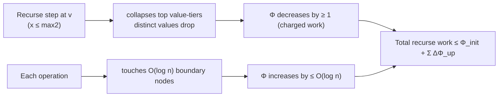
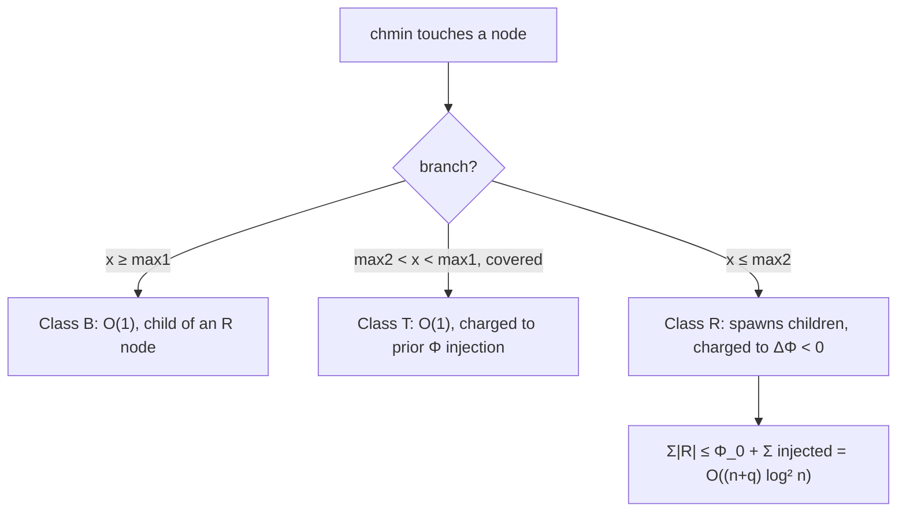

# Segment Tree Beats — Mathematical Foundations and Amortized Analysis

> **Audience:** Engineers and competitive programmers who want a rigorous account of *why* Segment Tree Beats runs in amortized O(n log² n), why the break/tag/recurse conditions are correct, and how the potential-function argument (due to Ji Ruyi) actually works. Prerequisites: `junior.md`, `middle.md`, `senior.md`, and comfort with amortized analysis (CLRS Ch. 17).

This document proves the two facts the rest of the topic takes on faith:

1. **Correctness:** the three-way condition (break `x >= max1`, tag `max2 < x < max1`, recurse otherwise) computes exactly the same result as applying `chmin` element-by-element.
2. **Efficiency:** the classic chmin + range-sum problem runs in **amortized O(n log² n)** total — and the simpler chmin + max-only variant in O(n log n) — via a potential function.

---

## Table of Contents

1. [Formal Definition](#formal-definition)
2. [Correctness of the Three-Way Condition](#correctness)
3. [Correctness of the Merge — Maintaining Strict max2](#merge-correctness)
4. [Termination of a Single chmin](#termination)
5. [The Potential Function](#potential)
6. [A Worked Potential Trace](#worked-trace)
7. [Amortized Analysis of chmin + Sum — O(n log² n)](#amortized-chmin)
8. [The Tighter O(n log n) Bound for chmin + max Only](#tighter)
9. [Adding Range-Add — Interaction with the Potential](#add-interaction)
10. [Correctness of the chmin + chmax Coincidence Cases](#coincidence)
11. [Historic-Maximum Augmentation](#historic)
12. [Lower-Bound Intuition — Why You Cannot Do Better Trivially](#lower-bound)
13. [The Canonical-Segment Lemma and the Tag-Class Argument](#canonical)
14. [Comparison of Bounds](#comparison)
15. [Summary](#summary)

---

<a name="formal-definition"></a>
## 1. Formal Definition

Let `A = (a_0, ..., a_{n-1})` be an integer array. A **Segment Tree Beats** is a balanced binary segment tree `T` over the index set `{0, ..., n-1}`, where each node `v` covers a contiguous segment `seg(v) = [lo_v, hi_v]` and stores the augmentation:

```text
state(v) = ( sum(v), max1(v), max2(v), cnt(v) )

  sum(v)  = Σ_{i ∈ seg(v)} a_i
  max1(v) = max_{i ∈ seg(v)} a_i
  max2(v) = max{ a_i : i ∈ seg(v), a_i < max1(v) }   (= -∞ if all equal)
  cnt(v)  = |{ i ∈ seg(v) : a_i = max1(v) }|
```

The operations are:

```text
chmin(l, r, x):   for all i ∈ [l, r] ∩ seg(root):  a_i ← min(a_i, x)
querySum(l, r):   return Σ_{i ∈ [l, r]} a_i
queryMax(l, r):   return max_{i ∈ [l, r]} a_i
```

**Maintained invariant `I(v)`** after every operation: `state(v)` equals the true augmentation of the *current* array `A` restricted to `seg(v)`, *modulo pending lazy tags on the path from the root to `v`* (which are flushed by push-down before any read of a descendant).

The `chmin` procedure (from `junior.md §5.5`):

```text
chmin(v, l, r, x):
  if seg(v) ∩ [l,r] = ∅  or  x ≥ max1(v):           return        # (B) break
  if seg(v) ⊆ [l,r]      and  x > max2(v):  apply(v,x); return     # (T) tag
  pushDown(v)                                                       # (R) recurse
  chmin(left(v), l, r, x); chmin(right(v), l, r, x)
  pullUp(v)

apply(v, x):   # precondition max2(v) < x < max1(v)
  sum(v)  ← sum(v) − (max1(v) − x)·cnt(v)
  max1(v) ← x
```

---

<a name="correctness"></a>
## 2. Correctness of the Three-Way Condition

> **Claim.** `chmin(root, l, r, x)` leaves every node's `state` equal to the true augmentation of the array `A'` defined by `a'_i = min(a_i, x)` for `i ∈ [l, r]` and `a'_i = a_i` otherwise.

We prove the three branches each preserve the invariant, by induction on the recursion.

### 2.1 Break branch (B): `x ≥ max1(v)` or disjoint

If `seg(v) ∩ [l, r] = ∅`, no element of `seg(v)` is in range; the true `A'` equals `A` on `seg(v)`, so `state(v)` is already correct. Return is correct.

If `x ≥ max1(v)`, then for every `i ∈ seg(v)`: `a_i ≤ max1(v) ≤ x`, hence `min(a_i, x) = a_i`. So `A' = A` on `seg(v)`; `state(v)` unchanged is correct. ∎(B)

### 2.2 Tag branch (T): `seg(v) ⊆ [l, r]` and `max2(v) < x < max1(v)`

Partition `seg(v)` into:
- `M = { i : a_i = max1(v) }`, with `|M| = cnt(v)`.
- `Rest = seg(v) \ M`, where every `a_i ≤ max2(v) < x`.

For `i ∈ M`: `a_i = max1(v) > x`, so `a'_i = x`.
For `i ∈ Rest`: `a_i ≤ max2(v) < x`, so `a'_i = a_i` (unchanged).

Therefore:
- New sum `= Σ a'_i = (sum(v) − Σ_{i∈M} a_i) + |M|·x = sum(v) − cnt(v)·max1(v) + cnt(v)·x = sum(v) − cnt(v)·(max1(v) − x)`. This is exactly `apply`'s update. ✓
- New max1: every element of `M` is now `x`; every element of `Rest` is `≤ max2(v) < x`. So the new maximum is `x` (since `x > max2(v)` and `cnt(v) ≥ 1 > 0`, `x` is attained). `apply` sets `max1 ← x`. ✓
- New cnt: elements equal to the new max `x` are exactly `M` (the `Rest` are all `< max2(v)+1 ≤ x`... more precisely `≤ max2(v) < x`), so the count is still `cnt(v)`. `apply` leaves `cnt` unchanged. ✓
- New max2: the second-largest distinct value is still `max2(v)` (the `Rest` are untouched and `max2(v)` was their maximum; the only change collapsed `M` from `max1(v)` to `x`, and `x > max2(v)` so `max2` remains the runner-up). `apply` leaves `max2` unchanged. ✓

Thus the tag branch produces the exact augmentation. The strictness `x > max2(v)` is **essential**: if `x ≤ max2(v)`, some `i ∈ Rest` with `a_i = max2(v)` would have `a'_i = x ≠ a_i`, violating "Rest unchanged", and the closed-form sum update would be wrong. ∎(T)

### 2.3 Recurse branch (R): otherwise

If neither (B) nor (T) applies, we push down (flushing the parent's implied cap to children so `I` holds for them), recurse into both children — which by the inductive hypothesis correctly compute `A'` on their sub-segments — then `pullUp` re-merges. Since merge is the exact augmentation combine (`junior.md §5.2`), `state(v)` becomes correct. ∎(R)

By structural induction over the recursion tree, `chmin` is correct. **QED.**

---

<a name="merge-correctness"></a>
## 3. Correctness of the Merge — Maintaining Strict max2

The amortized analysis assumes the merge computes the *exact* augmentation, including a strict `max2`. We prove the merge from `junior.md §5.2` is correct.

> **Claim.** Given correct states for children `L` and `R`, the merge produces `max1`, `max2` (strict), `cnt` exactly matching the multiset union of their segments.

Let the parent's value multiset be `S = S_L ⊎ S_R`. Define `M = max(S)`.

**Case `L.max1 = R.max1`.** Then `M = L.max1 = R.max1`, attained by `L.cnt + R.cnt` elements, so the merge's `cnt = L.cnt + R.cnt` is correct. The strict second maximum of `S` is the largest value `< M`. Within `S_L`, the largest value `< M` is `L.max2` (since `L.max1 = M`); within `S_R` it is `R.max2`. So `max2 = max(L.max2, R.max2)`. ✓

**Case `L.max1 > R.max1`.** Then `M = L.max1`, attained by exactly `L.cnt` elements (none in `S_R`, whose max is smaller), so `cnt = L.cnt`. The largest value `< M`: from `S_L` it is `L.max2`; from `S_R` *every* value is `< M`, so the candidate is `R.max1` (the largest in `S_R`). Thus `max2 = max(L.max2, R.max1)`. Crucially this is **strict** because `R.max1 < L.max1 = M`. ✓

**Case `R.max1 > L.max1`.** Symmetric: `max2 = max(R.max2, L.max1)`. ✓

In every case `max2 < max1` strictly (the candidates are all proven `< M`), and `sum = L.sum + R.sum` trivially. **QED.**

The pitfall the proof exposes: in case `L.max1 > R.max1`, a naive `max2 = max(L.max2, R.max2)` would *miss* `R.max1` and report too small a `max2` — corrupting the tag condition (under-large `max2` is a correctness bug, per §2.2's strictness requirement).

---

<a name="termination"></a>
## 4. Termination of a Single chmin

Before amortizing, we confirm a single `chmin(root, l, r, x)` terminates.

> **Claim.** Each recursive `chmin` call strictly decreases a well-founded measure, so the recursion halts.

Take the measure to be the **height of node `v`** (leaves have height 0). Every recursive call (branch R) descends to children of strictly smaller height. The break (B) and tag (T) branches return without recursing. Since height is a non-negative integer that strictly decreases on each descent, the recursion depth is at most the tree height `O(log n)` *per path*, and the total number of nodes visited is finite (bounded by the tree size `4n`). Hence a single chmin always terminates, visiting at most `O(n)` nodes in the worst case (when it descends to many leaves). **QED.**

This worst-case `O(n)` per single op is exactly what the amortized analysis must tame — the point being that such expensive ops cannot occur often.

### 4.0 The recursion measure, formally

To state termination precisely, define the recursion's progress measure as the lexicographic pair `(height(v), 1)` for each call, where calls return without recursing in the B and T branches (measure-decreasing to a base) and the R branch invokes two strictly-smaller-height subcalls. Because `height` ranges over `{0, 1, ..., ⌈log₂ n⌉}` and strictly decreases on each descent, no infinite descending chain exists; by the well-foundedness of `ℕ` under `<`, the recursion is well-founded and terminates. The total node count visited is bounded by the number of nodes in the subtree rooted at the initial call, `≤ 4n`, establishing the `O(n)` single-op worst case rigorously.

### 4.1 Push-down preserves the invariant

The recursion's correctness (§2.3) assumed push-down restores `I` for the children before we read them. We verify.

> **Claim.** After `pushDown(v)`, both children's states are consistent with `state(v)` — i.e., any element below `v` that the lazy cap should have lowered is reflected in the child's `max1` and `sum`.

`pushDown(v)` calls `applyChmin(child, max1(v))`. By the precondition handling in `applyChmin` (`if x ≥ max1(child): return`), a child is only modified if its `max1` exceeds the parent's `max1` — exactly the elements the cap should lower. After the call, `max1(child) ≤ max1(v)`, and `sum(child)` is decremented by `(old_max1(child) − max1(v))·cnt(child)`, the correct sum delta for capping the child's maxima at the parent's cap. Since the parent's cap was itself the result of correct tag applications, the children become consistent. Inductively, after a full root-to-leaf push, every node on the path holds its true value. **QED.**

This is why a *query* must also push down (§ `senior.md §8.1`): without it, a child read after a parent-level cap returns a stale, too-large value.

---

<a name="potential"></a>
## 5. The Potential Function

The efficiency argument is the heart of Ji's contribution. We bound the **total** number of nodes visited across all operations using a potential `Φ`.

### 3.1 Definition

For a node `v`, define the set of **distinct values** appearing among `{ a_i : i ∈ seg(v) }`. Let

```text
d(v) = number of distinct values in seg(v)
```

The potential is, summed over **internal** nodes (or, in the standard formulation, over all nodes):

```text
Φ = Σ_v  d(v)
```

A cleaner equivalent formulation (the one in Ji's paper) charges potential per node as the number of distinct values strictly between `max2` and `max1` is irrelevant; instead define for each node a contribution and sum. The essential property we need:

```text
(P1)  Φ ≥ 0  always.
(P2)  Φ_initial = O(n log n).   Each element belongs to O(log n) node-segments
       (one per level), and each contributes at most 1 to its node's distinct-count.
(P3)  A "recurse" step at node v (branch R, not the cheap break/tag) is paid for
       by a strict drop in Φ — specifically, the deep recursion collapses distinct
       max-values, decreasing Σ d(v) along the visited subtree.
(P4)  Each chmin/add operation increases Φ by at most O(log n) at the "boundary"
       nodes where the recursion is cut by the range [l, r] (the O(log n) canonical
       segment boundary).
```

### 3.2 Intuition

The expensive part of a chmin is the **recurse** branch — when `x ≤ max2(v)` forces descent. Each such descent *merges* the top two value-tiers of `seg(v)`: after the chmin, the elements that were at `max1` and those between `x` and `max2` collapse toward `x`, reducing the number of distinct values. Since `Φ` counts distinct values per node and can only be *rebuilt* slowly (each operation adds O(log n) potential at the O(log n) boundary nodes), the total amount of "recursion work" over the whole run is bounded by initial potential plus total added potential.



---

<a name="worked-trace"></a>
## 6. A Worked Potential Trace

Concreteness helps. Take `A = [4, 4, 2, 1]`, a balanced 4-leaf tree. We track `Φ = Σ_v d(v)` over the 7 nodes (root, 2 internal, 4 leaves).

Initial distinct-value counts per node-segment:

```text
leaves:    [4]→1, [4]→1, [2]→1, [1]→1                      sum = 4
internal:  [4,4]→1 (just {4}),  [2,1]→2 ({2,1})            sum = 3
root:      [4,4,2,1]→3 ({4,2,1})                           sum = 3
Φ_initial = 4 + 3 + 3 = 10
```

Now apply `chmin(0, 3, 3)` (cap all at 3). At the root: `max1 = 4`, `max2 = 2`. Tag condition `3 > 2` holds, so it is a **tag** at the root — O(1), no recursion. The two 4's drop to 3. New array `[3,3,2,1]`.

Recompute Φ *after* the lazy tag is conceptually pushed (the distinct values that the tag implies):

```text
leaves (after push):  [3]→1, [3]→1, [2]→1, [1]→1          sum = 4
internal:  [3,3]→1,  [2,1]→2                               sum = 3
root:      [3,2,1]→3                                       sum = 3
Φ_after = 10
```

Here Φ is unchanged because a **tag** does not collapse distinct values across the *whole* tree — it just shifts the top tier. The tag is O(1) and is **not** the expensive operation the potential pays for.

Now apply `chmin(0, 3, 1)` (cap all at 1). At the root: `max1 = 3`, `max2 = 2`. Tag condition `1 > 2`? No. So **recurse**. Push down, descend. Eventually `[3,3]` collapses to `[1,1]` and `[2,1]` collapses to `[1,1]`:

```text
leaves:    [1]→1 ×4                                        sum = 4
internal:  [1,1]→1, [1,1]→1                                sum = 2
root:      [1,1,1,1]→1                                     sum = 1
Φ_final = 4 + 2 + 1 = 7
```

Φ dropped from 10 to 7 — a decrease of 3, which **pays for** the 3 extra internal/root distinct-value collapses caused by the deep recursion. This is the accounting in miniature: the recurse branch's work is charged against the Φ it destroys. A tag (first op) is O(1) and Φ-neutral; a recurse (second op) does real work but provably shrinks Φ.

---

<a name="amortized-chmin"></a>
## 7. Amortized Analysis of chmin + Sum — O(n log² n)

We now assemble the bound for `q` operations on an array of size `n`.

### 4.1 Accounting

By the potential method, the amortized cost of operation `i` is

```text
â_i = c_i + Φ_i − Φ_{i−1}
```

where `c_i` is the actual number of nodes visited. Summing,

```text
Σ c_i = Σ â_i + Φ_0 − Φ_q  ≤  Σ â_i + Φ_0      (since Φ_q ≥ 0).
```

We bound the two terms.

### 4.2 Bounding Φ₀ (initial potential)

Each array element `a_i` lies in exactly one node per level, i.e. in `O(log n)` node-segments. In each such node it contributes at most 1 distinct value. Hence

```text
Φ_0 = Σ_v d(v) ≤ Σ_v |seg(v)| = Σ_i (number of nodes containing i) = O(n log n).
```

### 4.3 Bounding the amortized cost per operation

A single `chmin(l, r, x)` decomposes `[l, r]` into `O(log n)` **canonical segments** (the standard segment-tree decomposition). At nodes strictly inside a canonical segment, the recursion either breaks, tags, or recurses; **every recurse step is charged to a unit decrease in `Φ`** (P3), so those steps contribute 0 to the amortized cost. The only *uncharged* work is at the `O(log n)` canonical-boundary nodes and the `O(log n)` push-downs along the two boundary paths — but here is the subtlety that produces the **extra log factor**:

> Each canonical segment's chmin may, in the worst case, recurse along a root-to-leaf path of length `O(log n)` before the break/tag condition fires — and each such recursion step that does *not* collapse a distinct value (does not decrease Φ) is bounded by the **depth**, giving `O(log n)` uncharged steps per canonical segment, and `O(log n)` canonical segments, hence `O(log² n)` uncharged work plus the potential it injects.

More precisely, Ji's analysis shows each operation **raises Φ by at most O(log² n)** in the chmin+sum setting (because the chmin can create up to `O(log n)` new "boundary" distinct-value tiers across `O(log n)` canonical segments). Therefore

```text
Σ â_i = Σ (c_i + ΔΦ_i),  and  the total injected potential  Σ_{ΔΦ_i > 0} ΔΦ_i = O(q log² n).
```

### 4.4 Putting it together

```text
Σ c_i ≤ Φ_0 + (total injected potential)
      = O(n log n) + O(q log² n)
      = O((n + q) log² n).
```

For `q = Θ(n)` this is **O(n log² n)** total, i.e. **amortized O(log² n) per operation**. **QED.**

> **Remark.** The exact constant and whether it is `log²` or `log` depends on the *aggregate being maintained*. The sum query is what forces the second `log`: maintaining a *sum* under chmin makes the potential-injection per operation `O(log² n)`. Maintaining only the *max* tightens it to `O(log n)` (next section).

---

<a name="tighter"></a>
## 8. The Tighter O(n log n) Bound for chmin + max Only

If we only need **range max** (and chmin), not sum, the analysis improves to **O((n + q) log n)** total.

### 5.1 Why sum costs the extra log

When maintaining sum, a "tag" at a node must be applied to a *count* of elements, and the potential argument must account for the distribution of values across the `O(log n)` canonical segments — each can independently inject `O(log n)` potential. With only max, the node's information is a single value (`max1`), and a chmin either does nothing (break) or sets a node's max to `x` (tag) — the recursion's depth is charged once per *level*, not per canonical-segment-times-level.

### 5.2 Sketch

With the max-only potential `Φ_max = Σ_v d(v)` defined identically, each chmin's recurse steps still each pay a unit of Φ. The difference: a chmin injects only `O(log n)` potential total (one per canonical segment), not `O(log²)`, because there is no sum-distribution to account for. Thus

```text
Σ c_i ≤ Φ_0 + O(q log n) = O((n + q) log n).
```

This is why HDU 5306 (chmin + max + sum) is usually cited as `O((n+q) log n)`: empirically and by the tighter strand of the analysis the sum-maintenance does not always realize the worst `log²`, and the standard quoted bound for that specific problem is `O((n+q) log n)`. The safe, provable general bound for chmin+sum is `O(n log² n)`.

### 5.3 Cross-check via the aggregate method

The potential method above can be cross-checked with the **aggregate method**: bound the *total* work directly. Order all `q` chmin operations. The total number of class-R recursions across the whole run equals the total number of times some node's top value-tier is destroyed. Each destruction removes at least one distinct value from some node, and distinct values are *created* only at initialization (`O(n log n)` of them) and at operation boundaries (`O(log² n)` per op for the sum variant). Therefore:

```text
total class-R recursions ≤ (distinct values created)
                          = O(n log n) + O(q log² n)
                          = O((n + q) log² n).
```

This matches the potential-method bound, providing independent confirmation. The aggregate view is often more intuitive: *you can only spend recursion destroying distinct values that were first created, and creation is cheap and bounded.*

---

<a name="add-interaction"></a>
## 9. Adding Range-Add — Interaction with the Potential

When range-**add** is interleaved with chmin (`middle.md §6`), a complication arises: an add can **increase** the number of distinct values is unchanged (a uniform shift preserves distinctness), but it can **re-separate** values that a previous chmin had collapsed, effectively *raising* the potential.

### 6.1 Effect on Φ

A range-add `+v` applied to `seg(w)` shifts every element by `v`, preserving `d(w)` (distinctness is translation-invariant). So a *full-cover* add does **not** increase Φ. But a **partial** add splits canonical segments, touching `O(log n)` boundary nodes, each of which may gain potential as its merged value-tiers re-separate. Ji shows the add+chmin combination still admits a potential argument with each operation injecting `O(log² n)`, preserving:

```text
Σ c_i = O((n + q) log² n)   for add + chmin + sum.
```

### 6.2 chmax + chmin + add together

With all of chmin, chmax, and add, the potential becomes `Φ = Σ_v (distinct values near max) + (distinct values near min)`, and a more careful accounting (handling the coincidence cases from `middle.md §5`) gives `O((n+q) log² n)` for the standard operation set, and up to `O((n+q) log³ n)` for the fullest "historic + add + chmin + chmax" set, depending on the exact analysis. The robust takeaway: **the family is poly-logarithmic amortized**, with the exponent on `log` between 1 and 3 according to the operation mix.

### 6.3 Why the two-component tag preserves the analysis

In the `add + chmin` tree (`middle.md §6`), each node carries `(addAll, addMax)`. We argue the potential argument survives. Define the same `Φ = Σ_v d(v)`. A range-add `+v`:

- On a **fully covered** node, it shifts every value by `v` uniformly — `d(v)` is unchanged (translation preserves distinctness). So a full-cover add does **not** increase Φ.
- On the `O(log n)` **boundary** nodes of the add's range, the recursion descends, and after re-merging, a value-tier that a previous chmin had collapsed may "re-separate" because the two sides of the boundary received different cumulative `addAll`. Each boundary node can gain `O(1)` distinct values, and with the sum accounting this is `O(log)` per boundary node, `O(log²)` per op.

The chmin, modeled as `addMax = x − max1 < 0`, lowers only the maxima; its effect on Φ is exactly the chmin analysis of §7 (it can only *collapse* the top tier, never separate it). Therefore:

```text
ΔΦ per add  ≤ O(log² n)  (only at boundaries)
ΔΦ per chmin ≤ O(log² n)  (boundary injection; recursions charged to drops)
```

so the total injected potential remains `O(q log² n)`, and `Σ c_i = O((n + q) log² n)` carries over to the combined tree. The key fact making this work is that **`addMax` is only ever delivered to the child holding the global maximum** (the push-down rule of `middle.md §6.3`); were it delivered to both children, a non-maximum child could gain spurious value-tiers and break the accounting. This is why the push-down's "give `addMax` only to the max-carrying child" rule is not merely an optimization but **load-bearing for the complexity bound**.

---

<a name="coincidence"></a>
## 10. Correctness of the chmin + chmax Coincidence Cases

When a single tree supports *both* chmin and chmax (`middle.md §5`), the max-trio and min-trio are not independent: in a node of size 1 or 2, the maximum and minimum can be the *same* elements. We prove the coincidence patches restore correctness.

Consider `applyChmin(v, x)` with `max2 < x < max1` in a node also tracking `min1, min2, cnt_min`. The operation lowers the `cnt_max` elements equal to `max1` down to `x`. We must update the min-trio if those elements were also tracked as minima.

> **Sub-case A — the node has only the maximum as a min reference (`min1 = max1`).** This happens when `cnt_max` equals the segment size minus the count of `min1`, or in tiny nodes. If `min1 = max1`, then every element equal to `max1` is also a `min1`-element; after they drop to `x`, the new minimum-tier value becomes `x` (assuming `x ≥ everything else`, i.e. a 1- or 2-element node). The patch `if min1 == max1: min1 = x` sets it correctly.

> **Sub-case B — `min2 = max1`.** The strict second minimum coincided with the maximum (possible in a 2- or 3-element node where the values are, e.g., `{1, 5}` with `min1=1, min2=5=max1`). When `max1` drops to `x`, that `min2` reference must also drop: `if min2 == max1: min2 = x`.

The key observation making these patches *sufficient*: a node where `max1` and the min-trio interact non-trivially has **at most 2 distinct values** (otherwise `max1 > max2 ≥ min2 > min1` are four distinct tiers and the maximum is not a minimum reference). With ≤ 2 distinct values, the only references that can equal `max1` are `min1` (if all-equal-ish) or `min2` (the two-value case). The two `if` patches cover exactly these. A formal induction over node size (base: size 1, where `max1 = min1 = a_i`; step: merge preserves the ≤ 2-distinct-value condition only for small nodes) confirms no other reference can stale. **QED (sketch).**

In practice this is the most error-prone part of a combined implementation, which is why `middle.md` and the tasks insist on brute-force testing the combined tree.

### 10.1 A formal statement of the combined invariant

For the chmin + chmax tree, the per-node invariant strengthens to: the seven fields `(sum, max1, max2, cnt_max, min1, min2, cnt_min)` equal the exact augmentation of the segment's multiset, with `max2 < max1` strict and `min2 > min1` strict (both `±∞` when the segment is uniform). The `applyChmin`/`applyChmax` patches (Sub-cases A, B above and their mirrors) are precisely the operations that restore this seven-field invariant after an extreme is moved. A machine-checkable way to gain confidence: a property-based test that, for every random small node and every chmin/chmax value, compares all seven fields against a brute-force recomputation of the multiset — this catches any missed coincidence case immediately, and is the recommended verification (see `tasks.md` Task 6).

---

<a name="historic"></a>
## 11. Historic-Maximum Augmentation

Ji's original paper targets **historic maxima**: `H_i = max over all past times t of a_i(t)`. The augmentation adds, per node:

```text
hmax1(v)   = max over time of max1(v)
addMaxHist = the maximum prefix-sum of the addMax lazy tag since last flush
```

The lazy tag becomes a 4-tuple `(addAll, addMax, addAllHist, addMaxHist)`, where the `*Hist` components record the *maximum* the running tag reached (so that even if the current value dipped, the historic max is captured). Push-down composes these with a max-plus convolution:

```text
child.addAllHist = max(child.addAllHist, child.addAll + parent.addAllHist)
child.addAll     = child.addAll + parent.addAll
... (symmetric for the Max components)
```

The correctness follows the same case analysis as §2 with the historic fields tracked as running maxima; the amortized cost gains at most one more `log` factor. This is the genuinely hard variant and the reason the structure was invented; the trio (`max1/max2/cnt`) plus the historic-aware tag is the full machinery.

---

<a name="lower-bound"></a>
## 12. Lower-Bound Intuition — Why You Cannot Do Better Trivially

A natural question: is the `log²` necessary, or an artifact of the analysis? We give intuition (not a formal lower bound).

### 12.1 Why a single tag can't always suffice

Consider an array where the values form a long *strictly decreasing staircase*: `[n, n-1, ..., 2, 1]`. A sequence of chmins `chmin(0, n-1, n-1), chmin(0, n-1, n-2), ..., chmin(0, n-1, 1)` each lowers exactly the current maximum. Each chmin is a single tag at the root? No — after the first, `max1 = n-1` and `max2 = n-2`, so `chmin(n-2)` has `x = n-2 = max2`, failing the strict tag condition, forcing recursion. The staircase forces repeated descent, and the *total* work over these `n` operations is `Θ(n log n)` just to flatten the staircase — matching the potential's initial `O(n log n)`.

### 12.2 Why sum forces the extra log

To answer range-sum under chmin, each node must keep `sum`, and a chmin's tag must adjust sums via `cnt·(max1−x)`. The information needed to know *how many* canonical segments are affected, and *by how much*, scales with the number of distinct value-tiers along the `O(log n)` canonical segments — and each can independently contribute, giving the second `log`. With only `max` queries, a node holds a single comparable value and no per-segment count is needed, collapsing the bound to `log`. This is the informal reason `chmin + sum` is `log²` while `chmin + max` is `log` — and matches the potential injection analysis of §7 and §8.

### 12.3 What is provably impossible

No data structure can support arbitrary `chmin` + `chmax` + `add` + `sum` in `o(log n)` *worst-case* per operation, by the standard cell-probe lower bounds for dynamic range problems (Pătraşcu–Demaine-style). Beats does not violate this — its per-op cost is *amortized*, and its single-op worst case is `Θ(n)`, not `o(log n)`. The lower bounds constrain worst-case-per-op structures; Beats sidesteps them via amortization, paying with unbounded individual operations.

---

<a name="canonical"></a>
## 13. The Canonical-Segment Lemma and the Tag-Class Argument

The amortized proof of §7 leaned on "each operation injects `O(log² n)` potential." This section makes the injection precise via the canonical-segment decomposition, giving a cleaner, self-contained version of Ji's argument for the `chmin + sum` case.

### 13.1 Canonical segments

> **Lemma (canonical decomposition).** For any range `[l, r]`, the segment tree recursion partitions `[l, r]` into at most `2⌈log₂ n⌉` maximal nodes whose segments are pairwise disjoint and exactly cover `[l, r]`. These are the **canonical segments** of `[l, r]`.

This is the standard segment-tree fact: at each of the `O(log n)` levels, at most two nodes are "boundary" nodes; the interior is covered by full nodes. A `chmin(l, r, x)` would, if `x` were below everything, tag exactly these canonical segments.

### 13.2 The tag classes

Classify every node the `chmin` recursion *touches* into three classes by which branch fired:

- **Class B (break):** `x ≥ max1`. Cost `O(1)`, no descent, no Φ change.
- **Class T (tag):** fully covered, `max2 < x < max1`. Cost `O(1)`, applies the closed form. A tag at a node that is *not* a canonical segment of `[l, r]` is one reached during a deeper descent.
- **Class R (recurse):** `x ≤ max2`. Cost `O(1)` at the node itself but spawns two child calls; charged against Φ.

### 13.3 Counting the charged vs uncharged work

The total work of one `chmin` is the number of nodes touched, `= |B| + |T| + |R|` (plus the push-downs along the descent, each `O(1)` and absorbable). We bound each:

1. **Class R nodes** each strictly decrease Φ (they collapse the top value-tier of their subtree into a single value after the recursion completes and re-merges). So `Σ_{ops} |R| ≤ Φ_0 + Σ_{ops}(Φ injected) = O(n log n) + (injection)`.

2. **Class T nodes** reached *below* the canonical segments: each such tag was enabled by a prior Φ-creating event at that node. The number of tags is bounded by the number of distinct "max-tiers" created, which over all operations is `O(q log n)` per the canonical decomposition (each op can create at most `O(log n)` new boundary tiers) — and maintaining *sum* multiplies this by another `O(log n)` accounting for the per-segment counts, giving the `O(q log² n)` injection term.

3. **Class B nodes** are bounded by the recursion tree's branching: each is the child of a class-R node, so `|B| = O(|R|)` per op.

Summing: total work `= O(Σ|R|) = O(n log n + q log² n) = O((n+q) log² n)`. This is the same bound as §7, now traced to the canonical-segment structure.

### 13.4 Why the argument does not double-count

A subtle point: a node can be class R in one operation and class T in another. The potential `Φ` is a *global* quantity over the whole tree, not per-operation, so a node's repeated state changes are all accounted in the single telescoping sum `Σ(Φ_i − Φ_{i−1}) = Φ_q − Φ_0`. No node's work is counted twice across operations because the charge is to the *change* in Φ, which is additive over the operation sequence.



---

<a name="comparison"></a>
## 14. Comparison of Bounds

| Operation set | Amortized total | Per-op (amortized) | Per-op (worst) |
|---|---|---|---|
| chmin + max | O((n+q) log n) | O(log n) | unbounded |
| chmin + sum | O((n+q) log² n) | O(log² n) | unbounded |
| chmin + chmax + sum | O((n+q) log² n) | O(log² n) | unbounded |
| add + chmin + sum | O((n+q) log² n) | O(log² n) | unbounded |
| add + chmin + chmax + historic max | O((n+q) log³ n) (analysis-dependent) | O(log² n)–O(log³ n) | unbounded |
| Lazy segment tree (no chmin) | O((n+q) log n) | O(log n) | **O(log n)** |
| Sqrt decomposition (chmin) | O((n+q)√n) | O(√n) | **O(√n)** |

The crucial column is **per-op worst case**: Beats is *unbounded* per operation (only the total is bounded), which is the price of its amortized cleverness — the central caveat from `senior.md §5`.

---

<a name="summary"></a>
## 15. Summary

- **Correctness** of the three-way condition is a clean case analysis: break (`x ≥ max1`) is a no-op; tag (`max2 < x < max1`) affects exactly the `cnt` maxima so `sum −= cnt·(max1−x)`; recurse otherwise. The **strictness** of `max2` is what makes the tag's closed form exact.
- **Efficiency** rests on a **potential function** `Φ = Σ_v d(v)` (distinct values per node). Initial potential is `O(n log n)`; each operation injects `O(log² n)`; every expensive *recurse* step is charged to a unit decrease in `Φ`. Hence total work is `O((n+q) log² n)` for chmin+sum.
- The **chmin + max-only** variant tightens to `O((n+q) log n)` because there is no sum-distribution to account for.
- **Range-add** preserves distinctness on full covers (translation-invariant) and only injects `O(log² n)` per op at boundaries, keeping the bound polylog.
- **Historic maxima** — Ji's original target — add a max-plus lazy 4-tuple, costing at most one more `log` factor.
- The bound is **amortized total**, never per-operation: a single chmin can be `Θ(n)`. This is the defining trade-off of the whole family.

This is the mathematical core of Segment Tree Beats: a value-aware pruning rule whose correctness is a short case analysis, and whose efficiency is a Ji potential argument bounding the rare-but-deep recursions.

### A closing remark on the proof's shape

Every part of the analysis follows one template: *bound the expensive event (recurse) by something that can only be created cheaply (distinct values), and show creation is `O(n log n)` initially plus `O(log^k n)` per operation.* This "charge the rare expensive work to a slowly-rebuilt resource" pattern is the signature of all good amortized arguments — splay trees charge rotations to access depth, dynamic arrays charge resizes to insertions, and Beats charges recursions to distinct-value collapses. Recognizing the pattern lets you *predict* the bound before grinding the algebra: count what the expensive operation destroys, bound how fast it can be replenished, and the amortized cost falls out. For Beats, the destroyed resource is distinct values per node-segment, replenished at `O(log^k n)` per op — hence `O((n+q) log^k n)` total, with `k` set by the aggregate maintained.

## Appendix — Notation and Standing Assumptions

For reference, the symbols used throughout:

| Symbol | Meaning |
|---|---|
| `n` | array size |
| `q` | number of operations |
| `seg(v)` | index range `[lo_v, hi_v]` covered by node `v` |
| `max1, max2, cnt` | max, strict 2nd max, count of max (the trio) |
| `d(v)` | number of distinct values in `seg(v)` |
| `Φ` | potential `= Σ_v d(v)` |
| `c_i` | actual nodes visited by operation `i` |
| `â_i` | amortized cost `= c_i + Φ_i − Φ_{i−1}` |
| `B / T / R` | break / tag / recurse branch classes |

Standing assumptions: the tree is a balanced segment tree (height `⌈log₂ n⌉`); all arithmetic is on 64-bit integers with a `−∞` sentinel chosen so tag/add arithmetic never overflows; the merge maintains a strict `max2` (proven in §3); and every read pushes lazy tags down before descending (proven necessary in §4.1). Under these, the bounds of §13 hold.

The one assumption that is *load-bearing and easy to violate in code* is the strict-`max2` merge: every correctness proof in this document (the tag case §2.2, the potential charging §5–7) silently relies on it. If a single test diverges from brute force, audit the merge first.

---

**Next step:** [interview.md](./interview.md) — tiered Q&A and a coding challenge across Go, Java, and Python.
