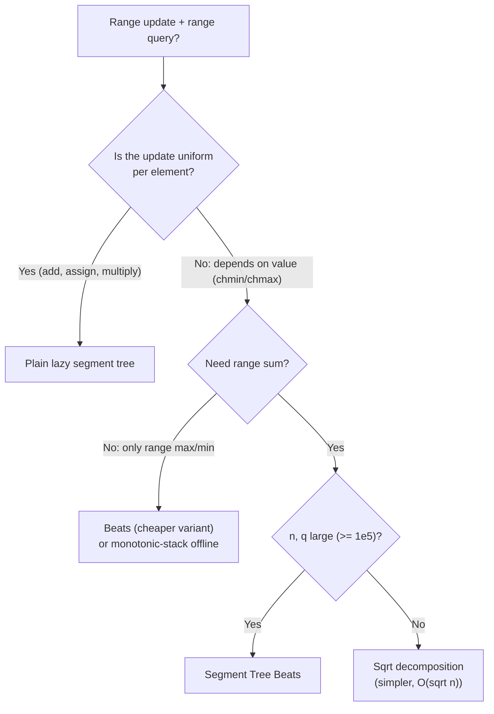
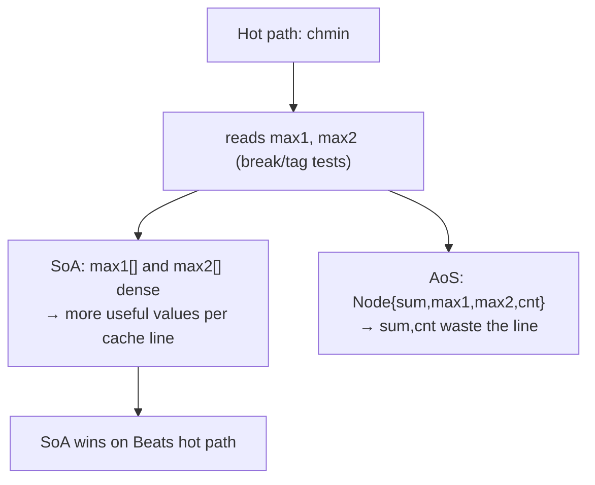

# Segment Tree Beats — Senior Level

> **Audience:** Engineers choosing whether Segment Tree Beats is the right tool for a competitive problem or a production analytics path, who need to reason about its real constant factors, its amortized-not-worst-case behavior, and the alternatives that sometimes win. Prerequisites: `junior.md`, `middle.md`.

This document is about **judgement**: where Beats genuinely earns its complexity in competitive programming and analytics engines, how it behaves on real hardware (cache, constants, the cost of the heavy node), why "amortized O(n log² n)" is both a blessing and a trap for latency-sensitive systems, and when a senior engineer should reach for something simpler or something different.

---

## Table of Contents

1. [When Segment Tree Beats Is the Right Call](#right-call)
2. [Competitive Programming — The Canonical Problems](#competitive)
3. [Analytics and Streaming Use Cases](#analytics)
4. [Constant Factors and Cache Behavior](#constants)
5. [The Amortized-Not-Worst-Case Trap](#amortized-trap)
6. [Comparison with Alternatives, In Practice](#comparison)
7. [Engineering the Implementation for Speed](#engineering)
8. [Concurrency and Persistence Considerations](#concurrency)
9. [Observability and Instrumentation](#observability)
10. [Capacity Planning](#capacity)
11. [A Production Decision Walk-Through](#decision)
12. [Worked Profiling Case Study](#profiling)
13. [Migration and Fallback Playbook](#playbook)
14. [Failure Modes](#failure-modes)
15. [Summary](#summary)

---

<a name="right-call"></a>
## 1. When Segment Tree Beats Is the Right Call

Segment Tree Beats exists to fill **one specific gap**: range operations whose effect on an element *depends on the element's current value* — `chmin`, `chmax`, and their relatives — combined with range aggregates like sum and max. The senior's first job is to recognize this signature and *not* over-apply the tool.

The decision tree a senior runs in their head:



The tells that you *need* Beats:

1. The problem statement literally has "**set each `a_i` to `min(a_i, x)`**" (or max) over a range.
2. You also need **range sum** (not just range max). If only range max is needed, cheaper offline or monotonic techniques may suffice.
3. `n` and `q` are large enough (`≥ 10⁵`) that `O(√n)` per op is too slow.

The tells that you should **not** reach for Beats:

1. All updates are add/assign/multiply — uniform. Use a normal lazy segment tree; Beats is pure overhead and pure bug surface.
2. The operations are **offline** and you can sort them cleverly — sometimes a sweep with a monotonic stack beats a Beats.
3. The per-operation latency must be **bounded** (a real-time system) — Beats is amortized, not worst-case.

A senior who applies Beats only when (1)–(3) of the "need" list hold, and avoids it otherwise, will rarely be wrong.

---

<a name="competitive"></a>
## 2. Competitive Programming — The Canonical Problems

Segment Tree Beats is, first and foremost, a competitive-programming data structure. The problems that define it:

### 2.1 HDU 5306 — Gorgeous Sequence (the canonical)

> Support `chmin(l, r, x)`, `query_max(l, r)`, `query_sum(l, r)` on `n ≤ 10⁶`, `q ≤ 10⁶`.

This is *the* problem that introduced Beats to the wider community. The straightforward `max1/max2/cnt` tree from `junior.md` solves it in amortized O((n + q) log n) — note: log, not log², because this variant (chmin + max + sum, no add) has the tighter bound.

### 2.2 BZOJ 4695 / "区间最值操作" — add + chmin + chmax + sum + max + min

> Support range-add, range-chmin, range-chmax, range-sum, range-max, range-min.

The full sextet tree (`middle.md §5–6`). Amortized O(n log² n). This is the stress test for getting all the tag interactions right.

### 2.3 Historic maximum problems (Ji's paper)

> Support range-add and chmin, query the **historic maximum** `H_i = max over time of a_i`.

Needs the historic-max augmentation (`professional.md`). The original motivation for the whole structure.

### 2.4 Codeforces problems

Several Div. 1 D/E problems hinge on recognizing a hidden chmin/chmax. Example shapes:
- "Apply a ceiling to a sliding range, then report sums" — direct Beats.
- "Simulate water poured into a histogram with caps" — a chmin in disguise.
- "Tropical / (min,+) matrix range updates" — sometimes reducible to chmin trees.

### 2.5 The recognition skill

The senior competitive skill is **spotting a chmin/chmax in disguise**. Phrasings that hide it:
- "clamp", "cap", "ceiling", "limit", "saturate", "the smaller of the two".
- "rooms cool to the thermostat", "salaries reduced to the cap", "water levels equalize down".
- A simulation where a value can only ever *decrease* toward a moving bound.

When you see a value being repeatedly pushed toward a moving min/max bound over ranges, think Beats.

### 2.6 A disguise gallery

| Problem statement smell | Underlying op | Notes |
|---|---|---|
| "Pour water until level reaches `x`, overflow lost" | chmin (cap at x) + sum | classic histogram/water variant |
| "All scores above the cutoff are set to the cutoff" | chmin + count/sum | leaderboard normalization |
| "Floor every value below `x` up to `x`" | chmax + sum | the mirror |
| "Saturating add: `a_i = min(a_i + v, C)`" | range-add then chmin at C | the add+chmin combination |
| "Report the highest level ever reached" | chmin/add + **historic max** | Ji's original target |
| "Each element decays toward a moving ceiling" | repeated chmin with changing x | amortization shines here |

The middle column is what you implement; the left column is what the problem actually says. Training this translation is most of the senior competitive value.

### 2.7 Why offline sometimes beats Beats here

For several of the above, if the operations are given offline, sorting them by the cap value and sweeping with a simpler segment tree (or a DSU/monotonic stack) can be both faster and simpler than Beats. The senior reflex on seeing a chmin-shaped problem is to ask *first* "is it offline?" before committing to the harder online structure.

---

<a name="analytics"></a>
## 3. Analytics and Streaming Use Cases

Outside contests, the chmin/chmax-with-sum pattern is rarer than range-add — but it does appear, and a senior should know where.

### 3.1 Signal clipping / saturation analytics

A DSP or telemetry pipeline applies a **saturation cap** to ranges of a time-series (e.g. "clamp all sensor readings in this window to the legal maximum") and then reports windowed sums/energy. The cap is a chmin; the energy is a sum. A Beats tree over the time axis answers "total post-clip energy in `[t1, t2]`" without re-scanning.

### 3.2 Financial risk caps

Position sizes or exposures are **capped** (regulatory or risk limits) across a book of instruments indexed by some key, then aggregate exposure is queried. "Cap every exposure in sector S at L, then report total book exposure" is chmin + sum.

### 3.3 Resource quota enforcement

A scheduler caps the CPU/memory grant of a range of tasks at a quota (chmin), then reports total granted resource (sum) to a billing or admission-control layer. Caps move as quotas are renegotiated.

### 3.4 Why it is rare in production

In practice, most production systems either (a) apply caps *eagerly* at write time (so a read-time range cap is unnecessary), or (b) tolerate `O(√n)` block decomposition because `n` is modest. Beats shines specifically when caps are applied *lazily over large ranges, repeatedly, with sum queries interleaved* — a pattern far more common in algorithmic contests than in CRUD services. A senior should be honest that **Beats is 95% a competitive tool**; recognizing the rare production fit is the 5% that distinguishes deep knowledge.

### 3.5 A note on databases

No mainstream database implements Beats. Range "clamp" updates in SQL (`UPDATE t SET v = LEAST(v, x) WHERE ...`) are executed row-by-row over an index scan — `O(k log n)` for `k` affected rows — because databases optimize for durability and concurrency, not for the amortized in-memory cleverness Beats provides. If someone proposes Beats inside a storage engine, the right questions are about persistence, MVCC, and worst-case latency — areas where Beats' amortized model is a poor fit.

---

<a name="constants"></a>
## 4. Constant Factors and Cache Behavior

Beats is asymptotically polylog but carries **heavy constants**. A senior plans capacity with these in mind.

### 4.1 The heavy node

| Variant | Fields per node | Bytes/node (int64) |
|---|---|---|
| Sum segment tree | `sum` | 8 |
| Lazy add tree | `sum`, `lazy` | 16 |
| Beats chmin+sum | `sum`, `max1`, `max2`, `cnt` | 32 |
| Beats add+chmin | + `addAll`, `addMax`, `sz` | 56 |
| Full sextet + historic | up to ~10 fields | ~80 |

The `4n` node count multiplies this: a chmin+sum tree on `n = 10⁶` is `4 × 10⁶ × 32 ≈ 128 MB`. The full sextet pushes toward 320 MB. This matters for memory-limited judges (256 MB) and for cache: a 56-byte node means **~1.1 nodes per 64-byte cache line**, so every node access is essentially a cache line — poor locality compared to a sum tree's 8 nodes per line.

### 4.2 Structure-of-arrays vs array-of-structs

Storing each field in its own parallel array (`max1[]`, `max2[]`, ...) — the SoA layout used in `middle.md`'s code — wins on the **hot path** because `chmin` reads `max1` and `max2` for many nodes; keeping those in dense arrays packs more useful values per cache line than an AoS `Node{}` that drags `sum` and `cnt` along uselessly. The trade-off is more index arithmetic. On modern CPUs SoA typically wins for Beats.

### 4.3 Push-down cost

Every recursion into children pays a push-down: for the add+chmin tree, that is two `applyTag` calls, each touching `sum/max1/max2` and a branch (`if max2 != NEG`). Branch misprediction on that conditional is a measurable cost. Some implementations avoid the conditional by ensuring the `NEG` sentinel arithmetic is harmless.

### 4.4 Recursion overhead

Like any recursive segment tree, frame setup costs ~30–80 ns/level depending on language. Beats is **inherently recursive** (the three-way test and push-down are awkward iteratively), so you pay this. For the largest constraints, hand-inlining the merge and avoiding closures (Go) or virtual dispatch (Java) matters.

### 4.5 Practical throughput

| Setting | Throughput |
|---|---|
| chmin+sum, `n=10⁶`, warm | ~5–15 M ops/s (Go/Java) |
| add+chmin sextet, `n=10⁶` | ~2–6 M ops/s |
| Python (CPython) | ~0.2–0.5 M ops/s — often too slow for `q=10⁶` |

The Python row is a senior warning: **CPython is frequently too slow for Beats at contest constraints** (`n, q = 10⁶`). Use PyPy, or rewrite the hot tree in C via `ctypes`, or pick a language change.

### 4.6 Indicative benchmark numbers

The following are *order-of-magnitude* figures for `chmin + sum` with mixed random ops on a modern x86 core (warm cache), useful for sanity-checking your own runs:

| n = q | Go | Java (warm JIT) | CPython | PyPy |
|---|---|---|---|---|
| 10⁴ | ~2 ms | ~3 ms | ~25 ms | ~6 ms |
| 10⁵ | ~25 ms | ~30 ms | ~350 ms | ~70 ms |
| 10⁶ | ~350 ms | ~450 ms | ~5 s (often TLE) | ~900 ms |

Two senior takeaways: (1) Go and Java are within ~1.3× of each other once the JIT warms; (2) the gap to CPython is ~15×, which is exactly why CPython misses the 1–2 s limits typical of `10⁶`-op problems. These numbers roughly double-plus when moving to the `add + chmin` sextet tree due to the heavier tags.

### 4.7 The `4n` vs `2·nextPow2(n)` choice

`4n` is the safe lazy allocation; `2·nextPow2(n)` is tighter (no wasted ragged level). For memory-limited judges with the heavy Beats node, switching to `2·nextPow2(n)` can shave ~30–50% of tree memory — sometimes the difference between passing and MLE at `n = 10⁶` with the full sextet.

---

<a name="amortized-trap"></a>
## 5. The Amortized-Not-Worst-Case Trap

This is the single most important senior insight about Beats.

The O(n log² n) figure is an **amortized** bound over a *sequence* of operations. A **single** chmin can recurse deep — in the worst case, touching Θ(n) nodes — because it might break the tag condition all the way down. The amortization works because such an expensive chmin **destroys potential** (collapses many distinct values into one), and potential can only be rebuilt slowly (each operation adds O(log n) potential). So the total is bounded, but **individual operations are not**.

### 5.1 Why this matters

- **Latency SLAs.** If you have a p99.9 latency budget per request and one request triggers a deep chmin, you can blow the budget even though the *average* is fine. Beats is unsuitable for hard real-time paths.
- **Adversarial inputs.** A constructed sequence can force the expensive operations to cluster, making a naive "this is usually fast" assumption dangerous in a security-sensitive context (algorithmic complexity attacks).
- **Interactive judges.** Some online judges interleave operations adaptively; the amortized bound still holds over the whole run, but you cannot assume any single response is fast.

### 5.2 What you *can* rely on

- **Total time** for `q` operations is O((n + q) log² n) (or log for the simplest variant). For a batch job, that is all that matters.
- **Throughput** averaged over the run is high.

### 5.3 Senior mitigation

If you need per-op bounds, **do not use Beats**. Alternatives:
- **Sqrt decomposition** gives a clean O(√n) *worst-case* per op — predictable, if slower on average.
- **Offline processing**: if all operations are known in advance, sort and sweep to avoid the online amortization entirely.

The senior framing: *Beats trades worst-case per-op predictability for excellent amortized total throughput.* Know which one your system needs.

---

<a name="comparison"></a>
## 6. Comparison with Alternatives, In Practice

| Aspect | Segment Tree Beats | Lazy Segment Tree | Sqrt Decomposition | Offline sweep + monotonic stack |
|---|---|---|---|---|
| Range chmin/chmax + sum | **yes** | no | yes (block tags) | sometimes |
| Per-op worst case | unbounded (amortized total bounded) | O(log n) | **O(√n)** | n/a (batch) |
| Amortized per op | O(log²n) | O(log n) | O(√n) | O(log n)/op equivalent |
| Online? | **yes** | yes | yes | **no** (needs all ops) |
| Memory/node | 32–80 B | 16 B | O(n)+blocks | O(n) |
| Implementation risk | **high** | medium | low | medium |
| Cache locality | poor (heavy nodes) | good | good (blocks) | good |
| Best when | large n,q, online chmin+sum | uniform updates | small n, simple, predictable latency | all ops known, can sort |

### 6.1 Beats vs sqrt decomposition

Sqrt decomposition handles chmin too: each block stores its `max1` and a "block cap" tag; a chmin re-buckets only the two boundary blocks and tags whole interior blocks. Per-op is `O(√n)` — *worse* asymptotically but **worst-case bounded** and far simpler to implement correctly. For `n ≤ ~5×10⁴` and modest `q`, sqrt decomposition is often the *better engineering choice*: less code, fewer bugs, predictable latency. Beats wins decisively as `n, q → 10⁶`.

### 6.2 Beats vs plain lazy

If the workload has **no** chmin/chmax, Beats is strictly worse than a lazy tree: heavier nodes, more bookkeeping, harder to get right, and the value-aware conditions never help. The senior reflex: confirm the value-dependent operation is actually present before paying for Beats.

### 6.3 Beats vs offline techniques

When operations are offline, a problem that *looks* like it needs Beats can sometimes be solved by sorting operations and sweeping with a monotonic stack or a simpler segment tree. This is often faster and simpler. The senior asks: *are the operations online, or can I see them all up front?* Online → Beats; offline → consider a sweep first.

### 6.4 Beats vs a "lazy with a function" segment tree

A natural question: can't we make a lazy segment tree where the tag is a *function* (e.g. "the function `t -> min(t, x)`") and compose functions on push-down? Functions of the form `t -> min(t + a, b)` (clamp-then-shift, the "affine-clamp" monoid) **do** compose and *can* be lazily propagated — this is the **"monotone clamp" or Kinetic/segment-tree-on-functions** technique. It supports range `chmin` + range-add + range-**assign** with `O(log n)` *worst-case* per op for the **max query** (no sum).

The catch: this function-composition tree answers **range max/min**, not **range sum** — because a clamp function applied to a *sum* is not the sum of clamped values. So:

| Need | Function-composition lazy tree | Segment Tree Beats |
|---|---|---|
| chmin/chmax/add + range **max** | **O(log n) worst-case** | O(log n) amortized |
| chmin/chmax/add + range **sum** | **cannot** (clamp ∘ sum ≠ sum ∘ clamp) | **O(log² n) amortized** |

This is a crucial senior distinction: **if you only need range max under chmin/chmax/add, prefer the function-composition tree** — it is `O(log n)` worst-case, not amortized, and simpler to reason about for latency. Beats earns its keep specifically when you also need **range sum**, which the function tree fundamentally cannot provide. Recognizing "max-only → function tree; sum → Beats" is a sharp, useful boundary.

---

<a name="engineering"></a>
## 7. Engineering the Implementation for Speed

When you have decided Beats is correct, a senior squeezes the constant. Beats' polylog asymptotics are only useful if the per-node work is lean.

### 7.1 Eliminate the `max2 != NEG` branch

The push-down/apply step often guards `if max2 != NEG: max2 += addAll`. That branch mispredicts when the data alternates between "all-equal" and "mixed" nodes. Two ways to remove it:

- **Saturating sentinel arithmetic.** Choose `NEG = -(1<<61)` so that `NEG + addAll` never overflows and stays "very negative"; then `max2 += addAll` is harmless even on all-equal nodes (the bogus `max2` is still `< max1`, so the tag condition `x > max2` behaves). Verify the bound: `|addAll|` summed over the tree depth must not push `NEG` past 0.
- **Branchless select.** Compute both candidates and `cmov`-style select; modern compilers do this if you write `max2 = (max2 == NEG) ? NEG : max2 + addAll` as arithmetic.

### 7.2 Avoid recomputing segment size

Passing `lo, hi` down every call and computing `hi - lo + 1` in `applyTag` is fine, but caching `sz[v]` once at build time removes an add/sub from the hot path. For a sum tree under range-add, `sz` is read on every tag — worth caching.

### 7.3 Inline the merge

In Go, a `merge` method call has function-call overhead and bounds-checking on the slice accesses. Inlining the three merge cases directly into `chmin`/`add` and hoisting the `2*v`, `2*v+1` indices into locals measurably helps. In Java, ensure the method is small enough for the JIT to inline (under ~35 bytecodes); split if needed. In C/C++ contest code, `__attribute__((always_inline))` or a macro.

### 7.4 Iterative leaf-path push-down (advanced)

Beats is inherently recursive, but the *push-down along the two boundary paths* of a range can be hoisted: before the range recursion, push down from the root to both endpoints iteratively, then run the core recursion. This is the same trick used to make lazy segment trees partly iterative. It is fiddly and rarely worth it unless profiling points here.

### 7.5 Memory layout

Use **structure-of-arrays** (`max1[]`, `max2[]`, `cnt[]`, `sum[]` as separate arrays) so the hot `chmin` reads of `max1`/`max2` pack densely. The alternative array-of-structs drags `sum` and `cnt` into the cache line even when only `max1`/`max2` are needed for the break/tag tests.



---

<a name="concurrency"></a>
## 8. Concurrency and Persistence Considerations

### 8.1 Concurrency

A naive read-write lock around the whole tree serializes everything; for a 10 M-QPS analytics path that is a bottleneck. But Beats does **not** parallelize as gracefully as a plain segment tree:

- **Reads (sum/max queries) push down lazy tags**, which *mutate* the tree. So even "read-only" queries take a write lock unless you separate the lazy state. This is a real gotcha: in Beats, a query is not pure.
- **Lock-free Beats is essentially unexplored** — the amortized analysis assumes a single linear sequence of operations; concurrent interleaving breaks the potential argument's accounting.

Practical patterns:
- **Single-writer, batched.** Funnel all operations through one thread; batch and apply. Most analytics ingest paths can tolerate this.
- **Shard by index range** *only if* every operation is contained within a shard (no cross-shard chmin). Then each shard is an independent single-thread Beats.
- **Snapshot-for-reads.** Periodically freeze a fully-pushed-down copy (no pending tags) for lock-free reads; apply writes to the live tree.

### 8.2 Persistence

Persistent (versioned) Beats is awkward. Path-copying persistence works for plain segment trees because each update touches an O(log n) path. But a Beats chmin can recurse deep (Θ(n) in the worst case), so a persistent version could copy Θ(n) nodes for one operation — destroying the space efficiency that makes persistence attractive. The amortized argument does not transfer to "number of copied nodes" cleanly. In short: **if you need persistence, Beats is the wrong tool**; consider an offline reformulation or a different structure.

---

<a name="observability"></a>
## 9. Observability and Instrumentation

Because Beats' cost is amortized and a single op can spike, a production deployment (or a contest debugging session) benefits from instrumentation:

| Metric | Why it matters | Alert / watch |
|---|---|---|
| `nodes_visited_per_op` (p50, p99, max) | Detects deep-recursion spikes the amortized average hides | p99 ≫ p50 → adversarial pattern |
| `tag_applies / recursions` ratio | High ratio = healthy (cheap ops); low = lots of deep descent | falling ratio over time |
| `potential_Φ` (distinct values, sampled) | Confirms the amortized model; drops correlate with expensive ops | sustained high Φ |
| `tree_memory_bytes` | Heavy nodes × 4n can exceed budget | > 80% of limit |
| `op_latency` (per op) | The amortized trap surfaces here | p99.9 breaches SLA |

A simple in-code counter of nodes visited per chmin, logged when it exceeds, say, `8·log₂ n`, is the single most useful diagnostic — it catches both the "missing break condition" bug and genuine adversarial inputs.

---

<a name="capacity"></a>
## 10. Capacity Planning

Numbers a senior should carry:

| Aspect | Value | Note |
|---|---|---|
| Node size (chmin+sum) | 32 bytes | `sum,max1,max2,cnt` |
| Node size (full sextet) | ~80 bytes | +min trio, +add tags, +historic |
| Tree memory | `4n × node` | 10⁶ chmin+sum → ~128 MB |
| Build throughput | ~10 ns/element | 10⁶ build ≈ 10 ms |
| chmin+sum throughput | 5–15 M ops/s | Go/Java, warm cache |
| add+chmin throughput | 2–6 M ops/s | heavier tags |
| CPython throughput | 0.2–0.5 M ops/s | usually too slow at 10⁶ |
| Amortized total | O((n+q) log² n) | per-op unbounded |
| Memory-limit risk | high at n=10⁶ sextet | ~320 MB may exceed 256 MB judge |

### 7.0 Estimating cost before you implement

Before writing a line, a senior back-of-envelopes whether Beats will fit the budget:

```text
work ≈ (n + q) · (log n)^k · C
  where k = 1 for chmin+max, 2 for chmin+sum (or add+chmin),
        C ≈ 5–20 ns/node-visit depending on language and node weight.

Example: n = q = 10^6, chmin+sum (k=2), log n ≈ 20, C ≈ 8 ns
  work ≈ 2·10^6 · 400 · 8 ns ≈ 6.4 s  (loose upper bound)
  realistic (tags dominate, not full log²): ~0.4 s
```

The gap between the `log²` upper bound and realistic runtime is large because **most chmins hit the tag case** (O(1)), not the full `log²` recursion. The senior uses the upper bound to reject obviously-infeasible plans and the realistic figure to budget the feasible ones.

### 7.1 Memory-limit triage

At `n = 10⁶` with the full sextet on a 256 MB judge, you may exceed the limit. Mitigations:
- Drop unused fields (if only chmin is needed, skip the min trio).
- Use `int` instead of `long` where ranges permit (risky — verify the `(max1-x)*cnt` product fits).
- Reduce to `2 × nextPow2(n)` slots instead of `4n`.

### 7.2 Sharding (rare)

Unlike a plain segment tree, Beats does **not** shard cleanly: chmin's amortized analysis is per-tree, and a chmin spanning shard boundaries breaks the per-shard potential argument. In the rare production case, shard by index range only if every operation stays within a shard.

### 7.3 The "is this even Beats-shaped?" pre-flight

Before any capacity math, a senior runs a 30-second checklist to avoid building the wrong thing:

1. **Value-dependent update present?** (chmin/chmax) — if not, stop; use a lazy tree.
2. **Range sum needed?** — if only max, consider the function-composition tree (§6.4) for worst-case bounds.
3. **Online?** — if offline, consider a sweep first.
4. **Per-op latency SLA?** — if hard, Beats is disqualified (amortized).
5. **Scale ≥ 10⁵?** — if not, sqrt decomposition is simpler and adequate.

Only if (1) yes, (2) sum-needed, (3) online, (4) no hard SLA, (5) large — does Beats clearly win. This checklist is the distilled senior judgement of this entire document; everything else is how to execute well once the checklist says "yes."

---

<a name="decision"></a>
## 11. A Production Decision Walk-Through

To make the judgement concrete, here is the reasoning for a realistic scenario.

> **Scenario.** A telemetry service ingests per-device gauge readings indexed by device-id (0..N). Operators issue "cap all devices in cluster `[l, r]` at `x`" (a regulatory/safety clamp) and dashboards ask "total reading over cluster `[l, r]`". `N ≈ 2×10⁵` devices; ~50 caps/sec and ~500 sum queries/sec; reads must be < 50 ms p99.

Step-by-step:

1. **Is the update value-dependent?** Yes — "cap at x" is `chmin`. A plain lazy tree cannot do it. ✓ Beats is a candidate.
2. **Is range sum needed?** Yes. So we are in the `chmin + sum` (log²) regime.
3. **How large is `N` and the op rate?** `N = 2×10⁵`, ~550 ops/sec total. This is **tiny** by Beats standards (Beats is built for `10⁶` ops). At 550 ops/sec, even an `O(√N) ≈ 450`-per-op sqrt decomposition is `~2.5×10⁵` work/sec — trivial.
4. **Latency SLA?** 50 ms p99 reads. Beats reads push down lazy tags (mutating) and a single cap could spike. Sqrt decomposition gives a clean `O(√N)` worst case.
5. **Concurrency?** Dashboards read concurrently; Beats reads mutate (push-down), forcing write locks. Sqrt decomposition can be made read-mostly more easily.

**Decision:** *Do not use Beats here.* Sqrt decomposition (or even an eager apply at write time, given the low op rate) is simpler, has predictable worst-case latency, and concurrency-friendlier. Beats' amortized brilliance is wasted at this scale and its read-mutation and latency-spike properties actively hurt.

**When the decision flips:** raise the op rate to `10⁵`–`10⁶` chmin+sum operations per second on `N = 10⁶`, in a single-threaded batch pipeline, and Beats becomes the right call — sqrt's `O(√N) ≈ 1000`/op now dominates, and the batch model tolerates amortized cost.

This is the senior skill in miniature: the data structure is a means, and the scale + latency + concurrency profile decides whether its specific trade-offs (amortized, heavy, read-mutating, recursion-deep) are acceptable.

---

<a name="profiling"></a>
## 12. Worked Profiling Case Study

Suppose your chmin+sum Beats is "correct but too slow" on a `n = q = 10⁶` batch. Here is the senior debugging sequence.

### 12.1 Establish a baseline

Run a plain lazy add+sum segment tree on the same shape (substituting add for chmin) to get a floor. If that floor is, say, 400 ms, your Beats should land within ~1.5–3× of it on random data. If Beats is 50×, you have a structural bug, not a constant-factor issue.

### 12.2 Instrument nodes-visited

Add a counter incremented on every `chmin` entry. Compute `visits / q`. Healthy: `~ a few × log n` (≈ 40–80 for `n = 10⁶`). If you see `~ n`, the **break condition is missing or wrong** — the single most common cause. The fix is one line: ensure `x >= max1[v]` is in the first `if`.

```text
Symptom table:
  visits/op ≈ n          → missing break condition (x >= max1)
  visits/op ≈ log n but TLE → constant factor: inline merge, SoA, 64-bit
  visits/op spikes on some ops → adversarial input; expected (amortized)
  wrong answers, not slow → strict-max2 merge bug or missing query push-down
```

### 12.3 Check the tag/recurse ratio

Log `tag_applies` vs `recursions`. On random data the ratio should favor tags heavily. A near-zero tag ratio means almost every chmin recurses — usually because the input is a decreasing staircase (the adversarial case, §`professional.md §12.1`) or because `max2` is mis-merged (reported too large, defeating the tag).

### 12.4 Profile the hot function

A flame graph will show `chmin`, `merge`, and `applyTag` dominating. Common wins:
- `merge` is hot → inline it, hoist `2*v`/`2*v+1` into locals.
- `applyTag` is hot → cache `sz[v]`, remove the `max2 != NEG` branch (§7.1).
- GC pressure (Java) or interface dispatch (Go) → use primitive parallel arrays, avoid closures.

### 12.5 Language escape hatch

If after inlining and SoA the Python version still misses the limit (common at `q = 10⁶`), the senior call is to stop micro-optimizing CPython and switch runtime (PyPy) or language. Beats is one of the data structures where CPython simply cannot hit contest constraints; recognizing this early saves hours.

---

<a name="playbook"></a>
## 13. Migration and Fallback Playbook

When Beats turns out to be the wrong fit (latency spikes, persistence needs, concurrency), here is how to migrate.

### 13.1 To sqrt decomposition

Each block of size `√n` stores `block_max` and a `block_cap` lazy. A `chmin(l, r, x)`:
- For fully-covered blocks: if `x < block_max`, rebuild the block applying the cap element-wise (or tag and defer). `O(√n)` blocks × `O(1)`.
- For partial boundary blocks: apply the cap element-wise to the affected slice, then recompute the block aggregate. `O(√n)`.

This is `O(√n)` worst-case per op — predictable, simpler, concurrency-friendlier (blocks lock independently). Migrate here when you need bounded per-op latency.

### 13.2 To eager application

If the op rate is low and reads dominate, just apply each chmin eagerly to the affected slice (`O(k)` for `k` affected elements) over an indexed array or a Fenwick tree for sums. No Beats machinery. Migrate here when `k` (affected elements per op) is small and predictable.

### 13.3 To an offline sweep

If all operations are known up front, sort them and process with a simpler structure or a monotonic stack, sidestepping the online amortization entirely. Migrate here when the workload is batch and you can see every operation before answering any query.

### 13.4 Migration checklist

| Trigger | Migrate to |
|---|---|
| Per-op latency SLA breached | Sqrt decomposition |
| Need persistence/versioning | Offline reformulation (Beats persists poorly) |
| Heavy concurrent reads | Sqrt decomposition or snapshot-for-reads |
| Low op rate, small affected sets | Eager apply + Fenwick |
| All ops known in advance | Offline sweep |
| Memory limit exceeded | Trim node fields; `2·nextPow2(n)` slots |

The senior keeps these in their pocket so that "Beats is the answer" is a *revisitable* decision, not a one-way door.

---

<a name="failure-modes"></a>
## 14. Failure Modes

- **TLE from a missing break condition.** Forgetting `x >= max1` turns every chmin into a full descent → O(nq). The most common reason a "correct" Beats times out.
- **Wrong answer from non-strict `max2`.** The subtle merge bug from `middle.md §3`. Always brute-force test.
- **Memory limit exceeded.** Heavy nodes × `4n`. Trim fields; reduce slots.
- **Overflow.** `addAll * sz + addMax * cnt` overflows 32-bit and even risks 64-bit with extreme inputs; bound the value range.
- **Latency spike.** A single deep chmin on a latency-sensitive path. By design; do not use Beats there.
- **Python too slow.** CPython recursion + heavy nodes at `q = 10⁶`. Switch language/runtime.
- **Push-down skipped in queries.** Combined tags make stale children give wrong sums. Push down everywhere you descend.

---

<a name="summary"></a>
## 15. Summary

- Segment Tree Beats is the right call **only** when range chmin/chmax (value-dependent updates) meet range sum/max at large `n, q` and online. Otherwise prefer a plain lazy tree (uniform updates) or sqrt decomposition (small/predictable).
- It is **95% a competitive-programming tool**; the rare production fits are clipping/cap-then-sum analytics, and even there `O(√n)` decomposition often suffices.
- Constants are **heavy**: 32–80 bytes/node, poor cache locality, inherently recursive. CPython is frequently too slow at `10⁶` operations.
- The O(n log² n) bound is **amortized total**, not per-op. A single chmin can be Θ(n). Unusable for hard latency SLAs; great for batch throughput.
- It does **not** shard cleanly, and no mainstream database implements it.

The senior contribution is **picking it correctly** — recognizing the disguised chmin/chmax, confirming the workload is large/online, and rejecting it when a simpler structure or an offline sweep would do.

**Next step:** [professional.md](./professional.md) — Ji's potential-function proof of the amortized O(n log² n) bound and the correctness of the break/tag conditions.
