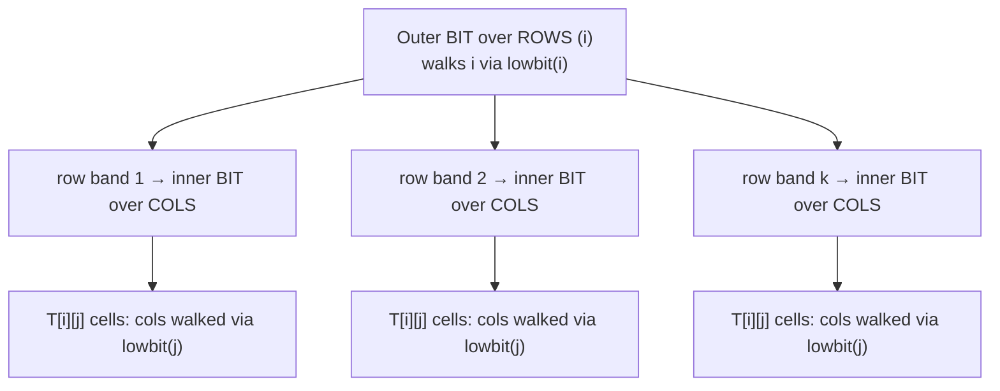

# 2D Range Queries — 2D Fenwick (BIT) and 2D Segment Tree — Junior Level

> **Read time: ~35 minutes** · **Audience:** Engineers who already know the 1D Fenwick tree (point update + prefix sum in O(log n)) and now want to maintain sums over a **grid** under updates. Prerequisite: `09-fenwick-tree/junior.md`.

A **2D Fenwick tree** (2D binary indexed tree, 2D BIT) maintains a matrix `A[1..n][1..m]` under two operations: **point update** (add a delta to a single cell `A[r][c]`) and **rectangle-sum query** (the sum of every cell inside an axis-aligned rectangle), both in **O(log n · log m)** time. It is the direct, almost mechanical extension of the 1D BIT you already know: instead of one `i & -i` loop, you nest a second `j & -j` loop inside it. Everything that made the 1D BIT elegant — the `lowbit` trick, the responsibility ranges, the prefix-minus-prefix range query — carries over, one dimension at a time.

This document teaches the 2D BIT **so thoroughly** that you understand *why* an update touches `O(log n · log m)` cells, *why* a rectangle sum is computed by inclusion-exclusion of four prefix rectangles, and *why* the whole thing fits in `O(n · m)` memory — the same size as the matrix itself. We build directly on the 1D BIT; if any of the 1D mechanics feel shaky, re-read `09-fenwick-tree/junior.md` first, because the 2D version is *literally* the 1D version applied twice.

The motivating problem is everywhere. A **2D prefix sum** (summed-area table / integral image) answers "sum of this rectangle" in O(1) — but only if the grid never changes. The moment a single cell is updated, a static integral image must be rebuilt in O(n·m). When updates and queries are interleaved — analytics heatmaps, computational-geometry point counting, image patches that change frame to frame — you need a structure that updates *and* queries in logarithmic time. The 2D BIT is that structure, and it is the LeetCode 308 ("Range Sum Query 2D — Mutable") canonical answer.

---

## Table of Contents

1. [Introduction — From a Line to a Grid](#introduction)
2. [Prerequisites — The 1D BIT and Inclusion-Exclusion](#prerequisites)
3. [Glossary](#glossary)
4. [Core Concepts — Nesting Two `lowbit` Loops](#core-concepts)
5. [Big-O Summary](#big-o-summary)
6. [Real-World Analogies](#analogies)
7. [Pros and Cons vs 2D Segment Tree and Static Integral Image](#pros-and-cons)
8. [Step-by-Step Walkthrough on a 4×4 Grid](#walkthrough)
9. [Code Examples — Go, Java, Python](#code-examples)
10. [Coding Patterns — 1-Indexed in Both Dimensions](#patterns)
11. [Error Handling — Off-by-One in Two Dimensions](#errors)
12. [Performance Tips](#performance-tips)
13. [Best Practices](#best-practices)
14. [Edge Cases](#edge-cases)
15. [Common Mistakes](#common-mistakes)
16. [Cheat Sheet](#cheat-sheet)
17. [Visual Animation Reference](#animation)
18. [Summary](#summary)
19. [Further Reading](#further-reading)

---

<a name="introduction"></a>
## 1. Introduction — From a Line to a Grid

In 1D you had an array `A[1..n]` and wanted `update(i, delta)` plus `prefix(i) = A[1] + ... + A[i]`. The Fenwick tree gave you both in O(log n).

In 2D you have a matrix `A[1..n][1..m]` and you want:

- `update(r, c, delta)`: add `delta` to `A[r][c]`.
- `prefix(r, c)`: the sum of the **top-left submatrix** `A[1..r][1..c]` — every cell with row ≤ r and column ≤ c.

From `prefix` you reconstruct the sum of **any** rectangle by inclusion-exclusion, exactly like 1D range sum was `prefix(r) - prefix(l-1)`. In 2D you subtract two slabs and add back the doubly-subtracted corner:

```
rectSum(r1, c1, r2, c2) =   prefix(r2, c2)
                          − prefix(r1-1, c2)
                          − prefix(r2, c1-1)
                          + prefix(r1-1, c1-1)
```

Let's make the static case concrete first, because it builds the intuition. If the grid never changes, you precompute a **2D prefix-sum table** `P[r][c] = sum of A[1..r][1..c]` once in O(n·m), and every rectangle query is the O(1) four-term formula above. This is the classic *integral image* of computer vision (Viola–Jones face detection, 2001). The catch is the same as in 1D: **a single update to `A[r][c]` invalidates every `P[r'][c']` with `r' ≥ r` and `c' ≥ c`** — potentially O(n·m) entries. So the static table collapses under updates.

The 2D BIT fixes this. It stores partial sums in a clever grid of "responsibility rectangles" so that one update touches only `O(log n · log m)` of them, and one prefix query reads only `O(log n · log m)` of them. For a 1024×1024 grid that is about `10 × 10 = 100` cells per operation instead of a million. For LeetCode 308 with frequent interleaved updates and queries, this is the difference between accepted and time-limit-exceeded.

The key mental model: **a 2D BIT is a BIT of BITs.** The outer index `r` walks the `lowbit` ladder over rows; at each row the outer loop lands on, the inner index `c` walks the `lowbit` ladder over columns. Two nested copies of the loop you already wrote in 1D.

---

<a name="prerequisites"></a>
## 2. Prerequisites — The 1D BIT and Inclusion-Exclusion

You need two things firmly in hand.

### 2.1 The 1D BIT mechanics (`i & -i`)

Recall from `09-fenwick-tree`:

```
lowbit(i) = i & -i          # isolates the lowest set bit
update(i, d): while i <= n:  tree[i] += d;  i += lowbit(i)   # walk UP
prefix(i):    while i >  0:   s += tree[i];  i -= lowbit(i)   # walk DOWN
```

Update walks **up** (`i += lowbit(i)`), accumulating into every cell whose responsibility range covers `i`. Prefix walks **down** (`i -= lowbit(i)`), accumulating disjoint responsibility ranges that tile `[1..i]`. Both loops run in O(log n) steps because each step changes one bit of `i`. If this is not automatic for you, stop and re-read the 1D junior file — the 2D version reuses these exact two loops verbatim.

### 2.2 Inclusion-exclusion for rectangles

The sum of cells inside rectangle `[r1..r2] × [c1..c2]` is reconstructed from four top-left prefix sums. Picture four overlapping top-left slabs:

```
   +-----------------------+
   |        P(r1-1, c1-1)   |  ← the small corner we subtracted twice
   |   +-------------------+|
   |   |   P(r1-1, c2)     ||  ← top slab to subtract
   +---+------+------------+|
   |   |      | the target ||
   |   |      | rectangle  ||
   +---+------+------------+|
   | P(r2, c1-1)           |  ← left slab to subtract
   +-----------------------+
        P(r2, c2)             ← big slab containing everything
```

Subtracting the top slab and the left slab removes the target rectangle's left and top neighbors, but the overlapping corner `P(r1-1, c1-1)` got subtracted **twice**, so we add it back once. This +/−/−/+ pattern is the 2D analogue of the 1D `prefix(r) − prefix(l−1)`, and you will use it constantly. Practice it on paper until it is automatic.

---

<a name="glossary"></a>
## 3. Glossary

| Term | Definition |
|---|---|
| **2D Fenwick tree / 2D BIT** | A 1-indexed 2D array `T[1..n][1..m]` supporting point update + top-left-prefix sum in O(log n · log m). A "BIT of BITs". |
| **Point update** | Add a delta to a single matrix cell `A[r][c]`. |
| **Prefix / top-left prefix** | `prefix(r, c)` = sum of all `A[r'][c']` with `r' ≤ r` and `c' ≤ c`. |
| **Rectangle sum** | Sum of cells inside `[r1..r2] × [c1..c2]`, computed by inclusion-exclusion of four prefixes. |
| **Inclusion-exclusion** | The +/−/−/+ four-term formula reconstructing a rectangle from four top-left prefixes. |
| **`lowbit(i)`** | `i & -i`. The lowest set bit of `i`. Same operator used independently on the row index and the column index. |
| **Responsibility rectangle of `(i, j)`** | The block of original cells whose sum is stored in `T[i][j]`: rows `[i − lowbit(i) + 1, i]` × columns `[j − lowbit(j) + 1, j]`. |
| **Integral image / summed-area table** | A precomputed static 2D prefix-sum table. O(1) rectangle query, but O(n·m) to rebuild on any update. The non-dynamic alternative to a 2D BIT. |
| **2D segment tree** | A segment tree whose every node holds an inner segment tree over the other dimension. Supports rectangle max/min/assoc (non-invertible) queries; more memory and code than a 2D BIT. |
| **Coordinate compression** | Remapping sparse/large coordinates to a dense `1..k` range so the grid dimensions stay small. Essential when points are scattered over a huge coordinate space. |
| **Invertible aggregate** | An operation with an inverse (sum, XOR, count) so that rectangle query reduces to prefix arithmetic. Min/max are **not** invertible — they need a 2D segment tree, not a BIT. |

---

<a name="core-concepts"></a>
## 4. Core Concepts — Nesting Two `lowbit` Loops

### 4.1 The 2D BIT is a BIT of BITs

In 1D, `tree[i]` stored the sum of a contiguous range of length `lowbit(i)` ending at `i`. In 2D, `T[i][j]` stores the sum of a contiguous **rectangle**: rows `[i − lowbit(i) + 1, i]` by columns `[j − lowbit(j) + 1, j]`. The row index obeys 1D BIT structure, and independently the column index obeys 1D BIT structure.

So the "responsibility rectangle" of cell `T[i][j]` has height `lowbit(i)` and width `lowbit(j)`. For example, on a grid where `i = 6` (binary `110`, lowbit 2) and `j = 4` (binary `100`, lowbit 4), `T[6][4]` stores the sum of rows `5..6` × columns `1..4` — a 2×4 block.

The two-layer structure — a BIT over rows, where each entry is itself a BIT over columns — is exactly:



Read it as: the outer (row) index does ordinary 1D BIT walking, and at every outer position the inner (column) index does its own independent 1D BIT walking. An update visits the *product* of the two ladders; a prefix reads the *product* of the two descending ladders.

### 4.2 Update: walk up in both dimensions (nested)

To do `A[r][c] += delta`, you must add `delta` to every `T[i][j]` whose responsibility rectangle covers `(r, c)`. Those are exactly the cells reached by walking `i` up the row ladder, and for *each* such `i`, walking `j` up the column ladder:

```
update(r, c, delta):
    i = r
    while i <= n:
        j = c
        while j <= m:
            T[i][j] += delta
            j += lowbit(j)        # inner: walk up columns
        i += lowbit(i)            # outer: walk up rows
```

The outer loop runs O(log n) times; for each, the inner loop runs O(log m) times. Total touched cells: **O(log n · log m)**. On a 4×4 grid, updating `(3, 2)` touches at most ~4 cells.

### 4.3 Prefix: walk down in both dimensions (nested)

To compute `prefix(r, c)` — the sum of the top-left submatrix `A[1..r][1..c]` — decompose it into disjoint responsibility rectangles and add them, walking `i` down the row ladder and `j` down the column ladder:

```
prefix(r, c):
    s = 0
    i = r
    while i > 0:
        j = c
        while j > 0:
            s += T[i][j]
            j -= lowbit(j)        # inner: walk down columns
        i -= lowbit(i)            # outer: walk down rows
    return s
```

Again O(log n · log m) cells read. The disjoint responsibility rectangles exactly tile the top-left submatrix `[1..r] × [1..c]`, so their sum is the correct prefix.

### 4.4 Rectangle sum: inclusion-exclusion of four prefixes

```
rectSum(r1, c1, r2, c2) =   prefix(r2, c2)
                          − prefix(r1-1, c2)
                          − prefix(r2, c1-1)
                          + prefix(r1-1, c1-1)
```

Four prefix calls, each O(log n · log m), so the whole rectangle sum is O(log n · log m). This is why the BIT only supports **invertible** aggregates: the formula relies on subtraction. For rectangle min/max — where you cannot subtract — you need a 2D segment tree (covered in `middle.md`).

### 4.5 Why the responsibility rectangles tile correctly

The 1D guarantee was: the responsibility ranges visited by the prefix walk are disjoint and union to `[1..i]`. In 2D, the *row* walk produces disjoint row-bands that union to `[1..r]`, and independently the *column* walk produces disjoint column-bands that union to `[1..c]`. The Cartesian product of disjoint, exhaustive row-bands and column-bands is a disjoint, exhaustive tiling of the rectangle `[1..r] × [1..c]`. That product is precisely the set of responsibility rectangles the nested loop reads. Correctness in 2D is just correctness in 1D, applied to each axis.

---

<a name="big-o-summary"></a>
## 5. Big-O Summary

| Operation | Time | Space |
|---|---|---|
| Build (naive, n·m updates) | O(n · m · log n · log m) | O(n · m) |
| Build (per-cell, then 1D absorb per row — optional) | O(n · m) | O(n · m) |
| `update(r, c, delta)` | O(log n · log m) | O(1) |
| `prefix(r, c)` | O(log n · log m) | O(1) |
| `rectSum(r1, c1, r2, c2)` | O(log n · log m) | O(1) |
| Memory total | (n+1)·(m+1) cells | |

For a 1000×1000 grid (`n = m = 1000`, `log ≈ 10`): each operation touches ~100 cells, and the structure occupies ~8 MB of `int64`. A static integral image of the same grid is also ~8 MB but answers queries in O(1) — at the cost of O(n·m) per update, which is why you only use it when there are no updates.

---

<a name="analogies"></a>
## 6. Real-World Analogies

### 6.1 City map of cumulative population

Imagine a city laid out on a grid of blocks. `A[r][c]` is the population of block `(r, c)`. A `prefix(r, c)` query answers "how many people live in the south-west region bounded by row `r` and column `c`?" A `rectSum` answers "how many people live in this neighborhood rectangle?" When a family moves in (point update), you don't recount the whole city — you update a logarithmic number of nested partial-sum tiles. The 2D BIT is the bookkeeping that makes a single move-in cheap while keeping every regional total instantly answerable.

### 6.2 Two filing cabinets, one inside the other

The 1D BIT was a single filing cabinet where each drawer summarizes a power-of-two range of folders. A 2D BIT is a row of such cabinets (one per row-band), and the *row* of cabinets is itself organized as a BIT. To file one document you open one drawer in `log m` cabinets — and you only visit `log n` cabinets. Two layers of the same trick.

### 6.3 Spreadsheet with subtotal rows *and* subtotal columns

In a spreadsheet you might keep subtotal rows (sum of groups of rows) and subtotal columns (sum of groups of columns). Updating one cell ripples into the subtotal rows above it and the subtotal columns to its right — a logarithmic number of each. A 2D BIT is this two-axis subtotal scheme stored compactly, with the power-of-two grouping that makes both the update and the query logarithmic.

### 6.4 Integral image of a changing photo (the original CV use case)

A summed-area table answers "average brightness of this rectangle" in O(1) and powers classic face detection. But that assumes the photo is fixed. If you are processing a live feed where a few pixels change per frame (screen recording, where most of the screen is static), recomputing the whole integral image per frame is wasteful. A 2D BIT lets you patch just the changed pixels in O(log W · log H) each and still answer rectangle queries logarithmically. The BIT shines exactly when updates are **sparse**.

---

<a name="pros-and-cons"></a>
## 7. Pros and Cons vs 2D Segment Tree and Static Integral Image

### Pros of the 2D BIT

- **Tiny code.** Update and prefix are each two nested copies of the 1D loop — about 8 lines total. A 2D segment tree is 80–150 lines.
- **Same memory as the matrix.** `(n+1)·(m+1)` cells, no `4n` blow-up per dimension.
- **Cache-friendly.** Row-major contiguous storage; the inner column walk strides through one row.
- **Mechanical to derive from 1D.** If you know the 1D BIT, you know the 2D BIT.
- **Fast constant factor.** Nested arithmetic loops with predictable branches.

### Cons of the 2D BIT

- **Only invertible aggregates.** Sum, XOR, count — yes. Rectangle **min/max/gcd** — no, because the inclusion-exclusion subtraction is invalid. Use a 2D segment tree for those.
- **Memory is O(n·m) even when data is sparse.** A grid that is mostly empty still allocates the full matrix. The fix is **coordinate compression** or an offline sweep (covered in `middle.md`/`senior.md`).
- **Rectangle range-update + range-query needs four 2D BITs** (the 4-BIT trick — `middle.md`). The classic single 2D BIT only does point-update + rectangle-query directly.
- **No O(1) query.** A static integral image beats it (O(1)) when there are zero updates.

### When to use which

| Need | Use |
|---|---|
| Static grid, rectangle sum, no updates | Integral image (summed-area table), O(1) query |
| Point update + rectangle **sum** (frequent updates) | 2D BIT |
| Point update + rectangle **min/max** | 2D segment tree (segment tree of segment trees) |
| Rectangle update + rectangle sum | 4-BIT trick (2D version of two-BIT range trick) |
| Sparse points over a huge coordinate space, offline | BIT + coordinate compression / sweep line |
| Dynamic 2D dominance counting (offline) | merge-sort tree / BIT of sorted lists |

---

<a name="walkthrough"></a>
## 8. Step-by-Step Walkthrough on a 4×4 Grid

We use a 4×4 grid (`n = m = 4`), all zeros initially. We will: update `(2, 3) += 5`, update `(4, 4) += 2`, then query `prefix(3, 3)` and `rectSum(2, 2, 4, 4)`.

### 8.1 Update `(2, 3) += 5`

`r = 2` (binary `10`, lowbit 2), `c = 3` (binary `11`, lowbit 1). The outer row walk: `2 → 4 → stop` (since `4 + lowbit(4)=8 > 4`). The inner column walk from `c = 3`: `3 → 4 → stop`.

```
i=2:
   j=3: T[2][3] += 5
   j=4: T[2][4] += 5      (3 + lowbit(3)=1 → 4)
i=4:
   j=3: T[4][3] += 5
   j=4: T[4][4] += 5
```

Four cells touched: `T[2][3], T[2][4], T[4][3], T[4][4]`. That is `log₂4 · log₂4 = 2 · 2 = 4`, matching the bound.

### 8.2 Update `(4, 4) += 2`

`r = 4` (lowbit 4), `c = 4` (lowbit 4). Row walk: `4 → stop`. Column walk: `4 → stop`.

```
i=4:
   j=4: T[4][4] += 2   → T[4][4] = 5 + 2 = 7
```

One cell touched (both indices are powers of two equal to n, so each ladder is a single step).

### 8.3 Query `prefix(3, 3)` — sum of `A[1..3][1..3]`

`r = 3` (binary `11`), `c = 3` (binary `11`). Row walk down: `3 → 2 → stop`. Column walk down from `c = 3`: `3 → 2 → stop`.

```
i=3:
   j=3: s += T[3][3]   (= 0)
   j=2: s += T[3][2]   (= 0)
i=2:
   j=3: s += T[2][3]   (= 5)
   j=2: s += T[2][2]   (= 0)
total s = 5
```

Expected: only `A[2][3] = 5` lies inside `[1..3] × [1..3]`. ✓ (The `A[4][4]=2` update is outside this top-left submatrix, so it does not appear.)

### 8.4 Query `rectSum(2, 2, 4, 4)`

```
rectSum = prefix(4,4) − prefix(1,4) − prefix(4,1) + prefix(1,1)
```

- `prefix(4,4)` = everything = `5 + 2 = 7`.
- `prefix(1,4)` = sum of row 1, cols 1..4 = `0`.
- `prefix(4,1)` = sum of rows 1..4, col 1 = `0`.
- `prefix(1,1)` = `A[1][1] = 0`.

```
rectSum(2,2,4,4) = 7 − 0 − 0 + 0 = 7
```

Expected: cells inside `[2..4]×[2..4]` are `A[2][3]=5` and `A[4][4]=2`, total `7`. ✓ The inclusion-exclusion correctly isolated the rectangle.

---

<a name="code-examples"></a>
## 9. Code Examples — Go, Java, Python

### 9.1 Basic 2D BIT (point update + rectangle sum)

**Go:**
```go
package bit2d

// Fenwick2D is a 1-indexed 2D Binary Indexed Tree supporting point updates
// and rectangle-sum queries in O(log n · log m). Rows 1..n, columns 1..m.
type Fenwick2D struct {
    n, m int
    t    [][]int64
}

func New(n, m int) *Fenwick2D {
    t := make([][]int64, n+1)
    for i := range t {
        t[i] = make([]int64, m+1)
    }
    return &Fenwick2D{n: n, m: m, t: t}
}

// Update adds delta at cell (r, c) (1-indexed). O(log n · log m).
func (f *Fenwick2D) Update(r, c int, delta int64) {
    for i := r; i <= f.n; i += i & -i {
        for j := c; j <= f.m; j += j & -j {
            f.t[i][j] += delta
        }
    }
}

// Prefix returns the sum of the top-left submatrix A[1..r][1..c]. O(log n · log m).
func (f *Fenwick2D) Prefix(r, c int) int64 {
    var s int64
    for i := r; i > 0; i -= i & -i {
        for j := c; j > 0; j -= j & -j {
            s += f.t[i][j]
        }
    }
    return s
}

// Rect returns the sum over [r1..r2] x [c1..c2] via inclusion-exclusion.
func (f *Fenwick2D) Rect(r1, c1, r2, c2 int) int64 {
    return f.Prefix(r2, c2) - f.Prefix(r1-1, c2) - f.Prefix(r2, c1-1) + f.Prefix(r1-1, c1-1)
}
```

**Java:**
```java
public final class Fenwick2D {
    private final int n, m;
    private final long[][] t;

    public Fenwick2D(int n, int m) {
        this.n = n;
        this.m = m;
        this.t = new long[n + 1][m + 1];   // 1-indexed; row 0 and col 0 unused
    }

    /** Add delta at cell (r, c) (1-indexed). O(log n · log m). */
    public void update(int r, int c, long delta) {
        for (int i = r; i <= n; i += i & -i) {
            for (int j = c; j <= m; j += j & -j) {
                t[i][j] += delta;
            }
        }
    }

    /** Sum of top-left submatrix A[1..r][1..c]. O(log n · log m). */
    public long prefix(int r, int c) {
        long s = 0;
        for (int i = r; i > 0; i -= i & -i) {
            for (int j = c; j > 0; j -= j & -j) {
                s += t[i][j];
            }
        }
        return s;
    }

    /** Sum over [r1..r2] x [c1..c2] (inclusive, 1-indexed). */
    public long rect(int r1, int c1, int r2, int c2) {
        return prefix(r2, c2) - prefix(r1 - 1, c2) - prefix(r2, c1 - 1) + prefix(r1 - 1, c1 - 1);
    }
}
```

**Python:**
```python
class Fenwick2D:
    """1-indexed 2D Binary Indexed Tree.
    Point update + rectangle sum in O(log n · log m)."""

    def __init__(self, n: int, m: int) -> None:
        self.n = n
        self.m = m
        self.t = [[0] * (m + 1) for _ in range(n + 1)]  # row 0 / col 0 unused

    def update(self, r: int, c: int, delta: int) -> None:
        """Add delta at cell (r, c) (1-indexed)."""
        i = r
        while i <= self.n:
            j = c
            while j <= self.m:
                self.t[i][j] += delta
                j += j & -j
            i += i & -i

    def prefix(self, r: int, c: int) -> int:
        """Sum of top-left submatrix A[1..r][1..c]."""
        s = 0
        i = r
        while i > 0:
            j = c
            while j > 0:
                s += self.t[i][j]
                j -= j & -j
            i -= i & -i
        return s

    def rect(self, r1: int, c1: int, r2: int, c2: int) -> int:
        return (self.prefix(r2, c2) - self.prefix(r1 - 1, c2)
                - self.prefix(r2, c1 - 1) + self.prefix(r1 - 1, c1 - 1))
```

### 9.2 Building from an existing matrix

The simplest build calls `update` for every nonzero cell. For a fully populated `n×m` matrix this is O(n·m·log n·log m). Acceptable for moderate grids.

**Go:**
```go
// BuildFromMatrix constructs a 2D BIT from a 1-indexed matrix mat[1..n][1..m].
func BuildFromMatrix(mat [][]int64) *Fenwick2D {
    n := len(mat) - 1
    m := len(mat[0]) - 1
    f := New(n, m)
    for r := 1; r <= n; r++ {
        for c := 1; c <= m; c++ {
            if mat[r][c] != 0 {
                f.Update(r, c, mat[r][c])
            }
        }
    }
    return f
}
```

**Python:**
```python
@classmethod
def from_matrix(cls, mat: list[list[int]]) -> "Fenwick2D":
    """mat is 1-indexed: row 0 and col 0 unused."""
    n = len(mat) - 1
    m = len(mat[0]) - 1
    f = cls(n, m)
    for r in range(1, n + 1):
        for c in range(1, m + 1):
            if mat[r][c]:
                f.update(r, c, mat[r][c])
    return f
```

(Java mirrors the Go version: a double loop calling `update`. An O(n·m) build is possible by an inner-then-outer 1D absorb; we show it in `professional.md`.)

### 9.3 A 0-indexed external wrapper

Most callers prefer 0-indexed coordinates. Wrap the 1-indexed core:

**Go:**
```go
func (f *Fenwick2D) Update0(r, c int, d int64)        { f.Update(r+1, c+1, d) }
func (f *Fenwick2D) Rect0(r1, c1, r2, c2 int) int64   { return f.Rect(r1+1, c1+1, r2+1, c2+1) }
```

**Python:**
```python
def update0(self, r, c, d): self.update(r + 1, c + 1, d)
def rect0(self, r1, c1, r2, c2): return self.rect(r1 + 1, c1 + 1, r2 + 1, c2 + 1)
```

Keep the 1-indexed core pristine; convert at the boundary.

---

<a name="patterns"></a>
## 10. Coding Patterns — 1-Indexed in Both Dimensions

The 1D BIT was 1-indexed because `lowbit(0) = 0` would spin the update loop forever. In 2D, **both** axes inherit this constraint. The row index and the column index must each start at ≥ 1. Allocate `t` of size `(n+1) × (m+1)` and ignore row 0 and column 0.

The four standard idioms, in their nested form:

```
update(r, c, d):  for i=r; i<=n; i+=i&-i:  for j=c; j<=m; j+=j&-j:  T[i][j] += d
prefix(r, c):     for i=r; i>0;  i-=i&-i:  for j=c; j>0;  j-=j&-j:  s += T[i][j]
```

Notice the outer loop and inner loop use **independent** `lowbit` operators — `i & -i` for rows, `j & -j` for columns. A frequent beginner bug is reusing the row's lowbit on the column index. Keep them strictly separate.

Whenever you embed a 2D BIT into a larger system, document the indexing convention loudly in the type header. The single biggest source of 2D BIT bugs (after dimension off-by-one) is mixing a 0-indexed caller with a 1-indexed core.

---

<a name="errors"></a>
## 11. Error Handling — Off-by-One in Two Dimensions

### 11.1 The index-0 infinite loop (now possible on either axis)

```python
def update_bad(self, r, c, d):
    i = r
    while i <= self.n:
        j = c
        while j <= self.m:
            self.t[i][j] += d
            j += j & -j       # if c == 0, lowbit = 0, inner loop spins forever
        i += i & -i           # if r == 0, lowbit = 0, outer loop spins forever
```

Calling `update_bad(0, 3, 5)` or `update_bad(2, 0, 5)` hangs. Shift external 0-indexed coordinates by +1, or assert `r >= 1 and c >= 1`.

### 11.2 Allocating too small in either dimension

`t` must be `(n+1) × (m+1)`. A common bug allocates `n × m`, crashing when `update(n, c, _)` or `update(r, m, _)` accesses `t[n]` or `t[i][m]`.

### 11.3 Wrong inclusion-exclusion signs

The rectangle formula is `+P(r2,c2) − P(r1-1,c2) − P(r2,c1-1) + P(r1-1,c1-1)`. Swapping a sign — e.g., `+P(r1-1,c1-1)` written as `−` — double-counts or under-counts the corner. Test against a brute-force double loop.

### 11.4 `r1 > r2` or `c1 > c2`

Caller bug. The formula returns a meaningless value (possibly negative). Assert `r1 <= r2` and `c1 <= c2`.

### 11.5 Integer overflow

A 1000×1000 grid with values up to 10⁹ has a total prefix up to 10¹⁵ — past `int32`. Use `int64` (Go), `long` (Java), Python int.

### 11.6 Reusing the wrong `lowbit`

```python
j -= i & -i      # BUG: stepping column by the row's lowbit
```

The column loop must use `j & -j`. This silently returns wrong sums. A single-update single-query unit test usually exposes it.

---

<a name="performance-tips"></a>
## 12. Performance Tips

1. **Row-major storage and inner column walk.** Store `t[i][j]` row-major so the inner `j` loop strides through one contiguous row — cache-friendly.

2. **Skip zero deltas.** `update(r, c, 0)` still touches O(log n · log m) cells for nothing. Skip it in hot loops.

3. **Use a flat 1D array indexed by `i*(m+1)+j`** when the JIT/compiler benefits from removing the double indirection. In Go and Java this can shave the per-access bounds check overhead.

4. **For static grids, do NOT use a 2D BIT.** Precompute an integral image; queries become O(1).

5. **For sparse data, compress coordinates first** (`middle.md`). A 2D BIT over a million-by-million logical grid would need a trillion cells; compression shrinks it to the number of distinct coordinates.

6. **Prefer `int64`/`long` cells** unless you have proven values fit in 32 bits. The 2× memory cost protects against silent overflow.

7. **Batch a build with the O(n·m) absorb** rather than `n·m` calls to `update`, saving a `log n · log m` factor when you start from a known matrix (see `professional.md`).

---

<a name="best-practices"></a>
## 13. Best Practices

- **Always 1-indexed in both dimensions.** Document it in the type header.
- **Allocate `(n+1) × (m+1)` cells.** The most common 2D BIT bug after sign errors.
- **Keep `i & -i` and `j & -j` strictly separate** — one per axis.
- **Use `int64` / `long`** unless 32-bit safety is proven.
- **Coordinate-compress sparse data** before building the BIT.
- **Don't use a 2D BIT for rectangle min/max** — use a 2D segment tree.
- **Unit-test against a brute-force O(n·m) reference**: random updates and random rectangle queries, compared against a recomputed prefix-sum table.

---

<a name="edge-cases"></a>
## 14. Edge Cases

| Case | Behavior |
|---|---|
| `prefix(0, c)` or `prefix(r, 0)` | Returns 0 (empty submatrix). A loop exits immediately. |
| `rectSum(r, c, r, c)` | Returns `A[r][c]`. The four-term formula isolates one cell. |
| `update(r, c, 0)` | No net effect but still touches O(log n · log m) cells. Skip if hot. |
| `n = 1` or `m = 1` | Degenerates to a 1D BIT along the other axis. Works correctly. |
| Negative deltas | Fully supported (sum and XOR aggregates handle negatives). |
| `r1 > r2` or `c1 > c2` | Caller bug. Assert and reject. |
| Empty grid (`n = 0` or `m = 0`) | All queries return 0. |
| Largest cell `update(n, m, _)` | Touches a single cell if both `n` and `m` are powers of two. |

---

<a name="common-mistakes"></a>
## 15. Common Mistakes

1. **Using 0-indexed coordinates directly.** Infinite loop on `update(0, _, _)` or `update(_, 0, _)`. Shift by +1 or assert.
2. **Allocating `n × m` instead of `(n+1) × (m+1)`.** Out-of-bounds on the largest indices.
3. **Reusing the row's `lowbit` on the column** (`j -= i & -i`). Silent wrong sums.
4. **Wrong inclusion-exclusion signs** in the rectangle formula. Corner double-counted or dropped.
5. **Using a 2D BIT for rectangle min/max.** Invalid — subtraction does not work for min/max.
6. **Forgetting integer overflow.** Use 64-bit cells for large grids.
7. **Building with `n·m` `update` calls** when an O(n·m) absorb build would do (large grids).
8. **Not coordinate-compressing sparse data**, then allocating an enormous grid that exhausts memory.
9. **Mixing a 0-indexed external interface with a 0-indexed internal core** — silent wrong sums as the lowest bit shifts.
10. **Querying a rectangle with `r1 > r2`**, getting a negative-ish nonsense value. Assert bounds.

---

<a name="cheat-sheet"></a>
## 16. Cheat Sheet

```
ALLOCATE
    t = (n+1) x (m+1) grid of zeros          # 1-indexed; ignore row 0 / col 0

UPDATE(r, c, delta)        # 1 <= r <= n, 1 <= c <= m, O(log n · log m)
    i = r
    while i <= n:
        j = c
        while j <= m:
            t[i][j] += delta
            j += j & -j
        i += i & -i

PREFIX(r, c)               # sum of A[1..r][1..c], O(log n · log m)
    s = 0
    i = r
    while i > 0:
        j = c
        while j > 0:
            s += t[i][j]
            j -= j & -j
        i -= i & -i
    return s

RECT_SUM(r1, c1, r2, c2)   # O(log n · log m)
    return prefix(r2, c2) - prefix(r1-1, c2)
         - prefix(r2, c1-1) + prefix(r1-1, c1-1)

COMPLEXITY
    update:   O(log n · log m)
    prefix:   O(log n · log m)
    rect:     O(log n · log m)
    space:    (n+1)(m+1)
```

---

<a name="animation"></a>
## 17. Visual Animation Reference

See `animation.html` in this folder. It renders an `n×m` grid on the left and the 2D BIT cells on the right. For an `update(r, c, delta)` it highlights the nested propagation: the outer row ladder `r, r+lowbit(r), ...` and, for each row, the inner column ladder `c, c+lowbit(c), ...`, lighting up every touched BIT cell in yellow. For a `rectSum(r1, c1, r2, c2)` query it shows the four prefix rectangles of the inclusion-exclusion in different colors (+, −, −, +) and the accumulated cells of each prefix walk. Watching a single update touch exactly `log n · log m` cells, and watching the four prefix rectangles add and subtract to isolate the target rectangle, is the fastest way to internalize the structure.

---

<a name="summary"></a>
## 18. Summary

- A 2D Fenwick tree (2D BIT) supports point update and top-left-prefix sum in O(log n · log m) each, on a `(n+1)×(m+1)` 1-indexed grid — the same memory as the matrix.
- It is a **BIT of BITs**: the row index obeys 1D BIT structure, and independently the column index obeys 1D BIT structure. Update nests two upward `lowbit` loops; prefix nests two downward `lowbit` loops.
- `T[i][j]` stores the sum of the responsibility rectangle rows `[i−lowbit(i)+1, i]` × cols `[j−lowbit(j)+1, j]`.
- Rectangle sum is inclusion-exclusion of four prefixes: `+P(r2,c2) − P(r1-1,c2) − P(r2,c1-1) + P(r1-1,c1-1)`. Valid only for invertible aggregates (sum, XOR, count). For rectangle min/max use a 2D segment tree.
- 1-indexed in **both** dimensions is non-negotiable (`lowbit(0) = 0` loops forever). Allocate `(n+1)×(m+1)`.
- Memory is O(n·m) even for sparse data — coordinate-compress or sweep offline when points are scattered over a huge space.
- Use a static integral image when there are no updates (O(1) query); use a 2D BIT when updates and queries interleave.

The 2D BIT is the canonical answer to "rectangle sum with point updates" (LeetCode 308) and a workhorse of computational-geometry point counting. Once you have written the 1D BIT, writing the 2D BIT is just nesting the loop.

---

<a name="further-reading"></a>
## 19. Further Reading

- **Fenwick, P. M.** (1994). *A New Data Structure for Cumulative Frequency Tables.* Software — Practice and Experience, 24(3), 327–336. The 1D origin; the 2D version is a folklore extension.
- **CP-Algorithms** (cp-algorithms.com) — *Fenwick Tree* article, "2D BIT" section. The clearest free reference for the nested-loop construction.
- **Crow, F. C.** (1984). *Summed-Area Tables for Texture Mapping.* SIGGRAPH. The origin of the integral image / 2D prefix sum.
- **Viola, P. & Jones, M.** (2001). *Rapid Object Detection using a Boosted Cascade of Simple Features.* CVPR. Popularized integral images for real-time face detection.
- **Halim & Halim**, *Competitive Programming 4*, Section 2.4.4 — BIT and its 2D extension with worked examples.
- **LeetCode** — 308 (Range Sum Query 2D — Mutable), 304 (the static 2D variant for contrast). Build the muscle memory.
- Continue with `middle.md` for 2D BIT vs 2D segment tree, the rectangle range-update / range-query 4-BIT trick, coordinate compression, and the merge-sort-tree counting approach.

**Next step:** [`middle.md`](./middle.md) — 2D BIT vs 2D segment tree, the 4-BIT rectangle range-update/range-query trick, coordinate compression, and offline 2D counting.
