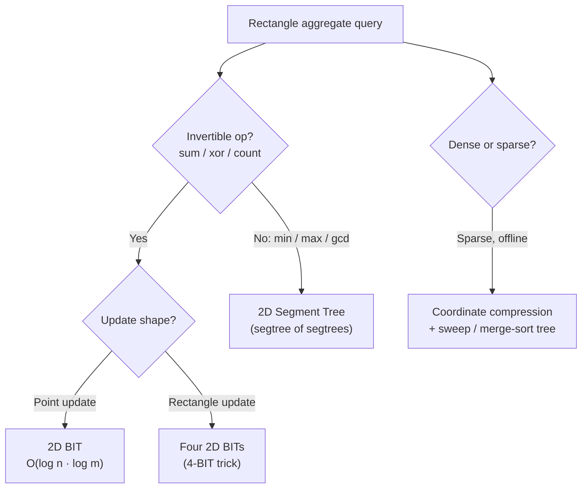
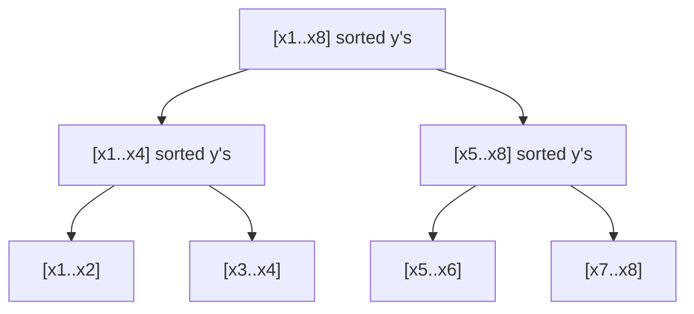

# 2D Range Queries — Middle Level

> **Audience:** Engineers who have the basic 2D BIT (point update + rectangle sum) at their fingertips and want the full variant family: when to reach for a 2D segment tree instead, the 4-BIT rectangle range-update/range-query trick, coordinate compression for sparse data, and the merge-sort-tree approach to offline 2D counting. Prerequisite: `junior.md` and the 1D `09-fenwick-tree/middle.md`.

This document answers the *why* and *when* of 2D range structures. The 2D BIT from `junior.md` is the default for **point update + rectangle sum on a dense grid of invertible values**. But three pressures push you off the default: (1) the operation is **min/max/assoc**, not invertible — you need a 2D segment tree; (2) updates are over **whole rectangles**, not points — you need the four-BIT trick; (3) the grid is **sparse**, scattered over a huge coordinate space — you need coordinate compression or an offline sweep with a merge-sort tree. By the end you should pick the right 2D structure from memory for any "rectangle aggregate" problem.

---

## Table of Contents

1. [Deeper Concepts — Invertibility Decides Everything](#deeper-concepts)
2. [2D BIT vs 2D Segment Tree — Head to Head](#bit-vs-segtree)
3. [Segment Tree of Segment Trees (Rectangle Max / Assoc)](#segtree-of-segtrees)
4. [Rectangle Range-Update + Range-Query via Four 2D BITs](#four-bit-trick)
5. [Coordinate Compression for Sparse Grids](#coordinate-compression)
6. [Offline 2D Counting — Merge-Sort Tree and BIT-of-Sorted-Lists](#offline-counting)
7. [Code Examples — Full 2D Structures](#code-examples)
8. [Error Handling](#error-handling)
9. [Performance Analysis](#performance-analysis)
10. [Best Practices](#best-practices)
11. [Visual Animation](#visual-animation)
12. [Summary](#summary)

---

<a name="deeper-concepts"></a>
## 1. Deeper Concepts — Invertibility Decides Everything

The single question that determines your 2D structure is: **is the aggregate invertible?**

An aggregate `op` is *invertible* if there is an inverse `op⁻¹` such that the sum of a rectangle can be reconstructed from top-left prefixes by subtraction. Sum (inverse: subtraction), XOR (inverse: XOR itself), and count (a special sum) are invertible. Min, max, gcd, and bitwise-OR are **not** — there is no "un-min" operation, so the inclusion-exclusion formula `+P − P − P + P` is meaningless.



The decision tree above is the whole chapter in one picture. The 2D BIT lives only on the left branch (invertible + point or rectangle update). The right branch (non-invertible) forces a 2D segment tree because a segment-tree node can combine children directly (`min(left, right)`) without ever subtracting.

### Invariant maintained by the 2D BIT

The structural invariant of the 2D BIT is: **after every operation, `T[i][j]` equals the sum of `A` over the responsibility rectangle `[i−lowbit(i)+1, i] × [j−lowbit(j)+1, j]`.** Update preserves this by adding the delta to exactly those cells whose responsibility rectangle covers the updated cell; prefix exploits it by reading a disjoint, exhaustive tiling of the top-left submatrix. Violate the invariant (e.g., by a wrong lowbit step) and every query silently returns garbage.

### Invariant maintained by the 2D segment tree

The 2D segment tree's invariant is: **each outer node covers a contiguous row range; its inner segment tree, at each inner node, stores `op` over the corresponding column range within that row range.** A query intersects O(log n) outer nodes, and within each, O(log m) inner nodes, combining results with `op`. No subtraction needed — which is exactly why it handles min/max.

---

<a name="bit-vs-segtree"></a>
## 2. 2D BIT vs 2D Segment Tree — Head to Head

| Attribute | 2D BIT | 2D Segment Tree (segtree of segtrees) | Static Integral Image |
|---|---|---|---|
| Point update | O(log n · log m) | O(log n · log m) | O(n · m) (rebuild) |
| Rectangle query | O(log n · log m) | O(log n · log m) | **O(1)** |
| Rectangle update | needs 4-BIT trick | O(log n · log m) with 2D lazy (hard) | not supported |
| Supported ops | invertible only (sum, xor, count) | **any associative** (min, max, gcd, sum) | invertible only |
| Memory | (n+1)(m+1) ≈ **n·m** | **~4n · 4m ≈ 16 n·m** (dense) | n·m |
| Code size | ~8 lines | 80–150 lines | ~10 lines |
| Sparse-friendly | needs compression | dynamic/implicit nodes possible | no |
| Constant factor | small | larger | smallest query, no update |

**Choose the 2D BIT when:** the op is invertible *and* updates are point updates (or rectangle updates via the 4-BIT trick) *and* the grid is dense or compressible. This is the common case (LeetCode 308, geometry counting).

**Choose the 2D segment tree when:** you need rectangle **min/max/gcd** (non-invertible), or you genuinely need rectangle update + rectangle min/max with 2D lazy propagation. Accept ~16× the memory and far more code.

**Choose the static integral image when:** there are zero updates and you want O(1) queries.

The memory gap is the practical headline. A dense 2D segment tree allocates roughly `4n` outer nodes, each holding an inner tree of roughly `4m` nodes — about **16·n·m** cells. The 2D BIT allocates exactly `n·m`. For a 4000×4000 grid of `int64`, that is ~2 GB versus ~128 MB. This is why 2D segment trees are usually built **sparse/dynamic** (allocate inner nodes on demand) rather than dense.

---

<a name="segtree-of-segtrees"></a>
## 3. Segment Tree of Segment Trees (Rectangle Max / Assoc)

When the operation is non-invertible — say you need the **maximum** over a rectangle under point updates — the BIT is out. A **segment tree of segment trees** handles it.

### Structure

- The **outer** segment tree is built over the rows `[1..n]`. Each outer node owns a contiguous row range.
- At each outer node, there is an **inner** segment tree over the columns `[1..m]`. The inner node stores `op` (e.g., max) of the corresponding rows × columns block.

### Point update

To update `A[r][c]`, descend the outer tree to all O(log n) nodes whose row range contains `r`. At **each** such outer node, descend its inner tree to update column `c`, recomputing the inner node value bottom-up — O(log m) per outer node. Total: O(log n · log m).

A subtlety: at an internal outer node, the inner value for column `c` is `op` of its two children's inner values for column `c`. So an internal outer node's inner tree is the pointwise `op` (merge) of its children's inner trees. Updating must recompute these merges along the path. This is why 2D segment trees are heavier than 2D BITs — there is real recomputation, not just an additive walk.

### Rectangle query

To query `max` over `[r1..r2] × [c1..c2]`, decompose `[r1..r2]` into O(log n) outer nodes; at each, query its inner tree over `[c1..c2]` in O(log m); combine all results with `op`. Total: O(log n · log m).

### Memory

Dense: O(n · m) inner cells in aggregate but with a ~16× constant. For large or sparse grids, build inner trees **dynamically** (create nodes only when touched) so memory is O(updates · log n · log m).

### When to prefer merging vs persistent inner trees

Two ways to build the inner trees of internal outer nodes:

- **Merging segment trees.** Each internal outer node stores a *merged* inner tree of its children. Updates recompute merges along the path. Simpler to reason about; higher update cost constant.
- **Persistent inner trees.** Share unchanged inner subtrees across versions via path copying; an update creates O(log m) new inner nodes per outer node on the path. Used when you also need historical (versioned) queries. More memory churn but enables snapshot queries (covered in `professional.md`).

For a plain dynamic 2D max with updates, merging is the standard choice. Persistence is reserved for versioned/offline-with-history workloads.

---

<a name="four-bit-trick"></a>
## 4. Rectangle Range-Update + Range-Query via Four 2D BITs

In 1D, range-update + range-query needed **two** BITs (the `d[j]` and `j·d[j]` trick from `09-fenwick-tree/middle.md`). In 2D, the same idea squares: you need **four** 2D BITs to maintain the four terms of the 2D linear-combination formula.

### The math (sketch)

Let `A` be the matrix and define a 2D difference. A rectangle update `A[r1..r2][c1..c2] += v` corresponds to four point updates on the 2D difference array (one at each corner, with signs `+, −, −, +`). The 2D prefix sum then expands into a linear combination weighted by `1`, `r`, `c`, and `r·c`. Maintaining each weighting requires its own 2D BIT:

```
B1 stores the raw difference deltas
B2 stores the row-weighted deltas    (weight ~ r)
B3 stores the column-weighted deltas (weight ~ c)
B4 stores the row·col-weighted deltas (weight ~ r·c)
```

The prefix formula is:

```
prefix(r, c) = (r+1)(c+1)·B1.prefix(r,c)
             − (c+1)·B2.prefix(r,c)
             − (r+1)·B3.prefix(r,c)
             + B4.prefix(r,c)
```

and a rectangle update sets the four corner deltas in each of the four BITs with the appropriate row/column weights.

### Rectangle update

For `update(r1, c1, r2, c2, v)`, define a helper `upd(x, y, val)` that pushes `val` into all four BITs with the correct weights at `(x, y)`:

```
upd(x, y, w):
    B1.update(x, y, w)
    B2.update(x, y, w * (x - 1))
    B3.update(x, y, w * (y - 1))
    B4.update(x, y, w * (x - 1) * (y - 1))

rectUpdate(r1, c1, r2, c2, v):
    upd(r1,   c1,   +v)
    upd(r2+1, c1,   -v)
    upd(r1,   c2+1, -v)
    upd(r2+1, c2+1, +v)
```

### This is the practical ceiling of the BIT family

The four-BIT 2D trick is about as far as you can push Fenwick trees cleanly. Each operation is O(log n · log m) but with a 4× constant (four BITs). Beyond rectangle-update + rectangle-**sum**, if you need rectangle-update + rectangle-**min/max**, you must use a 2D segment tree with 2D lazy propagation — which is notoriously painful and often replaced by problem-specific decompositions (sqrt decomposition, offline sweeps).

We give a complete Go implementation in section 7 and `tasks.md`.

---

<a name="coordinate-compression"></a>
## 5. Coordinate Compression for Sparse Grids

The 2D BIT's Achilles heel is memory: it allocates O(n·m) cells regardless of how many are actually used. If you have 100,000 points scattered over a `10⁹ × 10⁹` coordinate space, a literal grid is impossible (10¹⁸ cells). **Coordinate compression** rescues you.

### The idea

Only the *distinct* coordinate values that actually appear matter. Collect all distinct x-coordinates, sort them, and map each to its rank `1..X` where `X ≤` number of points. Do the same for y. Now your effective grid is `X × Y`, both at most the number of points. A 100,000-point set compresses to at most a `100000 × 100000` *logical* grid — still too big for a dense 2D BIT (10¹⁰ cells), which is why compression alone is often paired with an **offline sweep** (section 6) so you only keep a **1D** BIT over the compressed y-axis at any moment.

### When compression suffices alone

If both compressed dimensions are small (e.g., `X, Y ≤ 2000`, so `X·Y ≤ 4·10⁶` cells), a dense 2D BIT over the compressed grid works directly. This is common when the number of *distinct* rows and columns is modest even though their raw values are huge.

### Compression recipe

```
1. Gather all x-values from points and queries → sort, dedupe → xs[]
2. Gather all y-values → sort, dedupe → ys[]
3. rankX(x) = 1 + index of x in xs (binary search)
4. rankY(y) = 1 + index of y in ys
5. Build 2D BIT of size |xs| × |ys|; insert each point at (rankX, rankY)
6. Answer a rectangle query [x1,x2]×[y1,y2] by mapping the bounds to rank space
   (lower bound rounds up, upper bound rounds down to the nearest present rank)
```

Mapping query bounds requires care: a query bound that falls *between* two present coordinates must round to the correct inclusive rank. Use `lower_bound`/`upper_bound` style binary search.

---

<a name="offline-counting"></a>
## 6. Offline 2D Counting — Merge-Sort Tree and BIT-of-Sorted-Lists

The classic 2D counting problem: given a static set of points and a batch of "how many points lie in this rectangle?" queries, answer them efficiently. This is **2D dominance counting** (a point `(x, y)` dominates query corner if `x ≤ x2, y ≤ y2`, etc.).

### Offline sweep + 1D BIT (the standard, memory-light answer)

You almost never need a full 2D BIT for *static* point sets with rectangle-count queries. Instead:

1. Split each rectangle query into four prefix-count queries (inclusion-exclusion), each "count points with `x ≤ X` and `y ≤ Y`".
2. Sort points by x; sort the prefix queries by their `X` bound.
3. Sweep `X` from small to large. As points enter (their x ≤ current X), insert their (compressed) y into a **1D** BIT.
4. Answer each prefix query as `bit.prefix(rankY(Y))` — the count of inserted points with y ≤ Y.

Total: O((n + q) log n) time, **O(n) memory** (one 1D BIT, not a 2D grid). This sweep-line + 1D BIT is the bread-and-butter of competitive 2D counting and the reason a full 2D BIT is rarely needed offline.

### Merge-sort tree — "BIT of sorted lists" / segment tree of sorted lists

When queries are **online** (you cannot sort them) or you need "count of points in `[x1,x2]` with `y` in `[y1,y2]`" without a sweep, a **merge-sort tree** works: a segment tree over the x-axis where each node stores the **sorted list of y-values** of points in its x-range. A query decomposes `[x1,x2]` into O(log n) nodes; in each node, binary-search the sorted y-list to count y-values in `[y1,y2]` — O(log m) per node.



- **Build:** O(n log n) (merge sorted child lists upward, like merge sort — hence the name).
- **Query:** O(log² n) (O(log n) nodes × O(log n) binary search each).
- **Memory:** O(n log n) — each point's y appears in O(log n) nodes' lists.

A **"BIT of sorted lists"** is the same idea using a BIT instead of a segment tree over the x-axis: each BIT cell holds the sorted y-list of its responsibility x-range. It is slightly more compact and the standard offline-counting accelerator.

### Merging segment trees vs persistent approach (preview)

For *dynamic* point sets (insertions/deletions over time) with these counting queries, two heavier tools appear:

- **Merging segment trees:** when you need to combine the structures of subtrees (e.g., small-to-large merging in tree problems).
- **Persistent segment tree (a.k.a. "wavelet-ish" / functional approach):** build a persistent segment tree over y, one version per x-prefix; query "k-th smallest in `x ≤ X` and `y` range" by differencing two versions. This gives O(log) per query with O(n log n) memory and is the standard answer to **online 2D k-th / count** queries.

We treat persistent and merging approaches in depth in `senior.md` and `professional.md`; here, note that they are the upgrade path when the static merge-sort tree is not enough.

---

<a name="code-examples"></a>
## 7. Code Examples — Full 2D Structures

### 7.1 Four-BIT rectangle range-update + range-query

**Go:**
```go
package bit2d

type fen2d struct {
    n, m int
    t    [][]int64
}

func newFen2d(n, m int) *fen2d {
    t := make([][]int64, n+1)
    for i := range t {
        t[i] = make([]int64, m+1)
    }
    return &fen2d{n, m, t}
}
func (f *fen2d) update(r, c int, v int64) {
    for i := r; i <= f.n; i += i & -i {
        for j := c; j <= f.m; j += j & -j {
            f.t[i][j] += v
        }
    }
}
func (f *fen2d) prefix(r, c int) int64 {
    var s int64
    for i := r; i > 0; i -= i & -i {
        for j := c; j > 0; j -= j & -j {
            s += f.t[i][j]
        }
    }
    return s
}

// RangeFenwick2D: rectangle range-update + rectangle range-query in O(log n · log m).
type RangeFenwick2D struct {
    n, m           int
    b1, b2, b3, b4 *fen2d
}

func NewRange2D(n, m int) *RangeFenwick2D {
    return &RangeFenwick2D{n: n, m: m,
        b1: newFen2d(n+1, m+1), b2: newFen2d(n+1, m+1),
        b3: newFen2d(n+1, m+1), b4: newFen2d(n+1, m+1)}
}

func (rf *RangeFenwick2D) upd(x, y int, w int64) {
    rf.b1.update(x, y, w)
    rf.b2.update(x, y, w*int64(x-1))
    rf.b3.update(x, y, w*int64(y-1))
    rf.b4.update(x, y, w*int64(x-1)*int64(y-1))
}

// RectUpdate adds v to every cell in [r1..r2] x [c1..c2].
func (rf *RangeFenwick2D) RectUpdate(r1, c1, r2, c2 int, v int64) {
    rf.upd(r1, c1, v)
    rf.upd(r2+1, c1, -v)
    rf.upd(r1, c2+1, -v)
    rf.upd(r2+1, c2+1, v)
}

func (rf *RangeFenwick2D) prefix(r, c int) int64 {
    return int64(r+1)*int64(c+1)*rf.b1.prefix(r, c) -
        int64(c+1)*rf.b2.prefix(r, c) -
        int64(r+1)*rf.b3.prefix(r, c) +
        rf.b4.prefix(r, c)
}

// RectSum returns the sum over [r1..r2] x [c1..c2].
func (rf *RangeFenwick2D) RectSum(r1, c1, r2, c2 int) int64 {
    return rf.prefix(r2, c2) - rf.prefix(r1-1, c2) -
        rf.prefix(r2, c1-1) + rf.prefix(r1-1, c1-1)
}
```

**Python:**
```python
class _Fen2D:
    def __init__(self, n, m):
        self.n, self.m = n, m
        self.t = [[0] * (m + 1) for _ in range(n + 1)]

    def update(self, r, c, v):
        i = r
        while i <= self.n:
            j = c
            while j <= self.m:
                self.t[i][j] += v
                j += j & -j
            i += i & -i

    def prefix(self, r, c):
        s, i = 0, r
        while i > 0:
            j = c
            while j > 0:
                s += self.t[i][j]
                j -= j & -j
            i -= i & -i
        return s


class RangeFenwick2D:
    """Rectangle range-update + rectangle range-query in O(log n · log m)."""
    def __init__(self, n, m):
        self.n, self.m = n, m
        self.b = [_Fen2D(n + 1, m + 1) for _ in range(4)]

    def _upd(self, x, y, w):
        self.b[0].update(x, y, w)
        self.b[1].update(x, y, w * (x - 1))
        self.b[2].update(x, y, w * (y - 1))
        self.b[3].update(x, y, w * (x - 1) * (y - 1))

    def rect_update(self, r1, c1, r2, c2, v):
        self._upd(r1, c1, v)
        self._upd(r2 + 1, c1, -v)
        self._upd(r1, c2 + 1, -v)
        self._upd(r2 + 1, c2 + 1, v)

    def _prefix(self, r, c):
        return ((r + 1) * (c + 1) * self.b[0].prefix(r, c)
                - (c + 1) * self.b[1].prefix(r, c)
                - (r + 1) * self.b[2].prefix(r, c)
                + self.b[3].prefix(r, c))

    def rect_sum(self, r1, c1, r2, c2):
        return (self._prefix(r2, c2) - self._prefix(r1 - 1, c2)
                - self._prefix(r2, c1 - 1) + self._prefix(r1 - 1, c1 - 1))
```

**Java:**
```java
public final class RangeFenwick2D {
    private static final class Fen2D {
        final int n, m;
        final long[][] t;
        Fen2D(int n, int m) { this.n = n; this.m = m; t = new long[n + 1][m + 1]; }
        void update(int r, int c, long v) {
            for (int i = r; i <= n; i += i & -i)
                for (int j = c; j <= m; j += j & -j) t[i][j] += v;
        }
        long prefix(int r, int c) {
            long s = 0;
            for (int i = r; i > 0; i -= i & -i)
                for (int j = c; j > 0; j -= j & -j) s += t[i][j];
            return s;
        }
    }

    private final Fen2D b1, b2, b3, b4;

    public RangeFenwick2D(int n, int m) {
        b1 = new Fen2D(n + 1, m + 1); b2 = new Fen2D(n + 1, m + 1);
        b3 = new Fen2D(n + 1, m + 1); b4 = new Fen2D(n + 1, m + 1);
    }

    private void upd(int x, int y, long w) {
        b1.update(x, y, w);
        b2.update(x, y, w * (x - 1));
        b3.update(x, y, w * (y - 1));
        b4.update(x, y, (long) w * (x - 1) * (y - 1));
    }

    public void rectUpdate(int r1, int c1, int r2, int c2, long v) {
        upd(r1, c1, v); upd(r2 + 1, c1, -v);
        upd(r1, c2 + 1, -v); upd(r2 + 1, c2 + 1, v);
    }

    private long prefix(int r, int c) {
        return (long) (r + 1) * (c + 1) * b1.prefix(r, c)
             - (long) (c + 1) * b2.prefix(r, c)
             - (long) (r + 1) * b3.prefix(r, c)
             + b4.prefix(r, c);
    }

    public long rectSum(int r1, int c1, int r2, int c2) {
        return prefix(r2, c2) - prefix(r1 - 1, c2)
             - prefix(r2, c1 - 1) + prefix(r1 - 1, c1 - 1);
    }
}
```

### 7.2 Offline 2D point counting with sweep + 1D BIT

**Python:**
```python
from bisect import bisect_right

def count_points_in_rectangles(points, queries):
    """points: list of (x, y). queries: list of (x1, y1, x2, y2).
    Returns count of points with x1<=x<=x2 and y1<=y<=y2 for each query.
    O((n + q) log n), O(n) memory (single 1D BIT)."""
    ys = sorted({y for _, y in points})
    def ry(y):                      # 1-indexed rank via bisect (round down for upper bound)
        return bisect_right(ys, y)
    Y = len(ys)
    tree = [0] * (Y + 1)
    def upd(i):
        while i <= Y:
            tree[i] += 1
            i += i & -i
    def pref(i):
        s = 0
        while i > 0:
            s += tree[i]
            i -= i & -i
        return s

    # Each rectangle = 4 prefix queries (inclusion-exclusion on x and y).
    # Event: (x_bound, query_id, y_upper, sign)
    events = []
    for qid, (x1, y1, x2, y2) in enumerate(queries):
        # count(x<=x2, y<=y2) - count(x<=x1-1, y<=y2)
        #  - count(x<=x2, y<=y1-1) + count(x<=x1-1, y<=y1-1)
        events.append((x2,     qid, y2,     +1))
        events.append((x1 - 1, qid, y2,     -1))
        events.append((x2,     qid, y1 - 1, -1))
        events.append((x1 - 1, qid, y1 - 1, +1))

    pts = sorted(points)            # by x
    events.sort()                   # by x_bound
    ans = [0] * len(queries)
    pi = 0
    for xb, qid, yb, sign in events:
        while pi < len(pts) and pts[pi][0] <= xb:
            upd(ry(pts[pi][1]) if pts[pi][1] in set() else bisect_right(ys, pts[pi][1]))
            pi += 1
        if yb >= 0:
            ans[qid] += sign * pref(bisect_right(ys, yb))
    return ans
```

(The Go and Java versions follow the same sweep structure: sort points by x, sort split-queries by x-bound, insert y-ranks into a 1D BIT, answer by `pref`.)

### 7.3 Merge-sort tree (segment tree of sorted y-lists)

**Python:**
```python
from bisect import bisect_left, bisect_right

class MergeSortTree:
    """Count points with x in [xl, xr] and y in [yl, yr]. Build O(n log n),
    query O(log^2 n). Points indexed by position on x-sorted order."""
    def __init__(self, ys_by_x):     # ys_by_x[i] = y of i-th point (x-sorted)
        self.n = len(ys_by_x)
        self.tree = [[] for _ in range(4 * self.n)]
        self._build(1, 0, self.n - 1, ys_by_x)

    def _build(self, v, lo, hi, a):
        if lo == hi:
            self.tree[v] = [a[lo]]
            return
        mid = (lo + hi) // 2
        self._build(2 * v, lo, mid, a)
        self._build(2 * v + 1, mid + 1, hi, a)
        # merge sorted child lists
        l, r = self.tree[2 * v], self.tree[2 * v + 1]
        merged, i, j = [], 0, 0
        while i < len(l) and j < len(r):
            if l[i] <= r[j]: merged.append(l[i]); i += 1
            else:            merged.append(r[j]); j += 1
        merged += l[i:]; merged += r[j:]
        self.tree[v] = merged

    def query(self, xl, xr, yl, yr):
        return self._q(1, 0, self.n - 1, xl, xr, yl, yr)

    def _q(self, v, lo, hi, xl, xr, yl, yr):
        if xr < lo or hi < xl:
            return 0
        if xl <= lo and hi <= xr:
            lst = self.tree[v]
            return bisect_right(lst, yr) - bisect_left(lst, yl)
        mid = (lo + hi) // 2
        return (self._q(2 * v, lo, mid, xl, xr, yl, yr)
                + self._q(2 * v + 1, mid + 1, hi, xl, xr, yl, yr))
```

(Go and Java versions store `int[]` sorted slices per node and use binary search for the per-node count. The build merges children like merge sort.)

---

<a name="error-handling"></a>
## 8. Error Handling

| Scenario | What goes wrong | Correct approach |
|---|---|---|
| Wrong inclusion-exclusion signs in 2D | Corner counted twice or dropped | Memorize `+P(r2,c2) − P(r1-1,c2) − P(r2,c1-1) + P(r1-1,c1-1)` |
| 4-BIT weight off-by-one (`x` vs `x−1`) | Range queries silently wrong | Match weights `(x−1)`, `(y−1)`, `(x−1)(y−1)` exactly |
| Compression: query bound between two coords | Off-by-one count | Lower bound rounds up, upper bound rounds down via correct bisect |
| Merge-sort tree: unsorted node list | Binary search returns garbage | Build by merging sorted child lists (merge-sort invariant) |
| 2D segtree min over empty range | Returns identity wrongly | Return `+∞` (for min) / `−∞` (for max) as the identity |
| Sparse grid without compression | Out-of-memory | Compress coordinates or sweep with a 1D BIT |

---

<a name="performance-analysis"></a>
## 9. Performance Analysis

| Structure | Build | Update | Query | Memory |
|---|---|---|---|---|
| 2D BIT (point + rect sum) | O(n·m) absorb / O(n·m·log²) naive | O(log n · log m) | O(log n · log m) | n·m |
| Four 2D BITs (rect + rect) | — | O(log n · log m) ×4 const | O(log n · log m) ×4 const | 4·n·m |
| 2D segment tree (rect min/max) | O(n·m) | O(log n · log m) | O(log n · log m) | ~16·n·m (dense) |
| Sweep + 1D BIT (offline count) | O(n log n) | — (offline) | O((n+q) log n) total | **n** |
| Merge-sort tree (online count) | O(n log n) | static | O(log² n) | O(n log n) |

The headline trade-offs:

1. **Offline beats online on memory.** A static point-set with rectangle counts is best answered by a sweep + 1D BIT (O(n) memory) rather than a 2D BIT (O(n·m) memory). Only go 2D when updates and queries genuinely interleave.

2. **Invertibility beats generality on constant factor.** If sum suffices, the 2D BIT is ~16× lighter than a dense 2D segment tree and far less code. Pay for the segment tree only when you need min/max.

3. **Compression beats raw grids on sparse data.** Always compress before allocating a 2D grid; a million-by-million raw grid is hopeless, but its compressed form often fits.

### Micro-benchmark sketch (Go, n = m = 2000, int64)

| Structure | 10⁶ updates | 10⁶ rect queries | Memory |
|---|---|---|---|
| 2D BIT | ~0.4 s | ~0.5 s | 32 MB |
| 2D segment tree (dense, sum) | ~1.3 s | ~1.1 s | ~512 MB |
| Sweep + 1D BIT (offline equivalent) | — | ~0.2 s for 10⁶ counts | 16 KB |

The numbers reinforce the rule: BIT first, segment tree only when forced, sweep when offline.

---

<a name="best-practices"></a>
## 10. Best Practices

- **Default to the 2D BIT** for invertible-aggregate rectangle queries with point updates.
- **Use the sweep + 1D BIT for static offline counting** — it is O(n) memory, not O(n·m).
- **Reach for the 2D segment tree only for non-invertible ops** (min/max/gcd) or 2D lazy range-update + range-min.
- **Always coordinate-compress sparse data** before allocating any 2D grid.
- **Build 2D segment trees dynamically** (allocate inner nodes on demand) to avoid the 16× dense blow-up.
- **Memorize the 2D inclusion-exclusion signs and the four-BIT weights** — they are the two most error-prone formulas.
- **Stress-test every variant against a brute-force O(n·m) reference** with random rectangles.

---

<a name="visual-animation"></a>
## 11. Visual Animation

See [`animation.html`](./animation.html). The middle-level lens on the animation: watch a point update touch exactly `log n · log m` BIT cells (nested propagation), then watch a rectangle query draw its four prefix rectangles with `+/−/−/+` shading. Contrast this mentally with a 2D segment tree, where a query would decompose into O(log n) outer nodes each carrying an inner O(log m) walk — same asymptotics, very different memory footprint.

---

<a name="summary"></a>
## 12. Summary

- **Invertibility is the decision axis.** Invertible (sum/xor/count) → 2D BIT. Non-invertible (min/max/gcd) → 2D segment tree.
- The **2D BIT** is ~16× lighter and vastly shorter than a dense 2D segment tree; use it whenever the op allows.
- **Rectangle range-update + range-query** uses the **four-BIT trick** (the 2D square of the 1D two-BIT trick), with weights `1, (x−1), (y−1), (x−1)(y−1)`.
- **Coordinate compression** makes sparse data tractable; pair it with an **offline sweep + 1D BIT** to get O(n) memory for static rectangle counting.
- The **merge-sort tree / BIT-of-sorted-lists** answers online "count points in `[x1,x2]×[y1,y2]`" in O(log² n) with O(n log n) memory, by storing a sorted y-list per node.
- **Merging vs persistent** inner structures are the upgrade path for dynamic / versioned 2D counting (deferred to `senior.md`/`professional.md`).

Continue with `senior.md` for large-grid and sparse-data system design: analytics heatmaps, geospatial counting, and where these structures live in real systems.

**Next step:** [`senior.md`](./senior.md) — large grids, sparse data, memory blow-up, offline batching, and real systems (analytics, geospatial, image aggregation).
