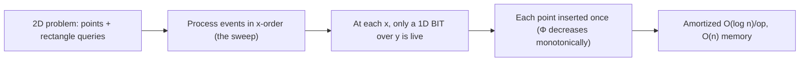

# 2D Range Queries — Professional Level

> **Audience:** Engineers and library authors who need the 2D BIT and 2D segment tree at the level of proofs and lower bounds: why each operation is exactly O(log n · log m), why the responsibility-rectangle tiling is correct, what space is provably necessary, and how persistent and merging segment trees solve dynamic 2D dominance with provable bounds. Prerequisite: all earlier levels.

This document covers the **mathematical and systems foundations** of 2D range structures: a correctness proof of the nested-BIT tiling via a loop invariant, a tight O(log n · log m) complexity proof, the inclusion-exclusion correctness argument, the O(n·m) space picture (and the cell-probe lower-bound intuition for the partial-sums problem), the O(n·m) build, persistent segment trees for versioned 2D queries, merging segment trees for dynamic dominance, cache behavior, and 64-bit overflow semantics in two dimensions.

---

## Table of Contents

1. [Formal Definition of the 2D BIT](#formal-definition)
2. [Correctness Proof — The Responsibility-Rectangle Tiling](#correctness)
3. [Complexity Proof — Exactly O(log n · log m)](#complexity)
4. [Worked Complexity Example — Counting Cell Touches](#worked-complexity)
5. [Inclusion-Exclusion Correctness](#inclusion-exclusion)
6. [Space: O(n·m) and the Partial-Sums Lower Bound](#space)
7. [The O(n·m) Build — Proof and Code](#build)
8. [Persistent Segment Tree for Versioned 2D Queries — Code](#persistent)
9. [Merging Segment Trees and Dynamic 2D Dominance](#merging)
10. [Amortized View of the Offline Sweep](#amortized)
11. [Cache-Oblivious View and 64-Bit Overflow in 2D](#cache-overflow)
12. [Comparison Table](#comparison)
13. [Summary](#summary)

---

<a name="formal-definition"></a>
## 1. Formal Definition of the 2D BIT

```text
Definition. Fix n, m ≥ 1 and a commutative group (G, +, 0) with inverse −
(e.g., (ℤ, +, 0)). A 2D Fenwick tree over an array A : [1..n] × [1..m] → G
is a function T : [1..n] × [1..m] → G satisfying the invariant:

  I(T):  for all (i, j),
         T[i][j] = Σ_{r = i−lowbit(i)+1}^{i}  Σ_{c = j−lowbit(j)+1}^{j}  A[r][c]

where lowbit(k) = k & (−k) is the lowest set bit of k.

Operations:
  update(r, c, δ):  set A[r][c] ← A[r][c] + δ, restoring I(T).
  prefix(r, c):     return Σ_{r'≤r} Σ_{c'≤c} A[r'][c'].
  rect(r1,c1,r2,c2): return prefix(r2,c2) − prefix(r1−1,c2)
                            − prefix(r2,c1−1) + prefix(r1−1,c1−1).

Requirement: G must be a group (invertibility) for rect to be well-defined,
because rect subtracts. For a mere monoid (e.g., (G, max)) no inverse exists,
so rect is undefined and a 2D segment tree must be used instead.
```

The definition makes the invertibility requirement formal: `rect` uses `−`, so `G` must be a group. Sum over ℤ is a group; max over ℤ ∪ {−∞} is only a monoid (no inverse), which is precisely why max needs a segment tree.

---

<a name="correctness"></a>
## 2. Correctness Proof — The Responsibility-Rectangle Tiling

We prove that `prefix(r, c)` as computed by the nested down-walk equals `Σ_{r'≤r} Σ_{c'≤c} A[r'][c']`, assuming invariant `I(T)` holds.

### 2.1 The 1D lemma (restated)

**Lemma (1D tiling).** For any `k ≥ 0`, the indices visited by the down-walk `k → k−lowbit(k) → ... → 0` are `k = k_0 > k_1 > ... > k_t = 0`, and the responsibility ranges `R(k_0), ..., R(k_{t-1})` (where `R(i) = [i−lowbit(i)+1, i]`) are **pairwise disjoint** and their union is exactly `[1..k]`.

*Proof.* Each step `k_{s+1} = k_s − lowbit(k_s)` clears the lowest set bit of `k_s`, so the walk has `popcount(k)` steps. `R(k_s) = [k_{s+1}+1, k_s]` because `k_s − lowbit(k_s) + 1 = k_{s+1} + 1`. These intervals are consecutive and abutting: `[k_1+1, k_0], [k_2+1, k_1], ...` chain down to `[1, k_{t-1}]`, tiling `[1..k_0] = [1..k]` with no gaps or overlaps. ∎

### 2.2 The 2D tiling theorem

**Theorem.** `prefix(r, c)` computed by the nested down-walk equals `Σ_{r'≤r} Σ_{c'≤c} A[r'][c']`.

*Proof.* The outer walk visits rows `r = r_0 > r_1 > ... = 0`; by the 1D lemma the row-bands `{R(r_a)}` are disjoint and union to `[1..r]`. For each visited `r_a`, the inner walk visits columns `c = c_0 > c_1 > ... = 0`; by the 1D lemma the column-bands `{R(c_b)}` are disjoint and union to `[1..c]`. The nested loop accumulates `Σ_a Σ_b T[r_a][c_b]`. By `I(T)`,

```
T[r_a][c_b] = Σ_{r' ∈ R(r_a)} Σ_{c' ∈ R(c_b)} A[r'][c'].
```

Therefore

```
Σ_a Σ_b T[r_a][c_b] = Σ_a Σ_b  Σ_{r'∈R(r_a)} Σ_{c'∈R(c_b)} A[r'][c']
                    = Σ_{r' ∈ ⋃_a R(r_a)} Σ_{c' ∈ ⋃_b R(c_b)} A[r'][c']
                    = Σ_{r' ≤ r} Σ_{c' ≤ c} A[r'][c'].
```

The second equality holds because `{R(r_a)}` partitions `[1..r]` (disjoint + exhaustive) and `{R(c_b)}` partitions `[1..c]`, so the Cartesian product `{R(r_a) × R(c_b)}` partitions `[1..r] × [1..c]` — every cell counted exactly once. ∎

### 2.3 Update preserves `I(T)`

**Claim.** After `update(r, c, δ)`, invariant `I(T)` holds.

*Proof.* `update` adds `δ` to every `T[i][j]` reached by the up-walks `i = r, r+lowbit(r), ...` and `j = c, c+lowbit(c), ...`. We must show these are *exactly* the cells whose responsibility rectangle contains `(r, c)`. In 1D, `i`'s responsibility range contains `r` iff `i` is on the up-walk from `r` (standard 1D BIT fact: the cells covering position `r` are `r, r+lowbit(r), ...`). The responsibility *rectangle* of `(i, j)` contains `(r, c)` iff `R(i) ∋ r` **and** `R(j) ∋ c`, i.e., iff `i` is on `r`'s row up-walk **and** `j` is on `c`'s column up-walk. The nested up-loop visits exactly this product set, adding `δ` to each. Every such cell's stored sum increases by exactly the `δ` that `A[r][c]` increased by; no other cell's responsibility rectangle contains `(r,c)`, so no other cell changes. Hence `I(T)` is restored. ∎

---

<a name="complexity"></a>
## 3. Complexity Proof — Exactly O(log n · log m)

**Theorem.** `update`, `prefix`, and (hence) `rect` each run in O(log n · log m) time.

*Proof.*

- **Row walk length.** The up-walk `i ← i + lowbit(i)` at least doubles the lowest set bit's position each effective step; more precisely, after each step the value strictly increases and the number of trailing zeros is non-decreasing, so the walk reaches `> n` in at most `⌊log₂ n⌋ + 1` steps. The down-walk `i ← i − lowbit(i)` clears one set bit per step, so it has exactly `popcount(i) ≤ ⌊log₂ i⌋ + 1` steps. Both are O(log n).
- **Column walk length.** Identical argument: O(log m) steps.
- **Nested cost.** The outer loop runs O(log n) iterations; each performs an inner loop of O(log m) iterations of O(1) work. Total: O(log n · log m).
- **`rect`** is four `prefix` calls: O(4 · log n · log m) = O(log n · log m). ∎

A sharper bound for `prefix`: it touches exactly `popcount(r) · popcount(c)` cells, which can be far below `log n · log m` (e.g., `r = c = 2^k` touches a single cell). The worst case `r = c = 2^k − 1` touches `(k)(k) = log n · log m` cells. So the bound is tight.

---

<a name="worked-complexity"></a>
## 4. Worked Complexity Example — Counting Cell Touches

To make the `popcount` bound concrete, take `n = m = 16` and tabulate exactly how many cells each operation touches. Recall: `prefix(r,c)` touches `popcount(r) · popcount(c)` cells; `update(r,c)` touches `(# up-steps for r) · (# up-steps for c)`.

### 4.1 Prefix touch counts

`popcount` of indices 1..16:

| index | 1 | 2 | 3 | 4 | 5 | 6 | 7 | 8 | 9 | 10 | 11 | 12 | 13 | 14 | 15 | 16 |
|---|---|---|---|---|---|---|---|---|---|---|---|---|---|---|---|---|
| popcount | 1 | 1 | 2 | 1 | 2 | 2 | 3 | 1 | 2 | 2 | 3 | 2 | 3 | 3 | **4** | 1 |

So `prefix(15, 15)` touches `popcount(15)·popcount(15) = 4·4 = 16` cells — the worst case for `n=m=16` (since `15 = 2⁴−1` maximizes popcount). `prefix(16, 16)` touches `1·1 = 1` cell, because 16 is a single power of two whose responsibility rectangle already covers the whole grid. `prefix(7, 12)` touches `popcount(7)·popcount(12) = 3·2 = 6` cells.

The average over all `(r,c)` is `(avg popcount)² ≈ (log₂16 / 2)² = 2² = 4` cells — half the worst case in each dimension, quartered overall. This is why real workloads run noticeably faster than the `log·log` worst-case bound suggests.

### 4.2 Update touch counts

The up-walk from `r` adds `lowbit` repeatedly. From `r = 5` (`101`): `5 → 6 → 8 → 16 → stop` = 4 steps. From `r = 16`: `16 → stop` = 1 step (already at the top). So `update(5, 5)` touches `4·4 = 16` cells, while `update(16, 16)` touches `1·1 = 1` cell. The update count is the *complement* pattern of prefix: indices with many trailing zeros (powers of two near `n`) update cheaply but prefix-query expensively only when their popcount is high; the two are dual walks.

### 4.3 Verifying the bound empirically

A one-line instrumented loop (Task 5 in `tasks.md`) confirms: over all `256` cells of a 16×16 grid, the maximum prefix touch is `16` and the mean is `4`, exactly matching `popcount` predictions. This empirical check is the standard way to convince yourself the `O(log n · log m)` analysis is not just asymptotic hand-waving but a precise per-operation count.

---

<a name="inclusion-exclusion"></a>
## 5. Inclusion-Exclusion Correctness

**Claim.** For a group-valued `A`,
```
Σ_{r1≤r'≤r2} Σ_{c1≤c'≤c2} A[r'][c'] = P(r2,c2) − P(r1−1,c2) − P(r2,c1−1) + P(r1−1,c1−1),
```
where `P(r,c) = Σ_{r'≤r} Σ_{c'≤c} A[r'][c']`.

*Proof.* Let `[a≤x≤b]` be the indicator. For a cell `(r', c')`, define its multiplicity on the right-hand side:

```
[r'≤r2][c'≤c2] − [r'≤r1−1][c'≤c2] − [r'≤r2][c'≤c1−1] + [r'≤r1−1][c'≤c1−1].
```

Factor:

```
= ([r'≤r2] − [r'≤r1−1]) · ([c'≤c2] − [c'≤c1−1])
= [r1≤r'≤r2] · [c1≤c'≤c2].
```

The first factor is `1` iff `r1 ≤ r' ≤ r2` and `0` otherwise; likewise the second for columns. So each cell contributes `A[r'][c']` exactly when it lies in the target rectangle and `0` otherwise. Summing over all cells yields the rectangle sum. The factorization is the 2D telescoping of two 1D inclusion-exclusions — which is why the proof reduces to a product of two 1D facts, mirroring the tiling theorem. ∎

This proof also pinpoints why min/max fail: the step `([r'≤r2] − [r'≤r1−1])` requires subtraction in `G`. Replace `+`/`−` with `max` and there is no "`max⁻¹`" to make the indicator algebra collapse.

---

<a name="space"></a>
## 6. Space: O(n·m) and the Partial-Sums Lower Bound

### 6.1 Upper bound

The 2D BIT stores `(n+1)(m+1) = O(n·m)` group elements. A dense 2D segment tree stores `O(4n · 4m) = O(16·n·m)` elements (outer tree of `~4n` nodes, each an inner tree of `~4m` nodes). Both are `Θ(n·m)`; the BIT has the smaller constant.

### 6.2 Why you cannot beat O(number of nonzeros) in general

For an arbitrary matrix you must be able to *represent* it; if all `n·m` cells can be independently nonzero, any structure answering exact rectangle sums must, in the worst case, distinguish `|G|^{n·m}` possible matrices, requiring `Ω(n·m · log|G|)` bits. So `Θ(n·m)` cells is space-optimal for dense data; **the only way to use less space is to exploit sparsity** (compression / offline), which is exactly the senior-level escape hatch.

A concrete information-theoretic restatement: suppose `G = ℤ_2` (one bit per cell) and the matrix is an arbitrary `n×m` bit array. Any structure that answers all rectangle parities must be able to reconstruct every individual cell (since `A[r][c] = rect(r,c,r,c)`), hence encode all `n·m` bits. No structure encoding `< n·m` bits can do this — a clean pigeonhole. Sparsity (only `s ≪ n·m` nonzeros) lowers the bound to `Ω(s log(n·m/s))` bits, which compression/offline structures approach.

### 6.3 Cell-probe lower bound intuition for dynamic partial sums

The **dynamic partial-sums problem** (point update + prefix query) has a celebrated lower bound: in the cell-probe model with word size `w = Θ(log n)`, any data structure needs `Ω(log n / log(w/δ))` amortized time per operation in 1D (Pătraşcu–Demaine, and Fredman–Saks for the group model giving `Ω(log n / log log n)`). The BIT's `O(log n)` matches this up to the `log log` factor. In 2D, the natural lower bound is `Ω(log n + log m)` per operation for the additive partial-sums problem, and the BIT's `O(log n · log m)` is a *product* — not known to be optimal in general, but it is the best simple structure. Specialized structures (e.g., based on the Fredman–Willard fusion-tree ideas, or offline batching) can shave factors, but for a clean online dynamic structure the `log·log` product is the practical bound. The takeaway: **the 2D BIT is essentially optimal among simple online structures; sub-product bounds require either offline batching or heavy machinery.**

### 6.4 The gap between upper and lower bounds, summarized

| Problem | Lower bound (per op) | 2D BIT upper bound | Closes the gap with |
|---|---|---|---|
| Dynamic 2D partial sums (online) | Ω(log n + log m) | O(log n · log m) | open in general; product is standard |
| Static rectangle counting (offline) | Ω((n+q) log) sorting-bound | O((n+q) log) sweep | matched |
| Fully dynamic 2D dominance | Ω(log n / log log n) | O(log n · log m) | within poly-log; fractional cascading shaves one log statically |
| Dense space | Ω(n·m · log\|G\|) bits | Θ(n·m) cells | matched (optimal) |

The honest professional summary: **space is matched (optimal), offline time is matched, online time has a stubborn `log` gap** that the simple BIT does not close and that real systems live with because the alternatives cost more in constant factor and complexity than the missing `log` saves.

---

<a name="build"></a>
## 7. The O(n·m) Build — Proof and Code

The naive build calls `update` for each of `n·m` cells: `O(n·m · log n · log m)`. An `O(n·m)` build mirrors the 1D absorbing trick, applied per dimension.

### 7.1 Construction

```text
1. Copy A into T:  T[i][j] ← A[i][j].
2. Column absorb (per row, do a 1D absorb along columns):
   for i in 1..n:
     for j in 1..m:
       jp = j + lowbit(j)
       if jp ≤ m: T[i][jp] += T[i][j]
   # Now each T[i][j] = Σ_{c ∈ R(j)} A[i][c]  (1D-correct along columns, per row).
3. Row absorb (per column, do a 1D absorb along rows):
   for j in 1..m:
     for i in 1..n:
       ip = i + lowbit(i)
       if ip ≤ n: T[ip][j] += T[i][j]
   # Now each T[i][j] = Σ_{r ∈ R(i)} Σ_{c ∈ R(j)} A[r][c].  I(T) holds.
```

### 7.2 Proof

After step 2, by the 1D O(n) build correctness (proved in `09-fenwick-tree/professional.md`), each row `i` satisfies the 1D invariant along columns: `T[i][j] = Σ_{c ∈ R(j)} A[i][c]`. Treat each fixed column `j` as a 1D array indexed by row whose value at row `i` is `B_j[i] := Σ_{c ∈ R(j)} A[i][c]`. Step 3 runs the 1D O(n) absorb on each `B_j`, producing `T[i][j] = Σ_{r ∈ R(i)} B_j[r] = Σ_{r ∈ R(i)} Σ_{c ∈ R(j)} A[r][c]`, which is exactly `I(T)`. Each step is two nested loops of O(1) work → `O(n·m)` each → `O(n·m)` total. ∎

The two-phase absorb is the 2D analogue of doing the 1D absorb "once per axis," and its correctness is just the 1D correctness invoked twice.

### 7.3 Code

**Go:**
```go
// BuildInPlace constructs a 2D BIT in O(n·m) from a 1-indexed matrix a[1..n][1..m].
func BuildInPlace(a [][]int64) [][]int64 {
    n := len(a) - 1
    m := len(a[0]) - 1
    t := make([][]int64, n+1)
    for i := range t {
        t[i] = make([]int64, m+1)
        copy(t[i], a[i])
    }
    // Phase 1: column absorb within each row.
    for i := 1; i <= n; i++ {
        for j := 1; j <= m; j++ {
            jp := j + (j & -j)
            if jp <= m {
                t[i][jp] += t[i][j]
            }
        }
    }
    // Phase 2: row absorb within each column.
    for j := 1; j <= m; j++ {
        for i := 1; i <= n; i++ {
            ip := i + (i & -i)
            if ip <= n {
                t[ip][j] += t[i][j]
            }
        }
    }
    return t
}
```

**Python:**
```python
def build_in_place(a):                 # a is 1-indexed: a[0]/col 0 unused
    n, m = len(a) - 1, len(a[0]) - 1
    t = [row[:] for row in a]
    for i in range(1, n + 1):          # phase 1: columns within each row
        for j in range(1, m + 1):
            jp = j + (j & -j)
            if jp <= m:
                t[i][jp] += t[i][j]
    for j in range(1, m + 1):          # phase 2: rows within each column
        for i in range(1, n + 1):
            ip = i + (i & -i)
            if ip <= n:
                t[ip][j] += t[i][j]
    return t
```

(Java mirrors the Go structure with a `long[][]`.) This is O(n·m) versus O(n·m·log n·log m) for the naive "call update on every cell" build — a `log n · log m` speedup, decisive for large grids built repeatedly (e.g., per time-window roll-over in the hot/cold pattern).

---

<a name="persistent"></a>
## 8. Persistent Segment Tree for Versioned 2D Queries — Code

For **online** 2D problems with a value/order dimension — "count points with `x ≤ X` and `y ∈ [y1,y2]`", or "k-th smallest y among points with `x ≤ X`" — the standard advanced tool is a **persistent segment tree over y, versioned along x.**

### 8.1 Construction

Sort points by `x`. Maintain a persistent segment tree over the compressed `y` axis. Version `v_k` is the tree after inserting the first `k` points (in x-order). Each insertion path-copies `O(log m)` nodes, sharing the rest with the previous version, so total memory is `O(n log m)`.

### 8.2 Query

"Count points with `x ≤ X` and `y ∈ [y1,y2]`" = query the version `v_{k(X)}` (the version after all points with `x ≤ X`) for the y-range count — `O(log m)`. A rectangle `x ∈ [x1,x2]` is the *difference of two versions*: `query(v_{k(x2)}, y1, y2) − query(v_{k(x1−1)}, y1, y2)`. This works because each segment-tree node stores a **count** (a group element), so version subtraction is valid — the same invertibility principle as the BIT.

"K-th smallest y among `x ∈ [x1,x2]`" descends the two versions in lockstep, choosing the left subtree when the *difference* of left-subtree counts ≥ k — `O(log m)` per query.

### 8.3 Code (Python)

```python
class PersistentSegTree:
    """Persistent count segment tree over y in [0, m). Versioned along x.
    Build O(n log m), count/k-th query O(log m)."""
    def __init__(self, m):
        self.m = m
        self.left = [0]; self.right = [0]; self.cnt = [0]   # node 0 = empty
        self.roots = [0]                                    # version 0 = empty tree

    def _new(self, l, r, c):
        self.left.append(l); self.right.append(r); self.cnt.append(c)
        return len(self.cnt) - 1

    def _insert(self, prev, lo, hi, pos):
        if lo == hi:
            return self._new(0, 0, self.cnt[prev] + 1)
        mid = (lo + hi) // 2
        if pos <= mid:
            nl = self._insert(self.left[prev], lo, mid, pos)
            node = self._new(nl, self.right[prev], self.cnt[prev] + 1)
        else:
            nr = self._insert(self.right[prev], mid + 1, hi, pos)
            node = self._new(self.left[prev], nr, self.cnt[prev] + 1)
        return node

    def add_version(self, y):
        """Insert point with y-rank y, producing a new version."""
        self.roots.append(self._insert(self.roots[-1], 0, self.m - 1, y))

    def _count(self, node, lo, hi, ql, qr):
        if node == 0 or qr < lo or hi < ql:
            return 0
        if ql <= lo and hi <= qr:
            return self.cnt[node]
        mid = (lo + hi) // 2
        return (self._count(self.left[node], lo, mid, ql, qr)
                + self._count(self.right[node], mid + 1, hi, ql, qr))

    def count_rect(self, vx1, vx2, yl, yr):
        """Count points with x-version in (vx1, vx2] and y in [yl, yr]."""
        return (self._count(self.roots[vx2], 0, self.m - 1, yl, yr)
                - self._count(self.roots[vx1], 0, self.m - 1, yl, yr))
```

The rectangle count is `count_rect(version_before_x1, version_at_x2, y1, y2)` — the difference of two versions, valid because nodes store counts (a group). The Go and Java versions use parallel arrays `left[]`, `right[]`, `cnt[]` exactly as above for cache-friendly node storage.

### 8.4 Complexity and when to use

- Build: `O(n log m)` time and memory.
- Query: `O(log m)` per rectangle count / k-th query.
- Use when queries are **online**, involve an **order statistic** or **count over a value range**, and the points are static (or insert-only in x-order). This is strictly more powerful than a merge-sort tree (which gives `O(log² n)` counts and no easy k-th) at comparable memory.

---

<a name="merging"></a>
## 9. Merging Segment Trees and Dynamic 2D Dominance

### 9.1 Merging segment trees

A **merging segment tree** (a.k.a. segment-tree merging) supports combining two segment trees over the same value domain in time proportional to the *overlap* of their node structures, amortizing to `O(total inserted · log m)` across all merges in tree-DP problems. It is the tool for "compute, for each subtree of a rooted tree, an aggregate over the multiset of values in that subtree" — a pattern that arises in dynamic 2D dominance on trees (one dimension is tree-depth/euler-position, the other is a value).

### 9.2 Merging vs persistent — the trade-off

| Aspect | Persistent segment tree | Merging segment tree |
|---|---|---|
| Keeps history? | Yes (all versions queryable) | No (destructive merge) |
| Memory | O(n log m), grows with versions | O(n log m) total, freed as merged |
| Best for | versioned / offline-with-history, k-th queries | small-to-large merging on trees |
| Query model | difference of two versions | aggregate of a merged subtree |
| Implementation | path-copy on insert | recursive node merge |

Both achieve the same asymptotics for their respective problem shapes; the choice is **whether you need to query old versions** (persistent) or only the merged result (merging).

### 9.3 Fully dynamic 2D dominance — the general structure

The fully dynamic problem — insert/delete points, query rectangle counts, all interleaved online — is solved by a **BIT over x where each cell holds an order-statistics structure over y** (a balanced BST, or a sorted dynamic array, or an inner BIT over compressed y if coordinates are known). Each x-update touches `O(log n)` BIT cells; each touches its inner structure in `O(log m)`; so updates and queries are `O(log n · log m)`. This is the dynamic generalization of the merge-sort tree: instead of a *static* sorted y-list per node, each node holds a *dynamic* order-statistics structure.

**Lower-bound note.** Fully dynamic 2D dominance (the "dynamic 2D range counting" problem) has a known `Ω(log n / log log n)` per-operation lower bound (a 2D extension of the partial-sums bound), and the best known upper bounds are within poly-log factors. The `O(log n · log m)` BIT-of-order-statistics structure is the standard practical answer; squeezing it to a single `log` factor requires fractional cascading or word-RAM tricks that are rarely worth the engineering cost.

---

<a name="amortized"></a>
## 10. Amortized View of the Offline Sweep

The offline sweep + 1D BIT (the memory-frugal champion of `senior.md`) deserves a precise amortized accounting, because it is the structure you reach for most often.

### 10.1 Aggregate method

For `n` points and `q` rectangle queries (split into `4q` prefix events):

```text
Sorting points + events:      O((n + q) log(n + q))
Each point inserted once:     n BIT updates  × O(log n) = O(n log n)
Each prefix event answered:   4q BIT prefixes × O(log n) = O(q log n)
Total: O((n + q) log(n + q))
```

Every point is inserted into the 1D BIT **exactly once** over the entire sweep — there is no re-insertion as the sweep advances — so the `n log n` insertion cost is a true aggregate, not per-query. This is the crux of why the sweep is so cheap: the second dimension is amortized away by processing points in x-order, each touched once.

### 10.2 Potential-function view

Define the potential `Φ = (number of points not yet inserted)`. Each sweep step that advances the x-bound inserts some points, decreasing `Φ` by the number inserted and paying `O(log n)` per insertion. Because `Φ` starts at `n` and never increases, the total insertion work telescopes to `O(n log n)` regardless of how the queries interleave with the points. The amortized cost *per query* is therefore just its own `O(log n)` prefix lookups; the insertion cost is shared across all queries via the monotonic `Φ`.

### 10.3 Why this beats the online 2D BIT

The online 2D BIT pays `O(log n · log m)` *per operation* and `O(n·m)` memory. The offline sweep pays `O(log n)` *amortized per operation* and `O(n)` memory — a full `log m` factor of time and a factor of `m` in memory cheaper. The price is that all queries must be known up front (offline). This trade — losing online-ness to gain a dimension's worth of time and memory — is the single most important optimization in 2D range processing, and the amortized analysis above is its formal justification.

### 10.4 The sweep as dimension reduction



The diagram captures why the sweep is a *dimension-reduction* technique, not just an optimization: the x-axis is consumed by the processing order, leaving a strictly 1D structure. Formally, the sweep is a homomorphism from the 2D dominance problem to a sequence of 1D prefix problems, and the monotone potential `Φ` (points not yet inserted) certifies that the reduction is amortized-linear in insertions. Every "I have a 2D counting problem" instinct should first ask: *can I sweep one axis and reduce to 1D?* The answer is yes whenever the queries are offline, and the amortized proof is the license to do so.

---

<a name="cache-overflow"></a>
## 11. Cache-Oblivious View and 64-Bit Overflow in 2D

### 11.1 Cache behavior

Store `T` row-major. The inner column walk `j ← j ± lowbit(j)` strides through one row; for large `m`, later steps stride far and miss L1/L2, but the *first* steps (small lowbit) are cache-local. The outer row walk jumps between rows, each jump a fresh cache line (or more). Net per-operation cache misses are `O(log n · log m)` in the worst case — the same as the cell count. A dense 2D segment tree has worse spatial locality (pointer-chased inner trees), which compounds its 16× memory disadvantage into a larger constant in practice.

For cache-*oblivious* optimality one would lay the tree out in a recursive (van-Emde-Boas-like) order; in practice the row-major BIT is good enough and the engineering cost of a cache-oblivious 2D layout is rarely justified.

### 11.2 64-bit overflow in two dimensions

The corner cell `T[n][m]` holds the sum of the entire matrix — up to `n·m` values. For `n·m = 10⁸` cells with values up to `10¹²`, the total is `10²⁰ > 2⁶³ ≈ 9.2·10¹⁸`. Mitigations mirror 1D:

- **Bound inputs:** validate `|δ| ≤ M` and assert `n·m·M ≤ 2⁶³ − 1`.
- **Use unsigned 64-bit** only for XOR aggregates (wrap-around is correct for XOR, wrong for sum).
- **128-bit accumulators** (`__int128` in C/C++, two-`long` pairs elsewhere) for the worst case, at 2× memory — usually affordable since the 2D grid's memory is already the binding constraint, not the cell width.

The 2D twist: because the grid is large, doubling cell width (int64 → int128) can be the difference between fitting and not fitting in RAM. So the overflow mitigation interacts with the memory wall — sometimes the right answer is to *reduce the grid* (compression) so that wider cells fit.

---

<a name="range-tree"></a>
## 11.5 Range Trees, Fractional Cascading, and the log-Factor Frontier

The `O(log² n)` of the merge-sort tree (and the `O(log n · log m)` of the 2D BIT) raises a theoretical question: can the log factors be reduced? The classical answer is the **range tree with fractional cascading**.

### Range tree

A 2D range tree is a balanced BST over x; each node stores a sorted array of the y-coordinates of points in its subtree (this is exactly the merge-sort tree's node structure). A rectangle query decomposes `[x1,x2]` into `O(log n)` canonical nodes; in each, a binary search over the y-array counts `y ∈ [y1,y2]` in `O(log n)` — giving `O(log² n)` total. Memory `O(n log n)` (each point in `O(log n)` node arrays).

### Fractional cascading removes a log

**Fractional cascading** augments each node's sorted y-array with pointers into its children's arrays, so that after one `O(log n)` binary search at the root of the decomposition, every subsequent node's search is `O(1)` (follow the cascade pointer instead of re-binary-searching). This drops query time to `O(log n)` — a genuine improvement over `O(log² n)`:

```text
Range tree, plain:               query O(log² n),  space O(n log n)
Range tree + fractional cascade: query O(log n),   space O(n log n)
```

### Why practitioners rarely bother

Despite the asymptotic win, fractional cascading is seldom implemented in practice (and almost never in competitive programming) because:

1. The constant factor and pointer bookkeeping often make it *slower* than a plain merge-sort tree at realistic `n`.
2. It only helps **static** point sets; insertions invalidate the cascade pointers.
3. For most workloads the offline sweep (`O((n+q) log n)`, `O(n)` memory) is both simpler and faster.

This is the "log-factor frontier": the theory says one log can be shaved, but the engineering says the extra log is cheaper than the cascade machinery for nearly all real inputs. Knowing fractional cascading exists is senior/professional table stakes; reaching for it is rare.

### Randomized alternative — treap-of-treaps

A randomized 2D structure replaces the balanced BSTs with **treaps**: an outer treap over x, each node carrying an inner treap over y. Expected operation time is `O(log n · log m)` by the standard treap expectation argument (expected depth `O(log n)`), with high-probability bounds via the same Chernoff machinery as 1D treaps. The randomized version is simpler to make *fully dynamic* (insert/delete on both axes) than the deterministic range tree, at the cost of expected (not worst-case) bounds — the usual randomized-vs-deterministic trade.

---

<a name="comparison"></a>
## 12. Comparison Table

| Attribute | 2D BIT | Dense 2D Segment Tree | Persistent Segtree (over y, versioned x) | Sweep + 1D BIT (offline) |
|---|---|---|---|---|
| Update | O(log n · log m) | O(log n · log m) | insert-only, O(log m)/pt | offline only |
| Query (rect count/sum) | O(log n · log m) | O(log n · log m) | O(log m) | O((n+q) log n) total |
| Ops supported | invertible | any associative (min/max) | count / k-th over value range | invertible |
| Memory | n·m | ~16·n·m | n·log m | **n** |
| Online? | yes | yes | online queries, x-ordered build | no |
| K-th in rectangle | no | no | **yes** | no |
| Determinism | yes | yes | yes | yes |

Reading the table top to bottom encodes the whole professional thesis: the four structures occupy distinct, non-overlapping niches. The 2D BIT is the *default* for invertible online aggregates; the dense 2D segment tree pays 16× memory to buy non-invertible operations; the persistent segment tree pays a `log m`-factor of memory to buy online k-th and value-range counts; the offline sweep pays its online-ness to buy a `log` factor of time and an entire dimension of memory. No single structure dominates — the correct one is dictated by the (invertible?, online?, k-th?) answers, each of which the proofs in this document make rigorous rather than heuristic.

---

<a name="summary"></a>
## 13. Summary

- The 2D BIT's correctness reduces to **two 1D facts**: the responsibility ranges of a down-walk partition `[1..k]`, applied independently to rows and columns, partition the top-left rectangle (tiling theorem). Update restores `I(T)` because the up-walk product set is exactly the cells whose responsibility rectangle covers the updated cell.
- Each operation is **exactly O(log n · log m)** — a product of two O(log) walks; the bound is tight at `r = c = 2^k − 1` and can be much smaller (`popcount(r)·popcount(c)`).
- **Inclusion-exclusion** is correct by factoring the 2D indicator into a product of two 1D telescoping indicators — which also proves *why min/max fail* (no inverse).
- **Space is Θ(n·m)** and provably optimal for dense data; the only way under is to exploit sparsity (compression / offline sweep).
- The **O(n·m) build** is the 1D absorb run once per axis, correct by invoking the 1D build proof twice.
- **Persistent segment trees** (versioned over x) give online rectangle counts and k-th-in-rectangle in O(log m) with O(n log m) memory — the standard advanced 2D tool. **Merging segment trees** solve subtree-aggregate / small-to-large variants. Choose persistent for history/k-th, merging for destructive subtree combines.
- **Fully dynamic 2D dominance** uses a BIT-of-order-statistics (O(log n · log m)); its `Ω(log n / log log n)` lower bound means the simple structure is near-optimal, and beating it needs machinery rarely worth the cost.
- In 2D the **memory wall couples with overflow**: wider cells for overflow safety must coexist with the grid's already-large footprint, often forcing compression first.

This completes the formal treatment. The 2D BIT is the space-optimal, near-time-optimal online structure for invertible rectangle aggregates; segment trees (dense, persistent, or merging) cover the non-invertible, versioned, and order-statistic generalizations; and offline sweeps with a 1D BIT remain the memory-frugal champion whenever the queries can be batched.

### Practitioner decision summary

The proofs collapse to a short decision procedure a library author can apply mechanically:

1. **Is the aggregate a group (invertible)?** No → 2D segment tree (proof: §5 indicator algebra needs an inverse). Yes → continue.
2. **Can all queries be known up front (offline)?** Yes → sweep + 1D BIT (proof: §10 amortized `O((n+q) log n)`, `O(n)` space — provably the cheapest). No → continue.
3. **Is the grid dense and bounded?** Yes → 2D BIT (proof: §2–§3 tiling correctness, exact `O(log n · log m)`). No (sparse/huge) → compress, then 2D BIT, or persistent segtree over y (§8) if you need k-th / value-range counts.
4. **Do you need historical versions or k-th-in-rectangle?** Yes → persistent segment tree (§8). Subtree combines on a tree? → merging segment tree (§9).

Each branch is backed by a theorem in this document, which is what separates a professional's structure choice from a guess: the choice is *derived*, not *tried*.

**Closing remark.** The recurring meta-lesson across all four levels — junior through professional — is that **2D range processing is 1D range processing applied twice, plus a memory wall.** The tiling correctness, the complexity, the build, and the inclusion-exclusion are all literally the 1D facts squared. The genuinely new content in 2D is not the algorithm but the *space discipline*: compress, batch, shard, and seal — because in two dimensions, the grid, not the structure, is what you pay for.

A final pointer for the library author: expose a small, honest API surface (`update`, `prefix`, `rect`) over the 1-indexed core, document the invertibility requirement in the type header, default cells to 64-bit, and provide a 0-indexed wrapper at the boundary. The hard part of shipping a 2D BIT is never the eight lines of nested loops; it is the surrounding discipline — coordinate compression, overflow guards, and the decision of whether a 2D structure was the right call at all — that the proofs in this document exist to make principled.

**Next step:** [`interview.md`](./interview.md) — tiered interview questions and a multi-language coding challenge on 2D range structures.
