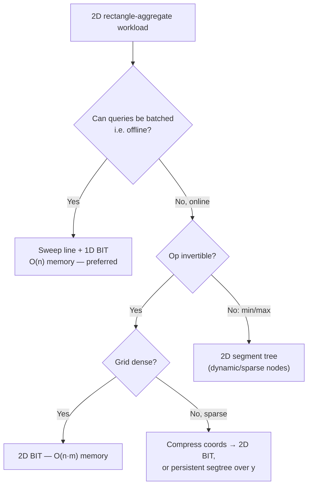
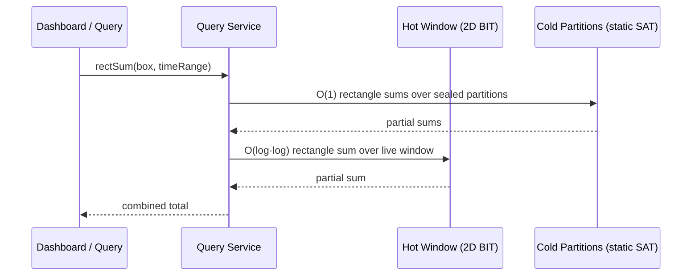
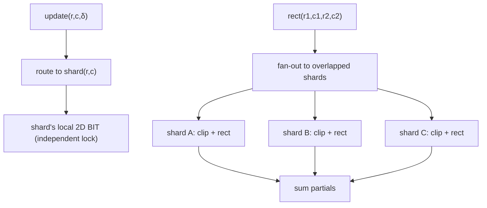
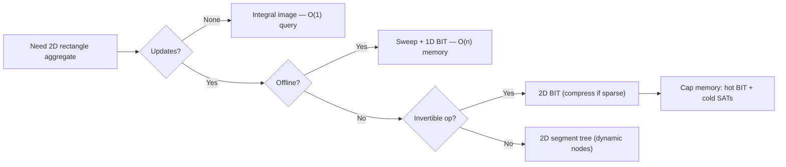

# 2D Range Queries — Senior Level

> **Audience:** Engineers architecting systems that aggregate over 2D space at scale: analytics heatmaps, geospatial point counting, image/grid aggregation, and dynamic 2D dominance. Also competitive programmers who want to know where 2D BITs and 2D segment trees actually earn their keep. Prerequisite: `junior.md`, `middle.md`.

This document covers the **applied context** of 2D range structures: how they behave on large and sparse grids, where the O(n·m) memory wall bites and how to dodge it (offline batching, compression, sweep lines), and which real systems use which variant. The recurring senior lesson is the same one from the 1D BIT, squared: **the structure is cheap, but the grid is expensive.** Most production wins come from *avoiding* a dense 2D grid — via compression, offline sweeps, or replacing a 2D structure with a sequence of 1D ones — rather than from a faster 2D BIT.

---

## Table of Contents

1. [The Memory Wall — Why O(n·m) Dominates Design](#memory-wall)
2. [Capacity Estimation — Back-of-Envelope for 2D Aggregates](#capacity)
3. [Large Grids and Sparse Data — Compression and Offline Batching](#large-sparse)
4. [Analytics Heatmaps and OLAP Cube Slices](#analytics)
5. [Geospatial Point Counting](#geospatial)
6. [Image and Grid Aggregation — Dynamic Integral Images](#image)
7. [Dynamic 2D Dominance](#dominance)
8. [Architecture Patterns — Where the Structure Sits](#architecture)
9. [Concurrency and Sharding a 2D BIT](#concurrency)
10. [A Production-Grade Thread-Safe 2D BIT — Code](#code)
11. [Observability and Failure Modes](#observability)
12. [Production War Stories](#war-stories)
13. [Competitive Programming at Scale](#cp)
14. [Summary](#summary)

---

<a name="memory-wall"></a>
## 1. The Memory Wall — Why O(n·m) Dominates Design

In 1D, a BIT of `n` cells fits comfortably in cache and the whole conversation is about constant factors. In 2D, the dominant constraint flips from *time* to *space*. A dense `n×m` grid of `int64` is `8·n·m` bytes:

| Grid | Cells | Memory (int64) |
|---|---|---|
| 1000 × 1000 | 10⁶ | 8 MB |
| 4000 × 4000 | 1.6·10⁷ | 128 MB |
| 10⁴ × 10⁴ | 10⁸ | 800 MB |
| 10⁵ × 10⁵ | 10¹⁰ | 80 GB (impossible) |
| 10⁹ × 10⁹ (raw geo coords) | 10¹⁸ | hopeless |

The 2D BIT does not reduce this — it stores exactly `(n+1)(m+1)` cells. A dense 2D **segment tree** is ~16× worse. So the senior design question is almost never "BIT vs segment tree on speed"; it is **"how do I avoid materializing a dense 2D grid at all?"**

Three escape hatches, in increasing order of preference when applicable:

1. **Coordinate compression** — shrink each axis to the number of distinct values.
2. **Offline batching with a sweep line** — replace the 2D structure with a *single 1D* BIT swept across one axis (O(n) memory).
3. **Reformulate as 1D** — many "2D" problems are really "process events sorted by one axis, maintain a 1D structure over the other."



---

<a name="capacity"></a>
## 2. Capacity Estimation — Back-of-Envelope for 2D Aggregates

Before choosing a structure, do the napkin math. Three numbers decide everything: the **grid dimensions** after compression, the **update rate**, and the **query rate**.

### 2.1 Memory budget

A dense 2D BIT of int64 costs `8 · (n+1) · (m+1)` bytes. Round to `8·n·m`. So:

```
memory_bytes ≈ 8 · n · m
```

Worked examples for a single-node service with, say, an 8 GB heap budget for the structure:

| Compressed grid | int64 cells | Memory | Fits 8 GB? |
|---|---|---|---|
| 1k × 1k | 10⁶ | 8 MB | trivially |
| 4k × 4k | 1.6·10⁷ | 128 MB | yes |
| 10k × 10k | 10⁸ | 800 MB | yes |
| 30k × 30k | 9·10⁸ | 7.2 GB | barely |
| 100k × 100k | 10¹⁰ | 80 GB | **no — must batch/shard** |

The instant the compressed grid crosses ~30k per side, a dense 2D BIT is off the table for a single node; you batch offline (sweep + 1D BIT, O(n) memory) or shard.

### 2.2 Throughput budget

Each op touches up to `log₂n · log₂m` cells. For a 4k×4k grid that is `12·12 = 144` cell touches, each a cache-line access of a few nanoseconds. Conservatively budget ~10 ns per cell touch (mixed cache levels):

```
per_op_ns ≈ 10 · log₂n · log₂m
4k×4k:  ≈ 10 · 144 = 1.44 µs per op  → ~700k ops/s/core
```

So a single core sustains roughly **half a million to a million** 2D-BIT ops per second on a few-thousand-per-side grid. If your update + query rate exceeds that, you either shard by region (section 9) or move to an offline batch.

### 2.3 The estimation checklist

1. **Compress first**, then compute `n·m` — raw coordinates almost always blow the budget.
2. **If `8·n·m` exceeds your heap fraction**, you cannot use a dense online 2D structure; batch or shard.
3. **If op-rate exceeds `~10⁶ / (log·log)` per core**, plan for sharding or offline.
4. **If queries can be sorted (offline)**, prefer the sweep + 1D BIT regardless — it is O(n) memory and usually faster.

This checklist, run in 60 seconds, prevents the two most common 2D failures: out-of-memory on a dense grid, and an online structure where an offline sweep would have been trivially cheaper.

---

<a name="large-sparse"></a>
## 3. Large Grids and Sparse Data — Compression and Offline Batching

### 3.1 Compression as the first reflex

Any time coordinates come from a large or unbounded space (timestamps, geo coordinates, user IDs, prices), compress before allocating anything 2D. The compressed grid is at most `P × P` where `P` is the number of distinct points — but `P × P` is still often too large for a dense 2D BIT (a million points → 10¹² cells). So compression is usually **necessary but not sufficient**; it pairs with batching.

### 3.2 Offline batching: the sweep that replaces a dimension

The canonical move: a rectangle-count query over a static point set becomes four prefix-count queries; sort everything by the x-axis; sweep x from low to high; maintain a **1D** BIT over the compressed y-axis; answer each prefix query as a `prefix` on the 1D BIT. The second dimension is "consumed" by the time axis of the sweep. Memory drops from O(P²) to O(P).

This is why, in practice, a *full 2D BIT is comparatively rare*. It is the right tool only when you cannot batch — when updates and queries are genuinely interleaved online and you must answer at any moment.

### 3.3 When you truly need an online 2D structure

Online 2D arises in:

- Live dashboards where a user pans/zooms a heatmap and expects instant rectangle aggregates while data streams in.
- Real-time geofencing where points (vehicles, users) move and "how many are inside this box right now?" must answer continuously.
- Interactive image editing where a region is patched and downstream rectangle statistics must stay current.

For these, compress + 2D BIT (invertible op) or compress + dynamic 2D segment tree (min/max) is the answer, and you budget for the memory deliberately.

---

<a name="analytics"></a>
## 4. Analytics Heatmaps and OLAP Cube Slices

### Heatmap aggregation

A product analytics heatmap bins events into a 2D grid — e.g., (screen-x bucket, screen-y bucket) for click maps, or (hour-of-day, day-of-week) for engagement. Each incoming event increments one cell; dashboards query rectangle sums ("clicks in this region", "engagement in this time window"). When the grid is small and fixed (say 200×200 click buckets, or 24×7 time buckets), a dense 2D BIT is ideal: tiny memory, O(log·log) updates and queries, trivially correct.

For larger or unbounded binnings, the same offline lesson applies: precompute a static summed-area table per time partition (no updates within a partition), and only use a 2D BIT for the "hot" current partition still receiving writes.

### OLAP cube 2-dimensional slices

OLAP systems precompute aggregates over cube dimensions. A 2D slice (two dimensions fixed-as-axes, measures summed) with **incremental ingestion** is exactly a 2D BIT workload: new facts increment cells, slice-and-dice queries are rectangle sums. Most OLAP engines use columnar pre-aggregation rather than a literal 2D BIT, but the underlying problem — cumulative aggregate over a 2D region under updates — is the BIT's home turf, and BIT-backed accelerators appear in in-memory analytics layers where the dimension cardinalities are modest.

### The "current window" pattern

A recurring senior pattern: keep historical data as immutable, pre-aggregated summed-area tables (O(1) queries, no updates), and keep only the **current mutable window** in a 2D BIT. Queries spanning history + present sum the immutable tables (O(1) each) plus the live BIT (O(log·log)). This bounds the BIT's memory to the window size regardless of total data volume.

---

<a name="geospatial"></a>
## 5. Geospatial Point Counting

"How many points of interest are inside this bounding box?" is the archetypal 2D dominance query. At global scale the raw coordinate space is enormous (latitude/longitude to micro-degree precision ≈ 10⁸ × 10⁸), so a dense grid is impossible.

Production approaches, roughly in order of how 2D-BIT-like they are:

- **Grid bucketing (geohash / quadkey) + per-bucket counts.** Bin points into a coarse fixed grid; a 2D BIT over the *bucket* grid answers approximate rectangle counts. Exact within bucket granularity; cheap memory.
- **Offline sweep for batch analytics.** "Count POIs in each of these 10⁶ query boxes" over a static dataset → compress coordinates, sweep x, 1D BIT over y. O((n+q) log n), O(n) memory. This is how large batch geo-analytics jobs run.
- **R-trees / k-d trees for general online spatial queries.** When queries are arbitrary shapes or nearest-neighbor (not just axis-aligned counts), spatial trees dominate. The 2D BIT is specifically the *axis-aligned-rectangle-count* specialist.

The senior judgment: a 2D BIT (over a compressed or bucketed grid) is the right tool when queries are **axis-aligned rectangle counts/sums** and you can bound the grid. For arbitrary geometry, use an R-tree; for batch counting, use a sweep.

---

<a name="image"></a>
## 6. Image and Grid Aggregation — Dynamic Integral Images

The static **integral image** (summed-area table) is a pillar of classic computer vision: O(1) rectangle-mean for Haar features in Viola–Jones face detection, fast box blurs, adaptive thresholding. It assumes the image is fixed.

A 2D BIT is the **dynamic** integral image: when only a few pixels change, patch them in O(log W · log H) each and keep answering rectangle queries logarithmically — instead of rebuilding the whole O(W·H) table.

When does this actually pay off?

- **Sparse frame-to-frame change.** Lossless screen recording, where most of the screen is static between frames; only changed regions update. The 2D BIT touches O(changed · log·log) rather than O(W·H).
- **Region-of-interest editing.** Interactive tools where a brush stroke modifies a small region and downstream box statistics (local mean/variance) must stay live.

When it does **not** pay off: full-frame video where the entire image changes every frame. Then a wholesale O(W·H) integral-image rebuild is faster than O(W·H · log·log) BIT updates. The senior call: 2D BIT only when updates are *truly sparse* relative to query volume.

For **variance / second-moment** features, keep two 2D BITs — one over pixel values, one over squared values — and combine: `Var(region) = E[X²] − E[X]²` from two rectangle sums. This generalizes to any additive statistic.

---

<a name="dominance"></a>
## 7. Dynamic 2D Dominance

A point `p = (px, py)` **dominates** `q = (qx, qy)` if `px ≥ qx` and `py ≥ qy`. **Dominance counting** ("how many inserted points dominate this query point?", or its rectangle generalization) is the abstract core of much 2D analytics: Pareto-front sizes, "how many products are both cheaper and higher-rated", "how many events are both earlier and lower-priority".

- **Static dominance counting** → offline sweep + 1D BIT, as in `middle.md`. O((n+q) log n), O(n) memory. The default.
- **Dynamic dominance (points inserted/deleted over time, queries interleaved)** → this is where an online 2D structure is unavoidable. Options:
  - **2D BIT over compressed coordinates** if you know all coordinates in advance (offline compression of the coordinate set even though operations are online — common: you can pre-scan the operation list to gather coordinates).
  - **Persistent segment tree over y, versioned by x** for "k-th dominating" or count queries with a value dimension.
  - **BIT of balanced BSTs / sorted lists** (a BIT over x where each cell holds an order-statistics structure over y) for fully dynamic insert/delete with O(log² n) per op.

### The "offline the coordinates, online the operations" trick

A key senior insight: even when *operations* are online (interleaved updates and queries), you can often **pre-scan the entire operation stream** to collect every coordinate that will ever appear, compress them up front, and then run a 2D BIT of fixed compressed size. This converts an apparently-needs-dynamic-grid problem into a fixed-grid one. It only fails when coordinates are genuinely unknown until runtime (e.g., a true streaming system with no look-ahead).

### A concrete dominance scenario

Consider a "deals" service answering "how many listings are both cheaper than `$P` and rated below `R`?" as listings are added and removed. Price and rating are the two axes; the query is a dominance count. Because the set of distinct prices and ratings is known (a catalog), you compress both axes once. A 2D BIT over the compressed `price × rating` grid answers each query in `O(log P · log R)` and each add/remove in the same. If instead the catalog were unbounded and streaming, you would fall back to a periodically-rebuilt static structure plus a small live overlay — the hot/cold pattern again. The dominance abstraction unifies a surprising range of "both-conditions-satisfied counting" product features under the same 2D structure.

---

<a name="architecture"></a>
## 8. Architecture Patterns — Where the Structure Sits



The dominant production pattern for time-partitioned 2D aggregates:

- **Cold partitions** (sealed, immutable) are stored as static **summed-area tables** — O(1) rectangle queries, no updates, cheap to mmap.
- The **hot window** (currently ingesting) is a mutable **2D BIT** — O(log·log) updates and queries, bounded memory.
- A query fans out to all relevant cold partitions (O(1) each) plus the hot BIT (O(log·log)) and sums the partials.
- On window roll-over, the hot BIT is **frozen into a static SAT** and a fresh empty BIT starts. This caps mutable memory at one window.

This mirrors LSM-tree philosophy (immutable sorted runs + a mutable memtable) applied to 2D aggregates.

---

<a name="concurrency"></a>
## 9. Concurrency and Sharding a 2D BIT

Production 2D aggregators usually face concurrent writers (ingestion threads) and readers (dashboard queries). There are three standard concurrency strategies, in increasing order of scalability.

### 9.1 Single global lock

Wrap every `update` and `rect` in a `RWMutex`. Reads share, writes are exclusive. Simple and correct, but the write lock serializes all ingestion, capping throughput at one core's worth of updates. Acceptable when query traffic dominates and updates are rare (read-heavy dashboards).

### 9.2 Per-cell atomic updates

Because a 2D BIT update is a sequence of `T[i][j] += delta`, you can make each cell an atomic and drop the global lock — exactly like the 1D concurrent BIT (`09-fenwick-tree/professional.md`). Concurrent updates do not corrupt cells; each `+=` is a hardware `LOCK XADD`. The caveats square in 2D:

- **Linearizability is weak.** A concurrent `rect` reads `log·log` cells and may interleave with updates, observing a value between the snapshot at call-start and call-end. Fine for analytics; not for exact instantaneous reads.
- **Hot corner cell.** `T[n][m]` (and other high-lowbit cells) is touched by a large fraction of updates, becoming a contention hotspot serialized to L3 cache coherence. In 2D there are *more* hot cells (the high-lowbit row × high-lowbit column products), so contention is worse than 1D.
- **False sharing** within a row when adjacent `T[i][j]` cells share a cache line.

### 9.3 Region sharding (the scalable answer)

Partition the grid into a `P × Q` array of **independent sub-BITs**, one per region. An update routes to the single shard owning its cell — no cross-shard coordination, so writes scale linearly with shards. A rectangle query that spans shards fans out: query the (clipped) sub-rectangle in each overlapped shard and sum the partials.



Trade-off: a query spanning all `P·Q` shards costs `P·Q · log·log`, so keep the shard grid coarse enough that typical queries touch few shards. The 1D war story repeats in 2D: **don't over-shard** — too many tiny shards scatter the working set and make span-queries fan out widely. Size shards so the common query touches 1–4 of them.

### 9.4 Append-only delta log + periodic rebuild

The highest-write-throughput pattern abandons in-place updates entirely: append `(r, c, δ)` events to a log, and periodically (or on query) fold the log into an immutable summed-area table. Reads consult the last sealed SAT (O(1)) plus a scan of the unfolded tail. This is the hot-window / cold-SAT pattern (section 8) taken to its logical end, and it sidesteps update contention completely.

---

<a name="code"></a>
## 10. A Production-Grade Thread-Safe 2D BIT — Code

A read-write-locked 2D BIT (strategy 9.1) in all three languages. For higher write throughput, swap in per-cell atomics (9.2) or region sharding (9.3).

### Go (RWMutex)

```go
package bit2d

import "sync"

type SafeFenwick2D struct {
    mu   sync.RWMutex
    n, m int
    t    [][]int64
}

func NewSafe(n, m int) *SafeFenwick2D {
    t := make([][]int64, n+1)
    for i := range t {
        t[i] = make([]int64, m+1)
    }
    return &SafeFenwick2D{n: n, m: m, t: t}
}

func (f *SafeFenwick2D) Update(r, c int, delta int64) {
    f.mu.Lock()
    defer f.mu.Unlock()
    for i := r; i <= f.n; i += i & -i {
        for j := c; j <= f.m; j += j & -j {
            f.t[i][j] += delta
        }
    }
}

func (f *SafeFenwick2D) prefix(r, c int) int64 {
    var s int64
    for i := r; i > 0; i -= i & -i {
        for j := c; j > 0; j -= j & -j {
            s += f.t[i][j]
        }
    }
    return s
}

func (f *SafeFenwick2D) Rect(r1, c1, r2, c2 int) int64 {
    f.mu.RLock()
    defer f.mu.RUnlock()
    return f.prefix(r2, c2) - f.prefix(r1-1, c2) - f.prefix(r2, c1-1) + f.prefix(r1-1, c1-1)
}
```

### Java (ReentrantReadWriteLock)

```java
import java.util.concurrent.locks.ReentrantReadWriteLock;

public final class SafeFenwick2D {
    private final ReentrantReadWriteLock lock = new ReentrantReadWriteLock();
    private final int n, m;
    private final long[][] t;

    public SafeFenwick2D(int n, int m) {
        this.n = n; this.m = m; this.t = new long[n + 1][m + 1];
    }

    public void update(int r, int c, long delta) {
        lock.writeLock().lock();
        try {
            for (int i = r; i <= n; i += i & -i)
                for (int j = c; j <= m; j += j & -j)
                    t[i][j] += delta;
        } finally { lock.writeLock().unlock(); }
    }

    private long prefix(int r, int c) {
        long s = 0;
        for (int i = r; i > 0; i -= i & -i)
            for (int j = c; j > 0; j -= j & -j)
                s += t[i][j];
        return s;
    }

    public long rect(int r1, int c1, int r2, int c2) {
        lock.readLock().lock();
        try {
            return prefix(r2, c2) - prefix(r1 - 1, c2)
                 - prefix(r2, c1 - 1) + prefix(r1 - 1, c1 - 1);
        } finally { lock.readLock().unlock(); }
    }
}
```

### Python (threading.RLock)

```python
import threading

class SafeFenwick2D:
    def __init__(self, n, m):
        self._lock = threading.RLock()
        self.n, self.m = n, m
        self.t = [[0] * (m + 1) for _ in range(n + 1)]

    def update(self, r, c, delta):
        with self._lock:
            i = r
            while i <= self.n:
                j = c
                while j <= self.m:
                    self.t[i][j] += delta
                    j += j & -j
                i += i & -i

    def _prefix(self, r, c):
        s, i = 0, r
        while i > 0:
            j = c
            while j > 0:
                s += self.t[i][j]
                j -= j & -j
            i -= i & -i
        return s

    def rect(self, r1, c1, r2, c2):
        with self._lock:
            return (self._prefix(r2, c2) - self._prefix(r1 - 1, c2)
                    - self._prefix(r2, c1 - 1) + self._prefix(r1 - 1, c1 - 1))
```

Note: in CPython the GIL already serializes the byte-level `+=`, but the explicit `RLock` is still needed to make the *multi-cell* update and the *four-prefix* rect appear atomic relative to each other — without it, a query could observe a half-applied update.

---

<a name="observability"></a>
## 11. Observability and Failure Modes

| Metric | Why it matters | Alert threshold (example) |
|---|---|---|
| `bit_2d_memory_bytes` | O(n·m) can blow up silently as the grid grows | > 70% of budget |
| `compression_ratio` | Sparse data should compress well; low ratio means wasted grid | distinct/raw < expected |
| `query_latency_p99` | Should be flat at O(log·log); spikes mean cache misses or a dense grid | > 5 ms |
| `hot_window_age` | Roll-over should cap mutable memory | window not rolling over |
| `overflow_guard` | 64-bit cells can still overflow on huge grids | sum approaching 2⁶³ |

### Failure modes

- **Grid blow-up.** A dimension grows unbounded (e.g., a new distinct coordinate per event) and the dense grid exhausts memory. Fix: compress, or cap the grid and bucket.
- **Forgot to compress.** Raw coordinates allocate a hopeless grid. Fix: compression pass before allocation.
- **64-bit overflow.** A large grid (10⁸ cells) with large values accumulates past 2⁶³ in the corner cell. Fix: bound inputs, or use 128-bit accumulators for the worst case.
- **Dense 2D segment tree OOM.** Someone used a dense 2D segment tree when a 2D BIT (16× lighter) or a sweep (O(n)) would do. Fix: pick the right structure per the decision tree.
- **Cache thrashing on the inner walk.** A column-major store makes the inner column walk stride badly. Fix: row-major storage, inner loop over the contiguous axis.

---

<a name="war-stories"></a>
## 12. Production War Stories

### 12.1 The heatmap that quietly grew a third axis

A click-heatmap service binned by (x-bucket, y-bucket) into a fixed 256×256 2D BIT — tiny, fast. Then a product change added per-device-type heatmaps, and someone "just added another dimension" by allocating a 2D BIT per device type. Device types proliferated (hundreds), and the aggregate memory crept up until the service OOM'd during a traffic spike. The fix was not a bigger machine — it was recognizing that most device-type grids were nearly empty, and switching to compression + a shared sparse structure. Lesson: **a 2D BIT per category silently multiplies the O(n·m) cost; sparse categories must share or compress.**

### 12.2 The geo-count job that didn't need a 2D BIT at all

A batch job counted POIs inside millions of query bounding boxes over a static national dataset. The first implementation built a dense 2D BIT over a compressed grid — the compressed grid was still 10⁵ × 10⁵, which is 10¹⁰ cells, and the job died allocating it. The rewrite used the textbook **offline sweep + 1D BIT**: sort points by longitude, sweep, maintain a 1D BIT over compressed latitude, answer each box as four prefix counts. Memory dropped from "impossible" to 800 KB, and the job finished in minutes. Lesson: **static rectangle counting almost never needs a 2D structure — sweep one axis with a 1D BIT.**

### 12.3 The integral image that lost to a rebuild

A video-analytics pipeline used a 2D BIT as a "dynamic integral image" to keep per-frame box statistics current. It was slower than the previous full-rebuild approach. Profiling revealed the obvious: nearly every pixel changed every frame, so the BIT did O(W·H · log W · log H) work where a wholesale rebuild did O(W·H). They reverted to rebuilding the static summed-area table per frame, and reserved the 2D BIT for a separate screen-capture feature where frame-to-frame change was genuinely sparse. Lesson: **the dynamic integral image only wins when updates are sparse relative to the grid.**

### 12.4 The min-query that a BIT couldn't answer

A team built a 2D BIT for a "spatial aggregate" service, then got a requirement for rectangle **minimum** (lowest sensor reading in a region). They tried to bolt min onto the BIT and got wrong answers, because min is not invertible — the inclusion-exclusion subtraction is meaningless. They migrated the min queries to a dynamic 2D segment tree (sparse inner nodes), keeping the BIT for the additive metrics. Lesson: **know the invertibility boundary before you commit; min/max forces a segment tree.**

### 12.5 The 32-bit corner cell that wrapped after a quarter

A telemetry aggregator binned counts into a 1024×1024 2D BIT with `int32` cells to "save memory." The corner cell `T[1024][1024]` accumulates the grand total of every increment ever applied. After a quarter of ingestion the total crossed `2³¹` and wrapped to negative; the dashboard's "total events" tile flipped to a large negative number, and every full-grid rectangle query was corrupted while sub-rectangles (touching lower-lowbit cells) still looked fine — which made the bug maddening to localize. The fix was a one-line change to `int64`, doubling the 4 MB structure to 8 MB. Lesson: **the 2D corner cell sums the entire grid; default to 64-bit cells, and remember that overflow corrupts large rectangles first while small ones stay deceptively correct.**

### 12.6 The dashboard that didn't need a lock per query

An early version of a heatmap service took the write lock on *every* read because the author reused one `Lock()` path for both. Under a read-heavy dashboard workload, queries serialized behind each other and p99 latency ballooned. Switching reads to a shared `RLock` (strategy 9.1) let concurrent queries proceed in parallel and dropped p99 by an order of magnitude, with no correctness change. Lesson: **reads share, writes are exclusive — use a read-write lock, not a single mutex, for read-heavy 2D aggregators.**

---

<a name="cp"></a>
## 13. Competitive Programming at Scale

In competitive programming, 2D range problems split cleanly:

- **"Sum/count in a rectangle with point updates"** → 2D BIT (LeetCode 308 style). Often the coordinates are already small (a literal grid), so no compression needed.
- **"Count points in a rectangle, static"** → offline sweep + 1D BIT, or merge-sort tree if online. This dominates the `data structures` + `offline` tag space.
- **"Rectangle add, rectangle sum"** → four 2D BITs (the 4-BIT trick).
- **"Rectangle min/max"** → 2D segment tree, or sqrt-decomposition if the constraints are forgiving.
- **"K-th smallest in a rectangle / on a subarray"** → persistent segment tree (merge-sort tree variant), the standard advanced answer.

A reliable contest heuristic: **if you can sort the queries offline, you almost certainly want a sweep + 1D BIT, not a 2D structure.** Reach for a true 2D BIT only when the problem is online, and for a 2D segment tree only when the operation is non-invertible. Many contestants reflexively build a 2D segment tree and TLE/MLE on what was meant to be a one-pass sweep.

### 13.1 A worked contest archetype — "for each query rectangle, count points"

The single most common 2D contest shape: `n` static points, `q` axis-aligned rectangle-count queries, `n, q ≤ 2·10⁵`, coordinates up to `10⁹`. The reflexive (wrong) instinct is a 2D BIT over a `10⁹ × 10⁹` grid — impossible. The compressed grid could still be `2·10⁵ × 2·10⁵ = 4·10¹⁰` cells — also impossible. The correct solution is the offline sweep:

```
1. Compress y-coordinates → ranks 1..Y (Y ≤ n).
2. Split each rectangle into 4 prefix-count events (inclusion-exclusion on x and y),
   each tagged (x_bound, query_id, y_bound, sign).
3. Sort points by x; sort events by x_bound.
4. Sweep x: as points pass the current x_bound, insert their y-rank into ONE 1D BIT.
5. Answer each event as sign · bit.prefix(rank(y_bound)); accumulate into query_id.
```

Time `O((n + q) log n)`, memory `O(n)` — a single 1D BIT. This pattern, internalized, is worth dozens of contest problems. The senior insight is that the "2D-ness" is an illusion: the x-axis becomes the sweep's time dimension, leaving an ordinary 1D BIT over y. Only when points are *inserted and deleted between queries* (truly online) does the problem resist the sweep and force a real 2D / persistent structure.

### 13.2 When the literal grid is small

Conversely, many problems hand you an actual `n × m` grid with `n·m ≤ 10⁶` and ask for point updates + rectangle sums (LC 308). Here there is nothing to compress; allocate the dense 2D BIT directly. The lesson is symmetric to the previous one: **read the constraints to decide whether you face a dense small grid (use 2D BIT directly) or a sparse huge coordinate space (compress + sweep).** Misreading this is the most common 2D contest mistake.

---

<a name="summary"></a>
## 14. Summary

- In 2D, **memory (O(n·m)), not time, dominates design.** The 2D BIT does not shrink the grid; a dense 2D segment tree is ~16× worse.
- The senior reflex is to **avoid materializing a dense grid**: coordinate-compress, batch offline, and replace a dimension with a **sweep line + 1D BIT** (O(n) memory) whenever queries can be sorted.
- Use a true **online 2D BIT** only when updates and queries genuinely interleave and the grid is bounded/compressed (live heatmaps, real-time geofencing, sparse-change integral images).
- The **hot-window-BIT + cold-static-SAT** pattern (LSM-style) caps mutable memory while keeping queries fast across history and present.
- **Geospatial counting**: bucket/compress + 2D BIT for axis-aligned rectangle counts; R-trees for arbitrary geometry; sweep for batch.
- **Dynamic integral images** pay off only with sparse frame-to-frame change; full-frame video prefers a wholesale rebuild.
- **Dynamic 2D dominance** is the abstract core; offline it with a sweep, or "offline the coordinates, online the operations" to keep a fixed compressed grid.
- The **invertibility boundary is hard**: min/max/gcd force a 2D segment tree, full stop.

### Architect's quick-reference



Three numbers and three questions resolve almost every 2D design: (1) compressed `n·m` versus your memory budget; (2) op-rate versus `~10⁶/(log·log)` per core; (3) can queries be batched? Answer those before writing a line of code, and you will avoid the two canonical failures — OOM on a dense grid, and an online structure where a sweep was trivially cheaper.

Continue with `professional.md` for the O(log²) complexity proofs, the O(n·m) space lower bound, the persistent and merging alternatives, and a rigorous treatment of dynamic dominance.

**Next step:** [`professional.md`](./professional.md) — complexity proofs, space lower bounds, persistent vs merging segment trees, and formal dynamic 2D dominance.
