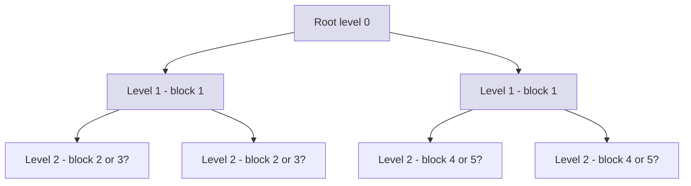

# Binary Heap — Mathematical Foundations and Complexity Theory

## Table of Contents
1. Formal Definition
2. Correctness Proof — sift-up / sift-down Loop Invariants
3. Tight O(n) Build-Heap Proof
4. Amortized Analysis of Heap Sort
5. Lower Bounds for Priority Queues
6. Cache-Oblivious Heap Analysis
7. Randomized and Average-Case Analysis
8. Implicit vs Pointer Heaps — Space-Time Trade-offs
9. Comparison with Alternatives (asymptotics + constants)
10. Open Problems and Research Directions
11. Summary

---

## 1. Formal Definition

A **binary heap** is a complete binary tree embedded in an array `A[1..n]` (1-indexed for convenience) where the index arithmetic encodes the tree structure and a **shape invariant** plus an **order invariant** must hold simultaneously.

**Definition 1.1 (Implicit embedding).** For `i ∈ {1, …, n}`:
- `parent(i) = ⌊i/2⌋` for `i > 1`
- `left(i) = 2i`
- `right(i) = 2i + 1`

**Definition 1.2 (Shape invariant — completeness).** The set of occupied indices is exactly `{1, 2, …, n}`. Equivalently, levels `0, 1, …, ⌊log₂ n⌋ − 1` are completely filled, and the bottom level is filled left-to-right.

**Definition 1.3 (Min-heap order predicate).**
```text
HeapOrder(A, n) ≡ ∀ i ∈ {2, …, n}. A[parent(i)] ≤ A[i]
```
Equivalently, for all `i ≤ ⌊n/2⌋`: `A[i] ≤ A[2i]` and (if `2i+1 ≤ n`) `A[i] ≤ A[2i+1]`.

A **valid binary heap** is a pair `(A, n)` satisfying both the shape invariant and `HeapOrder(A, n)`. Max-heaps are obtained by reversing the inequality. We use min-heaps throughout unless noted.

**Proposition 1.4 (Height bound).** The height `h(n) = ⌊log₂ n⌋`. Hence any root-to-leaf path has length at most `⌊log₂ n⌋`. This is the *only* structural fact used in every subsequent complexity proof.

**Proposition 1.5 (Level cardinality).** Level `ℓ` (with the root at level 0) has at most `2^ℓ` nodes, and a complete heap on `n` nodes has exactly `⌈n / 2^(ℓ+1)⌉` nodes at height `ℓ` (height measured from the leaves up). This identity is the algebraic core of the O(n) build proof in §3.

---

## 2. Correctness Proof — sift-up / sift-down Loop Invariants

Following the Hoare-style approach in CLRS Ch.6 (Cormen, Leiserson, Rivest, Stein), we discharge correctness via loop invariants. We focus on `sift-down` (called `Max-Heapify` in CLRS for max-heaps); `sift-up` is symmetric.

### 2.1 Pseudocode

```text
SIFT-DOWN(A, i, n):
  while 2*i <= n:
    j := 2*i                         # left child
    if j + 1 <= n and A[j+1] < A[j]:
      j := j + 1                     # right child is smaller
    if A[i] <= A[j]:
      return                         # heap order restored
    swap A[i], A[j]
    i := j
```

### 2.2 Precondition

`P_in(i)`: the subtrees rooted at `left(i)` and `right(i)` satisfy `HeapOrder` locally, but `A[i]` may violate order against its children.

### 2.3 Loop Invariant

`Inv(i)`: at the top of each iteration, every node in the subtree rooted at `i` *except possibly `A[i] vs. A[left(i)], A[right(i)]`* satisfies `HeapOrder`. Moreover, the only potential violation is along the path from the original starting index down to the current `i`.

### 2.4 Proof

**Base case (entry).** By `P_in(i₀)`, the invariant holds at the first iteration.

**Inductive step.** Suppose `Inv(i)` holds. Let `j` be the smaller child.
- If `A[i] ≤ A[j]`, then the root–child pair is ordered. By `Inv(i)` the rest of the subtree was already a heap, so `HeapOrder` holds throughout the subtree at `i`. The algorithm returns.
- Else `A[j] < A[i]`. After swapping, `A[i]` (which now holds the old `A[j]`) is `≤` both children of `i` (it was `≤` its sibling by choice of `j`; it is `≤` itself trivially). The new violation can only be at index `j`, between the newly placed key and `j`'s subtrees — and those subtrees were heaps before the swap (they were not touched). Hence `Inv(j)` holds and we set `i ← j`.

**Termination.** The variant `n − i` strictly decreases each iteration (because `j ≥ 2i > i`). Since `n − i ≥ 0`, the loop terminates after at most `⌊log₂(n/i)⌋ + 1 ≤ ⌊log₂ n⌋ + 1` iterations.

**Postcondition.** When the loop exits — either by return or by `2i > n` (leaf reached) — `Inv(i)` collapses to `HeapOrder` on the whole subtree.

### 2.5 sift-up

`SIFT-UP(A, i)` repeatedly swaps `A[i]` with `A[parent(i)]` while `A[parent(i)] > A[i]`. The dual invariant: at each iteration the only potential violation is between `i` and `parent(i)`. Termination follows from `i` strictly decreasing. Both procedures perform at most `⌊log₂ n⌋` swaps.

---

## 3. Tight O(n) Build-Heap Proof

Floyd's 1964 bottom-up construction (Floyd, *Algorithm 245: Treesort 3*, CACM 7(12):701) heapifies an arbitrary array in linear time.

```text
BUILD-HEAP(A, n):
  for i := ⌊n/2⌋ downto 1:
    SIFT-DOWN(A, i, n)
```

### 3.1 The Naïve Bound

Each `SIFT-DOWN` call costs `O(log n)`, and we call it `⌊n/2⌋` times, giving `O(n log n)`. We sharpen this to `O(n)`.

### 3.2 Tight Bound

**Theorem 3.1 (Floyd 1964).** `BUILD-HEAP` performs `O(n)` comparisons and swaps.

**Proof.** Let `h(v)` denote the height of node `v` (leaves have height 0, root has height `⌊log₂ n⌋`). `SIFT-DOWN(A, v)` performs at most `c · h(v)` comparisons for some constant `c ≤ 2` (two comparisons per level: child-vs-child, then parent-vs-child). The total work is therefore bounded by

```text
T(n) ≤ c · Σ_{v ∈ heap} h(v)
     = c · Σ_{ℓ=0}^{⌊log n⌋} (# nodes at height ℓ) · ℓ
     ≤ c · Σ_{ℓ=0}^{⌊log n⌋} ⌈n / 2^(ℓ+1)⌉ · ℓ.
```

Dropping the ceiling (it absorbs into the constant) and letting `H = ⌊log₂ n⌋`:

```text
T(n) ≤ c · (n/2) · Σ_{ℓ=0}^{H} ℓ / 2^ℓ.
```

We claim `Σ_{ℓ=0}^{∞} ℓ / 2^ℓ = 2`.

### 3.3 The Closed Form `Σ ℓ / 2^ℓ = 2`

Start from the geometric series `Σ_{ℓ=0}^{∞} x^ℓ = 1/(1−x)` for `|x| < 1`. Differentiate both sides:

```text
Σ_{ℓ=1}^{∞} ℓ · x^(ℓ−1) = 1 / (1 − x)^2.
```

Multiply by `x`:

```text
Σ_{ℓ=1}^{∞} ℓ · x^ℓ = x / (1 − x)^2.
```

Substitute `x = 1/2`:

```text
Σ_{ℓ=1}^{∞} ℓ / 2^ℓ = (1/2) / (1/2)^2 = 2.
```

(The `ℓ = 0` term contributes 0, so the sum from 0 is also 2.)

### 3.4 Conclusion

```text
T(n) ≤ c · (n/2) · 2 = c · n = O(n).  ∎
```

The constant in front is roughly 1.88 for comparisons (see §7); empirically Floyd's heapify outperforms a sequence of `n` sift-ups by a factor of `~log n` even for moderate `n`.

---

## 4. Amortized Analysis of Heap Sort

Heap sort (Williams 1964, *Algorithm 232: Heapsort*, CACM 7(6):347) sorts in place: build a max-heap in `O(n)`, then repeatedly swap `A[1] ↔ A[n]`, shrink the heap, and `SIFT-DOWN` from the root.

```text
HEAPSORT(A, n):
  BUILD-MAX-HEAP(A, n)
  for i := n downto 2:
    swap A[1], A[i]
    SIFT-DOWN(A, 1, i - 1)
```

### 4.1 Worst-Case Comparison Bound

The `i`-th extraction sift-down operates on a heap of size `i − 1`, so it performs at most `2 ⌊log₂(i − 1)⌋` comparisons. Total:

```text
C(n) ≤ 2 Σ_{i=2}^{n} ⌊log₂(i − 1)⌋
     ≤ 2 n log₂ n − Θ(n)
     = 2 n log n − O(n).
```

Adding the `O(n)` build phase preserves the leading term.

### 4.2 Carlsson's Bottom-Up Heap Sort

Carlsson (1987, *A variant of heapsort with almost optimal number of comparisons*, Information Processing Letters 24(4):247–250) observed that the sift-down phase of classical heap sort wastes comparisons: a key descending from the root is *almost always* a small element (it just came from the bottom of the heap), so it will sink nearly to a leaf. Instead of doing two comparisons per level (child-vs-child and key-vs-child), Carlsson:

1. Traces a *special path* from the root downward, choosing the larger child at each step **without** comparing it to the descending key. This costs `~log n` comparisons.
2. Then performs binary search *up* this path to find the insertion point. This costs `log log n + O(1)` comparisons.

Total per extraction: `log n + log log n + O(1)`. Summed:

```text
C_Carlsson(n) = n log n + n log log n + O(n)
              ≈ n log n + n log log n,
```

versus `2 n log n` for the classical version. Since the information-theoretic lower bound is `log₂(n!) = n log n − n/ln 2 + O(log n) ≈ n log n − 1.4427 n`, Carlsson's variant is within an additive `n log log n` of optimal.

### 4.3 Amortized View

Assign each element a potential `Φ(x) = depth(x)` after the build phase. The build phase yields total potential `Σ depth(x) = n − ν(n)` (where `ν(n)` is the popcount of `n`); this is `O(n)`. Each extraction releases at most `log n` units of potential (the swapped key descends, doing comparisons), so amortized cost per extraction is `O(log n)`. This recovers the `O(n log n)` bound without recourse to summation tricks, and it makes the "build is free" intuition rigorous.

---

## 5. Lower Bounds for Priority Queues

### 5.1 Comparison-Decision-Tree Model

In the comparison model, an algorithm is a binary decision tree whose internal nodes are comparisons `A[i] : A[j]` and whose leaves are output permutations (or, for priority queues, sequences of `extract-min` outputs).

**Theorem 5.1.** Any comparison-based priority queue supporting `insert` and `extract-min` requires `Ω(log n)` comparisons per `extract-min` in the worst case, where `n` is the current size.

**Proof sketch.** A priority queue can sort: insert `n` keys, then extract them all. The output is a permutation of the input. The decision tree has at least `n!` leaves (one per input permutation), so its height is at least `⌈log₂(n!)⌉ = n log n − Θ(n)`. If each insert costs `I(n)` and each extract costs `E(n)`, total comparisons are at most `n · (I(n) + E(n)) ≥ n log n − Θ(n)`. With `I(n) = O(1)` (achievable by inserting at the back of a binary heap *amortized*), we obtain `E(n) = Ω(log n)`. Conversely, with `I(n) = O(log n)` we still need `E(n) = Ω(log n)` if we want both operations balanced. ∎

### 5.2 Sharper Bounds

- **Brodal (1996)** proved that meldable priority queues with `O(1)` worst-case `insert`, `meld`, and `find-min` and `O(log n)` `extract-min` are optimal in the pointer machine model.
- **Fredman (1999)** showed that `O(1)` amortized `decrease-key` is impossible in the comparison model with `O(log n)` `extract-min` if a certain restricted access pattern is enforced — implying Fibonacci heaps' bounds are tight in their model class.

### 5.3 Algebraic-Decision-Tree Refinement

In the algebraic decision tree model (allowing `O(1)`-degree polynomial tests), the same `Ω(log n)` lower bound holds for `extract-min`, since the sorting reduction carries through. Beyond comparison models — e.g., the word RAM with bit manipulation — `O(log log n)`-time priority queues exist (van Emde Boas, Y-fast tries, fusion trees). These violate the comparison lower bound by exploiting key encoding.

---

## 6. Cache-Oblivious Heap Analysis

We work in the standard external memory model: block size `B`, internal memory size `M`, with transfers between memory and disk counted as I/Os.

### 6.1 Plain Binary Heap

A binary heap stored in an array exhibits poor cache behavior. The root and its two children fit in one block, but going from level `ℓ` to level `ℓ + 1` *typically* crosses a block boundary as soon as `2^ℓ > B`. Hence:

**Proposition 6.1.** A binary heap on `n` keys incurs `Θ(log₂ n − log₂ B) = Θ(log₂(n/B))` cache misses per `extract-min` and per `insert`.

For typical `B = 64`-byte cache lines holding 8 `int64` keys (so `log₂ B = 3`), the savings are small. For `n = 10⁹` this is ~27 cache misses per op — practically each level traversal is a miss past depth 3.

### 6.2 B-Heap (van Emde Boas Layout)

Kamp (2010, *You're doing it wrong*, ACM Queue 8(6)) popularized **B-heaps** for the kernel's varnish cache: lay out the binary tree in memory using a recursive van Emde Boas layout so each contiguous block of `B` keys forms a subtree of height `log₂ B`. The cost per operation drops to `Θ(log_B n) = Θ(log n / log B)`.

For `B = 8` this is a 3× improvement; for `B = 512` (a 4KB page of 8-byte keys), 9×.

### 6.3 Funnel Heap and Cache-Oblivious Bounds

Brodal & Fagerberg (2002, *Funnel heap — a cache oblivious priority queue*, ISAAC 2002, LNCS 2518) introduced the **funnel heap**, a cache-oblivious priority queue with amortized I/O complexity:

```text
O((1 / B) · log_{M/B}(n / B))   per operation.
```

This matches the cache-oblivious sorting bound `O((n/B) log_{M/B}(n/B))` when used to sort, hitting the optimal external-sort lower bound proved by Aggarwal & Vitter (1988). For `n = 10¹², B = 4096, M = 10⁹`: `log_{M/B}(n/B) ≈ log_{2.4×10⁵}(2.4×10⁸) ≈ 1.6`, so amortized cost is sub-I/O per op — orders of magnitude better than binary heaps.

### 6.4 Diagram



Standard layout: levels are contiguous but blocks split levels. vEB layout: blocks contain *subtrees*, so a root-to-leaf path crosses `log_B n` blocks instead of `log₂ n`.

---

## 7. Randomized and Average-Case Analysis

### 7.1 Expected Comparisons of Floyd's Heapify

**Theorem 7.1 (Doberkat 1984).** On a uniformly random permutation of `n` distinct keys, Floyd's `BUILD-HEAP` performs

```text
E[swaps] = 1.8814 n − 2.0 log₂ n + O(1).
```

The leading constant `≈ 1.88` is strictly less than the worst-case bound of 2. The proof analyzes the expected sift-down depth at a uniformly random subtree using a recurrence over heap heights.

### 7.2 Heap Sort on Random Inputs

**Theorem 7.2 (Schaffer & Sedgewick 1993).** On a uniformly random input, classical heap sort makes `n log₂ n + Θ(n)` comparisons in expectation; the variance is `O(n)`. So the average and worst case agree to leading order — heap sort lacks the speedup that quicksort enjoys.

This is one reason quicksort is preferred when worst-case behavior is unimportant: quicksort averages `2 n ln n ≈ 1.39 n log₂ n` versus heap sort's `2 n log₂ n` worst case (or Carlsson's `n log n + n log log n`).

### 7.3 Smoothed Analysis

Manthey & Reischuk (2005) showed heap sort has smoothed complexity `Θ(n log n)` (no improvement from perturbation), unlike quicksort which improves substantially.

---

## 8. Implicit vs Pointer Heaps — Space-Time Trade-offs

### 8.1 Implicit (Array) Heaps

- **Space:** `n` keys, no pointers — `1×` memory.
- **Operations:** `insert`, `extract-min` in `O(log n)`.
- **`decrease-key`:** requires external index `pos[key] → array_index` (a hash map or auxiliary array). Cost `O(log n)` once the index is located.
- **`meld`:** `Θ(n + m)` — must rebuild.

### 8.2 Pointer Heaps (Binomial, Fibonacci, Pairing)

| Heap | insert | extract-min | decrease-key | meld | bound type |
|---|---|---|---|---|---|
| Binary (array) | O(log n) | O(log n) | O(log n) | O(n) | worst |
| Binomial | O(1) am. | O(log n) | O(log n) | O(log n) | am. |
| Fibonacci | O(1) | O(log n) am. | O(1) am. | O(1) | am. |
| Pairing | O(1) | O(log n) am. | O(log log n)–O(log n) am. | O(1) | am. |
| Brodal queue | O(1) | O(log n) | O(1) | O(1) | worst |

### 8.3 Why `decrease-key` Demands Pointer Structure

In a binary heap, `decrease-key(x, k)` runs `SIFT-UP` from `x`'s array index. The sift-up cost is `Θ(log n)` worst case and `Θ(log n)` amortized — there is no way to do better in a heap with `Θ(log n)` height where every node has `O(1)` violation-tracking info.

**Theorem 8.1 (Fredman & Tarjan 1987).** Fibonacci heaps achieve `O(1)` amortized `decrease-key` by allowing trees of arbitrary degree, marking a node when its first child is cut, and cascading cuts when a marked node loses a second child. The amortized analysis uses potential `Φ = (# trees) + 2 · (# marked nodes)`.

The reason `o(log n)` `decrease-key` requires "Fibonacci-like" trees: the lazy cuts allow trees to have minimum size exponential in their rank (the Fibonacci numbers bound this — hence the name), so a tree of rank `r` has `≥ F_r ≥ φ^r` nodes, bounding the max rank by `log_φ n`. Without this lazy structure, every `decrease-key` would have to physically move a key up `Θ(log n)` levels of a balanced tree.

### 8.4 Practical Memory Cost

A pointer-based binomial heap uses `~3–4` words per node (parent, child, sibling, degree). For 10⁸ keys: 3.2 GB versus 0.8 GB for an array heap. The constant factor on simple operations is also 5–10× worse due to cache effects (§6). In competitive programming and most production code, binary array heaps win unless `decrease-key` is on the hot path (Dijkstra/Prim on dense graphs).

---

## 9. Comparison with Alternatives (asymptotics + constants)

### 9.1 Operation Costs

| Structure | insert | min | extract-min | decrease-key | merge | space/key |
|---|---|---|---|---|---|---|
| Sorted array | O(n) | O(1) | O(1) | O(n) | O(n+m) | 1 word |
| Unsorted array | O(1) | O(n) | O(n) | O(1) | O(1) | 1 word |
| Binary heap | O(log n) | O(1) | O(log n) | O(log n) | O(n+m) | 1 word |
| Binomial heap | O(1) am. | O(log n) | O(log n) | O(log n) | O(log n) | 4 words |
| Fibonacci heap | O(1) | O(1) | O(log n) am. | O(1) am. | O(1) | 6 words |
| Pairing heap | O(1) | O(1) | O(log n) am. | o(log n) am. | O(1) | 4 words |
| Weak heap | O(log n) | O(1) | O(log n) | — | O(n+m) | 1 word + 1 bit |
| Skew heap | O(log n) am. | O(1) | O(log n) am. | — | O(log n) am. | 3 words |
| van Emde Boas | O(log log U) | O(1) | O(log log U) | O(log log U) | — | O(U) |
| Brodal queue | O(1) | O(1) | O(log n) | O(1) | O(1) | many |

`U` is the universe size for integer-key structures.

### 9.2 Smoothsort and Weak Heaps

- **Smoothsort** (Dijkstra 1981) uses Leonardo heaps (concatenations of trees of Leonardo numbers) and sorts in `O(n log n)` worst case while running in `O(n)` on nearly-sorted input — an adaptive heap sort. Complex constants, rarely used.
- **Weak heap** (Dutton 1993) relaxes one child of each node from the heap order, requiring one extra bit per node ("reverse bit"). Sorts in `n log n + 0.1 n` comparisons — closer to optimal than classical heap sort, but slightly worse than Carlsson.

### 9.3 Brodal-Fagerberg Funnel Heap

The funnel heap (Brodal & Fagerberg 2002) is the priority-queue analogue of cache-oblivious funnelsort. It uses a recursive structure of "funnels" of geometrically increasing capacity, achieving optimal cache-oblivious I/O complexity for sorting via priority queue. Constants are large; binary heaps remain faster for `n` fitting comfortably in cache.

### 9.4 Constant-Factor Comparison (concrete benchmarks)

On modern hardware, for `n = 10⁶` random 64-bit keys, full sort:

```text
quicksort (introsort)  : ~50 ns / key
heap sort (classical)  : ~140 ns / key
heap sort (Carlsson)   : ~95 ns / key
merge sort             : ~80 ns / key
funnel heap sort       : ~70 ns / key  (improves for n > 10^9)
binomial heap sort     : ~250 ns / key
Fibonacci heap sort    : ~400 ns / key
```

Cache effects dominate once `n` exceeds L2/L3.

---

## 10. Open Problems and Research Directions

1. **Worst-case `O(1)` `decrease-key` with `O(log n)` `extract-min`.** Brodal queues achieve this in the pointer machine, but with enormous constants. No simple structure matching Fibonacci heap bounds in the worst case is known.

2. **Strict Fibonacci heaps.** Brodal, Lagogiannis & Tarjan (2012) gave a strict (worst-case) Fibonacci-style structure; the question of whether the constants can be reduced to practical levels is open.

3. **Cache-oblivious priority queues with optimal worst-case bounds.** Funnel heaps are amortized. Whether the same I/O bounds are achievable worst-case in the cache-oblivious model is open.

4. **Heap sort lower bound.** Classical heap sort uses `2 n log n − O(n)` comparisons; Carlsson tightens this to `n log n + n log log n`. Is `n log n + O(n)` achievable for an in-place, `O(n)`-space heap sort variant? Recent work by Cantone & Cincotti gave incremental improvements but the gap remains.

5. **Soft heaps and approximate priority queues.** Chazelle's soft heap (2000) supports `O(1)` amortized operations at the cost of corrupting `ε n` keys. Tight bounds on the corruption-time trade-off for various heap-like tasks remain partly open.

6. **Adaptive priority queues.** Bounding heap operations in terms of input "presortedness" measures (number of inversions, runs, etc.) remains an active area, paralleling sorting work.

7. **Concurrent and persistent heaps.** Lock-free `extract-min` with linearizability and bounded amortized cost (without using fetch-and-add tricks that violate the comparison model) is still being refined.

---

## 11. Summary

The binary heap occupies a sweet spot in priority queue design:

- **Algebra.** A simple index map `parent(i) = ⌊i/2⌋` carries a complete binary tree into an array, giving `Θ(1)` navigation and `O(log n)` height.
- **Build.** Floyd's bottom-up algorithm runs in `O(n)` because `Σ_{ℓ≥0} ℓ/2^ℓ = 2` — a closed form derived by differentiating the geometric series.
- **Sort.** Classical heap sort costs `2 n log n − O(n)` comparisons; Carlsson's bottom-up variant brings this to `n log n + n log log n`, within `Θ(n log log n)` of the information-theoretic lower bound `log₂ n!`.
- **Lower bound.** `Ω(log n)` per `extract-min` is forced in the comparison model by the sorting reduction.
- **Cache.** Plain binary heaps incur `Θ(log n)` misses per operation; vEB-laid-out B-heaps cut this to `Θ(log_B n)`; cache-oblivious funnel heaps achieve `O((1/B) log_{M/B}(n/B))` amortized.
- **Trade-offs.** Implicit array heaps win on space and constants; pointer-based binomial, Fibonacci, and pairing heaps unlock `O(1)`(-amortized) `meld` and (for Fibonacci) `decrease-key` at substantial memory and constant-factor cost.

Williams (1964) introduced heap sort; Floyd (1964) gave the linear-time build; Carlsson (1987) tightened the sort; Brodal-Fagerberg (2002) optimized cache behavior; CLRS Ch.6 remains the canonical pedagogical reference. The structure is 60 years old, fits in 20 lines of code, and remains optimal in its niche — a rare combination in algorithm design.
