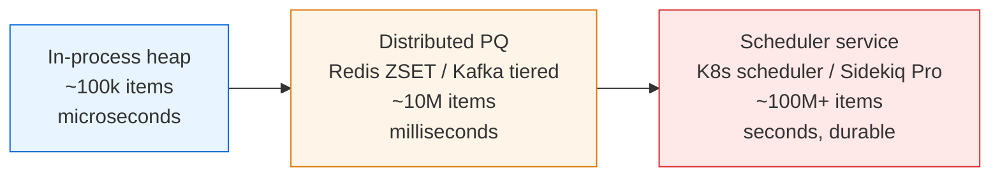
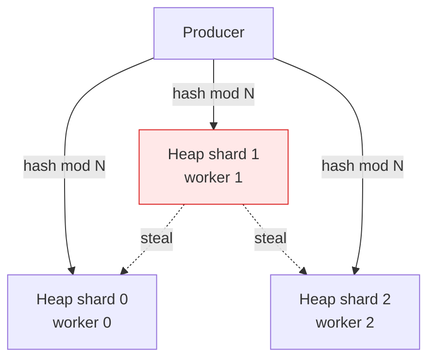

# Binary Heap — Senior Level

> A binary heap is rarely the bottleneck on a single node — but the moment you treat one as the backbone of a distributed priority queue, every weakness (mutability, single-node memory, lack of durability, head-of-line blocking) becomes a production incident.

## Table of Contents
1. [Introduction](#1-introduction)
2. [System Design with Binary Heaps](#2-system-design-with-binary-heaps)
3. [Distributed Priority Queues](#3-distributed-priority-queues)
4. [Concurrent and Lock-Based Variants](#4-concurrent-and-lock-based-variants)
5. [Comparison with Alternatives at Scale](#5-comparison-with-alternatives-at-scale)
6. [Architecture Patterns](#6-architecture-patterns)
7. [Code Examples](#7-code-examples)
8. [Observability](#8-observability)
9. [Failure Modes](#9-failure-modes)
10. [Capacity Planning](#10-capacity-planning)
11. [Summary](#11-summary)

---

## 1. Introduction

At the senior level the question is no longer "how does sift-up work" but "where does a binary heap sit in my system, and what breaks when it does not?". A binary heap is an in-memory, mutable, non-durable data structure. That description alone tells you three things:

- It is bounded by the RAM of one process.
- It loses everything on restart unless wrapped in a WAL.
- It serializes writes through a single mutex unless you shard.

The interesting senior-level decisions are therefore architectural:

1. Should this priority queue live in-process, in Redis, or as a dedicated scheduler service?
2. How do you make the heap thread-safe without destroying throughput?
3. How do you bound it so an upstream incident does not OOM the worker?
4. How do you survive crashes without losing the head of the queue?
5. How do you instrument it so the on-call engineer sees starvation, not just latency?

This document answers those five questions in production terms.

---

## 2. System Design with Binary Heaps

### 2.1 Three tiers of priority queue



| Tier | When right | When wrong |
| --- | --- | --- |
| In-process heap (`heapq`, `PriorityQueue`, `container/heap`) | Ephemeral work, one producer, one consumer, latency-critical. | You restart the process and lose jobs. |
| Distributed PQ (Redis ZSET, Disque, Kafka with priority topics) | You need durability and multiple consumers, but the workflow is still queue-shaped. | You need cross-job dependencies or windowed scheduling. |
| Scheduler service (Sidekiq Pro, K8s scheduler, Airflow) | You need policies: retries, rate limits, dependency DAGs, fair sharing. | You only have one type of job. The scheduler is overkill. |

The most expensive mistake is jumping straight to a scheduler when an in-process heap behind a bounded blocking queue would have handled the load for two years.

### 2.2 What a heap actually buys you

A heap gives you `O(log n)` insert and `O(log n)` extract-min. At 10M items that is ~24 comparisons. The bottleneck is almost never the comparisons; it is the lock, the allocator, the GC, and the cache miss on the array swap. Senior design optimizes those, not the algorithm.

---

## 3. Distributed Priority Queues

### 3.1 Redis ZSET as a durable PQ

Redis sorted sets give you `ZADD` / `ZPOPMIN` in `O(log n)`. Internally Redis uses a skip list, not a binary heap, but the external semantics are identical for our purposes.

```text
ZADD jobs 1717000000 "job:1234"   # score = run_at_unix_ms
ZPOPMIN jobs                       # atomic pop of the earliest job
```

Trade-offs vs an in-process heap:

- Persistence via RDB + AOF. Survives a worker crash.
- Multiple consumers can `ZPOPMIN` concurrently.
- Network hop is ~0.2 ms vs sub-microsecond in-process.
- ZSET memory overhead is ~64 bytes per entry vs ~16 bytes for a tightly packed array.
- You inherit Redis's failover story (Sentinel, Cluster).

### 3.2 Kafka with priority topics

Kafka has no native priority. The common workaround is N topics — `jobs.p0`, `jobs.p1`, `jobs.p2` — with a consumer that drains higher topics first. This is not a heap, it is a discrete priority class system. Use it when priorities are bucketed (3–5 classes), not when they are continuous deadlines.

### 3.3 Disque and dedicated priority brokers

Disque (now archived but the design is informative), ActiveMQ with `JMSPriority`, and RabbitMQ priority queues all expose a small priority range (typically 0–10). Behind the scenes they maintain one sub-queue per priority level, not a single global heap. This is faster to implement and easier to operate, but it limits you to coarse priorities.

### 3.4 K8s Job priority

Kubernetes uses `PriorityClass` and a scheduler queue ordered by priority. Internally `kube-scheduler` uses a Go priority queue (`heap.Interface`) for the active queue and a separate backoff queue. It is a textbook example of a binary heap with engineering scaffolding around it.

---

## 4. Concurrent and Lock-Based Variants

### 4.1 Single mutex — the default

The simplest concurrent heap wraps every operation in one mutex. Throughput caps at roughly `1 / op_duration` — if push takes 200 ns under contention, you cap near 5M ops/sec on one core, and far less under real contention.

### 4.2 Lock striping does not help

Unlike a hash map, a heap has a hot root. Striping locks across array indices does not help because every push and pop touches the root. Either accept one lock, or shard the heap entirely.

### 4.3 Sharded heap with work stealing

Run N independent heaps, one per worker. Route each enqueue by a shard key. Idle workers steal from the busiest shard.



Shard key choices:

- `hash(tenant_id) mod N` — fair across tenants, can hot-spot on whales.
- `round_robin` — balanced, breaks ordering within a tenant.
- `priority_class mod N` — keeps priorities together, defeats the purpose.

The Go runtime scheduler uses exactly this pattern with per-P run queues plus stealing. Tokio's multi-thread runtime is similar.

### 4.4 Bounded blocking PQ

A bounded PQ caps memory and produces back-pressure. Producers block (or fail fast) when full, which is exactly what you want when a downstream consumer is slow. `java.util.concurrent.PriorityBlockingQueue` is unbounded — read that twice. If you want bounding you must wrap it or implement your own.

---

## 5. Comparison with Alternatives at Scale

| Structure | Insert | Extract min | Decrease key | Concurrency | When |
| --- | --- | --- | --- | --- | --- |
| Binary heap (array) | `O(log n)` | `O(log n)` | `O(n)` find + `O(log n)` | Single mutex | Default. Cache friendly. |
| Pairing heap | `O(1)` amortized | `O(log n)` | `O(log n)` amortized | Hard to lock-free | Heavy decrease-key workloads (Dijkstra at scale). |
| Fibonacci heap | `O(1)` | `O(log n)` | `O(1)` amortized | Painful | Mostly a theoretical baseline. |
| Skip list (Redis ZSET) | `O(log n)` | `O(log n)` | `O(log n)` | Fine-grained locks possible | Durable, ordered, range queries. |
| Calendar queue / timing wheel | `O(1)` amortized | `O(1)` amortized | n/a | Sharded easily | Time-based events with bounded horizon (Kafka purgatory). |
| Sorted array | `O(n)` | `O(1)` | `O(n)` | Easy | Tiny n (<1000) or mostly read. |
| Bucket queue | `O(1)` | `O(1)` | `O(1)` | Easy | Small integer priorities. |

The binary heap wins when n is medium-large, priorities are arbitrary, and decrease-key is rare. For deadline scheduling with bounded horizon, a hierarchical timing wheel (Kafka, Netty, Linux kernel) is faster.

---

## 6. Architecture Patterns

### 6.1 Persistence via WAL

```
        +-----------+      +---------+      +-----------+
push -->| WAL fsync |----->| in-mem  |----->| consumer  |
        +-----------+      |  heap   |      +-----------+
                           +---------+
                                |
                                v
                          checkpoint
                          every 60s
```

On crash, replay the WAL from the last checkpoint. Trade-off: `fsync` per push is the throughput ceiling, usually 5k–30k/sec on SSD. Batch fsyncs (group commit) to lift it 10x.

### 6.2 Time-based priority — delayed jobs

Use a heap keyed by `(deadline, sequence_id)`. The sequence id breaks ties stably. The consumer loop sleeps until the head's deadline.

```text
loop:
  head = heap.peek()
  if head is None: wait_for_signal()
  elif head.deadline > now: sleep(min(head.deadline - now, 1s))
  else: heap.pop(); run(head)
```

The 1-second cap on sleep is intentional: it bounds the latency between "a new earlier job arrives" and "the consumer notices". Better: use a condition variable signalled by the producer on insert.

### 6.3 Sidekiq's scheduled set

Sidekiq stores scheduled jobs in a Redis ZSET with score = run-at unix timestamp. A poller does `ZRANGEBYSCORE jobs 0 now LIMIT 0 100` every second and moves due jobs into the main queue. This is a Redis-backed heap with batched eviction — pragmatic and durable.

---

## 7. Code Examples

### 7.1 Go — thread-safe bounded blocking PQ

```go
package pq

import (
	"container/heap"
	"context"
	"errors"
	"sync"
)

type Item struct {
	Priority int64
	Seq      uint64 // tiebreaker for FIFO within priority
	Value    any
	index    int
}

type itemHeap []*Item

func (h itemHeap) Len() int { return len(h) }
func (h itemHeap) Less(i, j int) bool {
	if h[i].Priority != h[j].Priority {
		return h[i].Priority < h[j].Priority
	}
	return h[i].Seq < h[j].Seq
}
func (h itemHeap) Swap(i, j int) {
	h[i], h[j] = h[j], h[i]
	h[i].index, h[j].index = i, j
}
func (h *itemHeap) Push(x any) {
	it := x.(*Item)
	it.index = len(*h)
	*h = append(*h, it)
}
func (h *itemHeap) Pop() any {
	old := *h
	n := len(old)
	it := old[n-1]
	old[n-1] = nil
	it.index = -1
	*h = old[:n-1]
	return it
}

// BoundedPQ is a thread-safe min-heap with capacity-based back-pressure.
type BoundedPQ struct {
	mu       sync.Mutex
	notFull  *sync.Cond
	notEmpty *sync.Cond
	h        itemHeap
	cap      int
	seq      uint64
	closed   bool
}

func New(capacity int) *BoundedPQ {
	q := &BoundedPQ{cap: capacity}
	q.notFull = sync.NewCond(&q.mu)
	q.notEmpty = sync.NewCond(&q.mu)
	return q
}

var ErrClosed = errors.New("pq: closed")

func (q *BoundedPQ) Push(ctx context.Context, priority int64, v any) error {
	q.mu.Lock()
	defer q.mu.Unlock()
	for len(q.h) >= q.cap && !q.closed {
		done := make(chan struct{})
		go func() { q.notFull.Wait(); close(done) }()
		select {
		case <-ctx.Done():
			q.notFull.Broadcast() // wake the goroutine above
			return ctx.Err()
		case <-done:
		}
	}
	if q.closed {
		return ErrClosed
	}
	q.seq++
	heap.Push(&q.h, &Item{Priority: priority, Seq: q.seq, Value: v})
	q.notEmpty.Signal()
	return nil
}

func (q *BoundedPQ) Pop(ctx context.Context) (*Item, error) {
	q.mu.Lock()
	defer q.mu.Unlock()
	for len(q.h) == 0 && !q.closed {
		done := make(chan struct{})
		go func() { q.notEmpty.Wait(); close(done) }()
		select {
		case <-ctx.Done():
			q.notEmpty.Broadcast()
			return nil, ctx.Err()
		case <-done:
		}
	}
	if len(q.h) == 0 {
		return nil, ErrClosed
	}
	it := heap.Pop(&q.h).(*Item)
	q.notFull.Signal()
	return it, nil
}

func (q *BoundedPQ) Close() {
	q.mu.Lock()
	defer q.mu.Unlock()
	q.closed = true
	q.notEmpty.Broadcast()
	q.notFull.Broadcast()
}

func (q *BoundedPQ) Len() int {
	q.mu.Lock()
	defer q.mu.Unlock()
	return len(q.h)
}
```

Notes for review:

- One mutex, two condition variables. Throughput cap is the lock, not the heap math.
- `Seq` gives stable ordering within a priority — without it you get random tiebreaks and starvation on equal priorities.
- The `ctx`-aware wait uses a goroutine because Go's `sync.Cond` is not cancellable. In production code use channels and `select` instead of `sync.Cond` if cancellation matters.

### 7.2 Java — bounded PQ with `ReentrantLock`

```java
import java.util.PriorityQueue;
import java.util.concurrent.TimeUnit;
import java.util.concurrent.locks.Condition;
import java.util.concurrent.locks.ReentrantLock;

public final class BoundedPriorityQueue<E> {
    private final PriorityQueue<Entry<E>> heap;
    private final int capacity;
    private final ReentrantLock lock = new ReentrantLock(false);
    private final Condition notFull = lock.newCondition();
    private final Condition notEmpty = lock.newCondition();
    private long seq = 0;
    private volatile boolean closed = false;

    public BoundedPriorityQueue(int capacity) {
        this.capacity = capacity;
        this.heap = new PriorityQueue<>((a, b) -> {
            int c = Long.compare(a.priority, b.priority);
            return c != 0 ? c : Long.compare(a.seq, b.seq);
        });
    }

    public boolean offer(E value, long priority, long timeout, TimeUnit unit)
            throws InterruptedException {
        long nanos = unit.toNanos(timeout);
        lock.lockInterruptibly();
        try {
            while (heap.size() >= capacity) {
                if (closed) return false;
                if (nanos <= 0) return false;
                nanos = notFull.awaitNanos(nanos);
            }
            heap.offer(new Entry<>(priority, ++seq, value));
            notEmpty.signal();
            return true;
        } finally {
            lock.unlock();
        }
    }

    public E poll(long timeout, TimeUnit unit) throws InterruptedException {
        long nanos = unit.toNanos(timeout);
        lock.lockInterruptibly();
        try {
            while (heap.isEmpty()) {
                if (closed) return null;
                if (nanos <= 0) return null;
                nanos = notEmpty.awaitNanos(nanos);
            }
            Entry<E> e = heap.poll();
            notFull.signal();
            return e.value;
        } finally {
            lock.unlock();
        }
    }

    public void close() {
        lock.lock();
        try {
            closed = true;
            notFull.signalAll();
            notEmpty.signalAll();
        } finally {
            lock.unlock();
        }
    }

    public int size() {
        lock.lock();
        try { return heap.size(); } finally { lock.unlock(); }
    }

    private static final class Entry<E> {
        final long priority;
        final long seq;
        final E value;
        Entry(long p, long s, E v) { priority = p; seq = s; value = v; }
    }
}
```

Note: `java.util.concurrent.PriorityBlockingQueue` exists and is thread-safe, but it is unbounded. In production you must either wrap it with a `Semaphore` or write the bounded variant above. The unbounded default has caused more OOMs than any other JDK collection.

### 7.3 Python — thread-safe bounded PQ with `threading.RLock`

```python
import heapq
import itertools
import threading
import time
from dataclasses import dataclass, field
from typing import Any, Optional


@dataclass(order=True)
class _Entry:
    priority: int
    seq: int
    value: Any = field(compare=False)


class BoundedPriorityQueue:
    """Thread-safe bounded min-heap with back-pressure.

    Raises QueueClosed once close() is called and the heap is drained.
    """

    def __init__(self, capacity: int):
        if capacity <= 0:
            raise ValueError("capacity must be positive")
        self._capacity = capacity
        self._heap: list[_Entry] = []
        self._lock = threading.RLock()
        self._not_full = threading.Condition(self._lock)
        self._not_empty = threading.Condition(self._lock)
        self._seq = itertools.count()
        self._closed = False

    def put(self, value: Any, priority: int, timeout: Optional[float] = None) -> bool:
        deadline = None if timeout is None else time.monotonic() + timeout
        with self._not_full:
            while len(self._heap) >= self._capacity:
                if self._closed:
                    raise QueueClosed
                remaining = None if deadline is None else deadline - time.monotonic()
                if remaining is not None and remaining <= 0:
                    return False
                self._not_full.wait(timeout=remaining)
            if self._closed:
                raise QueueClosed
            heapq.heappush(
                self._heap, _Entry(priority, next(self._seq), value)
            )
            self._not_empty.notify()
            return True

    def get(self, timeout: Optional[float] = None) -> Any:
        deadline = None if timeout is None else time.monotonic() + timeout
        with self._not_empty:
            while not self._heap:
                if self._closed:
                    raise QueueClosed
                remaining = None if deadline is None else deadline - time.monotonic()
                if remaining is not None and remaining <= 0:
                    raise TimeoutError
                self._not_empty.wait(timeout=remaining)
            entry = heapq.heappop(self._heap)
            self._not_full.notify()
            return entry.value

    def close(self) -> None:
        with self._lock:
            self._closed = True
            self._not_empty.notify_all()
            self._not_full.notify_all()

    def __len__(self) -> int:
        with self._lock:
            return len(self._heap)


class QueueClosed(Exception):
    pass
```

CPython note: the GIL serializes bytecode but not blocking syscalls. `heapq` operations are written in C and effectively atomic per call, but a Python-level read-modify-write needs the explicit lock. The lock above is required even on CPython.

---

## 8. Observability

A priority queue is invisible until it misbehaves. Wire the following metrics from day one.

| Metric | Type | Why |
| --- | --- | --- |
| `pq_size` | gauge | Detect unbounded growth before OOM. |
| `pq_capacity_ratio` | gauge | `size / capacity`. Alert at 0.8. |
| `pq_enqueue_latency_seconds` | histogram | Detect lock contention. |
| `pq_dequeue_latency_seconds` | histogram | Detect consumer slowness. |
| `pq_top_priority_age_seconds` | gauge | How long has the head been waiting? Best starvation signal. |
| `pq_stale_entry_ratio` | gauge | Fraction of items past their deadline. |
| `pq_rejections_total` | counter | Bounded queue back-pressure hits. |
| `pq_poison_total` | counter | Items that failed N times — see below. |

The single most useful one is `top_priority_age`. If your highest-priority item has been sitting at the head for 30 seconds, the consumer is wedged or starving regardless of throughput.

Trace tags to add on every dequeue: `priority_class`, `tenant_id`, `time_in_queue_ms`, `retry_count`.

---

## 9. Failure Modes

### 9.1 Poison pills

A job that always fails will be re-enqueued at the same priority and dominate the head. Mitigations:

- Track retry count per item. After N failures, route to a dead-letter queue and emit `pq_poison_total`.
- On re-enqueue, degrade priority (`priority + retry_count * step`) so poison pills sink.

### 9.2 Head-of-line blocking

The head item is high-priority but expensive. Consumers spend their slot on it and lower-priority but fast items pile up.

- Use multiple consumers so one is always free for fast work.
- Add a separate "expedite" lane with its own concurrency budget.
- Set per-item deadlines and skip past expired items.

### 9.3 Priority inversion

A low-priority holder blocks a high-priority waiter on a shared lock. Classic in OS kernels. In a heap context this shows up when the consumer takes a shared resource (DB connection, rate-limit token) and a higher-priority item enqueues while the low-priority one holds it. Mitigation: short critical sections, priority inheritance where supported, or release the resource before long work.

### 9.4 Hot-key starvation

In a sharded heap with `hash(key) mod N` routing, one tenant's whale fills one shard while others sit idle. Work stealing fixes throughput but not ordering. If global priority ordering matters, you cannot shard — accept the single lock.

### 9.5 GC pause amplification

The heap is one large array of pointers. On a major GC, every entry is scanned. At 10M items a stop-the-world pass can take 100–300 ms. Mitigations:

- Use off-heap storage (Java: `sun.misc.Unsafe`, Chronicle Queue).
- Use value types where the language supports them (Go structs by value, Java Project Valhalla, C# structs).
- Cap the heap size so GC pauses stay bounded.

### 9.6 Producer crash with un-fsynced WAL

The pushing process crashes between `heap.Push` and the next group-commit fsync. The job is lost. Mitigations:

- Synchronous fsync per push for at-least-once delivery (costly).
- Replicate the in-memory heap to a follower before acknowledging the producer.
- Accept best-effort delivery for non-critical jobs and instrument the loss rate.

---

## 10. Capacity Planning

### 10.1 Single-node break point

Working assumptions:

- 64-byte entry (priority + seq + small payload pointer + heap bookkeeping).
- 32 GiB RAM, half available to the heap, so 16 GiB.
- `16 GiB / 64 B = 256 M entries` theoretical.

In practice, GC overhead and bookkeeping cut that by 4x. Realistic single-node ceiling: **~60M entries** before pauses become uncontrolled.

### 10.2 Throughput

- In-process binary heap, single mutex, 64-byte payload: 1–5M ops/sec on one modern core.
- Add real consumer work (DB write, RPC): 10k–50k ops/sec end-to-end.
- Redis ZSET: 50k–200k ops/sec per Redis node, network-bound.
- Kafka: 100k–1M msgs/sec but priority is bucketed, not continuous.

### 10.3 Sizing example

You have 5k jobs/sec arriving, average duration 50 ms, P99 200 ms. Required concurrency: `5000 * 0.05 = 250` workers steady state, ~`5000 * 0.2 = 1000` for P99. Pick 500 workers and bound the queue at `5000 * 30 = 150k` items (30 seconds of buffer). At 64 B per entry that is 10 MiB — trivial. The constraint is producer back-pressure, not memory.

### 10.4 When to leave the single node

Move off in-process heap when any of the following is true:

- Steady-state queue size exceeds 1M items.
- You need to survive worker restarts.
- More than one process must consume the same queue.
- You need cross-region failover.

Until then, an in-process bounded heap behind a clean interface is the right answer.

---

## 11. Summary

- The heap is rarely the bottleneck; the mutex, the GC, the fsync, and the network hop are.
- Start in-process with a bounded blocking PQ. Move to Redis ZSET when durability or multi-consumer matters. Adopt a scheduler service only when you need DAGs, retries, or fair sharing.
- Single mutex is fine until ~1M ops/sec. Beyond that, shard with work stealing — and accept that strict global priority is gone.
- Always bound the queue. Unbounded `PriorityBlockingQueue` is the JVM's most reliable OOM.
- Instrument `top_priority_age` and `stale_entry_ratio` — they catch starvation that throughput metrics miss.
- Plan for poison pills, head-of-line blocking, priority inversion, and GC pauses before they surface in production.
- A single node can host tens of millions of items, but the failure modes (durability, restart, GC) usually push you off long before memory does.

References to study further: Linux CFS run queue, Kafka purgatory (hierarchical timing wheels), Sidekiq scheduled set, kube-scheduler active queue, Netty `HashedWheelTimer`, Tokio multi-thread scheduler.
