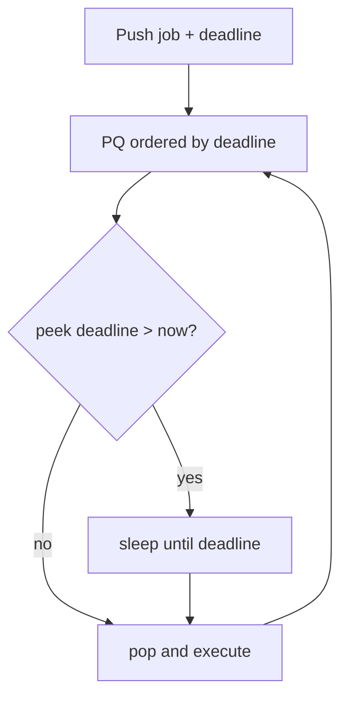

# Priority Queue — Junior Level

> **One-line summary:** A priority queue is an *abstract data type* (ADT) that hands you items in priority order rather than FIFO order. The most common implementation is a binary heap, but the *interface* — `push`, `pop-highest-priority`, `peek` — is what defines a priority queue, not the data structure underneath it.

---

## Table of Contents

1. [Introduction](#introduction)
2. [Prerequisites](#prerequisites)
3. [Glossary](#glossary)
4. [Core Concepts](#core-concepts)
5. [Big-O Summary](#big-o-summary)
6. [Real-World Analogies](#real-world-analogies)
7. [Pros & Cons](#pros--cons)
8. [Choosing an Implementation](#choosing-an-implementation)
9. [Code Examples](#code-examples)
10. [Coding Patterns](#coding-patterns)
11. [Error Handling](#error-handling)
12. [Performance Tips](#performance-tips)
13. [Best Practices](#best-practices)
14. [Edge Cases & Pitfalls](#edge-cases--pitfalls)
15. [Common Mistakes](#common-mistakes)
16. [Cheat Sheet](#cheat-sheet)
17. [Visual Animation](#visual-animation)
18. [Summary](#summary)
19. [Further Reading](#further-reading)

---

## Introduction

A normal queue is **first-in, first-out**: the order things come out is the order they went in. A **priority queue** is **highest-priority-out**: the order things come out is determined by an importance value attached to each item.

It is one of the most common ADTs in computer science precisely because real life rarely respects insertion order. An operating system runs the most urgent task first. A hospital sees the most critical patient first. Dijkstra's algorithm processes the closest unsettled node first. A Kafka consumer with retry priorities pulls failed messages back into the front of the line.

The critical mental shift at this stage: **priority queue is an interface, not a data structure**. Five different data structures (binary heap, sorted array, BST, skip list, Fibonacci heap) all support the same `push` / `pop-min` / `peek` operations with very different time-and-space trade-offs. Picking one is part of your job as a programmer.

In practice, "priority queue" without qualification almost always means "binary-heap-backed priority queue" — `heapq` in Python, `PriorityQueue` in Java, `container/heap` in Go, `std::priority_queue` in C++. That binding is so strong that many programmers conflate the two. Try to keep them separate in your head: heaps are *one* way to build a priority queue, the way *most often* used because it's simple and fast.

---

## Prerequisites

- **Queue ADT** — FIFO order: `enqueue`, `dequeue`.
- **Stack ADT** — LIFO order, for contrast.
- **Big-O notation** — `O(1)`, `O(log n)`, `O(n)`.
- **Binary heap** (see [`../01-binary-heap/junior.md`](../01-binary-heap/junior.md)) — the default implementation.
- **Basic comparison operators** — `<`, `>` and the idea of a *comparator function*.

Helpful but not required:

- BST and sorted-list mental model.
- Knowledge that "priority" in CS is *lower-value-comes-first* by convention (min-heap), unless explicitly inverted.

---

## Glossary

| Term | Meaning |
|------|---------|
| **Priority queue (PQ)** | An ADT supporting `insert(item, priority)`, `pop-best`, `peek-best`. |
| **Min-priority queue** | "Smallest priority comes out first" (default in `heapq`, `container/heap`). |
| **Max-priority queue** | "Largest priority comes out first" (default in Java `PriorityQueue` *with a reversed comparator*; default in C++ `std::priority_queue`). |
| **Comparator** | Function or lambda `(a, b) → int` that defines the priority order. |
| **Stability** | Equal-priority items come out in insertion order. PQs are not naturally stable; add a counter to make them stable. |
| **Bounded PQ** | A PQ with a maximum capacity; pushing on a full queue evicts something (often the worst item). |
| **Blocking PQ** | A thread-safe PQ where `pop` blocks the calling thread if the queue is empty. |
| **Indexed PQ** | A PQ that supports `decrease-key` because it remembers each item's position. |
| **Heap-backed PQ** | Implemented on top of a binary heap (the usual case). |
| **Bucket PQ / radix heap** | PQ for *bounded integer priorities*, achieving `O(1)` per op. |

---

## Core Concepts

### 1. PQ is an interface

```
push(item, priority)          # add an item
pop()                          # return + remove highest-priority item
peek()                         # return highest-priority item without removing
size(), empty()
```

That's it. Any data structure that provides those four operations is a priority queue, *no matter how it's built inside*.

### 2. Priority order: min or max

By convention in algorithm textbooks, "highest priority" = "smallest priority value." Lower numbers mean *more urgent*. This is consistent with shortest-distance dictionaries: smaller dist = process sooner.

```
Min-PQ:   pop() returns the item with the smallest priority key.
Max-PQ:   pop() returns the item with the largest priority key.
```

If your library only gives you a min-PQ but you need a max-PQ, the two standard tricks are:

- Push `-priority` instead of `priority` (works for numeric keys).
- Pass a reversed comparator: `(a, b) → b.priority - a.priority`.

### 3. Storing the priority *with* the item

Most PQs store `(priority, item)` pairs or use a comparator that knows how to extract the priority. The item is the *payload*; the priority is the *key*.

```
push((dist, node_id))
priority, node_id = pop()
```

A subtle pitfall: if Python's `heapq` compares two pairs whose first elements are equal, it goes on to compare the second elements. If those are objects without an `__lt__` method, you get a `TypeError`. The fix is the **tiebreaker counter pattern**: `(priority, counter, item)` — the counter guarantees the second component always orders.

### 4. Stability

A priority queue is *stable* if items with equal priority come out in the same order they went in. Binary heaps are not stable by themselves. To make them stable, you push `(priority, counter, item)`; the counter is an ever-increasing integer.

```
heappush(pq, (priority, next_counter(), item))
```

### 5. Indexed PQ for decrease-key

When the priority of an existing item can change (Dijkstra finds a shorter path mid-run), you need:

```
decrease_key(item, new_priority)
```

To support this in `O(log n)`, the PQ must remember where each item lives inside its underlying structure. That's an *indexed* PQ. See [`middle.md`](./middle.md) for the implementation.

---

## Big-O Summary

| Operation | Binary-heap PQ | Sorted-array PQ | BST PQ | Fibonacci-heap PQ |
|-----------|---------------:|----------------:|-------:|-------------------:|
| `peek` | O(1) | O(1) | O(log n) | O(1) |
| `push` | O(log n) | O(n) | O(log n) | **O(1) amortised** |
| `pop` | O(log n) | O(1) | O(log n) | O(log n) |
| `decrease-key` | O(log n) (indexed) | O(n) | O(log n) | **O(1) amortised** |
| `meld` | O(n) | O(n) | O(n log n) | **O(1)** |
| Space | O(n) | O(n) | O(n) | O(n) (extra pointers) |

Different implementations dominate on different operation mixes — that's the whole point of treating PQ as an ADT.

---

## Real-World Analogies

| Concept | Analogy |
|---------|---------|
| Min-PQ | Hospital triage — the most critical patient is seen first, regardless of arrival order. |
| Tiebreaker counter | Two patients with identical injury severity — first to arrive goes in first. |
| Bounded PQ with eviction | A VIP guest list of size 50 — when a more important guest arrives, the lowest-ranked one gets removed. |
| Blocking PQ | A pizza pickup window — staff `pop` orders by priority; if the queue is empty they wait. |
| Indexed PQ | A waiting-room board where you can find and update *your own* position when the receptionist gives you a new appointment time. |

Where the analogy breaks: in a real hospital you re-prioritise dozens of patients at once; most heap-backed PQs are happiest doing one mutation at a time.

---

## Pros & Cons

| Pros | Cons |
|------|------|
| One small interface unlocks dozens of algorithms (Dijkstra, Prim, A*, Huffman, scheduling). | Choosing the right backing structure requires understanding your operation mix. |
| `O(log n)` per mutation is fast enough for almost all production workloads. | Not naturally stable — equal-priority items come out in unspecified order. |
| Bounded variants give natural top-`k` / leaderboard semantics. | `decrease-key` requires an *indexed* implementation or "lazy duplicates." |
| Thread-safe variants ship in every major language stdlib. | Single global PQ becomes a contention bottleneck at high QPS. |
| `peek` is `O(1)` — perfect for "ready-to-run" scheduler loops. | Merging two PQs is expensive in the default binary-heap form. |

**When to use:** anywhere "process the most important next" is the natural verb — schedulers, search algorithms, simulators, retry queues, message brokers with priority classes.

**When NOT to use:** strict FIFO (use a plain queue), bounded integer priorities with high QPS (consider a *bucket* / radix PQ), or read-heavy "search by value" (heap is `O(n)` for that).

---

## Choosing an Implementation

| Workload | Best choice | Why |
|----------|-------------|-----|
| Generic PQ with mixed ops | Binary-heap PQ | Simple, fast, library-supported. |
| Many `decrease-key`s per `pop` (Dijkstra on dense graphs) | d-ary heap or indexed binary heap | Fewer levels, cheaper sift-up. |
| Frequent `meld` (event simulators) | Leftist / pairing / Fibonacci heap | `O(log n)` or `O(1)` meld. |
| Tiny integer priorities, e.g. 0..255 | Bucket / radix heap | Constant-time ops via direct array index. |
| Concurrent producers/consumers | `java.util.concurrent.PriorityBlockingQueue` or sharded heaps | Built-in lock. |
| Top-`k` running query | Bounded heap of size k | Auto-eviction. |
| Persistent / durable PQ | Redis ZSET, Kafka with priority topics | Disk-backed + replication. |

---

## Code Examples

### Example 1: Using the language library

#### Go

```go
package main

import (
    "container/heap"
    "fmt"
)

// Int-priority min-PQ on a custom Item type.
type Item struct {
    name     string
    priority int
    index    int             // position in heap (for decrease-key, optional)
}

type PQ []*Item

func (pq PQ) Len() int            { return len(pq) }
func (pq PQ) Less(i, j int) bool  { return pq[i].priority < pq[j].priority }
func (pq PQ) Swap(i, j int)       { pq[i], pq[j] = pq[j], pq[i]; pq[i].index = i; pq[j].index = j }
func (pq *PQ) Push(x interface{}) { it := x.(*Item); it.index = len(*pq); *pq = append(*pq, it) }
func (pq *PQ) Pop() interface{} {
    old := *pq
    n := len(old)
    it := old[n-1]
    *pq = old[:n-1]
    return it
}

func main() {
    pq := &PQ{}
    heap.Init(pq)
    heap.Push(pq, &Item{name: "patch", priority: 3})
    heap.Push(pq, &Item{name: "deploy", priority: 1})
    heap.Push(pq, &Item{name: "lint", priority: 2})
    for pq.Len() > 0 {
        it := heap.Pop(pq).(*Item)
        fmt.Println(it.priority, it.name)
    }
    // 1 deploy
    // 2 lint
    // 3 patch
}
```

#### Java

```java
import java.util.*;

public class PQExample {
    record Job(String name, int priority) {}

    public static void main(String[] args) {
        PriorityQueue<Job> pq = new PriorityQueue<>(Comparator.comparingInt(Job::priority));
        pq.add(new Job("patch", 3));
        pq.add(new Job("deploy", 1));
        pq.add(new Job("lint", 2));
        while (!pq.isEmpty()) {
            Job j = pq.poll();
            System.out.println(j.priority() + " " + j.name());
        }
    }
}
```

#### Python

```python
import heapq
import itertools

class PriorityQueue:
    """Heap-backed PQ with stable ordering via a counter."""

    def __init__(self):
        self._data = []
        self._counter = itertools.count()

    def push(self, item, priority):
        heapq.heappush(self._data, (priority, next(self._counter), item))

    def pop(self):
        priority, _, item = heapq.heappop(self._data)
        return priority, item

    def peek(self):
        priority, _, item = self._data[0]
        return priority, item

    def __len__(self):
        return len(self._data)


pq = PriorityQueue()
pq.push("patch", 3)
pq.push("deploy", 1)
pq.push("lint", 2)
while len(pq):
    print(*pq.pop())
# 1 deploy
# 2 lint
# 3 patch
```

**What it does:** inserts three jobs with priorities and prints them in ascending priority order.
**Run:** `go run main.go` | `javac PQExample.java && java PQExample` | `python pq.py`

---

## Coding Patterns

### Pattern 1: Top-K with a bounded PQ

**Intent:** Keep only the `k` smallest items in a stream. Use a max-PQ of size `k`; whenever the new item is smaller than the current max, evict and replace.

```python
import heapq

def top_k_smallest(stream, k):
    h = []                          # min-heap of negated values to fake max-heap
    for x in stream:
        if len(h) < k:
            heapq.heappush(h, -x)
        elif -x > h[0]:             # x < current max
            heapq.heapreplace(h, -x)
    return sorted(-v for v in h)
```

### Pattern 2: Tiebreaker stability

```python
heapq.heappush(pq, (priority, next(counter), payload))
```

Without the counter, Python compares payloads when priorities tie — and crashes if payloads are not orderable.

### Pattern 3: Delayed jobs (priority = deadline)

```python
import heapq, time

def scheduler(jobs):
    pq = [(deadline, fn) for fn, deadline in jobs]
    heapq.heapify(pq)
    while pq:
        deadline, fn = pq[0]
        now = time.monotonic()
        if deadline > now:
            time.sleep(deadline - now)
        heapq.heappop(pq)
        fn()
```



---

## Error Handling

| Error | Cause | Fix |
|-------|-------|-----|
| `IndexError` on empty `pop`/`peek` | Trying to read from an empty PQ. | Check `len(pq) > 0` first or catch the exception. |
| `TypeError: '<' not supported between Foo and Foo` | Equal priorities cause Python to compare payloads. | Push `(priority, counter, payload)` tuples. |
| `ConcurrentModificationException` | Mutating the PQ while iterating. | Drain via `pop()` calls, not iteration. |
| Stale entries in lazy Dijkstra cause wrong results | Forgot to skip `cur.dist > dist[node]`. | Always check freshness after `pop`. |
| Reverse-comparator gives wrong order in Java | Swapping operand order in `Integer.compare(a, b)`. | Use `Comparator.reverseOrder()` or `(a, b) → b - a` (watch for overflow). |

---

## Performance Tips

- Reach for the **standard library** first. They are written in C and use bulk `O(n)` heapify.
- Use `heapq.heapreplace` (or `replace` in Java's PQ via `poll`+`offer` in a single critical section) instead of `pop` then `push`.
- For huge PQs in Python, prefer `heapq` on a *list* over `queue.PriorityQueue` (which adds thread-safe locking overhead).
- Avoid object allocations inside the heap; pre-allocate items if the workload is hot.
- If priorities are small integers, consider a bucket or radix heap — `O(1)` per op.

---

## Best Practices

- Define your comparator *once* and document the order (`min` vs `max`).
- Never mutate an item's priority while it sits in a PQ — wrap `push` / `pop` / `decrease-key` around the field updates.
- Push immutable value objects when possible (`record` in Java, `frozenset`/tuple in Python).
- Log the size at periodic checkpoints — runaway growth is the most common PQ bug in production.
- For multi-producer workloads, prefer the language's concurrent PQ rather than building your own lock around a plain heap.

---

## Edge Cases & Pitfalls

- **Empty PQ:** define behaviour of `peek`/`pop` up front. Throw, return sentinel, or block.
- **Duplicate priorities:** ensure stability if your downstream expects FIFO among equals.
- **Negative priorities:** legal but watch for overflow when subtracting in comparators.
- **`NaN` priorities (floats):** `NaN` breaks total order — guard with `assert not isnan(p)`.
- **Mutable payloads:** make payload comparison a no-op (tiebreaker counter) so equal priorities never reach the payload.
- **Unbounded growth in lazy Dijkstra:** an early skip check on `pop` is what keeps it from exploding.

---

## Common Mistakes

1. Confusing the ADT with binary heap: thinking "priority queue" can only mean "binary heap."
2. Forgetting the tiebreaker counter and crashing on equal priorities.
3. Using a max-heap when you wanted min, and vice versa.
4. Mutating a priority while the item is still in the PQ — the invariant rots.
5. Reaching for `decrease-key` without an indexed structure — there is no way to find the item.
6. Treating `peek` as `pop` and not seeing the next item ever change.

---

## Cheat Sheet

| Operation | Default cost (binary heap) | Notes |
|-----------|---------------------------:|-------|
| `peek` | O(1) | Read the root. |
| `push` | O(log n) | Sift up. |
| `pop` | O(log n) | Sift down after swap-with-last. |
| `replace` | O(log n) | Pop + push in one sift-down. |
| `decrease-key` | O(log n) | Requires indexed PQ. |
| `meld` | O(n) | Concatenate + bulk heapify. |
| Library: Python | `heapq.heappush/heappop` | Functions on a list. |
| Library: Go | `container/heap.Push/Pop` | Implement `heap.Interface`. |
| Library: Java | `PriorityQueue<T>` + Comparator | Not thread-safe; use `PriorityBlockingQueue`. |

---

## Visual Animation

> See [`animation.html`](./animation.html) for an interactive view.
>
> The animation demonstrates:
> - A PQ as the *interface* — toggle between three backing structures (binary heap, sorted array, BST) and watch the same operations run with different costs.
> - Stable vs unstable behaviour with the tiebreaker counter.
> - A bounded PQ in top-`k` mode evicting items when full.

---

## Summary

The priority queue is the ADT you reach for whenever "process the most important thing next" is part of your algorithm. It is almost always backed by a binary heap, but it is good practice to mentally distinguish *the interface* from *the implementation* — the two are independent decisions, and different workloads favour different backings.

---

## Further Reading

- *Introduction to Algorithms* (CLRS), Chapter 6.5 — "Priority queues."
- Java — `java.util.PriorityQueue` and `java.util.concurrent.PriorityBlockingQueue` Javadoc.
- Go — `container/heap` package docs.
- Python — `heapq` module docs, including "Priority Queue Implementation Notes."
- Sedgewick & Wayne, *Algorithms*, §2.4 — beautifully concise treatment of PQs.
