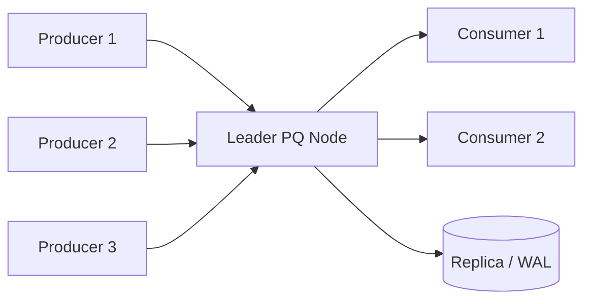
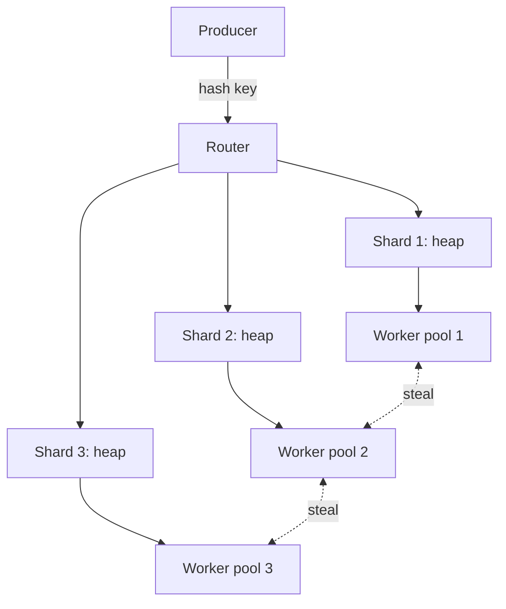

# Priority Queue — Senior Level

> Focus: "How to architect a priority-driven system at scale?"

A priority queue (PQ) at the data-structure layer is a few hundred lines of code; at the system layer it is a multi-week design exercise. Senior-level decisions are no longer about whether to use a binary heap or a pairing heap. They are about whether priority belongs in the producer, the broker, or the scheduler; whether the PQ must survive a node crash; how to keep tenant A's bulk import from starving tenant B's interactive request; and how to keep tail latency bounded when the head-of-line item is unfairly fat.

This document is the architectural counterpart to the junior, middle, and professional notes. Lower tiers cover the heap invariants and the API surface. Here we look at the PQ as a component embedded in a request lifecycle.

## Table of Contents

1. Introduction — PQ in a request lifecycle
2. Distributed Priority Queue Architectures
3. Durable / Persistent PQs
4. Concurrent Variants — striped locks, lock-free skiplists, MPSC channels
5. Fairness — multi-tenant priority queues, WFQ, DRR
6. Architecture Patterns — retry queues, DLQs, scheduler tiers
7. Code Examples (Go / Java / Python)
8. Observability — metrics that matter
9. Failure Modes — head-of-line blocking, starvation, priority inversion, hot-shard
10. Capacity Planning
11. Summary

---

## 1. Introduction — PQ in a Request Lifecycle

A typical request that hits a "priority-aware" backend traverses three different kinds of PQ, often without the application code naming any of them:

```text
client --> API gateway --> in-process PQ (per-handler) --> broker-backed PQ --> worker pool with scheduler PQ
              ^                  (RingPool, semaphore)        (Redis, Kafka,        (DRR over per-tenant heaps)
              |                                                RabbitMQ)
        rate limiter PQ
        (token-bucket scheduler)
```

Three categories matter, and they have different correctness contracts:

- **In-process PQ.** Lives inside one Go/Java/Python process. Sub-microsecond `push`/`pop`. No durability. Loses data on crash. Backed by `container/heap` (Go), `PriorityQueue` (Java), `heapq` (Python). Used for: connection-level fairness, per-handler scheduling, retry timers, expiry wheels.
- **Broker-backed PQ.** A queue inside Redis, Kafka, RabbitMQ, SQS, ActiveMQ, or NATS JetStream. Durable, replicated, slower (50 us – 5 ms enqueue). Used for: cross-process job pipelines, background tasks, retry queues.
- **Scheduler service.** A dedicated process that holds the global view: which tenant is owed compute, which job is overdue, which item is throttled. Internally it is usually one heap per tenant plus a top-level WFQ or DRR loop.

The first design question on every system-design interview that touches "priority" is: **which of these three holds the truth?** If the broker holds it, your application is stateless and scales horizontally, but you pay a network round-trip per dequeue. If the in-process PQ holds it, you are fast but you risk losing jobs on crash and you risk per-node skew. If the scheduler holds it, you can do fancy fairness but you have a coordination point that itself must be HA.

Senior engineers pick the layer deliberately. They do not "just add a Redis ZSET" without first asking what fails when Redis is unavailable for 30 seconds.

---

## 2. Distributed Priority Queue Architectures

Three canonical topologies, ordered by how much shared state they require.

### 2.1 Single Global PQ

One node owns the heap. Producers and consumers RPC into it. Simple, strongly consistent, easy to reason about.



Throughput is bounded by the leader. With a single-node Redis ZSET behind it, expect ~100k ops/sec (`ZADD` + `ZPOPMIN`) on a modern box, less if you persist with `appendfsync always`. Above that you must shard.

When to pick it: low-to-medium throughput (< 50k ops/sec sustained), strict global ordering required, small operational team. Most real systems are here for the first two years.

### 2.2 Sharded PQ (Consistent Hashing)

Partition the key space across `N` shard nodes. Each shard owns its own heap. Producers hash the job key to a shard; consumers either pull from a specific shard or from all shards in round-robin / work-stealing fashion.



Aggregate throughput scales linearly until the router becomes a bottleneck. You lose global priority ordering: shard A's highest-priority item may be a 3 while shard B's lowest is a 5, and a consumer pulling only from B will process the 5 before A's 3 is touched.

Mitigations:
- **Work-stealing.** Idle workers poll neighbouring shards. Cheap to implement; defeats local-only starvation. Adds extra Redis ops.
- **Cross-shard dequeue with quorum read.** Consumer queries the head of every shard, picks the global minimum. Adds `N` Redis round-trips per dequeue; only viable for small `N`.
- **Two-tier scheduler.** A coordinator node maintains a heap of `(shard_id, head_priority)` so it always knows which shard owns the global head. The coordinator becomes the new bottleneck.

Senior tradeoff: sharded PQ trades strict ordering for throughput. If "strict priority order across all tenants" is a hard product requirement, you cannot shard naively — you must either use a single global PQ or accept eventual ordering.

### 2.3 Hierarchical PQ

Two layers of priority. The outer layer is a queue of queues (one queue per tenant, or per priority class). The inner queue is a normal heap. The scheduler picks the next inner queue with a fairness policy (DRR, WFQ, or strict tier), then pops from its head.

```text
[Tenant A heap]   [Tenant B heap]   [Tenant C heap]
        \              |              /
         \             |             /
          [Top-level WFQ scheduler]
                       |
                   [Worker pool]
```

This is the topology that backs every serious multi-tenant job system: AWS SQS FIFO with message groups, Sidekiq Enterprise's "throttling" feature, Google Borg's priority bands, Kubernetes' `PriorityClass` + namespace quotas. It is the only topology that solves "tenant A floods the queue and tenant B starves" cleanly.

Cost: more state, more knobs (per-tenant weights), more failure modes (one stuck tenant heap holds the slot).

---

## 3. Durable / Persistent PQs

Once a PQ outlives a process, you need WAL or replication. Four production-grade options, each with a different sweet spot.

### 3.1 Redis Sorted Set (ZSET)

The default answer for "I need a durable PQ in under a day". A ZSET is a skiplist + hash map; `ZADD key score member` is O(log N), `ZPOPMIN` is O(log N). Score is the priority.

Pros: simple API, excellent latency (~50 us per op), Lua scripts give you atomic "pop + enqueue elsewhere" for safe handoff to a workers' "processing" set.
Cons: single-node throughput caps near 100k ops/sec. AOF persistence with `appendfsync everysec` loses up to 1s of writes on crash. Cluster mode shards by key, so you cannot have one logical ZSET span shards — you need application-side sharding.

```text
ZADD pq:jobs 5 "job-abc"      ; lower score = higher priority
ZPOPMIN pq:jobs               ; atomic pop of head
ZRANGEBYSCORE pq:jobs 0 10 LIMIT 0 100  ; peek
```

### 3.2 Kafka with "Priority Topics"

Kafka itself has no priority concept. The standard workaround is *one topic per priority level* (e.g., `jobs.p0`, `jobs.p1`, `jobs.p2`) plus a consumer that polls `p0` first and only drops to `p1` when `p0` is empty. Throughput is enormous (millions of msg/sec per cluster), durability is excellent, ordering is per-partition.

Pros: durable by design, replays for free, infinite retention, great for high-volume background pipelines.
Cons: no native priority. Strict-tier polling can starve lower priorities (you must add aging or quota). Consumer rebalances introduce latency spikes. Total ordering across priority levels is impossible (different topics).

Most "Kafka priority queue" implementations end up being a strict 3-tier (`high`, `normal`, `low`) with a deficit counter so the consumer reads a guaranteed minimum from `low` per cycle.

### 3.3 RabbitMQ Priority Queues

RabbitMQ supports native priority via the `x-max-priority` argument (0–255, but practical limit is 10). Internally it is one sub-queue per priority level, polled high-to-low.

```text
channel.queueDeclare("jobs", true, false, false, Map.of("x-max-priority", 10));
channel.basicPublish("", "jobs", new AMQP.BasicProperties.Builder().priority(5).build(), body);
```

Pros: native, durable, AMQP-standard. ~20k msg/sec per queue (heavily workload-dependent).
Cons: priority levels are bounded (the broker allocates internal structures per level — keep it under 10). High-priority messages can starve low-priority ones; no built-in aging. Mirrored queues add overhead but give HA.

### 3.4 ActiveMQ JMS Priorities

JMS specifies a 0–9 priority field. ActiveMQ Classic honours it within a single queue using a priority dispatch policy. Strong story in legacy Java enterprise systems.

Pros: standardised priority via JMS API, integrates with XA transactions, persistent stores (KahaDB, LevelDB).
Cons: priority dispatch can serialise per-destination, hurting throughput. Modern green-field choices are RabbitMQ or Kafka; ActiveMQ shows up mostly in brownfield.

### 3.5 Comparison Table

```text
                  Throughput     Priority levels    Durability      Ordering
Redis ZSET         ~100k/s        unbounded         AOF (1s loss)   strict by score
Kafka tiers        millions/s     ~3 (one topic     replicated      per-partition
                                   per level)        (RF=3)          within tier
RabbitMQ           ~20k/s         <= 10             mirrored        within priority
ActiveMQ JMS       ~10k/s         10 (0-9)          KahaDB          strict within dest
```

Pick Redis for medium scale + low latency. Pick Kafka when durability + replay matter more than strict ordering. Pick RabbitMQ when you want native priority and AMQP semantics. Pick ActiveMQ when you are forced to.

---

## 4. Concurrent Variants

The in-process PQ stops being a heap as soon as multiple producers and consumers contend. Three approaches scale differently.

### 4.1 Coarse Lock

One mutex around a `heapq` / `PriorityQueue`. Sufficient up to ~1M ops/sec on a single core, then lock contention pegs CPU. Default in `java.util.concurrent.PriorityBlockingQueue`.

### 4.2 Striped Locks

Partition the heap into `K` sub-heaps, one lock each. Pushes hash to a stripe; pops scan all stripes and take the global minimum. Push is `O(log N/K)`, pop is `O(K)` extra work to find the min. This is the same idea as a sharded broker, applied in-process. Tuneable: `K = 2 * cores` is a typical starting point.

### 4.3 Lock-Free Skiplist

A concurrent skiplist (Java's `ConcurrentSkipListMap`, or a custom CAS-based one) provides O(log N) `firstKey` without a global lock. Pop is `pollFirstEntry`. Used by Java schedulers for high-contention timer wheels.

### 4.4 MPSC Channels

If you have many producers but only one consumer, a multi-producer single-consumer (MPSC) queue beats every other option. Each producer writes into its own ring; the single consumer drains them in priority order. No producer–producer contention, no consumer–producer contention beyond the head pointer. Go's `chan` with a dedicated dispatcher goroutine is the idiomatic version.

Decision matrix:

```text
1 producer / 1 consumer                -> coarse lock or plain heap
many producers / 1 consumer            -> MPSC channels into a heap
many producers / many consumers, low contention   -> coarse lock
many producers / many consumers, high contention  -> striped locks or skiplist
```

---

## 5. Fairness — Multi-Tenant Priority Queues

Naive priority queues create starvation: a single tenant pumping million low-numeric-score items at a heap will block every other tenant indefinitely. The fix is to schedule between tenants first, then apply priority within a tenant.

### 5.1 Weighted Fair Queueing (WFQ)

Each tenant has a weight `w_i`. Tenant `i` is allowed to send a fraction `w_i / sum(w_j)` of the dequeues. Implementation: every enqueue, assign a virtual finish time `F = max(F_prev, virtual_time) + size / w_i`. Dequeue picks the item with the smallest `F`. This is exactly how router QoS works.

Pros: provably bounded latency per tenant. Honours per-tenant weights smoothly.
Cons: requires knowing item "size" (work cost). Floating-point finish times need careful rollover handling at high enqueue rates.

### 5.2 Deficit Round-Robin (DRR)

Cheaper than WFQ. Each tenant queue has a `deficit` counter. Each scheduler round adds a `quantum` to every active queue's deficit. The scheduler then visits queues round-robin and dequeues items as long as the deficit covers the item cost.

```text
for tenant in active_tenants:
    tenant.deficit += quantum
    while tenant.queue.has_head() and tenant.queue.head_cost() <= tenant.deficit:
        item = tenant.queue.pop()
        tenant.deficit -= item.cost
        dispatch(item)
    if tenant.queue.empty():
        tenant.deficit = 0  # don't accumulate for idle tenants
```

DRR gives weighted throughput proportional to `quantum_i / sum(quantum_j)` with O(1) work per dispatch. It is the algorithm most production schedulers actually run, because WFQ's per-item finish-time computation is fiddly under high churn.

### 5.3 Aging

Even with WFQ/DRR, within a single tenant queue a high-priority flood can still starve low-priority items. Aging adds a small score reduction (= priority bump) every `T` seconds an item waits. Implementation: store `enqueue_time`, compute effective priority as `base_priority - floor((now - enqueue_time) / T) * aging_step`, pop by effective priority. Add it once and your head-of-line starvation alerts go quiet.

### 5.4 Token-Bucket Coupling

Couple the PQ to a per-tenant token bucket. A tenant cannot dequeue if its bucket is empty. This caps the worst-case throughput of any single tenant and lets you tune burst tolerance separately from priority.

---

## 6. Architecture Patterns

### 6.1 Retry Queue (Delayed PQ)

A retry queue is a PQ keyed by retry timestamp. On failure, the worker re-enqueues with `score = now + backoff(attempt)`. A dispatcher polls only items with `score <= now`. Redis: `ZRANGEBYSCORE retries -inf NOW LIMIT 0 100` followed by a Lua script that moves them to the live queue atomically.

Backoff is exponential with jitter to avoid thundering herd:
```text
delay = min(cap, base * 2^attempt) * (0.5 + random()/2)
```

### 6.2 Dead-Letter Queue (DLQ)

After `N` retries an item moves to a DLQ — another priority queue, usually keyed by failure time. The DLQ is rarely consumed automatically; humans inspect it. Critical: alert when DLQ depth grows, alert on DLQ enqueue rate, never silently drop.

### 6.3 Scheduler Tiers

Production schedulers commonly run three tiers:

```text
                interactive (p < 100, SLO 100ms)
                       |
                 batch (p in 100..900, SLO 10s)
                       |
                bulk (p > 900, no SLO, only fills idle capacity)
```

Each tier is its own queue. The dispatcher pulls from `interactive` first, drops to `batch` when interactive is empty, drops to `bulk` only when both are empty. Combine with DRR within each tier to bound starvation.

### 6.4 Sidecar Outbox

For exactly-once-ish enqueue, the producing service writes a row in its own DB *and* an outbox row in the same transaction. A sidecar polls the outbox and pushes to the PQ. This decouples the producer's commit from PQ availability and gives you replay if the broker eats messages.

---

## 7. Code Examples

### 7.1 Go — Thread-Safe Bounded Priority Queue

```go
package pq

import (
    "container/heap"
    "errors"
    "sync"
    "time"
)

type Item struct {
    Value    string
    Priority int
    EnqueuedAt time.Time
    index    int
}

type heapImpl []*Item

func (h heapImpl) Len() int { return len(h) }
func (h heapImpl) Less(i, j int) bool {
    if h[i].Priority != h[j].Priority {
        return h[i].Priority < h[j].Priority
    }
    return h[i].EnqueuedAt.Before(h[j].EnqueuedAt)
}
func (h heapImpl) Swap(i, j int) {
    h[i], h[j] = h[j], h[i]
    h[i].index = i
    h[j].index = j
}
func (h *heapImpl) Push(x any) {
    it := x.(*Item)
    it.index = len(*h)
    *h = append(*h, it)
}
func (h *heapImpl) Pop() any {
    old := *h
    n := len(old)
    it := old[n-1]
    old[n-1] = nil
    it.index = -1
    *h = old[:n-1]
    return it
}

type BoundedPQ struct {
    mu       sync.Mutex
    notEmpty *sync.Cond
    notFull  *sync.Cond
    h        heapImpl
    cap      int
    closed   bool
}

func New(capacity int) *BoundedPQ {
    pq := &BoundedPQ{cap: capacity}
    pq.notEmpty = sync.NewCond(&pq.mu)
    pq.notFull = sync.NewCond(&pq.mu)
    return pq
}

var ErrClosed = errors.New("pq: closed")

func (q *BoundedPQ) Push(it *Item) error {
    q.mu.Lock()
    defer q.mu.Unlock()
    for len(q.h) == q.cap && !q.closed {
        q.notFull.Wait()
    }
    if q.closed {
        return ErrClosed
    }
    it.EnqueuedAt = time.Now()
    heap.Push(&q.h, it)
    q.notEmpty.Signal()
    return nil
}

func (q *BoundedPQ) Pop() (*Item, error) {
    q.mu.Lock()
    defer q.mu.Unlock()
    for len(q.h) == 0 && !q.closed {
        q.notEmpty.Wait()
    }
    if len(q.h) == 0 {
        return nil, ErrClosed
    }
    it := heap.Pop(&q.h).(*Item)
    q.notFull.Signal()
    return it, nil
}

func (q *BoundedPQ) HeadAge() time.Duration {
    q.mu.Lock()
    defer q.mu.Unlock()
    if len(q.h) == 0 {
        return 0
    }
    return time.Since(q.h[0].EnqueuedAt)
}

func (q *BoundedPQ) Close() {
    q.mu.Lock()
    defer q.mu.Unlock()
    q.closed = true
    q.notEmpty.Broadcast()
    q.notFull.Broadcast()
}
```

This is a `BoundedPriorityBlockingQueue` analogue: condition variables on both sides, `HeadAge()` for the metric you will alert on, deterministic FIFO tiebreak on equal priority.

### 7.2 Java — Redis-Backed Priority Queue (Stub)

```java
import io.lettuce.core.RedisClient;
import io.lettuce.core.ScoredValue;
import io.lettuce.core.api.sync.RedisCommands;
import java.util.List;
import java.util.Optional;

public final class RedisPriorityQueue {
    private final RedisCommands<String, String> redis;
    private final String key;
    private final String processingKey;

    private static final String POP_LUA =
        "local v = redis.call('ZRANGE', KEYS[1], 0, 0, 'WITHSCORES') " +
        "if #v == 0 then return nil end " +
        "redis.call('ZREM', KEYS[1], v[1]) " +
        "redis.call('ZADD', KEYS[2], ARGV[1], v[1]) " +
        "return v";

    public RedisPriorityQueue(RedisClient client, String key) {
        this.redis = client.connect().sync();
        this.key = key;
        this.processingKey = key + ":processing";
    }

    public void push(String item, double priority) {
        redis.zadd(key, priority, item);
    }

    public Optional<ScoredValue<String>> pop(long visibilityTimeoutMs) {
        long deadline = System.currentTimeMillis() + visibilityTimeoutMs;
        @SuppressWarnings("unchecked")
        List<Object> res = (List<Object>) redis.eval(
            POP_LUA,
            io.lettuce.core.ScriptOutputType.MULTI,
            new String[]{key, processingKey},
            String.valueOf(deadline));
        if (res == null || res.isEmpty()) return Optional.empty();
        String member = (String) res.get(0);
        double score = Double.parseDouble((String) res.get(1));
        return Optional.of(ScoredValue.just(score, member));
    }

    public void ack(String item) {
        redis.zrem(processingKey, item);
    }

    public long reclaimStuck() {
        long now = System.currentTimeMillis();
        List<String> stuck = redis.zrangebyscore(processingKey,
            io.lettuce.core.Range.create(0.0, (double) now));
        long n = 0;
        for (String m : stuck) {
            Double oldScore = redis.zscore(processingKey, m);
            if (oldScore == null) continue;
            redis.zrem(processingKey, m);
            redis.zadd(key, oldScore, m);
            n++;
        }
        return n;
    }
}
```

Key design points: the Lua script makes the pop + move-to-processing atomic so a worker crash never loses an item; `reclaimStuck` is a janitor sweep for items whose visibility timeout expired; `processingKey` itself is a ZSET keyed by visibility deadline for fast scan.

### 7.3 Python — DRR Multi-Tenant Scheduler

```python
import heapq
import time
from collections import deque
from dataclasses import dataclass, field
from typing import Dict, Optional

@dataclass(order=True)
class _HeapItem:
    priority: int
    seq: int
    enqueued_at: float
    payload: str = field(compare=False)

@dataclass
class _Tenant:
    weight: int
    deficit: int = 0
    queue: list = field(default_factory=list)

class DRRPriorityScheduler:
    def __init__(self, default_quantum: int = 100):
        self._tenants: Dict[str, _Tenant] = {}
        self._round: deque = deque()
        self._default_quantum = default_quantum
        self._seq = 0

    def register(self, tenant_id: str, weight: int = 1) -> None:
        self._tenants[tenant_id] = _Tenant(weight=weight)

    def push(self, tenant_id: str, priority: int, payload: str) -> None:
        if tenant_id not in self._tenants:
            self.register(tenant_id)
        self._seq += 1
        item = _HeapItem(priority, self._seq, time.monotonic(), payload)
        t = self._tenants[tenant_id]
        was_empty = not t.queue
        heapq.heappush(t.queue, item)
        if was_empty and tenant_id not in self._round:
            self._round.append(tenant_id)

    def pop(self) -> Optional[tuple]:
        attempts = 0
        while self._round and attempts < 2 * len(self._round):
            tid = self._round[0]
            t = self._tenants[tid]
            if not t.queue:
                t.deficit = 0
                self._round.popleft()
                continue
            t.deficit += t.weight * self._default_quantum
            cost = 1
            if t.deficit >= cost:
                item = heapq.heappop(t.queue)
                t.deficit -= cost
                if not t.queue:
                    self._round.popleft()
                    t.deficit = 0
                else:
                    self._round.rotate(-1)
                return (tid, item.priority, item.payload, item.enqueued_at)
            self._round.rotate(-1)
            attempts += 1
        return None

    def head_age(self) -> float:
        now = time.monotonic()
        oldest = 0.0
        for t in self._tenants.values():
            if t.queue:
                age = now - t.queue[0].enqueued_at
                if age > oldest:
                    oldest = age
        return oldest
```

This is a working DRR over per-tenant heaps. Within a tenant, items are popped strictly by priority. Across tenants, dequeue share is proportional to `weight`. `head_age()` returns the oldest queued item across all tenants — exactly the metric you graph.

---

## 8. Observability — Metrics That Matter

A PQ has four metrics worth a dashboard panel and an alert. Track them per tenant and globally.

```text
queue_depth          number of items currently queued
head_age             age of the head item (s)
throughput_in/out    enqueue/dequeue rate (items/s)
eviction_rate        items dropped due to bound or TTL (items/s)
processing_inflight  items popped but not yet acked
dlq_depth            DLQ size
```

Reasonable starting alerts for an interactive workload:

```text
head_age > 30s sustained 1m       -> page  (HOL blocking or starvation)
queue_depth > 0.8 * cap for 5m    -> warn  (consumer too slow)
eviction_rate > 0.1 items/s       -> warn  (capacity planning fail)
processing_inflight > 2 * workers -> warn  (acks not coming back)
dlq_depth growth > 0              -> warn  (look at the failures)
throughput_in > 1.2 * throughput_out for 10m  -> page  (backlog growing)
```

For a batch workload, raise `head_age` to minutes. The trick is that the thresholds are workload-specific — write them down in a runbook next to each PQ.

A subtle metric: **priority distribution histogram of head items**. If the histogram is always at `p < 100` you have starvation: low-priority items never reach the head. If it is always at `p > 900` you have a different problem: high-priority items are being processed so fast they are never queued. Either is information.

---

## 9. Failure Modes

### 9.1 Head-of-Line (HOL) Blocking

One slow item at the head holds back everything behind it. Symptom: `head_age` grows while `queue_depth` stays flat. Fix: separate fast vs slow lanes (two queues), or move the slow item to a parking queue with a watchdog, or use parallel consumers so one stuck worker does not block the head pointer.

### 9.2 Starvation

Low-priority items never get dispatched. Symptom: `head_age` of low-tier queue grows unbounded. Fixes:
- Aging (give priority bumps over time).
- DRR with a non-zero quantum for the low tier.
- A strict floor: "at least 5% of dequeues must come from the low tier."

### 9.3 Priority Inversion

A high-priority task waits on a resource held by a low-priority task. Classic OS scheduler problem; shows up in PQ-driven workflows when a high-priority job is blocked on a DB row locked by a low-priority job that the scheduler keeps deprioritising. Fixes: priority inheritance (temporarily bump the lock holder's priority), or remove the shared resource (separate per-priority DB pools), or accept it and alert.

### 9.4 Hot Shard

In a sharded PQ, one shard receives disproportionate traffic. Symptom: `queue_depth` on shard `k` is 100x its neighbours. Causes: bad hash key choice, a single hot tenant, a celebrity event. Fixes: re-hash (rolling resharding), introduce a per-tenant sub-shard (`hash(tenant + bucket)`), or rate-limit the noisy tenant upstream.

### 9.5 Thundering Herd on Wake

Many consumers blocked on `BLPOP`/`notEmpty.Wait()`, one item arrives, all wake up, all race for it. Fix: wake exactly one consumer (`Signal()` not `Broadcast()`), and use long-poll with jitter instead of busy polling.

### 9.6 Ack Loss

Worker pops, crashes before ack. Fix: visibility timeout + janitor sweep (see the Redis example), or two-phase pop (move to processing queue first, ack removes from processing). The PQ becomes at-least-once; the consumer must be idempotent.

---

## 10. Capacity Planning

Sizing a PQ comes down to four numbers:

```text
arrival_rate (lambda)   items/s coming in (peak, not average)
service_rate (mu)       items/s leaving (per worker * worker_count)
utilization (rho)       lambda / mu
target_wait (W)         95p wait time you can tolerate
```

For a stable system, `rho < 1`. By Little's Law, mean queue length `L = lambda * W`. So if you accept a 95p wait of 1 second at 10k items/s arrival, your queue needs headroom for ~10k items at any moment, and that is just the mean — peaks demand 3–5x that.

A practical sizing checklist:
1. Measure peak `lambda` over a 1-minute window. Multiply by 3 for headroom.
2. Pick worker count so `mu / lambda >= 1.5` (33% utilisation slack).
3. Pick queue capacity so worst-case backlog at peak `lambda` for 5 minutes fits without eviction.
4. Pick visibility timeout = p99 processing time * 2.
5. Pick DLQ capacity = 1% of main capacity (DLQs should be small; if they grow, something is wrong).

Throughput anchors to memorise:
- In-process heap, single-threaded, Go/Java: 5–10M ops/sec.
- In-process heap with one mutex, contended: ~1M ops/sec.
- Redis ZSET, single node, no fsync: ~100k ops/sec.
- Redis ZSET, AOF `appendfsync everysec`: ~70k ops/sec.
- Redis Cluster, 16 shards: ~1.5M ops/sec aggregate.
- RabbitMQ priority queue, mirrored: ~20k msg/sec.
- Kafka topic-per-priority, 3 topics, 64 partitions: millions msg/sec.

Cost ratios matter. A sharded Redis tier at 1M ops/sec costs less per op than a RabbitMQ cluster doing 50k msg/sec. Pick the broker that matches both throughput and operational comfort.

---

## 11. Summary

At senior level, the priority queue stops being an algorithm and becomes a placement decision. The questions you must answer before writing code:

1. **Where does the truth live?** In-process, broker, scheduler service.
2. **Is strict global order required?** If yes, single-leader or single-shard. If no, shard it.
3. **What is the durability bound?** Lose 1 second on crash? Replicate to three nodes? Replay forever?
4. **How do tenants share the queue?** DRR, WFQ, strict tier with quotas, or no fairness at all.
5. **What are the failure modes you accept?** HOL blocking, starvation, priority inversion, hot shard — each has a mitigation with a cost.
6. **What do you alert on?** `head_age`, backlog growth, DLQ growth. Threshold per workload.

The data structure under it all — binary heap, pairing heap, skiplist, ZSET — almost never matters at this level. What matters is the contract the PQ exposes to producers and consumers, and whether that contract still holds when a node crashes, a tenant goes rogue, or traffic doubles overnight.

When you reach for "I'll just add a priority field", stop and ask which of the three PQ layers should own it. Then design the failure modes before the happy path. That is the senior move.
