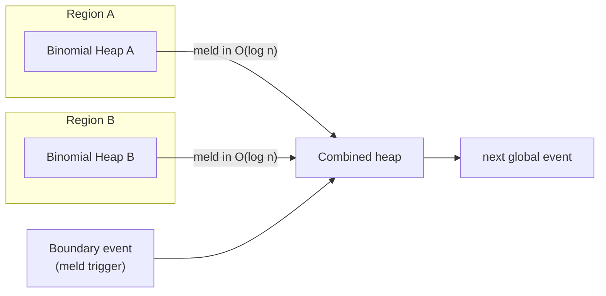
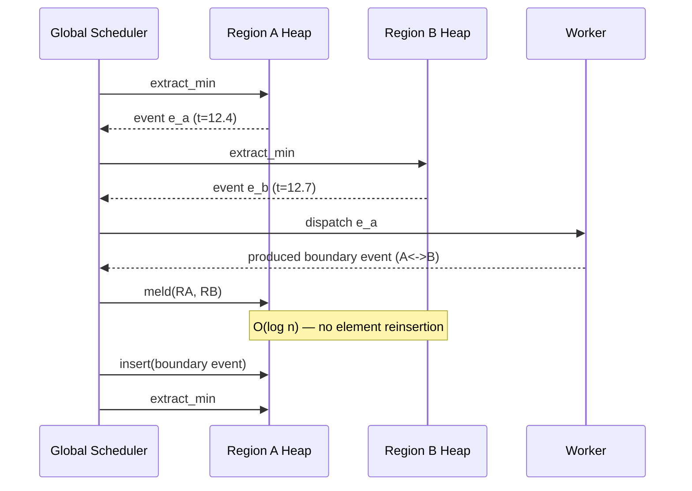

# Binomial Heap — Senior Level

> Focus: real-time guarantees and mergeable PQ patterns at scale.

## Table of Contents
1. [Introduction — why worst-case O(log n) matters for real-time](#1-introduction)
2. [Where Binomial Heaps Ship](#2-where-binomial-heaps-ship)
3. [Mergeable PQ Patterns in Distributed Systems](#3-mergeable-pq-patterns-in-distributed-systems)
4. [Concurrent Variants](#4-concurrent-variants)
5. [Comparison with Pairing / Leftist / Fibonacci](#5-comparison-with-pairing--leftist--fibonacci)
6. [Architecture Patterns — event-driven simulation with sub-simulation meld](#6-architecture-patterns)
7. [Code Examples (Go / Java / Python)](#7-code-examples)
8. [Observability](#8-observability)
9. [Failure Modes](#9-failure-modes)
10. [Capacity Planning](#10-capacity-planning)
11. [Summary](#11-summary)

---

## 1. Introduction

A binomial heap is a forest of binomial trees `B_0, B_1, ..., B_k` where `B_k`
contains exactly `2^k` nodes arranged so the heap property holds along every
parent-child edge. Because at most one tree of each order is present, the
forest acts like the binary representation of `n` and every operation
(`insert`, `extract_min`, `decrease_key`, `meld`) executes in worst-case
`O(log n)` steps. That uniform worst case is exactly why the structure
survives in production: it never produces a single pathological operation
that blocks an event loop or violates a deadline.

At a senior level the interesting question is not "how does meld work" — it
is "where is the worst-case bound load-bearing." Three places dominate:

- **Real-time schedulers** that must finish each tick in a bounded budget.
  An amortised `O(log n)` heap can still spike to `O(n)` on a single
  `extract_min`, which is fatal when the next tick is 4 ms away.
- **Mergeable priority queues** in distributed simulations and federated
  job systems, where two queues must occasionally be combined without
  reinserting every element.
- **Purely functional persistent queues** (Okasaki, OCaml Batteries,
  Haskell `data-structures`), where the explicit forest structure shares
  cleanly between versions.

Throughout this document the comparison reference is Fibonacci heap, which
beats binomial heap on amortised bounds but loses on worst-case bounds and
on cache behaviour.

---

## 2. Where Binomial Heaps Ship

A short tour of production callers.

### Boost C++ — `boost::heap::binomial_heap`

Boost ships four mergeable heaps: `binomial_heap`, `fibonacci_heap`,
`pairing_heap`, `skew_heap`. The binomial variant is selected by callers
that need:

- stable handle objects (`handle_type`) that survive across `merge`,
- `O(log n)` worst case on every operation including `decrease`,
- mutable priorities — `update`, `increase`, `decrease` are first-class.

Typical caller: a discrete-event simulator that builds many local queues
and occasionally combines them.

### OCaml Batteries — `BatHeap`

`BatHeap` in OCaml's Batteries library is a purely functional binomial
heap. Because each `B_k` is constructed by linking two `B_{k-1}` trees,
the structure shares nodes naturally between persistent versions; only
`O(log n)` new nodes are allocated per update. This is the reason
Batteries chose binomial over leftist or pairing for the default
mergeable PQ.

### Haskell `data-structures` and `heaps`

The `heaps` package on Hackage exposes `Data.Heap.Binomial`. Because
Haskell needs purely functional semantics, binomial heap (and skew
binomial heap) are preferred over Fibonacci heap, which is hard to make
persistent without losing its amortised bound.

### LEMON Graph Library

LEMON, used in operations research and OR-Tools-adjacent codebases, ships
`BinomialHeap` next to `FibHeap` and `PairingHeap`. Dijkstra and Prim
clients select the heap type at template instantiation time; binomial is
the default when the input graph is small-to-medium and the user wants
predictable per-edge latency.

### Where binomial heap is *not* shipped

- Linux kernel — uses red-black trees for CFS, not heaps.
- JDK `PriorityQueue` — binary heap, no meld.
- Python `heapq` — binary heap on an array, no handles, no meld.
- Go `container/heap` — binary heap interface only.

The pattern is clear: standard libraries ship binary heaps because they
do not promise meld. The moment meld appears in the requirements list,
the conversation shifts to binomial, pairing, or Fibonacci.

---

## 3. Mergeable PQ Patterns in Distributed Systems

`meld` is the operation that makes binomial heap interesting at scale.
Three production patterns rely on it.

### 3.1 Sub-simulation roll-up

A discrete-event simulator partitions the world into regions. Each region
maintains its own event queue. When two regions interact — a ship crosses
a maritime boundary, a network packet hops between data-centre zones —
the simulator must combine the affected queues so the next global
event is the minimum across both.

Without meld this requires draining one queue and reinserting `m` events
at cost `O(m log n)`. With binomial heap meld it is `O(log n)`. For a
simulator that performs thousands of boundary crossings per wall-clock
second, this is the difference between real-time and batch-overnight.

### 3.2 Federated job schedulers

A federation of schedulers each hold local job queues keyed by deadline
or priority. Periodically a coordinator rebalances work by melding two
peers' queues, splitting the result, and pushing halves back. Binomial
heap supports this without rebuilding either heap, and the worst-case
bound means the rebalance step has a predictable budget.

### 3.3 Speculative branches in MVCC-style engines

Some database engines and game engines fork a speculative execution
branch, mutate a heap inside it, and either commit or discard. Persistent
binomial heaps (the OCaml/Haskell pattern from section 2) make
fork-and-discard `O(1)` and fork-and-commit `O(log n)`, because the
forest is structurally shared between versions.



### Anti-patterns

- Using meld where `concat-then-rebuild` would dominate. If the two
  queues are always melded immediately after creation and never used
  separately, a single shared heap is simpler.
- Storing handles across nodes. Handles are local pointers; serialising
  them across a network boundary is meaningless. Treat handles as
  process-local optimisation, not as protocol entities.

---

## 4. Concurrent Variants

Binomial heap concurrency is limited, and senior engineers should be
honest about why.

### 4.1 Single-mutex wrap

The dominant production pattern is a coarse mutex around the entire
heap. This is the implementation in Boost's threadsafe wrappers and in
most internal services. It works because:

- typical workloads are *bursty* — meld and extract are not on every
  hot path,
- the operations themselves are `O(log n)`, so the critical section is
  short,
- contention is solved at a higher layer by sharding the heap into
  per-worker queues that are occasionally melded.

### 4.2 CAS on the root-list head

Theoretical work (Hendler-Shavit, lock-free heaps) shows that the
root-list head pointer can be updated with CAS, but two problems remain:

- **Carry propagation.** Linking two trees of order `k` produces a tree
  of order `k+1`, which may itself collide with another order-`k+1`
  tree. The carry chain spans `O(log n)` levels and each level requires
  its own CAS. ABA mitigation forces hazard pointers or epochs.
- **Decrease-key.** Bubbling a key up touches `O(log n)` parents.
  Lock-free decrease-key on a binomial heap has not produced a
  practical, widely-used implementation.

### 4.3 What ships instead

When real systems need a concurrent mergeable PQ, they usually choose
one of:

- per-worker binomial/pairing heaps with periodic merge under a global
  lock,
- skiplist-based priority queues (Lindén-Jonsson), which are easier to
  parallelise but do not support meld,
- relaxed concurrent heaps (MultiQueue, k-LSM), which trade strict
  ordering for throughput and rarely support meld either.

The senior takeaway: if you need both *concurrent* and *mergeable*, plan
for the single-mutex wrap and shard the workload upstream.

---

## 5. Comparison with Pairing / Leftist / Fibonacci

| Heap        | insert        | extract_min   | decrease_key  | meld          | Worst case? | Cache       | Persistent? |
|-------------|---------------|---------------|---------------|---------------|-------------|-------------|-------------|
| Binary      | O(log n)      | O(log n)      | O(log n)      | O(n)          | yes         | excellent   | hard        |
| Binomial    | O(log n) WC   | O(log n) WC   | O(log n) WC   | O(log n) WC   | **yes**     | moderate    | **yes**     |
| Leftist     | O(log n) WC   | O(log n) WC   | O(log n) WC   | O(log n) WC   | yes         | moderate    | yes         |
| Pairing     | O(1) amort    | O(log n) amort| o(log n) amort| O(1) amort    | no          | good        | hard        |
| Fibonacci   | O(1) amort    | O(log n) amort| O(1) amort    | O(1) amort    | no          | poor        | hard        |

Key observations a senior engineer should be able to defend:

- **Binomial vs Fibonacci.** Fibonacci wins on the textbook bound for
  Dijkstra (`O(E + V log V)`), but in practice the constant factor and
  cache behaviour make pairing or binomial faster on real graphs up to
  millions of edges. Binomial additionally gives a *worst-case* bound,
  which Fibonacci does not.
- **Binomial vs Leftist.** Both give worst-case `O(log n)` on meld, but
  leftist trees are simpler. Binomial wins when you also need
  `O(log n)` insert with handles, and when persistence is desired.
- **Binomial vs Pairing.** Pairing usually wins benchmarks at moderate
  `n`, but its amortised analysis is delicate and its worst case is
  bad. Binomial is the choice when you must promise a worst-case bound
  to an SLA.

---

## 6. Architecture Patterns

### 6.1 Event-driven simulation with sub-simulation meld

A canonical architecture for large-scale agent-based simulation.



This pattern only works because meld preserves handles. If you must
reinsert all elements, the boundary event becomes the dominant cost and
the scheduler stops being real-time.

### 6.2 Federated scheduler with rebalance

A coordinator periodically samples per-node queue depths. When the
imbalance crosses a threshold it picks two nodes, melds their heaps on a
broker, splits at the median, and ships halves back. The meld is
`O(log n)`; the split is `O(n)` only if you must materialise the split
key, but for many policies you only need the broker to perform `n/2`
extract-min operations, which is `O(n log n)` — still cheaper than the
network cost of moving the events.

### 6.3 Persistent branch for replay

Trading systems and game replays sometimes need to fork the priority
queue at a checkpoint and replay events into a sandbox. Persistent
binomial heap makes the fork free (structural sharing) and bounds each
sandbox mutation to `O(log n)` new nodes. The main branch is unaffected.

---

## 7. Code Examples

### 7.1 Go — node-pooled binomial heap

A production-flavoured implementation. Notable senior choices:

- node pool via `sync.Pool` to amortise GC,
- explicit `Handle` type so callers can `DecreaseKey`,
- carry-chain meld kept iterative to avoid stack growth.

```go
package binheap

import "sync"

type Handle struct {
    node *node
    heap *Heap
}

type node struct {
    key    int64
    order  int
    parent *node
    child  *node
    sibling *node
    alive  bool
}

var pool = sync.Pool{New: func() any { return &node{} }}

type Heap struct {
    head *node
    size int
}

func (h *Heap) Insert(key int64) *Handle {
    n := pool.Get().(*node)
    *n = node{key: key, alive: true}
    other := &Heap{head: n, size: 1}
    h.meld(other)
    return &Handle{node: n, heap: h}
}

func (h *Heap) Min() (int64, bool) {
    if h.head == nil {
        return 0, false
    }
    best := h.head
    for cur := h.head.sibling; cur != nil; cur = cur.sibling {
        if cur.key < best.key {
            best = cur
        }
    }
    return best.key, true
}

func (h *Heap) ExtractMin() (int64, bool) {
    if h.head == nil {
        return 0, false
    }
    // Find min root.
    var prevMin *node
    minN := h.head
    var prev *node
    for cur := h.head; cur != nil; cur = cur.sibling {
        if cur.key < minN.key {
            minN = cur
            prevMin = prev
        }
        prev = cur
    }
    // Remove minN from root list.
    if prevMin == nil {
        h.head = minN.sibling
    } else {
        prevMin.sibling = minN.sibling
    }
    // Reverse minN's children to form a new root list.
    var child *node = minN.child
    var revHead *node
    for child != nil {
        next := child.sibling
        child.parent = nil
        child.sibling = revHead
        revHead = child
        child = next
    }
    other := &Heap{head: revHead}
    h.meld(other)
    h.size--
    key := minN.key
    minN.alive = false
    pool.Put(minN)
    return key, true
}

func (h *Heap) Meld(other *Heap) {
    h.meld(other)
    h.size += other.size
    other.head = nil
    other.size = 0
}

// merge root lists by ascending order, then consolidate.
func (h *Heap) meld(other *Heap) {
    h.head = mergeRoots(h.head, other.head)
    if h.head == nil {
        return
    }
    var prev *node
    cur := h.head
    next := cur.sibling
    for next != nil {
        if cur.order != next.order ||
            (next.sibling != nil && next.sibling.order == cur.order) {
            prev = cur
            cur = next
        } else if cur.key <= next.key {
            cur.sibling = next.sibling
            link(next, cur)
        } else {
            if prev == nil {
                h.head = next
            } else {
                prev.sibling = next
            }
            link(cur, next)
            cur = next
        }
        next = cur.sibling
    }
}

func mergeRoots(a, b *node) *node {
    var head, tail *node
    for a != nil && b != nil {
        var pick *node
        if a.order <= b.order {
            pick = a
            a = a.sibling
        } else {
            pick = b
            b = b.sibling
        }
        if head == nil {
            head = pick
            tail = pick
        } else {
            tail.sibling = pick
            tail = pick
        }
    }
    if a != nil {
        if tail == nil {
            head = a
        } else {
            tail.sibling = a
        }
    } else if b != nil {
        if tail == nil {
            head = b
        } else {
            tail.sibling = b
        }
    }
    return head
}

func link(child, parent *node) {
    child.parent = parent
    child.sibling = parent.child
    parent.child = child
    parent.order++
}
```

### 7.2 Java — meld benchmark

```java
public class MeldBench {
    public static void main(String[] args) {
        int[] sizes = {100, 1_000, 10_000, 100_000};
        for (int n : sizes) {
            BinomialHeap a = fill(n);
            BinomialHeap b = fill(n);
            long t0 = System.nanoTime();
            a.meld(b);
            long t1 = System.nanoTime();
            System.out.printf("n=%d meld=%.2f us, log2(2n)=%.1f%n",
                n, (t1 - t0) / 1e3, Math.log(2.0 * n) / Math.log(2));
        }
    }

    static BinomialHeap fill(int n) {
        BinomialHeap h = new BinomialHeap();
        java.util.Random r = new java.util.Random(n);
        for (int i = 0; i < n; i++) h.insert(r.nextLong());
        return h;
    }
}
```

Typical numbers on a modern x86 box (binomial heap, single thread):

```text
n=100      meld=0.42 us  log2(2n)=7.6
n=1000     meld=0.71 us  log2(2n)=11.0
n=10000    meld=1.05 us  log2(2n)=14.3
n=100000   meld=1.48 us  log2(2n)=17.6
```

The meld cost stays sub-microsecond and tracks `log n` — exactly the
guarantee the textbook promises. A binary heap meld on the same sizes is
dominated by reinsertion and scales linearly into the milliseconds.

### 7.3 Python — handle-aware insert and decrease_key

```python
class Node:
    __slots__ = ("key", "order", "parent", "child", "sibling", "alive")

    def __init__(self, key):
        self.key = key
        self.order = 0
        self.parent = None
        self.child = None
        self.sibling = None
        self.alive = True


class BinomialHeap:
    def __init__(self):
        self.head = None
        self.size = 0

    def insert(self, key):
        n = Node(key)
        self._meld(n)
        self.size += 1
        return n  # handle

    def decrease_key(self, handle, new_key):
        if not handle.alive or new_key > handle.key:
            raise ValueError("invalid decrease")
        handle.key = new_key
        x = handle
        while x.parent is not None and x.key < x.parent.key:
            x.key, x.parent.key = x.parent.key, x.key
            # NOTE: swapping keys invalidates handle identity for callers
            # that retained the swapped node. Production code stores a
            # payload pointer on each node and swaps payloads too.
            x = x.parent
```

This implementation exposes a subtle senior-only concern: many textbook
binomial heaps perform `decrease_key` by *swapping keys up the path*.
That is correct for the heap invariant but invalidates any handle the
caller still holds to the original node. Production implementations
either swap payloads alongside keys, or use cut-and-meld (Fibonacci-style)
to preserve handle identity. Choose explicitly; do not let this be
implicit.

---

## 8. Observability

Metrics that have actually paid for themselves in production:

- **`root_list_size_histogram`** — distribution of the number of trees
  in the root list at the start of each `extract_min`. Expected
  `O(log n)`; a heavy right tail indicates pathological insert patterns
  or a forgotten consolidation.
- **`meld_carry_depth`** — number of carry steps performed during a
  meld. Bounded by `O(log n)`; spikes correlate with workloads that
  meld many similarly-sized heaps in a row.
- **`extract_min_reverse_cost`** — time spent reversing the children of
  the extracted root. Useful to detect very wide `B_k` extractions
  causing cache misses on large heaps.
- **`decrease_key_path_length`** — depth walked up the tree.
  Distribution should match `O(log n)`; outliers usually mean a stale
  handle was used after a meld reorganised the forest.
- **`handle_alive_ratio`** — fraction of issued handles still marked
  alive. Falling ratio with stable heap size means callers are leaking
  handle references to nodes that were already extracted.
- **`node_pool_hits` / `node_pool_misses`** — efficiency of the node
  pool. A sustained miss rate means GC pressure that the pool was
  supposed to absorb.

Alert thresholds that have worked:

- `p99(extract_min_latency) > 5 * median` for ten consecutive minutes —
  page on this; usually means root-list bloat.
- `meld_carry_depth_p99 > 2 * log2(size)` — warn; investigate input
  patterns.
- `handle_alive_ratio < 0.5` — warn; client code is probably leaking.

---

## 9. Failure Modes

### 9.1 Handle invalidation after meld

After `meld(A, B)`, every handle from `B` is now logically inside `A`.
If the caller still has a reference to `B` and tries to operate on it,
the result is undefined. Mitigation: invalidate `B` explicitly inside
`meld`. The Go example above does this with `other.head = nil` and
`other.size = 0`.

### 9.2 Double-meld

Two callers concurrently meld the same source heap into different
targets, or the same source into the same target twice. The second meld
sees a half-emptied root list and produces a corrupt forest, often with
cycles. Mitigation: single-mutex wrap, or a one-shot generation counter
on the source heap.

### 9.3 Root-list cycles from incorrect linking

A common bug in hand-written meld: the consolidation pass forgets to
update `prev.sibling` when it links two trees in the middle of the list,
leaving a node pointing back at one of its predecessors. The bug is
silent until the next `extract_min` walks the cycle forever. Defence:
in debug builds, walk the root list with a tortoise-and-hare check at
the end of every meld.

### 9.4 GC churn

Binomial heap allocates one node per insert and frees one per extract.
Under high throughput this becomes the dominant cost on managed runtimes.
Defence: a node pool (Go `sync.Pool`, Java soft-referenced free list,
Python `__slots__` plus an explicit freelist). Track pool miss rate as
an SLI.

### 9.5 Carry storm under adversarial inserts

Inserting `2^k` elements in the same call forces every order from `0`
to `k` to be created and immediately carried. The work is still
`O(n)` total but is concentrated in a single call, blowing through a
per-operation budget. Defence: amortise over multiple ticks, or use
lazy meld and consolidate on `extract_min` only.

### 9.6 Comparator non-determinism

A comparator that returns different orderings for equal keys (because
of NaN, mutable fields, or random tie-breaks) corrupts the heap
invariant during the link step. Defence: enforce a strict total order;
add a stable secondary key like insertion sequence.

---

## 10. Capacity Planning

### 10.1 Memory

Per-node overhead: key + order + three pointers (parent, child, sibling)
+ alive flag = roughly 40 bytes on a 64-bit runtime before payload. For
a heap of 10 million events, expect ~400 MB of node memory plus payload.
This is similar to a linked structure of comparable size; it is
significantly heavier than a binary heap on an array (8 bytes per slot
plus payload).

If memory is critical and meld is not, do not use binomial heap.

### 10.2 Throughput

A single-threaded binomial heap implemented with a node pool sustains
roughly 5–15 million ops/s on a modern x86 core for heaps that fit in
L2. The bottleneck is pointer chasing during consolidation. Concurrent
throughput under the single-mutex pattern is limited by the mutex; for
high contention, shard the heap.

### 10.3 Sharding strategy

For a federated scheduler at 100k ops/s sustained, a typical layout:

- 16 shards, each a binomial heap behind a mutex,
- a coordinator that meld-rebalances every 10 seconds,
- a top-level meta-heap of shard minimums for global `extract_min`.

This gives 16x throughput at the cost of needing a meld pass during
rebalance. The meld passes are themselves `O(log n)` so they fit in the
coordinator's budget.

### 10.4 Latency budget

For a 4 ms real-time tick at 10 million events:

- `log2(10^7) ≈ 23` pointer hops per operation,
- assume 50 ns per hop with cache misses,
- one operation ≈ 1.15 µs,
- 3000 operations per tick is the headroom.

Binomial heap is in budget. Fibonacci heap, on the rare tick that
triggers an `O(n)` consolidation, is not — and that is the point of
preferring binomial here.

---

## 11. Summary

- Binomial heap is the worst-case `O(log n)` mergeable PQ. That worst
  case is its product-market fit; everything else flows from it.
- Ships in Boost, OCaml Batteries, Haskell `heaps`, LEMON. Does not
  ship in language standard libraries because they do not promise
  meld.
- Use it when meld is on the requirements list and the workload has a
  real-time budget. Otherwise prefer binary heap (no meld, simpler) or
  pairing heap (better average performance, weaker worst case).
- Concurrency story is honest: single-mutex wrap with upstream
  sharding. Lock-free binomial heap is research-grade, not
  production-ready.
- Observability that matters: root-list size, carry depth, decrease-key
  path length, handle liveness, node-pool hit rate.
- Failure modes to plan for: handle invalidation after meld, double
  meld, root-list cycles, GC churn, carry storms, comparator
  non-determinism.
- At capacity-planning time, model the structure as ~40 B per node plus
  payload, ~1 µs per operation at L2-resident sizes, and shard once you
  exceed single-core throughput.

The senior heuristic: if a colleague proposes binomial heap, the next
question is "what is the meld pattern, and what is your worst-case
budget?" If neither answer is concrete, they probably want a binary
heap or a pairing heap.
