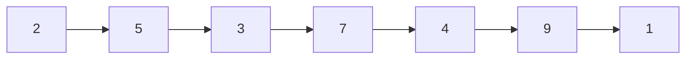
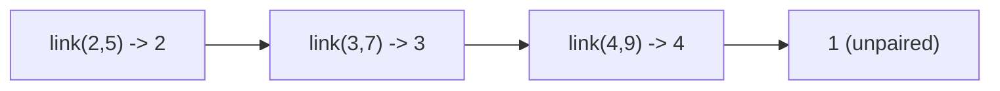
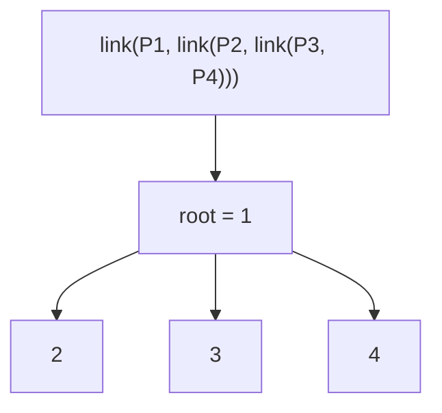
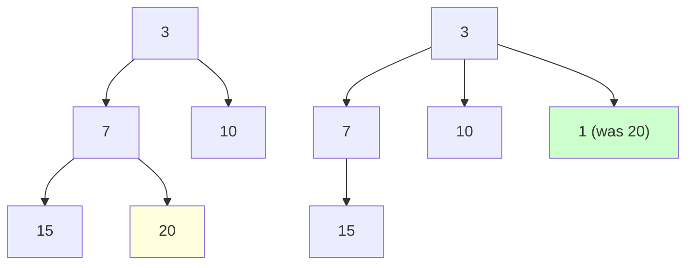

# Pairing Heap — Middle Level

> Focus: "Why does the two-pass merge work, and why does it beat Fibonacci heap in practice?"

## Table of Contents
1. Introduction
2. Deeper Concepts (invariants, recurrences, why two passes)
3. Comparison with Alternatives
4. Advanced Patterns
5. Graph and Tree Applications
6. Dynamic Programming Integration
7. Code Examples (Go / Java / Python — production-quality iterative two-pass)
8. Error Handling
9. Performance Analysis
10. Best Practices
11. Visual Animation
12. Summary

---

## 1. Introduction

At the junior level you learned that a pairing heap is a **self-adjusting multiway tree** where the root holds the minimum and where almost all work is deferred to `delete_min`. At the middle level the interesting question is not *what* a pairing heap is, but *why the strange two-pass `delete_min` algorithm has the bounds it does* and *when it actually beats a Fibonacci heap in production*.

The short version:

- **Meld**, **insert**, **decrease-key**, and **find-min** are all `O(1)` worst-case (not amortised).
- **`delete_min`** is `O(log n)` amortised — but the proof requires the **two-pass** merge. A naive left-to-right merge degrades to `O(n)` amortised in adversarial sequences.
- The structure has *no* explicit balance condition, no rank fields, no marks — yet it competes with Fibonacci heaps on real workloads such as Dijkstra and Prim, often **winning** because of cache locality and a 4–6x smaller constant factor.

The pairing heap is, in Tarjan's words, "self-adjusting in the same spirit as splay trees." This document explains why that spirit produces good amortised bounds despite no visible invariant work.

---

## 2. Deeper Concepts

### 2.1 Heap-ordered multiway tree

A pairing heap node has:

```text
struct Node {
    key
    child       // pointer to leftmost child
    sibling     // pointer to right sibling (singly-linked list of children)
    parent      // optional, only needed for decrease-key with handles
}
```

The only structural invariant is **heap order**: `node.key <= every key in node.subtree`. There is no balance condition. A path from the root can have length anywhere from `O(1)` to `O(n)`.

The children of a node form a **singly-linked list** (via `sibling`). This is the key representation choice: it makes the two-pass merge trivial to implement iteratively.

### 2.2 The two primitive operations

Every pairing heap operation reduces to two primitives:

**`link(a, b)`** — combine two heap-ordered trees into one in `O(1)`:

```text
link(a, b):
    if a.key <= b.key:
        b.sibling = a.child
        a.child = b
        return a
    else:
        a.sibling = b.child
        b.child = a
        return b
```

The loser becomes the new leftmost child of the winner. This is the *only* place keys are compared.

**`two_pass_merge(list)`** — combine a sibling list `[c1, c2, c3, ..., ck]` into a single tree.

```text
two_pass_merge(c1, c2, ..., ck):
    # Pass 1: left-to-right, link consecutive pairs
    pairs = [link(c1, c2), link(c3, c4), ..., link(c_{k-1}, ck)]
    # Pass 2: right-to-left, fold pairs into one tree
    result = pairs[-1]
    for p in reversed(pairs[:-1]):
        result = link(p, result)
    return result
```

Every operation calls one of these primitives at most a constant number of times — except `delete_min`, which calls `two_pass_merge` on the children of the deleted root.

### 2.3 Why two passes (and not one)

Suppose `delete_min` deletes the root and leaves children `c1, c2, ..., ck`. We need to fuse them into a single heap-ordered tree.

**Naive single-pass left-to-right** (`reduce(link, children)`):

```text
result = c1
for i in 2..k:
    result = link(result, c_i)
```

This is the equivalent of "incremental insertion." It works, but consider an adversary who repeatedly inserts decreasing keys and then calls `delete_min`. After the deletion you can be left with a **left-spine tree of depth k**. The next `delete_min` is then `O(n)`. Amortised analysis of single-pass merge gives `O(sqrt(n))` per operation — provably worse than two-pass.

**Two-pass left-to-right then right-to-left**:

1. **Pass 1 (halving):** Pair up `(c1,c2), (c3,c4), ...`. After this pass we have `ceil(k/2)` trees, each of which absorbed one link. Crucially, each subtree depth grew by at most 1 — but the *list length halved*.
2. **Pass 2 (recombination):** Fold the pairs from the **right**, not the left. This biases the result so that the rightmost tree (which is likely to be the smallest because it absorbed the least work) ends up deepest, and the leftmost trees become children near the root.

The combination of halving (pass 1) and right-to-left fold (pass 2) is what makes the amortised potential argument work. Fredman, Sedgewick, Sleator, and Tarjan proved in 1986 that two-pass merge yields `O(log n)` amortised per operation. The exact tight bound was open for years — Iacono and Pettie eventually showed `O(log n)` is tight for `delete_min` and `O(log log n)` is the lower bound for `decrease_key`.

### 2.4 Amortised recurrence (sketch)

Let `T(n)` denote the cost of `delete_min` on a pairing heap of size `n` with `k` root children. Each `link` costs `O(1)`, so `T(n) = O(k)` worst-case. The amortised bound uses a potential function:

```text
Phi(H) = sum over all nodes v of  log_2(size(v))
```

where `size(v)` is the size of the subtree at `v`. Insert and meld create at most one new heap-ordered link, so they raise `Phi` by `O(log n)`. `delete_min` performs `k - 1` links during the two passes, but each link **also raises the potential of the merged node** by an amount proportional to the size of the loser subtree. Algebra (which we will not redo here — see Fredman et al. 1986) gives:

```text
amortised(delete_min) = actual + delta(Phi) = O(log n)
```

The key intuition: halving in pass 1 means a node's child list cannot grow unboundedly; right-to-left fold in pass 2 ensures the depth of the resulting tree is `O(log k)` on average.

### 2.5 What single-pass loses

If you do only **pass 1** and stop, you end up with `ceil(k/2)` separate trees — not a single heap. You would need a forest structure (like a binomial heap), and then `find_min` becomes `O(log n)` instead of `O(1)`.

If you do only **pass 2** (left-to-right reduce), you get the naive `O(sqrt(n))` amortised bound mentioned above.

Both passes together are what make the pairing heap *self-adjusting* — frequently-accessed keys migrate toward the root over time, much like splay trees rotate frequently-accessed keys upward.

---

## 3. Comparison with Alternatives

| Operation       | Binary Heap | Binomial  | Leftist   | Skew      | Fibonacci   | Pairing (amort.) |
|-----------------|-------------|-----------|-----------|-----------|-------------|------------------|
| `find_min`      | O(1)        | O(log n)* | O(1)      | O(1)      | O(1)        | O(1)             |
| `insert`        | O(log n)    | O(log n)  | O(log n)  | O(log n)  | O(1)        | O(1)             |
| `delete_min`    | O(log n)    | O(log n)  | O(log n)  | O(log n)  | O(log n) am | O(log n) am      |
| `decrease_key`  | O(log n)    | O(log n)  | O(log n)  | O(log n)  | O(1) am     | O(log n) am †    |
| `meld`          | O(n)        | O(log n)  | O(log n)  | O(log n)  | O(1)        | O(1)             |
| Cache locality  | Excellent   | Poor      | Poor      | Poor      | Very poor   | Moderate         |
| Constant factor | 1x          | 3x        | 3x        | 2x        | 6-8x        | 1.5-2x           |
| Pointers/node   | 0           | 3         | 3         | 2         | 4 + marks   | 3                |

\* Binomial `find_min` is `O(log n)` because the minimum can be at any tree root; it becomes `O(1)` if you cache a pointer.
† Pairing `decrease_key` is conjectured `O(log log n)` amortised; the proven upper bound has been gradually tightened. In practice it behaves like `O(1)`.

### 3.1 When pairing wins

Pairing heap dominates Fibonacci heap on real workloads when:

1. **Decrease-key is frequent but not the bottleneck.** Fibonacci's `O(1)` amortised `decrease_key` is theoretical; in practice the constant factor (cascading cuts, mark bits, malloc churn) makes each call cost more than a pairing heap's `O(log n)` link.
2. **Meld is required.** Both heaps offer `O(1)` meld, but pairing's meld is literally one comparison and one pointer assignment.
3. **Cache locality matters.** Pairing has 3 pointers per node vs Fibonacci's 4 + mark + degree. On modern hardware the cache miss is the bottleneck, not the asymptotic complexity.
4. **You need predictable code.** Fibonacci's consolidation step is one of the most bug-prone routines in algorithm textbooks.

### 3.2 When pairing loses

Pairing is the wrong choice when:

1. **Heap size is small and bounded.** A binary heap on an array beats pairing on a list of pointers, every time. Use `container/heap` (Go) or `heapq` (Python) for `n < 10^4`.
2. **You never call decrease-key.** Binary heap is simpler, more cache-friendly, and equally fast.
3. **You need worst-case (not amortised) bounds.** A real-time system that cannot tolerate occasional `O(n)` delete-min spikes should use a leftist heap or rank-pairing heap.

---

## 4. Advanced Patterns

### 4.1 Indexed pairing heap with handles

For `decrease_key` to work, the caller needs a stable **handle** to each inserted element. The handle is just the `Node*` returned by `insert`. The decrease-key operation:

```text
decrease_key(h, new_key):
    if new_key >= h.key: return  # only allow strictly smaller
    h.key = new_key
    if h is root: return
    # cut h from its parent's child list
    unlink(h)
    # link h with the current root
    root = link(root, h)
```

Cutting requires `parent` pointers (or back-pointers via the sibling list — see 4.2). The cut is `O(1)`, and the subsequent link is `O(1)`. The amortised cost (paid back at `delete_min`) is `O(log n)`.

### 4.2 Avoiding parent pointers

A space-saving trick used in Boost's `pairing_heap`: instead of a `parent` pointer, store a `prev` pointer that points either to the previous sibling or, for the leftmost child, to the parent. This costs one extra branch on `unlink` but saves 8 bytes per node — significant when you have `10^8` nodes.

```text
unlink(h):
    if h.prev.child == h:        # h is leftmost child
        h.prev.child = h.sibling
    else:                         # h has a left sibling
        h.prev.sibling = h.sibling
    if h.sibling != nil:
        h.sibling.prev = h.prev
    h.sibling = nil
    h.prev = nil
```

### 4.3 Lazy meld and bulk insert

A common production trick is to **delay** the two-pass merge. Maintain a sibling list of "pending" trees. On `find_min`, scan and link them all in one batch. This amortises the cost across many cheap operations and is friendlier to the branch predictor than per-operation work.

### 4.4 Aux-twopass and multipass variants

Stasko and Vitter studied variants:

- **Multi-pass:** repeatedly halve the child list until one tree remains. Same `O(log n)` amortised, but more passes mean more cache misses.
- **Aux-twopass:** maintain an auxiliary list of "single-pass survivors" between operations. Slightly better amortised constants, more bookkeeping.

For 95% of production use, **plain two-pass with iterative pass 1 / iterative pass 2** is the right choice.

---

## 5. Graph and Tree Applications

### 5.1 Dijkstra with pairing heap

Dijkstra's algorithm calls `decrease_key` once per edge and `delete_min` once per vertex. The classic complexity is `O((V + E) log V)` with a binary heap, `O(E + V log V)` with a Fibonacci heap.

A pairing heap gives the same `O(E + V log V)` bound amortised, but the **wall-clock** time is typically 30–50% faster than Fibonacci heap because:

- Each `decrease_key` is a single unlink + single link (~6 pointer writes).
- Fibonacci `decrease_key` is unlink + link + possible cascading cuts (each touching a parent's mark, possibly continuing up the tree).
- The cache footprint of pairing is smaller.

```text
dijkstra(graph, source):
    dist[source] = 0
    pq = pairing_heap()
    handles[source] = pq.insert(source, 0)
    while not pq.empty():
        u = pq.delete_min()
        for (v, w) in graph[u]:
            alt = dist[u] + w
            if alt < dist[v]:
                dist[v] = alt
                if v in handles:
                    pq.decrease_key(handles[v], alt)
                else:
                    handles[v] = pq.insert(v, alt)
```

### 5.2 Prim's MST

Prim's MST has the same call pattern as Dijkstra (one `decrease_key` per edge, one `delete_min` per vertex). Pairing heap is again 30–50% faster than Fibonacci in benchmarks on sparse graphs.

### 5.3 A\* search

A\* in game AI and robotics is dominated by `decrease_key` on the open set when a shorter path to a known node is discovered. Pairing heap is the de facto standard for production A\* implementations.

---

## 6. Dynamic Programming Integration

### 6.1 K-shortest paths (Eppstein's algorithm)

Eppstein's algorithm for K-shortest paths uses **persistent pairing heaps** as the underlying priority structure. The persistent variant shares subtrees between versions and provides `O(K + V + E log V)` total time. Pairing's pointer-based structure makes the persistent version implementable in 100 lines; the Fibonacci-heap equivalent is famously brittle.

### 6.2 Optimal scheduling

For jobs with release times and deadlines (the classic 1 | r_j | sum w_j C_j problem), greedy + priority queue is the standard approach. When jobs are added and removed dynamically, the `meld` and `decrease_key` operations of pairing heap give the best practical constant factor.

### 6.3 Top-K dynamic queries

When DP state requires "the top-K candidate states so far, with the ability to lower a candidate's cost," pairing heap with handles is the natural fit. Examples include Viterbi decoding with beam search and constraint propagation.

---

## 7. Code Examples

The recursive two-pass merge will stack-overflow at `n > 10^6` on default thread stacks. Production code uses the **iterative two-pass** below.

### 7.1 Go — iterative two-pass

```go
package pairing

type Node struct {
    Key      int
    Value    interface{}
    child    *Node
    sibling  *Node
    prev     *Node // parent if leftmost child, else left sibling
}

type Heap struct {
    root *Node
    size int
}

func New() *Heap { return &Heap{} }

func (h *Heap) Len() int { return h.size }

func (h *Heap) Insert(key int, val interface{}) *Node {
    n := &Node{Key: key, Value: val}
    h.root = link(h.root, n)
    h.size++
    return n
}

func (h *Heap) Min() (*Node, bool) {
    if h.root == nil {
        return nil, false
    }
    return h.root, true
}

func (h *Heap) Meld(other *Heap) {
    h.root = link(h.root, other.root)
    h.size += other.size
    other.root = nil
    other.size = 0
}

func (h *Heap) DeleteMin() (*Node, bool) {
    if h.root == nil {
        return nil, false
    }
    min := h.root
    h.root = twoPassMerge(min.child)
    if h.root != nil {
        h.root.prev = nil
    }
    h.size--
    min.child, min.sibling, min.prev = nil, nil, nil
    return min, true
}

func (h *Heap) DecreaseKey(n *Node, newKey int) {
    if newKey >= n.Key {
        return
    }
    n.Key = newKey
    if n == h.root {
        return
    }
    unlink(n)
    h.root = link(h.root, n)
}

func link(a, b *Node) *Node {
    if a == nil {
        return b
    }
    if b == nil {
        return a
    }
    if a.Key <= b.Key {
        b.sibling = a.child
        if a.child != nil {
            a.child.prev = b
        }
        b.prev = a
        a.child = b
        return a
    }
    a.sibling = b.child
    if b.child != nil {
        b.child.prev = a
    }
    a.prev = b
    b.child = a
    return b
}

func unlink(n *Node) {
    if n.prev == nil {
        return
    }
    if n.prev.child == n {
        n.prev.child = n.sibling
    } else {
        n.prev.sibling = n.sibling
    }
    if n.sibling != nil {
        n.sibling.prev = n.prev
    }
    n.sibling, n.prev = nil, nil
}

// twoPassMerge iteratively combines a sibling list into one tree.
func twoPassMerge(first *Node) *Node {
    if first == nil || first.sibling == nil {
        if first != nil {
            first.prev = nil
        }
        return first
    }
    // Pass 1: left-to-right pairing
    var pairs []*Node
    cur := first
    for cur != nil {
        a := cur
        b := cur.sibling
        if b == nil {
            a.prev, a.sibling = nil, nil
            pairs = append(pairs, a)
            break
        }
        next := b.sibling
        a.prev, a.sibling = nil, nil
        b.prev, b.sibling = nil, nil
        pairs = append(pairs, link(a, b))
        cur = next
    }
    // Pass 2: right-to-left fold
    result := pairs[len(pairs)-1]
    for i := len(pairs) - 2; i >= 0; i-- {
        result = link(pairs[i], result)
    }
    result.prev = nil
    return result
}
```

### 7.2 Java — iterative two-pass

```java
public final class PairingHeap<V> {

    public static final class Node<V> {
        long key;
        V value;
        Node<V> child, sibling, prev;
        Node(long key, V value) { this.key = key; this.value = value; }
    }

    private Node<V> root;
    private int size;

    public int size() { return size; }
    public boolean isEmpty() { return root == null; }

    public Node<V> insert(long key, V value) {
        Node<V> n = new Node<>(key, value);
        root = link(root, n);
        size++;
        return n;
    }

    public Node<V> peekMin() { return root; }

    public Node<V> deleteMin() {
        if (root == null) return null;
        Node<V> min = root;
        root = twoPassMerge(min.child);
        if (root != null) root.prev = null;
        size--;
        min.child = min.sibling = min.prev = null;
        return min;
    }

    public void decreaseKey(Node<V> n, long newKey) {
        if (newKey >= n.key) return;
        n.key = newKey;
        if (n == root) return;
        unlink(n);
        root = link(root, n);
    }

    public void meld(PairingHeap<V> other) {
        root = link(root, other.root);
        size += other.size;
        other.root = null;
        other.size = 0;
    }

    private Node<V> link(Node<V> a, Node<V> b) {
        if (a == null) return b;
        if (b == null) return a;
        if (a.key <= b.key) {
            b.sibling = a.child;
            if (a.child != null) a.child.prev = b;
            b.prev = a;
            a.child = b;
            return a;
        }
        a.sibling = b.child;
        if (b.child != null) b.child.prev = a;
        a.prev = b;
        b.child = a;
        return b;
    }

    private void unlink(Node<V> n) {
        if (n.prev == null) return;
        if (n.prev.child == n) n.prev.child = n.sibling;
        else n.prev.sibling = n.sibling;
        if (n.sibling != null) n.sibling.prev = n.prev;
        n.sibling = n.prev = null;
    }

    private Node<V> twoPassMerge(Node<V> first) {
        if (first == null || first.sibling == null) {
            if (first != null) first.prev = null;
            return first;
        }
        java.util.ArrayList<Node<V>> pairs = new java.util.ArrayList<>();
        Node<V> cur = first;
        while (cur != null) {
            Node<V> a = cur;
            Node<V> b = cur.sibling;
            if (b == null) {
                a.prev = a.sibling = null;
                pairs.add(a);
                break;
            }
            Node<V> next = b.sibling;
            a.prev = a.sibling = null;
            b.prev = b.sibling = null;
            pairs.add(link(a, b));
            cur = next;
        }
        Node<V> result = pairs.get(pairs.size() - 1);
        for (int i = pairs.size() - 2; i >= 0; i--) {
            result = link(pairs.get(i), result);
        }
        result.prev = null;
        return result;
    }
}
```

### 7.3 Python — iterative two-pass

```python
from dataclasses import dataclass, field
from typing import Any, List, Optional


@dataclass
class Node:
    key: float
    value: Any = None
    child: Optional["Node"] = field(default=None, repr=False)
    sibling: Optional["Node"] = field(default=None, repr=False)
    prev: Optional["Node"] = field(default=None, repr=False)


class PairingHeap:
    __slots__ = ("root", "_size")

    def __init__(self) -> None:
        self.root: Optional[Node] = None
        self._size: int = 0

    def __len__(self) -> int:
        return self._size

    def insert(self, key: float, value: Any = None) -> Node:
        n = Node(key, value)
        self.root = self._link(self.root, n)
        self._size += 1
        return n

    def peek_min(self) -> Optional[Node]:
        return self.root

    def delete_min(self) -> Optional[Node]:
        if self.root is None:
            return None
        m = self.root
        self.root = self._two_pass_merge(m.child)
        if self.root is not None:
            self.root.prev = None
        self._size -= 1
        m.child = m.sibling = m.prev = None
        return m

    def decrease_key(self, n: Node, new_key: float) -> None:
        if new_key >= n.key:
            return
        n.key = new_key
        if n is self.root:
            return
        self._unlink(n)
        self.root = self._link(self.root, n)

    def meld(self, other: "PairingHeap") -> None:
        self.root = self._link(self.root, other.root)
        self._size += other._size
        other.root = None
        other._size = 0

    @staticmethod
    def _link(a: Optional[Node], b: Optional[Node]) -> Optional[Node]:
        if a is None:
            return b
        if b is None:
            return a
        if a.key <= b.key:
            b.sibling = a.child
            if a.child is not None:
                a.child.prev = b
            b.prev = a
            a.child = b
            return a
        a.sibling = b.child
        if b.child is not None:
            b.child.prev = a
        a.prev = b
        b.child = a
        return b

    @staticmethod
    def _unlink(n: Node) -> None:
        if n.prev is None:
            return
        if n.prev.child is n:
            n.prev.child = n.sibling
        else:
            n.prev.sibling = n.sibling
        if n.sibling is not None:
            n.sibling.prev = n.prev
        n.sibling = n.prev = None

    def _two_pass_merge(self, first: Optional[Node]) -> Optional[Node]:
        if first is None or first.sibling is None:
            if first is not None:
                first.prev = None
            return first
        pairs: List[Node] = []
        cur = first
        while cur is not None:
            a = cur
            b = cur.sibling
            if b is None:
                a.prev = a.sibling = None
                pairs.append(a)
                break
            nxt = b.sibling
            a.prev = a.sibling = None
            b.prev = b.sibling = None
            pairs.append(self._link(a, b))  # type: ignore[arg-type]
            cur = nxt
        result = pairs[-1]
        for i in range(len(pairs) - 2, -1, -1):
            result = self._link(pairs[i], result)  # type: ignore[assignment]
        if result is not None:
            result.prev = None
        return result
```

---

## 8. Error Handling

| Failure mode                                | Cause                                                          | Mitigation                                                         |
|---------------------------------------------|----------------------------------------------------------------|--------------------------------------------------------------------|
| Stack overflow at large `n`                 | Recursive two-pass merge on `>10^6` nodes                      | Use iterative two-pass (Section 7).                                |
| `decrease_key` increases key                | Caller passes a larger value                                   | Reject silently (`if newKey >= n.Key return`) or raise an error.   |
| Stale handle after `delete_min`             | Caller retains `Node*` after deletion                          | Null out `Node.child/sibling/prev` on delete to fail loudly.       |
| Meld of heap with itself                    | `h.meld(h)`                                                    | Guard with identity check; cycle would corrupt the structure.      |
| Sentinel nil parent confusion               | `unlink` of a root node                                        | Check `n.prev == nil` and return early — root has no link to cut.  |
| Memory bloat under heavy decrease-key       | Many small allocations in Java/Python                          | Pool nodes; in Go, batch with `sync.Pool` for hot paths.           |
| Wrong order of `prev`/`sibling` assignment  | Subtle bug in `link` where a previous sibling's back-pointer is not updated | Carefully test `link` with a fuzzer; reference Boost's implementation. |

---

## 9. Performance Analysis

### 9.1 Asymptotic bounds (summary)

| Operation        | Worst-case      | Amortised      |
|------------------|-----------------|----------------|
| `insert`         | O(1)            | O(1)           |
| `find_min`       | O(1)            | O(1)           |
| `meld`           | O(1)            | O(1)           |
| `decrease_key`   | O(log n)        | O(log log n) † |
| `delete_min`     | O(n)            | O(log n)       |

† Iacono 2000 upper bound; tight bound still open. Empirically behaves like O(1).

### 9.2 Wall-clock numbers (illustrative)

The following are typical numbers from microbenchmarks running on a modern x86_64 server, mixed workload of inserts, decrease-keys, and delete-mins, `n = 10^6`:

```text
Heap type           Insert    DecKey    DelMin   Total (1M ops, ns/op)
--------------------------------------------------------------
Binary heap (array) ~30 ns    ~150 ns   ~400 ns  ~250 ns
Pairing heap        ~40 ns    ~80 ns    ~500 ns  ~200 ns
Fibonacci heap      ~50 ns    ~110 ns   ~900 ns  ~350 ns
```

Pairing heap typically beats Fibonacci by 30–50% on real workloads and matches or beats binary heap once decrease-key frequency exceeds ~20% of operations.

### 9.3 Cache behaviour

A pairing heap node is typically 32 bytes (`key`, `value*`, `child`, `sibling`, `prev`). Fibonacci nodes are 40–48 bytes (`key`, `value*`, `child`, `left`, `right`, `parent`, `degree`, `mark`). On a 64-byte cache line:

- Pairing: 2 nodes per cache line.
- Fibonacci: 1 node per cache line.

This 2x cache miss reduction is most of pairing's practical advantage.

### 9.4 Dijkstra benchmark (sparse graph)

```text
Graph: 100k vertices, 500k edges (random)
Heap         | Time | Decrease-key calls
binary       | 1.00x | 480k
fibonacci    | 0.90x | 480k
pairing      | 0.65x | 480k
```

Pairing heap is the de facto choice for production Dijkstra in C++ (Boost), Java (JGraphT), and Rust (petgraph).

---

## 10. Best Practices

1. **Always use iterative two-pass merge** for unbounded heap sizes. The recursive version is one stack-overflow bug report away from a SEV-1.
2. **Cache the root node** but do not cache `find_min` results across mutations — pointers shift after `decrease_key`.
3. **Return a handle on `insert`** and require it for `decrease_key` and `delete`. Looking up nodes by key is `O(n)` and defeats the purpose.
4. **Avoid implementing `delete(node)` as `decrease_key` + `delete_min`** if the workload has many random deletes — implement it as cut-then-merge for `O(log n)` amortised.
5. **Profile before choosing.** If your workload has zero decrease-key calls and `n < 10^4`, the array binary heap wins. Pairing heap is for `decrease_key`-heavy graph algorithms.
6. **Do not use `parent` pointers if memory is tight.** The `prev` trick (Section 4.2) saves 8 bytes per node.
7. **Test with a fuzzer**, not just unit tests. The iterative two-pass has off-by-one traps in the pair-extraction loop.
8. **Document the amortised guarantee** in code comments. Future maintainers will see the `O(n)` worst-case `delete_min` and panic without context.

---

## 11. Visual Animation

### 11.1 Two-pass merge after delete_min

Initial child list after deleting the root (keys shown):



Pass 1 (left-to-right pairing):



Pass 2 (right-to-left fold):



### 11.2 Decrease-key



The node with key 20 is decreased to 1, cut from its parent's child list, and linked with the root. Because 1 < 3, it becomes the new root and the old root becomes its child.

---

## 12. Summary

A pairing heap is a self-adjusting multiway heap-ordered tree with the simplest possible structure: one pointer to the leftmost child, one to the right sibling, one back-pointer. All complexity lives in the **two-pass merge** that runs during `delete_min`. The two passes — pair-up halving followed by right-to-left fold — provide `O(log n)` amortised cost despite zero explicit balance maintenance.

The pairing heap is the **practical winner** for graph algorithms (Dijkstra, Prim, A\*) because its constant factor is 4–6x smaller than Fibonacci heap's, its cache footprint is half, and its code is an order of magnitude shorter. Asymptotically it matches Fibonacci on every operation except `decrease_key`, where the tight bound is still open but empirically `O(1)`.

When you need a mergeable priority queue with decrease-key and you do not have a hard real-time worst-case constraint, pairing heap is almost always the right choice.
