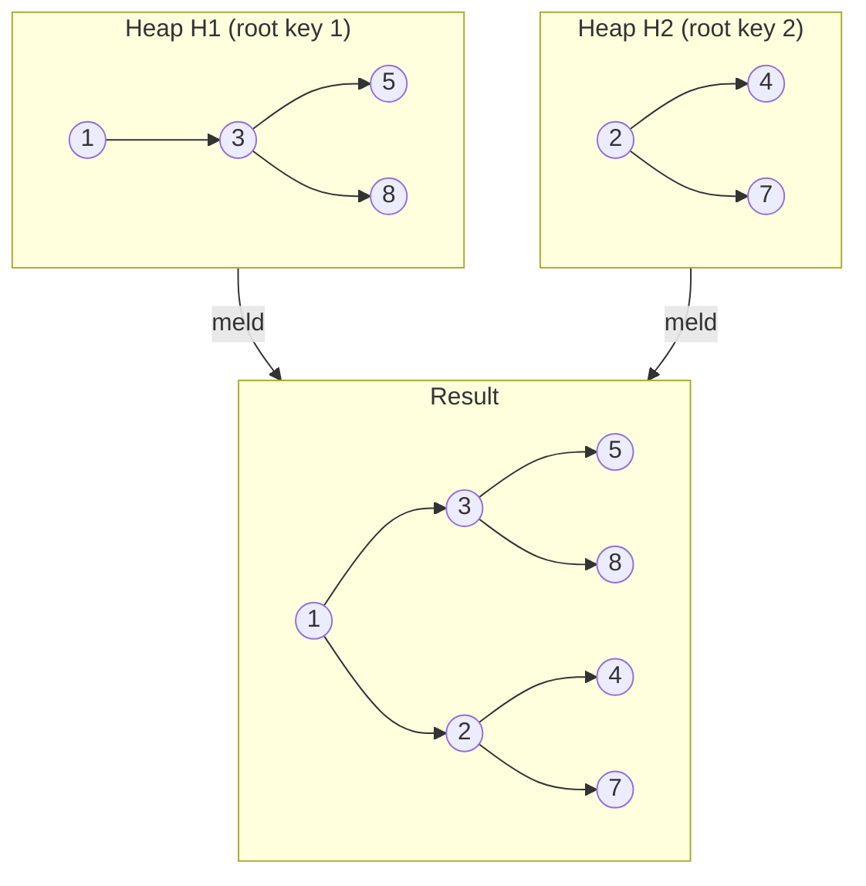

# Leftist Heap — Junior Level

> A meldable min-heap that keeps its left subtrees "heavier" than its right ones so that two heaps can be combined in O(log n) by walking only the short right spine.

## Table of Contents
1. Introduction
2. Prerequisites
3. Glossary
4. Core Concepts
5. Big-O Summary
6. Real-World Analogies
7. Pros & Cons
8. Step-by-Step Walkthrough
9. Code Examples
10. Coding Patterns
11. Error Handling
12. Performance Tips
13. Best Practices
14. Edge Cases & Pitfalls
15. Common Mistakes
16. Cheat Sheet
17. Visual Animation
18. Summary
19. Further Reading

---

## 1. Introduction

A **leftist heap** is a binary-tree-based priority queue invented by Clark A. Crane in 1972. Like a binary heap, it gives you `O(log n)` `insert` and `extract-min`, plus `O(1)` `find-min`. Unlike a binary heap, it supports a fourth operation as a first-class citizen: **meld** (also called **merge** or **union**) of two heaps, also in `O(log n)`.

The trick is a structural invariant called the **leftist property**: for every node, the left child's "null path length" is at least as large as the right child's. This forces all the "weight" of the tree to the left, which guarantees the **right spine** (the path you get by always going right) has length at most `O(log n)`. Since `meld` only walks the right spines of the two input heaps, the whole operation is logarithmic.

Leftist heaps are the canonical introduction to mergeable heaps. Once you understand them, skew heaps, binomial heaps, and pairing heaps become much easier.

---

## 2. Prerequisites

Before reading this lesson, make sure you are comfortable with:

- **Binary trees** — nodes, left/right children, recursion over trees.
- **Recursion** — base cases, recursive calls, returning values up the call stack.
- **Heap basics** — the heap-order property: parent's key is ≤ both children's keys (min-heap).
- **Big-O notation** — at least `O(1)`, `O(log n)`, `O(n)`.
- **Binary heap (array-based)** — the standard "sift-up / sift-down" priority queue.
- **References / pointers** — leftist heaps cannot be stored in a flat array; they need explicit node pointers.

If any of those is shaky, revisit the earlier heap lessons (`01-introduction-to-heaps`, `02-binary-heap`) first.

---

## 3. Glossary

| Term | Meaning |
|------|---------|
| **Node** | A tree node holding a key, a left child, a right child, and an integer `s` (rank). |
| **Null path length (NPL)** | The length of the shortest path from a node to a `null` descendant. Defined as `NPL(null) = -1` and `NPL(x) = 1 + min(NPL(x.left), NPL(x.right))`. |
| **s-value** / **rank** | Synonym for NPL. Stored inside every node. |
| **Leftist invariant** | For every node `x`: `NPL(x.left) >= NPL(x.right)`. |
| **Right spine** | The path obtained by starting at the root and repeatedly going to the right child until you hit `null`. |
| **Meld** (a.k.a. merge, union) | Combine two leftist heaps into one. |
| **Leftist heap** | A binary tree that satisfies both the **min-heap order** and the **leftist invariant**, where every node stores its `s` value. |

A simple consequence of the definition: `NPL(x) = 1 + NPL(x.right)` (because the right child is always the shorter one).

---

## 4. Core Concepts

### 4.1 The leftist invariant

Take any node `x`. Let `s(x)` be its rank (NPL). The invariant is:

```text
s(x.left) >= s(x.right)
```

If `x.right` is `null`, then `s(x.right) = -1`, so the invariant is trivially satisfied.

Combined with the recurrence `s(x) = 1 + min(s(x.left), s(x.right)) = 1 + s(x.right)`, you only ever need to look at the right child to compute the rank of a node.

A leftist tree therefore looks "lopsided to the left":

```text
        a
       / \
      b   c        s(b) >= s(c)
     / \   \
    d   e   f      s(d) >= s(e), s(c.left=null) >= s(f) is impossible
```

The shape rule is local — every node enforces it on its own children — and the consequence is global: the right spine is short.

### 4.2 Why the right spine has length `O(log n)`

**Claim.** A leftist tree whose root has `s(root) = r` contains at least `2^(r+1) - 1` nodes.

**Proof by induction on `r`.**

- Base case `r = 0`: the right subtree has rank `-1`, i.e. is null. The tree has at least the root itself, and `2^1 - 1 = 1`. OK.
- Inductive step: assume the claim holds for all ranks `< r`. If `s(root) = r`, then `s(root.right) = r - 1` and `s(root.left) >= r - 1`. By IH, each subtree has at least `2^r - 1` nodes. Total: `1 + 2*(2^r - 1) = 2^(r+1) - 1`. OK.

**Consequence.** If a leftist heap has `n` nodes and root rank `r`, then `n >= 2^(r+1) - 1`, so `r <= log2(n + 1) - 1`. The right spine has length `r + 1 = O(log n)`. That is the entire reason leftist heaps work.

### 4.3 Recursive meld

`meld(h1, h2)` combines two leftist min-heaps into one. The pseudocode:

```text
meld(h1, h2):
    if h1 is null: return h2
    if h2 is null: return h1
    if h1.key > h2.key: swap(h1, h2)         # h1 now has the smaller root
    h1.right = meld(h1.right, h2)            # recurse on right spine
    if s(h1.left) < s(h1.right):             # restore leftist invariant
        swap(h1.left, h1.right)
    h1.s = 1 + s(h1.right)
    return h1
```

What this does, step by step:

1. Pick the smaller root — it becomes the new root.
2. Recursively meld its right subtree with the other heap. Because each recursive call shrinks one of the right spines by one step, the recursion depth is `O(log n1 + log n2) = O(log n)`.
3. After the recursive call returns, the new right subtree might be heavier than the left. If so, swap children to restore the leftist invariant.
4. Update `s = 1 + s(right)`.

### 4.4 Insert and extract-min as meld

Once you have `meld`, the other operations almost write themselves:

- **insert(k)** = `meld(heap, singleton(k))`. A singleton is a node with `s = 0`.
- **extract-min** = save the root's key, then `heap = meld(root.left, root.right)`.
- **find-min** = read `root.key` in `O(1)`.

All of them inherit the `O(log n)` cost of `meld`.

---

## 5. Big-O Summary

| Operation     | Time          | Space        | Notes                                  |
|---------------|---------------|--------------|----------------------------------------|
| `find-min`    | `O(1)`        | `O(1)`       | Just read `root.key`.                  |
| `insert`      | `O(log n)`    | `O(log n)`   | Meld with a one-node heap.             |
| `extract-min` | `O(log n)`    | `O(log n)`   | Meld the two children of the old root. |
| `meld`        | `O(log n)`    | `O(log n)`   | Walks the right spines of both heaps.  |
| `build` from `n` items | `O(n)` amortized via repeated meld in pairs | `O(n)` | Like bottom-up `heapify`. |
| Total storage | `O(n)`        | —            | One node per element + 4 fields each.  |

The `O(log n)` space is the recursion stack of `meld`. An iterative version can do it in `O(1)` extra space.

---

## 6. Real-World Analogies

- **Two queues at a bank merging into one.** Each queue is already sorted by appointment time. Walking the right spine is like zipping the two queues together starting from the earliest appointment.
- **Two tournament brackets being joined.** The smaller-key root is always the next match.
- **Two playlists being merged in priority order.** The next song to play is the smaller root; the rest is recursively merged.
- **Hospital triage centers consolidating after a disaster.** Each center already has a priority queue of patients; merging the two centers must be fast and preserve "most urgent first".

The common thread: **fast combination of two already-prioritized collections**.

---

## 7. Pros & Cons

### Pros
- Native `O(log n)` `meld`, unlike binary heaps which need `O(n)`.
- Conceptually simple: one invariant, one recursive operation.
- Persistent / functional variants are easy to implement (the recursion creates a new spine).
- Excellent for k-way merge and offline algorithms.

### Cons
- Pointer-based — worse cache behavior than array-based binary heaps.
- Constant factors are larger than a binary heap for `insert` / `extract-min` if you never use `meld`.
- No `O(log n)` `decrease-key` without external bookkeeping.
- Skew heaps achieve the same amortized bounds without storing `s`, which makes them slightly leaner.

**Rule of thumb.** If your workload is mostly `insert` + `extract-min`, use a binary heap. If you frequently combine queues, use a leftist heap (or skew / binomial / pairing heap).

---

## 8. Step-by-Step Walkthrough

We start with an empty leftist heap and `insert(5)`, then we `meld` it with another heap.

### 8.1 `insert(5)` into an empty heap

```text
H = null
singleton(5):   (5, s=0)

meld(null, (5)) = (5)

H = (5)
```

### 8.2 Now insert 3, 8, 1 in order

`insert(3)` = `meld(H, singleton(3))`. The smaller root is `3`.

```text
meld((5), (3))
 -> 3 is smaller, so root = 3
 -> 3.right = meld(null, (5)) = (5)
 -> s(3.left)=-1 < s(3.right)=0, swap children
 -> 3.left = (5), 3.right = null, s(3)=0

H:        3 (s=0)
         /
        5 (s=0)
```

`insert(8)` = `meld(H, singleton(8))`.

```text
meld(H_root=3, (8))
 -> 3 < 8, root stays 3
 -> 3.right = meld(null, (8)) = (8)
 -> s(left=5)=0, s(right=8)=0, no swap
 -> s(3) = 1 + s(right) = 1

H:        3 (s=1)
         / \
        5   8

```

`insert(1)` = `meld(H, singleton(1))`.

```text
meld(H_root=3, (1))
 -> 1 < 3, swap: smaller root = 1
 -> 1.right = meld(null_of_1, 3-heap) = 3-heap
 -> s(1.left)=-1 < s(1.right)=1, swap children
 -> 1.left = 3-heap, 1.right = null, s(1)=0

H:        1 (s=0)
         /
        3 (s=1)
       / \
      5   8
```

Note how the whole shape stayed leftist and the right spine length stays small.

### 8.3 Meld H with another heap K

Let `K` be a leftist heap holding `{2, 4, 7}` shaped as:

```text
K:        2 (s=1)
         / \
        4   7
```

`meld(H, K)`:

```text
Step 1: roots are 1 and 2 -> 1 wins, smaller root = 1
Step 2: 1.right = meld(H.right=null, K) = K
Step 3: s(1.left=3-subtree) and s(1.right=K-root=2) compare
        s(3-sub) = 1, s(2-sub) = 1, no swap needed
Step 4: s(1) = 1 + s(right) = 2

Final shape:

          1 (s=2)
         / \
        3   2
       / \ / \
      5  8 4  7
```

Right spine: `1 -> 2 -> 7`, length 2. The whole meld touched only those two nodes plus the root. That is the `O(log n)` cost.

### 8.4 extract-min

`extract-min` on the merged heap returns `1` and sets `H = meld(left_of_1, right_of_1) = meld(3-subtree, 2-subtree)`. The same recursive procedure produces a new root and a new right spine. Same `O(log n)` cost.

---

## 9. Code Examples

All three implementations expose the same four operations: `findMin`, `insert`, `extractMin`, `meld`. They use recursive `meld`. None use a sentinel — `null` represents the empty heap.

### 9.1 Go

```go
package leftist

type Node struct {
    Key         int
    S           int // rank / null path length
    Left, Right *Node
}

func rank(n *Node) int {
    if n == nil {
        return -1
    }
    return n.S
}

// Meld returns the root of the combined heap.
func Meld(a, b *Node) *Node {
    if a == nil {
        return b
    }
    if b == nil {
        return a
    }
    if a.Key > b.Key {
        a, b = b, a
    }
    a.Right = Meld(a.Right, b)
    if rank(a.Left) < rank(a.Right) {
        a.Left, a.Right = a.Right, a.Left
    }
    a.S = 1 + rank(a.Right)
    return a
}

func Insert(h *Node, key int) *Node {
    return Meld(h, &Node{Key: key, S: 0})
}

func FindMin(h *Node) (int, bool) {
    if h == nil {
        return 0, false
    }
    return h.Key, true
}

func ExtractMin(h *Node) (int, *Node, bool) {
    if h == nil {
        return 0, nil, false
    }
    return h.Key, Meld(h.Left, h.Right), true
}
```

### 9.2 Java

```java
public final class LeftistHeap {

    private static final class Node {
        int key;
        int s;            // rank / NPL
        Node left, right;
        Node(int key) { this.key = key; this.s = 0; }
    }

    private Node root;

    public boolean isEmpty() { return root == null; }

    public int findMin() {
        if (root == null) throw new IllegalStateException("empty");
        return root.key;
    }

    public void insert(int key) {
        root = meld(root, new Node(key));
    }

    public int extractMin() {
        if (root == null) throw new IllegalStateException("empty");
        int min = root.key;
        root = meld(root.left, root.right);
        return min;
    }

    public void absorb(LeftistHeap other) {  // meld in O(log n)
        if (other == null || other == this) return;
        this.root = meld(this.root, other.root);
        other.root = null;
    }

    private static int rank(Node n) { return n == null ? -1 : n.s; }

    private static Node meld(Node a, Node b) {
        if (a == null) return b;
        if (b == null) return a;
        if (a.key > b.key) { Node t = a; a = b; b = t; }
        a.right = meld(a.right, b);
        if (rank(a.left) < rank(a.right)) {
            Node t = a.left; a.left = a.right; a.right = t;
        }
        a.s = 1 + rank(a.right);
        return a;
    }
}
```

### 9.3 Python

```python
from dataclasses import dataclass
from typing import Optional


@dataclass
class Node:
    key: int
    s: int = 0
    left: Optional["Node"] = None
    right: Optional["Node"] = None


def rank(n: Optional[Node]) -> int:
    return -1 if n is None else n.s


def meld(a: Optional[Node], b: Optional[Node]) -> Optional[Node]:
    if a is None:
        return b
    if b is None:
        return a
    if a.key > b.key:
        a, b = b, a
    a.right = meld(a.right, b)
    if rank(a.left) < rank(a.right):
        a.left, a.right = a.right, a.left
    a.s = 1 + rank(a.right)
    return a


class LeftistHeap:
    def __init__(self) -> None:
        self.root: Optional[Node] = None

    def __len__(self) -> int:
        return self._count(self.root)

    def _count(self, n: Optional[Node]) -> int:
        return 0 if n is None else 1 + self._count(n.left) + self._count(n.right)

    def find_min(self) -> int:
        if self.root is None:
            raise IndexError("find_min from empty heap")
        return self.root.key

    def insert(self, key: int) -> None:
        self.root = meld(self.root, Node(key))

    def extract_min(self) -> int:
        if self.root is None:
            raise IndexError("extract_min from empty heap")
        key = self.root.key
        self.root = meld(self.root.left, self.root.right)
        return key

    def absorb(self, other: "LeftistHeap") -> None:
        if other is self or other.root is None:
            return
        self.root = meld(self.root, other.root)
        other.root = None
```

A quick sanity test in Python:

```python
h = LeftistHeap()
for x in [5, 3, 8, 1, 9, 2]:
    h.insert(x)
assert [h.extract_min() for _ in range(6)] == [1, 2, 3, 5, 8, 9]
```

---

## 10. Coding Patterns

### 10.1 k-way merge of sorted streams (the killer app)

When you must merge `k` sorted lists with `n` items total, two classic options exist:

1. **Binary heap of `k` cursors** — `O(n log k)` total. Standard, cache-friendly.
2. **Pairwise meld of leftist heaps** — also `O(n log k)`, but each individual `meld` step is genuinely `O(log k)`, so it's natural in functional or persistent settings.

Pattern: turn each list into a leftist heap (sorted lists are trivially valid leftist chains), then pairwise `meld` them in a tournament until one heap remains.

```text
heaps = [H1, H2, ..., Hk]
while len(heaps) > 1:
    next_round = []
    for i in range(0, len(heaps), 2):
        if i + 1 < len(heaps):
            next_round.append(meld(heaps[i], heaps[i+1]))
        else:
            next_round.append(heaps[i])
    heaps = next_round
```

This is also how you bulk-build a leftist heap from `n` items in `O(n)`.

### 10.2 Event-driven simulation

In a discrete event simulator, "merging two queues" happens when two simulated entities (e.g., two factories, two servers) consolidate. A leftist heap of `(time, event)` pairs gives `O(log n)` merge.

### 10.3 Offline algorithms with "joining" steps

Algorithms like **minimum cost arborescence (Chu–Liu/Edmonds)** rely on a meldable heap to combine cycles. Leftist heaps fit cleanly because they support `meld` natively.

---

## 11. Error Handling

The cases worth handling explicitly:

| Situation                   | Recommended behavior                                   |
|-----------------------------|--------------------------------------------------------|
| `find-min` on empty heap    | Throw / return an explicit "empty" signal.             |
| `extract-min` on empty heap | Throw / return an explicit "empty" signal.             |
| `meld(h, h)` (self-meld)    | No-op or guard. Self-melding aliases the same nodes and breaks invariants. |
| Duplicate keys              | Fine. Leftist heaps allow duplicates by default.       |
| `null` argument to `meld`   | Return the other argument. Already handled by base cases. |

Don't silently return `0` or `-1` from an empty `find-min` — that bug propagates far. Use `Optional`, a tuple `(value, ok)`, or an exception.

---

## 12. Performance Tips

- **Use iterative `meld` for very large heaps.** Recursive `meld` uses `O(log n)` stack; iterative uses `O(1)`.
- **Store `s` as a small int.** It never grows past `~log2(n)`, so a byte suffices for up to 2^255 items.
- **Avoid wrapping nodes in heavy objects.** Each node already has 3 pointers plus a key plus `s`. Don't pile on observers or generics if you don't need them.
- **Prefer a binary heap if you never `meld`.** A flat array has better cache behavior.
- **Pool nodes** in long-running services to cut allocator pressure.
- **Don't recompute `s` from scratch.** Always derive it from `rank(right)` after the swap.

---

## 13. Best Practices

- Treat `null` as the empty heap. It plays nicely with recursion.
- Keep `meld` as a pure function `(Node, Node) -> Node`. Don't mutate global state inside it.
- Always restore the invariant inside `meld` itself — don't postpone it.
- After `meld`, the input heaps should be considered consumed: their internal nodes were rewired. Either invalidate them (`other.root = null`) or document the aliasing clearly.
- Write the operations in this order: `meld` first, then `insert`, `extractMin`, and `findMin` on top of `meld`. It keeps the implementation tiny and the reasoning local.
- Test with property-based tests: insert random sequences, compare extracted order to `sorted(input)`.

---

## 14. Edge Cases & Pitfalls

- **Empty heap.** Both `meld(null, x)` and `meld(x, null)` must return `x`. Most bugs in leftist heaps come from forgetting the right base case.
- **One-node heap.** A leaf has `s = 0`, and both children are `null`. Don't store `s = 1` by accident.
- **Swap forgotten.** Forgetting to swap children after the recursive `meld` breaks the leftist invariant. Eventually, the right spine becomes long and you lose the `O(log n)` guarantee.
- **`s` not updated.** Forgetting to set `a.s = 1 + rank(a.right)` does not break ordering immediately, but it corrupts future merges.
- **Self-meld.** `meld(h, h)` aliases the same tree on both sides and can create cycles. Guard against it.
- **Concurrent mutation.** Leftist heaps are not thread-safe. Wrap them externally if needed.
- **Stack depth.** For pathological recursive calls, deeply nested melds can blow the call stack in languages without TCO; prefer iterative meld.

---

## 15. Common Mistakes

1. **Treating leftist heaps like array heaps.** They cannot live in a flat `int[]` array — the shape is irregular.
2. **Using `height` instead of `NPL`.** Height counts the longest path; NPL counts the **shortest**. They are different, and the invariant uses NPL.
3. **Implementing `meld` iteratively without restoring the invariant on the way back up.** You must rebuild the right spine bottom-up.
4. **Calling `insert` n times to "build" a heap from a list.** Total cost is `O(n log n)`. Use the pairwise meld trick for `O(n)`.
5. **Returning the smaller of `s(left)` and `s(right)` instead of `1 + min(...)`.** Off-by-one on `s` propagates fast.
6. **Forgetting that `s(null) = -1`.** Many bugs come from initializing it to `0` instead.
7. **Not invalidating the source heap after `meld`.** Two roots that share nodes are a disaster waiting to happen.

---

## 16. Cheat Sheet

```text
Definitions
-----------
NPL(null) = -1
NPL(x)    = 1 + min(NPL(x.left), NPL(x.right))
Leftist invariant: NPL(x.left) >= NPL(x.right) for every node x
Therefore:         NPL(x) = 1 + NPL(x.right)

Operations
----------
findMin(h)     = h.key                          O(1)
insert(h, k)   = meld(h, Node(k))               O(log n)
extractMin(h)  = (h.key, meld(h.left, h.right)) O(log n)
meld(a, b)     = recursive, see below           O(log n)

meld(a, b):
    if a is null: return b
    if b is null: return a
    if a.key > b.key: swap a, b
    a.right = meld(a.right, b)
    if rank(a.left) < rank(a.right): swap children
    a.s = 1 + rank(a.right)
    return a

Why it works
------------
Right spine length r satisfies n >= 2^(r+1) - 1
=> r <= log2(n+1) - 1 = O(log n)
meld touches only the right spines => O(log n)

When to use
-----------
+ Frequent meld / union of priority queues
+ k-way merge, offline algorithms with joins
- Pure insert+extractMin workloads -> binary heap is faster in practice
- Need decrease-key -> Fibonacci or pairing heap
```

---

## 17. Visual Animation

An interactive animation is available at `animation.html` in this folder. The diagram below sketches what `meld` does conceptually:



`meld` walks down the right spines of `H1` and `H2`, picks the smaller root at each step, attaches the other heap on the right, and swaps children on the way back up to restore the leftist invariant.

---

## 18. Summary

- A **leftist heap** is a binary tree that is both a **min-heap** and satisfies the **leftist invariant** `NPL(left) >= NPL(right)`.
- The invariant guarantees the **right spine** has length `O(log n)`, which is the key to fast `meld`.
- `meld` is a small, beautiful recursion: pick the smaller root, recurse on the right, swap children if needed, update `s`.
- `insert`, `extract-min`, and `meld` all run in `O(log n)`. `find-min` runs in `O(1)`.
- The structure shines in workloads with frequent `meld` operations: **k-way merge**, offline graph algorithms, event-driven simulation, persistent functional priority queues.
- For pure `insert` + `extract-min` workloads, a plain array-based binary heap is faster in practice due to cache behavior.

If you remember one thing: **`meld` is the only real operation; `insert` and `extract-min` are just `meld` in disguise.**

---

## 19. Further Reading

- Clark A. Crane, **"Linear lists and priority queues as balanced binary trees"** (Stanford TR, 1972) — the original paper introducing leftist trees.
- Mark Allen Weiss, **"Data Structures and Algorithm Analysis"** — the classic textbook chapter on leftist and skew heaps.
- Donald Knuth, **TAOCP Vol. 3**, section on priority queues.
- Chris Okasaki, **"Purely Functional Data Structures"** — chapter on leftist heaps in a persistent setting.
- Next in this roadmap: `08-skew-heap` (the amortized cousin without stored ranks) and `09-binomial-heap` (the meldable forest).
