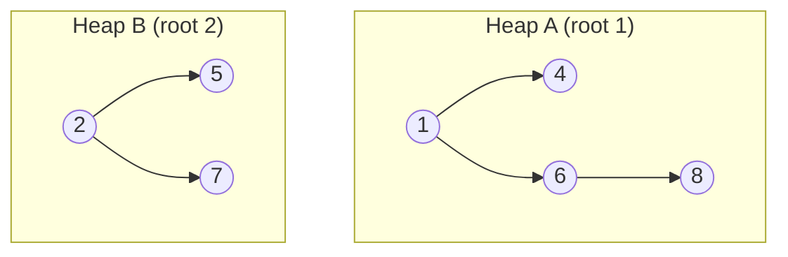
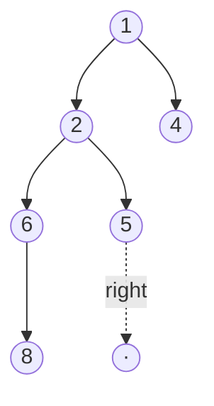

# Skew Heap — Junior Level

> A skew heap is a self-adjusting mergeable heap that achieves amortised O(log n) meld, insert, and extract-min by unconditionally swapping children on every recursive merge step — no bookkeeping fields required.

## Table of Contents
1. Introduction
2. Prerequisites
3. Glossary
4. Core Concepts
5. Big-O Summary
6. Real-World Analogies
7. Pros & Cons
8. Step-by-Step Walkthrough
9. Code Examples
10. Coding Patterns
11. Error Handling
12. Performance Tips
13. Best Practices
14. Edge Cases & Pitfalls
15. Common Mistakes
16. Cheat Sheet
17. Visual Animation
18. Summary
19. Further Reading

## 1. Introduction

A skew heap is a binary-tree heap in which the meld operation is the single primitive — insert and extract-min are both expressed as melds. It was introduced by Daniel Sleator and Robert Tarjan in 1986 as the "self-adjusting" answer to the leftist heap.

The leftist heap maintains a numeric field on every node (the null path length, or NPL) and uses it to decide which child to merge into during a meld. The skew heap throws that field away and instead **unconditionally swaps the left and right children of every node visited during a meld**. There is no condition, no comparison of subtree weights, no NPL field to maintain — just swap.

Intuitively this sounds reckless: surely the tree can get arbitrarily unbalanced? The amortised analysis says no. Any meld step that visits a long right spine reorganises that spine into the new left spine, so the next meld cannot pay the same cost again. The potential function "number of heavy right children" pays for the worst chains, and every operation runs in amortised O(log n).

For a junior engineer, the skew heap is one of the prettiest data structures in the field: a few lines of code, no balancing tricks, and the same asymptotic guarantees as much more elaborate priority queues. It is also a clean introduction to **amortised analysis** — the idea that individual operations may be slow but their average is bounded.

## 2. Prerequisites

To follow this lesson comfortably you should already know:

- **Binary trees** — nodes with left and right children, recursion over them.
- **The heap-order property** — every node's key is less than or equal to its children's keys (for a min-heap).
- **Recursion** — comfortable reading and writing recursive functions.
- **Leftist heap** — the previous topic; the skew heap is best understood as a simplification of it. Knowing what NPL is and why leftist heaps keep right spines short will make the "swap on every meld" trick land.
- **Big-O basics** — distinction between worst-case and amortised time.
- **Pointers / references** — the operations rewire parent-child links rather than copying data.

You do not need to know Fibonacci heaps, binomial heaps, or pairing heaps. Skew heaps are an independent stop on the mergeable-heap tour.

## 3. Glossary

- **Skew heap** — a binary-tree heap that satisfies the heap-order property and is maintained by the meld operation described below.
- **Meld (merge)** — the operation that combines two skew heaps into one. All other operations are written in terms of it.
- **Heap-order property** — `key(parent) <= key(child)` everywhere in a min-heap.
- **Right spine** — the path obtained by following right children from the root to a leaf. The cost of meld is proportional to the length of the right spines of both inputs.
- **Self-adjusting** — the structure has no balance invariant; it reshapes itself during operations so that bad cases pay for future good cases.
- **Amortised cost** — the average cost per operation over a worst-case sequence; some individual operations may be slower than the bound.
- **Potential function (Φ)** — a non-negative number assigned to each state of the data structure; amortised cost = actual cost + ΔΦ. For skew heaps Φ counts "heavy" right children.
- **Heavy node** — for the standard skew-heap analysis, a non-root node is *heavy* if its right subtree contains more than half of its descendants; otherwise *light*.
- **NPL (null path length)** — the bookkeeping field a leftist heap maintains; a skew heap deliberately does not.

## 4. Core Concepts

### 4.1 The single primitive: meld

Every skew-heap operation is meld:

- `insert(x)` = `meld(heap, singletonNode(x))`
- `extractMin()` = remove the root, then `meld(rootLeft, rootRight)`
- `meld` itself recursively merges two heaps.

So if you write meld correctly, you are done. Insert and extract-min are one-liners on top.

### 4.2 The meld algorithm

Given two skew heaps `a` and `b`:

1. If either is empty, return the other.
2. Otherwise let `small` be the one with the smaller root key and `large` be the other.
3. Recursively compute `merged = meld(small.right, large)`.
4. Set `small.right = small.left` and `small.left = merged`. **(This is the unconditional swap.)**
5. Return `small`.

Step 4 is the entire trick. Whatever subtree was on the left moves to the right; the freshly-merged subtree becomes the new left. The roots themselves never move — only their children get rewired.

### 4.3 Why this self-adjusts

A meld walks down the right spines of both inputs, comparing roots at each step. Suppose one input has a very long right spine — a meld that descends it pays a lot. But after the swap in step 4, that long spine becomes the left spine. The **right** spine of the resulting tree is short, so the *next* meld cannot pay the same big bill.

This is the same intuition as splay trees: an expensive operation rearranges the structure so that the expense cannot be repeated. The amortised bookkeeping is what makes "no balance invariant" safe.

### 4.4 No NPL, no comparisons of subtree sizes

A leftist heap looks at NPL(left) vs NPL(right) and only swaps when `NPL(left) < NPL(right)`. The skew heap swaps every time. That means:

- No extra field on each node.
- No update logic after each meld step.
- Less memory, less code, fewer chances to introduce a bug.

The price: the O(log n) guarantee is now amortised rather than per-operation worst-case. A single insert could in principle take O(n) (extremely rare in practice); but any *sequence* of m operations on a heap that ever grew to size n takes O(m log n) total.

### 4.5 Recursive vs iterative meld

The recursive description above is the clearest. An equivalent iterative formulation collects both right spines into a sorted list, then re-threads them so that each node's old left child stays as left, and the next node in the sorted list becomes the new left — effectively the same swap. Most teaching implementations use the recursive version.

## 5. Big-O Summary

| Operation     | Skew Heap (amortised) | Leftist Heap (worst case) | Binary Heap (worst case) |
|---------------|-----------------------|---------------------------|---------------------------|
| `meld`        | O(log n)              | O(log n)                  | O(n)                      |
| `insert`      | O(log n)              | O(log n)                  | O(log n)                  |
| `findMin`     | O(1)                  | O(1)                      | O(1)                      |
| `extractMin`  | O(log n)              | O(log n)                  | O(log n)                  |
| Extra memory per node | 0 pointers / fields | 1 NPL field         | 0 (array-backed)         |

Key reading:

- **Amortised vs worst-case.** Skew and leftist have the same asymptotic bound; the difference is whether a single operation is guaranteed to hit it, or only the average over a sequence.
- **Meld is the headline.** Both skew and leftist crush the array-backed binary heap on merge, which costs O(n).
- **Skew has the smallest constant overhead per node** — literally nothing extra beyond the key and two child pointers.

## 6. Real-World Analogies

- **Two queues collapsing into one at a checkout.** Imagine two snaking queues at adjacent registers; one register closes and the queues merge. The customers with the lowest priority numbers (smallest keys) come first. Skew-heap meld is the structural rule for how those two queues entangle — and the "swap" mimics the way people instinctively reshuffle.
- **Two card decks shuffled by riffle, then split differently.** Each meld step pulls the smaller card off, then crosses children. Repeated melds keep redistributing.
- **Two priority lists in a kitchen.** Chef A and Chef B each have a stack of tickets. Merging the stacks pulls whichever next ticket is most urgent, but each chef rotates their remaining tickets so the next merge sees a fresh ordering.
- **Splay-tree-style "rotate on every access."** If you have met splay trees, the philosophy is identical: do not maintain an invariant; instead reshape on every operation so bad cases self-correct.

## 7. Pros & Cons

**Pros**
- Extremely simple implementation — meld fits in eight or nine lines.
- No extra per-node field (no NPL).
- Excellent practical performance; constant factors are small.
- Fast meld in O(log n) amortised — beats array-backed binary heap dramatically when you need to merge.
- Natural recursion makes it easy to teach and reason about.

**Cons**
- Bounds are amortised, not worst-case. A single operation may cost up to O(n).
- Not suitable for hard real-time systems where the *worst* single operation must be bounded.
- Like leftist, it does not support O(log n) `decreaseKey` or `delete(node)` efficiently without extra machinery.
- Pointer-based; less cache-friendly than an array binary heap.
- Amortised analysis is harder to teach than the leftist NPL story; sometimes the simplicity of the code is overshadowed by the subtlety of why it works.

## 8. Step-by-Step Walkthrough

We will build a skew heap by inserting the sequence `5, 3, 8, 1, 9, 2` into an empty heap. Each insert is `meld(currentHeap, singleton(x))`. The unconditional swap happens at every level visited.

### Step 0 — empty heap

```text
heap = ∅
```

### Step 1 — insert 5

Meld of `∅` with the singleton `(5)` returns `(5)`.

```text
    5
```

### Step 2 — insert 3

Meld `(5)` with `(3)`. Smaller root is 3.

- Recursively meld `3.right` (empty) with `(5)` → returns `(5)`.
- Set `3.right = 3.left` (empty).
- Set `3.left = (5)`.

```text
      3
     /
    5
```

### Step 3 — insert 8

Meld the tree rooted at 3 with `(8)`. Smaller root is 3.

- Recursively meld `3.right` (empty) with `(8)` → `(8)`.
- Swap children of 3: old left (5) goes right, new merged (8) goes left.

```text
       3
      / \
     8   5
```

### Step 4 — insert 1

Meld the tree at 3 with `(1)`. Smaller root is 1.

- Recursively meld `1.right` (empty) with tree-at-3 → tree-at-3 unchanged.
- Swap children of 1.

```text
         1
        /
       3
      / \
     8   5
```

### Step 5 — insert 9

Meld tree at 1 with `(9)`. Smaller root is 1.

- Recursively meld `1.right` (empty) with `(9)` → `(9)`.
- Swap children of 1: old left (tree at 3) moves right; new (9) becomes left.

```text
         1
        / \
       9   3
          / \
         8   5
```

### Step 6 — insert 2

Meld tree at 1 with `(2)`. Smaller root is 1.

- Recursively meld `1.right` (subtree rooted at 3) with `(2)`.
  - Smaller root is 2.
  - Recursively meld `2.right` (empty) with tree-at-3 → tree-at-3 unchanged.
  - Swap children of 2: empty left, then put tree-at-3 as new left.

  Subresult:
  ```text
       2
      /
     3
    / \
   8   5
  ```
- Back at 1: swap children. Old left (9) goes right; new merged subtree (rooted at 2) becomes left.

```text
              1
             / \
            2   9
           /
          3
         / \
        8   5
```

Notice that the right spine — the chain you would follow taking only right children — is short (`1 → 9`). Every meld worked to keep the right side cheap.

### Step 7 — extractMin

The minimum is 1. Remove the root and meld its two children: tree-at-2 with `(9)`.

- Smaller root is 2.
- Recursively meld `2.right` (empty) with `(9)` → `(9)`.
- Swap children of 2: old left (tree at 3) goes right; (9) becomes left.

```text
            2
           / \
          9   3
             / \
            8   5
```

The heap is intact, the order is preserved, and no NPL field was touched anywhere.

## 9. Code Examples

### 9.1 Go

```go
package skewheap

// Node is a node in a min-skew-heap.
type Node struct {
    Key         int
    Left, Right *Node
}

// Meld combines two skew heaps into one and returns the new root.
// Either argument may be nil.
func Meld(a, b *Node) *Node {
    if a == nil {
        return b
    }
    if b == nil {
        return a
    }
    // Ensure a is the smaller-rooted heap.
    if a.Key > b.Key {
        a, b = b, a
    }
    // Recursively meld a's right subtree with b.
    merged := Meld(a.Right, b)
    // Unconditional swap: old left moves to right, merged becomes left.
    a.Right = a.Left
    a.Left = merged
    return a
}

// Heap wraps a root pointer for convenience.
type Heap struct {
    root *Node
}

func (h *Heap) Insert(x int) {
    h.root = Meld(h.root, &Node{Key: x})
}

func (h *Heap) FindMin() (int, bool) {
    if h.root == nil {
        return 0, false
    }
    return h.root.Key, true
}

func (h *Heap) ExtractMin() (int, bool) {
    if h.root == nil {
        return 0, false
    }
    minKey := h.root.Key
    h.root = Meld(h.root.Left, h.root.Right)
    return minKey, true
}

func (h *Heap) Empty() bool { return h.root == nil }
```

### 9.2 Java

```java
public class SkewHeap {

    private static class Node {
        int key;
        Node left, right;
        Node(int k) { this.key = k; }
    }

    private Node root;

    public boolean isEmpty() { return root == null; }

    public void insert(int x) {
        root = meld(root, new Node(x));
    }

    public int findMin() {
        if (root == null) throw new IllegalStateException("heap is empty");
        return root.key;
    }

    public int extractMin() {
        if (root == null) throw new IllegalStateException("heap is empty");
        int min = root.key;
        root = meld(root.left, root.right);
        return min;
    }

    // Recursive meld with unconditional swap.
    private static Node meld(Node a, Node b) {
        if (a == null) return b;
        if (b == null) return a;
        if (a.key > b.key) { Node tmp = a; a = b; b = tmp; }
        Node merged = meld(a.right, b);
        a.right = a.left;
        a.left = merged;
        return a;
    }
}
```

### 9.3 Python

```python
class _Node:
    __slots__ = ("key", "left", "right")

    def __init__(self, key):
        self.key = key
        self.left = None
        self.right = None


def meld(a, b):
    """Combine two skew heaps; either may be None."""
    if a is None:
        return b
    if b is None:
        return a
    if a.key > b.key:
        a, b = b, a
    merged = meld(a.right, b)
    # Unconditional swap of children.
    a.right = a.left
    a.left = merged
    return a


class SkewHeap:
    def __init__(self):
        self._root = None

    def __len__(self):
        # Linear; provided only for tests / teaching.
        def size(n):
            if n is None:
                return 0
            return 1 + size(n.left) + size(n.right)
        return size(self._root)

    def empty(self):
        return self._root is None

    def insert(self, x):
        self._root = meld(self._root, _Node(x))

    def find_min(self):
        if self._root is None:
            raise IndexError("find_min from empty heap")
        return self._root.key

    def extract_min(self):
        if self._root is None:
            raise IndexError("extract_min from empty heap")
        min_key = self._root.key
        self._root = meld(self._root.left, self._root.right)
        return min_key
```

## 10. Coding Patterns

### 10.1 k-way merge

Skew heaps shine when you have many small heaps and want one big one. To merge `k` heaps `H1 ... Hk`:

```text
result = ∅
for H in [H1, H2, ..., Hk]:
    result = meld(result, H)
```

Total work is O(N log N) where N is the total number of elements — but the *constant* is small because meld is so cheap. The same pattern appears when merging streams from multiple producers.

### 10.2 Lazy deletion

If you need to delete an arbitrary element by value, mark it deleted instead of removing it, and skip deleted entries during `extractMin`:

```text
while not heap.empty():
    x = heap.extract_min()
    if not deleted[x]:
        return x
return None
```

This trades exactness for simplicity and is a common pattern in event-loop schedulers.

### 10.3 Building from a list in O(n)

You can construct a skew heap from `n` elements faster than `n` inserts: put each element in a singleton heap, add them all to a queue, repeatedly take two and meld. After `n − 1` melds you have one heap. Average meld work is bounded, total time is O(n) amortised. This mirrors the bottom-up binary-heap build.

## 11. Error Handling

A working skew-heap implementation must reject impossible operations cleanly:

- **`findMin` / `extractMin` on an empty heap.** Decide on a convention: raise an exception (Java, Python) or return a sentinel + `ok` boolean (Go). Do *not* dereference a null root.
- **Concurrent mutation.** Skew heaps in plain form are not thread-safe; if two threads call `meld`/`insert` simultaneously you can corrupt the tree. Guard with a lock or use one heap per worker.
- **Aliased roots.** Passing the same root as both arguments to `meld` is a bug — the meld will recurse into itself and rewire children in a loop. In application code, separate the heaps clearly: `meld(a, b)` "consumes" both `a` and `b`; do not reuse them afterwards.

In the code samples above:

- Go signals emptiness with a `(zero, false)` pair.
- Java throws `IllegalStateException`.
- Python raises `IndexError`, matching the style of `list.pop` on an empty list.

## 12. Performance Tips

- **Prefer iterative meld for very deep heaps.** The recursive version uses stack space proportional to the longer right spine. In production code or for stress tests, convert to the iterative "merge two right spines" form.
- **Cache the size.** Tracking `n` in the wrapper struct turns `len(heap)` from O(n) into O(1) without changing the algorithm.
- **Use object pools in hot paths.** Per-node allocation can dominate runtime; pool nodes if you do millions of inserts.
- **Batch builds.** When you already have a list, build with repeated melds in a queue, not `n` individual inserts.
- **Avoid duplicate keys with side effects.** Equal keys are allowed, but `extractMin` can return them in any order; do not rely on stability.

## 13. Best Practices

- **Make meld the only mutating primitive.** All other operations should call meld; do not invent ad-hoc rewiring logic.
- **Document the asymptotic bound clearly as amortised.** Future maintainers will assume worst-case otherwise and pick this structure for the wrong reason.
- **Encapsulate the root.** Expose a `Heap` type, not the bare node pointer. It is too easy to lose track of which pointer is "the heap" after a meld.
- **Write a structural invariant check for tests.** A `verify()` helper that recursively asserts the heap-order property catches most bugs immediately.
- **Pick consistent comparator semantics.** Min-heap or max-heap, decided once; do not toggle inside meld.

## 14. Edge Cases & Pitfalls

- **Empty inputs.** `meld(nil, nil)` must return `nil`; both single-empty cases must short-circuit. This is the most common bug in first implementations.
- **Single-node heap.** `extractMin` from a one-node heap must produce an empty heap; `meld(nil, nil)` does exactly that.
- **Duplicate keys.** Allowed, but order among duplicates is not stable.
- **Self-meld.** Passing the same node as both arguments is undefined behaviour; the algorithm assumes `a` and `b` are disjoint trees.
- **Very deep recursion.** Worst-case recursion depth equals the longer of the two right spines, which can be up to n in a pathological input — convert to iteration if you ingest adversarial data.
- **Forgetting the swap.** If you delete or comment out the line `a.right = a.left`, the data structure still satisfies heap order but degrades to a sorted right path — every subsequent meld walks the entire structure.

## 15. Common Mistakes

1. **Swapping conditionally** ("only swap when something is heavier"). That turns it back into a leftist heap and requires NPL. Skew swaps every time.
2. **Maintaining NPL by accident.** Beginners often copy a leftist-heap sketch and forget to remove the NPL update. The field will diverge from reality and confuse future readers.
3. **Calling `meld(h, h)` to "double a heap."** It corrupts pointers; you get cycles and an infinite loop.
4. **Treating the bounds as worst-case.** Quoting "O(log n)" without "amortised" misleads people choosing data structures for real-time systems.
5. **Forgetting that meld destroys its inputs.** After `c = meld(a, b)`, the variables `a` and `b` should not be touched — their internal structure now belongs to `c`.
6. **Not handling empty-on-empty.** A `meld(nil, nil)` that recurses without a base case is an immediate stack overflow.

## 16. Cheat Sheet

```text
Skew Heap — pocket reference

Operations (amortised):
    meld(a, b)        O(log n)
    insert(x)         O(log n)   = meld(heap, singleton(x))
    findMin()         O(1)       = root.key
    extractMin()      O(log n)   = remove root; meld(left, right)

Meld pseudocode:
    if a == nil: return b
    if b == nil: return a
    if a.key > b.key: swap a, b
    a.right = meld(a.right, b)
    swap a.left, a.right        # <-- the entire trick
    return a

Per-node fields:
    key, left, right            # no NPL, no rank, no size

Bounds are amortised, not worst-case.
Right spines stay short because every meld swaps them to the left.

Compared to leftist:
    same asymptotics
    less code
    less memory
    amortised instead of worst-case
```

## 17. Visual Animation

A meld visualised — recursive descent down the right spines, then swap children on the way back up.



After `meld(A, B)`:



What the animation shows step by step:

1. Compare roots 1 and 2 — keep 1 as the new root.
2. Recurse: meld 1's right subtree (rooted at 6) with B.
3. Compare 2 and 6 — keep 2.
4. Recurse: meld 2's right subtree (7) with subtree at 6.
5. Bottom of recursion, return upward.
6. On every return, swap that node's children.

You can see the right spine of A (1 → 6 → 8) become the *left* spine in the result, and the right spine becomes short. That is the self-adjustment that pays the amortised bill.

## 18. Summary

- The skew heap is a binary-tree min-heap maintained by one primitive: meld.
- Meld walks the right spines of both inputs, picking the smaller root at each step, and **unconditionally swaps left and right children** on the way back up.
- Insert is `meld(heap, singleton)`; extract-min removes the root and melds its two children.
- All operations run in **amortised** O(log n). The potential function counts heavy right children — each costly meld converts heavy nodes into light ones, paying for itself.
- Compared to a leftist heap: same big-O, no NPL field, simpler code, but the bound is amortised rather than worst-case.
- Compared to a binary heap: vastly faster meld (O(log n) vs O(n)), at the cost of pointer indirection and slightly worse cache behaviour.
- Use skew heaps when you need efficient meld and simple code, and when an occasional slow operation is acceptable. Avoid them in hard real-time systems where the worst single operation must be bounded.

## 19. Further Reading

- Sleator, D. D., and Tarjan, R. E. "Self-Adjusting Heaps." *SIAM Journal on Computing*, 15(1):52–69, 1986 — the original paper introducing skew heaps alongside the splay analysis.
- Tarjan, R. E. *Data Structures and Network Algorithms*. SIAM, 1983 — context for amortised analysis and mergeable heaps.
- Weiss, M. A. *Data Structures and Algorithm Analysis*. Chapter on priority queues, contrasting binary, leftist, and skew heaps with code.
- Sedgewick, R., and Wayne, K. *Algorithms*, 4th ed. — accessible coverage of heap variants.
- CLRS, *Introduction to Algorithms*, 3rd ed., chapter on amortised analysis — read this alongside skew heaps to see the potential-function technique in full.
- Online: skew heap visualisers at the University of San Francisco's data-structure visualisation site — useful for watching the swap happen step by step.
