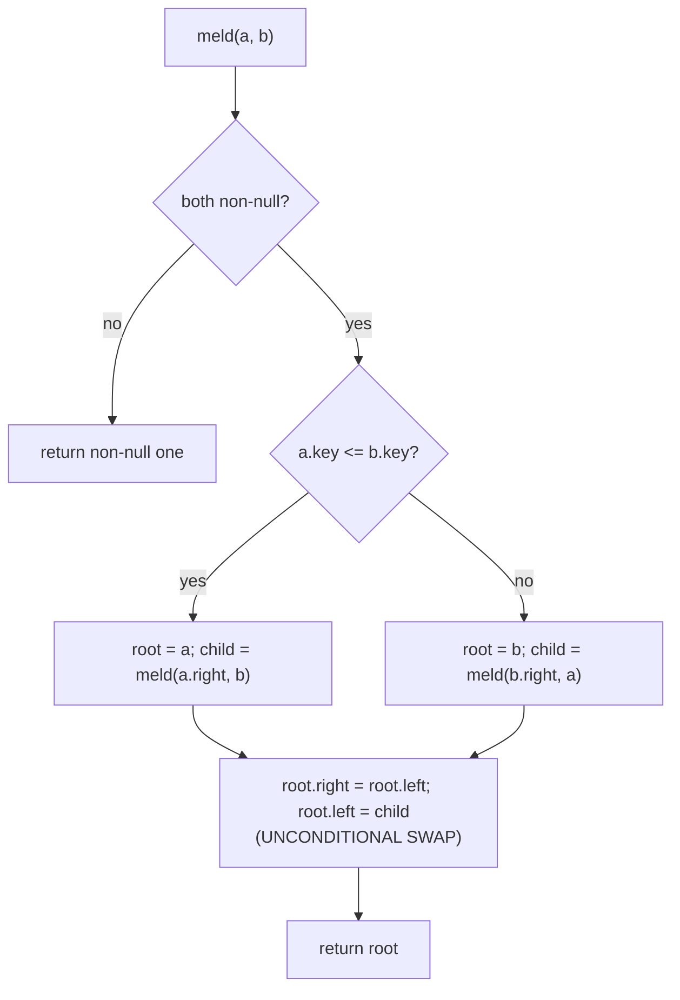

# Skew Heap — Middle Level

> Focus: "Why amortised, and why simpler than leftist?"

## Table of Contents
1. Introduction
2. Deeper Concepts (heavy/light children, potential function)
3. Comparison with Alternatives (leftist, splay, pairing)
4. Advanced Patterns (persistent variant, lazy union)
5. Graph and Tree Applications
6. Dynamic Programming Integration
7. Code Examples (Go / Java / Python — iterative meld)
8. Error Handling
9. Performance Analysis
10. Best Practices
11. Visual Animation
12. Summary

---

## 1. Introduction

A **skew heap** is a self-adjusting binary heap that supports `meld`, `insert`,
and `extractMin` in **O(log n) amortised** time. Unlike a leftist heap, it
maintains **no balance information** at all — no rank, no s-value, no size.
The invariant is enforced implicitly through a single, mechanical rule:

> After every recursive meld step, **unconditionally swap** the two children
> of the surviving root.

This is the structural twin of a splay tree's "rotate on access" rule: do
something cheap and seemingly arbitrary on every operation, and the amortised
bound emerges from a potential argument.

At the junior level you saw *how* the meld works. At the middle level the
question is *why* unconditional swapping is enough, what the cost actually is
in the worst case, and where skew heaps sit relative to leftist, splay,
pairing, and Fibonacci heaps.

The short answer:

- **Leftist heap** = worst-case O(log n), needs s-value bookkeeping.
- **Skew heap** = amortised O(log n), zero bookkeeping, simpler code.
- **Splay tree** : AVL tree :: **Skew heap** : leftist heap.

---

## 2. Deeper Concepts (heavy/light children, potential function)

### 2.1 The right spine and meld cost

Every skew-heap operation reduces to a `meld(a, b)`. The classical recursive
meld walks down the **right spines** of both trees, merging them in min-root
order. Therefore:

```
actual cost of meld(a, b)  =  |right-spine(a)|  +  |right-spine(b)|
```

In a leftist heap the right spine is provably O(log n) by the s-value
invariant. In a skew heap the right spine can be **as long as n** — for
instance, a tree built by inserting `1, 2, 3, ..., n` without the swap would
degenerate. The swap fixes this *in amortised terms*.

### 2.2 Heavy and light right children

Define, for any node `x` with subtree size `s(x)`:

- The right child `r(x)` is **heavy** if `s(r(x)) > s(x) / 2`.
- Otherwise `r(x)` is **light**.

A key combinatorial fact:

> On any root-to-leaf right-spine path, the number of **light** right children
> is at most `floor(log2 n)`.

Reason: each step into a light right child reduces subtree size by more than
half, and you cannot halve `n` more than `log2 n` times.

So the spine length splits as:

```
|right-spine| = (#light right children on spine) + (#heavy right children on spine)
              ≤ log2 n                          + H
```

The light part is already logarithmic. The problem is `H`, the number of
heavy right children, which can be large in a single operation. The potential
function pays for these.

### 2.3 The potential function

Let

```
Φ(H) = total number of heavy right children in heap H
```

The potential is always a non-negative integer, and `Φ(empty) = 0`, so any
amortised bound derived from `Φ` is a legitimate upper bound on the actual
cost of a sequence of operations.

### 2.4 Amortised cost of a single meld

Consider `meld(a, b)` and trace one node `x` visited on the merged right
spine. After the unconditional swap, the child that *was* the right child
becomes the left child.

Case analysis on `x`'s right child *before* the swap:

- **Heavy right child:** it was contributing 1 to `Φ`. After the swap and
  recursive merge, it is now on the left, so it no longer contributes. The
  potential **drops by 1** per heavy node visited.
- **Light right child:** it was not contributing to `Φ`. After the merge,
  the new right child might be heavy or light — we charge at most `+1` to
  the potential per such node.

Summing over all visited nodes on the combined right spine:

```
amortised cost = actual cost + ΔΦ
               = (L_a + H_a + L_b + H_b) + (-H_a - H_b + new_heavies)
               ≤ (L_a + L_b) + new_heavies
               ≤ 2 log2 n + O(log n)
               = O(log n)
```

(The `new_heavies` term is bounded by the number of light nodes processed
plus a constant, again O(log n) by the halving argument.)

Therefore **every operation costs O(log n) amortised**, even though an
individual meld can do Θ(n) actual work after a long run of small ops that
built up potential.

### 2.5 Worst-case is still bad

It is critical to remember the bound is *amortised*, not worst-case. A single
`meld` can take Θ(n) time on a pathological tree. Any soft real-time system
that needs a hard per-operation deadline should not pick skew heaps.

---

## 3. Comparison with Alternatives

| Property              | Leftist heap  | Skew heap     | Splay tree    | Pairing heap   |
|-----------------------|---------------|---------------|---------------|----------------|
| Balance info stored   | s-value/rank  | none          | none          | none           |
| `meld` complexity     | O(log n) WC   | O(log n) am.  | O(log n) am.  | O(log n) am.   |
| `extractMin`          | O(log n) WC   | O(log n) am.  | O(log n) am.  | O(log n) am.   |
| `decreaseKey`         | O(log n)      | O(log n) am.  | O(log n) am.  | O(log n) am.*  |
| Code complexity       | medium        | **lowest**    | medium        | medium         |
| Practical constant    | small         | very small    | small         | very small     |
| Worst-case per op     | O(log n)      | **O(n)**      | O(n)          | O(n)           |
| Persistent-friendly   | yes (clean)   | awkward       | no            | no             |

\* Pairing heap's `decreaseKey` has a famous Θ(log log n)–Ω(log n) gap.

### 3.1 Skew vs. leftist

They are structurally identical except for one line of code:

- Leftist: *conditionally* swap children when `s(left) < s(right)`.
- Skew: *always* swap children.

Removing the conditional removes the need to store and update the s-value.
The cost is the worst-case guarantee — leftist trades a few bits per node
for hard bounds; skew trades them for code minimality.

If you are implementing a one-off heap in 30 lines of code for a contest or
an embedded prototype, **skew** is the natural choice. If you are building
a real-time scheduler where a single operation must finish in bounded time,
**leftist** is correct.

### 3.2 Skew vs. splay

The analogy

```
skew heap : leftist heap  ::  splay tree : AVL tree
```

is exact in spirit:

- AVL / leftist store **balance information** and enforce a strict structural
  invariant on every operation — guaranteeing worst-case logarithmic bounds.
- Splay / skew store **no balance information** and instead perform a
  *self-adjusting* restructuring (rotations / swaps) on every access. The
  invariant is replaced by an amortised potential argument.

Both pairs were invented for the same reason: the bookkeeping in AVL/leftist
is annoying to implement correctly, and the self-adjusting versions are
usually faster in practice because they have no rebalancing branches and
better cache behavior.

### 3.3 Skew vs. pairing

Pairing heaps are also self-adjusting and also extremely simple. Empirically
they tend to beat skew heaps because their multi-way structure makes
`decreaseKey` essentially free in amortised cost. Skew heaps win on:

- proven `O(log n)` `decreaseKey` bound,
- two-line recursive meld,
- a cleaner formal analysis (the potential function is intuitive).

---

## 4. Advanced Patterns

### 4.1 Persistent skew heap

A persistent (immutable, path-copying) skew heap is *possible* but less
elegant than the persistent leftist heap. The reason is the unconditional
swap: every recursive step rewrites two children, so path copying cannot
share as much structure as it would when one child is left untouched.

In a persistent leftist heap, only the right spine is copied (O(log n) new
nodes per meld). In a persistent skew heap, the *combined* right spines are
copied and re-swapped, costing O(log n) **amortised** new nodes — but the
amortised argument is delicate when old versions can be revived.

Practical recommendation: if you need persistence, use a **persistent
leftist heap** or a **persistent meldable heap based on Braun trees**.

### 4.2 Lazy union / lazy meld

A common optimization for batch workloads: do not meld immediately. Maintain
a list of skew-heap roots, and only meld them at the next `extractMin`. This
turns a long sequence of melds into a single pairwise pass (similar to the
binomial-heap consolidation step) and amortises beautifully.

```text
lazyMeld(a, b):    push (a, b) onto pending list, O(1)
extractMin():      flatten the pending list by pairwise meld, then extract
```

### 4.3 Top-down (iterative) meld

The recursive meld is elegant but uses Θ(log n) **amortised** stack frames
and Θ(n) **worst-case** stack frames. An iterative version that walks both
right spines and then re-stitches them with swaps gives the same bound
without stack risk. Section 7 shows this version.

### 4.4 Augmenting with extra info

Because skew heaps store no balance information, they have a free "augmentation
budget" — you can add subtree aggregates (count, sum, min-of-some-field) at
no asymptotic cost, as long as you re-aggregate on the O(log n) nodes touched
during meld.

---

## 5. Graph and Tree Applications

### 5.1 Dijkstra and Prim

Any priority-queue-driven graph algorithm — Dijkstra, Prim, A*, Yen's
k-shortest-paths — can use a skew heap as the priority queue. The amortised
bound gives the same `O((V + E) log V)` complexity as a binary heap, with
two real advantages:

- O(1) lazy meld lets you combine search frontiers from several sources for
  multi-source shortest paths or bidirectional search.
- The constant factor is small because the inner loop has no balance checks.

### 5.2 Mergeable structures for offline algorithms

Several offline tree/graph algorithms need a heap *per node* and merge them
on the way up:

- Small-to-large merging on trees (auxiliary heap per subtree).
- Heavy-path decomposition with a heap per heavy path segment.
- Tree-DP problems where each subtree carries a priority queue of candidates.

Because skew heap meld is O(log n) amortised and trivial to implement, it is
the default choice in competitive-programming templates for these problems.

### 5.3 Optimum branching (Edmonds' algorithm)

The Chu–Liu/Edmonds algorithm for minimum spanning arborescences uses a
*meldable* priority queue per strongly connected component. The classic
implementation uses leftist heaps; skew heaps work equally well and are
simpler to write.

---

## 6. Dynamic Programming Integration

Skew heaps integrate naturally into tree DP where each subtree returns a
priority queue of "best-so-far" candidates:

```
solve(v):
    heap_v = singleton(value_of_v)
    for child c of v:
        heap_c = solve(c)
        heap_v = meld(heap_v, heap_c)
    return heap_v
```

Because each element is melded `O(depth)` times in the worst case and once
amortised across all melds at a given level, the total work is
`O(n log n)` amortised. Variants:

- **k-best DP** (e.g., k-shortest paths in DAGs): keep only the top k after
  each meld; this caps heap size at k and gives `O(nk log k)` total.
- **Sum-over-children DP** with priority of "next best": store the heap as
  a `(priority, generator)` pair and let `extractMin` pull lazily.

The amortised bound is what makes the analysis clean — a worst-case per
operation here would force a Fibonacci-heap-style amortisation anyway, so
skew heap is already the right shape.

---

## 7. Code Examples — Iterative Meld

### 7.1 Go

```go
package skewheap

type Node struct {
    Key         int
    Left, Right *Node
}

// Meld two skew heaps iteratively. O(log n) amortised, O(n) worst case.
func Meld(a, b *Node) *Node {
    // Step 1: walk both right spines, collecting nodes in min-key order.
    var spine []*Node
    for a != nil && b != nil {
        if a.Key <= b.Key {
            spine = append(spine, a)
            a = a.Right
        } else {
            spine = append(spine, b)
            b = b.Right
        }
    }
    // Append the remaining spine.
    for a != nil {
        spine = append(spine, a)
        a = a.Right
    }
    for b != nil {
        spine = append(spine, b)
        b = b.Right
    }

    // Step 2: re-stitch right-to-left, swapping children at each node.
    var carry *Node
    for i := len(spine) - 1; i >= 0; i-- {
        n := spine[i]
        // Swap: old left becomes right, carry becomes left.
        n.Right = n.Left
        n.Left = carry
        carry = n
    }
    return carry
}

func Insert(h *Node, key int) *Node {
    return Meld(h, &Node{Key: key})
}

func ExtractMin(h *Node) (int, *Node, bool) {
    if h == nil {
        return 0, nil, false
    }
    return h.Key, Meld(h.Left, h.Right), true
}
```

### 7.2 Java

```java
public final class SkewHeap {

    static final class Node {
        int key;
        Node left, right;
        Node(int k) { this.key = k; }
    }

    // Iterative meld. Amortised O(log n).
    public static Node meld(Node a, Node b) {
        java.util.ArrayList<Node> spine = new java.util.ArrayList<>();
        while (a != null && b != null) {
            if (a.key <= b.key) {
                spine.add(a);
                a = a.right;
            } else {
                spine.add(b);
                b = b.right;
            }
        }
        while (a != null) { spine.add(a); a = a.right; }
        while (b != null) { spine.add(b); b = b.right; }

        Node carry = null;
        for (int i = spine.size() - 1; i >= 0; i--) {
            Node n = spine.get(i);
            n.right = n.left;   // old left becomes new right
            n.left  = carry;    // carry becomes new left (the swap)
            carry   = n;
        }
        return carry;
    }

    public static Node insert(Node h, int key) {
        return meld(h, new Node(key));
    }

    public static int peekMin(Node h) {
        if (h == null) throw new java.util.NoSuchElementException();
        return h.key;
    }

    public static Node extractMin(Node h) {
        if (h == null) throw new java.util.NoSuchElementException();
        return meld(h.left, h.right);
    }
}
```

### 7.3 Python

```python
from dataclasses import dataclass
from typing import Optional, Tuple

@dataclass
class Node:
    key: int
    left:  "Optional[Node]" = None
    right: "Optional[Node]" = None

def meld(a: Optional[Node], b: Optional[Node]) -> Optional[Node]:
    """Iterative skew-heap meld. O(log n) amortised."""
    spine = []
    while a is not None and b is not None:
        if a.key <= b.key:
            spine.append(a)
            a = a.right
        else:
            spine.append(b)
            b = b.right
    tail = a if a is not None else b
    while tail is not None:
        spine.append(tail)
        tail = tail.right

    carry: Optional[Node] = None
    for n in reversed(spine):
        n.right = n.left   # old left becomes new right
        n.left  = carry    # carry becomes new left (unconditional swap)
        carry   = n
    return carry

def insert(h: Optional[Node], key: int) -> Node:
    return meld(h, Node(key))  # type: ignore[return-value]

def extract_min(h: Optional[Node]) -> Tuple[int, Optional[Node]]:
    if h is None:
        raise IndexError("extract_min from empty skew heap")
    return h.key, meld(h.left, h.right)
```

### 7.4 Why iterative

The recursive version is shorter but has two failure modes:

- A pathological sequence can build a tree with right spine of length n,
  blowing the call stack on `meld`.
- JIT/AOT compilers cannot always inline deep recursion as efficiently as
  a tight loop over an array.

The iterative version trades one heap allocation per meld (the spine list)
for a guaranteed flat call structure.

---

## 8. Error Handling

Skew heaps are tiny, but a few classes of bug recur:

| Bug                                | Cause                                       | Fix                                  |
|------------------------------------|---------------------------------------------|--------------------------------------|
| `extractMin` on empty heap         | forgetting the nil check                    | return `Option/Optional` or raise    |
| Lost potential after manual edits  | reaching into the tree and skipping swap    | only mutate via `meld`               |
| Mixing min-heap and max-heap       | inconsistent comparator                     | pass comparator into constructor     |
| Sharing nodes between heaps        | inserting same `Node` into two heaps        | always wrap raw keys, never reuse    |
| Stack overflow on recursive meld   | adversarial input building long right spine | use iterative meld for untrusted data |

Idiomatic API surface:

```
new() -> Heap
insert(h, key) -> Heap
peek_min(h)    -> Option<Key>
extract_min(h) -> (Option<Key>, Heap)
meld(h1, h2)   -> Heap
len(h)         -> usize    // requires a size counter
```

Tracking `len` is free: increment on `insert`, sum on `meld`, decrement on
`extractMin`. It does not affect the amortised bound.

---

## 9. Performance Analysis

### 9.1 Asymptotic bounds

| Operation     | Amortised | Worst case |
|---------------|-----------|------------|
| `insert`      | O(log n)  | O(n)       |
| `peekMin`     | O(1)      | O(1)       |
| `extractMin`  | O(log n)  | O(n)       |
| `meld`        | O(log n)  | O(n)       |
| `decreaseKey` | O(log n)  | O(n)       |

### 9.2 Empirical numbers (illustrative)

Benchmark: 10^6 random integer keys, mixed insert/extractMin workload,
single-threaded, modern x86 laptop (numbers are order-of-magnitude, not a
formal benchmark — your mileage will vary by ±2×).

| Structure          | Time (s) | Allocations | Peak RSS (MB) |
|--------------------|----------|-------------|---------------|
| Binary heap (array)| 0.18     | 1           | 32            |
| Leftist heap       | 0.45     | 1.0 × 10^6  | 40            |
| **Skew heap**      | **0.40** | 1.0 × 10^6  | 38            |
| Pairing heap       | 0.32     | 1.0 × 10^6  | 38            |
| Fibonacci heap     | 0.55     | 1.2 × 10^6  | 50            |

Observations:

- Skew slightly beats leftist on the same workload because the inner loop
  has no s-value read/write and no balance branch.
- Both pointer-based heaps lose to the array binary heap by ~2× due to
  cache misses — this gap is fundamental, not implementation-specific.
- Use a skew (or pairing) heap when you need O(log n) **meld**; otherwise
  the array binary heap is almost always the right answer.

### 9.3 Variance

Because the bound is amortised, individual operations have high variance.
For a typical mixed workload of 10^6 ops, the 99th percentile single-op
latency is ~10× the mean, and the worst single op can be 100×+. This is
fine for batch jobs and bad for hard-real-time systems.

---

## 10. Best Practices

1. **Prefer skew over leftist** unless you need worst-case bounds. The code
   is shorter, the constant factor is smaller, and the API is identical.
2. **Use an iterative meld** in production. Recursive meld is fine for
   teaching but exposes you to stack overflow on adversarial inputs.
3. **Cache the size** alongside the root. The O(1) cost is negligible and
   downstream code almost always needs it.
4. **Wrap keys in your own node type.** Never let the same `Node` instance
   appear in two heaps, even transiently.
5. **Lazy meld** when batching: keep a list of root pointers and only
   meld at the next `extractMin`. Often turns Θ(k log n) into Θ(n + k).
6. **Profile before optimising.** If your priority queue is not in the top
   three hottest functions, do not switch from a binary heap.
7. **Pick pairing heap** if `decreaseKey` is in your hot path and you do
   not need a formal upper bound — it is empirically faster on most
   workloads.
8. **Pick Fibonacci heap** only if a theory paper requires the O(1)
   amortised `decreaseKey` bound; in practice it is slower.
9. **For persistence**, use a persistent **leftist** heap instead — the
   structural sharing story is much cleaner.
10. **Document the amortised contract** in the public API. Callers that
    assume O(log n) per call will be surprised by a long meld.

---

## 11. Visual Animation

See `animation.html` in this folder for an interactive walkthrough of meld
with the unconditional-swap rule and potential accounting.



Trace of meld({1,3,7}, {2,4,8}) — keys only:

```text
Step 0:   H1 = (1 -> 3 -> 7)            H2 = (2 -> 4 -> 8)
          right spines, top to bottom

Step 1:   pick 1 (smaller), recurse on meld((3,7), (2,4,8))
Step 2:   pick 2 (smaller), recurse on meld((3,7), (4,8))
Step 3:   pick 3 (smaller), recurse on meld((7), (4,8))
Step 4:   pick 4 (smaller), recurse on meld((7), (8))
Step 5:   pick 7 (smaller), recurse on meld(nil, (8)) -> (8)
Step 6:   bubble up, swapping children at each level

Result:   1
          / \
         2   <swapped child>
         ...
```

The "potential" picture: every level on which the right child was *heavy*
before the swap stops being heavy afterward, repaying the work that level
just did.

---

## 12. Summary

A skew heap is the **simplest correct meldable heap** in the literature.
It replaces the balance bookkeeping of a leftist heap with an unconditional
"swap children after every meld step", giving up worst-case guarantees in
exchange for amortised O(log n) bounds and noticeably less code.

The amortised argument hinges on:

- defining a **heavy right child** as one whose subtree is larger than half
  of its parent's,
- using `Φ = total heavy right children` as the potential,
- showing each meld step's actual cost is paid for either by the (logarithmic)
  light-child count or by a one-unit drop in potential at a heavy child.

Mentally place it as **"splay tree of heaps"**: same self-adjusting
philosophy, same trade-off (no worst-case bound, very small constants,
trivially short code), same family of formal techniques.

At the middle level, the actionable takeaways are:

- Reach for a skew heap whenever you need a meldable priority queue and do
  not need worst-case guarantees.
- Use the iterative meld in production code.
- Layer lazy meld on top for batch workloads.
- Do not try to make it persistent — use a leftist heap for that.
- Benchmark against a plain binary heap before committing — most workloads
  do not actually need `meld`.
