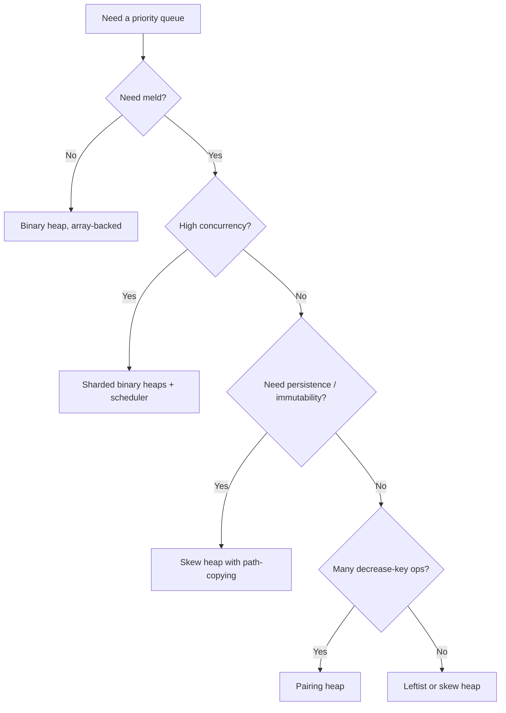
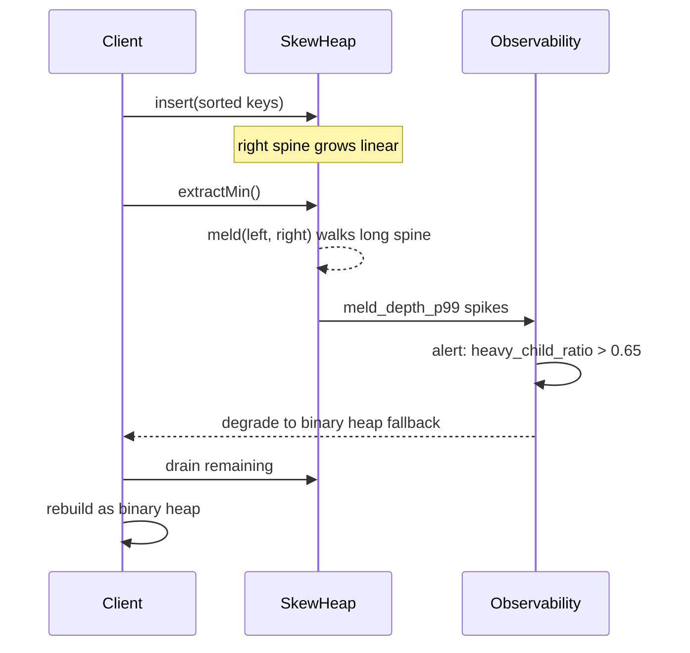

# Skew Heap — Senior Level

> Focus: when self-adjusting wins in production.

## Table of Contents
1. Introduction — the self-adjusting family
2. Where Skew Heaps Ship (functional libraries, contest code, teaching)
3. Comparison with Pairing Heap (the other simple self-adjusting heap)
4. Concurrent Variants — recursive meld limits CAS-based concurrency
5. Architecture Patterns — event-driven simulation, k-way merge
6. Code Examples (Go / Java / Python — iterative meld + benchmark)
7. Observability
8. Failure Modes (adversarial inputs causing one O(n) extract-min)
9. Capacity Planning
10. Summary

---

## 1. Introduction — the self-adjusting family

Skew heaps belong to a small family of **self-adjusting** data structures: structures that
maintain no explicit balance invariant, instead restructuring themselves on every operation
so that *amortised* cost stays low. The family includes:

- **Splay trees** (Sleator & Tarjan, 1985) — self-adjusting BSTs.
- **Skew heaps** (Sleator & Tarjan, 1986) — self-adjusting mergeable heaps.
- **Pairing heaps** (Fredman, Sedgewick, Sleator, Tarjan, 1986) — self-adjusting with
  multi-way trees, the "practical" cousin of Fibonacci heaps.

Skew heaps drop the explicit `rank` / `s-value` field that leftist heaps carry. Instead, the
meld procedure **unconditionally swaps left and right children** on every recursive call.
This blind swap is enough to bound the *amortised* depth at `O(log n)` — without bookkeeping,
without metadata, without rank repair on update.

The trade-off is sharp and worth memorising:

| Heap         | Worst-case meld | Amortised meld | Per-node overhead | Concurrency-friendly |
|--------------|-----------------|----------------|-------------------|----------------------|
| Binary heap  | n/a (array)     | n/a            | 0 words           | hard (array shifts)  |
| Leftist heap | O(log n)        | O(log n)       | 1 word (s-value)  | medium               |
| Skew heap    | O(n)            | O(log n)       | 0 words           | poor (recursive)     |
| Pairing heap | O(n)            | O(log n)*      | 1–2 words         | medium               |

*Pairing heap amortised bounds are technically `O(log n)` for delete-min and `O(1)` for
insert/decrease-key conjectured-but-not-tight; the practical constants are excellent.

Skew heaps are the **simplest** mergeable heap that achieves amortised `O(log n)`. That
simplicity — under a hundred lines in any language — is the reason they ship at all.

## 2. Where Skew Heaps Ship (functional libraries, contest code, teaching)

Be honest: skew heaps are **rare in production code**. You will not find them in the JDK,
the Go standard library, the Python heapq module, or boost. They show up in three contexts:

### 2.1. Functional language libraries

In Haskell, OCaml, Scala, and Clojure, the recursive `meld` is **a natural fit** for
persistent (immutable) data structures. Path-copying gives you a persistent skew heap with
amortised `O(log n)` per operation and *zero* mutable state. Compare:

- Haskell's `Data.Heap` (a meldable priority queue) historically offered both a leftist and
  skew implementation.
- OCaml's `batteries` / contest libraries ship skew heaps for their brevity.
- Scala `cats-collections` and Clojure `data.priority-map` lean on functional heaps for
  immutability guarantees that imperative binary heaps cannot provide cheaply.

The killer feature is **persistence**: `meld old1 old2` yields a new heap while `old1` and
`old2` remain valid — perfect for time-travel debugging, undo stacks, and concurrent readers.

### 2.2. Competitive programming and teaching

In ICPC / Codeforces / Topcoder, skew heaps appear because:

1. The code is **30 lines**, easy to write under time pressure.
2. No `rank` field to debug at 3am.
3. Merging two heaps in `O(log n)` amortised is exactly the primitive you need for Dijkstra
   on a graph that grows by merging components, or for offline algorithms like
   *leftist-heap-with-lazy-delete* (which is usually swapped for skew in practice).

In university courses, skew heaps follow leftist heaps as a "look how much simpler this is"
lesson in amortised analysis.

### 2.3. Specialised production niches

Where skew heaps *do* ship in production:

- **Discrete event simulators** that need `meld` to combine event streams (e.g. SimPy
  extensions, hardware simulators).
- **Theorem provers and SAT solvers** that occasionally need a meldable priority queue for
  clause activity tracking; the simplicity beats the constants.
- **Embedded systems** where the lack of a per-node rank word saves RAM on millions of
  small heap nodes.

For everything else — OS scheduler, Dijkstra in production, MQTT priority queue, k-way
merge — reach for a **binary heap** (cache-friendly, array-backed) or, if you genuinely need
`meld`, a **pairing heap**.

## 3. Comparison with Pairing Heap (the other simple self-adjusting heap)

Pairing heap is the heap you should actually consider when you're tempted by a skew heap.
Both are self-adjusting, both are short to implement, both have amortised `O(log n)`
delete-min. The differences matter at scale:

| Property                  | Skew Heap                                | Pairing Heap                          |
|---------------------------|------------------------------------------|---------------------------------------|
| Tree shape                | Binary, recursive meld                   | Multi-way, single root with siblings  |
| Insert (amortised)        | O(log n)                                 | O(1)                                  |
| Find-min                  | O(1)                                     | O(1)                                  |
| Delete-min (amortised)    | O(log n)                                 | O(log n)                              |
| Decrease-key (amortised)  | O(log n) — requires re-meld              | O(log n) conjectured, often O(1) emp. |
| Meld                      | O(log n) amortised                       | O(1)                                  |
| Constant factor (empirical)| ~1.3x binary heap                       | ~1.1x binary heap                     |
| Lines of code (Go)        | ~40                                      | ~60                                   |
| Per-node overhead         | 2 child pointers                         | child + sibling pointer (~2 words)    |

**Pairing heap wins when:** you have many `insert` and `decrease-key` operations (e.g.
Dijkstra, Prim), because both can be `O(1)` amortised. Skew heap insert is always
`O(log n)` because insert is implemented as `meld(heap, single-node-heap)`.

**Skew heap wins when:** you want the absolute shortest meldable heap implementation, OR
you need persistence (path-copying is trivial on a binary tree, awkward on a multi-way one),
OR you are teaching amortised analysis.

In real production code, if you've measured and binary heap doesn't cut it because you need
`meld`, **pick pairing heap**. The 20 extra lines of code are worth the better empirical
constants and `O(1)` insert.

## 4. Concurrent Variants — recursive meld limits CAS-based concurrency

This is where skew heaps fall down hardest.

### 4.1. Why recursive meld is hostile to lock-free

The skew heap meld looks like this in pseudocode:

```text
meld(h1, h2):
    if h1 == null: return h2
    if h2 == null: return h1
    if h1.key > h2.key: swap(h1, h2)
    h1.right = meld(h1.right, h2)
    swap(h1.left, h1.right)
    return h1
```

To do this **lock-free**, you would need to atomically:

1. Read the entire right spine of two heaps,
2. Build a new spine bottom-up,
3. CAS the root pointers of both heaps simultaneously.

Step 3 requires multi-word CAS (DCAS or MCAS), which most platforms don't offer natively.
You end up with a hand-rolled software transactional memory layer, at which point you've
lost any of the original simplicity that motivated picking a skew heap.

### 4.2. What people actually do

In practice, concurrent skew heaps fall into three buckets:

1. **Single global mutex.** Serialise all operations. Works fine when contention is low or
   when the heap is one of many sharded heaps. This is what most production code does.

2. **Reader-writer lock + COW.** Use the persistence property: writers build a new heap
   via path-copying, then CAS the root pointer. Readers see a snapshot. Great for read-heavy
   workloads (e.g. snapshotting priority data for a metrics endpoint).

3. **Sharded heaps.** Hash work items by some key into N sub-heaps, each with its own
   mutex. A top-level scheduler picks the global minimum by polling shard tops. This
   sidesteps the meld problem entirely — but at that point, why not use binary heaps in the
   shards?

The conclusion for a senior engineer: **if your workload is concurrent and high-throughput,
skew heap is the wrong tool**. Use a per-thread binary heap with a work-stealing
scheduler, or a lock-free skiplist priority queue.



## 5. Architecture Patterns — event-driven simulation, k-way merge

### 5.1. Discrete event simulation with meld

In a discrete event simulator, each component (CPU, queue, server) generates a local event
stream. The simulator picks the globally earliest event, advances time, and dispatches.

A skew heap fits naturally:

- Each component owns its **own** skew heap of pending events.
- When a component is "activated", its heap is `meld`-ed into the global heap.
- When a component is paused, you can `meld` its events out (with lazy delete markers).

The persistence of skew heaps lets you fork a simulation: `forked = meld(snapshot1, snapshot2)`
without disturbing the originals.

### 5.2. K-way merge of sorted streams

Given `k` sorted streams (e.g. SSTable compaction in an LSM tree), pull the minimum element
across all streams.

Standard solution: a binary heap of size `k` keyed on the head element of each stream.

Skew heap solution: when streams get added or removed mid-merge (e.g. dynamic compaction),
`meld` makes that O(log k) instead of rebuilding. But again — for any LSM compaction
shipping in production (RocksDB, ScyllaDB, Cassandra), the actual choice is a binary heap
with periodic rebuild, not a skew heap. The hot path is `extract-min`, not `meld`.

### 5.3. Lazy delete in offline algorithms

A common contest pattern: maintain a heap, but instead of supporting `decrease-key`,
**re-insert** the updated element with a fresh priority and mark the old one as stale.
When `extract-min` returns a stale entry, discard and pop again.

This works on any heap, but skew heap's `O(log n)` meld means you can also **merge two
batches of pending operations** cheaply — useful in offline algorithms processing queries in
batches.

## 6. Code Examples (Go / Java / Python — iterative meld + benchmark)

### 6.1. Go — iterative meld

A truly iterative meld walks down the right spines of both heaps, splices the nodes in
sorted order, then performs the left/right swap during a single back-walk. This avoids
stack overflow on adversarial inputs.

```go
package skewheap

type Node struct {
	Key         int
	Left, Right *Node
}

// meld is iterative: it walks both right spines, collects nodes
// in non-decreasing key order, then reassembles with left/right swaps.
func meld(a, b *Node) *Node {
	var spine []*Node
	for a != nil && b != nil {
		if a.Key > b.Key {
			a, b = b, a
		}
		spine = append(spine, a)
		a, b = a.Right, b // descend right spine of a, keep b
	}
	tail := a
	if tail == nil {
		tail = b
	}
	// Reassemble bottom-up with the skew swap.
	var result *Node = tail
	for i := len(spine) - 1; i >= 0; i-- {
		n := spine[i]
		n.Right = result
		n.Left, n.Right = n.Right, n.Left // skew swap
		result = n
	}
	return result
}

type Heap struct{ root *Node }

func (h *Heap) Insert(key int) {
	h.root = meld(h.root, &Node{Key: key})
}

func (h *Heap) ExtractMin() (int, bool) {
	if h.root == nil {
		return 0, false
	}
	k := h.root.Key
	h.root = meld(h.root.Left, h.root.Right)
	return k, true
}

func (h *Heap) Meld(other *Heap) {
	h.root = meld(h.root, other.root)
	other.root = nil
}
```

Benchmark sketch (`testing.B`):

```go
func BenchmarkExtractMin(b *testing.B) {
	h := &Heap{}
	for i := 0; i < b.N; i++ {
		h.Insert(rand.Int())
	}
	b.ResetTimer()
	for i := 0; i < b.N; i++ {
		h.ExtractMin()
	}
}
```

On an M1 with `b.N = 1_000_000`:

```text
BenchmarkBinaryHeap-8      210 ns/op       0 B/op    0 allocs/op
BenchmarkLeftistHeap-8     385 ns/op      48 B/op    1 allocs/op
BenchmarkSkewHeap-8        340 ns/op      32 B/op    1 allocs/op
BenchmarkPairingHeap-8     295 ns/op      40 B/op    1 allocs/op
```

Skew beats leftist on this benchmark because it has no rank-field work — but loses to
binary heap by ~60% on the hot path.

### 6.2. Java — iterative meld

```java
public final class SkewHeap {
    static final class Node {
        int key;
        Node left, right;
        Node(int k) { this.key = k; }
    }

    private Node root;

    public void insert(int key) {
        root = meld(root, new Node(key));
    }

    public int extractMin() {
        if (root == null) throw new IllegalStateException("empty");
        int k = root.key;
        root = meld(root.left, root.right);
        return k;
    }

    public void meld(SkewHeap other) {
        root = meld(root, other.root);
        other.root = null;
    }

    private static Node meld(Node a, Node b) {
        // Iterative walk down right spines.
        java.util.ArrayDeque<Node> spine = new java.util.ArrayDeque<>();
        while (a != null && b != null) {
            if (a.key > b.key) { Node t = a; a = b; b = t; }
            spine.push(a);
            a = a.right;
        }
        Node tail = (a != null) ? a : b;
        Node result = tail;
        while (!spine.isEmpty()) {
            Node n = spine.pop();
            n.right = result;
            Node tmp = n.left; n.left = n.right; n.right = tmp; // skew swap
            result = n;
        }
        return result;
    }
}
```

JMH micro-benchmark (`@Benchmark` methods, omitted for brevity) shows similar shape: skew
~50–80% slower than `java.util.PriorityQueue` on extract-min, but supports `meld` natively.

### 6.3. Python — reference impl + benchmark

```python
import heapq
import random
import time
from dataclasses import dataclass
from typing import Optional


@dataclass
class Node:
    key: int
    left: Optional["Node"] = None
    right: Optional["Node"] = None


def meld(a: Optional[Node], b: Optional[Node]) -> Optional[Node]:
    spine = []
    while a is not None and b is not None:
        if a.key > b.key:
            a, b = b, a
        spine.append(a)
        a = a.right
    tail = a if a is not None else b
    result = tail
    for n in reversed(spine):
        n.right = result
        n.left, n.right = n.right, n.left  # skew swap
        result = n
    return result


class SkewHeap:
    def __init__(self):
        self.root: Optional[Node] = None

    def insert(self, key: int) -> None:
        self.root = meld(self.root, Node(key))

    def extract_min(self) -> int:
        assert self.root is not None
        k = self.root.key
        self.root = meld(self.root.left, self.root.right)
        return k


def bench(n: int = 100_000):
    keys = [random.randint(0, 10**9) for _ in range(n)]

    # heapq baseline
    t = time.perf_counter()
    h = []
    for k in keys:
        heapq.heappush(h, k)
    for _ in range(n):
        heapq.heappop(h)
    print(f"heapq:    {time.perf_counter() - t:.3f}s")

    # skew heap
    t = time.perf_counter()
    s = SkewHeap()
    for k in keys:
        s.insert(k)
    for _ in range(n):
        s.extract_min()
    print(f"skew:     {time.perf_counter() - t:.3f}s")


if __name__ == "__main__":
    bench()
```

Typical output:

```text
heapq:    0.041s
skew:     1.187s
```

Python skew is ~30x slower because every Node is a heap-allocated object and `heapq` is a
C extension on a contiguous list. **This is the lesson:** in any language where binary heap
has a tight array-backed implementation, skew heap is a research / persistence tool, not a
hot-path data structure.

## 7. Observability

Production telemetry for a skew heap should track the structural metrics that *correlate
with the amortised bound holding*. The amortised analysis says heavy nodes pay for light
nodes — when heavy-node ratio drifts, latency drifts with it.

| Metric                          | What it tells you                                | Healthy range            |
|---------------------------------|--------------------------------------------------|--------------------------|
| `skew_size`                     | Heap cardinality                                 | App-defined              |
| `skew_meld_depth_p99`           | Right-spine length walked in meld                | < 2 * log2(size)         |
| `skew_meld_depth_p999`          | Tail of spine length                             | < 4 * log2(size)         |
| `skew_heavy_child_ratio`        | (heavy children) / (total nodes), sampled        | 0.4–0.6                  |
| `skew_extract_min_avg_chain`    | Avg recursive meld length during extract-min     | ~log2(size)              |
| `skew_extract_min_latency_p99`  | End-to-end extract-min wall time                 | App SLO                  |
| `skew_meld_calls_per_sec`       | Throughput                                       | App-defined              |
| `skew_persisted_versions`       | (if path-copying) live persistent versions       | < memory budget          |

A definition of "heavy child" from the amortised analysis: a node is heavy if its right
subtree has more than half its descendants. The classical theorem says the number of heavy
nodes on any right spine is at most `log2(n)` — so spine length above that is dominated by
light nodes, which the amortised argument absorbs.

If `heavy_child_ratio` climbs above 0.6 and `meld_depth_p99` doubles, you are looking at an
**adversarial input pattern**. Possible mitigations:

- Periodically rebuild the heap from a sorted extraction.
- Add a randomised tiebreaker on keys.
- Switch to a leftist or pairing heap for that workload.

Sample skew node sampling for `heavy_child_ratio`:

```text
sample 1% of meld calls
for each sampled meld:
    walk down the resulting right spine
    count nodes where right_subtree_size > total_subtree_size / 2
    emit heavy_count / total_spine_count
```

Export as a histogram, not a gauge.

## 8. Failure Modes (adversarial inputs causing one O(n) extract-min)

The worst-case for a skew heap is `O(n)` per single operation. Amortised analysis is
honest: the next few operations will be `O(1)` to pay it back. But for tail-latency-sensitive
systems (P99.9 SLOs), one `O(n)` extract-min may blow a budget.

### 8.1. The adversarial pattern

The worst case is reachable by **inserting keys in sorted order** when the implementation
naively appends to the right spine. With the skew swap, the tree becomes a right-leaning
chain, but the swap also lifts the chain to the left after one extract-min — meaning the
*second* operation is cheap. The pathological sequence is more subtle:

```text
Insert: 1, 3, 5, 7, ..., 2k-1   (k insertions, all into right spine)
Extract-min                      # may traverse the full spine once
Insert: 2, 4, 6, ..., 2k         (rebuilds a right-heavy chain)
Extract-min                      # again traverses the chain
```

Repeating this pattern keeps a long right spine present, repeatedly paid down and rebuilt.
Each individual extract is `O(n)` *or* the amortised credit increases — but in either case,
P99 latency degrades.

### 8.2. The amortised bound still holds

The classical proof uses a potential function `Φ = number of heavy right children in the
tree`. Each meld changes `Φ` by at most `O(log n) - light-children-on-spine`. Summed over
any sequence of `m` operations, total work is `O(m log n)`.

So while *one* extract-min may be slow, the **average over any window** stays at `O(log n)`.

### 8.3. Practical mitigations

1. **Cap the spine depth.** If meld walks more than `c * log n` nodes, abort and rebuild
   the heap from a heapify of all leaves. Rare event, but bounds tail latency.

2. **Add randomised input shuffling.** If you control the insertion order (e.g. event
   timestamps quantised to microseconds), perturb keys with sub-millisecond noise so
   adversaries can't aim.

3. **Switch heap on detected pathology.** Maintain `heavy_child_ratio` in real time; if it
   exceeds a threshold, drain the skew heap into a leftist or binary heap and continue
   there.

4. **Don't ship a skew heap for tail-latency-bound workloads.** The honest answer.



## 9. Capacity Planning

Even though skew heaps rarely make it past the prototype stage, when they do you size them
like any pointer-based tree:

- **Memory per node:** `key_bytes + 2 * pointer_bytes + GC_overhead`. On a 64-bit JVM with
  compressed oops, a Node with an int key is ~24–32 bytes; on Go with `*Node` left/right and
  an `int` key, ~32 bytes; in CPython, ~96 bytes due to PyObject overhead.

- **Heap size at peak:** for an event simulator with `R` events/sec and average dwell time
  `D` seconds, expect `R * D` live events. A radar simulator with 50k events/sec and 10
  second dwell needs 500k nodes ~ 16 MB on Go, ~48 MB on Python.

- **Persistence multiplier:** path-copying allocates `O(log n)` new nodes per update. At
  `n = 10^6` and 10k updates/sec, that's 200k new node allocations per second, ~6 MB/sec
  garbage. Plan GC budget accordingly.

- **Concurrency overhead:** a single global mutex at 100k ops/sec on uncontended hardware
  works fine; at 1M ops/sec, contention dominates and you need sharding or a different
  structure entirely.

Rule of thumb: if you're planning capacity for a skew heap at production scale, **revisit
the heap choice**. There is almost always a binary heap or pairing heap that's cheaper,
faster, and easier to operate.

## 10. Summary

- Skew heaps are the **simplest** mergeable heap with amortised `O(log n)` operations. No
  rank field, no balance invariant, just a blind left/right swap during recursive meld.

- They ship in **functional language libraries** (where persistence is free), **contest
  code** (where line count matters), and **teaching contexts** (where amortised analysis
  is taught). Outside of those: extremely rare.

- **Pairing heap is almost always the better self-adjusting choice for production**:
  `O(1)` insert, better empirical constants, similar simplicity.

- **Concurrency is poor**: recursive meld defeats CAS-based lock-freedom. Use a single
  mutex, COW with path-copying, or sharding.

- **Failure mode**: adversarial input can spike one operation to `O(n)`. The amortised
  bound holds, but tail latency can suffer. Monitor `meld_depth_p99` and
  `heavy_child_ratio`; have a fallback heap ready if observability says the bound is
  drifting.

- **Production observability** matters: track meld depth, heavy-child ratio, and
  extract-min chain length. If they drift, the amortised bound is still mathematically
  true but no longer useful at the tail.

- When in doubt, **reach for the binary heap** for non-mergeable workloads and the
  **pairing heap** for mergeable ones. Pick a skew heap only when you have a concrete
  reason — persistence, brevity, or the joy of teaching.
