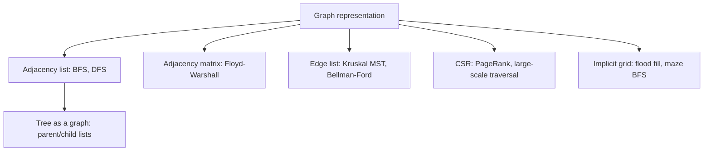

# Graph Representation — Middle Level

> **Focus:** How to convert between representations, how CSR packs an adjacency list for speed, how implicit graphs avoid storage entirely, and which algorithm prefers which layout.

---

## Table of Contents

1. [Introduction](#introduction)
2. [Deeper Concepts](#deeper-concepts)
3. [Comparison with Alternatives](#comparison-with-alternatives)
4. [Advanced Patterns](#advanced-patterns)
5. [Graph and Tree Applications](#graph-and-tree-applications)
6. [Algorithmic Integration](#algorithmic-integration)
7. [Code Examples](#code-examples)
8. [Weighted Graphs and the Edge-Object Pattern](#weighted-graphs-and-the-edge-object-pattern)
9. [Error Handling](#error-handling)
10. [Performance Analysis](#performance-analysis)
11. [Best Practices](#best-practices)
12. [Visual Animation](#visual-animation)
13. [Summary](#summary)

---

## Introduction

At junior level a graph representation is "matrix, list, or edge list." At middle level you start asking the *engineering* questions:

- When is the matrix's `O(V²)` actually fine, and when is it fatal?
- How do you convert between the three forms cheaply, and which conversions are lossy?
- Why does an adjacency list, despite optimal `O(V+E)` asymptotics, still lose cache races — and how does CSR fix it?
- When should a graph not be stored at all (implicit grids, function-defined graphs)?
- Which representation does each classic algorithm *want*, and what does it cost you to hand it the wrong one?

These decisions are not academic. The difference between a `int[V][V]` matrix and a CSR-packed list is the difference between a 4 GB allocation that OOMs and a 200 MB one that fits in cache lines — for the *same* graph.

---

## Deeper Concepts

### Converting between representations

The three representations form a small conversion graph of their own:

```
edge list  --build-->  adjacency list  --pack-->  CSR
    ^                        |
    |                        v
    +----<--scan-----  adjacency matrix
```

- **Edge list → adjacency list:** one pass, append each edge to its source's bucket. `O(V + E)`.
- **Adjacency list → edge list:** one pass over all buckets, emit `(u, v)` for each neighbor. `O(V + E)`. For undirected graphs you emit each edge twice unless you filter `u < v`.
- **Matrix → list:** scan every cell, `O(V²)` — unavoidable because you must inspect every possible edge.
- **List → matrix:** allocate `V²`, then set `M[u][v]` for each stored neighbor. `O(V² )` to zero-fill plus `O(E)` to set.
- **Adjacency list → CSR:** two passes — count degrees to build offsets, then fill the flat array. `O(V + E)`.

**Lossy conversions to watch:** a `0/1` matrix cannot represent **parallel edges** (they collapse) and loses **edge identity** (you cannot attach per-edge data beyond a single weight). Converting a multigraph to a matrix silently merges parallel edges.

### Why an adjacency list can be slow despite optimal Big-O

A `List<List<Integer>>` (Java) or `[][]int` of growable slices (Go) or `list of lists` (Python) stores neighbors in scattered heap allocations. Walking `adj[u]` for many `u` jumps all over memory, defeating the CPU cache and the prefetcher. The asymptotics are `O(V+E)` but the *constant* is dominated by cache misses. For a read-only graph traversed many times, this constant matters enormously.

### CSR — Compressed Sparse Row

CSR (also called the "compressed adjacency list" or "forward star") stores the same information as an adjacency list using just **two flat arrays**:

- `offset[]` of length `V + 1`: `offset[u]` is where `u`'s neighbors begin.
- `target[]` of length `E` (or `2E` for undirected): all neighbor ids, concatenated in vertex order.

The neighbors of `u` are exactly `target[offset[u] : offset[u+1]]`. There is no per-vertex object, no pointer chasing — just two contiguous arrays the prefetcher loves.

```
adjacency list:           CSR:
  0 -> [1, 2]             offset = [0, 2, 3, 5, 6]
  1 -> [2]               target = [1, 2,  2,  0, 3,  3]
  2 -> [0, 3]                       \__0_/ \1/ \_2_/ \3/
  3 -> [3]
```

Neighbors of vertex `2`: `target[offset[2] : offset[3]] = target[3:5] = [0, 3]`.

Building CSR is a **counting-sort-style** two-pass algorithm: count out-degrees into `offset`, prefix-sum them, then place each target into its slot.

### Implicit graphs

Some graphs are never stored at all because the adjacency relation is a *rule*:

- **Grids:** neighbors of `(r, c)` are the (up to) four orthogonal cells. No storage beyond the grid.
- **State-space graphs:** vertices are configurations (a Rubik's cube state, a sliding-puzzle board) and edges are legal moves. There may be billions of vertices; you generate neighbors on demand.
- **Function graphs:** `f(x)` defines an edge `x → f(x)` (used in cycle detection, Floyd's tortoise-and-hare).

Implicit graphs trade `O(V+E)` storage for `O(1)`-per-neighbor *computation*, which is the only way to handle graphs too large to materialize.

### A worked conversion: edge list → CSR, traced by hand

Take the directed graph `0→1, 0→2, 1→2, 2→0, 2→3, 3→3` on `V = 4`. Watch CSR fall out of a counting sort:

```text
Step 1 — count out-degrees into offset[u+1]:
  edges from 0: two  -> offset = [0, 2, 0, 0, 0]   (offset[1]=2)
  edges from 1: one  -> offset = [0, 2, 1, 0, 0]   (offset[2]=1)
  edges from 2: two  -> offset = [0, 2, 1, 2, 0]   (offset[3]=2)
  edges from 3: one  -> offset = [0, 2, 1, 2, 1]   (offset[4]=1)

Step 2 — prefix sum so offset[u] = start of u's block:
  offset = [0, 2, 3, 5, 6]

Step 3 — scatter each target using a moving cursor (copy of offset[:V]):
  cursor = [0, 2, 3, 5]
  (0,1): target[0]=1, cursor[0]=1
  (0,2): target[1]=2, cursor[0]=2
  (1,2): target[3]=2, cursor[1]=4   <-- note: slot 3, not 2
  (2,0): target[3]? no — cursor[2]=3 so target[3]=0 ... 
```

The subtle point traced above is *why a separate `cursor` is mandatory*: the scatter mutates `cursor`, never `offset`. If you scattered using `offset` directly you would destroy the block boundaries you just computed and every subsequent `Neighbors(u)` query would read garbage. The final arrays are `offset = [0,2,3,5,6]`, `target = [1,2,2,0,3,3]`, and `Neighbors(2) = target[3:5] = [0,3]`. This is the single most common CSR bug, and tracing it by hand once inoculates you against it.

### Directed vs undirected storage in each form

The same logical edge is stored differently depending on direction semantics:

| Form | Directed edge `u→v` | Undirected edge `{u,v}` |
|------|--------------------|------------------------|
| Matrix | set `M[u][v]` | set both `M[u][v]` and `M[v][u]` (symmetric) |
| Adjacency list | append `v` to `adj[u]` | append `v` to `adj[u]` **and** `u` to `adj[v]` |
| Edge list | store `(u, v)` once | store `(u, v)` once; *iterate* knowing it is symmetric |
| CSR | one target entry | two target entries (one per direction) |

The recurring trap: an undirected adjacency list or CSR needs **both** directions materialized, so it holds `2E` entries, while an undirected edge list holds only `E` rows. Forgetting the reverse direction is the number-one cause of "BFS only reaches half my graph."

---

## Comparison with Alternatives

| Attribute | Adjacency Matrix | Adjacency List | Edge List | CSR |
|-----------|------------------|----------------|-----------|-----|
| Space | `O(V²)` | `O(V + E)` | `O(E)` | `O(V + E)`, tightest constant |
| Has edge `u→v`? | `O(1)` | `O(d)` | `O(E)` | `O(d)` (or `O(log d)` if sorted) |
| Iterate neighbors of `u` | `O(V)` | `O(d)` | `O(E)` | `O(d)`, contiguous |
| Add edge (dynamic) | `O(1)` | `O(1)` amortized | `O(1)` | `O(V + E)` rebuild |
| Remove edge | `O(1)` | `O(d)` | `O(E)` | `O(V + E)` rebuild |
| Cache behavior | good (one block) but huge | poor (pointer chasing) | good (flat) | excellent (two flat arrays) |
| Mutable? | yes | yes | yes | effectively no (read-only) |
| Best for | dense, Floyd-Warshall | general traversal | Kruskal, Bellman-Ford | static high-performance |

**Choose a matrix when:** `V` is small (say `≤ 2000`, so `V² ≤ 4M` cells), the graph is dense, or you run an `O(V³)` algorithm like Floyd-Warshall where the matrix is required anyway.

**Choose an adjacency list when:** the graph is sparse and mutable, which covers the majority of interview and production problems.

**Choose an edge list when:** the algorithm only ever scans all edges — Kruskal sorts them, Bellman-Ford relaxes them — and never asks "neighbors of `u`?".

**Choose CSR when:** the graph is built once and traversed many times, performance is critical, and you can tolerate an immutable structure (most large-scale graph processing).

---

## Advanced Patterns

### Pattern: Build CSR from an edge list

Two passes, no per-vertex containers. This is the workhorse of high-performance graph code.

### Pattern: Hybrid — list for sparse vertices, matrix block for dense hubs

Real graphs are often "scale-free": a few hub vertices have enormous degree, most have tiny degree. A hybrid keeps an adjacency list overall but stores hub-to-hub edges in a small dense block, so hub neighbor tests stay `O(1)`.

### Pattern: Weighted CSR

Add a parallel `weight[]` array aligned with `target[]`: `weight[k]` is the weight of the edge ending at `target[k]`. Dijkstra reads neighbor and weight together with perfect locality.

### Pattern: Implicit grid graph

Never allocate adjacency storage; iterate the four (or eight) deltas. This is the canonical setup for flood fill, shortest path in a maze, and number-of-islands.

---

## Graph and Tree Applications



A **tree** is just a connected acyclic undirected graph and uses the same representations. The most common tree-specific layout is a `parent[]` array (each vertex stores its single parent) plus, when you need to walk downward, a `children[]` adjacency list. Rooted-tree algorithms (LCA, subtree sums) read the `children` list exactly like a directed adjacency list.

A **DAG** (directed acyclic graph) is stored as a directed adjacency list and feeds topological sort, longest-path-in-DAG, and dependency resolution.

---

## Algorithmic Integration

Which representation each classic algorithm prefers, and why:

| Algorithm | Preferred representation | Reason |
|-----------|-------------------------|--------|
| BFS / DFS | Adjacency list (or CSR) | Pure neighbor iteration; `O(V+E)`. |
| Dijkstra | Weighted adjacency list / CSR | Iterate neighbors of the popped vertex with weights. |
| Bellman-Ford | **Edge list** | Relaxes *every* edge `V−1` times — wants all edges flat. |
| Floyd-Warshall | **Adjacency matrix** | `dist[i][j] = min(dist[i][j], dist[i][k]+dist[k][j])` is inherently matrix-shaped. |
| Kruskal's MST | **Edge list** | Sort all edges by weight, then union-find. |
| Prim's MST | Adjacency list + heap | Iterate neighbors of the growing tree. |
| Topological sort | Adjacency list | Walk out-edges to compute in-degrees / DFS finish order. |
| Transitive closure | Adjacency matrix (bitset) | `O(V³)` with `V/64` speedup via bitsets. |
| PageRank / large traversal | CSR | Read-only, cache-bound, billions of edges. |

The lesson: hand Bellman-Ford an edge list and Floyd-Warshall a matrix, and the code is natural and fast. Hand Bellman-Ford a matrix and you waste `O(V²)` per pass scanning non-edges.

---

## Code Examples

### Build CSR from an edge list, then query neighbors

#### Go

```go
package main

import "fmt"

// CSR holds a directed graph in two flat arrays.
type CSR struct {
	offset []int // len V+1
	target []int // len E (or 2E for undirected)
}

// BuildCSR builds CSR for a directed graph on n vertices.
// For undirected, pass each edge twice (both directions).
func BuildCSR(n int, edges [][2]int) *CSR {
	offset := make([]int, n+1)
	for _, e := range edges { // 1) count out-degrees
		offset[e[0]+1]++
	}
	for i := 1; i <= n; i++ { // 2) prefix sum -> start offsets
		offset[i] += offset[i-1]
	}
	target := make([]int, len(edges))
	cursor := make([]int, n)
	copy(cursor, offset[:n])
	for _, e := range edges { // 3) place each target
		u, v := e[0], e[1]
		target[cursor[u]] = v
		cursor[u]++
	}
	return &CSR{offset: offset, target: target}
}

func (c *CSR) Neighbors(u int) []int {
	return c.target[c.offset[u]:c.offset[u+1]]
}

func main() {
	// directed graph 0->1, 0->2, 1->2, 2->0, 2->3, 3->3
	edges := [][2]int{{0, 1}, {0, 2}, {1, 2}, {2, 0}, {2, 3}, {3, 3}}
	g := BuildCSR(4, edges)
	for u := 0; u < 4; u++ {
		fmt.Printf("%d -> %v\n", u, g.Neighbors(u))
	}
	// 0 -> [1 2]
	// 1 -> [2]
	// 2 -> [0 3]
	// 3 -> [3]
}
```

#### Java

```java
import java.util.Arrays;

public class CSR {
    final int[] offset; // len V+1
    final int[] target; // len E

    CSR(int n, int[][] edges) {
        offset = new int[n + 1];
        for (int[] e : edges) offset[e[0] + 1]++;       // 1) count
        for (int i = 1; i <= n; i++) offset[i] += offset[i - 1]; // 2) prefix sum
        target = new int[edges.length];
        int[] cursor = Arrays.copyOf(offset, n);
        for (int[] e : edges) {                          // 3) place
            int u = e[0], v = e[1];
            target[cursor[u]++] = v;
        }
    }

    int[] neighbors(int u) {
        return Arrays.copyOfRange(target, offset[u], offset[u + 1]);
    }

    public static void main(String[] args) {
        int[][] edges = {{0, 1}, {0, 2}, {1, 2}, {2, 0}, {2, 3}, {3, 3}};
        CSR g = new CSR(4, edges);
        for (int u = 0; u < 4; u++) {
            System.out.println(u + " -> " + Arrays.toString(g.neighbors(u)));
        }
    }
}
```

#### Python

```python
def build_csr(n, edges):
    offset = [0] * (n + 1)
    for u, _ in edges:          # 1) count out-degrees
        offset[u + 1] += 1
    for i in range(1, n + 1):   # 2) prefix sum
        offset[i] += offset[i - 1]
    target = [0] * len(edges)
    cursor = offset[:n]         # copy of starts
    for u, v in edges:          # 3) place each target
        target[cursor[u]] = v
        cursor[u] += 1
    return offset, target


def neighbors(offset, target, u):
    return target[offset[u]:offset[u + 1]]


if __name__ == "__main__":
    edges = [(0, 1), (0, 2), (1, 2), (2, 0), (2, 3), (3, 3)]
    offset, target = build_csr(4, edges)
    for u in range(4):
        print(u, "->", neighbors(offset, target, u))
    # 0 -> [1, 2]
    # 1 -> [2]
    # 2 -> [0, 3]
    # 3 -> [3]
```

### Implicit grid graph — BFS neighbors without storing a graph

#### Go

```go
package main

import "fmt"

var deltas = [4][2]int{{-1, 0}, {1, 0}, {0, -1}, {0, 1}}

// Neighbors yields the in-bounds, non-wall orthogonal cells of (r, c).
func neighbors(grid [][]byte, r, c int) [][2]int {
	rows, cols := len(grid), len(grid[0])
	out := [][2]int{}
	for _, d := range deltas {
		nr, nc := r+d[0], c+d[1]
		if nr >= 0 && nr < rows && nc >= 0 && nc < cols && grid[nr][nc] != '#' {
			out = append(out, [2]int{nr, nc})
		}
	}
	return out
}

func main() {
	grid := [][]byte{
		[]byte("..#"),
		[]byte(".#."),
		[]byte("..."),
	}
	fmt.Println(neighbors(grid, 0, 0)) // [[1 0]] -- (0,1) is open too: [[0 1] [1 0]]
}
```

#### Java

```java
import java.util.ArrayList;
import java.util.List;

public class GridGraph {
    static final int[][] DELTAS = {{-1, 0}, {1, 0}, {0, -1}, {0, 1}};

    static List<int[]> neighbors(char[][] grid, int r, int c) {
        int rows = grid.length, cols = grid[0].length;
        List<int[]> out = new ArrayList<>();
        for (int[] d : DELTAS) {
            int nr = r + d[0], nc = c + d[1];
            if (nr >= 0 && nr < rows && nc >= 0 && nc < cols && grid[nr][nc] != '#') {
                out.add(new int[]{nr, nc});
            }
        }
        return out;
    }

    public static void main(String[] args) {
        char[][] grid = {
            {'.', '.', '#'},
            {'.', '#', '.'},
            {'.', '.', '.'}
        };
        for (int[] cell : neighbors(grid, 0, 0)) {
            System.out.println(cell[0] + "," + cell[1]);
        }
    }
}
```

#### Python

```python
DELTAS = ((-1, 0), (1, 0), (0, -1), (0, 1))


def neighbors(grid, r, c):
    rows, cols = len(grid), len(grid[0])
    for dr, dc in DELTAS:
        nr, nc = r + dr, c + dc
        if 0 <= nr < rows and 0 <= nc < cols and grid[nr][nc] != "#":
            yield nr, nc


if __name__ == "__main__":
    grid = ["..#", ".#.", "..."]
    print(list(neighbors(grid, 0, 0)))  # [(0, 1), (1, 0)]
```

---

## Weighted Graphs and the Edge-Object Pattern

Real algorithms — Dijkstra, Prim, Bellman-Ford — need a weight on every edge. Two clean ways to carry it:

1. **Parallel arrays (weighted CSR).** Keep a `weight[]` aligned 1:1 with `target[]`: the edge ending at `target[k]` has weight `weight[k]`. This is the cache-friendliest layout — Dijkstra reads neighbor id and weight from adjacent memory.
2. **Edge objects.** Store `(to, weight)` pairs per neighbor. More ergonomic, slightly worse locality (the weight may sit behind a pointer in boxed languages).

The parallel-array form generalizes: add a `capacity[]` for flow networks, an `id[]` to recover original edge identity, etc. Each new attribute is just another array kept lockstep with `target[]`.

### Weighted CSR with aligned weight array

#### Go

```go
package main

import "fmt"

type WCSR struct {
	offset []int
	target []int
	weight []int
}

func BuildWCSR(n int, edges [][3]int) *WCSR { // each edge: {u, v, w}
	offset := make([]int, n+1)
	for _, e := range edges {
		offset[e[0]+1]++
	}
	for i := 1; i <= n; i++ {
		offset[i] += offset[i-1]
	}
	target := make([]int, len(edges))
	weight := make([]int, len(edges))
	cursor := make([]int, n)
	copy(cursor, offset[:n])
	for _, e := range edges {
		u := e[0]
		k := cursor[u]
		target[k] = e[1]
		weight[k] = e[2] // stays aligned with target[k]
		cursor[u]++
	}
	return &WCSR{offset, target, weight}
}

func main() {
	edges := [][3]int{{0, 1, 5}, {0, 2, 3}, {2, 3, 2}}
	g := BuildWCSR(4, edges)
	for k := g.offset[0]; k < g.offset[1]; k++ {
		fmt.Printf("0 -> %d (w=%d)\n", g.target[k], g.weight[k])
	}
	// 0 -> 1 (w=5)
	// 0 -> 2 (w=3)
}
```

#### Java

```java
import java.util.Arrays;

public class WeightedCSR {
    final int[] offset, target, weight;

    WeightedCSR(int n, int[][] edges) { // each edge: {u, v, w}
        offset = new int[n + 1];
        for (int[] e : edges) offset[e[0] + 1]++;
        for (int i = 1; i <= n; i++) offset[i] += offset[i - 1];
        target = new int[edges.length];
        weight = new int[edges.length];
        int[] cursor = Arrays.copyOf(offset, n);
        for (int[] e : edges) {
            int k = cursor[e[0]]++;
            target[k] = e[1];
            weight[k] = e[2]; // aligned with target[k]
        }
    }

    public static void main(String[] args) {
        int[][] edges = {{0, 1, 5}, {0, 2, 3}, {2, 3, 2}};
        WeightedCSR g = new WeightedCSR(4, edges);
        for (int k = g.offset[0]; k < g.offset[1]; k++) {
            System.out.println("0 -> " + g.target[k] + " (w=" + g.weight[k] + ")");
        }
    }
}
```

#### Python

```python
def build_wcsr(n, edges):  # each edge: (u, v, w)
    offset = [0] * (n + 1)
    for u, _, _ in edges:
        offset[u + 1] += 1
    for i in range(1, n + 1):
        offset[i] += offset[i - 1]
    target = [0] * len(edges)
    weight = [0] * len(edges)
    cursor = offset[:n]
    for u, v, w in edges:
        k = cursor[u]
        target[k] = v
        weight[k] = w          # aligned with target[k]
        cursor[u] += 1
    return offset, target, weight


if __name__ == "__main__":
    edges = [(0, 1, 5), (0, 2, 3), (2, 3, 2)]
    offset, target, weight = build_wcsr(4, edges)
    for k in range(offset[0], offset[1]):
        print(f"0 -> {target[k]} (w={weight[k]})")
    # 0 -> 1 (w=5)
    # 0 -> 2 (w=3)
```

The only new discipline versus unweighted CSR: every write that touches `target[k]` must touch `weight[k]` at the *same* `k`. An off-by-one between the two arrays is a silent wrong-answer bug — the graph traverses fine but with the wrong costs.

---

## Error Handling

| Scenario | What goes wrong | Correct approach |
|----------|----------------|------------------|
| CSR built with a degree miscount | `offset` prefix sums to the wrong slots; targets overwrite each other. | Count into `offset[u+1]`, prefix-sum, and copy a *separate* `cursor` so you never mutate `offset`. |
| Undirected CSR missing reverse edges | Only forward direction stored; BFS misses half the graph. | Expand each undirected edge into two directed edges before building. |
| Matrix conversion drops parallel edges | `0/1` cell collapses a multigraph. | Use a count matrix or keep the list/edge-list form; document the loss. |
| Implicit grid reads out of bounds | Neighbor delta steps off the grid. | Bounds-check `0 <= nr < rows` *before* indexing `grid[nr][nc]`. |
| Mutating a CSR after building | Insert/delete shifts every offset. | Treat CSR as immutable; rebuild, or keep an adjacency list for mutable phases. |

---

## Performance Analysis

Approximate memory for a graph with `V = 10⁶` vertices and `E = 5×10⁶` directed edges (4-byte ints):

| Representation | Memory | Notes |
|----------------|--------|-------|
| Adjacency matrix | `~4 TB` (`V² · 4 B`) | Completely infeasible. |
| Adjacency list (`List<List<Integer>>`) | `~150–250 MB` | Object/boxing overhead in Java/Python dominates. |
| CSR (two `int[]`) | `~24 MB` (`(V+1 + E) · 4 B`) | Tightest; contiguous and cache-friendly. |

For a **dense** graph (`V = 2000`, `E ≈ 2×10⁶`), the matrix is `16 MB` and gives `O(1)` lookups — perfectly reasonable, and required for Floyd-Warshall.

#### Python — measure list vs CSR traversal

```python
import random
import time

n, m = 200_000, 1_000_000
edges = [(random.randrange(n), random.randrange(n)) for _ in range(m)]

# adjacency list
adj = [[] for _ in range(n)]
for u, v in edges:
    adj[u].append(v)

# CSR
offset = [0] * (n + 1)
for u, _ in edges:
    offset[u + 1] += 1
for i in range(1, n + 1):
    offset[i] += offset[i - 1]
target = [0] * m
cur = offset[:n]
for u, v in edges:
    target[cur[u]] = v
    cur[u] += 1


def sum_list():
    s = 0
    for u in range(n):
        for v in adj[u]:
            s += v
    return s


def sum_csr():
    s = 0
    for u in range(n):
        for k in range(offset[u], offset[u + 1]):
            s += target[k]
    return s


for name, fn in (("list", sum_list), ("csr", sum_csr)):
    t = time.perf_counter()
    fn()
    print(name, round((time.perf_counter() - t) * 1000), "ms")
```

CSR typically wins by `1.2–2×` on this scan because `target[]` is one contiguous array versus thousands of scattered sub-lists. In compiled languages (Go, Java, C++) the gap is larger because the cache effect is not hidden behind interpreter overhead.

---

## Best Practices

- **Build once, choose deliberately.** Read the algorithm first; let it dictate the representation (edge list for Kruskal, matrix for Floyd-Warshall, list/CSR for traversal).
- **Use CSR for static, hot, large graphs.** If you will traverse a fixed graph thousands of times, the two-pass build pays for itself immediately.
- **Keep undirected expansion in one place.** Whether building a list or CSR, expand `(u, v)` to both directions in a single helper so you never forget one.
- **Never materialize an implicit graph.** Grids and state spaces should compute neighbors on demand; storing them is often impossible.
- **Align parallel arrays.** In weighted CSR, keep `weight[k]` lockstep with `target[k]`; an off-by-one between them is a silent correctness bug.

---

## Visual Animation

> See [`animation.html`](./animation.html) for an interactive view.
>
> The middle-level animation highlights:
> - Switching the same graph between matrix, adjacency-list, and edge-list views.
> - How adding an edge updates each representation in place.
> - A single-edge query showing the `O(1)` matrix lookup versus the `O(degree)` list scan.

---

## Summary

The three representations are not rivals so much as tools for different jobs, and the middle-level skill is *converting between them* and knowing *which one each algorithm wants*. The adjacency matrix is mandatory for dense, matrix-shaped algorithms; the edge list is the natural input for Kruskal and Bellman-Ford; the adjacency list is the universal default for traversal. CSR is the same adjacency list packed into two flat arrays, trading mutability for cache-friendly speed on static graphs. And the best representation is sometimes *no representation at all* — implicit grids and state spaces compute their edges on demand, the only way to handle graphs too large to store.
