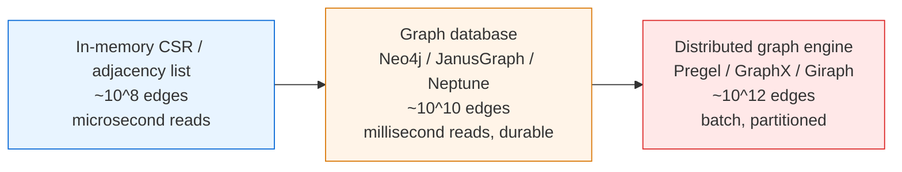
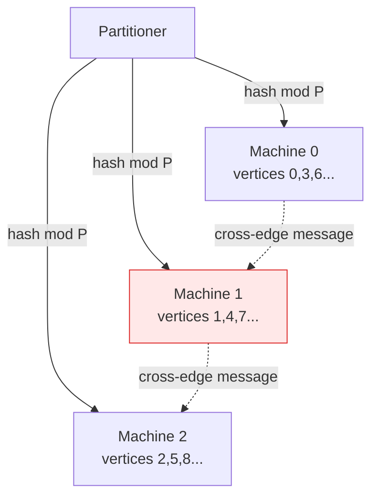

# Graph Representation — Senior Level

> A representation that is perfect on a single node — an `O(V²)` matrix, a pointer-rich adjacency list — becomes a production incident the moment the graph outgrows one machine's RAM, must be queried concurrently, or has to be updated while traffic is live. At scale, the representation *is* the system-design decision.

## Table of Contents
1. [Introduction](#1-introduction)
2. [System Design — Graph Stores and When to Materialize](#2-system-design--graph-stores-and-when-to-materialize)
3. [Distributed and Out-of-Core Graphs](#3-distributed-and-out-of-core-graphs)
4. [Concurrency — Immutable CSR and Concurrent Reads](#4-concurrency--immutable-csr-and-concurrent-reads)
5. [Comparison at Scale](#5-comparison-at-scale)
6. [Architecture Patterns](#6-architecture-patterns)
7. [Code Examples](#7-code-examples)
8. [Observability](#8-observability)
9. [Failure Modes](#9-failure-modes)
10. [Capacity Planning — Bytes per Edge](#10-capacity-planning--bytes-per-edge)
11. [Summary](#11-summary)

---

## 1. Introduction

At the senior level the question is no longer "matrix or list?" but "where does this graph live, how is it built, who reads it concurrently, and what breaks when it grows past one machine?". A graph representation has three properties that drive every architectural decision:

- **Size.** `O(V²)` matrices are unusable past a few thousand vertices; `O(V+E)` lists scale to hundreds of millions of edges on one box, then need partitioning.
- **Mutability.** A live social or routing graph changes constantly; a batch analytics graph is built once and read a billion times. These want opposite representations.
- **Access pattern.** Point lookups ("are `u` and `v` connected?") want different layouts than full scans (PageRank, connected components).

The senior decisions are therefore: when to materialize a graph versus query it from a database; how to partition it across machines; how to make it safe for thousands of concurrent readers; and how to plan capacity in bytes-per-edge so you know the break point before you hit it.

---

## 2. System Design — Graph Stores and When to Materialize

### 2.1 Three tiers of graph storage



| Tier | When right | When wrong |
| --- | --- | --- |
| In-memory CSR / list | Fits in RAM, read-heavy, latency-critical traversal. | Graph exceeds RAM or must survive restarts without a rebuild. |
| Graph database | Durable, transactional, ad-hoc queries, mutable. | You run iterative analytics over the whole graph — DB traversal overhead dominates. |
| Distributed engine | Whole-graph analytics (PageRank, components) on `10¹¹`+ edges. | You need single-pair point queries — batch latency is seconds to minutes. |

### 2.2 Materialize vs query-on-demand

The most expensive recurring decision: do you **materialize** an in-memory representation (CSR), or **query** edges from a backing store per traversal step?

- Materialize when the graph fits in RAM and is read far more than written. Building CSR once and traversing it millions of times amortizes the build cost to nothing.
- Query-on-demand when the graph is huge, sparse in access (you only ever touch a small neighborhood), or changes faster than you can rebuild. A 2-hop friend recommendation touches thousands of edges out of billions — materializing the whole graph would be absurd.

A common hybrid: materialize a CSR snapshot for the read-mostly core, fall back to the database for the long tail and for writes.

---

## 3. Distributed and Out-of-Core Graphs

### 3.1 Partitioning — the central problem

To store a graph across `P` machines you must assign each vertex (and its edges) to a partition. The quality of the partition determines how many edges *cross* machines, and cross-partition edges are the cost — every traversal step that crosses a partition is a network hop.

- **Edge-cut partitioning** (assign vertices to machines, cut edges between them). Used by Pregel/Giraph. Minimizing the cut is NP-hard; in practice hash partitioning (`hash(vertex) mod P`) is used for simplicity, and metis-style multilevel partitioners are used when cut quality matters.
- **Vertex-cut partitioning** (assign edges to machines, replicate vertices). Used by PowerGraph/GraphX, much better for **power-law graphs** where a few hub vertices have enormous degree. A single hub's edges are split across many machines instead of overwhelming one.



### 3.2 Pregel / vertex-centric model

Pregel (and its open-source descendants Giraph and Spark GraphX) represents the graph as partitioned adjacency lists and runs computation in **supersteps**: each vertex reads incoming messages, updates its state, and sends messages along its out-edges. The representation is a distributed CSR — each partition holds a local CSR plus a routing table mapping remote vertex ids to their owning machine. PageRank, connected components, and shortest paths all fit this "think like a vertex" model.

### 3.3 Out-of-core (single machine, disk-backed)

When a graph exceeds RAM but you do not want a cluster, **out-of-core** engines (GraphChi, X-Stream) stream the CSR from disk in shards. The key trick is ordering edges so that a sequential disk scan visits all edges touching a contiguous vertex range — turning random graph access into sequential I/O. CSR's flat layout is exactly what makes this possible; a pointer-based adjacency list cannot be streamed.

---

## 4. Concurrency — Immutable CSR and Concurrent Reads

### 4.1 The read-mostly graph

Most large graphs are read far more than written. The cleanest concurrency story is an **immutable CSR**: build it once, then share it across all reader threads with zero locking. Two flat arrays with no interior mutability are trivially thread-safe; readers never contend.

### 4.2 Handling writes — snapshot swap

When the graph must change, do **not** mutate the shared CSR in place. Instead:

1. Apply writes to a side buffer (a mutable delta log or a fresh adjacency list).
2. Periodically rebuild a new immutable CSR snapshot from the base plus deltas.
3. Atomically swap a single pointer (`atomic.Value` in Go, `AtomicReference` in Java) so new readers see the new snapshot; old readers finish on the old one and it is GC'd.

This is copy-on-write at the whole-graph granularity. Readers are lock-free; writers pay a periodic rebuild. It is exactly how read-optimized stores serve a slowly-changing graph under heavy concurrent load.

### 4.3 Fine-grained mutable graphs

If writes are frequent and reads must see them immediately, you fall back to a concurrent adjacency list with per-vertex locks (lock striping by vertex id) or a concurrent map of neighbor sets. This loses CSR's cache benefits but supports real-time mutation — the trade-off a graph database makes internally.

---

## 5. Comparison at Scale

| Representation | Build | Point query | Full scan | Mutable | Distributable | When |
| --- | --- | --- | --- | --- | --- | --- |
| In-memory matrix | `O(V²)` | `O(1)` | `O(V²)` | yes | poorly (dense blocks) | small dense graphs only |
| In-memory adjacency list | `O(V+E)` | `O(d)` | `O(V+E)` | yes | hard (pointers) | mutable, fits RAM |
| Immutable CSR | `O(V+E)` | `O(d)` | `O(V+E)`, fastest | no (rebuild) | yes (shard offsets) | static, read-heavy, hot |
| Graph database (Neo4j) | incremental | `O(d)` + I/O | slow (full scan over storage) | yes, ACID | clustered | durable, transactional, ad-hoc |
| Distributed CSR (Pregel) | `O((V+E)/P)` | network hop | `O((V+E)/P)` per superstep | batch | yes | whole-graph analytics |

The in-memory CSR wins whenever the graph fits in RAM and is read-mostly. The graph database wins when durability and transactions matter. The distributed engine wins only when the graph genuinely does not fit on one large machine — and modern machines hold a *lot* of edges, so reach for the cluster later than you think.

---

## 6. Architecture Patterns

### 6.1 CSR snapshot with atomic swap

```
writes --> delta log --> (periodic rebuild) --> new immutable CSR
                                                      |
readers ----atomic load of current snapshot pointer--+
```

Readers always dereference one atomic pointer to the current CSR and traverse lock-free. A background job rebuilds and swaps. Bounded staleness (the rebuild interval) is the trade-off for lock-free reads.

### 6.2 Tiered: hot CSR + cold database

Keep the read-hot subgraph (recent, high-traffic vertices) materialized in CSR; serve cold queries from the durable graph database. A cache-miss promotes a vertex's neighborhood into the hot tier. This bounds RAM while keeping the common case fast.

### 6.3 Compressed representations for scale

For web-scale graphs, store CSR with **gap-encoded, variable-length** neighbor ids (sort each vertex's neighbors, store deltas, compress with a byte-aligned varint or the WebGraph framework). This routinely cuts a web graph from `O(E)` 4-byte ids to `2–4 bits per edge`, letting a graph that would need 400 GB fit in 30 GB. The cost is `O(d)` decode per neighbor scan — usually worth it because memory, not CPU, is the bottleneck at this scale.

---

## 7. Code Examples

### 7.1 Go — immutable CSR with atomic snapshot swap

```go
package graph

import (
	"sort"
	"sync"
	"sync/atomic"
)

// CSR is an immutable, read-only graph snapshot. Safe for concurrent readers.
type CSR struct {
	offset []int32
	target []int32
}

func (c *CSR) Neighbors(u int32) []int32 {
	return c.target[c.offset[u]:c.offset[u+1]]
}

// buildCSR turns a directed edge slice into an immutable CSR.
func buildCSR(n int32, edges [][2]int32) *CSR {
	offset := make([]int32, n+1)
	for _, e := range edges {
		offset[e[0]+1]++
	}
	for i := int32(1); i <= n; i++ {
		offset[i] += offset[i-1]
	}
	target := make([]int32, len(edges))
	cursor := make([]int32, n)
	copy(cursor, offset[:n])
	for _, e := range edges {
		u := e[0]
		target[cursor[u]] = e[1]
		cursor[u]++
	}
	return &CSR{offset: offset, target: target}
}

// Store holds the current snapshot plus a pending write buffer.
type Store struct {
	n       int32
	current atomic.Pointer[CSR] // lock-free read
	mu      sync.Mutex          // guards pending writes
	pending [][2]int32
	base    [][2]int32
}

func NewStore(n int32, edges [][2]int32) *Store {
	s := &Store{n: n, base: edges}
	s.current.Store(buildCSR(n, edges))
	return s
}

// Read path: no locks, just an atomic load.
func (s *Store) Neighbors(u int32) []int32 {
	return s.current.Load().Neighbors(u)
}

// Write path: buffer the edge; it becomes visible after Rebuild.
func (s *Store) AddEdge(u, v int32) {
	s.mu.Lock()
	s.pending = append(s.pending, [2]int32{u, v})
	s.mu.Unlock()
}

// Rebuild folds pending edges into a fresh snapshot and swaps atomically.
func (s *Store) Rebuild() {
	s.mu.Lock()
	all := make([][2]int32, 0, len(s.base)+len(s.pending))
	all = append(all, s.base...)
	all = append(all, s.pending...)
	s.base = all
	s.pending = nil
	s.mu.Unlock()

	sort.Slice(all, func(i, j int) bool { return all[i][0] < all[j][0] })
	s.current.Store(buildCSR(s.n, all)) // readers see new snapshot atomically
}
```

Notes for review:

- Reads are fully lock-free — one atomic pointer load, then a slice into immutable arrays.
- Writes are buffered and applied in batches by `Rebuild`; this trades bounded staleness for lock-free reads.
- `int32` ids halve memory versus `int`; for `> 2³¹` vertices, switch to `int64`.

### 7.2 Java — immutable CSR shared across reader threads

```java
import java.util.Arrays;
import java.util.concurrent.atomic.AtomicReference;

public final class GraphStore {
    // Immutable snapshot: two flat arrays, no interior mutability.
    public static final class CSR {
        final int[] offset;
        final int[] target;

        CSR(int[] offset, int[] target) {
            this.offset = offset;
            this.target = target;
        }

        public int[] neighbors(int u) {
            return Arrays.copyOfRange(target, offset[u], offset[u + 1]);
        }
    }

    private final int n;
    private final AtomicReference<CSR> current = new AtomicReference<>();

    public GraphStore(int n, int[][] edges) {
        this.n = n;
        current.set(build(n, edges));
    }

    public int[] neighbors(int u) { // lock-free read
        return current.get().neighbors(u);
    }

    public void swap(int[][] edges) { // build new snapshot, publish atomically
        current.set(build(n, edges));
    }

    private static CSR build(int n, int[][] edges) {
        int[] offset = new int[n + 1];
        for (int[] e : edges) offset[e[0] + 1]++;
        for (int i = 1; i <= n; i++) offset[i] += offset[i - 1];
        int[] target = new int[edges.length];
        int[] cursor = Arrays.copyOf(offset, n);
        for (int[] e : edges) target[cursor[e[0]]++] = e[1];
        return new CSR(offset, target);
    }
}
```

The `final` fields plus the `AtomicReference` publication give the JMM guarantee that a reader observing a new snapshot sees fully-initialized arrays. No reader ever needs a lock.

### 7.3 Python — out-of-core CSR scan from disk shards

```python
import struct
from typing import Iterator, Tuple


def scan_csr_shard(offset_path: str, target_path: str,
                   lo: int, hi: int) -> Iterator[Tuple[int, int]]:
    """Stream edges for vertices [lo, hi) sequentially from on-disk CSR arrays.

    offset_path: int32 offsets, length V+1
    target_path: int32 targets, length E
    Yields (u, v) edges; sequential disk reads make this out-of-core friendly.
    """
    with open(offset_path, "rb") as fo:
        fo.seek(lo * 4)
        offs = struct.unpack(f"<{hi - lo + 1}i", fo.read((hi - lo + 1) * 4))
    start, end = offs[0], offs[-1]
    with open(target_path, "rb") as ft:
        ft.seek(start * 4)
        chunk = ft.read((end - start) * 4)
    targets = struct.unpack(f"<{end - start}i", chunk)
    for u in range(lo, hi):
        a = offs[u - lo] - start
        b = offs[u - lo + 1] - start
        for k in range(a, b):
            yield u, targets[k]
```

Because CSR is flat, one `seek` + one big `read` pulls an entire vertex range's edges as sequential I/O — the property that makes disk-backed graph processing viable. A pointer-based adjacency list could never be streamed this way.

---

## 8. Observability

A graph representation is invisible until it OOMs or a traversal mysteriously slows. Instrument:

| Metric | Type | Why |
| --- | --- | --- |
| `graph_vertices`, `graph_edges` | gauge | Track growth toward the RAM ceiling. |
| `graph_bytes_resident` | gauge | Actual memory; compare against capacity plan. |
| `graph_max_degree` | gauge | A new super-hub can blow up per-vertex work and skew partitions. |
| `csr_rebuild_seconds` | histogram | Snapshot rebuild time; if it exceeds the write rate you fall behind. |
| `csr_snapshot_staleness_seconds` | gauge | How old is the current snapshot? Bounds read consistency. |
| `traversal_neighbors_visited` | histogram | Detect a query touching far more of the graph than expected. |
| `partition_cross_edge_ratio` | gauge | Fraction of edges crossing machines; high = bad partition, more network hops. |
| `graph_cache_miss_rate` | gauge | CSR locality regression (e.g. after losing vertex-order locality). |

The most actionable are `graph_bytes_resident` against the capacity plan, and `partition_cross_edge_ratio` for distributed graphs — a bad partition silently turns local reads into network storms.

---

## 9. Failure Modes

### 9.1 Matrix OOM on a sparse graph
Someone reaches for `int[V][V]` on a graph that grew to `V = 10⁵`. That is `10¹⁰` cells — instant OOM. Mitigation: never allocate a matrix without checking `V² · cellsize` against available RAM; default to a list/CSR.

### 9.2 Super-hub degree explosion
A power-law graph gains a celebrity vertex with degree `10⁸`. Any per-vertex operation that materializes `neighbors(hub)` allocates a huge slice; hash partitioning dumps the whole hub on one machine. Mitigation: vertex-cut partitioning, streaming neighbor iteration (never copy the slice), and degree-capping or two-level hub handling.

### 9.3 Snapshot rebuild falling behind writes
Write rate exceeds rebuild throughput; the delta log grows unbounded and staleness climbs. Mitigation: incremental CSR updates for the hot region, faster (parallel) rebuilds, or back-pressure on writes.

### 9.4 Lost vertex-order locality
Ids get renumbered (e.g. after a re-import) so neighbors are no longer near each other in `target[]`. Cache-miss rate spikes, traversals slow 3–5×. Mitigation: relabel vertices by a locality-preserving order (BFS order, or a space-filling curve for spatial graphs) before building CSR.

### 9.5 Cross-partition message storm
A poorly partitioned distributed graph sends a message across the network for nearly every edge. Mitigation: measure `partition_cross_edge_ratio`, repartition with a multilevel partitioner, or switch edge-cut → vertex-cut for power-law graphs.

### 9.6 Concurrent mutation tearing
Someone mutates a "shared" adjacency list while readers traverse it, producing torn reads or `ConcurrentModificationException`. Mitigation: make the shared representation immutable (CSR + atomic swap); route all writes through the rebuild path.

---

## 10. Capacity Planning — Bytes per Edge

### 10.1 The fundamental numbers

Per directed edge, by representation (32-bit ids):

- **CSR:** `4 bytes` (one `int32` in `target[]`) plus the amortized `offset` cost `4·(V+1)/E` bytes. For `E ≫ V`, effectively **4 bytes/edge**.
- **Adjacency list (`int[]` per vertex):** `4 bytes/edge` for the value plus slice/array header overhead per vertex (`~24–48 bytes/vertex` in Go/Java) and capacity slack (often 1.5–2× over-allocation).
- **Adjacency list (`List<Integer>` in Java):** `16 bytes/edge` — each `Integer` is a boxed object (`~16 B`) plus the backing array reference. Avoid boxed collections for large graphs.
- **Adjacency matrix:** `V²/8 bytes` for a bitset (`0/1`), `V² · 4` for weighted. Independent of `E`.
- **Compressed (gap + varint):** `0.25–1 byte/edge` on web graphs — the only way to fit `10¹¹`-edge graphs in commodity RAM.

### 10.2 Worked example

A social graph: `V = 2×10⁸` users, average degree 200, so `E = 4×10¹⁰` directed edges.

- CSR with `int32` ids: `4·10¹⁰ · 4 B = 160 GB` of targets + `(2×10⁸+1)·4 B ≈ 0.8 GB` offsets ≈ **161 GB**. Fits on a single large memory-optimized instance (e.g. 256–512 GB RAM). Materialize it.
- Same as `List<List<Integer>>` in Java: `~16 B/edge = 640 GB` plus per-vertex overhead — does **not** fit; you would shard or switch to primitive CSR.
- Compressed CSR (gap-encoded, ~1 B/edge): `~40 GB` — fits comfortably, at the cost of varint decode per neighbor.

### 10.3 When to leave a single node

Move off in-memory CSR when any of these holds:

- `bytes(E) + bytes(V)` exceeds the largest practical single-machine RAM (today ~1–2 TB) even after compression.
- The graph must be durable and transactional → graph database.
- Whole-graph analytics latency on one machine is unacceptable → distributed engine with partitioned CSR.

Until then, one big box with a compressed immutable CSR beats a cluster on both latency and operational simplicity. Modern hardware holds tens of billions of edges; reach for distribution later than instinct suggests.

---

## 11. Summary

- The representation is a system-design decision: size, mutability, and access pattern dictate it more than asymptotics do.
- Materialize an in-memory CSR when the graph fits in RAM and is read-mostly; query a graph database when durability and transactions matter; reach for a distributed engine only when the graph truly does not fit on one large machine.
- Partitioning quality (edge-cut vs vertex-cut) determines network cost; power-law graphs need vertex-cut to tame super-hubs.
- Immutable CSR plus atomic snapshot swap gives lock-free concurrent reads with bounded staleness — the cleanest concurrency story for a read-heavy graph.
- Plan in bytes-per-edge: primitive CSR is ~4 B/edge, boxed Java lists ~16 B/edge, compressed web graphs under 1 B/edge. The break point is predictable; compute it before you allocate.
- Watch `graph_bytes_resident`, `csr_snapshot_staleness`, super-hub degree, and `partition_cross_edge_ratio` — these catch the failures (OOM, stale reads, message storms) that throughput metrics miss.

References to study further: Pregel (Malewicz et al. 2010), PowerGraph vertex-cut partitioning (Gonzalez et al. 2012), GraphChi out-of-core (Kyrola et al. 2012), the WebGraph compression framework (Boldi & Vigna), and Neo4j's native graph storage internals.
