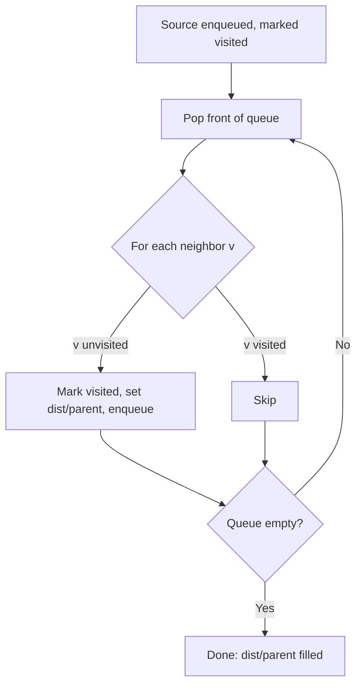

# Breadth-First Search (BFS) — Junior Level

> **One-line summary:** Breadth-First Search explores a graph layer by layer using a FIFO queue and a visited set; it visits every vertex and edge in `O(V+E)` time, and in an **unweighted** graph it discovers the **shortest path** (fewest edges) from the source to every reachable vertex.

---

## Table of Contents

1. [Introduction](#introduction)
2. [Prerequisites](#prerequisites)
3. [Glossary](#glossary)
4. [Core Concepts](#core-concepts)
5. [Big-O Summary](#big-o-summary)
6. [Real-World Analogies](#real-world-analogies)
7. [Pros & Cons](#pros--cons)
8. [Step-by-Step Walkthrough](#step-by-step-walkthrough)
9. [Code Examples](#code-examples)
10. [Coding Patterns](#coding-patterns)
11. [Error Handling](#error-handling)
12. [Performance Tips](#performance-tips)
13. [Best Practices](#best-practices)
14. [Edge Cases & Pitfalls](#edge-cases--pitfalls)
15. [Common Mistakes](#common-mistakes)
16. [Cheat Sheet](#cheat-sheet)
17. [Visual Animation](#visual-animation)
18. [Summary](#summary)
19. [Further Reading](#further-reading)

---

## Introduction

**Breadth-First Search (BFS)** is one of the two fundamental ways to walk a graph (the other is Depth-First Search). Where DFS dives as deep as it can before backtracking, BFS spreads outward in **concentric rings**: it visits the source, then every neighbor of the source, then every neighbor-of-a-neighbor, and so on. Each ring is one edge farther from the start than the last.

That single property — process nodes in order of increasing distance — is what makes BFS special. In a graph where every edge counts the same (an **unweighted** graph), the first time BFS reaches a vertex, it has reached it by a path with the **fewest possible edges**. No later, longer path can ever improve on it. So BFS is not just a traversal; it is the simplest correct algorithm for **shortest paths in unweighted graphs**.

BFS was described by **E. F. Moore in 1959** (for finding the shortest path out of a maze) and independently by **C. Y. Lee in 1961** (for routing wires on circuit boards). The mechanism is almost embarrassingly simple:

1. A **FIFO queue** holds the "frontier" — the nodes discovered but not yet expanded.
2. A **visited set** records which nodes we have already discovered, so we never enqueue the same node twice.

Take a node off the front of the queue, look at its neighbors, and push every *unvisited* neighbor onto the back. Repeat until the queue is empty. Because the queue is first-in-first-out, nodes always come out in the order they were discovered, which is exactly order of distance from the source.

The same idea works on an **explicit graph** (an adjacency list of nodes and edges) and on an **implicit graph** such as a 2D grid, where the "neighbors" of a cell are the cells up/down/left/right. Grid BFS powers flood fill, maze solving, and dozens of interview favorites like *rotting oranges* and *shortest path in a binary matrix*.

---

## Prerequisites

Before reading this file you should be comfortable with:

- **Graphs basics** — vertices (nodes) and edges; directed vs undirected. The sibling topic *graph representation* covers adjacency lists and matrices.
- **Queues (FIFO)** — `enqueue`/`dequeue`, and why "first in, first out" matters here.
- **Hash sets / boolean arrays** — for the visited marker.
- **Arrays and 2D arrays** — grids are stored as a matrix.
- **Big-O notation** — `O(V+E)`, `O(n*m)` for grids.
- **Basic loops** — BFS is a single `while` loop over the queue.

Optional but helpful:

- Brief exposure to **DFS** so you can contrast the two.
- A library queue type (`collections.deque`, `ArrayDeque`, a slice + index).

---

## Glossary

| Term | Meaning |
|------|---------|
| **BFS** | Breadth-First Search: a level-order traversal of a graph from a source. |
| **Vertex / node** | A point in the graph. |
| **Edge** | A connection between two vertices. |
| **Adjacency list** | `adj[u]` = the list of vertices directly reachable from `u`. The usual graph storage. |
| **Frontier** | The set of nodes currently in the queue — the "wavefront" of the search. |
| **Visited set** | Marks discovered nodes so each is enqueued exactly once. |
| **FIFO queue** | First-in-first-out container; the heart of BFS. |
| **Distance / level** | Number of edges on the shortest path from the source to a node. |
| **BFS tree** | The tree formed by the edges through which each node was first discovered. |
| **Parent / predecessor** | The node that discovered a given node; used to reconstruct a path. |
| **Source** | The starting vertex (single-source) or vertices (multi-source). |
| **Implicit graph** | A graph whose nodes/edges are computed on the fly, e.g. a grid. |
| **Connected component** | A maximal set of mutually reachable vertices (undirected). |

---

## Core Concepts

### 1. The Two Data Structures

BFS needs exactly two things:

```
queue   — FIFO; holds nodes discovered but not yet expanded
visited — set/array; true once a node has been discovered
```

The golden rule: **mark a node visited the moment you enqueue it, not when you dequeue it.** This guarantees each node is added to the queue at most once. (Marking at dequeue time lets the same node be enqueued by several neighbors before it is processed — a classic bug, covered in [Common Mistakes](#common-mistakes).)

### 2. The Loop

```
bfs(source):
    visited = {source}
    queue   = [source]
    while queue not empty:
        u = queue.pop_front()        # FIFO dequeue
        for v in neighbors(u):
            if v not in visited:
                visited.add(v)
                queue.push_back(v)
```

That's it. Every reachable node is dequeued once; every edge is examined once (twice in an undirected graph, once from each endpoint). Hence `O(V + E)`.

### 3. Distance Layers (the BFS tree)

Add a `dist` array and you get shortest distances for free:

```
dist[source] = 0
when you discover v from u:
    dist[v] = dist[u] + 1
```

Because the queue is FIFO, nodes leave it in non-decreasing `dist` order: all the distance-0 nodes, then all distance-1, then distance-2, and so on. The edge `u → v` that first reaches `v` is a **tree edge**; collect those and you have the **BFS tree**, whose root-to-node path is a shortest path.

```
        source (dist 0)
        /     \
     A (1)    B (1)          <- first ring
     /  \       \
   C(2)  D(2)   E(2)         <- second ring
```

### 4. Path Reconstruction

To recover *the actual path*, also store a `parent`:

```
parent[v] = u    # the node that discovered v
```

Then walk `parent` backward from the target to the source and reverse the list. (Details in [Coding Patterns](#coding-patterns).)

### 5. BFS on a Grid (implicit graph)

A grid is a graph in disguise. Each cell `(r, c)` is a node; its neighbors are the in-bounds, walkable cells in the four directions (sometimes eight, with diagonals):

```
directions = [(-1,0),(1,0),(0,-1),(0,1)]
for (dr, dc) in directions:
    nr, nc = r + dr, c + dc
    if in bounds and grid[nr][nc] is open and not visited:
        enqueue (nr, nc)
```

Everything else — the queue, the visited grid, the distance layers — is identical to graph BFS.

### 6. Why BFS Finds Shortest Paths (intuition)

The queue is sorted by distance. The first time you pop `v`, every node ahead of it had distance `≤ dist[v]`, and `v` got its distance from a node one ring closer. No path with fewer edges to `v` could have been missed, because that shorter path's last node would have been popped earlier and would have discovered `v` first. A rigorous proof lives in [`professional.md`](./professional.md). **This guarantee holds only when all edges have equal weight.** For weighted graphs you need Dijkstra (sibling topic *Dijkstra*) or, for 0/1 weights, *0-1 BFS* (sibling topic).

---

## Big-O Summary

| Quantity | Cost | Notes |
|----------|------|-------|
| Time (adjacency list) | **O(V + E)** | Each vertex dequeued once, each edge scanned once (twice if undirected). |
| Time (grid `n×m`) | **O(n·m)** | Each cell visited once, constant neighbors each. |
| Time (adjacency matrix) | **O(V²)** | Scanning a full row per vertex. |
| Space — queue | **O(V)** | Worst case the whole frontier is queued at once. |
| Space — visited | **O(V)** | One flag per vertex. |
| Space — dist / parent | **O(V)** | Optional but cheap. |
| Shortest path (unweighted) | **O(V + E)** | The headline result. |
| Connected components | **O(V + E)** | One BFS per unvisited start. |

---

## Real-World Analogies

| Concept | Analogy |
|---------|---------|
| The expanding frontier | Drop a stone in a pond. **Ripples** spread outward in perfect rings; everything one ring out is reached before anything two rings out. |
| Shortest-path guarantee | The first ripple to reach a floating leaf took the shortest route — later ripples are slower by definition. |
| Friend-of-friend | To find the **degrees of separation** between you and someone else, you check your friends (1 hop), then their friends (2 hops), and so on. BFS = "social search outward." |
| Visited set | A "**been there**" stamp on each person so you never re-investigate the same friend. |
| The queue | A **waiting line**: people you've heard of but haven't called yet are served strictly in the order you heard of them. |
| Multi-source BFS | Several stones dropped at once; the ripples merge, and each point is reached by whichever stone is nearest. |

Where the analogy breaks: real ripples are continuous, BFS is discrete — distance is counted in whole edges, not real numbers.

---

## Pros & Cons

| Pros | Cons |
|------|------|
| Finds shortest paths in unweighted graphs — exactly, simply. | Useless for *weighted* shortest paths (use Dijkstra). |
| Linear `O(V+E)` time. | Can use a lot of memory: the frontier may hold most of the graph at once. |
| Iterative — no recursion, so no stack-overflow risk on deep graphs. | Does not naturally explore "deep" structure (topological order, cycle classification — DFS is better there). |
| Same code shape for graphs and grids. | On very wide graphs the queue can blow up before you reach the target. |
| Great for "nearest X" and "fewest steps" questions. | Distance is in edges only; cannot weigh edges differently. |
| Multi-source variant is a one-line change. | Re-running per query is wasteful if you need many sources (precompute or use other tools). |

**When to use:** shortest path / minimum number of steps in an unweighted graph or grid, connected components, bipartite check, flood fill, "nearest exit / nearest gate," level-order traversal, web-crawl-by-distance.

**When NOT to use:** weighted shortest paths (Dijkstra), detecting/classifying back edges and cycles (DFS), topological sort (DFS or Kahn), all-pairs shortest paths (Floyd–Warshall).

---

## Step-by-Step Walkthrough

Undirected graph, adjacency list, source = `0`:

```
0: [1, 2]
1: [0, 3, 4]
2: [0, 4]
3: [1]
4: [1, 2, 5]
5: [4]
```

Trace BFS, marking visited **at enqueue time**. Notation: `Q = [...]` is the queue front-to-back.

```
start: visited={0}, dist[0]=0, Q=[0]

pop 0 (dist 0): neighbors 1,2 unvisited
   -> visit 1 (dist 1), visit 2 (dist 1)
   visited={0,1,2}, Q=[1,2]

pop 1 (dist 1): neighbors 0(seen),3,4
   -> visit 3 (dist 2), visit 4 (dist 2)
   visited={0,1,2,3,4}, Q=[2,3,4]

pop 2 (dist 1): neighbors 0(seen),4(seen)
   -> nothing new
   Q=[3,4]

pop 3 (dist 2): neighbor 1(seen) -> nothing
   Q=[4]

pop 4 (dist 2): neighbors 1(seen),2(seen),5
   -> visit 5 (dist 3)
   visited={0..5}, Q=[5]

pop 5 (dist 3): neighbor 4(seen) -> nothing
   Q=[]  -> done
```

Final distances: `dist = [0, 1, 1, 2, 2, 3]`. Notice the queue always held nodes in non-decreasing distance order — the essence of BFS.

---

## Code Examples

### Example 1: BFS on an Adjacency List (distances from a source)

#### Go

```go
package main

import "fmt"

// bfs returns dist[v] = number of edges on the shortest path from src to v,
// or -1 if v is unreachable.
func bfs(adj [][]int, src int) []int {
	n := len(adj)
	dist := make([]int, n)
	for i := range dist {
		dist[i] = -1
	}
	dist[src] = 0
	queue := []int{src} // slice used as a FIFO queue
	for len(queue) > 0 {
		u := queue[0]
		queue = queue[1:] // dequeue from the front
		for _, v := range adj[u] {
			if dist[v] == -1 { // unvisited
				dist[v] = dist[u] + 1
				queue = append(queue, v) // enqueue at the back
			}
		}
	}
	return dist
}

func main() {
	adj := [][]int{
		{1, 2}, {0, 3, 4}, {0, 4}, {1}, {1, 2, 5}, {4},
	}
	fmt.Println(bfs(adj, 0)) // [0 1 1 2 2 3]
}
```

#### Java

```java
import java.util.*;

public class GraphBFS {
    // dist[v] = shortest edge-count from src to v, or -1 if unreachable.
    public static int[] bfs(List<List<Integer>> adj, int src) {
        int n = adj.size();
        int[] dist = new int[n];
        Arrays.fill(dist, -1);
        dist[src] = 0;
        Deque<Integer> queue = new ArrayDeque<>();
        queue.add(src);
        while (!queue.isEmpty()) {
            int u = queue.poll();          // dequeue front
            for (int v : adj.get(u)) {
                if (dist[v] == -1) {       // unvisited
                    dist[v] = dist[u] + 1;
                    queue.add(v);          // enqueue back
                }
            }
        }
        return dist;
    }

    public static void main(String[] args) {
        List<List<Integer>> adj = List.of(
            List.of(1, 2), List.of(0, 3, 4), List.of(0, 4),
            List.of(1), List.of(1, 2, 5), List.of(4)
        );
        System.out.println(Arrays.toString(bfs(adj, 0))); // [0, 1, 1, 2, 2, 3]
    }
}
```

#### Python

```python
from collections import deque


def bfs(adj, src):
    """dist[v] = shortest edge-count from src to v, or -1 if unreachable."""
    n = len(adj)
    dist = [-1] * n
    dist[src] = 0
    queue = deque([src])
    while queue:
        u = queue.popleft()        # dequeue front
        for v in adj[u]:
            if dist[v] == -1:      # unvisited
                dist[v] = dist[u] + 1
                queue.append(v)    # enqueue back
    return dist


if __name__ == "__main__":
    adj = [[1, 2], [0, 3, 4], [0, 4], [1], [1, 2, 5], [4]]
    print(bfs(adj, 0))  # [0, 1, 1, 2, 2, 3]
```

**What it does:** computes shortest distances from node 0. Here `dist == -1` doubles as the "unvisited" marker, so we don't even need a separate set.
**Run:** `go run main.go` | `javac GraphBFS.java && java GraphBFS` | `python bfs.py`

### Example 2: BFS on a Grid (shortest path length in a maze)

`0` = open cell, `1` = wall. Move up/down/left/right. Find the fewest steps from top-left to bottom-right.

#### Go

```go
package main

import "fmt"

func shortestPathGrid(grid [][]int) int {
	if len(grid) == 0 || grid[0][0] == 1 {
		return -1
	}
	n, m := len(grid), len(grid[0])
	dist := make([][]int, n)
	for i := range dist {
		dist[i] = make([]int, m)
		for j := range dist[i] {
			dist[i][j] = -1
		}
	}
	dirs := [4][2]int{{-1, 0}, {1, 0}, {0, -1}, {0, 1}}
	dist[0][0] = 0
	type cell struct{ r, c int }
	queue := []cell{{0, 0}}
	for len(queue) > 0 {
		cur := queue[0]
		queue = queue[1:]
		for _, d := range dirs {
			nr, nc := cur.r+d[0], cur.c+d[1]
			if nr >= 0 && nr < n && nc >= 0 && nc < m &&
				grid[nr][nc] == 0 && dist[nr][nc] == -1 {
				dist[nr][nc] = dist[cur.r][cur.c] + 1
				queue = append(queue, cell{nr, nc})
			}
		}
	}
	return dist[n-1][m-1]
}

func main() {
	grid := [][]int{
		{0, 0, 1, 0},
		{1, 0, 1, 0},
		{0, 0, 0, 0},
		{0, 1, 1, 0},
	}
	fmt.Println(shortestPathGrid(grid)) // 6
}
```

#### Java

```java
import java.util.*;

public class GridBFS {
    public static int shortestPathGrid(int[][] grid) {
        if (grid.length == 0 || grid[0][0] == 1) return -1;
        int n = grid.length, m = grid[0].length;
        int[][] dist = new int[n][m];
        for (int[] row : dist) Arrays.fill(row, -1);
        int[][] dirs = {{-1, 0}, {1, 0}, {0, -1}, {0, 1}};
        dist[0][0] = 0;
        Deque<int[]> queue = new ArrayDeque<>();
        queue.add(new int[]{0, 0});
        while (!queue.isEmpty()) {
            int[] cur = queue.poll();
            int r = cur[0], c = cur[1];
            for (int[] d : dirs) {
                int nr = r + d[0], nc = c + d[1];
                if (nr >= 0 && nr < n && nc >= 0 && nc < m
                        && grid[nr][nc] == 0 && dist[nr][nc] == -1) {
                    dist[nr][nc] = dist[r][c] + 1;
                    queue.add(new int[]{nr, nc});
                }
            }
        }
        return dist[n - 1][m - 1];
    }

    public static void main(String[] args) {
        int[][] grid = {
            {0, 0, 1, 0},
            {1, 0, 1, 0},
            {0, 0, 0, 0},
            {0, 1, 1, 0}
        };
        System.out.println(shortestPathGrid(grid)); // 6
    }
}
```

#### Python

```python
from collections import deque


def shortest_path_grid(grid):
    if not grid or grid[0][0] == 1:
        return -1
    n, m = len(grid), len(grid[0])
    dist = [[-1] * m for _ in range(n)]
    dist[0][0] = 0
    queue = deque([(0, 0)])
    dirs = [(-1, 0), (1, 0), (0, -1), (0, 1)]
    while queue:
        r, c = queue.popleft()
        for dr, dc in dirs:
            nr, nc = r + dr, c + dc
            if 0 <= nr < n and 0 <= nc < m and grid[nr][nc] == 0 and dist[nr][nc] == -1:
                dist[nr][nc] = dist[r][c] + 1
                queue.append((nr, nc))
    return dist[n - 1][m - 1]


if __name__ == "__main__":
    grid = [
        [0, 0, 1, 0],
        [1, 0, 1, 0],
        [0, 0, 0, 0],
        [0, 1, 1, 0],
    ]
    print(shortest_path_grid(grid))  # 6
```

**What it does:** returns the minimum number of moves through open cells, or `-1` if the goal is unreachable.

---

## Coding Patterns

### Pattern 1: Standard "discover-on-enqueue" Template

The skeleton you will reuse for almost every BFS:

```python
from collections import deque

def template_bfs(adj, src):
    visited = [False] * len(adj)
    visited[src] = True
    q = deque([src])
    while q:
        u = q.popleft()
        # ... process u here ...
        for v in adj[u]:
            if not visited[v]:
                visited[v] = True   # mark on enqueue!
                q.append(v)
```

### Pattern 2: Shortest Path *with Reconstruction*

Store parents, then walk back.

```python
from collections import deque

def shortest_path(adj, src, dst):
    parent = {src: None}
    q = deque([src])
    while q:
        u = q.popleft()
        if u == dst:
            break
        for v in adj[u]:
            if v not in parent:
                parent[v] = u
                q.append(v)
    if dst not in parent:
        return None                 # unreachable
    path = []
    cur = dst
    while cur is not None:
        path.append(cur)
        cur = parent[cur]
    return path[::-1]               # reverse src..dst
```

### Pattern 3: Level-by-Level BFS (process one ring at a time)

When you need to know *which* nodes are at each distance (e.g. binary-tree level order):

```python
from collections import deque

def levels(adj, src):
    visited = {src}
    q = deque([src])
    result = []
    while q:
        ring = []
        for _ in range(len(q)):     # snapshot the current frontier size
            u = q.popleft()
            ring.append(u)
            for v in adj[u]:
                if v not in visited:
                    visited.add(v)
                    q.append(v)
        result.append(ring)
    return result
```

### Pattern 4: Multi-Source BFS

Seed the queue with **all** sources at distance 0; the rest is identical. Each cell ends up labeled with its distance to the *nearest* source.

```python
from collections import deque

def multi_source(grid, sources):
    q = deque(sources)
    dist = {s: 0 for s in sources}
    while q:
        u = q.popleft()
        for v in neighbors(u, grid):
            if v not in dist:
                dist[v] = dist[u] + 1
                q.append(v)
    return dist
```

This is the engine behind *rotting oranges*, *nearest exit*, and "distance to nearest 0."



---

## Error Handling

| Error | Cause | Fix |
|-------|-------|-----|
| Infinite loop / out-of-memory | Visited check missing or marked at dequeue time. | Mark `visited` (or set `dist`) **before** enqueueing; check it before pushing. |
| `IndexOutOfBounds` on grid | Forgot the bounds check before reading `grid[nr][nc]`. | Always test `0 <= nr < n && 0 <= nc < m` *before* indexing. |
| Wrong distances (off by one) | Set `dist[v]` after the node is dequeued instead of when discovered. | Set `dist[v] = dist[u]+1` at the moment you enqueue `v`. |
| `KeyError` / `nil` on path rebuild | Target unreachable but you still walked `parent`. | Check `dst in parent` (or `dist[dst] != -1`) before reconstructing. |
| Quadratic slowdown | Using `list.pop(0)` in Python or scanning a list for "visited." | Use `collections.deque` (O(1) popleft) and a set/array for visited. |
| Counting nodes twice | Same node enqueued by two neighbors. | The enqueue-time visited mark prevents this entirely. |

---

## Performance Tips

- **Use a real queue.** Python: `collections.deque`. Java: `ArrayDeque`. Go: a slice with a head index, or a ring buffer, to avoid re-slicing costs on huge graphs.
- **Prefer a `dist` array over a separate `visited` set** — `dist[v] == -1` is both "unvisited" and "no distance yet," saving one structure.
- **Boolean arrays beat hash sets** when vertices are `0..n-1` integers: array indexing is faster and cache-friendlier than hashing.
- **Pre-size containers** when you know `V` (e.g. `make([]int, n)`).
- **Avoid building neighbor lists on the fly** repeatedly; precompute the adjacency list once.
- **For grids, store visited inside the dist matrix** rather than a second matrix.

---

## Best Practices

- Write the **enqueue-time visited mark** as a habit; it is the single most important BFS invariant.
- Keep one BFS template and adapt it; don't reinvent the loop each time.
- Track `dist` and `parent` together when the problem might later ask for the path, not just its length.
- For "shortest number of steps" problems, reach for BFS first — it is almost always the intended answer over DFS.
- Document whether the graph is **directed or undirected**; it changes how you build `adj` (one edge vs two).
- Validate the source is in range and that the grid is non-empty before starting.

---

## Edge Cases & Pitfalls

- **Source equals target** — distance 0; return immediately or let the loop handle it (it will pop `src` first).
- **Disconnected graph** — unreachable nodes keep `dist == -1`. That's correct, not a bug.
- **Empty graph / empty grid** — guard against `n == 0` up front.
- **Self-loops** — `u → u` is harmless; `u` is already visited, so it's skipped.
- **Parallel (duplicate) edges** — also harmless for the same reason.
- **Blocked start or goal** in a grid — return `-1` early if `grid[0][0]` is a wall.
- **Directed graphs** — reverse edges don't exist; reaching `v` from `u` does not let you go `v → u`. Build `adj` accordingly.
- **8-direction movement** — add the four diagonals to `dirs` when the problem allows them.

---

## Common Mistakes

1. **Marking visited at dequeue time, not enqueue time.** The same node gets enqueued by several neighbors, distances become wrong, and the queue bloats. Mark when you *push*.
2. **Using a stack instead of a queue.** A LIFO stack turns BFS into DFS and destroys the shortest-path guarantee. BFS must be FIFO.
3. **`list.pop(0)` in Python.** That's `O(n)` per call, making BFS `O(V·E)`. Use `deque.popleft()`.
4. **Forgetting bounds checks on grids.** Index a neighbor only after confirming it's inside the matrix.
5. **Applying BFS to a weighted graph for shortest path.** It silently gives wrong answers; use Dijkstra (or 0-1 BFS for 0/1 weights).
6. **Resetting `dist` on revisit.** Once `dist[v]` is set, it is final and shortest — never overwrite it.
7. **Not handling unreachable targets** before reconstructing a path (`KeyError`/null deref).

---

## Cheat Sheet

| Item | Detail |
|------|--------|
| Data structures | FIFO queue + visited (or `dist`) array |
| Visited rule | Mark **on enqueue**, never on dequeue |
| Time | `O(V + E)` list, `O(n·m)` grid, `O(V²)` matrix |
| Space | `O(V)` queue + `O(V)` visited |
| Shortest path | Yes — **unweighted only** |
| Distance update | `dist[v] = dist[u] + 1` at discovery |
| Path rebuild | Store `parent[v] = u`, walk back, reverse |
| Multi-source | Seed queue with all sources at dist 0 |
| Grid neighbors | `(-1,0),(1,0),(0,-1),(0,1)` (+ diagonals if allowed) |
| Wrong tool for | Weighted paths → Dijkstra; cycles/topo → DFS |

Pseudocode to memorize:

```
visited[src] = true
q = [src]
while q not empty:
    u = q.popfront()
    for v in adj[u]:
        if not visited[v]:
            visited[v] = true
            dist[v] = dist[u] + 1
            q.pushback(v)
```

---

## Visual Animation

> See [`animation.html`](./animation.html) for an interactive visual animation of BFS.
>
> The animation demonstrates:
> - The frontier (queue) expanding ring by ring with color-coded states (unvisited / frontier / visited).
> - The **queue contents** updating as nodes are enqueued and dequeued.
> - **Distance labels** appearing on each node as it is discovered.
> - Step / Run / Reset controls to move one operation at a time.

---

## Summary

BFS is a level-order graph traversal driven by a FIFO queue and a visited set. Take a node off the front, enqueue its unvisited neighbors at the back, and repeat. Because the queue processes nodes in order of increasing distance, the first time BFS reaches any vertex it has used the fewest possible edges — making BFS the simplest correct **shortest-path algorithm for unweighted graphs**. It runs in `O(V+E)` time and `O(V)` space, works identically on adjacency lists and on implicit grids, and underpins flood fill, connected components, bipartite checking, and "nearest X" problems. Master the enqueue-time-visited template and you have mastered the algorithm.

---

## Further Reading

- *Introduction to Algorithms* (CLRS), Chapter 22 — "Elementary Graph Algorithms," BFS section.
- *Algorithms* (Sedgewick & Wayne), §4.1 — Undirected Graphs and BFS.
- Moore, E. F. (1959) — "The shortest path through a maze." The original BFS.
- Lee, C. Y. (1961) — BFS for circuit routing (Lee's algorithm).
- cp-algorithms.com — "Breadth-first search."
- visualgo.net — "Graph Traversal (BFS/DFS)" interactive visualization.
- Sibling topics: *DFS*, *Dijkstra*, *0-1 BFS*, *graph representation*.
