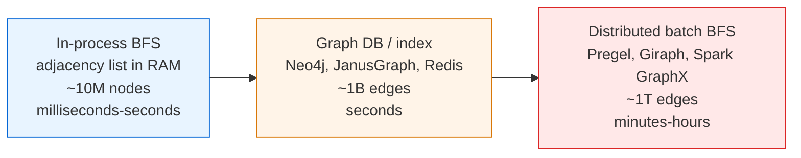
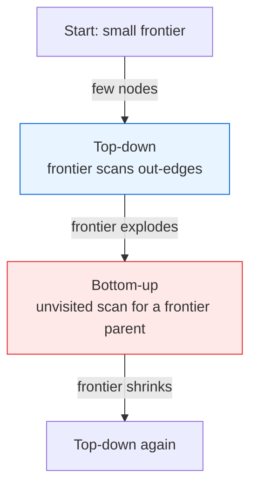

# Breadth-First Search — Senior Level

> A textbook BFS is twenty lines. A BFS that crawls a billion-node web graph, or computes degrees of separation across a social network, is a distributed system — and every weakness of the simple version (a single in-memory frontier, a single visited set, a single machine's RAM) becomes a production incident at scale.

## Table of Contents
1. [Introduction](#1-introduction)
2. [System Design with BFS](#2-system-design-with-bfs)
3. [Distributed and Parallel BFS](#3-distributed-and-parallel-bfs)
4. [Concurrency](#4-concurrency)
5. [Comparison at Scale](#5-comparison-at-scale)
6. [Architecture Patterns](#6-architecture-patterns)
7. [Code Examples](#7-code-examples)
8. [Observability](#8-observability)
9. [Failure Modes](#9-failure-modes)
10. [Capacity Planning](#10-capacity-planning)
11. [Summary](#11-summary)

---

## 1. Introduction

At senior level the question is no longer "how does the queue work" but "where does BFS sit in my system, and what breaks when the graph does not fit in one process?" The core BFS loop is in-memory, single-threaded, and assumes random access to the whole adjacency structure. That description tells you the three things that fail at scale:

- The **frontier** can grow to a large fraction of `V`. On a wide graph (a celebrity in a social network has tens of millions of followers), one BFS level can be tens of millions of nodes.
- The **visited set** must be globally consistent. Two workers exploring the same region must not both expand the same vertex.
- The **graph itself** may not fit in RAM, so every neighbor lookup may be a disk seek or an RPC.

The senior-level decisions are therefore architectural:

1. Does this BFS live in one process, in a graph database, or as a distributed batch job (Pregel/Giraph/Spark GraphX)?
2. How do you parallelize the frontier without corrupting the visited set?
3. How do you keep memory bounded when a single level explodes?
4. How do you make neighbor lookups cheap when the graph is on disk or sharded across machines?
5. How do you observe progress and detect that a BFS is stuck or melting down?

This document answers those five questions in production terms.

---

## 2. System Design with BFS

### 2.1 Three tiers of graph traversal



| Tier | When right | When wrong |
| --- | --- | --- |
| In-process BFS | Graph fits in RAM; ad-hoc shortest-path / reachability; latency matters. | Graph exceeds one machine's memory, or you need durability. |
| Graph DB with native traversal | Persistent, queryable graph; bounded-depth traversals (friends-of-friends, recommendations). | Full-graph BFS over a trillion edges — the DB chokes on the frontier. |
| Distributed batch (Pregel-style) | Whole-graph computations: single-source shortest paths over the entire web, connected components, k-hop neighborhoods. | Low-latency single queries; the job-launch overhead dwarfs the work. |

The most common over-engineering mistake is reaching for Spark GraphX when the graph is 50M edges and fits in 8 GB — an in-process BFS would have answered in 200 ms.

### 2.2 Crawlers: BFS by link-distance

A web crawler is BFS over the hyperlink graph. The frontier is the URL queue; the visited set is a dedup store (often a Bloom filter plus a persistent set). BFS order means you crawl "important, close-to-seed" pages first. Politeness (per-host rate limits) reshuffles strict BFS order, but the skeleton is BFS: dequeue a URL, fetch it, extract links, enqueue unseen ones.

The production realities that distinguish a crawler from a textbook BFS:

- **The frontier is durable, not in-RAM.** A web-scale crawl frontier holds billions of URLs and must survive restarts. It lives in a sharded, persistent priority queue (Kafka, a partitioned RocksDB, or a custom on-disk structure). The in-memory BFS queue becomes a windowed view of the top of this durable frontier.
- **Visited dedup is two-tiered.** A front-line Bloom filter (a few bits per URL, in RAM) rejects the ~90% of links that are obvious repeats; survivors are checked against an exact persistent set (sharded KV store). The Bloom filter's false positives merely cause a few real pages to be skipped — acceptable for a crawler, fatal for a correctness-critical BFS.
- **Politeness rewrites the dequeue order.** You cannot dequeue 10,000 URLs from `example.com` back-to-back; per-host rate limits and `robots.txt` crawl-delay mean the effective queue is *per-host*, drained round-robin. This is BFS-by-link-distance globally but rate-shaped per host — a priority on `(link_distance, host_ready_time)`.
- **Recrawl turns it cyclic.** Pages change, so the crawl is not a one-shot BFS but a continuous re-traversal with freshness-based priorities. The "visited" set decays: a page crawled 30 days ago is eligible again.

### 2.3 Social graph: degrees of separation

"How many hops between user A and user B?" is bidirectional BFS over the friendship graph. LinkedIn's classic "2nd / 3rd degree" labels are bounded-depth BFS (depth ≤ 3) from the viewing user, executed against a sharded social graph, heavily cached. The depth bound is what makes it tractable: the full BFS frontier would be the whole network, but depth-3 from one user is a manageable neighborhood.

The hard part is not the algorithm but the data layout. The friendship graph is sharded across hundreds of machines (commonly by user id), so a single BFS expansion — "fetch all friends of `u`" — is an RPC fan-out to wherever `u`'s edges live. Two architectural responses dominate:

- **Adjacency-as-storage (Facebook TAO, Twitter FlockDB).** A purpose-built graph store answers "friends of `u`" in one indexed lookup, replicated and cached so the hot users (celebrities) are served from RAM. Bounded-depth BFS becomes a sequence of these lookups, with the second hop fanned out in parallel.
- **Precomputed neighborhoods.** For features that only need "is X within 2 hops of me," precompute and cache each user's 2-hop set (it changes slowly). The query is then a set-membership test, not a live BFS. The cost moves from query-time CPU to storage and cache-invalidation complexity.

The degrees-of-separation query specifically wants **bidirectional BFS** (see §6.1): expand from both A and B, meet in the middle. On a graph with average degree ~300 (typical for a mature social network), unidirectional depth-3 touches ~`300³ = 2.7 × 10⁷` users; bidirectional touches ~`2 · 300^{1.5} ≈ 10⁴` — three orders of magnitude fewer RPCs, the difference between a feasible and an infeasible online query.

---

## 3. Distributed and Parallel BFS

### 3.1 Frontier-based (level-synchronous) BFS

The dominant parallel model: process the graph **one level at a time**. All workers expand the current frontier in parallel, produce the next frontier, synchronize at a barrier, then swap frontiers. This maps cleanly onto bulk-synchronous parallel (BSP) systems.

```
frontier = {source}
while frontier not empty:
    next = parallel_expand(frontier)   # each worker handles a partition
    barrier()                          # global sync
    next = dedup(next) minus visited
    visited |= next
    frontier = next
    level += 1
```

The barrier per level is the cost: a high-diameter graph (a long chain) needs many supersteps, each with synchronization overhead. Low-diameter graphs (social, web — diameter ~15-20 even at billions of nodes, the "small world" effect) need few levels, which is why frontier BFS works so well in practice.

### 3.2 Pregel / "think like a vertex"

Pregel (Google, 2010) and its open-source kin (Apache Giraph, Spark GraphX, GraphLab) express BFS as message passing. Each vertex starts inactive except the source. In each superstep, active vertices send their `level+1` to neighbors; a vertex that receives a smaller level than it holds updates and activates. The computation halts when no vertex is active (votes-to-halt). This is exactly level-synchronous BFS with the visited set replaced by per-vertex state, and it scales to trillion-edge graphs because the graph is partitioned across machines and only messages cross the network.

### 3.3 Direction-optimizing (Beamer) BFS

Beamer, Asanović & Patterson (2012) observed that standard **top-down** BFS (each frontier vertex scans its neighbors) wastes work when the frontier is huge: most neighbors are already visited. Their insight: when the frontier is large, switch to **bottom-up** — each *unvisited* vertex scans its neighbors looking for *any* parent already in the frontier, and stops at the first hit. This converts "for every frontier vertex, check all its edges" into "for every unvisited vertex, check until you find one frontier parent," which short-circuits dramatically in the middle levels of a small-world graph.



The heuristic switches based on frontier size relative to the number of unexplored edges. On real social/web graphs this gives 2-4× speedups and is the basis of the **Graph500** benchmark's reference implementation. See [`professional.md`](./professional.md) for the work/depth analysis.

### 3.4 Partitioning and the straggler problem

The throughput of a distributed BFS is gated by the *slowest* partition per level (the barrier waits for everyone). The naive partition — split vertices into `P` equal-count ranges — is wrong for skewed graphs: a partition that happens to own a celebrity vertex with 50M edges does 50M times the work of a partition owning only leaf vertices, and stalls the whole superstep.

The standard fixes, in order of sophistication:

1. **Partition by edge count, not vertex count.** Give each worker roughly `2E / P` edges. This balances the *static* work but not the dynamic frontier, which shifts level to level.
2. **2-D (vertex-cut) partitioning.** Used by PowerGraph/GraphX for power-law graphs: split a high-degree vertex's edge list *across* multiple machines so no single machine owns a hub's full adjacency. Reduces the worst-case per-worker level cost from `O(max_deg)` to `O(max_deg / P)`.
3. **Dynamic work-stealing within a level.** Idle workers steal frontier chunks from busy ones before the barrier. Recovers balance when the frontier concentrates on a few hot partitions mid-BFS.

The interaction with diameter: more partitions cut per-level work but every partition still pays one barrier per level, so on a high-diameter graph (many levels) the barrier overhead can dominate regardless of how well you balance — the reason Pregel-style systems shine on social/web graphs and struggle on road networks.

### 3.5 Multi-source frontier BFS

When the question is "nearest of many sources" (nearest data center, nearest infected node, multi-seed flood fill), seed the initial frontier with *all* sources at distance 0 and run one ordinary level-synchronous BFS. The result `dist[v]` is the distance to the *closest* source. This costs the same `O(V+E)` as single-source BFS — a single pass, not one BFS per source — and parallelizes identically. It is the workhorse for "assign every node to its nearest of K facilities" at graph scale.

---

## 4. Concurrency

### 4.1 The shared-visited problem

Naive parallel BFS has all threads pushing to one queue and checking one visited set. Two correctness hazards:

- **Double expansion:** two threads see `v` as unvisited and both enqueue it. Wastes work; can corrupt `parent`/`dist` if not idempotent.
- **Lost updates:** non-atomic "test-then-set" on the visited flag races.

### 4.2 Atomic visited bitset

The standard fix: represent visited as a **bitset** and claim a vertex with an atomic compare-and-swap (or atomic test-and-set on the bit). Only the thread that flips the bit from 0→1 "owns" expanding that vertex; losers drop it. BFS distance is idempotent under equal weights, so even if two threads briefly contend, the winner's `dist` is correct.

```
claim(v):           # returns true exactly once per vertex
    return atomic_test_and_set(visited_bit[v]) == 0
```

### 4.3 Per-thread local frontiers

To avoid contention on a single shared queue, each thread keeps a **local** next-frontier buffer; at the level barrier the buffers are concatenated (or merged with dedup). This is the same per-worker-queue + barrier pattern used by frontier BFS, just within one machine across cores. NUMA-aware partitioning (a thread owns a contiguous vertex range) keeps the visited bitset accesses local.

### 4.4 What you cannot easily do

Truly lock-free, *asynchronous* (non-level-synchronous) parallel BFS is hard to make correct *and* preserve shortest-path order, because asynchrony breaks the FIFO/level invariant. Most production systems stay level-synchronous and accept the barrier cost rather than chase a lock-free async design.

### 4.5 The memory-ordering subtlety

The atomic test-and-set on the visited bit must use at least acquire/release ordering, not relaxed, when the winning thread also writes `dist[v]` and `parent[v]`. A reader on another core that observes the bit set must also observe the accompanying `dist`/`parent` writes; relaxed atomics permit the bit-set to be visible before the `dist` write, so a concurrent reader could see `visited[v] = 1` but a stale `dist[v]`. The pattern is: write `dist`/`parent` *first*, then publish with a release-store (or CAS) on the visited bit; readers acquire-load the bit before trusting `dist`. Getting this wrong produces a heisenbug that only manifests under load on weakly-ordered architectures (ARM, POWER) and never on x86 — the worst kind to debug.

### 4.6 False sharing on the visited bitset

The visited bitset packs 64 vertices per cache line. Two threads claiming vertices whose ids fall in the same 64-bit word contend on the same cache line even though they touch different bits — false sharing that can collapse parallel speedup. NUMA-aware, contiguous vertex partitioning (each thread owns a vertex range, hence a disjoint run of bitset words) is the cure: it keeps each thread's claims on cache lines it already owns, eliminating cross-socket coherence traffic for the common case where a vertex's neighbors are mostly local after a locality-improving reorder.

---

## 5. Comparison at Scale

| Approach | Frontier model | Visited | Best graph | Bottleneck |
| --- | --- | --- | --- | --- |
| Single-thread in-RAM BFS | One FIFO queue | Boolean array | Fits in RAM, any diameter | Single core; cache misses on edge scan |
| Multi-core frontier BFS | Per-thread local frontiers + barrier | Atomic bitset | Fits in RAM, low diameter | Barrier sync; NUMA traffic |
| Direction-optimizing BFS | Top-down ↔ bottom-up switch | Bitset | Small-world (social/web) | Heuristic tuning |
| Pregel / Giraph | Messages between vertices | Per-vertex state | Trillion-edge, low diameter | Network shuffle per superstep |
| Graph DB traversal | DB-managed | DB-managed | Bounded-depth queries | Random I/O / index lookups |
| External-memory BFS | Disk-resident frontier | Disk bitvector | Graph ≫ RAM | I/O count (see professional.md) |

Diameter is the hidden variable: every level-synchronous method pays one barrier (or one superstep / one I/O pass) **per level**. Small-world graphs (few levels) love these methods; long chains (many levels) punish them.

---

## 6. Architecture Patterns

### 6.1 Bidirectional BFS for point-to-point queries

For "distance between A and B," run BFS from **both** endpoints simultaneously and stop when the frontiers meet. If the branching factor is `b` and the distance is `d`, unidirectional BFS touches ~`b^d` nodes; bidirectional touches ~`2·b^(d/2)` — an exponential saving. This is the workhorse for degrees-of-separation and is standard in routing and social-graph services.

### 6.2 Bounded-depth BFS with caching

Most product features need depth ≤ 2 or 3 (friends-of-friends, "people you may know"). Cap the BFS depth, and cache the per-user neighborhoods (they change slowly). The cache, not the algorithm, dominates the architecture.

### 6.3 Crawler frontier as a durable queue

The crawl frontier is BFS's queue made durable: a Kafka topic or a sharded priority queue (priority = link-distance + importance). The visited set is a Bloom filter (fast, memory-cheap, false-positives acceptable — you just skip a few real pages) backing onto a persistent KV store for exactness.

### 6.4 Precompute vs query-time

If many queries share a source (single-source shortest paths to everyone), run BFS **once** and store the distance array. If sources vary per query, run bounded bidirectional BFS at query time. The crossover is "how many queries per source."

### 6.5 Vertex reordering for locality

BFS is memory-bandwidth-bound: the edge scan is sequential (cache-friendly in CSR) but the `dist[v]`/`visited[v]` accesses jump to random vertex ids. Relabeling vertices so that adjacent vertices have nearby ids — via a prior BFS/DFS order, reverse Cuthill–McKee (RCM), or a community-detection-based reorder — turns many of those random accesses into local ones, often a 1.5–3× wall-clock win with zero asymptotic change. This is a *preprocessing* cost amortized over many BFS runs; it is the single highest-leverage tuning for repeated single-node BFS on the same graph, and it pairs naturally with NUMA-local partitioning (§4.6).

### 6.6 Frontier representation: queue vs bitmap

Two ways to materialize a frontier, chosen by density:

- **Sparse (queue/array of ids):** ideal when the frontier is small (start/end of BFS, bounded-depth queries). Iteration cost is `O(|F|)`.
- **Dense (bitmap over all `V`):** ideal when the frontier is a large fraction of `V` (the balloon's middle, and the regime where bottom-up BFS runs). Iteration is `O(V/64)` words but with perfect locality, and set-membership ("is `v` in the frontier?") — the core bottom-up test — is `O(1)` with no hashing.

Direction-optimizing BFS switches *representation* alongside *direction*: sparse-queue top-down at the edges, dense-bitmap bottom-up in the middle. Storing the frontier the wrong way for its density is a common, quiet performance bug.

---

## 7. Code Examples

### 7.1 Go — bounded parallel frontier BFS with an atomic visited bitset

```go
package bfs

import (
	"sync"
	"sync/atomic"
)

// Graph: adj[u] is u's neighbor slice. Vertices are 0..n-1.
type Graph struct {
	Adj [][]int32
}

// Visited is a lock-free bitset; Claim returns true exactly once per vertex.
type Visited struct{ words []uint64 }

func NewVisited(n int) *Visited { return &Visited{words: make([]uint64, (n+63)/64)} }

func (v *Visited) Claim(x int32) bool {
	w, b := x>>6, uint64(1)<<(uint(x)&63)
	for {
		old := atomic.LoadUint64(&v.words[w])
		if old&b != 0 {
			return false // already visited
		}
		if atomic.CompareAndSwapUint64(&v.words[w], old, old|b) {
			return true // we own expanding x
		}
	}
}

// ParallelBFS runs level-synchronous BFS over `workers` goroutines.
// Returns dist[v] = edge distance from src, or -1.
func ParallelBFS(g *Graph, src int32, workers int) []int32 {
	n := len(g.Adj)
	dist := make([]int32, n)
	for i := range dist {
		dist[i] = -1
	}
	vis := NewVisited(n)
	vis.Claim(src)
	dist[src] = 0

	frontier := []int32{src}
	level := int32(0)
	for len(frontier) > 0 {
		level++
		// Each worker gets a slice of the frontier and a local next-buffer.
		nextChunks := make([][]int32, workers)
		var wg sync.WaitGroup
		chunk := (len(frontier) + workers - 1) / workers
		for w := 0; w < workers; w++ {
			lo := w * chunk
			if lo >= len(frontier) {
				break
			}
			hi := lo + chunk
			if hi > len(frontier) {
				hi = len(frontier)
			}
			wg.Add(1)
			go func(w, lo, hi int) {
				defer wg.Done()
				var local []int32
				for _, u := range frontier[lo:hi] {
					for _, v := range g.Adj[u] {
						if vis.Claim(v) { // atomic; only the winner proceeds
							dist[v] = level
							local = append(local, v)
						}
					}
				}
				nextChunks[w] = local
			}(w, lo, hi)
		}
		wg.Wait() // level barrier

		next := next[:0]
		for _, c := range nextChunks {
			next = append(next, c...)
		}
		frontier, next = next, frontier
	}
	return dist
}

var next []int32 // reused scratch
```

Notes for review:
- `dist[v]` written by exactly one thread (the CAS winner), so no data race despite the shared array.
- The barrier (`wg.Wait()`) per level is the scalability ceiling on high-diameter graphs.
- A production version pools `local` buffers and partitions vertices NUMA-locally to cut cross-socket traffic.

### 7.2 Java — bidirectional BFS for distance between two nodes

```java
import java.util.*;

public final class BidirectionalBFS {
    // Returns shortest edge distance between s and t, or -1 if disconnected.
    public static int distance(List<List<Integer>> adj, int s, int t) {
        if (s == t) return 0;
        Set<Integer> frontS = new HashSet<>(List.of(s));
        Set<Integer> frontT = new HashSet<>(List.of(t));
        Set<Integer> seenS = new HashSet<>(frontS);
        Set<Integer> seenT = new HashSet<>(frontT);
        int dist = 0;
        while (!frontS.isEmpty() && !frontT.isEmpty()) {
            // Always expand the smaller frontier — keeps work balanced.
            if (frontS.size() > frontT.size()) {
                Set<Integer> tmp = frontS; frontS = frontT; frontT = tmp;
                Set<Integer> tmp2 = seenS; seenS = seenT; seenT = tmp2;
            }
            dist++;
            Set<Integer> nextS = new HashSet<>();
            for (int u : frontS) {
                for (int v : adj.get(u)) {
                    if (seenT.contains(v)) return dist;   // frontiers met
                    if (seenS.add(v)) nextS.add(v);
                }
            }
            frontS = nextS;
        }
        return -1;
    }

    public static void main(String[] args) {
        List<List<Integer>> adj = List.of(
            List.of(1, 2), List.of(0, 3), List.of(0, 3),
            List.of(1, 2, 4), List.of(3));
        System.out.println(distance(adj, 0, 4)); // 3
    }
}
```

### 7.3 Python — multi-source bounded BFS on a sharded social graph

```python
from collections import deque
from typing import Callable, Iterable


def degrees_of_separation(
    neighbors: Callable[[int], Iterable[int]],
    sources: Iterable[int],
    max_depth: int = 3,
) -> dict[int, int]:
    """Bounded multi-source BFS.

    `neighbors(u)` is the (possibly remote, possibly cached) adjacency lookup —
    in production this is an RPC to a sharded graph store, batched per level.
    Returns dist[v] for every v within `max_depth` of the nearest source.
    """
    dist: dict[int, int] = {s: 0 for s in sources}
    frontier = deque(dist)                       # all sources at level 0
    while frontier:
        u = frontier.popleft()
        if dist[u] == max_depth:                 # depth cap: do not expand further
            continue
        for v in neighbors(u):                   # one fan-out per frontier vertex
            if v not in dist:                    # first time seen == shortest
                dist[v] = dist[u] + 1
                frontier.append(v)
    return dist


if __name__ == "__main__":
    graph = {0: [1, 2], 1: [0, 3], 2: [0, 3], 3: [1, 2, 4], 4: [3]}
    print(degrees_of_separation(graph.__getitem__, sources=[0], max_depth=2))
    # {0: 0, 1: 1, 2: 1, 3: 2}  — node 4 is depth 3, beyond the cap
```

In production the `neighbors` callable batches the entire frontier's lookups into one round-trip per level (a "gather" RPC), so the number of network round-trips is `O(depth)`, not `O(visited)` — the single most important optimization for an online social-graph BFS. The depth cap is what keeps the frontier from exploding to the whole network.

### 7.4 Python — Pregel-style level-synchronous BFS sketch

```python
from collections import defaultdict


def pregel_bfs(adj, source):
    """Level-synchronous, message-passing BFS (single-machine simulation)."""
    INF = float("inf")
    level = {v: INF for v in adj}
    level[source] = 0
    active = {source}                    # vertices that "vote to continue"
    superstep = 0
    while active:                        # halts when no vertex is active
        superstep += 1
        messages = defaultdict(list)     # vertex -> incoming proposed levels
        for u in active:                 # each active vertex messages neighbors
            for v in adj[u]:
                messages[v].append(level[u] + 1)
        active = set()
        for v, proposals in messages.items():
            best = min(proposals)
            if best < level[v]:          # a strictly better level activates v
                level[v] = best
                active.add(v)
    return level


if __name__ == "__main__":
    adj = {0: [1, 2], 1: [0, 3], 2: [0, 3], 3: [1, 2, 4], 4: [3]}
    print(pregel_bfs(adj, 0))  # {0:0, 1:1, 2:1, 3:2, 4:3}
```

This mirrors how Giraph/GraphX execute BFS across a cluster: `active` is the set of vertices to process next superstep; messages cross the (simulated) network; the barrier is implicit between supersteps.

---

## 8. Observability

A long-running BFS is opaque until it misbehaves. Instrument these from day one.

| Metric | Type | Why |
| --- | --- | --- |
| `bfs_frontier_size` | gauge | The single best progress and memory signal. A frontier that won't shrink is a melting graph. |
| `bfs_level` | gauge | How deep are we? Compare to known diameter. |
| `bfs_visited_total` | counter | Coverage; plateau means done or stuck. |
| `bfs_edges_scanned_total` | counter | Work done; ratio to visited reveals revisits. |
| `bfs_superstep_duration_seconds` | histogram | Per-level latency; spikes flag a giant level. |
| `bfs_peak_frontier_bytes` | gauge | Memory high-water mark for capacity planning. |
| `bfs_barrier_wait_seconds` | histogram | Straggler detection in parallel BFS. |

The most useful single metric is **frontier size over time**: it should rise, peak near the graph's "middle," then fall. A frontier stuck at a high plateau means a hot region, a missing visited check, or a degenerate graph.

In a crawler, also track `frontier_queue_depth`, `dedup_false_positive_rate` (Bloom filter), and `per_host_qps` (politeness).

### 8.1 Dashboards and alerts

The frontier-size time series is the dashboard's centerpiece; overlay it with the historical "balloon and collapse" shape for the same graph so an on-call engineer instantly sees a deviation. Practical alerts:

- **Frontier plateau:** `bfs_frontier_size` flat-and-high for longer than the expected peak duration → likely a missing visited check (re-enqueuing seen vertices), a degenerate dense region, or a hot partition. Page.
- **Level count exceeds known diameter:** `bfs_level` climbs past the graph's known eccentricity bound → a cycle is being walked as if infinite (crawler trap, or a directed-cycle bug treating distances as unbounded).
- **Barrier-wait skew:** `bfs_barrier_wait_seconds` p99/p50 ratio > 5 → a straggler partition; check partition balance and enable work-stealing.
- **Memory high-water:** `bfs_peak_frontier_bytes` approaching the heap limit → imminent OOM; trip the depth cap or spill the frontier before it crashes.

### 8.2 Distributed-run tracing

In a Pregel/GraphX job, attach the superstep number as a span tag and record per-partition `edges_scanned` and `messages_sent` each superstep. The skew across partitions in a single superstep is the clearest load-imbalance signal; a partition consistently sending 100× the messages of its peers owns a hub and needs 2-D partitioning.

---

## 9. Failure Modes

### 9.1 OOM on wide frontiers

The defining BFS failure. A single level can hold `O(V)` nodes — for a hub vertex with 50M neighbors, that level alone is 50M entries. Mitigations:

- **Bound the depth** (most product queries need ≤ 3 hops).
- **Direction-optimizing BFS** to avoid materializing the full top-down frontier.
- **Spill the frontier to disk** (external-memory BFS) when it exceeds a threshold.
- **Bidirectional BFS** to shrink the effective frontier exponentially.

### 9.2 Visited-set memory

For `V = 10^9`, a boolean array is ~1 GB; a hash set is many GB. Use a **bitset** (1 bit/vertex → 125 MB for 10^9) or a Bloom filter (accepting bounded false-positives that merely skip some real vertices).

### 9.3 Stragglers and barriers

In level-synchronous parallel BFS, the slowest worker gates every level. A skewed partition (one worker owns the hub) stalls the whole job. Mitigation: balance partitions by *edge* count not vertex count; work-steal within a level.

### 9.4 Revisiting in weighted graphs

The classic correctness failure: someone applies BFS to a *weighted* graph and gets wrong "shortest paths." BFS counts edges, not weights. The fix is not "revisit nodes in BFS" (that breaks the `O(V+E)` bound and still may be wrong); it is to switch algorithms — **Dijkstra** for non-negative weights (sibling topic *Dijkstra*), or **0-1 BFS** for 0/1 weights (sibling topic *0-1 BFS*). If you find yourself wanting to re-enqueue already-visited nodes to "fix" a distance, that is the signal you have outgrown BFS.

### 9.5 Non-determinism in distributed runs

Different partitionings or message orderings can yield different `parent` trees (though `dist` is invariant). If downstream code depends on a specific BFS tree, pin a deterministic tie-break (smallest vertex id wins).

### 9.6 Crawler traps

Infinite/auto-generated URL spaces (calendars, session-id links) make the frontier never empty. Mitigations: depth caps, URL canonicalization, per-domain budgets, and trap-detection heuristics.

### 9.7 Frontier swap-buffer aliasing

A subtle in-code bug specific to the level-synchronous implementation: when swapping `frontier` and `next` buffers to reuse allocations (as in the Go example above), forgetting to truncate the reused buffer leaves stale vertex ids from two levels ago, which get re-expanded. The symptom is a frontier that grows when it should shrink and a `bfs_edges_scanned_total` that exceeds `2E`. The fix is to reset the reused slice to zero length (`next[:0]`) before refilling — cheap, but easy to drop during a refactor. This is the single-machine analogue of the distributed "stale message" bug.

### 9.8 Directed-graph asymmetry

Engineers who tested on undirected graphs are surprised when a directed BFS reaches far fewer vertices than expected: `dist` is only defined along edge directions, and a strongly-connected-looking graph may have a source from which most vertices are unreachable. The fix is not a BFS change but a modeling decision: if you need reachability ignoring direction, BFS the *underlying undirected* graph (or its transpose for "who can reach me"). Silent under-coverage — `bfs_visited_total` plateauing far below `V` — is the telltale sign.

---

## 10. Capacity Planning

### 10.1 Memory model

For an in-RAM BFS over `V` vertices, `E` edges:

- Adjacency (CSR layout): `(V + E) × 4–8 bytes`.
- Visited bitset: `V / 8` bytes.
- `dist` array: `V × 4` bytes.
- Peak frontier: up to `V × 4` bytes (worst case a whole level).

For `V = 100M`, `E = 2B`: CSR ≈ 8–16 GB, bitset ≈ 12.5 MB, dist ≈ 400 MB. The graph storage dominates; the BFS bookkeeping is comparatively small. This fits on one large machine — which is exactly why in-process BFS handles surprisingly large graphs before you need a cluster.

### 10.2 Time model

- Single core scans ~100M–500M edges/sec (cache-bound). `E = 2B` → ~4–20 s single-threaded.
- Multi-core frontier BFS scales near-linearly on low-diameter graphs until memory bandwidth saturates (typically 8–16× on a big socket, then bandwidth-bound).
- Distributed BFS adds network shuffle per superstep; the win appears only when `E` exceeds single-machine RAM.

### 10.3 When to leave one machine

Move to a distributed/external-memory BFS when any holds:

- The graph (CSR) exceeds available RAM.
- You need full-graph BFS regularly and single-machine time is too slow for the SLA.
- The graph is already sharded across services and centralizing it is impractical.

Until then, a single fat machine with a cache-friendly CSR and multi-core frontier BFS is the right answer — and it scales further than most engineers expect.

### 10.4 Worked sizing example

Suppose you operate a recommendation service that runs multi-source BFS over a 200M-vertex, 4B-edge social graph to assign every user a distance to their nearest of 10,000 "seed" interest communities, refreshed hourly.

- **Memory:** CSR adjacency at 4 bytes/edge ≈ 16 GB + offsets `200M × 8 B = 1.6 GB`; visited bitset `200M / 8 = 25 MB`; `dist` array `200M × 1 B = 200 MB` (distances fit in a byte since diameter ≪ 255). Total ≈ 18 GB — comfortable on a 64 GB machine, leaving headroom for the peak frontier (`Θ(V)`, up to `200M × 4 B = 800 MB` if you store frontier as ids).
- **Time:** at ~300M edges/sec/core scanning, single-threaded ≈ `4B / 3×10⁸ ≈ 13 s`. With 32 cores near memory-bandwidth saturation (say 10× effective), ≈ 1.3 s per full run. An hourly refresh has a 3600 s budget; you are 3 orders of magnitude inside it. No cluster needed.
- **When this flips:** double the graph to 8B edges twice more (→ 32B edges, ~130 GB CSR) and you exceed a single machine's RAM; *that* is the trigger to move to GraphX/Pregel, not the current size.

The lesson repeats: size the *peak frontier* and the *CSR*, confirm both fit, and stay single-node as long as they do.

### 10.5 The decision checklist

```text
Does CSR(graph) fit in one machine's RAM?      ── no ──▶ distributed/external-memory BFS
        │ yes
Is a full-graph BFS within the SLA single-node? ── no ──▶ add cores; still no ──▶ distributed
        │ yes
Is the query point-to-point (A→B distance)?     ── yes ─▶ bidirectional BFS at query time
        │ no
Is depth bounded (≤3 hops, product feature)?    ── yes ─▶ bounded BFS + neighborhood cache
        │ no
Single-source, whole graph, RAM-sized           ──────▶ multi-core frontier BFS + atomic bitset
```

---

## 11. Summary

- BFS the algorithm is `O(V+E)`; BFS the *system* is dominated by the frontier width, the visited-set memory, and (in parallel/distributed forms) the per-level barrier.
- Pick the tier by graph size: in-process for RAM-sized graphs, graph DBs for bounded-depth queries, Pregel/Giraph/GraphX for trillion-edge whole-graph computations.
- Parallelize level-synchronously with per-thread local frontiers and an atomic visited bitset; accept the barrier cost — low-diameter graphs make it cheap.
- Use direction-optimizing (Beamer) BFS on small-world graphs and bidirectional BFS for point-to-point distance to beat the frontier explosion.
- The headline failure mode is OOM on a wide frontier; bound depth, go bidirectional, switch to bottom-up, or spill to disk.
- Never apply BFS to weighted shortest paths — escalate to Dijkstra or 0-1 BFS instead of hacking revisits into BFS.
- Instrument frontier size above all else; it is the clearest signal of progress, stalls, and impending OOM.

References to study further: Pregel (Malewicz et al., 2010), Apache Giraph, Spark GraphX, the Graph500 benchmark, Beamer–Asanović–Patterson direction-optimizing BFS (2012), and external-memory BFS (Munagala–Ranade, Mehlhorn–Meyer).
