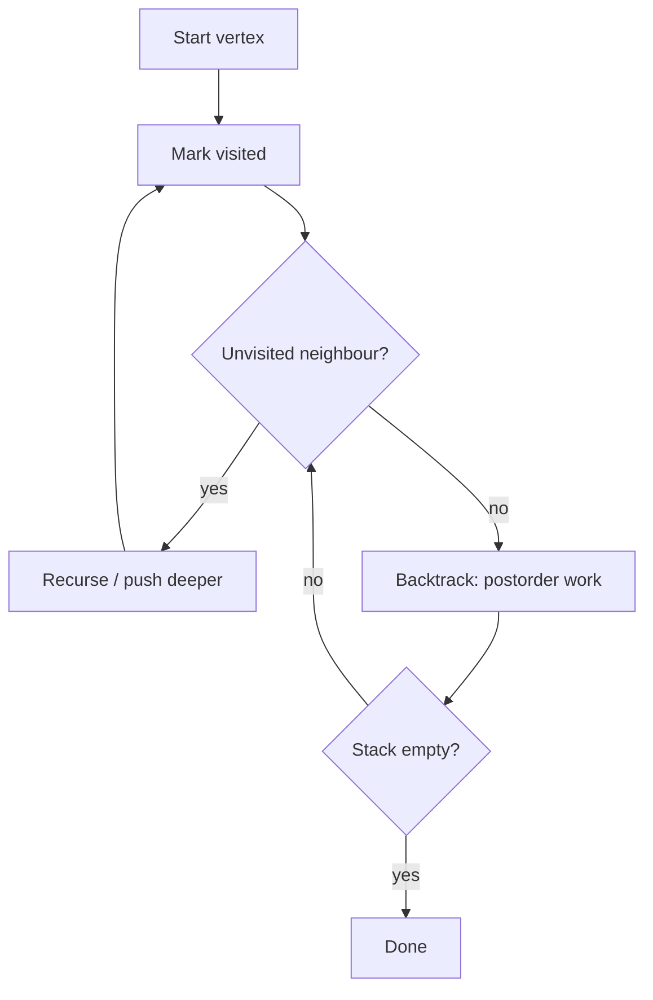

# Depth-First Search (DFS) — Junior Level

> **One-line summary:** Depth-First Search explores a graph by going as deep as possible along each branch before backtracking. It runs in `O(V + E)` time using `O(V)` extra space, can be written either with recursion or with an explicit stack, and is the engine behind cycle detection, topological sort, connected components, flood fill, and path finding.

---

## Table of Contents

1. [Introduction](#introduction)
2. [Prerequisites](#prerequisites)
3. [Glossary](#glossary)
4. [Core Concepts](#core-concepts)
5. [Big-O Summary](#big-o-summary)
6. [Real-World Analogies](#real-world-analogies)
7. [Pros & Cons](#pros--cons)
8. [Step-by-Step Walkthrough](#step-by-step-walkthrough)
9. [Code Examples](#code-examples)
10. [Coding Patterns](#coding-patterns)
11. [Error Handling](#error-handling)
12. [Performance Tips](#performance-tips)
13. [Best Practices](#best-practices)
14. [Edge Cases & Pitfalls](#edge-cases--pitfalls)
15. [Common Mistakes](#common-mistakes)
16. [Cheat Sheet](#cheat-sheet)
17. [Visual Animation](#visual-animation)
18. [Summary](#summary)
19. [Further Reading](#further-reading)

---

## Introduction

**Depth-First Search (DFS)** is one of the two fundamental ways to walk a graph (its sibling, Breadth-First Search, lives in the neighbouring `02-bfs` topic). The idea is in the name: when you arrive at a vertex, you pick one of its unexplored neighbours and **dive in** — you keep going *deeper and deeper* down a single path until you hit a dead end, only then do you **backtrack** to the last vertex that still has an unexplored neighbour and try again.

DFS was systematized in the 19th century as a maze-solving rule (Trémaux's algorithm) and became a cornerstone of modern algorithmics in the 1970s when Hopcroft and Tarjan showed that a handful of classic graph problems — strongly connected components, bridges, planarity — all fall out of a *single* DFS pass in linear time.

Two ideas make DFS work:

1. **A visited set** — every vertex is marked the first time we touch it, so we never process it twice. Without this, a graph with a cycle would loop forever.
2. **A stack** — DFS is inherently stack-shaped. Either you use the program's *call stack* by writing the traversal recursively, or you manage an *explicit stack* yourself in a loop. Both produce the same deep-first order.

The payoff is huge: in `O(V + E)` — time proportional to the number of vertices plus edges — a single DFS gives you the skeleton you need to answer "is there a cycle?", "what order can I run these tasks in?", "how many separate islands are there?", and "is there a path from A to B?".

The one thing to keep in your back pocket from day one: **recursion depth**. A recursive DFS on a graph that is one long chain of 1,000,000 vertices will recurse a million times deep and crash with a stack overflow. The fix — an explicit-stack DFS — is something we will write together below.

---

## Prerequisites

Before reading this file you should be comfortable with:

- **Graphs and how they are stored** — adjacency lists (`adj[u]` = list of neighbours of `u`) and, less commonly, adjacency matrices. See the `01-representation` topic.
- **Directed vs undirected edges** — whether an edge `(u, v)` also lets you travel `v → u`.
- **Recursion** — a function calling itself, and the idea of the call stack.
- **Stacks** — last-in-first-out (LIFO) push/pop.
- **Sets / boolean arrays** — for marking visited vertices.
- **Big-O notation** — `O(V + E)`, `O(V)`.

Optional but helpful:

- A quick look at **BFS** (`02-bfs`) for contrast — BFS uses a queue and explores level by level.
- Basic **trees** — DFS on a tree is just preorder / postorder traversal with no visited set needed.

---

## Glossary

| Term | Meaning |
|------|---------|
| **DFS** | Graph traversal that goes as deep as possible before backtracking. |
| **Vertex / node** | A point in the graph. We usually label them `0..V-1`. |
| **Edge** | A connection between two vertices; directed or undirected. |
| **Adjacency list** | `adj[u]` holds the neighbours of `u`. The standard graph storage. |
| **Visited set** | The set of vertices already discovered, so they are not processed twice. |
| **Discovery (preorder)** | The moment we first arrive at a vertex, before recursing into its children. |
| **Finish (postorder)** | The moment we leave a vertex for good, after all its descendants are done. |
| **Backtracking** | Returning to the previous vertex after a branch is fully explored. |
| **Recursion stack / call stack** | The implicit stack of active function calls in a recursive DFS. |
| **Explicit stack** | A stack data structure you manage by hand to avoid recursion. |
| **Tree edge** | An edge DFS follows to discover a new, unvisited vertex. |
| **Back edge** | An edge to an ancestor still on the DFS path — signals a cycle. |
| **Connected component** | A maximal group of vertices all reachable from one another (undirected). |
| **Flood fill** | DFS/BFS over a grid, filling a connected region (paint-bucket tool). |

---

## Core Concepts

### 1. The Visited Set — the rule that prevents infinite loops

A graph can have cycles, so unlike a tree, you cannot blindly recurse into neighbours. The contract is simple:

```
to visit vertex u:
    if u already visited: return        # the guard
    mark u visited
    for each neighbour v of u:
        visit v
```

Mark **on entry**. The first time DFS reaches a vertex it sets `visited[u] = true`; any later attempt to enter `u` returns immediately. With `V` vertices and `E` edges, every vertex is entered once and every edge is examined a constant number of times, giving `O(V + E)`.

### 2. Recursive DFS — letting the call stack do the work

The most natural way to write DFS:

```
dfs(u):
    visited[u] = true
    preorder_work(u)                    # "discovery": first time we see u
    for v in adj[u]:
        if not visited[v]:
            dfs(v)
    postorder_work(u)                   # "finish": we are leaving u for good
```

The function calls itself, so the **call stack** automatically remembers where to backtrack to. The depth of that stack equals the length of the current path — which is exactly where the stack-overflow risk comes from on deep graphs.

### 3. Iterative DFS — an explicit stack instead of recursion

The same traversal, but we manage the stack ourselves so we never overflow the call stack:

```
dfs_iterative(start):
    stack = [start]
    while stack not empty:
        u = stack.pop()
        if visited[u]: continue
        visited[u] = true
        preorder_work(u)
        for v in adj[u]:
            if not visited[v]:
                stack.push(v)
```

Notice we check `visited` **on pop**, not on push, because a vertex can be pushed several times before it is first popped. This version handles a 1,000,000-deep chain without blinking.

### 4. Preorder vs Postorder

A single DFS gives you two natural orderings:

- **Preorder (discovery order):** do work *before* recursing into children. Good for "process a node, then its subtree."
- **Postorder (finish order):** do work *after* all children are done. This is the magic ingredient for **topological sort** (sibling `07-topological-sort`): if you record vertices as they *finish* and reverse that list, you get a valid task order for a dependency graph.

```
preorder:  mark u, do work, then recurse
postorder: recurse first, then do work as you back out
```

### 5. Directed vs Undirected — the parent rule

DFS works on both, but cycle detection differs:

- **Undirected:** every edge `(u, v)` is two-way. When DFS at `v` looks back at the `u` it just came from, that is *not* a cycle — it is the same edge. You skip the **parent**. A cycle is a back edge to *any other* visited ancestor.
- **Directed:** edges are one-way, so you track which vertices are *currently on the recursion stack* (often called "gray"). An edge into a gray vertex is a real cycle.

We expand both in the [Coding Patterns](#coding-patterns) section.

---

## Big-O Summary

| Aspect | Cost | Notes |
|--------|------|-------|
| Time (adjacency list) | **O(V + E)** | Each vertex entered once, each edge looked at a constant number of times. |
| Time (adjacency matrix) | **O(V²)** | Scanning a row to find neighbours is `O(V)` per vertex. |
| Visited set | **O(V)** | One boolean per vertex. |
| Recursion / explicit stack | **O(V)** worst case | A path can hold every vertex (e.g. a long chain). |
| Total extra space | **O(V)** | Visited + stack. |
| Single source reachability | O(V + E) | Visit everything reachable from a start vertex. |
| Full traversal (all components) | O(V + E) | Loop over all vertices, DFS from each unvisited one. |

---

## Real-World Analogies

| Concept | Analogy |
|---------|---------|
| Going deep | Exploring a **maze** by always taking an unexplored corridor and only turning back at a dead end. This is literally Trémaux's rule. |
| The visited set | **Dropping breadcrumbs** (or chalk marks on the walls) so you never re-walk a corridor you have already explored. |
| Backtracking | Hitting a dead end and **retracing your steps** to the last junction with an unexplored path. |
| The recursion stack | The **chain of rooms behind you** — you can only back up one room at a time, in reverse order of entry. |
| Preorder | Noting a room's name **as you enter** it. |
| Postorder | Noting a room's name **as you leave** it for the last time. |
| Connected components | Counting how many **separate cave systems** exist when tunnels do not connect them. |

Where the analogy breaks: a real explorer can see all exits of a room at once and pick freely; DFS commits to neighbours in a fixed list order, which is why the exact traversal sequence depends on how you store the adjacency list.

---

## Pros & Cons

| Pros | Cons |
|------|------|
| Linear `O(V + E)` time — optimal for traversing a whole graph. | Recursive form can overflow the stack on deep graphs (~10⁴–10⁵ depth). |
| Tiny memory footprint: `O(V)`, no level-buffering like BFS sometimes needs. | Does **not** find shortest paths in unweighted graphs (that is BFS's job). |
| One pass yields discovery/finish times, which unlock topo sort, SCC, bridges. | The traversal order depends on adjacency ordering — not unique. |
| Naturally recursive — often 5 lines for a working traversal. | Harder to parallelize than many algorithms (it is inherently sequential). |
| Works on directed, undirected, weighted-ignoring-weights, and grid graphs alike. | Easy to introduce subtle bugs: re-visiting, parent handling, off-by-one. |

**When to use:** cycle detection, topological sort, connected components, flood fill, path existence, maze solving, and as the backbone of bridges/articulation-points and strongly-connected-components algorithms.

**When NOT to use:** shortest path in an unweighted graph (use BFS), shortest path with weights (use Dijkstra / Bellman-Ford), or any problem needing level-by-level processing.

---

## Step-by-Step Walkthrough

Consider this small **directed** graph (adjacency list shown), and run DFS from vertex `0`:

```
0 -> 1, 2
1 -> 3
2 -> 3
3 -> 4
4 ->          (no outgoing edges)
```

```
              0
            /   \
           1     2
            \   /
             3
             |
             4
```

DFS from `0`, always taking neighbours in list order:

```
enter 0   (discover 0)   stack: [0]
enter 1   (discover 1)   stack: [0,1]      # 0's first neighbour
enter 3   (discover 3)   stack: [0,1,3]    # 1's neighbour
enter 4   (discover 4)   stack: [0,1,3,4]  # 3's neighbour
finish 4                 stack: [0,1,3]    # 4 has no neighbours, back out
finish 3                 stack: [0,1]      # 3 done
finish 1                 stack: [0]        # 1 done
enter 2   (discover 2)   stack: [0,2]      # 0's second neighbour
  look at 3 -> already visited, skip
finish 2                 stack: [0]
finish 0                 stack: []         # everything done
```

**Preorder (discovery):** `0, 1, 3, 4, 2`
**Postorder (finish):** `4, 3, 1, 2, 0`

Reverse the postorder → `0, 2, 1, 3, 4`. That is a valid **topological order**: every edge points from an earlier vertex to a later one. This is exactly how topo sort is built (see sibling `07-topological-sort`).

---

## Code Examples

### Example 1: Recursive DFS (preorder + postorder)

#### Go

```go
package main

import "fmt"

func dfs(adj [][]int, u int, visited []bool, pre *[]int, post *[]int) {
	visited[u] = true
	*pre = append(*pre, u) // discovery / preorder
	for _, v := range adj[u] {
		if !visited[v] {
			dfs(adj, v, visited, pre, post)
		}
	}
	*post = append(*post, u) // finish / postorder
}

func main() {
	adj := [][]int{
		{1, 2}, // 0
		{3},    // 1
		{3},    // 2
		{4},    // 3
		{},     // 4
	}
	visited := make([]bool, len(adj))
	var pre, post []int
	dfs(adj, 0, visited, &pre, &post)
	fmt.Println("preorder: ", pre)  // [0 1 3 4 2]
	fmt.Println("postorder:", post) // [4 3 1 2 0]
}
```

#### Java

```java
import java.util.*;

public class DFS {
    static void dfs(List<List<Integer>> adj, int u, boolean[] visited,
                    List<Integer> pre, List<Integer> post) {
        visited[u] = true;
        pre.add(u);                       // discovery / preorder
        for (int v : adj.get(u)) {
            if (!visited[v]) {
                dfs(adj, v, visited, pre, post);
            }
        }
        post.add(u);                      // finish / postorder
    }

    public static void main(String[] args) {
        List<List<Integer>> adj = List.of(
            List.of(1, 2), // 0
            List.of(3),    // 1
            List.of(3),    // 2
            List.of(4),    // 3
            List.of()      // 4
        );
        boolean[] visited = new boolean[adj.size()];
        List<Integer> pre = new ArrayList<>(), post = new ArrayList<>();
        dfs(adj, 0, visited, pre, post);
        System.out.println("preorder:  " + pre);  // [0, 1, 3, 4, 2]
        System.out.println("postorder: " + post); // [4, 3, 1, 2, 0]
    }
}
```

#### Python

```python
def dfs(adj, u, visited, pre, post):
    visited[u] = True
    pre.append(u)                 # discovery / preorder
    for v in adj[u]:
        if not visited[v]:
            dfs(adj, v, visited, pre, post)
    post.append(u)                # finish / postorder


if __name__ == "__main__":
    adj = [
        [1, 2],  # 0
        [3],     # 1
        [3],     # 2
        [4],     # 3
        [],      # 4
    ]
    visited = [False] * len(adj)
    pre, post = [], []
    dfs(adj, 0, visited, pre, post)
    print("preorder: ", pre)   # [0, 1, 3, 4, 2]
    print("postorder:", post)  # [4, 3, 1, 2, 0]
```

**What it does:** runs one DFS from vertex 0 and records both orderings.
**Run:** `go run main.go` | `javac DFS.java && java DFS` | `python dfs.py`

---

### Example 2: Iterative DFS with an explicit stack (overflow-proof)

#### Go

```go
package main

import "fmt"

func dfsIterative(adj [][]int, start int) []int {
	visited := make([]bool, len(adj))
	order := []int{}
	stack := []int{start}
	for len(stack) > 0 {
		u := stack[len(stack)-1]
		stack = stack[:len(stack)-1] // pop
		if visited[u] {
			continue // check on pop, not on push
		}
		visited[u] = true
		order = append(order, u)
		// Push neighbours; reverse to match recursive list order.
		for i := len(adj[u]) - 1; i >= 0; i-- {
			v := adj[u][i]
			if !visited[v] {
				stack = append(stack, v)
			}
		}
	}
	return order
}

func main() {
	adj := [][]int{{1, 2}, {3}, {3}, {4}, {}}
	fmt.Println(dfsIterative(adj, 0)) // [0 1 3 4 2]
}
```

#### Java

```java
import java.util.*;

public class DFSIterative {
    static List<Integer> dfs(List<List<Integer>> adj, int start) {
        boolean[] visited = new boolean[adj.size()];
        List<Integer> order = new ArrayList<>();
        Deque<Integer> stack = new ArrayDeque<>();
        stack.push(start);
        while (!stack.isEmpty()) {
            int u = stack.pop();
            if (visited[u]) continue;     // check on pop
            visited[u] = true;
            order.add(u);
            List<Integer> nb = adj.get(u);
            for (int i = nb.size() - 1; i >= 0; i--) {
                int v = nb.get(i);
                if (!visited[v]) stack.push(v);
            }
        }
        return order;
    }

    public static void main(String[] args) {
        List<List<Integer>> adj = List.of(
            List.of(1, 2), List.of(3), List.of(3), List.of(4), List.of());
        System.out.println(dfs(adj, 0)); // [0, 1, 3, 4, 2]
    }
}
```

#### Python

```python
def dfs_iterative(adj, start):
    visited = [False] * len(adj)
    order = []
    stack = [start]
    while stack:
        u = stack.pop()
        if visited[u]:
            continue                  # check on pop, not on push
        visited[u] = True
        order.append(u)
        for v in reversed(adj[u]):    # reverse to match recursive order
            if not visited[v]:
                stack.append(v)
    return order


if __name__ == "__main__":
    adj = [[1, 2], [3], [3], [4], []]
    print(dfs_iterative(adj, 0))  # [0, 1, 3, 4, 2]
```

**What it does:** the same deep-first walk, but immune to stack overflow on deep graphs.
**Run:** `go run main.go` | `javac DFSIterative.java && java DFSIterative` | `python dfs_iterative.py`

---

## Coding Patterns

### Pattern 1: Count connected components (undirected)

**Intent:** Loop over every vertex; each time you find an unvisited one, that is a brand-new component — DFS to mark all of it.

```python
def count_components(adj, n):
    visited = [False] * n
    count = 0
    for s in range(n):
        if not visited[s]:
            count += 1
            stack = [s]
            while stack:
                u = stack.pop()
                if visited[u]:
                    continue
                visited[u] = True
                for v in adj[u]:
                    if not visited[v]:
                        stack.append(v)
    return count
```

### Pattern 2: Flood fill on a grid

**Intent:** Treat each grid cell as a vertex with up to 4 (or 8) neighbours. DFS fills a connected region of equal colour — the paint-bucket tool, or "number of islands."

```python
def flood_fill(grid, r, c, new_color):
    old = grid[r][c]
    if old == new_color:
        return
    R, C = len(grid), len(grid[0])
    stack = [(r, c)]
    while stack:
        x, y = stack.pop()
        if x < 0 or x >= R or y < 0 or y >= C or grid[x][y] != old:
            continue
        grid[x][y] = new_color
        stack.extend([(x+1, y), (x-1, y), (x, y+1), (x, y-1)])
```

### Pattern 3: Path existence (does a path A → B exist?)

**Intent:** DFS from A; if you ever mark B, a path exists. Stop early once found.

```python
def has_path(adj, src, dst):
    visited = set()
    stack = [src]
    while stack:
        u = stack.pop()
        if u == dst:
            return True
        if u in visited:
            continue
        visited.add(u)
        stack.extend(adj[u])
    return False
```



---

## Error Handling

| Error | Cause | Fix |
|-------|-------|-----|
| `RecursionError` / stack overflow | Recursive DFS on a deep graph (long chain). | Switch to the explicit-stack version, or raise the recursion limit cautiously. |
| Infinite loop / hang | Forgot the visited check; a cycle re-enters forever. | Always mark visited, and guard before recursing/pushing. |
| `IndexError` on grid edges | Stepped outside the grid bounds in flood fill. | Bounds-check `0 <= x < R and 0 <= y < C` before touching a cell. |
| Wrong count of components | DFS only from vertex 0; disconnected parts missed. | Loop over *all* vertices, DFS from each unvisited one. |
| False cycle in undirected graph | Counted the edge back to the parent as a cycle. | Pass and skip the `parent` vertex. |
| Visiting a node twice in iterative DFS | Checked `visited` on push instead of on pop. | Mark and check visited when you *pop*, since a node may be pushed multiple times. |

---

## Performance Tips

- **Use an adjacency list, not a matrix**, unless the graph is tiny or dense — the list gives `O(V + E)` instead of `O(V²)`.
- **Prefer the iterative version for deep or untrusted input** — it removes the stack-overflow ceiling entirely.
- **Use a boolean array for `visited`**, indexed by vertex id, rather than a hash set when vertices are `0..V-1`. Array access is faster and cache-friendly.
- **Mark visited on entry (recursive) or on pop (iterative)** — never both, and never on push.
- **Avoid rebuilding neighbour lists** inside the loop; index into the prebuilt adjacency list.

---

## Best Practices

- Decide **directed vs undirected** up front; the cycle-detection logic differs and mixing them silently breaks things.
- For undirected graphs, always thread the **parent** through so you do not mistake the back-edge to your parent for a cycle.
- Keep `preorder_work` and `postorder_work` as clearly separated hooks — many algorithms need exactly one of them.
- Write a tiny brute-force or reference traversal first and diff orderings on small graphs.
- Default to the **iterative** form in production code where input depth is unbounded.

---

## Edge Cases & Pitfalls

- **Empty graph** (`V = 0`) — the traversal loop simply does nothing; make sure your code does not index `adj[0]`.
- **Single vertex, no edges** — DFS visits exactly one vertex; preorder and postorder are both `[0]`.
- **Self-loop** (`u → u`) — the visited guard handles it; just make sure you mark before recursing.
- **Disconnected graph** — a single DFS from one start reaches only its component; loop over all starts to cover everything.
- **Parallel / duplicate edges** — harmless with a visited set, but they waste a few edge checks.
- **Very deep chain** — the classic recursion-overflow trap; reach for the explicit stack.

---

## Common Mistakes

1. **Forgetting the visited set** — guarantees an infinite loop on any cyclic graph.
2. **Marking visited too late** (after the neighbour loop) — a vertex can be entered twice before being marked, breaking correctness and possibly looping.
3. **Checking visited on push instead of on pop** in iterative DFS — leads to duplicate processing.
4. **Ignoring the parent edge** in undirected cycle detection — reports a cycle on every single edge.
5. **Assuming DFS finds the shortest path** — it does not; it finds *a* path. Use BFS for shortest in unweighted graphs.
6. **Only DFS-ing from vertex 0** when the graph may be disconnected — you miss whole components.
7. **Recursing on huge graphs** and being surprised by a stack overflow.

---

## Cheat Sheet

| Task | Tool |
|------|------|
| Visit everything reachable from `s` | One DFS from `s` |
| Visit the entire graph | DFS from every unvisited vertex |
| Avoid infinite loops | `visited[]` boolean array, mark on entry/pop |
| Avoid stack overflow | Iterative DFS with explicit stack |
| Discovery order | Preorder: record on entry |
| Finish order | Postorder: record after children |
| Topological order | Reverse of postorder (DAG) — sibling `07-topological-sort` |
| Count components (undirected) | DFS from each unvisited vertex; count starts |
| Fill a region / count islands | Flood fill (grid DFS) |
| Path A → B exists? | DFS from A, check if B is reached |

```
TIME:  O(V + E)   adjacency list
SPACE: O(V)       visited + stack
mark visited: on entry (recursive) / on pop (iterative)
undirected cycle: back edge to a non-parent visited vertex
directed cycle:   edge into a vertex on the recursion stack (gray)
```

---

## Visual Animation

> See [`animation.html`](./animation.html) for an interactive visual animation of DFS.
>
> The animation demonstrates:
> - Vertices coloured by state: **white** (undiscovered), **gray** (on the stack / being explored), **black** (finished).
> - The explicit stack / current recursion path shown live.
> - Discovery and finish times stamped on each vertex.
> - Edge classification (tree / back / forward / cross) as edges are traversed.
> - Step, Run, and Reset controls.

---

## Summary

Depth-First Search dives as deep as it can, then backtracks. A **visited set** keeps it from looping, and a **stack** — implicit (recursion) or explicit — remembers where to back up to. It runs in `O(V + E)` time and `O(V)` space, and a single pass yields **preorder** and **postorder**, the raw material for topological sort, cycle detection, connected components, flood fill, and path finding. Master the two forms — recursive and iterative — and remember the one production trap: deep graphs overflow the recursive call stack, so keep the explicit-stack version in your toolkit.

---

## Further Reading

- *Introduction to Algorithms* (CLRS), Chapter 22 — "Elementary Graph Algorithms" — the canonical DFS treatment with discovery/finish times.
- *Algorithms* (Sedgewick & Wayne), Section 4.1–4.2 — DFS, connected components, and the explicit-stack version.
- Tarjan, R. (1972) — "Depth-First Search and Linear Graph Algorithms" — the paper that made DFS central.
- Go — `container/list` and slices for stacks; the standard library has no graph package, so DFS is hand-rolled.
- Python — note the default recursion limit (`sys.setrecursionlimit`) and why iterative DFS sidesteps it.
- visualgo.net — "Graph Traversal (DFS/BFS)" — interactive visualisation.
